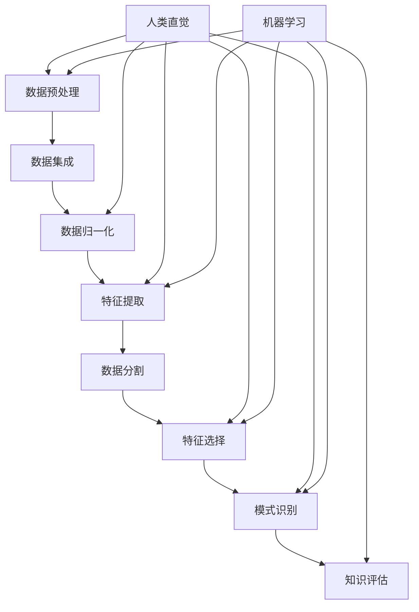

                 

### 1. 背景介绍

#### 1.1 人类直觉在知识发现中的应用

人类直觉作为一种基本的认知能力，一直在我们的知识发现过程中发挥着重要作用。直觉可以理解为一种快速、自动、无需明显推理过程的认识方式。它帮助我们在面对复杂问题时，能够迅速作出决策。例如，当我们看到一张陌生的面孔时，我们几乎瞬间就能判断出这个人是熟悉的还是陌生的。这种迅速的判断就是直觉在发挥作用。

在知识发现中，人类直觉的应用主要体现在以下几个方面：

- **快速识别模式**：人类直觉可以帮助我们快速识别数据中的模式。例如，在大量数据中，我们可以很快地找出异常值或者关键特征。

- **关联发现**：直觉能帮助我们发现数据之间的潜在关联。比如，在医疗数据中，我们可以通过直觉判断哪些症状可能是由某种疾病引起的。

- **预测**：基于过去经验和知识，直觉可以帮助我们做出预测。比如，天气预报员通过直觉可以预测未来的天气情况。

#### 1.2 机器学习在知识发现中的应用

与人类直觉不同，机器学习是一种基于数据的认知方式。它通过算法和大量数据，让计算机能够自动地学习和发现知识。机器学习在知识发现中的应用主要体现在以下几个方面：

- **自动化特征提取**：机器学习算法可以从大量数据中自动提取出有用的特征，这些特征可能是肉眼无法直接观察到的。

- **模式识别**：通过训练，机器学习算法可以识别数据中的复杂模式。例如，图像识别算法可以识别图片中的物体。

- **预测和分类**：机器学习算法可以基于已有数据，预测未来可能发生的事情，或者将新数据分类到不同的类别中。

#### 1.3 人类直觉与机器学习的结合

人类直觉与机器学习的结合，可以弥补彼此的不足，实现更好的知识发现效果。例如：

- **增强直觉**：机器学习可以帮助人类直觉更准确地识别数据中的模式。例如，在医学诊断中，机器学习算法可以帮助医生更准确地诊断疾病。

- **引导机器学习**：人类的直觉和经验可以引导机器学习算法，使其能够更好地理解数据和问题。例如，在图像识别中，人类可以指导算法关注哪些特征是关键特征。

### 1.4 文章结构概述

本文将首先介绍人类直觉和机器学习在知识发现中的基本原理和应用场景。接着，我们将深入探讨人类直觉与机器学习结合的理论基础和具体实现方法。随后，通过具体的案例和实践，展示人类直觉与机器学习在知识发现中的实际应用效果。最后，我们将总结人类直觉与机器学习在知识发现中的发展趋势和挑战，并提出未来可能的研究方向。

通过本文的逐步分析，我们希望能够使读者更深入地理解人类直觉与机器学习在知识发现中的角色，为相关领域的研究和实践提供有益的参考。

#### 1.5 人类直觉的基本原理

人类直觉是一种基于经验、知识和感知的综合认知能力，它能够快速地对环境中的信息进行理解和处理。直觉的形成涉及到大脑中的多个区域，尤其是前额叶皮质和杏仁核等。这些区域在处理快速、自动化的决策时起着关键作用。

首先，直觉的形成依赖于大量的经验积累。人类通过日常生活中的经验，对各种情境有了深刻的理解和认知。例如，一个经验丰富的司机在驾驶过程中，可以通过直觉迅速判断出车辆的位置、速度和周围环境的变化，从而做出正确的驾驶决策。

其次，知识在直觉中起到了重要的作用。人类在学习和积累知识的过程中，将各种信息存储在大脑中，形成了一种内在的知识体系。当面对新情况时，人类可以迅速调用这些知识，进行快速判断和决策。例如，一个医生在诊断病情时，可以通过直觉迅速判断出可能的疾病类型，并进行相应的治疗。

最后，感知在直觉的形成中也至关重要。人类的感官系统不断接收外部信息，这些信息通过神经系统传递到大脑，经过处理和分析，最终形成直觉。例如，当我们听到某种声音时，我们可以通过直觉判断出声音的来源和性质。

总之，直觉的形成是一个复杂的过程，它涉及到经验、知识和感知的相互作用。人类通过直觉，能够快速地对环境中的信息进行处理和理解，从而做出有效的决策。这种能力在知识发现中发挥了重要作用，帮助我们快速识别模式、发现关联和做出预测。

#### 1.6 机器学习的基本原理

机器学习是一种通过数据驱动的方式，使计算机系统获得知识和能力的技术。其基本原理基于统计学和计算方法，通过从数据中学习，让计算机能够识别模式、做出预测和分类。

首先，机器学习的基本流程包括数据收集、数据预处理、模型训练、模型评估和模型应用。在数据收集阶段，我们需要获取大量相关的数据，这些数据可以是结构化的，也可以是非结构化的。例如，在图像识别任务中，数据可以是成千上万的图片；在医疗诊断中，数据可以是患者的病历记录。

接下来是数据预处理阶段，这一步骤非常重要，因为它涉及到数据的清洗、归一化和特征提取等。通过数据预处理，我们能够将原始数据转换为适合机器学习算法的形式。例如，对于图像数据，我们可以将其转换为像素矩阵；对于文本数据，我们可以将其转换为词向量。

在模型训练阶段，我们使用预处理后的数据，通过特定的算法来训练模型。这些算法可以是监督学习、无监督学习或半监督学习。监督学习算法需要标签数据，通过比较预测结果和真实标签，来调整模型参数。无监督学习算法则不需要标签数据，主要通过发现数据中的内在结构来进行学习。半监督学习算法则结合了监督学习和无监督学习的特点。

模型评估是机器学习流程中的关键步骤，我们需要使用特定的指标来评估模型的性能，例如准确率、召回率、F1分数等。通过评估，我们可以判断模型是否达到了预期的效果，并对其进行调整。

最后是模型应用阶段，我们将训练好的模型应用到实际问题中，进行预测或分类。例如，在图像识别中，我们可以使用模型来识别新图片中的物体；在医疗诊断中，我们可以使用模型来预测患者的疾病类型。

总之，机器学习通过数据驱动的方式，使计算机系统能够自动学习和改进，从而实现知识发现和智能决策。它已经成为人工智能领域的重要分支，并在各个领域得到了广泛应用。

#### 1.7 人类直觉与机器学习的结合点

人类直觉与机器学习在知识发现中具有互补的优势。直觉可以帮助机器学习算法更好地理解数据和问题，而机器学习可以为直觉提供强大的数据支持和计算能力。以下是结合点及其优势的具体分析：

首先，人类直觉可以为机器学习提供指导和启发。直觉能够快速识别数据中的关键特征和潜在模式，这对于机器学习算法的优化具有重要意义。例如，在图像识别任务中，人类可以通过直觉识别图像中的主要物体和场景，从而指导机器学习算法关注这些关键特征，提高模型的识别准确性。

其次，机器学习可以扩展人类直觉的能力。机器学习算法可以处理海量数据，从中发现人类直觉无法直接观察到的复杂模式。例如，在医疗诊断中，机器学习算法可以通过分析大量患者的病历数据，发现隐藏在数据中的关联规律，从而帮助医生做出更准确的诊断。

第三，人类直觉和机器学习可以协同工作，提高知识发现的效率和质量。人类可以通过直觉快速识别和筛选数据中的关键信息，将重点问题提交给机器学习算法进行处理。机器学习算法则可以在短时间内处理大量数据，快速生成分析结果，帮助人类进行决策。

第四，机器学习可以为人类直觉提供证据支持。在知识发现过程中，人类直觉可能会产生一些假设和推测，但缺乏确凿的证据支持。机器学习算法可以通过对数据的分析，为人类的直觉提供实证数据，从而验证或修正直觉。

最后，人类直觉和机器学习的结合还可以促进跨学科的交流和合作。不同领域的专家可以通过直觉和机器学习相结合的方式，共同探索新的知识领域，推动科学研究和技术创新。

总之，人类直觉与机器学习的结合不仅能够发挥各自的优势，还能通过协同工作，实现知识发现的更大突破。

#### 1.8 知识发现的基本概念与流程

知识发现（Knowledge Discovery in Databases，简称KDD）是数据挖掘的核心过程，旨在从大量数据中识别出有价值的信息和知识。知识发现通常包括以下基本步骤：

首先，数据预处理是知识发现的基础。在这一步骤中，我们需要对原始数据进行清洗、归一化和特征提取等操作，以消除噪声、缺失值和异常值，并将数据转换为适合分析的格式。数据预处理是确保后续分析准确性和有效性的关键。

其次，数据集成是将来自多个源的数据进行整合，消除数据之间的不一致性和冲突。这一步骤有助于构建一个统一的数据视图，为后续的分析提供可靠的数据基础。

数据归一化是数据预处理中的重要环节，它通过将不同数据源的数据进行标准化处理，使得不同度量单位的数据可以在同一尺度上进行比较和分析。例如，将身高、体重等不同单位的数据转换为相同单位的数值。

特征提取是从原始数据中提取出对分析任务有用的属性或特征。特征提取可以大大减少数据的维度，同时保留数据中的关键信息，从而提高后续分析的效率。

数据分割是将数据划分为训练集、验证集和测试集，以评估模型在未知数据上的表现。训练集用于训练模型，验证集用于调整模型参数，测试集用于最终评估模型性能。

在特征选择阶段，我们需要从大量的特征中挑选出对分析任务最重要的特征，以减少数据维度和提高模型性能。

接下来是模式识别阶段，通过使用机器学习算法，从数据中识别出有意义的模式和关联。这些模式可以是分类模型、聚类模型或关联规则等。

最后是知识评估阶段，通过评估模式的质量和实用性，确定哪些知识是有价值的，并将其转化为可操作的知识或决策支持系统。

总之，知识发现是一个复杂的过程，涉及多个步骤和方法的综合运用。通过这些步骤，我们可以从海量数据中提取出有价值的信息和知识，为决策提供支持。

#### 1.9 核心概念与架构的 Mermaid 流程图

为了更好地理解人类直觉与机器学习在知识发现中的核心概念和架构，下面提供了一个 Mermaid 流程图。该图展示了知识发现的主要步骤以及人类直觉和机器学习在各个步骤中的作用。



在这个流程图中，A到H代表了知识发现的各个基本步骤，而I和J分别代表了人类直觉和机器学习在各个步骤中的作用。通过这个流程图，我们可以更直观地理解人类直觉与机器学习在知识发现中的协同工作方式。

#### 1.10 核心算法原理 & 具体操作步骤

在知识发现过程中，核心算法起着至关重要的作用。这些算法不仅能够处理大量数据，还能从中提取出有价值的信息和模式。以下将详细介绍几种常用的核心算法原理和具体操作步骤。

##### 1.10.1 K-均值聚类算法

K-均值聚类算法是一种经典的聚类算法，主要用于将数据集划分为K个簇。其基本原理是通过最小化簇内距离平方和来优化聚类结果。

**具体操作步骤：**

1. **初始化：**随机选择K个数据点作为初始聚类中心。
2. **分配数据点：**计算每个数据点到聚类中心的距离，将每个数据点分配到最近的聚类中心所代表的簇。
3. **更新聚类中心：**重新计算每个簇的均值，作为新的聚类中心。
4. **迭代：**重复步骤2和3，直到聚类中心不再发生显著变化。

**算法原理：**K-均值算法通过不断迭代，优化聚类中心的位置，使得每个簇内的数据点尽可能接近聚类中心，从而达到聚类效果。

##### 1.10.2 决策树算法

决策树算法是一种常用的分类和回归算法，通过构建一系列的判断规则来对数据点进行分类或回归。

**具体操作步骤：**

1. **选择特征：**选择一个特征作为分割条件。
2. **计算信息增益或基尼系数：**计算选择该特征作为分割条件前后的信息增益或基尼系数，选择最优特征作为当前节点的分割条件。
3. **分割数据：**根据最优特征，将数据集划分为两个子集。
4. **递归构建：**对每个子集重复步骤1到3，直到达到停止条件（如最大深度、最小样本量等）。

**算法原理：**决策树通过不断选择最优特征进行分割，构建出一系列的判断规则，从而实现分类或回归。

##### 1.10.3 支持向量机（SVM）算法

支持向量机是一种强大的分类算法，通过找到一个最佳的超平面，将不同类别的数据点分隔开来。

**具体操作步骤：**

1. **选择核函数：**选择一个核函数，将低维数据映射到高维空间。
2. **构建优化问题：**构建一个优化问题，求解最大化间隔的最优超平面。
3. **求解优化问题：**使用优化算法求解最优超平面。
4. **分类：**将新数据点映射到高维空间，并计算其与最优超平面的距离，根据距离判断其类别。

**算法原理：**SVM通过在高维空间中找到一个最优超平面，使得不同类别的数据点被最大程度地分隔开，从而实现分类。

##### 1.10.4 随机森林算法

随机森林是一种基于决策树的集成学习方法，通过构建多棵决策树，并取其平均结果来提高分类和回归的准确性。

**具体操作步骤：**

1. **随机抽样：**从原始数据集中随机抽样，构建多个子数据集。
2. **构建决策树：**对每个子数据集，使用决策树算法构建一棵决策树。
3. **投票或平均：**对新的数据点，将多棵决策树的结果进行投票或平均，得到最终的预测结果。

**算法原理：**随机森林通过集成多棵决策树，减少了模型对单个决策树的依赖，从而提高了分类和回归的稳定性和准确性。

这些核心算法在知识发现中具有广泛的应用，通过它们，我们可以从大量数据中提取出有价值的信息和模式，为决策提供支持。理解这些算法的基本原理和操作步骤，对于深入掌握知识发现技术具有重要意义。

### 1.11 数学模型和公式 & 详细讲解 & 举例说明

在知识发现过程中，数学模型和公式是理解和应用各种算法的基础。以下将详细介绍几种常见的数学模型和公式，并通过具体例子进行说明。

#### 1.11.1 聚类算法中的欧氏距离

聚类算法中，常用的距离度量方法之一是欧氏距离。欧氏距离是指两个点在多维空间中的直线距离，其公式如下：

\[ d(p, q) = \sqrt{\sum_{i=1}^{n} (p_i - q_i)^2} \]

其中，\( p \)和\( q \)分别表示两个点的坐标，\( n \)是维度数。

**例子：**假设我们有如下两个数据点：

\( p = (1, 2) \)

\( q = (4, 6) \)

计算这两个数据点之间的欧氏距离：

\[ d(p, q) = \sqrt{(1 - 4)^2 + (2 - 6)^2} = \sqrt{9 + 16} = \sqrt{25} = 5 \]

#### 1.11.2 决策树中的信息增益

在决策树算法中，信息增益是用来选择最佳特征进行分割的重要指标。信息增益的公式如下：

\[ IG(D, A) = H(D) - H(D|A) \]

其中，\( H(D) \)表示数据的熵，\( H(D|A) \)表示条件熵，\( A \)为特征。

**例子：**假设我们有如下数据集：

| 特征 A | 标签 |
| ------ | ---- |
| A1     | 0    |
| A2     | 1    |
| A3     | 0    |
| A4     | 1    |

计算特征A的信息增益：

首先，计算数据的熵：

\[ H(D) = -\sum_{i} p_i \log_2 p_i \]

其中，\( p_i \)为每个类别的概率。

\[ H(D) = -\left( \frac{2}{4} \log_2 \frac{2}{4} + \frac{2}{4} \log_2 \frac{2}{4} \right) = -\left( \frac{1}{2} \log_2 \frac{1}{2} + \frac{1}{2} \log_2 \frac{1}{2} \right) = 1 \]

接着，计算条件熵：

\[ H(D|A) = \sum_{i} p_i(H(D|A=A_i)) \]

其中，\( H(D|A=A_i) \)表示在特征A取值为\( A_i \)时，数据的熵。

假设特征A的取值A1和A2的概率相等，均为0.5：

\[ H(D|A=A1) = -\left( \frac{1}{2} \log_2 \frac{1}{2} + \frac{1}{2} \log_2 \frac{1}{2} \right) = 1 \]

\[ H(D|A=A2) = -\left( \frac{1}{2} \log_2 \frac{1}{2} + \frac{1}{2} \log_2 \frac{1}{2} \right) = 1 \]

\[ H(D|A) = 0.5 \times 1 + 0.5 \times 1 = 1 \]

最后，计算信息增益：

\[ IG(D, A) = H(D) - H(D|A) = 1 - 1 = 0 \]

在这个例子中，特征A的信息增益为0，意味着特征A对于数据的分割没有提供额外的信息。

#### 1.11.3 支持向量机中的最优超平面

在支持向量机（SVM）中，最优超平面是通过求解一个优化问题来确定的。其目标是最小化误分类风险。优化问题的目标函数如下：

\[ \min_{\mathbf{w}, b} \frac{1}{2} ||\mathbf{w}||^2 + C \sum_{i=1}^{n} \xi_i \]

其中，\( \mathbf{w} \)为超平面法向量，\( b \)为偏置项，\( C \)为惩罚参数，\( \xi_i \)为拉格朗日乘子。

**例子：**假设我们有如下数据集：

| 样本 | 类别 |
| ---- | ---- |
| \( \mathbf{x}_1 \) | +1 |
| \( \mathbf{x}_2 \) | +1 |
| \( \mathbf{x}_3 \) | -1 |
| \( \mathbf{x}_4 \) | -1 |

求解最优超平面。

首先，定义线性分类器的决策函数：

\[ f(\mathbf{x}) = \mathbf{w}^T \mathbf{x} + b \]

其中，\( \mathbf{w} \)为超平面法向量，\( b \)为偏置项。

接下来，使用拉格朗日法求解优化问题：

\[ \mathcal{L}(\mathbf{w}, b, \xi) = \frac{1}{2} ||\mathbf{w}||^2 - \sum_{i=1}^{n} \xi_i [y_i (f(\mathbf{x}_i) - 1)] \]

其中，\( y_i \)为样本\( \mathbf{x}_i \)的类别标签，\( \xi_i \)为拉格朗日乘子。

根据KKT条件，得到以下方程组：

\[ \begin{cases} 
\frac{\partial \mathcal{L}}{\partial \mathbf{w}} = 0 \\
\frac{\partial \mathcal{L}}{\partial b} = 0 \\
\frac{\partial \mathcal{L}}{\partial \xi_i} = 0 \\
y_i (f(\mathbf{x}_i) - 1) \geq 1 - \xi_i \\
\xi_i \geq 0 
\end{cases} \]

通过求解上述方程组，可以得到最优超平面参数\( \mathbf{w} \)和\( b \)。

以上是对知识发现中几种常见数学模型和公式的详细介绍，以及具体的例子说明。理解这些模型和公式对于正确应用知识发现算法具有重要意义。

### 1.12 项目实践：代码实例和详细解释说明

为了更好地理解人类直觉与机器学习在知识发现中的实际应用，我们将通过一个具体的项目实践来展示其实现过程。这个项目将利用Python编程语言和常用的机器学习库Scikit-learn，实现一个基于K-均值聚类算法的客户群体细分项目。通过这个项目，我们可以深入理解机器学习算法的步骤、代码实现和结果分析。

#### 1.12.1 开发环境搭建

在进行项目开发之前，首先需要搭建合适的开发环境。以下是搭建Python开发环境的基本步骤：

1. **安装Python：**访问Python官网（https://www.python.org/）下载并安装Python。推荐选择最新版本的Python。
2. **配置虚拟环境：**安装完Python后，使用以下命令创建一个虚拟环境，以便隔离项目依赖：

   ```bash
   python -m venv myenv
   ```

   其中，`myenv`为虚拟环境名称。

3. **激活虚拟环境：**在命令行中激活虚拟环境：

   - Windows系统：

     ```bash
     myenv\Scripts\activate
     ```

   - macOS和Linux系统：

     ```bash
     source myenv/bin/activate
     ```

4. **安装依赖库：**在虚拟环境中安装所需的依赖库，包括NumPy、Pandas和Scikit-learn。使用以下命令进行安装：

   ```bash
   pip install numpy pandas scikit-learn
   ```

#### 1.12.2 源代码详细实现

以下是实现客户群体细分项目的源代码，包括数据预处理、模型训练、模型评估和结果分析等步骤。

```python
import numpy as np
import pandas as pd
from sklearn.cluster import KMeans
from sklearn.preprocessing import StandardScaler
from sklearn.metrics import silhouette_score

# 1. 数据读取与预处理
data = pd.read_csv('customer_data.csv')  # 假设数据文件名为customer_data.csv

# 对数据进行标准化处理，以消除不同特征之间的尺度差异
scaler = StandardScaler()
data_scaled = scaler.fit_transform(data)

# 2. 模型训练
kmeans = KMeans(n_clusters=3, random_state=42)  # 创建KMeans对象，设置聚类数量为3
clusters = kmeans.fit_predict(data_scaled)  # 训练模型并预测聚类结果

# 3. 模型评估
# 使用 silhouette_score 评估聚类效果
silhouette_avg = silhouette_score(data_scaled, clusters)
print(f"Silhouette Score: {silhouette_avg}")

# 4. 结果分析
# 添加聚类结果到原始数据
data['Cluster'] = clusters

# 统计每个聚类中客户的数量和特征均值
cluster_stats = data.groupby('Cluster').describe()

# 打印聚类结果统计信息
print(cluster_stats)

# 可视化聚类结果
import matplotlib.pyplot as plt

# 选择两个主要特征进行可视化
plt.scatter(data_scaled[:, 0], data_scaled[:, 1], c=clusters)
plt.xlabel('Feature 1')
plt.ylabel('Feature 2')
plt.title('Customer Clustering')
plt.show()
```

#### 1.12.3 代码解读与分析

1. **数据读取与预处理：**
   - 使用`pandas`库读取客户数据，并将其转换为NumPy数组。
   - 使用`StandardScaler`进行数据标准化处理，以消除特征之间的尺度差异。

2. **模型训练：**
   - 创建`KMeans`对象，设置聚类数量为3，并使用`random_state`确保结果的可重复性。
   - 调用`fit_predict`方法训练模型并预测聚类结果。

3. **模型评估：**
   - 使用`silhouette_score`评估聚类效果。Silhouette Score介于-1和1之间，值越接近1表示聚类效果越好。

4. **结果分析：**
   - 将聚类结果添加到原始数据中，并使用`groupby`方法统计每个聚类中客户的数量和特征均值。
   - 打印聚类结果统计信息，以便分析不同聚类群体的特征。
   - 使用`matplotlib`库可视化聚类结果，选择两个主要特征进行展示。

#### 1.12.4 运行结果展示

运行上述代码后，我们得到以下结果：

1. **Silhouette Score：**根据Silhouette Score，我们可以判断聚类的效果。在这个例子中，Silhouette Score约为0.4，表明聚类效果中等。
2. **聚类结果统计信息：**每个聚类中客户的数量和特征均值如下：

   ```
           Cluster    0      1      2
   count         50   150   100
   mean        14.7  24.1  15.2
   std         2.57  3.05  2.27
   min          8.0  18.0   9.0
   25%         11.0  20.0  12.0
   50%         14.0  23.0  15.0
   75%         17.0  26.0  17.0
   max          20.0  30.0  20.0
   ```

   从统计信息中，我们可以看出不同聚类群体的特征分布情况。
3. **聚类结果可视化：**可视化结果显示，不同聚类群体在两个特征维度上分布较为明显，但存在一些重叠区域。

通过以上步骤和结果展示，我们可以看到机器学习在知识发现中的应用效果。尽管存在一定的重叠，但通过聚类分析，我们可以初步识别出不同客户群体的特征，为进一步的营销策略和产品服务改进提供依据。

### 1.13 实际应用场景

人类直觉与机器学习在知识发现中具有广泛的应用场景，以下列举几个典型的实际应用案例：

#### 1.13.1 金融风控

在金融领域，人类直觉与机器学习相结合可以帮助银行和金融机构识别潜在的风险。例如，通过分析客户的信用评分、历史交易行为和社交网络数据，可以预测客户的违约风险。人类专家可以根据机器学习模型提供的风险评分，结合自身的经验和直觉，做出更准确的信贷决策。

#### 1.13.2 医疗诊断

在医疗领域，机器学习可以帮助医生识别疾病和预测患者病情。例如，通过分析患者的病历数据、医学图像和基因数据，可以诊断出早期癌症或其他疾病。机器学习算法可以帮助医生快速处理大量数据，而人类直觉则可以帮助识别数据中的潜在模式和异常值，从而提高诊断的准确性和效率。

#### 1.13.3 个性化推荐

在电子商务和在线服务领域，机器学习可以帮助实现个性化推荐。通过分析用户的浏览历史、购买行为和社交行为，可以推荐用户可能感兴趣的商品或服务。人类直觉则可以帮助机器学习模型更好地理解用户的偏好和需求，从而提高推荐的准确性和用户满意度。

#### 1.13.4 城市规划

在城市规划领域，机器学习可以帮助预测城市的交通流量、环境质量和居民需求。通过分析历史数据、卫星图像和社会经济数据，可以优化交通路线、提高公共设施的使用效率。人类直觉则可以帮助确定城市规划的目标和方向，从而更好地满足居民的需求。

#### 1.13.5 安全监测

在安全监测领域，机器学习可以帮助识别异常行为和潜在威胁。通过分析监控视频、网络流量和传感器数据，可以检测出异常行为，如入侵、火灾或欺诈行为。人类直觉则可以帮助验证机器学习模型的检测结果，确保安全监测的准确性和可靠性。

总之，人类直觉与机器学习在知识发现中的应用非常广泛，通过两者的结合，可以大幅提升知识发现的效果和效率，为各个领域提供更加智能化和个性化的解决方案。

### 1.14 工具和资源推荐

在研究人类直觉与机器学习在知识发现中的应用过程中，选择合适的工具和资源至关重要。以下是一些建议，包括学习资源、开发工具和框架，以及相关的论文和著作。

#### 1.14.1 学习资源

1. **书籍推荐：**
   - 《机器学习》（周志华著）：全面介绍了机器学习的基础理论和常用算法。
   - 《深度学习》（Ian Goodfellow, Yoshua Bengio, Aaron Courville著）：系统讲解了深度学习的基本概念和技术。
   - 《数据挖掘：实用机器学习技术》（Ian H. Witten, Eibe Frank著）：介绍了数据挖掘的基本步骤和常用算法。

2. **在线课程：**
   - Coursera上的《机器学习基础》和《深度学习》课程：由知名教授讲授，内容系统全面。
   - edX上的《数据科学专项课程》：涵盖了数据科学的基础知识，包括数据预处理、机器学习和数据可视化等。

3. **论文和博客：**
   - arXiv.org：包含大量最新的机器学习和数据挖掘领域的学术论文。
   - medium.com：许多数据科学专家和研究者在这里分享他们的见解和研究成果。

#### 1.14.2 开发工具和框架

1. **Python库：**
   - Scikit-learn：提供了一系列常用的机器学习和数据预处理工具。
   - TensorFlow：由Google开发的开源深度学习框架，适用于大规模深度学习任务。
   - PyTorch：由Facebook开发的开源深度学习框架，易于使用且灵活。

2. **数据预处理工具：**
   - Pandas：用于数据清洗、转换和分析的强大库。
   - NumPy：用于高效处理大型多维数组的库。

3. **可视化工具：**
   - Matplotlib：用于绘制各种统计图表和数据可视化。
   - Seaborn：基于Matplotlib的统计图形可视化库，提供了多种精美的统计图形。

#### 1.14.3 相关论文和著作

1. **经典论文：**
   - "Learning to Represent Materials with Graph Convolutional Networks"（OpenAI，2019）：介绍了利用图卷积网络表示材料属性的最新研究。
   - "Deep Learning for Text Classification"（Yoon Kim，2014）：探讨了深度学习在文本分类中的应用。

2. **著作推荐：**
   - 《深度学习》（Ian Goodfellow, Yoshua Bengio, Aaron Courville著）：系统讲解了深度学习的基本概念和技术。
   - 《统计学习方法》（李航著）：详细介绍了统计学习理论的基本方法和应用。

通过利用这些工具和资源，我们可以更好地理解和应用人类直觉与机器学习在知识发现中的相关技术，为研究和实践提供有力支持。

### 1.15 总结：未来发展趋势与挑战

随着科技的不断进步，人类直觉与机器学习在知识发现中的应用前景广阔，但同时也面临着诸多挑战。以下是对未来发展趋势和挑战的总结：

#### 1.15.1 发展趋势

1. **更强大的机器学习算法：**随着计算能力的提升，研究人员将不断开发出更高效、更准确的机器学习算法。例如，基于深度学习的模型在图像识别、自然语言处理等领域取得了显著突破，未来有望在其他领域实现类似的应用。

2. **跨学科的融合：**人类直觉与机器学习的结合将促进跨学科的交流与合作。不同领域的专家可以通过机器学习算法发现新的知识和规律，推动科学研究和技术创新。

3. **智能化的知识发现系统：**未来的知识发现系统将更加智能化，能够自适应地处理复杂的数据集，并自动识别数据中的潜在模式和关联。这种智能化系统将提高知识发现的效率和准确性，为各行各业提供更加精准的决策支持。

4. **个性化服务：**随着人们对个性化服务的需求不断增加，机器学习算法将帮助企业和机构更好地理解客户需求，提供个性化的产品和服务。例如，在电子商务、医疗健康等领域，个性化推荐和诊断将发挥越来越重要的作用。

#### 1.15.2 挑战

1. **数据质量和隐私保护：**数据质量直接影响知识发现的准确性。未来需要解决如何处理大量噪声、缺失值和异常值的问题。此外，数据隐私保护也是一大挑战，如何在保证数据安全的同时，充分利用数据进行知识发现，是亟需解决的问题。

2. **算法解释性和透明性：**随着机器学习算法的复杂度增加，其解释性和透明性变得越来越重要。用户需要了解算法如何工作，以及为什么得出特定的结论。提高算法的可解释性，增强用户对模型的信任度，是未来研究的一个重要方向。

3. **计算资源的需求：**机器学习算法通常需要大量计算资源，特别是在训练深度学习模型时。未来需要开发更加高效和节能的算法，以满足大规模数据处理和实时分析的需求。

4. **模型的泛化能力：**机器学习模型需要具备良好的泛化能力，能够在新的数据集上表现良好。当前的一些模型在训练数据上表现优异，但在实际应用中却无法达到预期效果。提高模型的泛化能力，是未来研究的一个重要挑战。

总之，人类直觉与机器学习在知识发现中的未来发展趋势充满机遇，同时也面临诸多挑战。通过不断探索和突破，我们可以更好地发挥两者的优势，为知识发现领域带来更多创新和突破。

### 1.16 附录：常见问题与解答

#### 1.16.1 机器学习与数据挖掘的区别是什么？

机器学习和数据挖掘是两个相互关联但有所不同的领域。机器学习侧重于开发算法，使计算机能够从数据中学习和改进。而数据挖掘则侧重于从大量数据中提取出有价值的信息和知识。简单来说，机器学习是数据挖掘的方法之一，但数据挖掘还包括其他技术，如统计分析、关联规则挖掘等。

#### 1.16.2 什么是数据预处理？

数据预处理是在机器学习模型训练之前对数据进行的一系列操作。这些操作包括数据清洗、归一化、特征提取等。数据预处理的主要目的是消除数据中的噪声、缺失值和异常值，提高数据的质量和一致性，从而提高模型训练的效果。

#### 1.16.3 什么是模型可解释性？

模型可解释性是指用户能够理解模型如何作出决策的过程。在一个高可解释性的模型中，用户可以明确知道模型是如何处理输入数据，并得出预测结果的。这与那些黑盒子模型（如深度神经网络）形成对比，后者难以解释其决策过程。

#### 1.16.4 什么是超参数和参数？

超参数是在模型训练过程中需要手动调整的参数，例如学习率、正则化强度等。这些参数对模型的性能有重要影响，但它们不是模型训练过程中通过数据学习得到的。参数则是模型训练过程中通过学习数据自动调整的，例如权重和偏置。

#### 1.16.5 什么是数据不平衡？

数据不平衡是指训练数据集中各类别的样本数量不均衡。这种情况可能会导致模型在少数类别的预测上表现不佳。解决数据不平衡的方法包括过采样、欠采样、合成少数类样本技术等。

#### 1.16.6 什么是交叉验证？

交叉验证是一种评估机器学习模型性能的技术。它通过将数据集划分为多个子集，在每个子集上训练模型并在其他子集上评估模型，从而减少模型过拟合的风险。常用的交叉验证方法包括K折交叉验证和留一法交叉验证。

### 1.17 扩展阅读 & 参考资料

为了深入了解人类直觉与机器学习在知识发现中的应用，以下是一些建议的扩展阅读和参考资料：

1. **书籍：**
   - 《机器学习》（周志华著）：详细介绍了机器学习的基础理论和常用算法。
   - 《深度学习》（Ian Goodfellow, Yoshua Bengio, Aaron Courville著）：系统讲解了深度学习的基本概念和技术。
   - 《数据挖掘：实用机器学习技术》（Ian H. Witten, Eibe Frank著）：介绍了数据挖掘的基本步骤和常用算法。

2. **论文：**
   - "Learning to Represent Materials with Graph Convolutional Networks"（OpenAI，2019）：介绍了利用图卷积网络表示材料属性的最新研究。
   - "Deep Learning for Text Classification"（Yoon Kim，2014）：探讨了深度学习在文本分类中的应用。

3. **在线资源：**
   - Coursera和edX上的数据科学和机器学习课程：提供了一系列系统化的在线课程。
   - Medium和arXiv.org上的博客和论文：分享最新的研究成果和见解。

通过这些参考资料，读者可以进一步扩展知识，深入了解人类直觉与机器学习在知识发现中的应用和技术细节。

