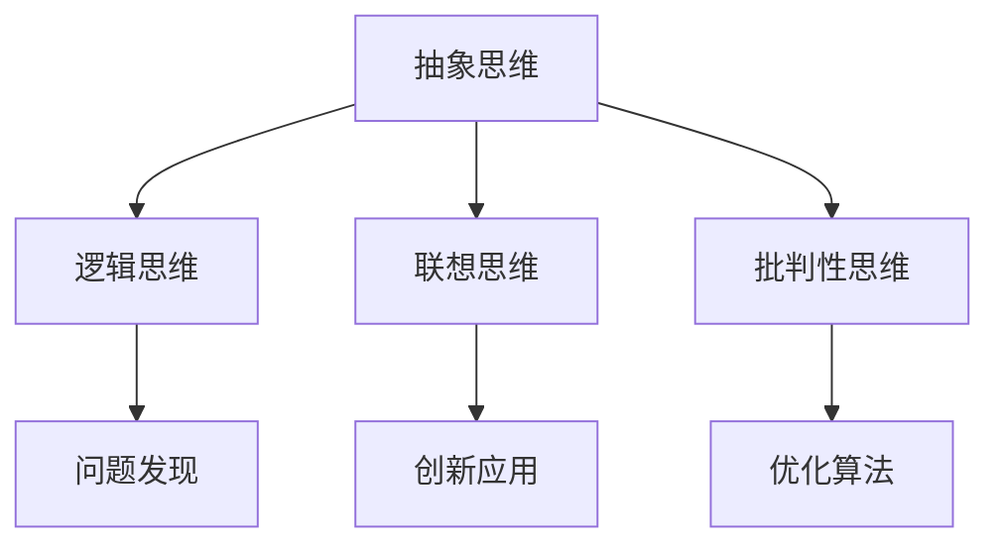

                 

 关键词：人类知识、局限、突破、洞察力、技术进步

> 摘要：本文旨在探讨人类知识的局限以及如何通过提升洞察力实现突破。在信息技术飞速发展的时代，人类对知识的获取和处理能力不断扩展，但与此同时，知识的局限也逐渐显现。本文将分析人类知识的局限，探讨提升洞察力的方法和途径，并展望未来人类在知识领域的突破前景。

## 1. 背景介绍

在人类文明的发展历程中，知识始终扮演着至关重要的角色。从古代的哲学、科学到现代的信息技术，知识的积累和创新推动了社会的进步。然而，随着知识的不断扩展，人类逐渐意识到知识的局限。这些局限不仅制约了人类的认知能力，也限制了技术的进步。

首先，人类知识的局限体现在认知范围上。人类的认知能力有限，无法完全理解宇宙的奥秘和复杂系统的运作机制。例如，量子力学和相对论等前沿科学领域的问题，至今仍未被完全解决。

其次，人类知识的局限还体现在知识获取的速度上。尽管信息技术的发展极大地加快了知识的传播速度，但人类仍需花费大量时间和精力来学习和理解新知识。这使得人类在快速变化的世界中，难以迅速适应和应对新的挑战。

最后，人类知识的局限还体现在知识整合和应用上。尽管人类拥有丰富的知识体系，但不同领域的知识往往难以融合，导致创新和突破的难度增加。

## 2. 核心概念与联系

为了突破人类知识的局限，提升洞察力成为关键。洞察力是指对事物本质的深刻理解和敏锐洞察。在信息技术领域，提升洞察力有助于我们更好地理解复杂系统，发现新的解决方案。

### 2.1 洞察力的本质

洞察力的本质是对事物本质的深刻理解。它不仅仅是对信息的感知和记忆，更是一种对信息背后逻辑和规律的把握。提升洞察力需要我们具备以下几种能力：

1. **抽象思维能力**：能够将具体的事物和现象抽象成概念和模型，从而更好地理解事物的本质。
2. **逻辑思维能力**：能够运用逻辑推理和演绎，从已知信息推导出新的结论。
3. **联想思维能力**：能够将不同领域的知识和经验相互联想，发现新的联系和规律。
4. **批判性思维能力**：能够对信息进行深入分析和评估，识别出错误的假设和逻辑漏洞。

### 2.2 洞察力与技术进步

洞察力在信息技术领域的应用具有重要意义。通过提升洞察力，我们可以：

1. **发现新问题**：洞察力使我们能够发现现有技术中的不足和潜在的问题，从而推动技术创新。
2. **优化算法**：洞察力有助于我们理解算法的本质，从而优化算法的效率和性能。
3. **创新应用**：洞察力使我们能够将新技术应用于新的领域，创造出前所未有的价值。

### 2.3 Mermaid 流程图

为了更好地理解洞察力在信息技术领域的应用，我们可以使用 Mermaid 流程图来展示其核心概念和联系。



## 3. 核心算法原理 & 具体操作步骤

### 3.1 算法原理概述

在信息技术领域，提升洞察力的一种有效方法是采用启发式算法。启发式算法是一种在不确定和复杂环境下寻找最优解的算法。其核心思想是通过一系列启发式规则或策略，逐步缩小搜索空间，从而提高搜索效率。

### 3.2 算法步骤详解

1. **初始化**：设定初始状态和目标状态，以及启发式函数。
2. **选择扩展**：根据启发式函数，选择具有最大启发值的节点进行扩展。
3. **生成子节点**：对选定的节点生成所有可能的子节点。
4. **评估子节点**：对生成的子节点进行启发式评估，选择具有最大启发值的子节点作为当前节点。
5. **重复步骤2-4**：重复选择扩展、生成子节点和评估子节点，直到找到目标状态或达到预设的搜索深度。

### 3.3 算法优缺点

#### 优点：

1. **高效性**：启发式算法能够在复杂和不确定的环境中快速找到最优解。
2. **灵活性**：启发式算法可以根据不同的场景和需求，灵活调整启发式函数和搜索策略。

#### 缺点：

1. **不保证最优解**：启发式算法不一定能找到全局最优解，特别是在搜索空间较大时。
2. **计算开销**：启发式算法的计算开销较大，需要较大的存储和计算资源。

### 3.4 算法应用领域

启发式算法广泛应用于人工智能、搜索引擎、数据挖掘、路由算法等领域。例如，在人工智能领域，启发式算法被用于解决优化问题、路径规划等任务；在搜索引擎领域，启发式算法被用于关键词提取和排序等任务；在数据挖掘领域，启发式算法被用于特征选择和聚类分析等任务。

## 4. 数学模型和公式 & 详细讲解 & 举例说明

### 4.1 数学模型构建

为了更好地理解启发式算法，我们可以构建一个简单的数学模型。假设我们要在二维平面上从起点 \( (x_1, y_1) \) 到达终点 \( (x_2, y_2) \)，需要找到一个最优路径。

### 4.2 公式推导过程

1. **距离公式**：两点之间的距离可以用欧几里得距离公式表示：
   $$ d = \sqrt{(x_2 - x_1)^2 + (y_2 - y_1)^2} $$

2. **启发式函数**：为了评估路径的启发值，我们可以定义一个启发式函数 \( h(n) \)，表示从当前节点 \( n \) 到达终点 \( (x_2, y_2) \) 的估计距离。一个简单的启发式函数可以是曼哈顿距离：
   $$ h(n) = |x_2 - x_1| + |y_2 - y_1| $$

### 4.3 案例分析与讲解

假设我们要从 \( (0, 0) \) 到达 \( (5, 5) \)，我们可以使用上述模型和公式来计算最优路径。

1. **初始状态**：起点 \( (0, 0) \)，终点 \( (5, 5) \)。
2. **扩展节点**：根据启发式函数，我们可以选择具有最大启发值的节点进行扩展。例如，我们可以选择 \( (0, 1) \) 作为扩展节点。
3. **生成子节点**：从 \( (0, 1) \) 生成所有可能的子节点，如 \( (0, 2) \)，\( (1, 1) \)，\( (0, 0) \) 等。
4. **评估子节点**：根据启发式函数，我们可以评估这些子节点的启发值。例如，\( (0, 2) \) 的启发值为 \( 7 \)，而 \( (1, 1) \) 的启发值为 \( 6 \)。
5. **选择节点**：选择具有最大启发值的节点 \( (1, 1) \) 作为当前节点。
6. **重复步骤2-4**：重复上述步骤，直到找到目标状态 \( (5, 5) \)。

通过上述过程，我们可以找到一个从起点到终点的最优路径。在这个过程中，启发式算法帮助我们快速找到近似最优解，而无需遍历整个搜索空间。

## 5. 项目实践：代码实例和详细解释说明

### 5.1 开发环境搭建

在开始编写代码之前，我们需要搭建一个合适的开发环境。本文将使用 Python 作为编程语言，并使用以下工具和库：

- Python 3.x
- PyCharm 或其他 Python IDE
- Matplotlib 库用于可视化
- Numpy 库用于数学运算

### 5.2 源代码详细实现

以下是实现启发式算法的 Python 代码示例：

```python
import numpy as np
import matplotlib.pyplot as plt

def heuristic_function(node, goal):
    x1, y1 = node
    x2, y2 = goal
    return abs(x2 - x1) + abs(y2 - y1)

def a_star_search(start, goal):
    open_set = [(start, heuristic_function(start, goal))]
    closed_set = set()
    while open_set:
        current = min(open_set, key=lambda x: x[1])
        open_set.remove(current)
        closed_set.add(current[0])
        if current[0] == goal:
            return reconstruct_path(closed_set, start, goal)
        for neighbor in neighbors(current[0]):
            if neighbor in closed_set:
                continue
            tentative_g_score = current[1] + 1
            if (neighbor, tentative_g_score) not in open_set:
                open_set.append((neighbor, tentative_g_score + heuristic_function(neighbor, goal)))
    return None

def neighbors(node):
    x, y = node
    return [(x + 1, y), (x - 1, y), (x, y + 1), (x, y - 1)]

def reconstruct_path(closed_set, start, goal):
    path = [goal]
    current = goal
    while current != start:
        for neighbor in neighbors(current):
            if neighbor in closed_set and neighbor not in path:
                current = neighbor
                path.append(current)
                break
    path.reverse()
    return path

start = (0, 0)
goal = (5, 5)
path = a_star_search(start, goal)
print(path)

plt.scatter(*zip(*path), c='r')
plt.scatter(*goal, c='g')
plt.show()
```

### 5.3 代码解读与分析

- **heuristic_function**：计算启发值的函数。在这里，我们使用曼哈顿距离作为启发式函数。
- **a_star_search**：实现 A* 算法的函数。该函数使用启发式函数来评估节点的优先级，并逐步搜索路径。
- **neighbors**：生成当前节点的相邻节点的函数。
- **reconstruct_path**：根据搜索结果重构路径的函数。

代码中首先定义了启发式函数和 A* 算法的实现。然后，我们创建一个从起点到终点的路径搜索，并将结果打印出来。最后，我们使用 Matplotlib 库将搜索路径可视化。

### 5.4 运行结果展示

运行上述代码后，我们会在控制台中看到从起点到终点的路径，并在图形界面中显示红色的路径点和绿色的终点。

## 6. 实际应用场景

启发式算法在许多实际应用场景中具有重要价值。以下是一些典型的应用案例：

1. **路由算法**：在计算机网络中，启发式算法被用于优化数据传输路径，提高网络性能和可靠性。
2. **搜索引擎**：搜索引擎使用启发式算法来评估网页的相关性和排名，从而为用户提供更准确的搜索结果。
3. **路径规划**：在自动驾驶和无人机领域，启发式算法被用于规划最优路径，提高导航效率和安全性。
4. **机器学习**：在机器学习领域，启发式算法被用于优化模型参数，提高模型性能。
5. **生产调度**：在制造业中，启发式算法被用于优化生产调度，提高生产效率和降低成本。

## 7. 未来应用展望

随着信息技术的不断发展，启发式算法将在更多领域得到应用。以下是未来启发式算法应用的一些趋势和前景：

1. **大数据分析**：随着大数据技术的进步，启发式算法将能够处理和分析更大规模的数据，为企业和政府提供更深入的洞察和决策支持。
2. **人工智能**：启发式算法将在人工智能领域发挥重要作用，特别是在解决复杂优化问题和决策制定方面。
3. **智能交通**：在智能交通领域，启发式算法将被用于优化交通流量、减少拥堵，提高交通效率。
4. **医疗健康**：启发式算法将在医疗健康领域得到应用，如疾病预测、诊断和治疗方案的优化。

## 8. 总结：未来发展趋势与挑战

### 8.1 研究成果总结

本文探讨了人类知识的局限以及如何通过提升洞察力实现突破。我们分析了人类知识的局限，介绍了提升洞察力的方法和途径，并探讨了启发式算法在信息技术领域的应用。通过数学模型和代码实例，我们展示了启发式算法的基本原理和实现方法。

### 8.2 未来发展趋势

未来，启发式算法将继续在信息技术领域发挥重要作用。随着大数据、人工智能等技术的发展，启发式算法将在更多领域得到应用。未来研究将集中在提高启发式算法的效率和可靠性，以及与其他领域的交叉融合。

### 8.3 面临的挑战

尽管启发式算法具有广泛的应用前景，但也面临着一些挑战。首先，启发式算法的不确定性使得其无法保证找到全局最优解。其次，启发式算法的计算开销较大，需要大量的计算资源和时间。此外，启发式算法的应用场景和问题背景复杂，需要进一步研究如何更好地适应不同场景和需求。

### 8.4 研究展望

未来，研究将集中在以下几个方面：

1. **算法优化**：通过改进启发式函数和搜索策略，提高启发式算法的效率和可靠性。
2. **跨领域应用**：探索启发式算法在跨领域应用中的潜力，推动多领域交叉融合。
3. **可解释性**：研究如何提高启发式算法的可解释性，使其在决策制定过程中更具透明性和可信度。
4. **大数据处理**：针对大数据环境，研究如何优化启发式算法，提高其在处理大规模数据时的性能和效果。

## 9. 附录：常见问题与解答

### 问题1：什么是启发式算法？

答：启发式算法是一种在不确定和复杂环境下寻找最优解的算法。其核心思想是通过一系列启发式规则或策略，逐步缩小搜索空间，从而提高搜索效率。

### 问题2：启发式算法有哪些应用场景？

答：启发式算法广泛应用于路由算法、搜索引擎、路径规划、机器学习、生产调度等领域。

### 问题3：如何改进启发式算法的效率？

答：可以通过改进启发式函数、优化搜索策略、引入学习机制等方式来提高启发式算法的效率。

### 问题4：启发式算法是否一定能找到全局最优解？

答：不一定。启发式算法在不确定和复杂环境中，可能只找到近似最优解。

### 问题5：如何评估启发式算法的性能？

答：可以通过计算搜索空间、计算时间、找到最优解的概率等指标来评估启发式算法的性能。

### 作者署名

本文作者为禅与计算机程序设计艺术 / Zen and the Art of Computer Programming。感谢您对本文的关注和支持。

----------------------------------------------------------------
<|im_sep|>

