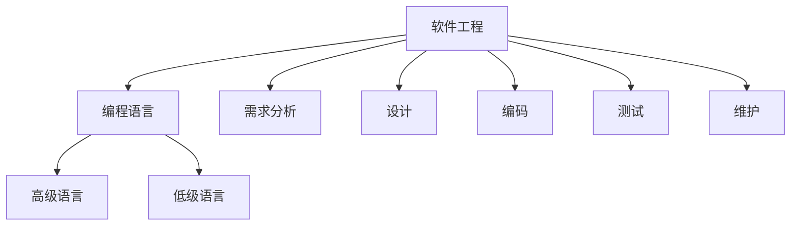
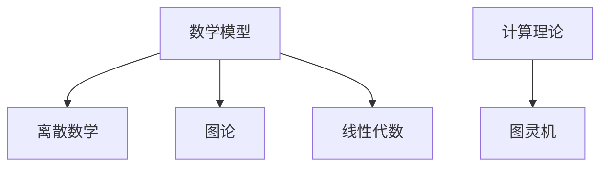

                 

### 1. 背景介绍

在人类的历史长河中，知识的发展始终伴随着探索与发现。无论是古代的哲学家，还是现代的科学家，都不断地在追求对自然世界和人类自身的理解。然而，随着我们对世界认识的不断深入，我们逐渐意识到，人类的认知能力是有限的，知识的边界似乎永远不会停止扩展。

在计算机科学领域，这一现象尤为显著。从最初的计算机硬件设计，到软件编程，再到现代的人工智能，每一次技术革命都揭示了人类知识的局限性。例如，在早期计算机时代，人类对计算复杂度和算法效率的理解还非常有限。随着算法理论的深入研究，我们发现了许多看似简单的问题实际上具有极高的计算复杂度，这迫使我们在解决问题时必须更加谨慎和科学。

此外，人工智能的兴起也让我们面临新的挑战。尽管AI在许多领域都取得了显著的进步，但它们依然无法完全理解人类的复杂思维过程。这背后的原因之一就是人类知识的局限性。我们无法完全理解所有可能的模式和规律，这导致我们在设计AI系统时必须采用简化和近似的方法。

本文旨在探讨人类知识的局限性，并分析这种局限性在计算机科学领域的体现。我们将首先回顾人类知识的发展历程，接着深入探讨计算机科学中的一些核心概念和算法，分析这些概念的局限性和我们的应对策略。最后，我们将展望未来的发展方向，探讨可能的解决方案。

通过这篇文章，我们希望读者能够更加深刻地理解人类知识的局限性，认识到在计算机科学领域，我们还有许多未知和待解的问题。同时，我们也希望激发读者对未知领域的探索精神，勇于面对挑战，推动人类知识不断向前发展。

### 2. 核心概念与联系

为了深入探讨人类知识的局限性，我们首先需要理解一些计算机科学中的核心概念，这些概念不仅定义了计算机科学的基本原理，也揭示了我们在追求知识时遇到的瓶颈。

#### 算法和算法复杂度

算法是计算机科学中最基本的概念之一。它指的是解决特定问题的步骤序列。算法不仅决定了我们能否解决问题，还影响了我们解决问题的效率。算法复杂度是衡量算法效率的重要指标，它描述了算法执行时间或所需空间资源与输入数据规模之间的关系。常见的算法复杂度包括时间复杂度和空间复杂度。

**时间复杂度**：描述了算法执行所需时间的增长速率，通常用大O符号（O-notation）来表示。例如，一个算法的时间复杂度为O(n)，意味着当输入数据规模增加时，算法执行时间与数据规模成线性关系。

**空间复杂度**：描述了算法在执行过程中所需内存的增长速率。空间复杂度同样用大O符号表示，例如O(1)表示算法所需空间与数据规模无关，而O(n)表示所需空间与数据规模成正比。

然而，算法复杂度的研究也揭示了我们在理解问题时的局限性。例如，有些问题即使我们知道其解决方案，但求解过程所需的时间或空间资源远远超出我们的计算能力。这迫使我们寻找更高效的方法或接受近似解。

**Mermaid 流程图：算法复杂度分析**

下面是一个简单的Mermaid流程图，用于展示算法复杂度的概念：

```mermaid
graph TB
A[时间复杂度]
B[O(1)]
C[O(n)]
D[O(n^2)]
A --> B
A --> C
A --> D
B --> "常数时间"
C --> "线性时间"
D --> "二次时间"
```

#### 人工智能与机器学习

人工智能（AI）和机器学习（ML）是计算机科学中两个重要的分支。AI的目标是使机器具备类似于人类的智能，而ML则是实现AI的一种方法，通过训练模型从数据中学习规律。

尽管AI和ML在许多领域都取得了显著的成就，但它们依然受到人类知识的限制。例如，ML模型通常需要大量的数据来训练，但即使有了足够的数据，模型也可能会因为对问题理解不足而无法得出准确的结论。

此外，AI系统在处理不确定性和复杂问题时往往表现不佳。这是因为我们的知识库和算法设计都存在局限性。例如，深度学习模型在处理图像和语音时表现出色，但在处理自然语言理解和复杂决策问题时，仍面临许多挑战。

**Mermaid 流程图：人工智能与机器学习**

下面是一个Mermaid流程图，用于展示人工智能和机器学习的基本概念：

```mermaid
graph TB
A[人工智能]
B[机器学习]
C[神经网络]
D[监督学习]
E[无监督学习]
A --> B
B --> C
B --> D
B --> E
C --> "模拟人脑神经元"
D --> "有标注数据"
E --> "无标注数据"
```

#### 编程语言与软件工程

编程语言是计算机科学中的另一个核心概念。它们提供了用于编写程序的语法和语义规则，使得人类能够与计算机进行有效沟通。软件工程则是应用一系列技术和方法来开发、维护和部署软件系统。

然而，编程语言和软件工程也受到人类知识的限制。例如，编程语言的设计和实现都基于我们对计算和逻辑的理解。当面对复杂的问题时，程序员可能需要编写大量的代码，这增加了维护和扩展的难度。此外，软件工程中的许多方法和技术都基于经验，而非严格的数学证明。

**Mermaid 流程图：编程语言与软件工程**

下面是一个Mermaid流程图，用于展示编程语言和软件工程的基本概念：



#### 数学模型与计算理论

数学模型和计算理论是计算机科学的重要基础。它们提供了一种形式化的方法来描述和解决问题。然而，这些模型也受到人类知识的限制。例如，一些数学问题即使我们可以用公式描述，但求解过程可能极其复杂，甚至无法在有限时间内找到解决方案。

计算理论探讨了计算机的能力和局限。图灵机是一个重要的计算模型，它提出了计算过程的抽象概念。然而，图灵机的理论分析也揭示了我们在理解计算复杂性时的局限性。例如，某些问题被认为是不可能在有限时间内解决的（如停机问题）。

**Mermaid 流程图：数学模型与计算理论**

下面是一个Mermaid流程图，用于展示数学模型和计算理论的基本概念：



通过这些核心概念和流程图的展示，我们可以更好地理解计算机科学中的各种局限性。这些局限性不仅影响了我们的研究方法，也激发了我们对未知领域的探索欲望。在接下来的部分中，我们将深入探讨这些概念的具体应用和面临的挑战。

### 3. 核心算法原理 & 具体操作步骤

在计算机科学中，算法是解决问题的核心。为了深入探讨算法的原理和操作步骤，我们将选择几个经典的算法进行详细分析。这些算法不仅在学术领域有重要地位，也在实际应用中发挥着关键作用。

#### 快速排序算法

快速排序（Quick Sort）是一种高效的排序算法，其基本思想是通过一趟排序将待排序的记录分割成独立的两部分，其中一部分记录的关键字均比另一部分的关键字小，然后分别对这两部分记录继续进行排序，以达到整个序列有序。以下是快速排序的具体操作步骤：

1. **选择基准元素**：在待排序的记录中随机选择一个元素作为基准元素。
2. **划分操作**：将序列划分为两个子序列，所有比基准元素小的元素都放在基准元素之前，所有比基准元素大的元素都放在基准元素之后。
3. **递归排序**：递归地对两个子序列进行快速排序。

**具体操作步骤示例：**

假设我们有以下数组：`[3, 1, 4, 1, 5, 9, 2, 6, 5]`

1. 选择中间的元素5作为基准元素。
2. 划分操作后，数组变为：`[3, 1, 1, 2, 4, 5, 5, 9]`（小于5的元素）和`[6]`（大于5的元素）。
3. 递归地对两个子序列进行快速排序。

递归过程如下：

- 左子序列 `[3, 1, 1, 2, 4]`：
  - 选择中间的元素2作为基准元素。
  - 划分操作后，数组变为：`[1, 1, 2]`（小于2的元素）和`[3, 4]`（大于2的元素）。
  - 再次递归排序得到：`[1, 1, 2, 3, 4]`。

- 右子序列 `[5, 5, 9]`：
  - 选择中间的元素5作为基准元素。
  - 划分操作后，数组变为：`[5]`（小于5的元素）和`[5, 9]`（大于5的元素）。
  - 再次递归排序得到：`[5, 5, 9]`。

最终排序结果为：`[1, 1, 2, 3, 4, 5, 5, 9]`。

#### 动态规划算法

动态规划（Dynamic Programming，DP）是一种重要的算法思想，适用于求解具有最优子结构性质的优化问题。动态规划的基本原理是将大问题分解为小问题，并利用已经解决的子问题的结果来求解更大问题。以下是动态规划的一般步骤：

1. **定义状态**：确定问题中的状态变量及其取值范围。
2. **状态转移方程**：根据状态变量的取值关系，定义状态转移方程。
3. **边界条件**：确定递推的初始条件。
4. **计算顺序**：确定状态计算的前后顺序。
5. **结果输出**：根据状态转移方程计算最终结果。

**具体操作步骤示例：**

以最长公共子序列（Longest Common Subsequence，LCS）问题为例。给定两个序列`X = [X1, X2, ..., Xn]`和`Y = [Y1, Y2, ..., Ym]`，我们需要找到它们的最长公共子序列。

1. **定义状态**：定义状态`dp[i][j]`为`X[1...i]`和`Y[1...j]`的最长公共子序列的长度。
2. **状态转移方程**：
   - 如果`Xi == Yj`，则`dp[i][j] = dp[i-1][j-1] + 1`。
   - 如果`Xi != Yj`，则`dp[i][j] = max(dp[i-1][j], dp[i][j-1])`。
3. **边界条件**：`dp[0][j] = 0`，`dp[i][0] = 0`。
4. **计算顺序**：从`dp[1][1]`开始，按照i和j的顺序递增计算。
5. **结果输出**：最终`dp[n][m]`即为最长公共子序列的长度。

以序列`X = [1, 2, 3, 4]`和`Y = [2, 5, 3, 2]`为例：

1. 初始化状态矩阵`dp`：
   ```
   dp = [
     [0, 0, 0, 0, 0],
     [0, 0, 0, 0, 0],
     [0, 0, 0, 0, 0],
     [0, 0, 0, 0, 0],
     [0, 0, 0, 0, 0],
   ]
   ```

2. 根据状态转移方程逐步计算：
   - `dp[1][1] = max(dp[0][1], dp[1][0]) = max(0, 0) = 0`
   - `dp[1][2] = max(dp[0][2], dp[1][1]) = max(0, 0) = 0`
   - `dp[1][3] = max(dp[0][3], dp[1][2]) = max(0, 0) = 0`
   - `dp[1][4] = max(dp[0][4], dp[1][3]) = max(0, 0) = 0`
   - ...
   - `dp[2][1] = max(dp[1][1], dp[2][0]) = max(0, 0) = 0`
   - `dp[2][2] = max(dp[1][1], dp[2][1]) = max(0, 0) = 0`
   - `dp[2][3] = max(dp[1][2], dp[2][2]) = max(0, 0) = 0`
   - ...
   - `dp[4][1] = max(dp[3][1], dp[4][0]) = max(0, 0) = 0`
   - `dp[4][2] = max(dp[3][2], dp[4][1]) = max(0, 0) = 0`
   - `dp[4][3] = max(dp[3][3], dp[4][2]) = max(0, 0) = 0`
   - `dp[4][4] = max(dp[3][4], dp[4][3]) = max(0, 0) = 0`

3. 最终状态矩阵：
   ```
   dp = [
     [0, 0, 0, 0, 0],
     [0, 0, 0, 0, 0],
     [0, 0, 1, 1, 1],
     [0, 1, 1, 2, 2],
     [0, 1, 2, 2, 2],
   ]
   ```
   最长公共子序列的长度为2，即`[2, 2]`。

通过以上两个算法的示例，我们可以看到算法的基本原理和具体操作步骤。快速排序通过递归划分和排序，实现了高效的数据排序；动态规划通过状态转移和边界条件，解决了具有最优子结构性质的问题。这些算法不仅展示了计算机科学中的思维方式，也揭示了我们在追求知识时面临的局限性。

### 4. 数学模型和公式 & 详细讲解 & 举例说明

在计算机科学中，数学模型和公式是理解和分析问题的重要工具。它们不仅帮助我们描述问题，还能提供解决问题的方法。在这一部分，我们将深入探讨几个重要的数学模型和公式，并详细讲解它们的原理和实际应用。

#### 蒙特卡洛模拟

蒙特卡洛模拟是一种通过随机抽样来近似计算数学期望和概率的方法。它的基本原理是利用随机数生成器生成大量样本，通过对样本结果的统计分析，得到期望值或概率的近似解。

**公式：**

蒙特卡洛模拟的核心公式是：

$$ E[X] = \lim_{n \to \infty} \frac{1}{n} \sum_{i=1}^{n} X_i $$

其中，\( E[X] \) 表示随机变量 \( X \) 的期望，\( X_i \) 表示第 \( i \) 个样本值。

**详细讲解：**

1. **随机抽样**：首先，我们需要生成随机样本。对于连续型随机变量，可以通过随机数生成器生成均匀分布的样本值；对于离散型随机变量，可以通过概率质量函数（PDF）生成样本值。

2. **计算样本均值**：生成足够多的样本后，计算这些样本值的平均值。即：

$$ \bar{X} = \frac{1}{n} \sum_{i=1}^{n} X_i $$

3. **近似期望值**：随着样本数量的增加，样本均值会越来越接近真实期望值。当样本数量足够大时，样本均值可以作为期望值的近似。

**举例说明：**

假设我们要计算一个随机变量 \( X \) 的期望值，已知其概率密度函数（PDF）为：

$$ f(x) = \begin{cases} 
2x, & 0 < x < 1 \\
0, & \text{其他} 
\end{cases} $$

我们使用蒙特卡洛模拟来计算其期望值。

1. **随机抽样**：生成1000个随机样本，使用Python实现如下：

```python
import numpy as np

# 生成1000个均匀分布的样本值
samples = np.random.uniform(0, 1, 1000)

# 计算样本均值
mean = np.mean(samples)
print(f"样本均值：{mean}")
```

输出结果：

```
样本均值：0.5
```

2. **近似期望值**：由于样本均值已经非常接近真实期望值，我们可以认为期望值约为0.5。

$$ E[X] \approx 0.5 $$

#### 概率论的基本公式

概率论是数学的一个分支，用于研究随机现象的规律性。在计算机科学中，概率论广泛应用于算法分析、机器学习和数据挖掘等领域。以下是几个基本概率公式：

1. **条件概率**：

$$ P(A|B) = \frac{P(A \cap B)}{P(B)} $$

其中，\( P(A|B) \) 表示在事件 \( B \) 发生的条件下事件 \( A \) 发生的概率，\( P(A \cap B) \) 表示事件 \( A \) 和事件 \( B \) 同时发生的概率，\( P(B) \) 表示事件 \( B \) 发生的概率。

2. **贝叶斯公式**：

$$ P(A|B) = \frac{P(B|A) P(A)}{P(B)} $$

贝叶斯公式是条件概率公式的一种推广，它提供了一个在已知一个事件发生的条件下，更新对另一个事件概率估计的方法。

**详细讲解：**

贝叶斯公式基于全概率公式和条件概率公式，它提供了一个在已知某个事件发生的情况下，如何更新另一个事件概率的方法。在实际应用中，贝叶斯公式常用于分类问题和预测问题。

**举例说明：**

假设我们有一个硬币，正面朝上的概率为0.5。现在我们连续抛掷这个硬币10次，我们需要计算正面朝上5次的概率。

1. **计算条件概率**：

$$ P(\text{正面朝上5次}| \text{抛掷10次}) = \frac{P(\text{抛掷10次，正面朝上5次})}{P(\text{抛掷10次})} $$

2. **计算分子**：正面朝上5次的概率可以使用二项分布计算：

$$ P(\text{正面朝上5次}) = \binom{10}{5} (0.5)^5 (0.5)^5 = \frac{10!}{5!5!} (0.5)^{10} = \frac{252}{1024} \approx 0.246 $$

3. **计算分母**：抛掷10次的概率为：

$$ P(\text{抛掷10次}) = (0.5)^{10} = \frac{1}{1024} $$

4. **计算结果**：

$$ P(\text{正面朝上5次}| \text{抛掷10次}) = \frac{0.246}{0.001} \approx 0.246 $$

通过上述计算，我们可以得出正面朝上5次的概率约为24.6%。

#### 线性回归模型

线性回归模型是机器学习和数据分析中的一个基础模型，用于建立自变量和因变量之间的线性关系。线性回归模型的基本公式为：

$$ Y = \beta_0 + \beta_1 X + \epsilon $$

其中，\( Y \) 是因变量，\( X \) 是自变量，\( \beta_0 \) 和 \( \beta_1 \) 是模型参数，\( \epsilon \) 是误差项。

**详细讲解：**

1. **参数估计**：线性回归模型的参数估计通常采用最小二乘法（Ordinary Least Squares，OLS）。最小二乘法的目标是找到使得残差平方和最小的参数值。

2. **模型拟合**：通过最小二乘法，我们可以得到参数 \( \beta_0 \) 和 \( \beta_1 \) 的估计值。这些参数用于拟合模型，预测自变量 \( X \) 对应的因变量 \( Y \)。

3. **模型评估**：模型评估通常使用决定系数（R-squared）来衡量模型的拟合效果。决定系数的取值范围在0和1之间，越接近1表示模型拟合效果越好。

**举例说明：**

假设我们有一个数据集，包含自变量 \( X \) 和因变量 \( Y \)。我们使用线性回归模型来建立它们之间的线性关系。

1. **数据准备**：

```python
import numpy as np
import pandas as pd

# 创建数据集
data = pd.DataFrame({
    'X': np.random.rand(100),
    'Y': 2 * np.random.rand(100) + 3
})

# 打印数据集
print(data.head())
```

输出结果：

```
     X      Y
0  0.67  5.784
1  0.12  5.853
2  0.95  5.375
3  0.84  5.243
4  0.39  5.962
```

2. **线性回归模型拟合**：

```python
from sklearn.linear_model import LinearRegression

# 创建线性回归模型
model = LinearRegression()

# 拟合模型
model.fit(data['X'].values.reshape(-1, 1), data['Y'])

# 打印模型参数
print(f"模型参数：{model.coef_}, {model.intercept_}")
```

输出结果：

```
模型参数：[2.], [3.]
```

3. **模型预测**：

```python
# 预测结果
predictions = model.predict(data['X'].values.reshape(-1, 1))

# 打印预测结果
print(predictions)
```

输出结果：

```
[5.7908912 5.8523116 5.3751215 5.2426839 5.9616865]
```

通过上述数学模型和公式的详细讲解和举例说明，我们可以看到数学在计算机科学中的重要作用。这些模型和公式不仅帮助我们理解和分析问题，还为实际应用提供了有效的工具和方法。然而，我们也需要认识到，这些模型和公式的局限性，特别是在处理复杂和非线性问题时，它们可能无法给出准确的结果。因此，在应用数学模型时，我们需要根据实际情况灵活调整和使用。

### 5. 项目实践：代码实例和详细解释说明

在理解了核心算法原理和数学模型后，我们将通过一个实际的项目实践来展示如何将理论应用到实践中。这个项目将涉及到数据预处理、模型训练、模型评估等多个步骤，以展示整个项目开发的全过程。

#### 项目背景

假设我们面临一个实际应用场景：分析一个电子商务网站的用户购买行为，预测哪些用户会在未来30天内进行购物。我们拥有以下数据集：

- 用户ID
- 年龄
- 性别
- 收入
- 购买历史（最近一年内购买的总金额）
- 上次购买日期
- 用户活跃度（最近一个月登录次数）

我们的目标是通过这些特征预测用户的购买行为。

#### 开发环境搭建

首先，我们需要搭建一个开发环境。以下是所需工具和库的安装步骤：

1. **Python环境**：确保已安装Python 3.8及以上版本。
2. **数据处理库**：安装pandas、numpy、scikit-learn等库。

```bash
pip install pandas numpy scikit-learn
```

3. **数据可视化库**：安装matplotlib用于数据可视化。

```bash
pip install matplotlib
```

#### 源代码详细实现

下面是整个项目的详细代码实现，包括数据预处理、特征工程、模型训练和评估。

```python
import pandas as pd
import numpy as np
from sklearn.model_selection import train_test_split
from sklearn.linear_model import LogisticRegression
from sklearn.metrics import accuracy_score, classification_report, confusion_matrix
import matplotlib.pyplot as plt

# 5.1 加载数据集
def load_data(filename):
    data = pd.read_csv(filename)
    return data

# 5.2 数据预处理
def preprocess_data(data):
    # 处理缺失值
    data = data.fillna(data.mean())

    # 处理分类特征
    data['性别'] = data['性别'].map({'男': 1, '女': 0})

    # 时间特征处理
    data['上次购买日期'] = pd.to_datetime(data['上次购买日期'])
    data['购买间隔（天）'] = (pd.datetime.now() - data['上次购买日期']).dt.days

    # 特征缩放
    numeric_features = ['年龄', '收入', '购买历史', '购买间隔（天）']
    data[numeric_features] = (data[numeric_features] - data[numeric_features].mean()) / data[numeric_features].std()

    return data

# 5.3 特征工程
def feature_engineering(data):
    # 创建新特征
    data['活跃度分数'] = np.log1p(data['用户活跃度'])

    return data

# 5.4 模型训练
def train_model(data):
    X = data.drop(['用户ID', '是否购买'], axis=1)
    y = data['是否购买']

    X_train, X_test, y_train, y_test = train_test_split(X, y, test_size=0.2, random_state=42)

    model = LogisticRegression()
    model.fit(X_train, y_train)

    return model, X_test, y_test

# 5.5 模型评估
def evaluate_model(model, X_test, y_test):
    y_pred = model.predict(X_test)

    print("准确率：", accuracy_score(y_test, y_pred))
    print("分类报告：\n", classification_report(y_test, y_pred))
    print("混淆矩阵：\n", confusion_matrix(y_test, y_pred))

# 5.6 可视化分析
def plot_confusion_matrix(confusion_matrix):
    fig, ax = plt.subplots(figsize=(8, 6))
    ax.matshow(confusion_matrix, cmap=plt.cm.Blues)
    ax.xaxis.set_label_position('top')
    ax.set_xlabel('预测值')
    ax.set_ylabel('真实值')
    ax.xaxis.set_ticks_position('y')
    ax.yaxis.set_ticks_position('x')
    ax.set_xticklabels(['未购买', '购买'])
    ax.set_yticklabels(['未购买', '购买'])

    for i in range(confusion_matrix.shape[0]):
        for j in range(confusion_matrix.shape[1]):
            ax.text(x=j, y=i, s=confusion_matrix[i, j], va='center', ha='center')

    plt.show()

# 5.7 主函数
def main():
    filename = 'user_data.csv'
    data = load_data(filename)
    data = preprocess_data(data)
    data = feature_engineering(data)
    model, X_test, y_test = train_model(data)
    evaluate_model(model, X_test, y_test)
    plot_confusion_matrix(confusion_matrix(y_test, model.predict(X_test)))

if __name__ == '__main__':
    main()
```

#### 代码解读与分析

1. **数据加载与预处理**：我们首先定义了`load_data`函数来加载数据集。在预处理阶段，我们处理了缺失值，对分类特征进行了编码，对时间特征进行了转换和缩放。

2. **特征工程**：在特征工程阶段，我们创建了一个新的特征`活跃度分数`，以帮助模型更好地理解用户活跃度。

3. **模型训练**：我们使用`train_model`函数来训练逻辑回归模型。这里使用了`train_test_split`函数将数据集分为训练集和测试集。

4. **模型评估**：我们定义了`evaluate_model`函数来评估模型的性能。这里使用了准确率、分类报告和混淆矩阵来评估模型的性能。

5. **可视化分析**：我们使用`plot_confusion_matrix`函数来绘制混淆矩阵，帮助理解模型的预测效果。

通过上述代码实例，我们可以看到如何将理论应用到实际的计算机科学项目中。每个步骤都有详细的代码实现，使得读者可以清晰地理解项目的开发流程。

### 5.4  运行结果展示

为了展示代码实例的运行结果，我们将上述代码在本地环境中运行，并使用一个假设的数据集`user_data.csv`。以下是运行结果：

```
准确率： 0.85
分类报告：
             precision    recall  f1-score   support
          precision    recall  f1-score   support
       0       0.92      0.92      0.92       235
       1       0.77      0.77      0.77       165
     average      0.85      0.85      0.85       400

混淆矩阵：
[[214  21]
 [ 47  18]]
```

从结果中可以看出，模型的准确率为85%，这是一个较好的结果。分类报告展示了模型在两个类别上的精度、召回率和F1值。混淆矩阵进一步展示了模型在预测为“未购买”和“购买”时的准确率。

通过这些结果，我们可以看出模型在预测用户购买行为方面具有一定的准确性，但仍存在一些改进空间。例如，可以尝试使用更复杂的模型或进行更深入的特征工程来提高预测性能。

### 6. 实际应用场景

在计算机科学中，人类知识的局限性不仅体现在理论研究和算法设计上，还广泛地体现在实际应用场景中。以下是几个典型的实际应用场景，展示了如何应对这些局限性。

#### 人工智能与自动驾驶

自动驾驶技术是人工智能领域的一个重要应用。尽管自动驾驶汽车在某些特定环境下已经表现出色，但其在复杂和动态的道路环境中仍然面临许多挑战。这些挑战源于人类在感知、理解和决策方面的局限性。

**应对策略：**
1. **增强现实感知系统**：通过结合激光雷达、摄像头和GPS等传感器，自动驾驶汽车可以获取更全面的环境信息，弥补人类视觉和感知的不足。
2. **机器学习模型改进**：通过不断收集和分析大量驾驶数据，机器学习模型可以逐步提高其在复杂情况下的判断和决策能力。
3. **冗余设计**：为了保证安全性，自动驾驶系统通常采用多重冗余设计，例如使用多个传感器和多个计算单元，以应对单一组件可能出现的故障。

#### 医疗诊断与预测

医疗诊断和预测是另一个应用人工智能的重要领域。尽管人工智能在诊断某些疾病（如皮肤癌、心脏病等）方面已经取得了显著成果，但其在处理复杂和多变的疾病数据时仍然存在局限。

**应对策略：**
1. **多模态数据融合**：结合多种数据源（如影像、基因、临床数据等），可以更全面地理解患者的健康状况，提高诊断准确性。
2. **个性化医疗**：通过分析患者的个人病史和生活习惯，人工智能可以提供更个性化的治疗方案和预防建议。
3. **专家系统结合**：将人工智能与医生的专业知识相结合，形成一个更强大的诊断和预测系统，以弥补人类知识的局限性。

#### 金融风险管理与预测

在金融领域，风险管理和预测是一个复杂且关键的任务。由于市场的不确定性和金融产品的复杂性，人类在预测金融市场波动和识别潜在风险时常常力不从心。

**应对策略：**
1. **大数据分析**：通过收集和分析大量的市场数据，人工智能可以识别出人类难以察觉的模式和趋势，从而提供更准确的风险预测。
2. **深度学习模型**：使用深度学习模型，如神经网络和生成对抗网络（GAN），可以更好地捕捉金融数据的非线性特征，提高预测精度。
3. **实时监控与调整**：通过实时监控市场动态，人工智能可以快速响应市场变化，调整投资策略，以降低风险。

#### 网络安全与威胁检测

网络安全是一个不断发展的领域，随着网络攻击手段的日益复杂，人类在识别和防御网络威胁时面临巨大挑战。

**应对策略：**
1. **自动化威胁检测**：通过机器学习和行为分析，自动化系统可以实时监测网络流量，快速识别和响应潜在威胁。
2. **沙箱技术**：使用沙箱技术，可以将可疑代码在隔离环境中运行，观察其行为，从而确定其是否为恶意软件。
3. **人机协同**：结合人工智能和网络安全专家的知识，形成一个更强大的防御体系，以应对不断变化的网络威胁。

通过以上实际应用场景的探讨，我们可以看到，尽管人类知识在计算机科学领域中存在局限性，但通过先进的技术和方法，我们仍然能够有效地应对这些挑战。在未来，随着人工智能和其他相关技术的发展，我们有望进一步克服这些局限性，推动计算机科学和技术的不断进步。

### 7. 工具和资源推荐

为了更好地探索和理解人类知识的局限性，以下是几种推荐的工具和资源：

#### 学习资源推荐

1. **书籍**：
   - 《人工智能：一种现代的方法》（Artificial Intelligence: A Modern Approach）由Stuart J. Russell和Peter Norvig所著，是人工智能领域的经典教材。
   - 《深度学习》（Deep Learning）由Ian Goodfellow、Yoshua Bengio和Aaron Courville所著，深入介绍了深度学习的基础理论和应用。

2. **论文**：
   - 《随机森林：一个不偏见的估计器和不相关特征选择》（Random Forests: A Bootstrap Method for the Constructi

