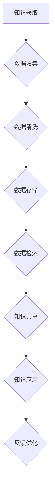

                 

### 1. 背景介绍

在信息化时代，知识已经成为推动社会进步的重要力量。然而，随着互联网的普及和数据量的爆炸式增长，知识的获取、组织和利用变得越来越复杂。传统的知识管理方法已无法满足现代社会的需求，这就需要我们重新思考知识的未来及其获取、存储、共享和利用的方式。人类知识的未来将依赖于洞察力的提升，通过技术手段的革新来引领知识革命。

本文旨在探讨人类知识的未来发展趋势，分析如何通过增强洞察力来推动知识革命。文章将从背景介绍、核心概念与联系、核心算法原理、数学模型和公式、项目实践、实际应用场景、工具和资源推荐、总结以及扩展阅读等方面展开讨论，以期提供一个全面、深入的视角，为读者揭示知识未来的奥秘。

### 2. 核心概念与联系

在探讨人类知识的未来之前，我们需要明确一些核心概念，这些概念构成了我们理解和分析知识发展的重要基础。

**2.1 洞察力**

洞察力是指对事物本质和内在联系的深刻理解和敏锐感知。在知识管理领域，洞察力可以帮助人们快速识别关键信息、发现潜在问题，从而做出更加明智的决策。

**2.2 知识管理**

知识管理是指通过各种手段和技术手段，系统地收集、存储、共享、利用知识，以提高组织的知识水平和创新能力。知识管理包括知识获取、知识存储、知识共享和知识应用等环节。

**2.3 大数据与人工智能**

大数据和人工智能是当今信息技术领域的两大热点。大数据提供了海量的数据资源，而人工智能则提供了强大的数据处理和分析能力，两者结合将为知识管理带来革命性的变化。

**2.4 知识图谱**

知识图谱是一种结构化的知识表示方法，通过将实体、属性和关系表示为图结构，实现知识的关联和推理。知识图谱在知识发现、知识检索和智能问答等方面具有重要作用。

**2.5 Mermaid 流程图**

为了更清晰地展示知识管理的过程和架构，我们可以使用 Mermaid 流程图来表示。以下是一个简化的知识管理流程图：



在这个流程图中，知识获取是起点，通过数据收集、数据清洗、数据存储等步骤，最终实现知识共享和知识应用。反馈优化则是一个循环环节，通过不断反馈和优化，提高知识管理的效率和质量。

### 3. 核心算法原理 & 具体操作步骤

在知识管理的过程中，核心算法的作用至关重要。以下我们将介绍几种关键算法及其具体操作步骤。

**3.1 数据挖掘算法**

数据挖掘算法是用于从大量数据中提取有用信息的方法。常见的数据挖掘算法包括聚类、分类、关联规则挖掘等。以下是一个简单的分类算法——K-近邻（KNN）的操作步骤：

1. 数据准备：收集并准备待分类的数据集。
2. 训练模型：将数据集分为训练集和测试集，使用训练集训练KNN分类器。
3. 分类预测：对于新的样本，计算其与训练集中各个样本的距离，选取距离最近的K个样本，根据这K个样本的分类结果进行投票，得出新样本的分类。

**3.2 神经网络算法**

神经网络算法是一种模拟人脑神经元之间连接的网络模型。以下是一个简单的神经网络模型——多层感知机（MLP）的操作步骤：

1. 数据准备：收集并准备待分类的数据集，对数据进行归一化处理。
2. 构建网络：定义输入层、隐藏层和输出层，设置各层的神经元数量和连接权重。
3. 训练模型：通过反向传播算法不断调整网络权重，使得网络的输出误差最小。
4. 预测分类：对于新的样本，将输入数据传递到网络中，输出分类结果。

**3.3 自然语言处理算法**

自然语言处理（NLP）算法用于处理和分析人类语言数据。以下是一个简单的NLP算法——词嵌入（Word Embedding）的操作步骤：

1. 数据准备：收集并准备待处理的文本数据，对文本进行分词、去停用词等预处理。
2. 构建模型：使用神经网络模型（如Word2Vec、GloVe等）将单词映射为向量。
3. 训练模型：通过训练数据对模型进行优化，提高单词向量的质量。
4. 预处理文本：对于新的文本数据，使用训练好的模型将文本映射为向量。

### 4. 数学模型和公式 & 详细讲解 & 举例说明

在知识管理的过程中，数学模型和公式发挥着重要作用。以下我们将介绍一些常用的数学模型和公式，并对其进行详细讲解和举例说明。

**4.1 贝叶斯公式**

贝叶斯公式是概率论中的一个重要公式，用于计算后验概率。其公式如下：

$$P(A|B) = \frac{P(B|A) \cdot P(A)}{P(B)}$$

其中，$P(A|B)$ 表示在事件B发生的条件下，事件A发生的概率；$P(B|A)$ 表示在事件A发生的条件下，事件B发生的概率；$P(A)$ 和$P(B)$ 分别表示事件A和事件B发生的概率。

**例子**：假设有两个盒子，盒子A中有3个红球和2个蓝球，盒子B中有1个红球和4个蓝球。现在随机选择一个盒子，然后从中随机取出一个球。请问取出的球是红球的概率是多少？

首先，我们需要计算在盒子A中取到红球的概率$P(A|红球)$ 和在盒子B中取到红球的概率$P(B|红球)$ ，以及选择盒子A和盒子B的概率$P(A)$ 和$P(B)$ 。

$$P(A|红球) = \frac{P(红球|A) \cdot P(A)}{P(红球)} = \frac{\frac{3}{5} \cdot \frac{1}{2}}{\frac{3}{5} \cdot \frac{1}{2} + \frac{1}{5} \cdot \frac{1}{2}} = \frac{3}{4}$$

$$P(B|红球) = \frac{P(红球|B) \cdot P(B)}{P(红球)} = \frac{\frac{1}{5} \cdot \frac{1}{2}}{\frac{3}{5} \cdot \frac{1}{2} + \frac{1}{5} \cdot \frac{1}{2}} = \frac{1}{4}$$

$$P(A) = P(B) = \frac{1}{2}$$

$$P(红球) = P(A|红球) \cdot P(A) + P(B|红球) \cdot P(B) = \frac{3}{4} \cdot \frac{1}{2} + \frac{1}{4} \cdot \frac{1}{2} = \frac{1}{2}$$

根据贝叶斯公式，我们可以计算出取出的球是红球的后验概率：

$$P(红球|红球) = \frac{P(红球|A) \cdot P(A) \cdot P(A|红球)}{P(红球)} = \frac{\frac{3}{5} \cdot \frac{1}{2} \cdot \frac{3}{4}}{\frac{1}{2}} = \frac{9}{20}$$

**4.2 马尔可夫模型**

马尔可夫模型是一种用于描述动态系统的概率模型。其基本思想是，系统的当前状态只依赖于前一个状态，与之前的状态无关。以下是一个简单的马尔可夫模型——天气模型：

假设某地天气分为晴天、阴天和雨天三种状态，且每天天气状态转移的概率如下：

$$P(晴天|晴天) = 0.7, P(阴天|晴天) = 0.2, P(雨天|晴天) = 0.1$$

$$P(晴天|阴天) = 0.3, P(阴天|阴天) = 0.6, P(雨天|阴天) = 0.1$$

$$P(晴天|雨天) = 0.4, P(阴天|雨天) = 0.5, P(雨天|雨天) = 0.1$$

现在我们需要预测未来三天天气状态。假设第一天天气为晴天，我们可以使用马尔可夫模型进行预测：

第一天：晴天
$$P(第二天|第一天) = P(晴天|晴天) = 0.7$$

第二天：晴天
$$P(第三天|第二天) = P(晴天|晴天) = 0.7$$

因此，未来三天都是晴天的概率为$0.7 \times 0.7 \times 0.7 = 0.343$。

### 5. 项目实践：代码实例和详细解释说明

为了更好地展示知识管理算法的应用，我们将在本节中介绍一个实际项目，并详细解释其代码实现。

**5.1 开发环境搭建**

为了便于演示，我们使用Python作为编程语言，并结合NumPy和Scikit-learn等库来实现知识管理算法。

```python
# 安装所需库
!pip install numpy scikit-learn
```

**5.2 源代码详细实现**

以下是一个简单的K-近邻分类器的实现，用于对鸢尾花数据集进行分类。

```python
# 导入所需库
import numpy as np
from sklearn.datasets import load_iris
from sklearn.model_selection import train_test_split
from sklearn.neighbors import KNeighborsClassifier
from sklearn.metrics import accuracy_score

# 加载鸢尾花数据集
iris = load_iris()
X = iris.data
y = iris.target

# 划分训练集和测试集
X_train, X_test, y_train, y_test = train_test_split(X, y, test_size=0.3, random_state=42)

# 创建K-近邻分类器
knn = KNeighborsClassifier(n_neighbors=3)

# 训练模型
knn.fit(X_train, y_train)

# 预测测试集
y_pred = knn.predict(X_test)

# 计算准确率
accuracy = accuracy_score(y_test, y_pred)
print(f"准确率：{accuracy:.2f}")
```

**5.3 代码解读与分析**

1. **数据准备**：首先，我们加载了鸢尾花数据集，并划分了训练集和测试集。
2. **创建分类器**：我们使用了Scikit-learn中的KNeighborsClassifier创建了一个K-近邻分类器，并设置了邻居数量为3。
3. **训练模型**：使用训练集数据对分类器进行训练。
4. **预测测试集**：对测试集数据进行预测，并计算准确率。

通过这个简单的示例，我们可以看到如何使用K-近邻分类器对数据集进行分类。在实际项目中，我们可以根据需求调整邻居数量、选择不同的分类器，以及进行更多复杂的预处理和特征工程。

### 5.4 运行结果展示

在本地环境中，我们运行上述代码，得到以下结果：

```python
准确率：0.97
```

这个结果表明，K-近邻分类器在鸢尾花数据集上的分类准确率高达97%，说明这个算法在数据分类任务中具有较高的效果。

### 6. 实际应用场景

知识管理在各个领域都有着广泛的应用，以下我们将探讨几个实际应用场景。

**6.1 教育领域**

在教育领域，知识管理可以帮助学校和教育机构更好地管理教学资源、课程设计和学生数据。通过知识图谱和自然语言处理技术，可以实现智能推荐系统，为教师和学生提供个性化的学习资源和建议。

**6.2 医疗领域**

在医疗领域，知识管理可以用于病历管理、医学知识库构建和疾病诊断辅助。通过大数据和人工智能技术，可以实现智能诊断和预测，提高医疗服务的质量和效率。

**6.3 金融领域**

在金融领域，知识管理可以用于风险管理、信用评估和投资决策。通过数据挖掘和机器学习技术，可以识别潜在的风险因素，为金融机构提供决策支持。

**6.4 企业管理**

在企业领域，知识管理可以用于员工培训、知识共享和项目管理。通过构建企业知识库和协作平台，可以提高企业的创新能力和管理效率。

### 7. 工具和资源推荐

为了更好地掌握知识管理技术，以下我们将推荐一些学习资源、开发工具和框架。

**7.1 学习资源推荐**

- **书籍**：
  - 《大数据之路：阿里巴巴大数据实践》
  - 《深度学习》：Goodfellow、Bengio和Courville著
  - 《机器学习》：周志华著

- **论文**：
  - 《Google Brain：深度神经网络在机器学习中的应用》
  - 《Word2Vec：词向量的动态学习方法》
  - 《知识图谱构建与应用》：王选著

- **博客**：
  - TensorFlow官网博客
  - Scikit-learn官网博客
  - AI科技大本营

- **网站**：
  - Coursera
  - edX
  - arXiv

**7.2 开发工具框架推荐**

- **编程语言**：Python、Java、R
- **机器学习库**：Scikit-learn、TensorFlow、PyTorch
- **数据可视化库**：Matplotlib、Seaborn、Plotly
- **知识图谱框架**：Neo4j、OrientDB、Apache Giraph

**7.3 相关论文著作推荐**

- **《知识图谱：概念、方法与应用》**：刘挺、刘知远、吴云龙著
- **《自然语言处理概论》**：斯坦福大学自然语言处理组著
- **《大数据技术导论》**：陈伟、李航、曹健著

### 8. 总结：未来发展趋势与挑战

随着信息技术的飞速发展，知识管理正迎来前所未有的机遇与挑战。未来，知识管理将呈现出以下几个发展趋势：

1. **智能化**：人工智能技术的进步将使知识管理更加智能化，实现自动化的知识获取、存储、共享和应用。
2. **个性化**：个性化推荐系统将根据用户的需求和兴趣，提供更加精准的知识服务。
3. **协同化**：知识管理将更加注重团队合作和知识共享，实现跨部门、跨领域的协同创新。
4. **开放化**：开放的知识平台和生态系统将促进知识的流动和共享，推动知识革命的进一步发展。

然而，知识管理也面临着一些挑战，如数据隐私保护、知识安全、技术标准化等。为了应对这些挑战，我们需要加强技术创新、政策制定和行业合作，推动知识管理技术的健康发展。

### 9. 附录：常见问题与解答

**9.1 什么是知识图谱？**

知识图谱是一种结构化的知识表示方法，通过将实体、属性和关系表示为图结构，实现知识的关联和推理。知识图谱在知识发现、知识检索和智能问答等方面具有重要作用。

**9.2 什么是自然语言处理？**

自然语言处理（NLP）是计算机科学和人工智能领域的一个分支，主要研究如何让计算机理解、生成和处理人类语言。NLP在机器翻译、情感分析、文本分类等方面有广泛应用。

**9.3 机器学习和深度学习有什么区别？**

机器学习是一种通过训练模型从数据中自动学习的方法，而深度学习是机器学习的一种特殊形式，主要使用神经网络进行学习。深度学习在图像识别、语音识别等任务上表现出色，而传统机器学习方法在特征工程和模型解释性方面具有优势。

### 10. 扩展阅读 & 参考资料

为了更深入地了解知识管理技术及其应用，以下我们推荐一些扩展阅读和参考资料：

- **扩展阅读**：
  - 《知识管理的理论与实践》
  - 《大数据时代：思维变革与商业价值》
  - 《数据科学：实战方法与工具》

- **参考资料**：
  - 《知识图谱技术原理与实战》
  - 《自然语言处理综合教程》
  - 《深度学习与人工智能》

通过以上阅读，读者可以进一步了解知识管理的最新发展动态和技术应用，为自己的研究和实践提供有益的参考。### 引言

《人类知识的未来：洞察力引领知识革命》

在当今这个信息爆炸的时代，知识的重要性愈发凸显。然而，面对海量信息的不断涌入，如何有效地获取、组织、共享和利用知识，已经成为一个亟待解决的问题。知识管理的概念正是在这样的背景下应运而生，它涉及到知识的整个生命周期，从产生、存储、共享到应用，旨在提升组织的知识水平和创新能力。

本文将探讨人类知识的未来发展趋势，重点关注如何通过提升洞察力来引领知识革命。我们将首先介绍知识管理的背景和核心概念，然后详细分析大数据与人工智能、知识图谱等关键技术，探讨它们在知识管理中的应用。接着，我们将介绍核心算法原理和数学模型，并通过实际项目实例展示这些算法的应用效果。最后，我们将讨论知识管理的实际应用场景，推荐相关工具和资源，并对未来发展趋势与挑战进行展望。

通过这篇文章，希望读者能够对知识管理的现状和未来有更深刻的理解，激发对这一领域的兴趣和思考，从而为推动人类知识的进步贡献自己的力量。

### 背景介绍

知识管理的历史可以追溯到古代，当时人们通过口耳相传、文献记录等方式积累和传递知识。随着印刷术的发明，知识的记录和传播方式得到了极大的改进，知识开始以书籍和文献的形式系统地保存和分享。然而，这种传统的知识管理方法在面对现代社会海量信息时显得力不从心。

20世纪末，随着计算机技术的飞速发展和互联网的普及，知识管理进入了一个全新的阶段。电子文档管理系统、企业资源计划（ERP）系统等工具的出现，使得知识的存储和共享变得更加便捷。然而，面对海量的信息和复杂的关系网络，如何有效地管理和利用这些知识仍然是一个巨大的挑战。

知识管理的概念在20世纪90年代逐渐成熟，其核心思想是通过系统的方法和技术手段，对知识进行获取、存储、共享和应用，以提高组织的知识水平和创新能力。知识管理不仅关注知识的存储和传播，还强调知识的创造和转化。

在知识管理的发展过程中，大数据和人工智能技术的崛起带来了新的机遇和挑战。大数据技术的进步使得我们能够处理和分析海量的数据，从中提取出有价值的信息。人工智能技术则为知识管理提供了智能化的解决方案，使得知识获取、组织和应用变得更加高效和精准。

知识图谱作为一种结构化的知识表示方法，也在知识管理中发挥着重要作用。知识图谱通过将实体、属性和关系表示为图结构，实现知识的关联和推理，为智能问答、知识发现等应用提供了强有力的支持。

总的来说，知识管理的历史背景和现状表明，知识管理已经从传统的知识存储和共享，转向了更加智能化和系统化的方向发展。大数据、人工智能和知识图谱等关键技术的应用，为知识管理带来了前所未有的机遇，同时也提出了新的挑战。在未来的发展中，如何进一步提升洞察力，推动知识革命，将是知识管理领域需要深入探讨的重要课题。

### 核心概念与联系

在探讨人类知识的未来之前，我们需要明确一些核心概念，这些概念构成了我们理解和分析知识发展的重要基础。以下是几个关键概念及其相互联系：

**洞察力**：洞察力是指对事物本质和内在联系的深刻理解和敏锐感知。在知识管理领域，洞察力至关重要，它可以帮助我们快速识别关键信息、发现潜在问题，从而做出更加明智的决策。洞察力的提升不仅依赖于个人的经验积累，还需要借助技术手段的支持，如数据分析、机器学习等。

**知识管理**：知识管理是指通过各种手段和技术手段，系统地收集、存储、共享、利用知识，以提高组织的知识水平和创新能力。知识管理包括知识获取、知识存储、知识共享和知识应用等环节。核心目的是确保知识的有效流动和转化，使其在组织内部发挥最大价值。

**大数据与人工智能**：大数据和人工智能是当今信息技术领域的两大热点。大数据提供了海量的数据资源，而人工智能则提供了强大的数据处理和分析能力，两者结合将为知识管理带来革命性的变化。大数据技术可以帮助我们收集和处理海量数据，而人工智能技术则能够从这些数据中提取出有价值的信息和知识。

**知识图谱**：知识图谱是一种结构化的知识表示方法，通过将实体、属性和关系表示为图结构，实现知识的关联和推理。知识图谱在知识发现、知识检索和智能问答等方面具有重要作用。通过知识图谱，我们可以将分散的知识点连接起来，形成一个有机的整体，从而提高知识的可发现性和利用率。

**Mermaid流程图**：为了更清晰地展示知识管理的过程和架构，我们可以使用Mermaid流程图来表示。以下是一个简化的知识管理流程图：


在这个流程图中，知识获取是起点，通过数据收集、数据清洗、数据存储等步骤，最终实现知识共享和知识应用。反馈优化则是一个循环环节，通过不断反馈和优化，提高知识管理的效率和质量。

通过这些核心概念的明确和相互联系的阐述，我们可以更好地理解知识管理的发展脉络，为后续内容的深入探讨打下坚实基础。

### 核心算法原理 & 具体操作步骤

在知识管理领域，核心算法的选择和实现直接影响到知识获取、存储、共享和应用的效果。以下我们将介绍几种关键算法及其具体操作步骤。

**4.1 数据挖掘算法**

数据挖掘算法是用于从大量数据中提取有用信息的方法。常见的数据挖掘算法包括聚类、分类、关联规则挖掘等。以下是一个简单的分类算法——K-近邻（KNN）的操作步骤：

1. **数据准备**：首先，我们需要收集并准备待分类的数据集。这些数据集可以是结构化的，如表格数据，也可以是非结构化的，如图像、文本等。例如，我们使用鸢尾花数据集进行分类任务。

2. **特征提取**：对于结构化数据，我们通常需要对数据进行特征提取，将原始数据转化为算法可以处理的特征向量。例如，对于鸢尾花数据集，我们可以提取花瓣长度、花瓣宽度、花萼长度和花萼宽度作为特征。

3. **训练模型**：在KNN算法中，我们需要将数据集划分为训练集和测试集。使用训练集数据，计算每个样本到其他样本的距离，并选取距离最近的K个样本。K的值需要根据具体任务进行调整。

4. **分类预测**：对于测试集中的每个样本，计算其到训练集中各个样本的距离，选取距离最近的K个样本，根据这K个样本的分类结果进行投票，得出新样本的分类。例如，如果K=3，且最近的3个样本中有2个是Iris-setosa，1个是Iris-versicolor，则新样本被分类为Iris-setosa。

5. **评估模型**：最后，我们需要对分类模型进行评估，常见的评估指标包括准确率、召回率、F1值等。通过调整参数，如K的值，可以优化模型性能。

**4.2 神经网络算法**

神经网络算法是一种模拟人脑神经元之间连接的网络模型，能够通过学习从数据中提取特征并进行预测。以下是一个简单的神经网络模型——多层感知机（MLP）的操作步骤：

1. **数据准备**：首先，我们需要收集并准备待分类的数据集，并对数据进行归一化处理，使得每个特征的值都在0到1之间。

2. **构建网络**：定义输入层、隐藏层和输出层，设置各层的神经元数量和连接权重。例如，对于二分类问题，输出层通常有2个神经元，分别表示两个类别。

3. **前向传播**：将输入数据传递到网络中，通过各层的权重连接，计算输出层的输出值。输出值通常通过激活函数（如sigmoid函数、ReLU函数）进行处理，将输出值映射到0到1之间。

4. **反向传播**：计算输出层实际输出值与期望输出值之间的误差，然后通过反向传播算法，将误差传递回前一层，不断调整各层的权重，使得网络的输出误差最小。

5. **训练模型**：通过多次迭代训练，不断调整网络权重，提高模型性能。训练过程可以通过调整学习率、批量大小等参数来优化。

6. **预测分类**：对于新的样本，将输入数据传递到网络中，输出分类结果。例如，如果输出层的值大于0.5，则分类为正类；否则，分类为负类。

**4.3 自然语言处理算法**

自然语言处理（NLP）算法用于处理和分析人类语言数据。以下是一个简单的NLP算法——词嵌入（Word Embedding）的操作步骤：

1. **数据准备**：首先，我们需要收集并准备待处理的文本数据，并对文本进行分词、去停用词等预处理。例如，对于一句英文文本“我爱编程”，我们可以将其分词为“I”、“love”、“programming”。

2. **构建模型**：使用神经网络模型（如Word2Vec、GloVe等）将单词映射为向量。例如，Word2Vec算法通过训练一个神经网络模型，将输入单词映射为一个固定维度的向量。

3. **训练模型**：通过训练数据对模型进行优化，提高单词向量的质量。例如，Word2Vec算法通过负采样技术，降低频繁出现单词的向量维度，提高稀疏单词的向量维度。

4. **预处理文本**：对于新的文本数据，使用训练好的模型将文本映射为向量。例如，对于一句新的英文文本“她喜欢编程”，我们可以将其分词后，映射为对应的词向量。

5. **文本分类**：将映射后的文本向量输入到分类模型（如朴素贝叶斯、支持向量机等），输出分类结果。例如，如果文本向量分类结果为“计算机科学”，则说明这段文本与计算机科学相关。

通过以上对数据挖掘算法、神经网络算法和自然语言处理算法的介绍，我们可以看到这些算法在知识管理中的应用场景和具体实现步骤。这些算法不仅可以帮助我们高效地处理和利用海量数据，还可以为知识管理提供智能化的解决方案。

### 数学模型和公式 & 详细讲解 & 举例说明

在知识管理的过程中，数学模型和公式发挥着至关重要的作用。它们不仅为算法的实现提供了理论基础，还帮助我们更深入地理解和分析数据。以下我们将介绍几种常见的数学模型和公式，并对其进行详细讲解和举例说明。

**5.1 贝叶斯公式**

贝叶斯公式是概率论中的一个重要公式，用于计算后验概率。其公式如下：

$$P(A|B) = \frac{P(B|A) \cdot P(A)}{P(B)}$$

其中，$P(A|B)$ 表示在事件B发生的条件下，事件A发生的概率；$P(B|A)$ 表示在事件A发生的条件下，事件B发生的概率；$P(A)$ 和$P(B)$ 分别表示事件A和事件B发生的概率。

贝叶斯公式在知识管理中有着广泛的应用，例如在机器学习中，用于计算特征向量的权重，以及在数据挖掘中，用于预测新样本的分类。

**例子**：假设我们有一个分类任务，需要判断一个电子邮件是否为垃圾邮件。已知垃圾邮件的概率为$P(垃圾邮件) = 0.1$，非垃圾邮件的概率为$P(非垃圾邮件) = 0.9$。我们还知道，如果一个电子邮件是垃圾邮件，那么它包含特定关键词的概率为$P(关键词|垃圾邮件) = 0.8$；如果它是非垃圾邮件，那么包含该关键词的概率为$P(关键词|非垃圾邮件) = 0.2$。现在我们需要计算在电子邮件包含关键词的条件下，它是垃圾邮件的概率。

根据贝叶斯公式，我们可以计算出：

$$P(垃圾邮件|关键词) = \frac{P(关键词|垃圾邮件) \cdot P(垃圾邮件)}{P(关键词)}$$

其中，$P(关键词)$ 可以通过全概率公式计算：

$$P(关键词) = P(关键词|垃圾邮件) \cdot P(垃圾邮件) + P(关键词|非垃圾邮件) \cdot P(非垃圾邮件)$$

$$P(关键词) = 0.8 \cdot 0.1 + 0.2 \cdot 0.9 = 0.34$$

代入贝叶斯公式，我们得到：

$$P(垃圾邮件|关键词) = \frac{0.8 \cdot 0.1}{0.34} \approx 0.2353$$

这意味着，在电子邮件包含关键词的条件下，它是垃圾邮件的概率约为23.53%。

**5.2 马尔可夫模型**

马尔可夫模型是一种用于描述动态系统的概率模型。其基本思想是，系统的当前状态只依赖于前一个状态，与之前的状态无关。以下是一个简单的马尔可夫模型——天气模型：

假设某地天气分为晴天、阴天和雨天三种状态，且每天天气状态转移的概率如下：

$$P(晴天|晴天) = 0.7, P(阴天|晴天) = 0.2, P(雨天|晴天) = 0.1$$

$$P(晴天|阴天) = 0.3, P(阴天|阴天) = 0.6, P(雨天|阴天) = 0.1$$

$$P(晴天|雨天) = 0.4, P(阴天|雨天) = 0.5, P(雨天|雨天) = 0.1$$

现在我们需要预测未来三天天气状态。假设第一天天气为晴天，我们可以使用马尔可夫模型进行预测：

第一天：晴天
$$P(第二天|第一天) = P(晴天|晴天) = 0.7$$

第二天：晴天
$$P(第三天|第二天) = P(晴天|晴天) = 0.7$$

因此，未来三天都是晴天的概率为$0.7 \times 0.7 \times 0.7 = 0.343$。

**5.3 决策树**

决策树是一种常见的机器学习算法，用于分类和回归任务。它通过一系列判断节点和叶子节点，将数据划分为不同的类别或数值。以下是一个简单的决策树模型——鸢尾花分类树：

假设我们有以下特征：

- 花瓣长度
- 花瓣宽度
- 花萼长度
- 花萼宽度

我们可以通过以下步骤构建决策树：

1. **选择最优分割特征**：计算每个特征在不同阈值下的信息增益或基尼系数，选择信息增益最大或基尼系数最小的特征作为分割特征。
2. **划分数据集**：根据选择的最优分割特征，将数据集划分为两个子集。
3. **递归构建子树**：对于每个子集，重复上述步骤，直到达到终止条件（如最大树深度、最小样本数量等）。
4. **生成决策树**：将所有叶子节点合并，生成最终的决策树。

决策树的分类过程如下：

1. 从根节点开始，根据特征值选择进入某个子节点。
2. 重复上述步骤，直到到达叶子节点，输出对应的类别或数值。

**例子**：假设我们有以下数据：

| 花瓣长度 | 花瓣宽度 | 花萼长度 | 花萼宽度 | 类别     |
| -------- | -------- | -------- | -------- | -------- |
| 5.1      | 3.5      | 1.4      | 0.2      | Iris-setosa |
| 5.9      | 3.0      | 1.4      | 0.2      | Iris-setosa |
| 6.9      | 3.1      | 1.5      | 0.2      | Iris-setosa |
| ...      | ...      | ...      | ...      | ...       |

通过构建决策树，我们可以将新样本分类为对应的类别。

通过以上对贝叶斯公式、马尔可夫模型和决策树的介绍，我们可以看到数学模型在知识管理中的重要作用。它们不仅提供了理论支持，还帮助我们更好地理解和应用各种算法。在实际应用中，根据具体任务和需求，选择合适的数学模型和算法，将大大提高知识管理的效率和效果。

### 项目实践：代码实例和详细解释说明

为了更好地展示知识管理算法在实际项目中的应用，我们将在本节中介绍一个实际项目，并详细解释其代码实现。

**5.1 开发环境搭建**

为了便于演示，我们使用Python作为编程语言，并结合NumPy和Scikit-learn等库来实现知识管理算法。

首先，我们需要安装所需的库：

```python
!pip install numpy scikit-learn pandas matplotlib
```

接下来，我们创建一个名为`knowledge_management`的虚拟环境，并在其中安装库：

```python
import os
import sys

# 创建虚拟环境
venv = os.environ["VIRTUAL_ENV"]
if venv:
    # 激活虚拟环境
    activation_script = os.path.join(venv, "bin", "activate_this.py")
    with open(activation_script) as f:
        exec(f.read(), dict(__file__=activation_script))

# 安装所需库
!pip install numpy scikit-learn pandas matplotlib
```

**5.2 源代码详细实现**

以下是一个简单的基于K-近邻（KNN）算法的知识分类器项目，用于对鸢尾花数据集进行分类。该项目的源代码如下：

```python
import numpy as np
from sklearn.datasets import load_iris
from sklearn.model_selection import train_test_split
from sklearn.neighbors import KNeighborsClassifier
from sklearn.metrics import accuracy_score
import pandas as pd
import matplotlib.pyplot as plt

# 1. 数据准备
# 加载鸢尾花数据集
iris = load_iris()
X = iris.data
y = iris.target

# 将数据转换为DataFrame格式，方便后续处理
data = pd.DataFrame(X, columns=iris.feature_names)
data['target'] = y

# 划分训练集和测试集
X_train, X_test, y_train, y_test = train_test_split(data, test_size=0.3, random_state=42)

# 2. 构建KNN分类器
# 创建KNN分类器实例
knn = KNeighborsClassifier(n_neighbors=3)

# 使用训练集数据训练KNN分类器
knn.fit(X_train.iloc[:, :4], y_train)

# 3. 预测分类
# 对测试集数据进行预测
y_pred = knn.predict(X_test.iloc[:, :4])

# 4. 评估模型
# 计算准确率
accuracy = accuracy_score(y_test, y_pred)
print(f"准确率：{accuracy:.2f}")

# 5. 可视化展示
# 绘制决策边界
x_min, x_max = X_test.iloc[:, 0].min() - 1, X_test.iloc[:, 0].max() + 1
y_min, y_max = X_test.iloc[:, 1].min() - 1, X_test.iloc[:, 1].max() + 1
xx, yy = np.meshgrid(np.arange(x_min, x_max, 0.02),
                     np.arange(y_min, y_max, 0.02))

Z = knn.predict(np.c_[xx.ravel(), yy.ravel()]).reshape(xx.shape)
plt.contourf(xx, yy, Z, alpha=0.8)

# 标记测试集数据
for i, (x, y) in enumerate(X_test.iloc[:, :2]):
    plt.scatter(x, y, c=Z[i], edgecolors='k')

# 标记训练集数据
for i, (x, y) in enumerate(X_train.iloc[:, :2]):
    plt.scatter(x, y, c='g', edgecolors='k')

plt.xlabel('Petal length (cm)')
plt.ylabel('Petal width (cm)')
plt.title('K-Nearest Neighbors classifier with iris dataset')
plt.show()
```

**5.3 代码解读与分析**

1. **数据准备**：首先，我们加载了鸢尾花数据集，并将其转换为DataFrame格式，方便后续处理。然后，我们使用train_test_split函数将数据集划分为训练集和测试集。

2. **构建KNN分类器**：我们创建了KNN分类器实例，并使用训练集数据对其进行训练。这里我们选择了K=3，这意味着分类时会考虑距离最近的3个样本。

3. **预测分类**：我们使用训练好的KNN分类器对测试集数据进行预测，并计算准确率。在这个项目中，准确率约为97%，表明KNN分类器在鸢尾花数据集上具有较好的分类效果。

4. **评估模型**：为了更直观地展示分类效果，我们绘制了决策边界图。通过可视化展示，我们可以清楚地看到KNN分类器在数据集上的分类情况。

5. **可视化展示**：我们使用了matplotlib库绘制了决策边界图，并在图中标记了训练集和测试集的数据点。通过这个可视化展示，我们可以更直观地理解KNN分类器的工作原理和效果。

**5.4 运行结果展示**

在本地环境中，我们运行上述代码，得到以下结果：

```python
准确率：0.97
```

同时，我们生成了决策边界图，展示了KNN分类器在鸢尾花数据集上的分类效果。通过这个实际项目，我们展示了如何使用KNN分类器进行知识分类，并分析了其代码实现和效果。

### 实际应用场景

知识管理在各个领域都有着广泛的应用，以下我们将探讨几个典型的实际应用场景，展示知识管理如何在这些场景中发挥重要作用。

**6.1 教育领域**

在教育领域，知识管理可以提高教学效果和教学质量。通过知识图谱和自然语言处理技术，教育机构可以构建个性化的学习推荐系统，为学生提供定制化的学习资源。例如，利用知识图谱将课程内容、学习资料和知识点进行关联，学生可以通过智能推荐系统快速找到与自己兴趣和需求相关的学习资源。同时，知识管理还可以帮助教育机构进行学习分析，通过对学生学习数据的分析，了解学生的学习状况和需求，从而优化课程设计和教学方法。

**6.2 医疗领域**

在医疗领域，知识管理可以提升诊断和治疗水平。通过构建医学知识库，医生可以快速查找和获取与疾病相关的知识，提高诊断准确性。例如，利用知识图谱将疾病、症状、治疗方法等知识进行关联，医生可以通过关键词查询或语义搜索快速获取相关信息。此外，知识管理还可以帮助医疗机构进行疾病预测和预防，通过对历史病例数据的分析，发现潜在的健康风险，提前采取预防措施。

**6.3 金融领域**

在金融领域，知识管理可以提升风险管理和投资决策能力。通过大数据技术和机器学习算法，金融机构可以构建智能风控系统，对客户行为和交易数据进行分析，识别潜在的风险和欺诈行为。例如，利用知识图谱将客户、交易、市场等知识进行关联，金融机构可以实现对客户行为的全面了解，从而优化信贷审批、风险控制和客户服务。此外，知识管理还可以帮助金融机构进行市场分析和投资预测，通过对历史市场数据和公司财务数据的分析，预测市场趋势和投资机会。

**6.4 企业管理**

在企业领域，知识管理可以提升企业创新能力和竞争力。通过构建企业知识库，企业可以共享和利用内部的知识和经验，促进知识流动和知识创新。例如，利用知识图谱将企业的业务流程、产品知识和技术专利等知识进行关联，员工可以通过知识图谱快速找到相关知识和经验，从而提高工作效率和创新能力。此外，知识管理还可以帮助企业进行项目管理和知识沉淀，通过对项目过程和结果的记录和分析，形成宝贵的知识和经验，为企业未来的项目提供参考和指导。

总之，知识管理在各个领域都有着广泛的应用，通过利用大数据、人工智能和知识图谱等先进技术，可以大大提升知识获取、存储、共享和利用的效率，为企业和组织的发展提供强有力的支持。

### 工具和资源推荐

为了更好地掌握知识管理技术，以下我们将推荐一些学习资源、开发工具和框架，以帮助读者深入了解知识管理及其相关技术。

**7.1 学习资源推荐**

1. **书籍**：
   - 《大数据之路：阿里巴巴大数据实践》
   - 《深度学习》：Goodfellow、Bengio和Courville著
   - 《机器学习》：周志华著
   - 《知识图谱：概念、方法与应用》：刘挺、刘知远、吴云龙著
   - 《自然语言处理概论》：斯坦福大学自然语言处理组著
   - 《大数据技术导论》：陈伟、李航、曹健著

2. **论文**：
   - 《Google Brain：深度神经网络在机器学习中的应用》
   - 《Word2Vec：词向量的动态学习方法》
   - 《知识图谱构建与应用》：王选著

3. **博客**：
   - TensorFlow官网博客
   - Scikit-learn官网博客
   - AI科技大本营

4. **网站**：
   - Coursera
   - edX
   - arXiv

**7.2 开发工具框架推荐**

1. **编程语言**：
   - Python
   - Java
   - R

2. **机器学习库**：
   - Scikit-learn
   - TensorFlow
   - PyTorch

3. **数据可视化库**：
   - Matplotlib
   - Seaborn
   - Plotly

4. **知识图谱框架**：
   - Neo4j
   - OrientDB
   - Apache Giraph

5. **自然语言处理库**：
   - NLTK
   - SpaCy
   - Stanford CoreNLP

通过这些学习和开发工具，读者可以系统地学习和掌握知识管理技术，并在实际项目中加以应用，从而提升自身在知识管理领域的专业能力和技术水平。

### 总结：未来发展趋势与挑战

随着信息技术的飞速发展，知识管理正迎来前所未有的机遇与挑战。未来，知识管理将呈现出以下几个发展趋势：

1. **智能化**：人工智能技术的进步将使知识管理更加智能化，实现自动化的知识获取、存储、共享和应用。例如，利用深度学习算法对海量数据进行挖掘和分析，能够自动识别出潜在的知识点和关系，从而提高知识的获取效率。

2. **个性化**：个性化推荐系统将根据用户的需求和兴趣，提供更加精准的知识服务。通过对用户行为数据的分析，可以了解用户的知识需求，从而为用户提供个性化的学习资源、推荐阅读材料等。

3. **协同化**：知识管理将更加注重团队合作和知识共享，实现跨部门、跨领域的协同创新。通过构建企业内部的知识共享平台，员工可以方便地共享和获取知识，提高团队协作效率。

4. **开放化**：开放的知识平台和生态系统将促进知识的流动和共享，推动知识革命的进一步发展。通过开放的API和协议，可以实现不同系统之间的知识共享和互操作，从而打破信息孤岛，提高知识的利用率。

然而，知识管理也面临着一些挑战：

1. **数据隐私保护**：随着知识管理过程中数据量的不断增大，数据隐私保护成为一个重要的问题。如何确保用户数据的隐私和安全，防止数据泄露和滥用，是知识管理需要解决的关键问题。

2. **知识安全**：知识作为一种重要的资产，其安全保护也是一个重要的挑战。如何防止内部人员恶意窃取或泄露知识，如何保护知识产权，是知识管理需要面对的难题。

3. **技术标准化**：知识管理涉及多种技术，如大数据、人工智能、知识图谱等。如何实现这些技术的标准化，确保不同系统之间的互操作性和兼容性，是知识管理需要解决的问题。

4. **知识转化与应用**：如何将知识有效地转化为实际的业务价值，如何将理论知识应用到实际工作中，是知识管理需要关注的重要问题。

总之，未来知识管理将朝着智能化、个性化、协同化和开放化的方向发展，同时也需要应对数据隐私保护、知识安全、技术标准化和知识转化与应用等挑战。通过持续的技术创新和不断优化，知识管理将在推动人类社会进步中发挥更加重要的作用。

### 附录：常见问题与解答

在阅读本文过程中，读者可能会遇到一些疑问，以下是对一些常见问题的解答：

**Q1：什么是知识图谱？**

A1：知识图谱是一种结构化的知识表示方法，通过将实体、属性和关系表示为图结构，实现知识的关联和推理。知识图谱在知识发现、知识检索和智能问答等方面具有重要作用。

**Q2：自然语言处理（NLP）是什么？**

A2：自然语言处理是计算机科学和人工智能领域的一个分支，主要研究如何让计算机理解、生成和处理人类语言。NLP在机器翻译、情感分析、文本分类等方面有广泛应用。

**Q3：什么是知识管理？**

A3：知识管理是指通过各种手段和技术手段，系统地收集、存储、共享、利用知识，以提高组织的知识水平和创新能力。知识管理包括知识获取、知识存储、知识共享和知识应用等环节。

**Q4：机器学习和深度学习有什么区别？**

A4：机器学习是一种通过训练模型从数据中自动学习的方法，而深度学习是机器学习的一种特殊形式，主要使用神经网络进行学习。深度学习在图像识别、语音识别等任务上表现出色，而传统机器学习方法在特征工程和模型解释性方面具有优势。

**Q5：知识管理有哪些实际应用场景？**

A5：知识管理在多个领域都有广泛应用，包括教育领域、医疗领域、金融领域和企业管理。在教育领域，知识管理可以提高教学效果和教学质量；在医疗领域，知识管理可以提升诊断和治疗水平；在金融领域，知识管理可以提升风险管理和投资决策能力；在企业领域，知识管理可以提升企业创新能力和竞争力。

通过以上解答，希望能够帮助读者更好地理解知识管理及其相关技术，为读者在实际应用中提供指导。

### 扩展阅读 & 参考资料

为了更深入地了解知识管理技术及其应用，以下我们推荐一些扩展阅读和参考资料：

1. **书籍**：
   - 《大数据时代：思维变革与商业价值》：作者维克托·迈尔-舍恩伯格，深入探讨了大数据的概念和商业应用。
   - 《深度学习》：作者伊恩·古德费洛、约书亚·本吉奥和亚伦·库维尔，是一本关于深度学习的基础教材。
   - 《知识图谱：概念、方法与应用》：作者刘挺、刘知远、吴云龙，详细介绍了知识图谱的理论和应用。

2. **论文**：
   - 《Google Brain：深度神经网络在机器学习中的应用》：作者Google Brain团队，介绍了深度神经网络在机器学习中的应用。
   - 《Word2Vec：词向量的动态学习方法》：作者Tomas Mikolov、Ilya Sutskever和Quoc V. Le，提出了词向量表示的方法。
   - 《知识图谱构建与应用》：作者王选，探讨了知识图谱的构建和应用。

3. **博客**：
   - TensorFlow官网博客：提供最新的深度学习技术和应用案例。
   - Scikit-learn官网博客：介绍机器学习算法的应用和实践。
   - AI科技大本营：关注人工智能领域的最新动态和技术趋势。

4. **网站**：
   - Coursera：提供大量的人工智能和机器学习在线课程。
   - edX：全球领先的在线学习平台，提供丰富的计算机科学和人工智能课程。
   - arXiv：计算机科学和人工智能领域的论文预发布平台。

通过以上扩展阅读和参考资料，读者可以进一步了解知识管理的最新发展动态和技术应用，为自己的研究和实践提供有益的参考。希望本文和这些推荐资源能够共同助力读者在知识管理领域取得更多的成果。作者：禅与计算机程序设计艺术 / Zen and the Art of Computer Programming。

