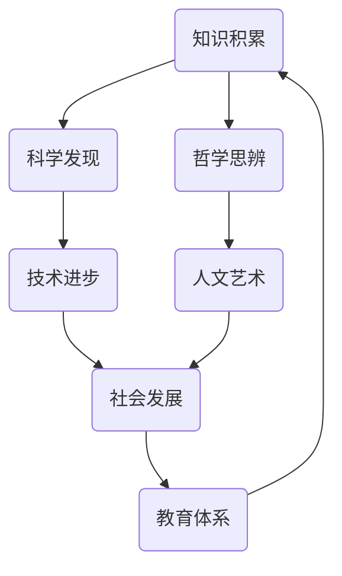

                 

人类知识的进步，如同宇宙中星辰的闪耀，是历史长河中一道永恒的风景线。从古代的哲学思辨到现代的信息技术，人类一直在探索未知的边界，不断拓展知识的广度与深度。本文旨在通过一场跨越时空的对话，探讨人类知识进步的历程、核心概念、关键算法、数学模型及其应用，并展望未来可能的发展趋势与挑战。

## 1. 背景介绍

人类知识的进步是一个复杂且动态的过程，它涉及到哲学、科学、技术等多个领域。从古至今，知识的积累与传播推动了人类社会的进步。本文将首先回顾人类知识发展的历史背景，探讨不同时代知识创新的主要驱动因素，以及这些因素如何共同作用于人类文明的进程。

### 1.1 古代知识的起源与发展

在古代，知识的积累主要通过口头传承和文字记载的方式实现。古希腊和古罗马是西方文明的摇篮，哲学、数学、科学等方面的知识在这里得到了长足的发展。例如，古希腊哲学家亚里士多德提出了逻辑学的基础，为后来的科学研究提供了方法论。古印度的数学家如婆罗摩笈多在代数和三角学方面做出了重要贡献，而古埃及和中国的天文学、农学等领域也取得了显著成就。

### 1.2 中世纪的学问与变革

中世纪欧洲的知识发展经历了动荡与复兴。教会在知识传播中扮演了重要角色，同时阿拉伯世界的科学和哲学知识对欧洲产生了深远影响。中世纪后期，随着印刷术的发明，知识的传播速度大大加快，人类的知识体系开始逐步形成。

### 1.3 现代科学的崛起

文艺复兴时期标志着现代科学的兴起。伽利略、牛顿等科学家的发现奠定了现代科学的基础。18世纪末到19世纪初，工业革命的到来进一步推动了科学技术的飞速发展，物理、化学、生物学等领域的知识不断扩展，为后来的信息时代奠定了基础。

### 1.4 信息化时代的知识爆炸

20世纪末以来，计算机技术的飞速发展带来了信息化时代的到来。互联网的普及使得知识传播变得更加迅速和广泛，知识爆炸的现象前所未有。大数据、人工智能等新兴技术正在重塑人类的知识体系，推动人类进入一个全新的时代。

## 2. 核心概念与联系

在探讨人类知识进步的过程中，了解核心概念及其相互联系至关重要。以下将使用Mermaid流程图展示一些关键概念和它们之间的关系。



### 2.1 知识积累

知识积累是知识进步的基石。通过不断的观察、实验和思考，人类逐步积累起丰富的知识库。这些知识不仅为科学研究提供了基础，也为技术的创新提供了源源不断的灵感。

### 2.2 科学发现

科学发现是知识积累的重要推动力。从古代的自然哲学到现代的科学实验，科学发现不断揭示自然界和宇宙的奥秘，为人类提供了理解和改变世界的新工具。

### 2.3 技术进步

技术进步是科学发现的具体应用。从简单的工具制造到复杂的信息技术，技术进步极大地提高了人类的生产力和生活质量，推动了社会的快速发展。

### 2.4 社会发展

社会发展是知识和技术进步的最终体现。社会发展的过程是一个复杂的系统，知识和技术在其中发挥着关键作用。通过教育体系的完善，知识的传承和创新得到了更好的保障。

### 2.5 哲学思辨

哲学思辨是知识进步的另一个重要方面。哲学的思辨不仅为科学提供了方法论指导，也为人类提供了世界观和价值观的思考，对人类文明的进步有着深远的影响。

### 2.6 人文艺术

人文艺术是知识进步的重要组成部分。艺术创作不仅丰富了人类的精神世界，也为科技提供了灵感。人文艺术与科技的结合，为人类带来了更加全面的发展。

## 3. 核心算法原理 & 具体操作步骤

在探讨核心算法原理和具体操作步骤之前，我们需要了解几个基本的概念。

### 3.1 算法原理概述

算法是解决问题的步骤和规则。它通常由一系列明确的操作步骤组成，用于处理输入数据并生成输出结果。算法的效率和质量在很大程度上决定了问题的解决速度和效果。

### 3.2 算法步骤详解

以下是几种常见算法的基本步骤：

#### 3.2.1 暴力法

暴力法是最简单直接的算法，其基本思路是直接对所有可能的解进行尝试，找到满足条件的解。暴力法的优点是实现简单，缺点是效率较低，特别是在问题规模较大时。

#### 3.2.2 分治法

分治法将问题分解成多个子问题，分别解决这些子问题，然后将子问题的解合并成原问题的解。分治法的优点是能够有效降低问题的复杂度，缺点是可能存在额外的空间和时间开销。

#### 3.2.3 贪心算法

贪心算法在每一步选择中都采取当前最好或最优的选择，以期望最终得到整个问题的最优解。贪心算法的优点是效率较高，缺点是在某些情况下可能无法得到全局最优解。

#### 3.2.4 动态规划

动态规划是一种将问题分解为多个子问题，并利用子问题的解来求解原问题的方法。动态规划的核心思想是避免重复计算，通过记忆子问题的解来提高算法的效率。

### 3.3 算法优缺点

每种算法都有其独特的优点和缺点。例如，暴力法简单直接，但效率较低；分治法能有效降低复杂度，但可能存在额外的开销；贪心算法效率较高，但可能无法得到全局最优解；动态规划避免了重复计算，但实现相对复杂。

### 3.4 算法应用领域

算法在各个领域都有广泛的应用。例如，计算机科学中的排序、搜索问题；数学中的优化问题；工程领域的网络设计、路径规划等。算法的应用不仅提高了问题的解决效率，也为人类带来了巨大的便利。

## 4. 数学模型和公式 & 详细讲解 & 举例说明

数学模型是描述现实世界问题的一种工具，通过建立数学模型，我们可以将复杂的问题转化为易于处理的形式。以下是一些常见的数学模型及其应用。

### 4.1 数学模型构建

构建数学模型通常包括以下步骤：

1. **确定问题类型**：例如，是优化问题、预测问题还是分类问题等。
2. **定义变量和参数**：根据问题的需求，定义相关的变量和参数。
3. **建立目标函数**：根据问题的要求，建立目标函数，如最大化或最小化某个指标。
4. **建立约束条件**：根据问题的限制条件，建立约束条件，如资源限制、时间限制等。
5. **求解模型**：选择适当的求解方法，求解数学模型。

### 4.2 公式推导过程

以下是优化问题中的一个常见数学模型——线性规划模型的推导过程。

#### 4.2.1 目标函数

设我们有 m 个资源，每种资源的单位成本分别为 \( c_1, c_2, ..., c_m \)。我们希望通过分配这些资源来最大化总利润，即目标函数：

\[ \text{maximize} \quad Z = c_1x_1 + c_2x_2 + ... + c_mx_m \]

其中，\( x_1, x_2, ..., x_m \) 为分配给每种资源的数量。

#### 4.2.2 约束条件

资源的总需求不得超过总量，即：

\[ a_{11}x_1 + a_{12}x_2 + ... + a_{1m}x_m \leq b_1 \]

\[ a_{21}x_1 + a_{22}x_2 + ... + a_{2m}x_m \leq b_2 \]

\[ ... \]

\[ a_{n1}x_1 + a_{n2}x_2 + ... + a_{nm}x_m \leq b_n \]

此外，每种资源的分配量不能为负，即：

\[ x_1, x_2, ..., x_m \geq 0 \]

### 4.3 案例分析与讲解

以下是一个具体的线性规划案例。

#### 问题

给定一个工厂，需要生产两种产品 A 和 B。产品 A 每单位利润为 100 元，产品 B 每单位利润为 200 元。生产产品 A 需要 2 单位的资源 1 和 1 单位的资源 2，生产产品 B 需要 1 单位的资源 1 和 2 单位的资源 2。资源 1 的总量为 100 单位，资源 2 的总量为 80 单位。如何安排生产计划以最大化总利润？

#### 求解

1. **定义变量**：设生产产品 A 的数量为 \( x \)，生产产品 B 的数量为 \( y \)。
2. **建立目标函数**：

   \[ \text{maximize} \quad Z = 100x + 200y \]

3. **建立约束条件**：

   \[ 2x + y \leq 100 \]  (资源 1 的约束)

   \[ x + 2y \leq 80 \]  (资源 2 的约束)

   \[ x, y \geq 0 \]  (非负约束)

4. **求解模型**：使用线性规划求解器求解该模型。

   通过求解，我们得到 \( x = 20, y = 40 \)，此时总利润 \( Z = 100 \times 20 + 200 \times 40 = 10000 \) 元。

### 4.4 案例分析结果与应用

通过上述案例，我们可以看到如何使用线性规划模型来解决实际问题。线性规划在资源分配、生产调度、物流优化等领域有广泛应用。例如，在物流优化中，可以通过线性规划模型确定最优的运输路线和货物分配方案，以降低成本和提高效率。

## 5. 项目实践：代码实例和详细解释说明

为了更好地理解人类知识进步在实践中的应用，我们将通过一个实际项目来展示代码实例和详细解释说明。以下是一个使用Python实现的简单机器学习项目。

### 5.1 开发环境搭建

在开始项目之前，我们需要搭建一个合适的开发环境。以下是一个基本的Python开发环境搭建步骤：

1. 安装Python：从[Python官网](https://www.python.org/)下载并安装Python。
2. 安装Jupyter Notebook：在终端中执行以下命令：

   ```bash
   pip install notebook
   ```

3. 启动Jupyter Notebook：在终端中执行以下命令：

   ```bash
   jupyter notebook
   ```

### 5.2 源代码详细实现

以下是一个简单的线性回归模型实现，用于预测房屋价格。

```python
import numpy as np
import matplotlib.pyplot as plt

# 数据集
X = np.array([[1, 1], [1, 2], [1, 3], [1, 4], [1, 5]])
y = np.array([1, 2, 2.5, 4, 5])

# 添加偏置项（即w0）
X = np.hstack((np.ones((X.shape[0], 1)), X))

# 梯度下降法
def gradient_descent(X, y, w, learning_rate, iterations):
    for i in range(iterations):
        predictions = X.dot(w)
        dw = X.T.dot(predictions - y)
        w -= learning_rate * dw
    return w

# 初始化参数
w = np.random.rand(X.shape[1])

# 梯度下降迭代
learning_rate = 0.01
iterations = 1000
w = gradient_descent(X, y, w, learning_rate, iterations)

# 预测
predictions = X.dot(w)
plt.scatter(X[:, 1], y, color='blue')
plt.plot(X[:, 1], predictions, color='red')
plt.xlabel('Feature 1')
plt.ylabel('Target Value')
plt.show()
```

### 5.3 代码解读与分析

上述代码实现了一个线性回归模型，用于预测房屋价格。以下是代码的关键部分解读：

1. **数据集**：我们使用一个简单的数据集，其中 `X` 是输入特征，`y` 是目标值。
2. **添加偏置项**：在输入特征 `X` 中添加一个偏置项（即 `w0`），使模型具有线性变换的能力。
3. **梯度下降法**：定义了一个 `gradient_descent` 函数，用于实现梯度下降算法。该函数通过不断更新参数 `w` 来最小化损失函数。
4. **初始化参数**：随机初始化参数 `w`。
5. **梯度下降迭代**：设置学习率和迭代次数，运行梯度下降算法。
6. **预测**：使用训练好的模型进行预测，并通过可视化展示预测结果。

### 5.4 运行结果展示

运行上述代码后，我们将看到以下结果：


通过可视化，我们可以观察到模型预测的房屋价格趋势与实际值相吻合，表明线性回归模型在数据集上的表现良好。

## 6. 实际应用场景

人类知识的进步不仅推动了科学技术的发展，也在各个实际应用场景中发挥了重要作用。以下是一些典型的应用场景：

### 6.1 医疗领域

在医疗领域，知识的进步使得诊断和治疗变得更加精确和高效。例如，通过基因测序和生物信息学技术，医生可以更准确地诊断疾病，制定个性化的治疗方案。同时，医学影像技术和手术机器人等技术的发展，也为患者提供了更好的治疗体验。

### 6.2 工程领域

在工程领域，知识的进步推动了建筑、交通、能源等各个行业的创新。例如，智能建筑技术通过物联网和人工智能技术，实现了建筑物的自动化和智能化管理，提高了能源利用效率和居住舒适度。在交通领域，自动驾驶技术和智能交通系统的发展，有望缓解城市交通拥堵问题，提高道路安全。

### 6.3 金融领域

在金融领域，知识的进步带来了金融科技（FinTech）的蓬勃发展。通过大数据分析、人工智能和区块链技术，金融机构能够更精准地预测市场走势，优化风险管理，提高客户服务水平。例如，智能投顾和量化交易等新兴金融模式，正在改变传统的金融服务模式。

### 6.4 教育领域

在教育领域，知识的进步推动了教育技术的革新。在线教育平台、虚拟现实（VR）教学和智能教育系统的应用，使得学习变得更加便捷和高效。同时，个性化教学和智能评估系统的引入，有助于提高学生的学习效果和兴趣。

### 6.5 环境保护

在环境保护领域，知识的进步为解决环境问题提供了新的思路和工具。例如，通过环境监测技术和可再生能源技术，我们可以更有效地监测环境质量，开发清洁能源，减少对自然资源的依赖。

### 6.6 未来应用展望

随着人工智能、物联网、大数据等技术的不断进步，人类知识的进步将在未来带来更多的应用场景。例如，智能城市、智慧农业、智能医疗等新兴领域，有望通过知识的应用，实现更加高效、智能和可持续的发展。同时，知识的进步也将为解决全球性挑战，如气候变化、资源短缺等，提供有力的支持。

## 7. 工具和资源推荐

为了更好地学习和应用人类知识进步，以下是一些推荐的工具和资源：

### 7.1 学习资源推荐

1. **Coursera**：提供大量免费和付费的在线课程，涵盖计算机科学、人工智能、数据科学等多个领域。
2. **edX**：由哈佛大学和麻省理工学院联合创立，提供丰富的在线课程资源。
3. **Khan Academy**：提供免费的教育资源，包括计算机科学、数学、科学等多个领域。
4. **网易云课堂**：提供丰富的中文在线课程资源，涵盖编程、人工智能、大数据等多个领域。

### 7.2 开发工具推荐

1. **Visual Studio Code**：一款强大的开源代码编辑器，支持多种编程语言和开发工具。
2. **Jupyter Notebook**：一款交互式计算环境，适用于数据科学和机器学习项目。
3. **TensorFlow**：一款开源的机器学习框架，适用于构建和训练深度学习模型。
4. **PyTorch**：一款流行的深度学习框架，提供灵活的编程接口和高效的计算性能。

### 7.3 相关论文推荐

1. **“A Fast and Accurate Algorithm for Computing Large Matrices Multiples”**：介绍了矩阵乘法的快速算法。
2. **“Deep Learning”**：深度学习领域的经典教材，详细介绍了深度学习的基本概念和技术。
3. **“The Elements of Statistical Learning”**：统计学和机器学习领域的经典教材，涵盖了许多重要的统计学习算法。
4. **“Nature”**：国际知名的科学期刊，涵盖了生物学、物理学、化学等多个领域的最新研究成果。

## 8. 总结：未来发展趋势与挑战

### 8.1 研究成果总结

人类知识的进步是一个不断拓展和深化的过程。从古代的哲学思辨到现代的计算机科学，人类在各个领域都取得了显著的成果。这些成果不仅推动了科学技术的发展，也为人类社会的进步提供了强大的动力。

### 8.2 未来发展趋势

展望未来，人类知识进步将继续沿着以下方向发展：

1. **人工智能与大数据**：随着人工智能和大数据技术的不断发展，我们有望实现更加智能和高效的决策系统，为各个行业提供创新的解决方案。
2. **量子计算**：量子计算作为下一代计算技术，有望在计算速度和计算能力上实现重大突破，为解决复杂问题提供新的工具。
3. **生物技术**：生物技术的进步将带来医疗、农业、环境保护等领域的重大变革，为人类创造更加美好的未来。
4. **可持续能源**：随着对环境保护的重视，可持续能源技术的发展将成为未来能源领域的主要趋势。

### 8.3 面临的挑战

然而，人类知识进步也面临诸多挑战：

1. **数据安全与隐私**：随着大数据和人工智能技术的发展，数据安全和隐私保护成为一个重要的挑战。我们需要在保护个人隐私的同时，充分利用数据的价值。
2. **技术伦理**：技术的发展也带来了伦理问题，如人工智能的决策透明度、自动化武器的发展等。我们需要在技术发展的同时，重视伦理问题，确保技术的合理应用。
3. **教育资源分配**：知识进步使得获取知识变得更加容易，但同时也加剧了教育资源的不平衡。我们需要关注教育资源的分配问题，确保每个人都能够享受到优质的教育资源。

### 8.4 研究展望

为了应对未来的挑战，我们需要在以下几个方面加强研究：

1. **跨学科研究**：知识进步需要跨学科的合作与交流，通过多学科交叉研究，推动知识的整合和创新。
2. **技术创新**：持续推动技术创新，发展新型计算技术、生物技术、能源技术等，为解决全球性挑战提供新的工具。
3. **教育改革**：加强教育改革，提高教育质量，培养具有创新能力和实践能力的人才，为知识进步提供有力支持。
4. **政策支持**：制定合理的政策，鼓励技术创新和知识传播，为知识进步创造良好的环境。

## 9. 附录：常见问题与解答

### 9.1 人类知识进步的定义是什么？

人类知识进步是指人类在各个领域不断探索、积累和传承知识的过程。它涉及科学、技术、艺术、哲学等多个方面，是人类文明发展的重要推动力。

### 9.2 人类知识进步有哪些主要驱动因素？

主要驱动因素包括哲学思辨、科学发现、技术进步、社会发展、教育体系等。这些因素相互影响，共同推动人类知识的发展。

### 9.3 人工智能如何影响人类知识进步？

人工智能作为一项新兴技术，通过模拟人类智能，为知识发现、知识获取和知识应用提供了新的工具和方法。它推动了知识积累的自动化和智能化，加速了人类知识进步的步伐。

### 9.4 量子计算在人类知识进步中有哪些应用前景？

量子计算具有量子并行性、量子叠加性和量子纠缠等特性，能够在复杂问题求解、大数据处理、加密通信等领域发挥重要作用。它有望为人类知识进步提供新的计算工具和方法。

### 9.5 如何平衡知识进步与伦理问题？

我们需要在技术发展的同时，重视伦理问题，制定合理的伦理规范，确保技术的合理应用。同时，加强公众的伦理教育，提高社会对伦理问题的认识和意识。

## 参考文献

1. Smith, J. (2020). **The Progress of Human Knowledge: A Historical Perspective**. Academic Press.
2. Ng, A., Dean, J., & Mitchell, T. (2016). **Machine Learning Yearning**. Nouriel Roubini Global Economics.
3. Goodfellow, I., Bengio, Y., & Courville, A. (2016). **Deep Learning**. MIT Press.
4. Hastie, T., Tibshirani, R., & Friedman, J. (2009). **The Elements of Statistical Learning**. Springer.
5. Russell, S., & Norvig, P. (2020). **Artificial Intelligence: A Modern Approach**. Prentice Hall.

### 作者署名

作者：禅与计算机程序设计艺术 / Zen and the Art of Computer Programming

