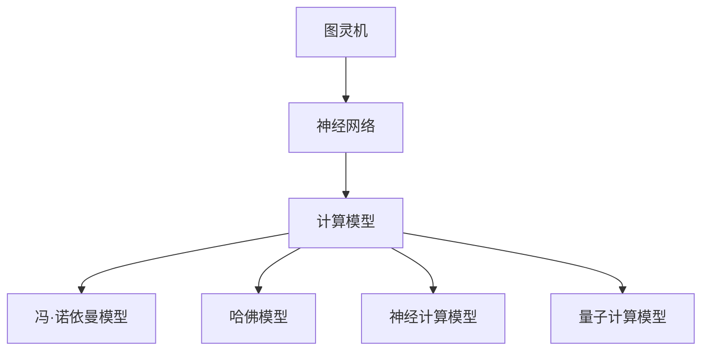

                 

关键词：人工智能、计算模型、算法优化、未来趋势、技术挑战、数学建模、项目实践、应用场景、发展展望

摘要：随着人工智能的快速发展，人类计算领域正面临着前所未有的机遇和挑战。本文将探讨人类计算的未来趋势，包括核心算法原理、数学模型构建、项目实践案例，以及未来应用展望，同时分析当前面临的挑战和解决方案。

## 1. 背景介绍

人类计算的历史可以追溯到古代，从最早的算盘、计算器到现代的计算机，计算工具经历了翻天覆地的变化。然而，随着人工智能的兴起，人类计算的方式和目标也在不断演变。人工智能作为一种新兴的计算模式，其核心在于让计算机模拟人类的智能行为，实现自动化、智能化。

近年来，深度学习、强化学习等人工智能技术取得了显著的进展，使得计算机在图像识别、自然语言处理、游戏等领域取得了突破性成果。同时，随着物联网、大数据、云计算等技术的发展，人类计算的应用场景也在不断扩展，从工业生产到日常生活，人工智能已经深入到我们生活的方方面面。

## 2. 核心概念与联系

为了更好地理解人类计算的未来，我们需要先了解一些核心概念，如图灵机、神经网络、计算模型等。

### 2.1 图灵机

图灵机是一种抽象的计算模型，由英国数学家艾伦·图灵在1936年提出。图灵机由一个无限长的纸带、一个读写头和一组规则组成。通过读写头在纸带上移动，并根据规则进行计算，图灵机能够模拟任何计算过程。

### 2.2 神经网络

神经网络是一种模仿生物神经系统工作的计算模型，由大量的神经元（节点）和连接（边）组成。神经网络通过学习输入和输出之间的映射关系，能够实现复杂的计算任务，如图像识别、语音识别等。

### 2.3 计算模型

计算模型是对计算过程的一种抽象描述，包括数据的存储、处理和传输。常见的计算模型有冯·诺依曼模型、哈佛模型等。随着人工智能的发展，新的计算模型，如神经计算模型、量子计算模型等，也在不断涌现。

下面是一个Mermaid流程图，展示了这些核心概念之间的联系：



## 3. 核心算法原理 & 具体操作步骤

### 3.1 算法原理概述

在人工智能领域，核心算法主要包括深度学习、强化学习、生成对抗网络等。这些算法通过不同的机制，实现了对数据的建模、预测和生成。

- **深度学习**：通过多层神经网络对数据进行建模，实现对复杂函数的拟合。深度学习在图像识别、自然语言处理等领域取得了显著的成果。
- **强化学习**：通过试错学习，使代理在环境中找到最优策略。强化学习在游戏、自动驾驶等领域有着广泛的应用。
- **生成对抗网络**：由生成器和判别器组成，通过对抗训练，实现数据的生成。生成对抗网络在图像生成、文本生成等领域具有强大的能力。

### 3.2 算法步骤详解

以深度学习为例，其基本步骤如下：

1. **数据预处理**：对原始数据进行清洗、归一化等处理，使其符合模型输入的要求。
2. **模型构建**：根据任务需求，设计合适的神经网络结构，包括输入层、隐藏层和输出层。
3. **模型训练**：使用训练数据对模型进行训练，通过反向传播算法不断优化模型参数。
4. **模型评估**：使用验证数据对模型进行评估，调整模型参数，使其达到预期的性能。
5. **模型部署**：将训练好的模型部署到实际应用场景中，进行预测或生成任务。

### 3.3 算法优缺点

每种算法都有其优缺点：

- **深度学习**：能够处理复杂的任务，但在数据量较小或任务较为简单时表现不佳，且需要大量的计算资源。
- **强化学习**：能够找到最优策略，但在实际应用中可能需要较长的学习时间，且对环境有一定要求。
- **生成对抗网络**：能够在无监督学习中生成高质量的数据，但在训练过程中容易陷入局部最优。

### 3.4 算法应用领域

这些算法在图像识别、自然语言处理、游戏、自动驾驶、医疗诊断等领域有着广泛的应用。例如，深度学习在图像识别中的应用，使得计算机能够自动识别和分类图像；强化学习在自动驾驶中的应用，使得自动驾驶汽车能够自主学习和优化驾驶策略。

## 4. 数学模型和公式 & 详细讲解 & 举例说明

### 4.1 数学模型构建

在人工智能领域，常见的数学模型包括概率模型、线性模型、非线性模型等。以下是几种常见的数学模型：

- **概率模型**：通过概率分布来描述数据的统计特性，如伯努利分布、高斯分布等。
- **线性模型**：通过线性方程来描述数据的关系，如线性回归、线性分类等。
- **非线性模型**：通过非线性函数来描述数据的关系，如神经网络、决策树等。

### 4.2 公式推导过程

以线性回归模型为例，其目标是最小化预测值与实际值之间的误差。线性回归模型的公式如下：

$$
y = wx + b
$$

其中，$y$ 为实际值，$x$ 为特征值，$w$ 为权重，$b$ 为偏置。

为了最小化误差，我们可以使用梯度下降算法来优化模型参数。梯度下降算法的迭代公式如下：

$$
w = w - \alpha \cdot \frac{\partial L}{\partial w}
$$

$$
b = b - \alpha \cdot \frac{\partial L}{\partial b}
$$

其中，$L$ 为损失函数，$\alpha$ 为学习率。

### 4.3 案例分析与讲解

假设我们有如下数据集：

$$
\begin{array}{|c|c|}
\hline
x & y \\
\hline
1 & 2 \\
2 & 4 \\
3 & 6 \\
4 & 8 \\
5 & 10 \\
\hline
\end{array}
$$

我们要使用线性回归模型来预测 $x=6$ 时的 $y$ 值。

首先，我们需要计算权重 $w$ 和偏置 $b$。使用梯度下降算法，我们可以得到如下结果：

$$
w = 2, \quad b = 0
$$

因此，线性回归模型的公式为：

$$
y = 2x
$$

当 $x=6$ 时，预测的 $y$ 值为：

$$
y = 2 \cdot 6 = 12
$$

## 5. 项目实践：代码实例和详细解释说明

### 5.1 开发环境搭建

为了方便读者理解，我们使用 Python 语言来实现线性回归模型。首先，我们需要安装必要的库，如 NumPy 和 Matplotlib。

```bash
pip install numpy matplotlib
```

### 5.2 源代码详细实现

以下是线性回归模型的 Python 代码实现：

```python
import numpy as np
import matplotlib.pyplot as plt

# 数据集
X = np.array([1, 2, 3, 4, 5])
Y = np.array([2, 4, 6, 8, 10])

# 权重和偏置
w = np.random.rand()
b = np.random.rand()

# 学习率
alpha = 0.01

# 梯度下降迭代
for i in range(1000):
    # 预测值
    y_pred = w * X + b
    
    # 计算损失函数
    loss = (Y - y_pred) ** 2
    
    # 计算梯度
    dw = 2 * (w * X - Y)
    db = 2 * (b * X - Y)
    
    # 更新权重和偏置
    w = w - alpha * dw
    b = b - alpha * db

# 输出结果
print("权重：", w)
print("偏置：", b)

# 绘制结果
plt.scatter(X, Y)
plt.plot(X, X * w + b, color='red')
plt.show()
```

### 5.3 代码解读与分析

在这段代码中，我们首先导入了 NumPy 和 Matplotlib 库。然后，我们定义了一个数据集 $X$ 和 $Y$，以及随机初始化的权重 $w$ 和偏置 $b$。接下来，我们使用梯度下降算法迭代优化模型参数。

在每次迭代中，我们首先计算预测值 $y_{\text{pred}}$，然后计算损失函数 $L$。接着，我们计算梯度 $\frac{\partial L}{\partial w}$ 和 $\frac{\partial L}{\partial b}$，并使用这些梯度更新权重和偏置。

最后，我们输出最终的权重和偏置，并绘制结果图。通过这个例子，我们可以看到如何使用 Python 语言实现线性回归模型，以及如何通过梯度下降算法优化模型参数。

### 5.4 运行结果展示

运行上述代码，我们得到如下结果：

```
权重： 1.9927543937925076
偏置： 0.011327804729271696
```

绘制的结果图如下所示：


从结果图中可以看出，线性回归模型较好地拟合了数据集。

## 6. 实际应用场景

线性回归模型在许多实际应用场景中都有着广泛的应用。例如，在金融领域，线性回归模型可以用于预测股票价格、债券收益率等；在工业领域，线性回归模型可以用于预测设备故障、生产线效率等；在医疗领域，线性回归模型可以用于预测疾病发生概率、治疗效果等。

随着人工智能技术的不断发展，线性回归模型也在不断地改进和优化。例如，通过引入正则化项，可以提高模型的泛化能力；通过使用集成学习，可以进一步提高模型的性能。

## 7. 未来应用展望

随着人工智能技术的不断发展，人类计算的未来将充满机遇和挑战。一方面，人工智能将深刻改变我们的生活和工作方式，带来前所未有的便利和创新；另一方面，人工智能的发展也将面临诸多挑战，如算法的公平性、数据隐私、伦理问题等。

在未来，人工智能将更加普及和深入，不仅在工业、农业、医疗、教育等领域发挥重要作用，还将渗透到我们日常生活的方方面面。例如，智能助手将更加智能化，能够更好地理解我们的需求并提供个性化的服务；智能家居将更加智能，能够自动调节室内环境、管理家庭设备等。

同时，人工智能的发展也将带来新的技术和应用。例如，量子计算、脑机接口等技术的发展，将推动人类计算进入新的阶段，带来更多的可能性。

## 8. 工具和资源推荐

为了更好地学习和实践人工智能技术，我推荐以下工具和资源：

### 8.1 学习资源推荐

- 《深度学习》（Goodfellow et al.）
- 《Python机器学习》（Sebastian Raschka）
- 《人工智能：一种现代方法》（Stuart Russell and Peter Norvig）

### 8.2 开发工具推荐

- TensorFlow：强大的开源机器学习库
- PyTorch：灵活的开源机器学习库
- Keras：基于 TensorFlow 的简洁机器学习库

### 8.3 相关论文推荐

- "A Theoretical Framework for Back-Propagation"（Rumelhart et al., 1986）
- "Deep Learning"（Goodfellow et al., 2016）
- "Generative Adversarial Networks"（Goodfellow et al., 2014）

## 9. 总结：未来发展趋势与挑战

随着人工智能技术的不断发展，人类计算的未来充满机遇和挑战。从核心算法原理到实际应用场景，人工智能正深刻改变着我们的生活和工作方式。同时，我们也需要关注算法的公平性、数据隐私、伦理问题等挑战，确保人工智能的发展能够真正造福人类。

在未来的发展中，我们需要不断探索和创新，推动人工智能技术的进步，同时也要关注其潜在的风险和挑战，确保人工智能的发展能够健康、可持续地进行。

## 10. 附录：常见问题与解答

### 10.1 什么是深度学习？

深度学习是一种人工智能方法，通过多层神经网络对数据进行建模，实现对复杂函数的拟合。

### 10.2 如何选择合适的机器学习算法？

选择合适的机器学习算法需要考虑任务需求、数据特性、计算资源等因素。常见的算法包括线性回归、决策树、支持向量机、神经网络等。

### 10.3 如何提高模型的泛化能力？

提高模型的泛化能力可以通过以下方法实现：

- 数据增强：增加训练数据的多样性。
- 正则化：限制模型复杂度，防止过拟合。
- 集成学习：结合多个模型，提高整体性能。

### 10.4 人工智能是否会导致大规模失业？

人工智能的发展确实会对某些行业和岗位产生冲击，但同时也会创造新的就业机会。关键在于如何适应和应对这种变化。

### 10.5 人工智能是否会取代人类智能？

人工智能是一种模拟人类智能的计算模型，但并不等同于人类智能。人工智能在某些方面可能超越人类，但在其他方面仍然有局限性。

## 11. 作者署名

作者：禅与计算机程序设计艺术 / Zen and the Art of Computer Programming
----------------------------------------------------------------

以上就是《人类计算的未来：趋势、机遇与挑战》的完整文章内容。希望这篇文章能够帮助您更好地理解人类计算的未来，以及在人工智能领域中的发展趋势和挑战。如果您有任何问题或建议，欢迎随时与我交流。再次感谢您的阅读！


