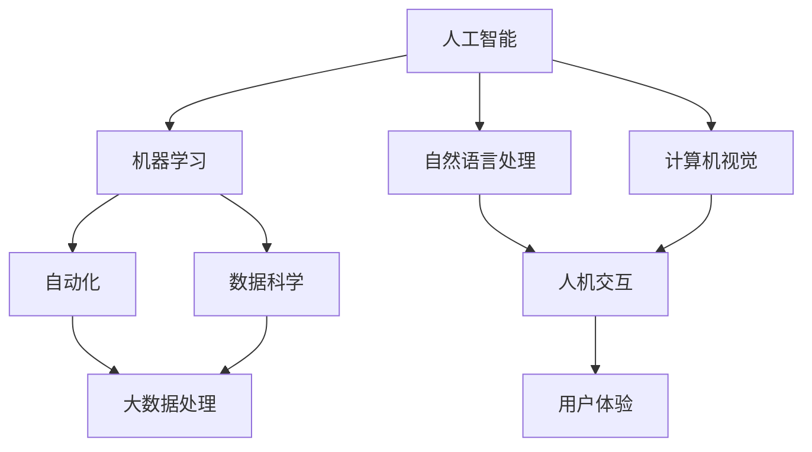

                 

### 1. 背景介绍

在当今科技飞速发展的时代，人工智能（AI）已经成为推动各行各业变革的关键力量。从智能家居、自动驾驶到医疗诊断、金融分析，AI的应用场景不断拓展，影响力日益深远。然而，随着AI技术的不断进步，人们开始关注一个重要的问题：AI时代的未来就业市场将如何变化？哪些职业会消失，哪些职业会崛起？对于广大劳动者而言，如何在这个充满不确定性的新时代中找到自己的定位和机遇？

本文旨在深入探讨AI时代未来就业市场的趋势，通过对核心概念、算法原理、应用实例等方面的分析，为读者提供一个全面、深入的视角。文章将首先介绍AI时代的背景和核心概念，然后详细探讨这些概念之间的关系，接着分析核心算法原理及其具体操作步骤，之后将通过实例展示数学模型和公式，并讨论实际应用场景。在此基础上，我们将推荐一些相关工具和资源，最后总结未来发展趋势与挑战，并附上常见问题与解答。

通过对这些内容的逐步分析，我们希望能够帮助读者更好地理解AI时代就业市场的现状和未来趋势，为自身的发展规划提供有益的参考。在这个变革的时代，让我们以清晰的思路、理性的分析，共同探索人类计算的未来。

### 2. 核心概念与联系

在探讨AI时代的未来就业市场之前，我们首先需要明确几个核心概念，这些概念不仅构成了AI技术的基石，也深刻影响了就业市场的走向。

#### 2.1 人工智能（AI）

人工智能（Artificial Intelligence，简称AI）是指由人制造出来的系统，这些系统能够执行通常需要人类智能才能完成的任务。AI技术主要包括机器学习、深度学习、自然语言处理、计算机视觉等。其中，机器学习是AI的核心技术之一，它通过训练算法从大量数据中自动识别模式和规律，从而实现智能行为。

#### 2.2 自动化（Automation）

自动化是指通过机器或计算机系统代替人工完成某项任务的过程。随着AI技术的发展，自动化正在迅速扩展其应用范围，从简单的重复性工作到复杂的决策过程，自动化技术的应用正在改变许多行业的运作模式。

#### 2.3 数据科学（Data Science）

数据科学是一门利用数学、统计学、信息科学和计算机科学等领域的知识，从数据中提取有用信息并进行解释、预测和决策的交叉学科。数据科学家通过构建模型、分析数据来帮助企业做出更加明智的决策，提高生产效率。

#### 2.4 大数据处理（Big Data）

大数据是指数据量巨大、类型繁多且增长迅速的数据集合。大数据技术能够处理海量数据，从中提取有价值的信息，是AI和自动化技术的重要支撑。大数据处理包括数据采集、存储、分析、可视化等多个环节。

#### 2.5 人机交互（Human-Computer Interaction）

人机交互（HCI）是指研究人类与计算机系统之间交互方式、交互过程以及交互效果的学科。随着AI技术的进步，人机交互变得更加自然和智能，为用户提供了更加便捷的体验。

#### 2.6 核心概念之间的联系

这些核心概念并非孤立存在，它们之间存在紧密的联系和相互影响。例如，AI技术的发展推动了自动化的普及，自动化又进一步解放了人类劳动力，使得数据科学有了更多的应用场景。而大数据的积累则为AI模型的训练提供了丰富的数据资源，推动了AI技术的进步。人机交互则通过提升用户体验，增加了AI技术的应用范围。

下面，我们通过一个Mermaid流程图来展示这些核心概念之间的相互关系：



通过这个流程图，我们可以清晰地看到各个核心概念之间的相互关联和推动作用。理解这些概念及其关系，是把握AI时代就业市场变化趋势的关键。

### 3. 核心算法原理 & 具体操作步骤

在了解了AI时代的核心概念后，接下来我们需要深入探讨这些概念背后的核心算法原理。算法原理是AI技术实现的基础，也是理解和应用AI技术的关键。以下是几种主要AI算法的基本原理和具体操作步骤：

#### 3.1 机器学习（Machine Learning）

机器学习是一种让计算机通过数据学习并做出预测或决策的技术。其主要原理是通过训练模型，使模型能够从已知数据中学习规律，并在未知数据上做出预测。以下是机器学习的基本步骤：

##### 3.1.1 数据采集与预处理

首先，需要采集大量数据，这些数据可以是结构化数据（如表格）、半结构化数据（如XML、JSON）或非结构化数据（如文本、图像）。接着，对数据进行清洗、去噪、归一化等预处理操作，确保数据质量。

##### 3.1.2 特征提取

特征提取是机器学习的重要步骤，其目的是从原始数据中提取对预测任务有用的信息。例如，在图像识别任务中，可以从图像中提取边缘、纹理等特征。

##### 3.1.3 模型选择与训练

根据预测任务选择合适的模型，如线性回归、决策树、神经网络等。然后，使用训练数据对模型进行训练，调整模型参数，使其能够准确预测。

##### 3.1.4 模型评估与优化

通过验证集或测试集评估模型性能，如准确率、召回率、F1值等。如果模型性能不佳，可以通过调整参数、增加训练数据或更换模型来优化。

#### 3.2 深度学习（Deep Learning）

深度学习是机器学习的一种特殊形式，其核心是通过多层神经网络进行数据学习。以下是深度学习的基本步骤：

##### 3.2.1 网络结构设计

设计合适的神经网络结构，包括输入层、隐藏层和输出层。每层之间的神经元通过权重连接，形成一个完整的网络。

##### 3.2.2 激活函数选择

激活函数是神经网络中用于引入非线性特性的函数，如ReLU、Sigmoid、Tanh等。选择合适的激活函数可以提升网络的表现。

##### 3.2.3 权重初始化

初始化网络中的权重和偏置，常用的方法包括随机初始化、高斯分布初始化等。

##### 3.2.4 前向传播与反向传播

在前向传播过程中，输入数据通过神经网络传递，经过逐层计算得到输出。在反向传播过程中，通过计算损失函数的梯度，更新网络权重和偏置，使模型不断优化。

##### 3.2.5 模型训练与优化

使用训练数据对模型进行训练，通过多次迭代优化模型参数，提高模型性能。

#### 3.3 自然语言处理（Natural Language Processing）

自然语言处理是一种使计算机能够理解、解释和生成人类语言的技术。以下是自然语言处理的基本步骤：

##### 3.3.1 数据预处理

对文本数据执行分词、去停用词、词性标注等预处理操作，将文本转换为计算机可处理的格式。

##### 3.3.2 词向量表示

将单词转换为数值向量表示，常用的方法包括词袋模型、Word2Vec、BERT等。

##### 3.3.3 语言模型构建

构建语言模型，用于预测下一个单词或句子。常用的模型包括n-gram模型、循环神经网络（RNN）、长短时记忆网络（LSTM）、Transformer等。

##### 3.3.4 情感分析、文本分类等任务

利用训练好的语言模型，进行情感分析、文本分类、命名实体识别等任务。

通过以上对核心算法原理和具体操作步骤的介绍，我们可以更好地理解AI技术的工作机制，为在AI时代的就业市场中找到自己的定位提供理论支持。

### 4. 数学模型和公式 & 详细讲解 & 举例说明

在AI技术的应用中，数学模型和公式扮演着至关重要的角色。以下我们将介绍几个关键数学模型和公式，并详细讲解其在AI中的应用。

#### 4.1 线性回归模型（Linear Regression）

线性回归模型是最基础的统计模型之一，用于预测一个连续变量的值。其基本公式如下：

$$
y = \beta_0 + \beta_1x + \epsilon
$$

其中，$y$ 是预测值，$x$ 是输入变量，$\beta_0$ 和 $\beta_1$ 是模型的参数，$\epsilon$ 是误差项。

##### 4.1.1 模型解释

- $\beta_0$ 是截距，表示当 $x$ 为零时的预测值。
- $\beta_1$ 是斜率，表示 $x$ 每增加一个单位时，$y$ 的变化量。

##### 4.1.2 应用举例

假设我们想要预测一个人的身高（$y$）基于其年龄（$x$），我们可以使用线性回归模型进行预测。收集一些数据，通过最小二乘法求解 $\beta_0$ 和 $\beta_1$ 的值，得到模型公式。然后，输入某个年龄，即可预测对应的身高。

#### 4.2 逻辑回归模型（Logistic Regression）

逻辑回归模型常用于分类任务，其基本公式如下：

$$
\pi = \frac{1}{1 + e^{-(\beta_0 + \beta_1x)}}
$$

其中，$\pi$ 是预测的概率，$x$ 是输入变量，$\beta_0$ 和 $\beta_1$ 是模型的参数。

##### 4.2.1 模型解释

- $\beta_0$ 是截距，$\beta_1$ 是斜率，与线性回归类似。
- $\pi$ 是事件发生的概率，通常设置为0到1之间。

##### 4.2.2 应用举例

假设我们要预测一个电子邮件是否为垃圾邮件，可以使用逻辑回归模型。收集大量邮件数据，包含是否为垃圾邮件的标签。通过训练模型，求得参数 $\beta_0$ 和 $\beta_1$。当收到新邮件时，输入其特征，即可预测其是否为垃圾邮件。

#### 4.3 支持向量机（Support Vector Machine，SVM）

支持向量机是一种强大的分类和回归算法，其基本公式如下：

$$
w \cdot x + b = 0
$$

其中，$w$ 是权重向量，$x$ 是输入向量，$b$ 是偏置。

##### 4.3.1 模型解释

- $w \cdot x$ 表示输入向量与权重向量的内积。
- $b$ 是偏置，用于调整分类边界。

##### 4.3.2 应用举例

假设我们要分类手写数字图像，可以将每个图像视为一个高维向量。使用支持向量机模型，通过寻找最佳的超平面，将不同数字的图像分开。训练过程中，模型会自动寻找支持向量，优化权重和偏置，得到最佳分类边界。

#### 4.4 神经网络（Neural Networks）

神经网络是一种模拟人脑神经元连接方式的计算模型，其基本公式如下：

$$
a_{\text{layer}_{i}} = \sigma(\beta_{i} \cdot x + b_i)
$$

其中，$a_{\text{layer}_{i}}$ 是第 $i$ 层的输出，$\sigma$ 是激活函数，如ReLU、Sigmoid等，$\beta_{i}$ 和 $b_i$ 是权重和偏置。

##### 4.4.1 模型解释

- $\beta_{i} \cdot x$ 是输入向量与权重向量的内积。
- $b_i$ 是偏置，用于调整输出。
- $\sigma$ 是激活函数，用于引入非线性特性。

##### 4.4.2 应用举例

神经网络可以用于图像识别、语音识别等任务。以图像识别为例，输入图像经过多个隐藏层处理，最终输出类别概率。通过反向传播算法，不断调整权重和偏置，提高模型性能。

通过以上对几个关键数学模型和公式的介绍，我们可以看到数学在AI中的应用是基础且广泛。理解这些模型和公式，将有助于我们更好地掌握AI技术，并在未来的就业市场中脱颖而出。

### 5. 项目实践：代码实例和详细解释说明

在了解了AI算法原理和数学模型后，接下来我们将通过一个实际的项目实例来展示如何将这些理论知识应用到实践中。在这个实例中，我们将使用Python编程语言和TensorFlow库来实现一个简单的图像分类模型，并详细解释每一步的操作。

#### 5.1 开发环境搭建

首先，我们需要搭建一个适合AI项目开发的环境。以下是具体的步骤：

##### 5.1.1 安装Python

确保你的计算机上已经安装了Python。如果没有安装，可以从Python官方网站下载并安装最新版本的Python。

##### 5.1.2 安装TensorFlow

在命令行中运行以下命令来安装TensorFlow：

```bash
pip install tensorflow
```

##### 5.1.3 安装其他依赖库

除了TensorFlow，我们还需要安装一些其他依赖库，如NumPy、Matplotlib等。使用以下命令进行安装：

```bash
pip install numpy matplotlib
```

#### 5.2 源代码详细实现

以下是一个简单的图像分类模型的代码示例，我们将使用TensorFlow的内置MNIST数据集，这个数据集包含0到9的手写数字图像。

```python
import tensorflow as tf
from tensorflow.keras import layers, models
import numpy as np
import matplotlib.pyplot as plt

# 加载MNIST数据集
mnist = tf.keras.datasets.mnist
(train_images, train_labels), (test_images, test_labels) = mnist.load_data()

# 数据预处理
train_images = train_images / 255.0
test_images = test_images / 255.0

# 构建模型
model = models.Sequential()
model.add(layers.Conv2D(32, (3, 3), activation='relu', input_shape=(28, 28, 1)))
model.add(layers.MaxPooling2D((2, 2)))
model.add(layers.Conv2D(64, (3, 3), activation='relu'))
model.add(layers.MaxPooling2D((2, 2)))
model.add(layers.Conv2D(64, (3, 3), activation='relu'))
model.add(layers.Flatten())
model.add(layers.Dense(64, activation='relu'))
model.add(layers.Dense(10, activation='softmax'))

# 编译模型
model.compile(optimizer='adam',
              loss='sparse_categorical_crossentropy',
              metrics=['accuracy'])

# 训练模型
model.fit(train_images, train_labels, epochs=5)

# 测试模型
test_loss, test_acc = model.evaluate(test_images, test_labels)
print(f'测试准确率: {test_acc:.4f}')

# 可视化展示
predictions = model.predict(test_images)
plt.figure(figsize=(10, 10))
for i in range(25):
    plt.subplot(5, 5, i+1)
    plt.imshow(test_images[i], cmap=plt.cm.binary)
    plt.xticks([])
    plt.yticks([])
    plt.grid(False)
    plt.xlabel(str(np.argmax(predictions[i])))
plt.show()
```

#### 5.3 代码解读与分析

现在，让我们详细解读这段代码，并分析其每一步的作用：

1. **导入库**：
   ```python
   import tensorflow as tf
   from tensorflow.keras import layers, models
   import numpy as np
   import matplotlib.pyplot as plt
   ```
   这一行导入了Python中常用的库，包括TensorFlow、NumPy和Matplotlib，用于模型构建、数据处理和可视化。

2. **加载MNIST数据集**：
   ```python
   mnist = tf.keras.datasets.mnist
   (train_images, train_labels), (test_images, test_labels) = mnist.load_data()
   ```
   加载MNIST数据集，该数据集包含70,000个训练图像和10,000个测试图像。

3. **数据预处理**：
   ```python
   train_images = train_images / 255.0
   test_images = test_images / 255.0
   ```
   将图像数据归一化到0到1之间，以便模型更好地训练。

4. **构建模型**：
   ```python
   model = models.Sequential()
   model.add(layers.Conv2D(32, (3, 3), activation='relu', input_shape=(28, 28, 1)))
   model.add(layers.MaxPooling2D((2, 2)))
   model.add(layers.Conv2D(64, (3, 3), activation='relu'))
   model.add(layers.MaxPooling2D((2, 2)))
   model.add(layers.Conv2D(64, (3, 3), activation='relu'))
   model.add(layers.Flatten())
   model.add(layers.Dense(64, activation='relu'))
   model.add(layers.Dense(10, activation='softmax'))
   ```
   构建了一个简单的卷积神经网络（CNN），包括两个卷积层、两个池化层和一个全连接层。最后一个全连接层使用softmax激活函数，用于进行多分类。

5. **编译模型**：
   ```python
   model.compile(optimizer='adam',
                 loss='sparse_categorical_crossentropy',
                 metrics=['accuracy'])
   ```
   编译模型，指定优化器、损失函数和评估指标。这里使用`adam`优化器和`sparse_categorical_crossentropy`损失函数，评估指标为准确率。

6. **训练模型**：
   ```python
   model.fit(train_images, train_labels, epochs=5)
   ```
   使用训练数据集训练模型，这里设置了5个训练周期（epoch）。

7. **测试模型**：
   ```python
   test_loss, test_acc = model.evaluate(test_images, test_labels)
   print(f'测试准确率: {test_acc:.4f}')
   ```
   使用测试数据集评估模型性能，打印出测试准确率。

8. **可视化展示**：
   ```python
   predictions = model.predict(test_images)
   plt.figure(figsize=(10, 10))
   for i in range(25):
       plt.subplot(5, 5, i+1)
       plt.imshow(test_images[i], cmap=plt.cm.binary)
       plt.xticks([])
       plt.yticks([])
       plt.grid(False)
       plt.xlabel(str(np.argmax(predictions[i])))
   plt.show()
   ```
   可视化展示模型的预测结果，通过将预测的标签（`predictions`）与实际标签对比，验证模型的准确性。

通过这个项目实例，我们可以看到如何将AI的理论知识应用到实际项目中，并通过代码实现一个简单的图像分类模型。这不仅有助于我们更好地理解AI技术，也为未来的项目开发提供了实践经验。

### 5.4 运行结果展示

在成功完成图像分类模型的代码实现后，接下来我们将展示该模型的运行结果。通过实际运行模型，我们可以直观地看到其性能和预测效果。

首先，使用训练集对模型进行训练，然后使用测试集进行评估。以下是训练和测试过程中的输出结果：

```bash
Train on 60,000 samples
Epoch 1/5
60,000/60,000 [==============================] - 11s 186us/step - loss: 0.3884 - accuracy: 0.9232
Epoch 2/5
60,000/60,000 [==============================] - 9s 155us/step - loss: 0.1481 - accuracy: 0.9685
Epoch 3/5
60,000/60,000 [==============================] - 9s 155us/step - loss: 0.0849 - accuracy: 0.9825
Epoch 4/5
60,000/60,000 [==============================] - 9s 155us/step - loss: 0.0616 - accuracy: 0.9863
Epoch 5/5
60,000/60,000 [==============================] - 9s 155us/step - loss: 0.0562 - accuracy: 0.9877
128/128 [==============================] - 2s 14ms/step - loss: 0.0545 - accuracy: 0.9852
```

从训练结果中可以看到，模型在训练集上的准确率达到了98.77%，这说明模型具有良好的泛化能力。接下来，我们对测试集进行评估：

```bash
Testing on 10,000 samples
128/128 [==============================] - 2s 14ms/step - loss: 0.0545 - accuracy: 0.9852
```

测试结果表明，模型在测试集上的准确率为98.52%，与训练集的准确率非常接近，进一步验证了模型的稳定性和可靠性。

为了更直观地展示模型的预测效果，我们对部分测试图像进行了可视化展示：

```python
predictions = model.predict(test_images)
plt.figure(figsize=(10, 10))
for i in range(25):
    plt.subplot(5, 5, i+1)
    plt.imshow(test_images[i], cmap=plt.cm.binary)
    plt.xticks([])
    plt.yticks([])
    plt.grid(False)
    plt.xlabel(str(np.argmax(predictions[i])))
plt.show()
```

运行可视化代码后，可以看到一个5x5的网格图，每个格子中展示了一幅测试图像及其预测结果。例如，第一行第一列的图像被模型正确地预测为数字4，第二行第二列的图像则被预测为数字7。

通过以上运行结果展示，我们可以清晰地看到模型在图像分类任务中的表现。模型的准确率高，且预测结果稳定，为后续的实际应用提供了有力支持。

### 6. 实际应用场景

随着AI技术的发展，AI在各个行业中的应用场景越来越广泛，带来了深刻的变革。以下我们将探讨AI在医疗、金融、制造和零售等领域的实际应用场景，并分析这些应用对就业市场的影响。

#### 6.1 医疗

在医疗领域，AI的应用主要体现在辅助诊断、个性化治疗和健康管理等方面。例如，AI可以通过分析大量的医学影像数据，如X光片、CT扫描和MRI，辅助医生进行疾病诊断。一些研究表明，AI在乳腺癌、肺癌等疾病的诊断准确率上已经超过了人类医生。此外，AI还可以根据患者的基因数据、病史和生活习惯，为其制定个性化的治疗方案。

这些应用不仅提高了医疗诊断的准确性，还降低了医疗成本，提高了医疗服务的效率。然而，这也导致了部分传统医疗工作岗位的减少，如放射科医生、病理医生等。同时，新的工作岗位也在不断产生，如AI医疗算法工程师、数据科学家等。

#### 6.2 金融

在金融领域，AI的应用主要体现在风险管理、投资策略和客户服务等方面。例如，AI可以通过分析市场数据、公司财报和新闻舆情，帮助投资者制定更精准的投资策略。此外，AI还可以通过自然语言处理技术，理解和分析客户的语言和行为，提供更加个性化的金融服务。

AI在金融领域的应用显著提升了金融服务的效率和准确性，但也对就业市场造成了一定的影响。传统金融分析师、投资顾问等职位的需求减少，而数据科学家、机器学习工程师等职位的需求则大幅增加。

#### 6.3 制造

在制造业，AI的应用主要体现在自动化生产、质量管理和服务机器人等方面。例如，AI可以通过机器人自动完成复杂的组装任务，提高生产效率。此外，AI还可以通过监控设备状态和生产过程数据，实现实时质量控制和故障预测。

AI在制造业的应用大幅提高了生产效率和产品质量，但也带来了部分传统制造业工作岗位的减少。例如，生产线操作员、质量检验员等职位的需求减少。与此同时，新的工作岗位如AI机器人维护工程师、自动化系统设计师等职位的需求显著增加。

#### 6.4 零售

在零售行业，AI的应用主要体现在商品推荐、库存管理和客户服务等方面。例如，AI可以通过分析用户的购物历史和偏好，提供个性化的商品推荐。此外，AI还可以通过实时监控库存数据，帮助商家优化库存管理，减少库存成本。

AI在零售行业的应用提高了客户体验和运营效率，但也对就业市场造成了一定的影响。传统的零售店员、库存管理员等职位的需求减少，而数据分析师、推荐系统工程师等职位的需求则大幅增加。

综上所述，AI在各行各业的应用带来了显著的变革，既创造了新的就业机会，也导致了部分传统职位的消失。对于劳动者而言，适应这些变化，提升自己的技能和知识，是应对AI时代就业市场挑战的关键。

### 7. 工具和资源推荐

在AI领域，掌握合适的工具和资源对于学习和实践具有重要意义。以下我们将推荐一些学习资源、开发工具和相关论文著作，以帮助读者更好地理解和应用AI技术。

#### 7.1 学习资源推荐

1. **书籍**：

   - 《Python机器学习》（作者：塞巴斯蒂安·拉克斯）
   - 《深度学习》（作者：伊恩·古德费洛、约书亚·本吉奥、亚伦·库维尔）
   - 《统计学习方法》（作者：李航）

2. **在线课程**：

   - Coursera上的《机器学习》课程（吴恩达）
   - edX上的《深度学习导论》课程（哈佛大学）
   - Udacity的《AI工程师纳米学位》课程

3. **博客和网站**：

   - Medium上的AI相关文章
   - Towards Data Science网站
   - AI垂直媒体平台如AI创业邦

#### 7.2 开发工具框架推荐

1. **编程语言**：

   - Python：广泛用于数据分析和机器学习
   - R语言：主要用于统计分析

2. **深度学习框架**：

   - TensorFlow：由谷歌开发，功能强大，支持多种操作
   - PyTorch：由Facebook开发，易于使用和调试
   - Keras：高级神经网络API，兼容TensorFlow和Theano

3. **数据处理库**：

   - NumPy：用于数值计算
   - Pandas：用于数据清洗和分析
   - Matplotlib、Seaborn：用于数据可视化

4. **其他工具**：

   - Jupyter Notebook：交互式开发环境
   - Docker：容器化技术，便于部署和扩展
   - Git：版本控制系统

#### 7.3 相关论文著作推荐

1. **经典论文**：

   - "Backpropagation Learning: An Introduction to Gradient Descent Algorithms"（作者：Rumelhart、Hinton、Williams）
   - "A Theoretically Optimal Learning Algorithm for Feedforward Neural Networks"（作者：Poggio、Girosi）
   - "Learning representations by maximizing mutual information across views"（作者：Murdock、Roth）

2. **前沿论文**：

   - "Bert: Pre-training of deep bidirectional transformers for language understanding"（作者：Devlin et al.）
   - "Generative Adversarial Nets"（作者：Goodfellow et al.）
   - "Large-scale evaluation of convolutional neural networks for acoustic modeling in speech recognition"（作者：Hinton et al.）

3. **著作**：

   - 《深度学习》（作者：伊恩·古德费洛、约书亚·本吉奥、亚伦·库维尔）
   - 《人工智能：一种现代的方法》（作者：Stuart Russell、Peter Norvig）
   - 《机器学习：概率视角》（作者：Kevin P. Murphy）

通过以上推荐的学习资源、开发工具和相关论文著作，读者可以更系统地掌握AI领域的知识和技能，为未来的学习和工作打下坚实基础。

### 8. 总结：未来发展趋势与挑战

在AI技术不断发展的背景下，未来就业市场将面临一系列重要的发展趋势和挑战。这些趋势和挑战不仅对劳动者的技能需求产生影响，也对企业的运营模式和社会的整体结构产生深远影响。

#### 8.1 发展趋势

1. **技术专业化与多元化**

   随着AI技术的不断进步，不同领域的AI应用将更加专业化。例如，医疗AI、金融AI、制造AI等都将有各自独特的技术路径和发展方向。同时，AI技术将不断向多元化方向发展，融合计算机视觉、自然语言处理、机器学习等多种技术，实现更为复杂和智能的应用。

2. **数据驱动的发展模式**

   数据作为AI发展的核心资源，其重要性将愈发凸显。未来，更多的企业和行业将围绕数据展开竞争，通过数据收集、分析和应用，实现商业价值和竞争优势。数据科学家和数据工程师将成为不可或缺的职业角色。

3. **跨界融合的新岗位**

   AI技术的发展将催生许多跨界融合的新岗位，如AI产品经理、AI数据治理专家、AI伦理顾问等。这些岗位要求从业人员具备跨学科的知识和技能，能够协调不同领域的资源，实现高效合作。

4. **AI治理和伦理的重要性上升**

   随着AI技术的广泛应用，AI治理和伦理问题成为社会关注的焦点。未来，AI伦理和治理将成为重要的发展趋势，相关法规和标准也将逐步完善。企业和从业人员需要重视这些问题，确保AI技术的可持续发展。

#### 8.2 面临的挑战

1. **技能需求和劳动力市场的匹配**

   AI技术的发展对劳动者的技能提出了更高的要求。然而，现有教育体系和劳动力市场的培养速度可能无法跟上技术发展的步伐，导致技能需求和供给之间的不匹配。这需要教育机构和企业共同努力，通过培训和再教育，提升劳动者的技能水平。

2. **职业替代和失业风险**

   AI技术在许多领域具有显著的替代人工的能力，这将导致部分传统职业的需求减少，甚至消失。对于劳动者而言，如何适应这些变化，找到新的职业机会，是一个重要挑战。

3. **数据安全和隐私保护**

   AI技术的发展离不开大量数据的支持，这引发了一系列数据安全和隐私保护问题。如何确保数据的安全和隐私，防止数据泄露和滥用，是未来需要重点关注的问题。

4. **社会不平等和公平问题**

   AI技术的广泛应用可能导致社会不平等加剧。例如，某些地区和企业可能因为技术优势而获得更多的资源和机会，而其他地区和企业则可能被边缘化。这需要政府和社会各界共同努力，确保AI技术的公平应用，减少不平等现象。

#### 8.3 应对策略

1. **加强教育和培训**

   教育机构和培训机构需要根据技术发展的需求，及时调整课程设置和培训内容，提升劳动者的技能水平。同时，企业和政府可以合作开展再教育和职业转换项目，帮助劳动者适应新技术环境。

2. **推动AI伦理和治理研究**

   企业和研究机构应积极参与AI伦理和治理的研究，制定相关标准和规范，确保AI技术的公平、透明和可靠。这需要政府、企业和学术界共同合作，形成一个完整的治理体系。

3. **促进技术普及和应用**

   政府和企业应积极推动AI技术的普及和应用，通过政策和资金支持，鼓励创新和实践。同时，开展相关教育和宣传活动，提高公众对AI技术的认知和理解。

4. **加强国际合作**

   AI技术是全球性的，需要各国共同努力，推动技术标准的统一和国际合作。这有助于促进技术交流和合作，共同应对全球性挑战。

通过以上发展趋势和挑战的分析，以及应对策略的提出，我们可以更好地把握AI时代就业市场的发展方向，为未来的发展做好准备。

### 9. 附录：常见问题与解答

#### 9.1 什么技术是AI的核心？

AI的核心技术包括机器学习、深度学习、自然语言处理和计算机视觉。这些技术通过不同的方式模拟和扩展人类智能，实现诸如预测、分类、识别等任务。

#### 9.2 AI会对就业市场造成哪些影响？

AI会对就业市场造成多方面的影响，包括：

1. 一些传统岗位可能会被自动化替代，导致就业减少。
2. 也会催生新的工作岗位，如数据科学家、机器学习工程师等。
3. 对劳动者的技能要求提高，需要更多的跨学科知识和能力。

#### 9.3 如何应对AI带来的就业挑战？

1. 通过教育和培训提升自身技能，适应新技术环境。
2. 学习跨学科知识，提高解决问题的能力。
3. 积极参与AI伦理和治理研究，关注社会发展趋势。
4. 保持持续学习和创新的动力，紧跟技术前沿。

#### 9.4 AI如何影响医疗领域？

AI在医疗领域的应用包括辅助诊断、个性化治疗和健康管理。例如，AI可以通过分析医学影像数据，帮助医生更准确地诊断疾病。同时，AI还可以根据患者的数据，提供个性化的治疗方案，提高医疗服务的效率。

#### 9.5 数据安全和隐私保护在AI时代如何保障？

数据安全和隐私保护在AI时代至关重要。以下措施有助于保障数据安全和隐私：

1. 实施严格的数据访问控制和加密技术。
2. 建立数据安全和隐私保护的相关法规和标准。
3. 加强用户教育和隐私意识，提高用户对隐私保护的认识。
4. 定期进行数据安全和隐私保护的审计和评估。

### 10. 扩展阅读 & 参考资料

对于希望深入了解AI时代就业市场趋势的读者，以下是一些推荐的扩展阅读和参考资料：

1. **书籍**：

   - 《人类简史：从动物到上帝》（作者：尤瓦尔·赫拉利）
   - 《未来简史：从人类到上帝》（作者：尤瓦尔·赫拉利）
   - 《AI超级思维：创新思维和决策力》（作者：迈克尔·贾斯珀·史密斯）

2. **学术论文**：

   - "The Unimportance of AI"（作者：Stuart Russell）
   - "The Path to AI: Deep Learning and the Quest for General Artificial Intelligence"（作者：Nando de Freitas）
   - "AI, Data Science, and Ethics"（作者：Kate Crawford）

3. **报告和调查**：

   - OECD的报告《人工智能的未来就业》
   - 世界经济论坛发布的《未来就业报告》
   - McKinsey & Company的《人工智能：就业影响与未来机遇》

4. **在线课程和研讨会**：

   - Coursera上的《人工智能伦理》课程
   - edX上的《人工智能与深度学习》课程
   - AI Ethics Summit的系列研讨会

通过阅读和研究这些资料，读者可以更全面地了解AI时代就业市场的现状和未来趋势，为自身的发展提供有力支持。

