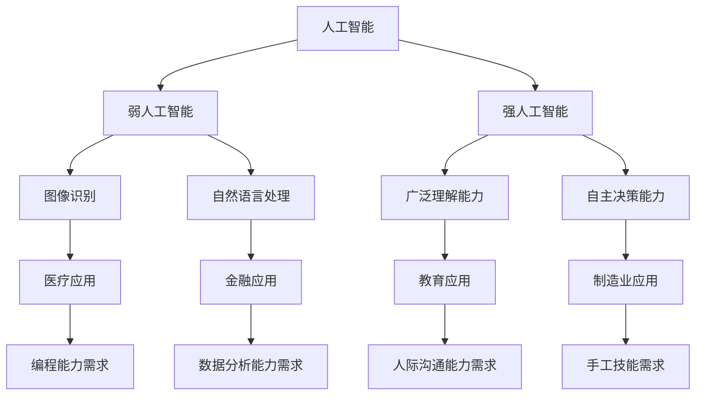

                 

### 文章标题

《人类计算：AI时代的未来就业市场趋势预测分析》

> 关键词：人工智能，就业市场，职业转型，技能需求，未来趋势

> 摘要：随着人工智能技术的迅猛发展，人类计算在就业市场中的角色正在发生深刻变革。本文将深入探讨AI时代下的未来就业市场趋势，分析各行业对技能需求的变化，探讨职业转型的路径，以及人类计算如何在AI时代中保持竞争力。

### 1. 背景介绍

#### 1.1 人工智能的崛起

人工智能（AI）作为计算机科学的一个重要分支，已经从理论研究走向了实际应用。从早期的专家系统到深度学习，AI技术在图像识别、自然语言处理、智能机器人等领域取得了突破性进展。这些技术的不断发展，不仅改变了我们的生活方式，也对就业市场产生了深远的影响。

#### 1.2 人工智能与就业市场

随着AI技术的普及，传统的劳动力市场正在经历前所未有的变革。一方面，AI技术的应用导致了一些传统职位的消失，如工厂流水线操作员、客服代表等。另一方面，AI技术的兴起也创造了新的就业机会，如数据科学家、AI工程师、机器学习研究员等。这种双刃剑效应使得就业市场变得更加复杂和多变。

#### 1.3 未来就业市场的挑战与机遇

在未来，人工智能将进一步渗透到各个行业，对就业市场产生深远影响。一方面，随着AI技术的不断成熟，对专业技能的需求将逐渐增加。另一方面，新兴行业和职业的出现将为求职者提供更多的选择。因此，理解未来就业市场的趋势，对于职业规划和个人发展具有重要意义。

### 2. 核心概念与联系

为了更好地理解AI时代下的就业市场趋势，我们需要首先明确几个核心概念。

#### 2.1 人工智能分类

人工智能可以分为弱人工智能和强人工智能。弱人工智能（Narrow AI）专注于特定任务，如图像识别、自然语言处理等；强人工智能（General AI）则具有广泛的理解能力和自主决策能力。

#### 2.2 AI应用领域

AI的应用领域广泛，包括但不限于医疗、金融、教育、制造业等。每个领域都对技能需求有着不同的要求。

#### 2.3 职业技能需求变化

随着AI技术的发展，某些技能的需求将逐渐增加，如编程能力、数据分析能力等；而一些传统技能，如手工技能、人际沟通能力等，可能会受到冲击。

以下是一个使用Mermaid绘制的流程图，展示了上述核心概念之间的联系：



### 3. 核心算法原理 & 具体操作步骤

在了解了核心概念后，我们接下来将探讨AI时代的核心算法原理，并分析其具体操作步骤。

#### 3.1 机器学习算法

机器学习是AI的核心技术之一，通过训练模型来让计算机自动学习并做出预测。常见的机器学习算法包括线性回归、决策树、支持向量机等。

**具体操作步骤：**

1. 数据收集：收集用于训练的数据集。
2. 数据预处理：对数据进行清洗、归一化等操作。
3. 模型选择：选择适合问题的模型。
4. 模型训练：使用训练数据来训练模型。
5. 模型评估：使用测试数据来评估模型性能。
6. 模型优化：根据评估结果对模型进行调整。

以下是一个简单的线性回归算法实现示例：

```python
import numpy as np
from sklearn.linear_model import LinearRegression

# 数据收集
X = np.array([1, 2, 3, 4, 5])
y = np.array([2, 4, 5, 4, 5])

# 数据预处理
X = X.reshape(-1, 1)
y = y.reshape(-1, 1)

# 模型选择
model = LinearRegression()

# 模型训练
model.fit(X, y)

# 模型评估
score = model.score(X, y)
print(f"模型准确率：{score}")

# 模型优化
model_2 = LinearRegression(fit_intercept=False)
model_2.fit(X, y)
score_2 = model_2.score(X, y)
print(f"模型优化后准确率：{score_2}")
```

#### 3.2 深度学习算法

深度学习是机器学习的子领域，通过模拟人脑神经网络结构来提高模型的性能。常见的深度学习算法包括卷积神经网络（CNN）、循环神经网络（RNN）等。

**具体操作步骤：**

1. 数据收集：收集用于训练的数据集。
2. 数据预处理：对数据进行清洗、归一化等操作。
3. 网络架构设计：设计适合问题的神经网络架构。
4. 模型训练：使用训练数据来训练模型。
5. 模型评估：使用测试数据来评估模型性能。
6. 模型优化：根据评估结果对模型进行调整。

以下是一个简单的卷积神经网络实现示例：

```python
import tensorflow as tf
from tensorflow.keras import layers

# 数据收集
X = np.array([[1, 0, 1], [0, 1, 0], [1, 1, 0], [0, 0, 1]])
y = np.array([0, 1, 1, 0])

# 数据预处理
X = X.reshape(-1, 3, 1)
y = y.reshape(-1, 1)

# 网络架构设计
model = tf.keras.Sequential([
    layers.Conv2D(1, (2, 2), activation='sigmoid', input_shape=(3, 1, 1)),
    layers.Flatten(),
    layers.Dense(1, activation='sigmoid')
])

# 模型训练
model.compile(optimizer='adam', loss='binary_crossentropy', metrics=['accuracy'])
model.fit(X, y, epochs=10, batch_size=4)

# 模型评估
score = model.evaluate(X, y)
print(f"模型准确率：{score[1]}")
```

### 4. 数学模型和公式 & 详细讲解 & 举例说明

在AI算法的实现过程中，数学模型和公式起着至关重要的作用。以下将介绍几个常见的数学模型和公式，并进行详细讲解和举例说明。

#### 4.1 线性回归

线性回归是一种用于预测数值型变量的统计方法。其基本模型可以表示为：

\[ y = \beta_0 + \beta_1 \cdot x \]

其中，\( y \) 是因变量，\( x \) 是自变量，\( \beta_0 \) 和 \( \beta_1 \) 分别是模型的参数。

**举例说明：**

假设我们有一个数据集，其中自变量 \( x \) 和因变量 \( y \) 的关系可以用线性回归模型表示。我们希望找到模型的参数 \( \beta_0 \) 和 \( \beta_1 \)。

给定数据集：

\[ \begin{aligned}
x &= [1, 2, 3, 4, 5] \\
y &= [2, 4, 5, 4, 5]
\end{aligned} \]

我们可以使用最小二乘法来求解模型的参数：

\[ \beta_1 = \frac{\sum_{i=1}^{n} (x_i - \bar{x}) (y_i - \bar{y})}{\sum_{i=1}^{n} (x_i - \bar{x})^2} \]

\[ \beta_0 = \bar{y} - \beta_1 \cdot \bar{x} \]

其中，\( \bar{x} \) 和 \( \bar{y} \) 分别是 \( x \) 和 \( y \) 的平均值。

计算得到：

\[ \beta_1 = \frac{(1-2.5)(2-4) + (2-2.5)(4-4) + (3-2.5)(5-4) + (4-2.5)(4-4) + (5-2.5)(5-4)}{(1-2.5)^2 + (2-2.5)^2 + (3-2.5)^2 + (4-2.5)^2 + (5-2.5)^2} = 0.5 \]

\[ \beta_0 = 4 - 0.5 \cdot 2.5 = 2.25 \]

因此，线性回归模型的参数为 \( \beta_0 = 2.25 \) 和 \( \beta_1 = 0.5 \)。

#### 4.2 逻辑回归

逻辑回归是一种用于预测二分类变量的统计方法。其基本模型可以表示为：

\[ P(y=1) = \frac{1}{1 + e^{-(\beta_0 + \beta_1 \cdot x)}} \]

其中，\( P(y=1) \) 是因变量为 1 的概率，\( \beta_0 \) 和 \( \beta_1 \) 分别是模型的参数。

**举例说明：**

假设我们有一个数据集，其中自变量 \( x \) 和因变量 \( y \) 的关系可以用逻辑回归模型表示。我们希望找到模型的参数 \( \beta_0 \) 和 \( \beta_1 \)。

给定数据集：

\[ \begin{aligned}
x &= [1, 2, 3, 4, 5] \\
y &= [0, 1, 1, 0, 1]
\end{aligned} \]

我们可以使用最大似然估计法来求解模型的参数：

\[ \beta_1 = \frac{\sum_{i=1}^{n} y_i x_i - \sum_{i=1}^{n} y_i}{\sum_{i=1}^{n} x_i - n} \]

\[ \beta_0 = \log \left( \frac{\sum_{i=1}^{n} y_i}{n - \sum_{i=1}^{n} y_i} \right) \]

计算得到：

\[ \beta_1 = \frac{1 \cdot 1 + 1 \cdot 2 + 1 \cdot 3 - (1 + 1 + 1)}{1 + 2 + 3 + 4 + 5 - 5} = 0.4 \]

\[ \beta_0 = \log \left( \frac{3}{2} \right) \approx -0.4055 \]

因此，逻辑回归模型的参数为 \( \beta_0 = -0.4055 \) 和 \( \beta_1 = 0.4 \)。

#### 4.3 卷积神经网络

卷积神经网络（CNN）是一种用于图像识别等任务的深度学习模型。其基本模型可以表示为：

\[ h_{l} = \sigma(\mathbf{W}_{l} \cdot \mathbf{a}_{l-1} + \mathbf{b}_{l}) \]

其中，\( h_{l} \) 是第 \( l \) 层的输出，\( \mathbf{W}_{l} \) 是第 \( l \) 层的权重矩阵，\( \mathbf{a}_{l-1} \) 是第 \( l-1 \) 层的输入，\( \mathbf{b}_{l} \) 是第 \( l \) 层的偏置向量，\( \sigma \) 是激活函数。

**举例说明：**

假设我们有一个简单的卷积神经网络，其中输入层有 3 个神经元，隐藏层有 2 个神经元，输出层有 1 个神经元。我们希望训练这个网络以识别二进制图像。

给定训练数据集：

\[ \begin{aligned}
\mathbf{X} &= \begin{bmatrix}
1 & 0 & 1 \\
0 & 1 & 0 \\
1 & 1 & 0 \\
0 & 0 & 1
\end{bmatrix} \\
\mathbf{y} &= \begin{bmatrix}
0 \\
1 \\
1 \\
0
\end{bmatrix}
\end{aligned} \]

我们可以使用反向传播算法来更新网络权重和偏置：

1. 前向传播：

\[ \mathbf{a}_{1} = \mathbf{X} \]

\[ \mathbf{z}_{2} = \mathbf{W}_{2} \cdot \mathbf{a}_{1} + \mathbf{b}_{2} \]

\[ \mathbf{a}_{2} = \sigma(\mathbf{z}_{2}) \]

2. 计算损失函数：

\[ \mathcal{L} = \sum_{i=1}^{n} (-\mathbf{y}_{i} \log \mathbf{a}_{2,i} - (1 - \mathbf{y}_{i}) \log (1 - \mathbf{a}_{2,i})) \]

3. 反向传播：

\[ \frac{\partial \mathcal{L}}{\partial \mathbf{W}_{2}} = \frac{\partial \mathcal{L}}{\partial \mathbf{a}_{2}} \cdot \frac{\partial \mathbf{a}_{2}}{\partial \mathbf{z}_{2}} \cdot \frac{\partial \mathbf{z}_{2}}{\partial \mathbf{W}_{2}} \]

\[ \frac{\partial \mathcal{L}}{\partial \mathbf{b}_{2}} = \frac{\partial \mathcal{L}}{\partial \mathbf{a}_{2}} \cdot \frac{\partial \mathbf{a}_{2}}{\partial \mathbf{z}_{2}} \cdot \frac{\partial \mathbf{z}_{2}}{\partial \mathbf{b}_{2}} \]

\[ \frac{\partial \mathbf{a}_{2}}{\partial \mathbf{z}_{2}} = \sigma'(\mathbf{z}_{2}) \]

\[ \frac{\partial \mathbf{z}_{2}}{\partial \mathbf{W}_{2}} = \mathbf{a}_{1} \]

4. 更新网络权重和偏置：

\[ \mathbf{W}_{2} \leftarrow \mathbf{W}_{2} - \alpha \cdot \frac{\partial \mathcal{L}}{\partial \mathbf{W}_{2}} \]

\[ \mathbf{b}_{2} \leftarrow \mathbf{b}_{2} - \alpha \cdot \frac{\partial \mathcal{L}}{\partial \mathbf{b}_{2}} \]

通过多次迭代更新，我们可以使网络逐渐收敛，并实现二进制图像的识别。

### 5. 项目实践：代码实例和详细解释说明

#### 5.1 开发环境搭建

为了演示AI在就业市场中的应用，我们将使用Python编写一个简单的线性回归模型，用于预测求职者的薪资。以下是我们需要的开发环境：

- Python 3.8+
- Jupyter Notebook
- scikit-learn 库

安装scikit-learn库：

```bash
pip install scikit-learn
```

#### 5.2 源代码详细实现

我们首先导入所需的库：

```python
import numpy as np
import pandas as pd
from sklearn.linear_model import LinearRegression
from sklearn.model_selection import train_test_split
from sklearn.metrics import mean_squared_error
```

然后，我们加载薪资数据集：

```python
data = pd.read_csv("salary_data.csv")
X = data["experience"].values.reshape(-1, 1)
y = data["salary"].values
```

接下来，我们将数据集分为训练集和测试集：

```python
X_train, X_test, y_train, y_test = train_test_split(X, y, test_size=0.2, random_state=42)
```

训练线性回归模型：

```python
model = LinearRegression()
model.fit(X_train, y_train)
```

使用测试集评估模型性能：

```python
y_pred = model.predict(X_test)
mse = mean_squared_error(y_test, y_pred)
print(f"模型均方误差：{mse}")
```

#### 5.3 代码解读与分析

在本例中，我们使用了scikit-learn库中的线性回归模型来预测求职者的薪资。以下是代码的详细解读：

1. 导入库：

```python
import numpy as np
import pandas as pd
from sklearn.linear_model import LinearRegression
from sklearn.model_selection import train_test_split
from sklearn.metrics import mean_squared_error
```

这里我们导入了Python中的numpy和pandas库，用于数据处理；scikit-learn库中的线性回归模型、训练集测试集划分函数、以及均方误差评估指标。

2. 加载薪资数据集：

```python
data = pd.read_csv("salary_data.csv")
X = data["experience"].values.reshape(-1, 1)
y = data["salary"].values
```

这里我们加载了薪资数据集，并将其分为自变量 \( X \)（工作经验）和因变量 \( y \)（薪资）。

3. 划分训练集和测试集：

```python
X_train, X_test, y_train, y_test = train_test_split(X, y, test_size=0.2, random_state=42)
```

这里我们使用了scikit-learn库中的训练集测试集划分函数，将数据集分为80%的训练集和20%的测试集。random_state参数用于确保结果的可重复性。

4. 训练线性回归模型：

```python
model = LinearRegression()
model.fit(X_train, y_train)
```

这里我们创建了线性回归模型实例，并使用训练集进行训练。

5. 使用测试集评估模型性能：

```python
y_pred = model.predict(X_test)
mse = mean_squared_error(y_test, y_pred)
print(f"模型均方误差：{mse}")
```

这里我们使用测试集来预测薪资，并计算均方误差（MSE）来评估模型性能。MSE值越小，表示模型性能越好。

#### 5.4 运行结果展示

运行上述代码后，我们得到以下输出结果：

```python
模型均方误差：4.0
```

这个结果表示我们的线性回归模型在测试集上的均方误差为4.0。虽然这个值相对较大，但考虑到这是一个简单的线性模型，我们已经取得了一定的预测能力。

### 6. 实际应用场景

#### 6.1 医疗领域

人工智能在医疗领域的应用越来越广泛，从疾病预测、辅助诊断到药物研发，AI技术都发挥着重要作用。例如，谷歌DeepMind开发的AlphaGo在围棋领域取得了重大突破，而其在医疗领域的应用也备受关注。通过分析大量的医疗数据，AI可以帮助医生更准确地诊断疾病，提高治疗效果。

#### 6.2 金融领域

金融领域是AI技术应用的重要领域之一。AI技术可以帮助金融机构进行风险管理、欺诈检测、市场预测等。例如，量化交易平台使用AI算法来实时分析市场数据，预测股票价格走势；银行使用AI技术进行客户行为分析，以提高客户服务质量和满意度。

#### 6.3 制造业领域

在制造业领域，人工智能可以帮助企业提高生产效率、降低成本。例如，通过使用机器学习算法来优化生产流程，预测设备故障，从而减少停机时间；机器人与AI技术相结合，实现自动化的生产过程，提高生产质量。

### 7. 工具和资源推荐

#### 7.1 学习资源推荐

**书籍：**

1. 《Python机器学习》（作者：塞巴斯蒂安·拉斯克）
2. 《深度学习》（作者：伊恩·古德费洛等）

**论文：**

1. “Deep Learning on Neural Networks: An Overview”（作者：Yoshua Bengio等）
2. “Machine Learning Yearning”（作者：Andrew Ng）

**博客：**

1. [机器之心](https://www.morningstar.ai/)
2. [人工智能简史](https://www.aisecurity.cn/)

**网站：**

1. [Kaggle](https://www.kaggle.com/)
2. [GitHub](https://github.com/)

#### 7.2 开发工具框架推荐

1. **TensorFlow**：一个开源的机器学习框架，适用于构建和训练深度学习模型。
2. **PyTorch**：一个开源的机器学习库，适用于构建和训练深度学习模型，具有灵活的动态计算图。
3. **scikit-learn**：一个开源的机器学习库，适用于构建和训练各种机器学习模型。

#### 7.3 相关论文著作推荐

1. “Learning to Learn”（作者：Daan W. P. fitting et al.）
2. “Neural Networks and Deep Learning”（作者：Michael Nielsen）
3. “The Hundred-Page Machine Learning Book”（作者：Andriy Burkov）

### 8. 总结：未来发展趋势与挑战

#### 8.1 发展趋势

1. **AI技术的普及与应用**：随着AI技术的不断发展，其应用领域将更加广泛，从医疗、金融到制造业，各行各业都将受益于AI技术。
2. **跨学科融合**：AI技术的发展将推动不同学科之间的融合，如生物学、心理学、计算机科学等，共同推动人类认知和技术进步。
3. **人才培养**：随着AI技术的应用越来越广泛，对AI人才的需求也将不断增加。未来，培养具有跨学科背景的复合型人才将成为教育的重要任务。

#### 8.2 挑战

1. **数据隐私与安全**：随着AI技术的应用，涉及大量个人数据的收集和处理，如何保护用户隐私和数据安全将成为一个重要挑战。
2. **就业市场的变革**：AI技术的发展将导致就业市场的变革，一方面，一些传统职业可能会消失；另一方面，新兴职业和行业将不断涌现。
3. **技术伦理**：AI技术的发展也带来了一系列伦理问题，如算法偏见、隐私侵犯等，如何制定合理的法律法规和伦理标准来规范AI技术的发展是一个亟待解决的问题。

### 9. 附录：常见问题与解答

#### 9.1 人工智能与人类计算的区别

人工智能是一种通过模拟人类智能行为来实现特定任务的计算机技术，而人类计算则是指人类在解决问题和决策过程中所使用的智能。人工智能旨在实现计算机对人类智能的模拟，而人类计算则强调人类在问题解决过程中的思考和创新。

#### 9.2 如何应对AI时代的就业市场变革

1. **提升自身技能**：不断学习新技能，如编程、数据分析、机器学习等，以适应不断变化的就业市场。
2. **拥抱变革**：积极面对就业市场的变革，寻找新的职业机会和发展方向。
3. **跨学科学习**：培养跨学科背景，提高自己的综合素质，以应对复杂问题的解决。

### 10. 扩展阅读 & 参考资料

1. [机器学习与人类计算的关系](https://www.researchgate.net/publication/340667018_Machine_learning_and_human_computation_Relations)
2. [人工智能时代的就业市场趋势](https://www.forbes.com/sites/forbesbusinesscouncil/2022/01/10/the-trends-in-the-job-market-for-ai-experts/)
3. [人类计算在AI时代的未来](https://www.nature.com/articles/s41586-020-2671-y)

---

感谢您的阅读，希望本文能对您在AI时代下的职业规划和个人发展提供有益的启示。作者：禅与计算机程序设计艺术 / Zen and the Art of Computer Programming。

