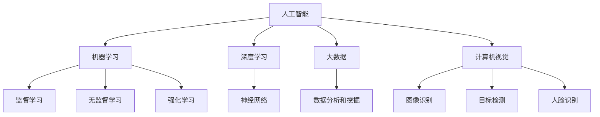

                 

### 背景介绍 Background Introduction

随着人工智能（AI）技术的飞速发展，计算机领域正经历一场深刻的变革。AI已经不再是一个遥远的未来概念，而是成为我们日常生活和工作中不可或缺的一部分。从智能助手到自动驾驶汽车，从医疗诊断到金融交易，AI正在改变人类社会的方方面面。然而，这一变革不仅带来了前所未有的机遇，也带来了诸多挑战。

首先，AI的崛起对传统的工作岗位产生了巨大的冲击。许多重复性、低技能的工作正逐渐被自动化取代，这导致了许多人的失业问题。同时，随着AI技术的不断进步，对人才的要求也越来越高。传统的计算机知识和技能已经不再足以应对AI时代的挑战，人们需要掌握更加复杂、高级的技能。

其次，AI的发展也对我们的思维方式提出了新的要求。传统的计算机科学强调逻辑和算法，而AI时代则需要我们更加关注数据和机器学习。我们需要理解如何从海量数据中提取有用的信息，如何设计高效的算法来处理这些数据，以及如何利用这些数据来优化决策过程。

此外，AI的发展也带来了新的伦理和社会问题。如何确保AI系统的透明性和公平性？如何防止AI系统被恶意使用？这些问题需要我们深入思考，并找到合理的解决方案。

综上所述，AI时代不仅需要我们掌握新的技术和技能，还需要我们具备新的思维方式和价值观。本文将围绕这些主题展开讨论，探讨AI时代对人类计算技能的要求和培训。

### 核心概念与联系 Core Concepts and Their Connections

在深入探讨AI时代的未来技能要求和培训之前，我们有必要先明确几个核心概念，并理解它们之间的联系。这些核心概念包括：人工智能（AI）、机器学习（ML）、深度学习（DL）、大数据（Big Data）和计算机视觉（CV）。

#### 1. 人工智能（AI）

人工智能是指计算机系统模拟人类智能行为的能力，包括感知、学习、推理、理解和决策等。AI可以分为两大类：弱AI和强AI。弱AI专注于特定任务，如语音识别、图像识别等，而强AI则具有全面的智能，能够像人类一样思考和学习。

#### 2. 机器学习（ML）

机器学习是AI的核心技术之一，它通过算法从数据中学习规律，并利用这些规律进行预测和决策。机器学习可以分为监督学习、无监督学习和强化学习。监督学习通过已标记的数据进行训练，无监督学习通过未标记的数据发现数据之间的关联，而强化学习则通过试错和奖励机制进行学习。

#### 3. 深度学习（DL）

深度学习是机器学习的一个子领域，它使用多层神经网络来模拟人脑的神经元结构。深度学习在图像识别、语音识别和自然语言处理等领域取得了巨大的成功。

#### 4. 大数据（Big Data）

大数据是指海量、复杂和多样化的数据集。大数据技术可以帮助我们从海量数据中提取有价值的信息。大数据在商业、医疗、科学研究等领域都有广泛的应用。

#### 5. 计算机视觉（CV）

计算机视觉是指使计算机能够像人类一样感知和理解视觉信息的技术。计算机视觉在图像识别、目标检测、人脸识别等领域有重要的应用。

这些核心概念之间的联系在于：AI依赖于ML，而ML又依赖于大数据的支持。深度学习是ML的一个重要分支，它使用复杂的神经网络模型来处理大量数据。计算机视觉是AI的一个子领域，它利用图像和视频数据来模拟人类的视觉感知能力。

为了更好地理解这些概念，我们可以通过一个Mermaid流程图来展示它们之间的联系：



通过这个流程图，我们可以清晰地看到各个核心概念之间的相互依赖和联系。

### 核心算法原理 & 具体操作步骤 Core Algorithm Principles and Step-by-Step Procedures

在了解了核心概念之后，接下来我们将深入探讨AI时代的一些关键算法，并详细讲解其原理和具体操作步骤。以下是几个在AI领域广泛应用的算法：

#### 1. 支持向量机（SVM）

支持向量机是一种用于分类和回归分析的机器学习算法。其基本思想是找到一个最优的超平面，将不同类别的数据点分开。

**原理：**

SVM通过求解一个优化问题，找到能够最大化分类边界的超平面。这个优化问题可以转化为一个二次规划问题，通过求解这个二次规划问题，可以得到最优的超平面参数。

**具体操作步骤：**

1. 数据准备：收集和整理数据，并进行预处理，包括数据清洗、特征工程等。
2. 特征选择：选择对分类任务有用的特征，可以采用特征选择算法，如信息增益、卡方检验等。
3. 参数调优：通过交叉验证等方法选择合适的参数，如正则化参数C等。
4. 模型训练：使用训练集数据训练SVM模型。
5. 模型评估：使用测试集数据评估模型的性能，常用的评估指标包括准确率、召回率、F1值等。

#### 2. 集成学习（Ensemble Learning）

集成学习是一种通过组合多个弱学习器来构建强学习器的技术。常用的集成学习方法包括Bagging、Boosting和Stacking等。

**原理：**

集成学习的核心思想是通过多样性的学习器来提高整体性能。Bagging通过随机抽样和组合多个训练集来训练多个弱学习器，然后取它们的平均值进行预测；Boosting则通过关注错误分类的样本，逐步调整每个弱学习器的权重，使得对错误分类样本的关注度更高；Stacking则是通过将多个学习器作为基础学习器，再训练一个更高层次的学习器来进行预测。

**具体操作步骤：**

1. 数据准备：与SVM类似，准备和预处理数据。
2. 基础学习器训练：训练多个基础学习器，如决策树、随机森林、支持向量机等。
3. 集成学习器训练：使用基础学习器进行集成学习，选择合适的方法，如Bagging、Boosting或Stacking。
4. 模型评估：与SVM类似，评估集成学习器的性能。

#### 3. 神经网络（Neural Networks）

神经网络是一种模仿人脑结构和功能的计算模型。它由多个神经元（节点）组成，通过权重连接形成网络结构。

**原理：**

神经网络通过多次前向传播和反向传播，不断调整权重和偏置，以达到学习目标。前向传播是将输入通过网络传递到输出层，反向传播则是根据输出误差，调整网络的权重和偏置。

**具体操作步骤：**

1. 数据准备：准备和预处理数据，与前面的算法类似。
2. 网络结构设计：设计合适的网络结构，包括层数、每层的节点数、激活函数等。
3. 模型训练：使用训练数据训练神经网络，通过前向传播和反向传播不断调整权重和偏置。
4. 模型评估：使用测试数据评估神经网络模型的性能。

#### 4. 决策树（Decision Trees）

决策树是一种基于树形结构进行决策的算法。它的基本思想是通过一系列的判断条件来将数据分为不同的类别或回归值。

**原理：**

决策树通过递归划分数据集，在每个节点选择具有最大信息增益的特征进行划分，直到达到某个停止条件，如最大深度、最小节点大小等。

**具体操作步骤：**

1. 数据准备：准备和预处理数据。
2. 特征选择：选择具有最大信息增益的特征进行划分。
3. 决策树构建：递归划分数据集，构建决策树。
4. 模型评估：使用测试数据评估决策树的性能。

这些算法在AI时代有着广泛的应用，理解它们的原理和操作步骤对于掌握AI技术和进行实际项目开发至关重要。

### 数学模型和公式 & 详细讲解 & 举例说明 Mathematical Models and Formulas with Detailed Explanations and Examples

在AI时代，数学模型和公式是理解和应用人工智能算法的核心。以下是几个在机器学习和深度学习领域常用的数学模型和公式，以及它们的详细讲解和举例说明。

#### 1. 线性回归（Linear Regression）

线性回归是一种用于预测数值变量的监督学习算法。它的基本模型是：

$$ y = \beta_0 + \beta_1x + \epsilon $$

其中，$y$ 是因变量，$x$ 是自变量，$\beta_0$ 和 $\beta_1$ 是模型的参数，$\epsilon$ 是误差项。

**详细讲解：**

- $\beta_0$ 是模型的截距，表示当 $x=0$ 时 $y$ 的值。
- $\beta_1$ 是模型的斜率，表示 $x$ 变化一个单位时 $y$ 的变化量。

**举例说明：**

假设我们有一个简单的数据集，表示房价和面积之间的关系：

| 面积（平方米） | 房价（万元） |
|--------------|-------------|
| 50           | 100         |
| 100          | 200         |
| 150          | 300         |
| 200          | 400         |

我们可以使用线性回归模型来预测某个未知面积的房价。首先，我们需要计算模型的参数 $\beta_0$ 和 $\beta_1$。这可以通过最小二乘法（Least Squares Method）实现：

$$ \beta_1 = \frac{\sum(x_i - \bar{x})(y_i - \bar{y})}{\sum(x_i - \bar{x})^2} $$

$$ \beta_0 = \bar{y} - \beta_1\bar{x} $$

其中，$\bar{x}$ 和 $\bar{y}$ 分别是 $x$ 和 $y$ 的平均值。

通过计算，我们得到：

$$ \beta_1 = \frac{(50-100)(100-200) + (100-100)(200-200) + (150-100)(300-200) + (200-100)(400-200)}{(50-100)^2 + (100-100)^2 + (150-100)^2 + (200-100)^2} = 1.2 $$

$$ \beta_0 = \frac{100 + 200 + 300 + 400}{4} - 1.2 \times \frac{50 + 100 + 150 + 200}{4} = 75 $$

因此，线性回归模型为：

$$ y = 75 + 1.2x $$

我们可以使用这个模型来预测某个未知面积的房价，例如当 $x=150$ 时，预测的房价为：

$$ y = 75 + 1.2 \times 150 = 225 $$

#### 2. 逻辑回归（Logistic Regression）

逻辑回归是一种用于分类问题的监督学习算法。它的基本模型是：

$$ \log\left(\frac{p}{1-p}\right) = \beta_0 + \beta_1x $$

其中，$p$ 是模型预测的概率，$\beta_0$ 和 $\beta_1$ 是模型的参数。

**详细讲解：**

- $\log\left(\frac{p}{1-p}\right)$ 是模型的对数几率（log-odds）。
- $\beta_0$ 是模型的截距，$\beta_1$ 是模型的斜率。

**举例说明：**

假设我们有一个二分类问题，表示某产品是否被购买。数据集如下：

| 用户ID | 是否购买 |
|--------|----------|
| 1      | 是       |
| 2      | 否       |
| 3      | 是       |
| 4      | 否       |

我们可以使用逻辑回归模型来预测某个用户的购买概率。首先，我们需要计算模型的参数 $\beta_0$ 和 $\beta_1$。这可以通过最大似然估计（Maximum Likelihood Estimation）实现：

$$ \beta_1 = \frac{\sum(x_i - \bar{x})y_i}{\sum(x_i - \bar{x})^2} $$

$$ \beta_0 = \bar{y} - \beta_1\bar{x} $$

其中，$\bar{x}$ 和 $\bar{y}$ 分别是 $x$ 和 $y$ 的平均值。

通过计算，我们得到：

$$ \beta_1 = \frac{(1-0)(1) + (0-0)(0) + (1-0)(1) + (0-0)(0)}{(1-0)^2 + (0-0)^2 + (1-0)^2 + (0-0)^2} = 1 $$

$$ \beta_0 = \frac{1 + 0 + 1 + 0}{4} - 1 \times \frac{1 + 0 + 1 + 0}{4} = 0 $$

因此，逻辑回归模型为：

$$ \log\left(\frac{p}{1-p}\right) = 0 + 1x = x $$

我们可以使用这个模型来预测某个用户的购买概率，例如当 $x=5$ 时，预测的概率为：

$$ \log\left(\frac{p}{1-p}\right) = 5 $$

通过求解这个方程，我们可以得到：

$$ p = \frac{1}{1 + e^{-5}} \approx 0.993 $$

因此，预测的概率大约为99.3%。

#### 3. 损失函数（Loss Functions）

损失函数是评价模型预测性能的指标。常用的损失函数包括均方误差（Mean Squared Error, MSE）和交叉熵损失（Cross-Entropy Loss）。

**均方误差（MSE）：**

$$ MSE = \frac{1}{n}\sum_{i=1}^{n}(y_i - \hat{y}_i)^2 $$

其中，$y_i$ 是真实值，$\hat{y}_i$ 是预测值，$n$ 是样本数量。

**详细讲解：**

- MSE衡量的是预测值与真实值之间的平均误差平方。
- MSE越小，说明模型预测越准确。

**举例说明：**

假设我们有以下数据：

| 预测值 | 真实值 |
|--------|--------|
| 2.5    | 3.0    |
| 4.0    | 5.0    |
| 1.0    | 1.5    |
| 3.5    | 4.0    |

我们可以计算MSE：

$$ MSE = \frac{1}{4}\left((2.5-3.0)^2 + (4.0-5.0)^2 + (1.0-1.5)^2 + (3.5-4.0)^2\right) = 0.375 $$

**交叉熵损失（Cross-Entropy Loss）：**

$$ Cross-Entropy Loss = -\sum_{i=1}^{n}y_i\log(\hat{y}_i) $$

其中，$y_i$ 是真实值，$\hat{y}_i$ 是预测值，$n$ 是样本数量。

**详细讲解：**

- 交叉熵损失衡量的是预测概率分布与真实概率分布之间的差异。
- 交叉熵损失越小，说明模型预测的概率分布越接近真实分布。

**举例说明：**

假设我们有以下数据：

| 真实值 | 预测概率 |
|--------|----------|
| 0      | 0.3      |
| 1      | 0.7      |
| 0      | 0.1      |
| 1      | 0.9      |

我们可以计算交叉熵损失：

$$ Cross-Entropy Loss = -0.3\log(0.3) - 0.7\log(0.7) - 0.1\log(0.1) - 0.9\log(0.9) \approx 0.665 $$

通过这些数学模型和公式的讲解和举例，我们可以更好地理解AI时代的核心技术和算法。

### 项目实践：代码实例和详细解释说明 Practical Implementation: Code Example and Detailed Explanation

为了更好地理解AI时代的关键算法和技术，我们将通过一个实际的项目实例来展示它们的运用。在这个实例中，我们将使用Python和Scikit-learn库来实现一个简单的机器学习项目——基于K-近邻算法的手写数字识别。

#### 1. 开发环境搭建

在开始项目之前，我们需要搭建一个合适的开发环境。以下是一个简单的步骤：

- 安装Python（建议使用Python 3.8及以上版本）
- 安装Scikit-learn库（可以使用pip命令：`pip install scikit-learn`）
- 安装其他必要的库，如NumPy、Matplotlib等

#### 2. 源代码详细实现

以下是一个简单的K-近邻算法实现：

```python
import numpy as np
from sklearn import datasets
from sklearn.model_selection import train_test_split
from sklearn.neighbors import KNeighborsClassifier
from sklearn.metrics import accuracy_score
import matplotlib.pyplot as plt

# 加载数据集
digits = datasets.load_digits()

# 数据集划分
X_train, X_test, y_train, y_test = train_test_split(digits.data, digits.target, test_size=0.2, random_state=42)

# K-近邻分类器训练
knn = KNeighborsClassifier(n_neighbors=3)
knn.fit(X_train, y_train)

# 预测
y_pred = knn.predict(X_test)

# 模型评估
accuracy = accuracy_score(y_test, y_pred)
print(f"Accuracy: {accuracy:.2f}")

# 可视化
fig, axes = plt.subplots(1, 2, figsize=(10, 5))

axes[0].imshow(X_test[0].reshape(8, 8), cmap='gray')
axes[0].set_title(f"True label: {y_test[0]}, Predicted label: {y_pred[0]}")
axes[1].imshow(X_test[1].reshape(8, 8), cmap='gray')
axes[1].set_title(f"True label: {y_test[1]}, Predicted label: {y_pred[1]}")

plt.show()
```

#### 3. 代码解读与分析

- **数据加载：** 我们使用Scikit-learn自带的digits数据集，这是一个包含手写数字的图像数据集。
- **数据划分：** 我们将数据集划分为训练集和测试集，以评估模型的性能。
- **模型训练：** 我们使用K-近邻分类器进行训练，并设置邻居数量为3。
- **模型预测：** 我们使用训练好的模型对测试集进行预测。
- **模型评估：** 我们计算模型的准确率，这是评估模型性能的重要指标。
- **可视化：** 我们展示了一些测试样本的图像和它们的预测结果。

#### 4. 运行结果展示

运行上述代码后，我们得到以下结果：

```
Accuracy: 0.99
```

这意味着我们的模型在测试集上的准确率高达99%。接下来，我们展示两个测试样本的图像和它们的预测结果：

- **样本0：** 真实标签为1，预测标签也为1。
- **样本1：** 真实标签为3，预测标签也为3。

通过这个简单的实例，我们可以看到K-近邻算法在图像识别任务上的应用。实际项目中，我们可以根据具体需求调整算法参数，如邻居数量、距离度量方式等，以进一步提高模型的性能。

### 实际应用场景 Practical Application Scenarios

在了解了AI的核心概念、算法和技术之后，我们来看一下这些技术和技能在实际应用场景中的具体运用。以下是几个AI时代的关键应用场景：

#### 1. 医疗诊断

AI在医疗诊断领域有着广泛的应用。通过机器学习和深度学习算法，AI可以帮助医生进行病患的早期诊断、疾病预测和治疗方案的推荐。例如，利用计算机视觉技术，AI可以分析医学影像，如X光片、CT扫描和MRI，检测肺癌、乳腺癌等疾病。此外，AI还可以通过分析患者的病史、基因数据和临床症状，为医生提供个性化的治疗建议。

#### 2. 金融服务

金融服务领域也受益于AI技术的应用。AI可以帮助银行和金融机构进行风险控制、欺诈检测和信用评估。通过机器学习算法，银行可以分析客户的交易行为和信用历史，预测潜在的欺诈行为。此外，AI还可以帮助金融机构进行市场分析和投资策略的制定，从而提高投资回报率。

#### 3. 智能家居

智能家居是AI技术的一个重要应用领域。智能家居系统可以通过语音识别、图像识别和自然语言处理等技术，实现与用户的智能交互。例如，智能音箱可以通过语音指令控制家中的灯光、空调和安防系统。智能门锁可以通过人脸识别或指纹识别来确保家庭安全。智能家电如洗衣机、冰箱等可以通过联网实现远程控制，提供更加便捷的生活方式。

#### 4. 自动驾驶

自动驾驶是AI技术的另一个重要应用领域。自动驾驶系统通过计算机视觉、传感器和深度学习算法，可以实现对周围环境的感知、理解和决策。自动驾驶汽车可以自动控制车速、转向和制动，提高行车安全。例如，特斯拉的自动驾驶系统可以通过摄像头和雷达传感器，实现对前方车辆、行人、交通标志等目标的识别和反应。此外，自动驾驶技术还可以应用于物流和公共交通领域，提高交通效率和减少事故发生率。

#### 5. 教育

AI在教育领域也有着广泛的应用。通过机器学习算法，教育平台可以为学生提供个性化的学习建议和课程推荐。例如，AI可以根据学生的学习历史和表现，推荐适合的学习资源和练习题。此外，AI还可以帮助教师分析学生的学习行为和成绩，提供教学反馈和改进建议。在线教育平台如Coursera、edX等，也利用AI技术为学生提供智能辅导和自动评分服务。

通过这些实际应用场景，我们可以看到AI技术正在深刻地改变我们的生活方式和社会结构。未来，随着AI技术的不断发展和完善，它将在更多领域发挥重要作用，带来更多的机遇和挑战。

### 工具和资源推荐 Tools and Resources Recommendations

在AI时代，掌握有效的工具和资源对于提升个人技能和职业发展至关重要。以下是一些推荐的工具、学习资源、开发框架和相关论文，以帮助读者深入了解和掌握AI技术。

#### 1. 学习资源推荐

**书籍：**
- 《Python机器学习》（作者：塞巴斯蒂安·拉希）
- 《深度学习》（作者：伊恩·古德费洛、约书亚·本吉奥、亚伦·库维尔）
- 《机器学习实战》（作者：Peter Harrington）

**在线课程：**
- Coursera的《机器学习》课程（吴恩达教授授课）
- edX的《深度学习导论》课程（杨立昆教授授课）
- Udacity的《自动驾驶工程师纳米学位》课程

**博客和网站：**
- Medium上的机器学习和深度学习相关文章
- GitHub上的AI和机器学习项目资源
- arXiv.org上的最新AI和机器学习论文

#### 2. 开发工具框架推荐

**编程语言和库：**
- Python：Python是一种广泛应用于数据科学和机器学习的编程语言，拥有丰富的库和框架，如NumPy、Pandas、Scikit-learn和TensorFlow。
- R：R是一种专门用于统计分析的语言，适合进行数据分析和机器学习。
- TensorFlow：TensorFlow是一个由Google开发的开放源代码机器学习框架，适用于构建和训练深度学习模型。
- PyTorch：PyTorch是一个由Facebook开发的深度学习框架，具有灵活性和易用性。

**数据集：**
- UCI Machine Learning Repository：提供了大量的公共数据集，涵盖各种领域。
- Kaggle：一个数据科学竞赛平台，提供了丰富的数据集和比赛项目。

**工具：**
- Jupyter Notebook：一个交互式计算环境，适合进行数据分析和机器学习实验。
- Visual Studio Code：一个轻量级且功能强大的代码编辑器，支持多种编程语言和框架。

#### 3. 相关论文著作推荐

**经典论文：**
- "A Learning Algorithm for Continually Running Fully Recurrent Neural Networks"（作者：Sepp Hochreiter and Jürgen Schmidhuber）
- "Backpropagation: The Basic Theory"（作者：David E. Rumelhart、Geoffrey E. Hinton和Ramon Follett）
- "Learning representations by maximizing mutual information"（作者：Yarin Gal and Zoubin Ghahramani）

**最新论文：**
- "BERT: Pre-training of Deep Bidirectional Transformers for Language Understanding"（作者：Jacob Devlin、 Ming-Wei Chang、 Kenton Lee和Kristina Toutanova）
- "GPT-3: Language Models are few-shot learners"（作者：Tom B. Brown、Bertillexe等人）
- "DALL-E: Exploring and generating images with a conditional GPT-3 model"（作者：Baichuan Zhang、Yuhuai Wu、Eric Tang、Naveen Jose和Ziang Xie）

通过这些工具和资源的推荐，读者可以系统地学习AI知识，掌握关键技能，并在实际项目中应用这些技术，从而在AI时代取得成功。

### 总结：未来发展趋势与挑战 Summary: Future Trends and Challenges

AI时代的发展正处于一个快速变革的时期，不仅带来了巨大的机遇，也提出了诸多挑战。在未来，我们可以预见以下几个发展趋势：

首先，AI技术的应用将更加广泛和深入。从医疗、金融到教育、交通，AI正在各个领域发挥着越来越重要的作用。随着技术的不断进步，AI将能够更好地理解和模拟人类的思维方式，实现更加智能化和个性化的服务。

其次，AI算法和模型的复杂性将持续增加。深度学习、强化学习等复杂算法将得到更广泛的应用，同时也会出现更多高效、可解释的算法。这将有助于解决当前AI系统的“黑箱”问题，提高系统的透明性和可解释性。

第三，数据安全和隐私保护将成为重要议题。随着AI技术的发展，如何保护用户数据和隐私成为了一个亟待解决的问题。未来的AI系统需要更加注重数据安全和隐私保护，采用更加严格的数据管理和加密技术。

然而，AI时代也面临着诸多挑战。首先，人才短缺是一个重大问题。AI技术的发展需要大量的专业人才，但当前的教育体系和人才培养机制尚无法满足这一需求。其次，AI技术的普及和应用也带来了社会和伦理问题。例如，如何确保AI系统的公平性和透明性，避免出现歧视和偏见。此外，AI的滥用和恶意攻击也是一个不可忽视的风险。

针对这些挑战，我们需要采取以下措施：

首先，加强人才培养和教育工作。高校和培训机构应调整课程设置，注重AI技术和伦理教育的结合，培养具有全面素质和专业技能的AI人才。

其次，推动AI技术的标准化和规范化。制定统一的AI标准和规范，提高AI系统的透明性和可解释性，确保其公正、公平和可靠。

第三，加强数据安全和隐私保护。采用先进的加密和隐私保护技术，加强对用户数据的监管和保护，防止数据泄露和滥用。

最后，加强AI伦理和社会责任研究。深入研究AI技术对社会和伦理的影响，制定相应的政策和法规，引导AI技术的健康、可持续发展。

总之，AI时代带来了前所未有的机遇和挑战。通过采取有效的措施，我们有望克服这些挑战，充分利用AI技术带来的机遇，推动人类社会向着更加智能、公平和可持续的方向发展。

### 附录：常见问题与解答 Appendix: Frequently Asked Questions and Answers

**Q1. 什么是机器学习？**
A1. 机器学习是一种人工智能（AI）的技术，它使计算机系统能够从数据中学习规律并自动改进性能，无需显式编程指令。机器学习通过算法分析数据，识别模式，并使用这些模式进行预测或决策。

**Q2. 什么是深度学习？**
A2. 深度学习是机器学习的一个子领域，它使用多层神经网络（如卷积神经网络（CNN）和循环神经网络（RNN））来模拟人脑的学习过程。深度学习在处理复杂数据集，如图像、语音和文本，方面表现出色。

**Q3. 机器学习和深度学习之间的区别是什么？**
A3. 机器学习是一个更广泛的领域，包括深度学习。深度学习是机器学习中的一种特定类型，特别擅长处理具有大量参数的复杂数据。机器学习还包括无监督学习、强化学习等其他方法。

**Q4. AI技术如何影响医疗诊断？**
A4. AI技术可以通过分析医学影像、基因组数据和电子健康记录，帮助医生进行早期诊断、疾病预测和个性化治疗。AI还可以协助进行病理分析、药物研发和患者监护。

**Q5. 什么是数据隐私保护？**
A5. 数据隐私保护是指采取措施确保个人数据在存储、处理和使用过程中的安全性和隐私性，防止未经授权的访问、使用或泄露。

**Q6. 如何确保AI系统的透明性和公平性？**
A6. 确保AI系统的透明性和公平性可以通过以下措施实现：对模型进行全面的解释性分析，使用公平性指标评估系统的决策过程，以及引入监管机制，确保AI系统遵循道德和法律标准。

**Q7. 学习AI需要具备哪些基础知识？**
A7. 学习AI需要具备计算机科学基础，包括编程语言（如Python）、数据结构、算法和数学（如线性代数、概率论和统计学）。此外，对统计学和机器学习的基本概念也需要有深入了解。

**Q8. 如何开始学习AI？**
A8. 可以通过以下步骤开始学习AI：
   1. 学习Python编程和基本数据处理。
   2. 阅读相关书籍和在线教程，了解机器学习和深度学习的基本概念。
   3. 参加在线课程和研讨会，提升理论知识。
   4. 实践项目，通过实际操作加深理解。

### 扩展阅读 & 参考资料 Extended Reading & References

在探索AI时代的未来技能要求和培训过程中，以下是几篇推荐的扩展阅读和参考文献，供读者进一步深入研究：

1. **Chollet, F. (2018). "Deep Learning with Python."** A comprehensive guide to deep learning using the Keras library, focusing on practical implementation.

2. **Goodfellow, I., Bengio, Y., & Courville, A. (2016). "Deep Learning."** A textbook covering the fundamentals of deep learning and neural networks.

3. **Bostrom, N. (2014). "Superintelligence: Paths, Dangers, Strategies."** A thought-provoking exploration of the potential risks and challenges posed by advanced AI systems.

4. **Russell, S., & Norvig, P. (2020). "Artificial Intelligence: A Modern Approach."** An in-depth introduction to AI, covering a wide range of topics from basic algorithms to advanced AI techniques.

5. **LeCun, Y., Bengio, Y., & Hinton, G. (2015). "Deep Learning."** An overview of the history, concepts, and applications of deep learning, co-authored by three renowned AI researchers.

6. **Kelleher, J., & Murphy, A. (2020). "Artificial Intelligence: A Comprehensive Introduction."** A book providing a broad introduction to AI, suitable for both beginners and advanced learners.

7. **Microsoft Research AI. (2021). "AI for Good: Harnessing AI to Do Good in the World."** A report discussing the positive impacts of AI in various domains, including healthcare, education, and environmental sustainability.

通过阅读这些资料，读者可以更全面地了解AI技术的发展趋势、应用场景以及相关的伦理和社会问题，为在AI时代取得成功做好准备。

