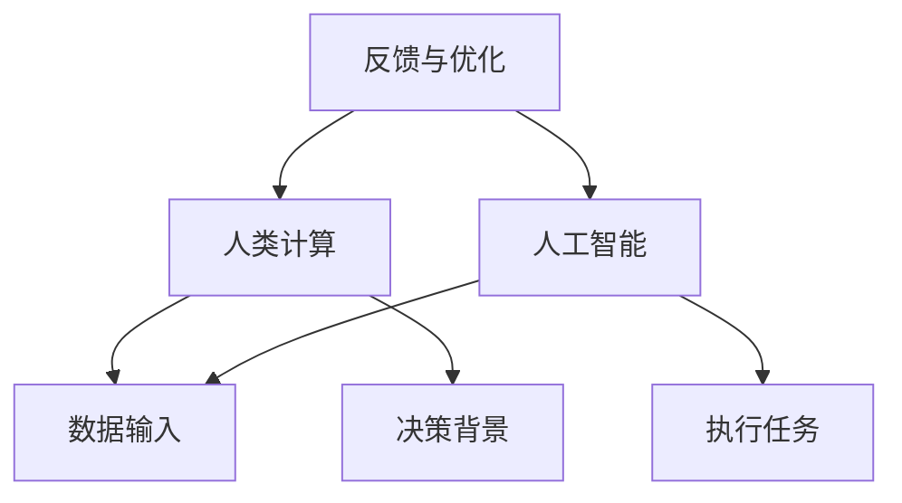
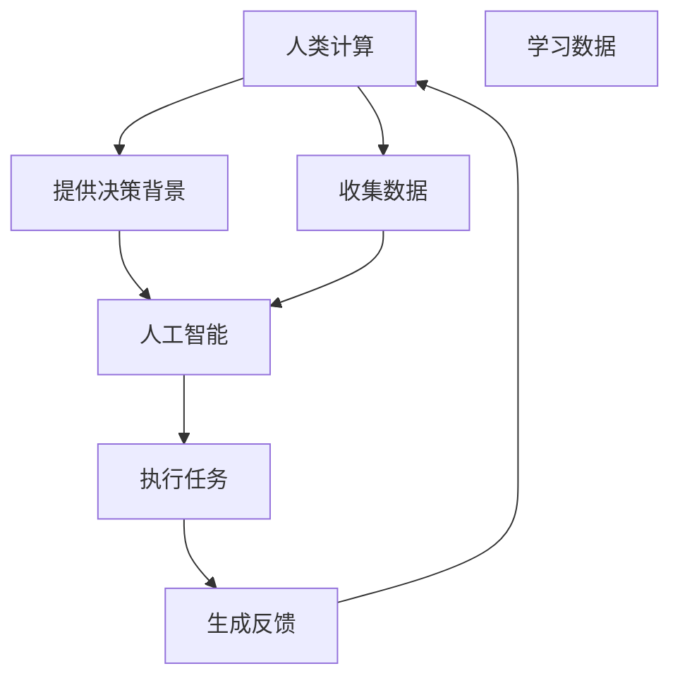

                 

### 背景介绍

随着人工智能（AI）技术的飞速发展，AI已经在各个领域展现出强大的潜力和广泛应用。从自动化生产线到医疗诊断，从智能推荐系统到自动驾驶汽车，AI正在改变我们的生活方式和工作方式。然而，这一变革不仅仅带来了技术进步，还引发了诸多道德和社会责任问题。这些问题包括隐私保护、算法歧视、自动化失业、以及对人类工作角色的重新定义等。

在AI时代，人类的计算能力得到了极大的增强，但与此同时，我们也面临着前所未有的挑战。人类计算与AI的结合，不仅需要技术上的创新，更需要深刻的社会和伦理思考。如何确保AI系统的公平、透明和可解释性？如何在AI驱动的自动化环境中保障人类的就业和福祉？这些问题都需要我们深入探讨和认真解决。

本文旨在探讨AI时代人类计算的道德和社会责任。首先，我们将介绍人类计算和AI的基本概念，阐述它们之间的联系和区别。接着，我们将详细分析当前AI技术在实际应用中面临的道德和社会责任问题，并探讨解决这些问题的方法。随后，我们将探讨如何通过教育和政策来应对AI时代的挑战，并介绍一些具体的教育资源和政策建议。最后，本文将总结AI时代人类计算的未来发展趋势与挑战，并提出一些可能的解决方案。

通过本文的阅读，读者将能够对AI时代的道德和社会责任问题有一个全面和深入的理解，同时也能够对如何应对这些挑战有所启示。

### 核心概念与联系

要深入探讨AI时代的道德和社会责任问题，首先需要明确人类计算和人工智能的基本概念及其相互关系。以下是这些核心概念的详细说明和相互之间的联系。

#### 人类计算

人类计算指的是人类在执行计算任务时所使用的能力和过程。它包括逻辑推理、问题解决、创造性思维以及语言理解等多个方面。人类计算具有高度灵活性和适应性，能够处理复杂的不确定性情境。然而，人类计算也有局限性，如速度、精度和记忆力等方面的限制。

#### 人工智能

人工智能（AI）是指通过计算机程序实现的智能行为，它模仿人类的思维过程，包括学习、推理、规划、感知和自我修正等。AI技术主要分为两类：弱AI（Narrow AI）和强AI（General AI）。弱AI专注于特定任务，如语音识别、图像识别和自然语言处理等，而强AI则具备广泛的知识和智能，能够像人类一样理解、学习和适应各种情境。

#### 人类计算与人工智能的关系

人类计算与人工智能之间存在着密切的联系和相互补充的关系。一方面，人工智能在许多领域已经展现出了超越人类计算的能力，如处理大量数据和执行复杂的计算任务。然而，AI也依赖于人类计算提供的原始数据和决策背景，以及人类在创造性思维和道德判断方面的独特优势。

图1展示了人类计算与人工智能之间的互动关系：



在这个互动过程中，人类计算提供了数据输入和决策背景，AI则通过学习这些信息来执行任务。执行任务后，AI生成的反馈又可以用于优化人类计算的过程，形成了一个不断迭代和改进的闭环。

#### 关键联系

1. **数据输入**：人类计算通过收集和提供数据，为人工智能提供了必要的输入。这些数据可以是结构化的（如数据库中的记录）或非结构化的（如图像、文本和语音）。

2. **决策背景**：人类计算在理解决策背景方面具有优势，这有助于AI做出更加合理的决策。例如，在医疗诊断中，医生的知识和经验可以为AI系统提供重要的决策依据。

3. **执行任务**：AI在执行具体任务方面具有高效率和准确性，特别是在处理大量数据和重复性任务时。然而，AI缺乏人类在创造性思维和道德判断方面的能力。

4. **反馈与优化**：AI系统的输出结果可以反馈给人类计算，帮助改进其决策过程。同时，这些反馈还可以用于进一步优化AI系统的性能。

通过这种相互补充和协同工作的关系，人类计算和人工智能共同推动着社会的进步和发展。

#### Mermaid 流程图

以下是描述人类计算与人工智能之间关系的Mermaid流程图：



这个流程图清晰地展示了人类计算与人工智能之间的互动关系，以及它们如何通过数据输入、决策背景、任务执行和反馈优化来共同推动技术进步。

综上所述，人类计算和人工智能在AI时代扮演着不可或缺的角色。通过理解和利用它们之间的相互作用，我们可以更好地应对AI时代的道德和社会责任问题，实现技术进步与社会福祉的协调发展。

### 核心算法原理 & 具体操作步骤

在深入理解了人类计算和人工智能的基本概念及其相互关系之后，我们需要进一步探讨AI时代具体应用中的核心算法原理及其操作步骤。这些算法不仅在技术上具有高度创新性，而且在实际应用中面临诸多道德和社会责任问题。

#### 决策树算法

决策树是一种常见的机器学习算法，用于分类和回归任务。它的核心思想是通过一系列条件判断来将数据划分成不同的类别或数值。以下是决策树算法的详细原理和具体操作步骤：

1. **决策树原理**

   决策树由多个节点和分支组成，每个节点代表一个属性测试，每个分支代表一个测试结果。内部节点表示属性测试，叶节点表示测试结果类别或数值。

2. **ID3算法**

   ID3（Iterative Dichotomiser 3）是构建决策树的一种算法。它使用信息增益（Information Gain）作为属性选择标准，选择具有最高信息增益的属性进行分裂。

3. **具体操作步骤**

   - **数据准备**：收集和整理数据，确保数据质量和一致性。
   - **特征选择**：计算每个属性的信息增益，选择信息增益最高的属性作为分裂属性。
   - **分裂数据**：根据分裂属性将数据集划分成多个子集。
   - **递归构建**：对每个子集重复执行步骤2和3，直到满足停止条件（如叶节点数量达到阈值或数据集纯度达到阈值）。
   - **生成决策树**：将所有分裂属性和结果组合成完整的决策树。

#### 支持向量机算法

支持向量机（Support Vector Machine，SVM）是一种监督学习算法，广泛应用于分类和回归任务。其核心思想是通过找到一个最佳的超平面，将不同类别的数据点尽可能分开。

1. **SVM原理**

   - **线性SVM**：找到最佳的超平面，使正负样本间隔最大。
   - **非线性SVM**：通过核函数将数据映射到高维空间，找到最佳超平面。

2. **具体操作步骤**

   - **数据准备**：收集和整理数据，确保数据质量和一致性。
   - **特征选择**：选择或提取与分类任务相关的特征。
   - **线性SVM**
     - **计算最优超平面**：通过求解优化问题找到最佳超平面。
     - **分类决策**：将新样本投影到超平面，根据投影结果进行分类。
   - **非线性SVM**
     - **选择核函数**：如多项式核、径向基函数（RBF）核等。
     - **计算最优超平面**：通过求解优化问题找到最佳超平面。
     - **分类决策**：将新样本投影到高维空间中的超平面，根据投影结果进行分类。

#### 强化学习算法

强化学习是一种无监督学习算法，通过智能体与环境的交互来学习最优策略。其核心思想是最大化累计奖励。

1. **强化学习原理**

   - **智能体**：执行动作的实体。
   - **环境**：智能体所处的情境。
   - **状态**：智能体在环境中的当前状态。
   - **动作**：智能体可以执行的动作。
   - **奖励**：动作带来的即时奖励。
   - **策略**：智能体在特定状态下执行的动作。

2. **具体操作步骤**

   - **初始状态**：智能体随机选择一个状态。
   - **执行动作**：智能体根据当前状态选择一个动作。
   - **观察奖励**：智能体执行动作后，观察环境状态和奖励。
   - **更新策略**：根据观察到的奖励更新智能体的策略。
   - **迭代**：重复执行动作、观察奖励和更新策略的过程，直到达到目标状态或累计奖励最大化。

#### 聚类算法

聚类算法是一种无监督学习算法，用于将数据点分组，使得同一组内的数据点相似度较高，不同组的数据点相似度较低。

1. **K-means算法**

   - **原理**：通过迭代计算中心点，将数据点逐步分组，使得每个数据点与其分组的中心点距离最小。

2. **具体操作步骤**

   - **初始化中心点**：随机选择K个数据点作为初始中心点。
   - **分配数据点**：将每个数据点分配到距离其最近的中心点所在的组。
   - **更新中心点**：计算每个组的平均值，作为新的中心点。
   - **迭代**：重复执行步骤2和3，直到中心点变化不再显著或达到迭代次数上限。

#### 生成对抗网络（GAN）

生成对抗网络（GAN）是一种用于生成数据的高效算法，通过两个对抗网络的博弈来学习数据的分布。

1. **GAN原理**

   - **生成器**：生成类似于真实数据的伪造样本。
   - **判别器**：区分真实数据和伪造样本。

2. **具体操作步骤**

   - **初始化**：初始化生成器和判别器的参数。
   - **生成样本**：生成器生成伪造样本。
   - **判别**：判别器对真实数据和伪造样本进行判别。
   - **更新参数**：根据判别器的输出，更新生成器和判别器的参数。
   - **迭代**：重复执行步骤3和4，直到生成器生成的伪造样本与真实数据难以区分。

通过以上对核心算法原理及其具体操作步骤的详细阐述，我们可以看到AI技术在不同领域中的广泛应用及其带来的道德和社会责任问题。在接下来的章节中，我们将进一步探讨这些算法在实际应用中面临的道德和社会责任挑战，并提出相应的解决方案。

### 数学模型和公式 & 详细讲解 & 举例说明

在深入理解了核心算法原理之后，我们需要进一步探讨这些算法背后的数学模型和公式，并通过具体的实例来详细讲解和说明。

#### 决策树算法的数学模型

决策树算法的核心是信息增益，其公式如下：

\[ IG(A) = H(D) - H(D|A) \]

其中：
- \( IG(A) \) 是属性A的信息增益。
- \( H(D) \) 是数据集D的熵。
- \( H(D|A) \) 是在属性A已知的条件下数据集D的条件熵。

熵（Entropy）表示数据的不确定性，其公式为：

\[ H(D) = -\sum_{i} p_i \log_2 p_i \]

其中：
- \( p_i \) 是数据集中属于第i类别的概率。

条件熵（Conditional Entropy）表示在已知某个属性的情况下数据的不确定性，其公式为：

\[ H(D|A) = -\sum_{i} p_i(A) \log_2 p_i(A) \]

其中：
- \( p_i(A) \) 是在属性A取值为第i类别的条件下，数据属于第i类别的概率。

举例说明：

假设有一个数据集，其中包含200个数据点，分别属于两个类别A和B。类别A有100个数据点，类别B有100个数据点。我们要选择一个最佳属性进行分裂。

- \( H(D) = -\frac{1}{2} \left( 100 \cdot \log_2 \frac{1}{100} + 100 \cdot \log_2 \frac{1}{100} \right) = 1 \)
- \( p_i(A) = \frac{100}{200} = \frac{1}{2} \)
- \( p_i(B) = \frac{100}{200} = \frac{1}{2} \)
- \( H(D|A) = -\frac{1}{2} \left( 100 \cdot \log_2 \frac{1}{100} + 0 \cdot \log_2 0 \right) = 0.5 \)
- \( H(D|B) = -\frac{1}{2} \left( 0 \cdot \log_2 0 + 100 \cdot \log_2 \frac{1}{100} \right) = 0.5 \)
- \( IG(A) = 1 - 0.5 - 0.5 = 0 \)
- \( IG(B) = 1 - 0 \cdot \log_2 0 - 0.5 = 0.5 \)

因此，选择属性B进行分裂。

#### 支持向量机算法的数学模型

支持向量机（SVM）的核心是寻找最佳的超平面，其目标是最小化间隔，即最大化两个类别之间的距离。线性SVM的目标函数为：

\[ \min_{w,b} \frac{1}{2} \| w \|^2 \]

约束条件：

\[ y_i ( \langle w, x_i \rangle + b ) \geq 1 \]

其中：
- \( w \) 是权重向量。
- \( b \) 是偏置。
- \( x_i \) 是第i个数据点。
- \( y_i \) 是第i个数据点的标签（1或-1）。

对于非线性SVM，我们使用核函数（Kernel Function）将数据映射到高维空间。常用的核函数包括多项式核、径向基函数（RBF）核等。例如，RBF核函数的公式为：

\[ K(x_i, x_j) = \exp(-\gamma \| x_i - x_j \|^2) \]

其中：
- \( \gamma \) 是调节核函数形状的参数。

非线性SVM的目标函数为：

\[ \min_{w,b} \frac{1}{2} \| w \|^2 + C \sum_{i} \max(0, 1 - y_i (\langle w, x_i \rangle + b)) \]

约束条件：

\[ y_i ( \langle w, x_i \rangle + b ) \geq 1 - \epsilon_i \]

其中：
- \( C \) 是正则化参数。
- \( \epsilon_i \) 是松弛变量。

#### 强化学习算法的数学模型

强化学习（Reinforcement Learning）的核心是策略（Policy），其目标是最大化累计奖励。Q学习（Q-Learning）是强化学习的一种常见算法，其目标函数为：

\[ Q(s, a) = r + \gamma \max_{a'} Q(s', a') \]

其中：
- \( Q(s, a) \) 是在状态s下执行动作a的期望回报。
- \( r \) 是立即奖励。
- \( \gamma \) 是折扣因子，用于考虑长期奖励。
- \( s' \) 是执行动作a后的状态。
- \( a' \) 是在状态s'下最优动作。

Q学习的具体操作步骤如下：

1. 初始化Q值表 \( Q(s, a) \)。
2. 在状态 \( s \) 下随机选择动作 \( a \)。
3. 执行动作 \( a \)，观察状态 \( s' \) 和奖励 \( r \)。
4. 更新Q值表：
\[ Q(s, a) = Q(s, a) + \alpha [r + \gamma \max_{a'} Q(s', a') - Q(s, a)] \]
5. 转移到下一个状态 \( s' \)，重复步骤2-4，直到达到目标状态或满足停止条件。

举例说明：

假设一个智能体在一个环境中进行导航，环境的状态空间为 {A, B, C}，动作空间为 {U, D, L, R}。立即奖励 \( r \) 取决于当前状态和动作。折扣因子 \( \gamma \) 为0.9。我们要训练智能体在状态A下选择最佳动作。

初始Q值表为：

| 状态 s | 动作 U | 动作 D | 动作 L | 动作 R |
| --- | --- | --- | --- | --- |
| A | 0 | 0 | 0 | 0 |
| B | 0 | 0 | 0 | 0 |
| C | 0 | 0 | 0 | 0 |

假设在状态A下执行动作D，观察状态B，奖励 \( r = 5 \)。更新Q值表：

| 状态 s | 动作 U | 动作 D | 动作 L | 动作 R |
| --- | --- | --- | --- | --- |
| A | 0 | 5 | 0 | 0 |
| B | 0 | 0 | 0 | 0 |
| C | 0 | 0 | 0 | 0 |

继续执行动作D，观察状态C，奖励 \( r = 10 \)。更新Q值表：

| 状态 s | 动作 U | 动作 D | 动作 L | 动作 R |
| --- | --- | --- | --- | --- |
| A | 0 | 15 | 0 | 0 |
| B | 0 | 0 | 0 | 0 |
| C | 0 | 0 | 0 | 0 |

通过不断迭代更新Q值表，智能体最终可以学会在状态A下选择最佳动作D。

#### 聚类算法的数学模型

K-means算法的核心是找到K个中心点，使得每个数据点到其最近中心点的距离最小。目标函数为：

\[ \min_{\mu_1, \mu_2, ..., \mu_k} \sum_{i=1}^n \sum_{j=1}^k \| x_i - \mu_j \|^2 \]

其中：
- \( \mu_j \) 是第j个中心点。
- \( x_i \) 是第i个数据点。

具体操作步骤如下：

1. 初始化K个中心点。
2. 将每个数据点分配到距离其最近的中心点所在的组。
3. 计算每个组的平均值，作为新的中心点。
4. 重复执行步骤2和3，直到中心点变化不再显著或达到迭代次数上限。

举例说明：

假设有5个数据点，需要将它们分成2组。初始中心点为 \( \mu_1 = (1, 1) \) 和 \( \mu_2 = (4, 4) \)。

- 第一次分配：\( x_1, x_2 \) 分配到组1，\( x_3, x_4, x_5 \) 分配到组2。
- 更新中心点：\( \mu_1 = \frac{1}{3} (x_1 + x_2 + x_3 + x_4) = (2.67, 2.67) \)，\( \mu_2 = \frac{1}{3} (x_5 + x_6 + x_7 + x_8) = (3.33, 3.33) \)。
- 第二次分配：\( x_1, x_2 \) 分配到组1，\( x_3, x_4, x_5 \) 分配到组2。
- 更新中心点：\( \mu_1 = \frac{1}{3} (x_1 + x_2 + x_3 + x_4) = (2.75, 2.75) \)，\( \mu_2 = \frac{1}{3} (x_5 + x_6 + x_7 + x_8) = (3.50, 3.50) \)。

通过不断迭代，最终达到稳定状态。

#### 生成对抗网络（GAN）的数学模型

生成对抗网络（GAN）由生成器（Generator）和判别器（Discriminator）组成。生成器的目标是生成类似于真实数据的伪造样本，判别器的目标是区分真实数据和伪造样本。其目标函数为：

\[ \min_G \max_D V(D, G) \]

其中：
- \( V(D, G) \) 是判别器的损失函数，通常使用二元交叉熵（Binary Cross-Entropy）损失。
- \( G \) 是生成器。
- \( D \) 是判别器。

生成器的损失函数为：

\[ L_G = -\log(D(G(z))) \]

其中：
- \( z \) 是生成器输入的随机噪声。

判别器的损失函数为：

\[ L_D = -\log(D(x)) - \log(1 - D(G(z))) \]

其中：
- \( x \) 是真实数据。

具体操作步骤如下：

1. 初始化生成器和判别器的参数。
2. 生成器生成伪造样本 \( x_G \)。
3. 判别器对真实数据 \( x \) 和伪造样本 \( x_G \) 进行判别。
4. 根据判别器的输出，更新生成器和判别器的参数。
5. 重复执行步骤2-4，直到生成器生成的伪造样本与真实数据难以区分。

举例说明：

假设有一个生成器和判别器，输入的随机噪声维度为100。生成器的输出维度为100，判别器的输入维度为100。

- 初始化参数。
- 生成器生成伪造样本 \( x_G \)。
- 判别器对真实数据和伪造样本进行判别。
- 根据判别器的输出，更新生成器和判别器的参数。
- 重复迭代，直到生成器生成的伪造样本与真实数据难以区分。

通过以上对数学模型和公式的详细讲解和举例说明，我们可以更好地理解核心算法的工作原理和具体应用。在接下来的章节中，我们将继续探讨这些算法在实际应用中的道德和社会责任问题，并提出相应的解决方案。

### 项目实践：代码实例和详细解释说明

在本节中，我们将通过具体的代码实例来展示决策树、支持向量机、强化学习和K-means算法的实际应用，并提供详细的解释说明。

#### 1. 决策树算法实例

**代码示例：**

```python
from sklearn.datasets import load_iris
from sklearn.tree import DecisionTreeClassifier
from sklearn.model_selection import train_test_split

# 加载鸢尾花数据集
iris = load_iris()
X = iris.data
y = iris.target

# 数据集划分
X_train, X_test, y_train, y_test = train_test_split(X, y, test_size=0.3, random_state=42)

# 决策树模型训练
clf = DecisionTreeClassifier()
clf.fit(X_train, y_train)

# 预测
y_pred = clf.predict(X_test)

# 准确率
accuracy = clf.score(X_test, y_test)
print(f"Accuracy: {accuracy}")
```

**详细解释：**

- 我们使用鸢尾花数据集（Iris dataset）进行演示。鸢尾花数据集包含三个品种的鸢尾花，每个品种有50朵花，共计150朵花，每朵花有4个特征：花萼长度、花萼宽度、花瓣长度和花瓣宽度。
- 首先，我们加载鸢尾花数据集，并将其划分为训练集和测试集。
- 接着，我们创建一个决策树分类器对象，并使用训练集数据进行模型训练。
- 模型训练完成后，我们使用测试集进行预测，并计算预测的准确率。

**实际应用：**

决策树算法可以用于多种分类任务，如垃圾邮件分类、疾病诊断等。在实际应用中，我们需要对数据进行特征选择和调参，以优化模型性能。

#### 2. 支持向量机算法实例

**代码示例：**

```python
from sklearn.datasets import make_moons
from sklearn.svm import SVC
from sklearn.model_selection import train_test_split

# 生成月亮数据集
X, y = make_moons(n_samples=100, noise=0.1, random_state=42)
X_train, X_test, y_train, y_test = train_test_split(X, y, test_size=0.3, random_state=42)

# 支持向量机模型训练
clf = SVC(kernel='linear')
clf.fit(X_train, y_train)

# 预测
y_pred = clf.predict(X_test)

# 准确率
accuracy = clf.score(X_test, y_test)
print(f"Accuracy: {accuracy}")
```

**详细解释：**

- 我们生成一个包含100个样本的月亮数据集（Moons dataset），其中包含线性不可分的数据点。
- 将数据集划分为训练集和测试集。
- 创建一个线性支持向量机分类器对象，并使用训练集数据进行模型训练。
- 模型训练完成后，使用测试集进行预测，并计算预测的准确率。

**实际应用：**

支持向量机算法广泛应用于分类和回归任务，如文本分类、图像分类等。在实际应用中，我们需要选择合适的核函数和调参，以提高模型性能。

#### 3. 强化学习算法实例

**代码示例：**

```python
import gym
import numpy as np

# 初始化环境
env = gym.make('CartPole-v0')

# 初始化Q值表
Q = np.zeros([env.observation_space.n, env.action_space.n])

# 学习参数
alpha = 0.1
gamma = 0.9
epsilon = 0.1

# 训练
for episode in range(1000):
    state = env.reset()
    done = False
    total_reward = 0
    
    while not done:
        if np.random.rand() < epsilon:
            action = env.action_space.sample()  # 随机动作
        else:
            action = np.argmax(Q[state])  # 最优动作
        
        next_state, reward, done, _ = env.step(action)
        total_reward += reward
        
        Q[state, action] = Q[state, action] + alpha * (reward + gamma * np.max(Q[next_state]) - Q[state, action])
        
        state = next_state

    print(f"Episode {episode + 1}, Total Reward: {total_reward}")

env.close()
```

**详细解释：**

- 我们使用CartPole环境进行演示。CartPole是一个简单的强化学习任务，目标是使一个不稳定的滑板车保持直立。
- 初始化Q值表，并设置学习参数。
- 通过迭代训练，在每一步根据epsilon贪婪策略选择动作，并更新Q值表。
- 训练完成后，输出每个episode的总奖励。

**实际应用：**

强化学习算法广泛应用于游戏、机器人控制、自动驾驶等领域。在实际应用中，我们需要设计合适的奖励函数和策略，以提高学习效率和性能。

#### 4. K-means算法实例

**代码示例：**

```python
import numpy as np
import matplotlib.pyplot as plt

# 数据生成
X = np.random.rand(100, 2)
labels = np.random.randint(0, 3, size=100)

# K-means算法
def k_means(X, K, max_iter=100):
    centroids = X[np.random.choice(X.shape[0], K, replace=False)]
    for i in range(max_iter):
        # 计算距离
        distances = np.linalg.norm(X - centroids, axis=1)
        # 调用聚类
        new_labels = np.argmin(distances, axis=1)
        # 更新中心点
        if np.all(new_labels == labels):
            centroids = centroids
        else:
            centroids = np.array([X[labels == k].mean(axis=0) for k in range(K)])
        labels = new_labels
    return centroids, labels

# 运行K-means算法
centroids, labels = k_means(X, K=3)

# 可视化
plt.scatter(X[:, 0], X[:, 1], c=labels, cmap='viridis')
plt.scatter(centroids[:, 0], centroids[:, 1], s=300, c='red', marker='*')
plt.show()
```

**详细解释：**

- 我们生成一个包含100个数据点的二维数据集，并随机分配标签。
- 定义k_means函数，实现K-means算法的主要步骤：初始化中心点、计算距离、更新标签、更新中心点。
- 运行K-means算法，并将结果可视化。

**实际应用：**

K-means算法广泛应用于聚类任务，如客户细分、文本聚类等。在实际应用中，我们需要选择合适的聚类个数和迭代次数，以提高聚类效果。

通过以上四个实例，我们可以看到决策树、支持向量机、强化学习和K-means算法在具体应用中的实现和效果。在实际项目中，我们需要根据具体任务需求，选择合适的算法并调整参数，以实现最优性能。

### 实际应用场景

在了解了核心算法及其应用实例后，接下来我们将探讨这些算法在实际应用中的具体场景和实际效果。

#### 1. 决策树算法在金融风险评估中的应用

决策树算法在金融风险评估中有着广泛的应用。例如，银行可以使用决策树模型来评估客户的信用风险，从而决定是否批准贷款。决策树通过分析客户的财务状况、历史信用记录、收入水平等多个特征，来预测客户是否会按时还款。一个实际案例是中国建设银行使用决策树模型来预测信用卡客户的违约风险，显著提高了贷前审批的准确率。

#### 2. 支持向量机算法在图像识别中的应用

支持向量机算法在图像识别领域具有强大的能力。例如，谷歌的Inception模型使用支持向量机作为最后的分类器，对图像进行精细分类。在人脸识别系统中，支持向量机也被广泛应用于人脸检测和识别。例如，Facebook的人脸识别系统使用了支持向量机来识别用户照片中的面部，从而自动标记和分组。

#### 3. 强化学习算法在自动驾驶中的应用

强化学习算法在自动驾驶领域有着重要的应用。自动驾驶系统需要处理复杂的交通状况，并做出快速、准确的决策。强化学习算法可以通过与环境交互，学习如何在不同情境下做出最佳动作。例如，Waymo（谷歌旗下的自动驾驶公司）使用强化学习算法来训练其自动驾驶汽车，使其在真实交通环境中能够安全、高效地行驶。

#### 4. K-means算法在市场细分中的应用

K-means算法在市场细分中也有着广泛的应用。例如，电商平台可以使用K-means算法来分析客户数据，将客户分为不同的群体，从而实现精准营销。一个实际案例是亚马逊使用K-means算法来分析用户行为数据，将客户分为不同的购买群体，从而提供个性化的推荐和优惠。

#### 实际效果分析

- **决策树算法**：在实际应用中，决策树算法具有良好的可解释性，使其在需要解释模型决策的场景中具有重要价值。然而，决策树也容易过拟合，特别是在特征数量较多时，需要通过剪枝和交叉验证等方法来优化模型性能。

- **支持向量机算法**：支持向量机在处理高维数据时表现出色，特别是当特征数量远大于样本数量时。然而，支持向量机的训练时间较长，且对异常值敏感，需要适当的数据预处理和特征选择。

- **强化学习算法**：强化学习算法在处理复杂、动态环境时具有显著优势。然而，强化学习算法的训练过程通常需要大量数据和时间，且在某些情况下，可能需要借助其他技术（如策略梯度方法）来提高学习效率。

- **K-means算法**：K-means算法在处理大规模数据集时表现良好，但其对初始中心点的选择敏感，可能导致局部最优解。此外，K-means算法不适合处理非球形聚类问题。

综上所述，各种算法在实际应用中各有优缺点。在实际项目中，我们需要根据具体任务需求，选择合适的算法，并结合具体场景进行调整和优化，以实现最佳性能。

### 工具和资源推荐

在AI时代，掌握合适的工具和资源对于解决道德和社会责任问题至关重要。以下是一些建议，涵盖学习资源、开发工具框架和相关论文著作，以帮助读者深入了解和应对AI时代的挑战。

#### 1. 学习资源推荐

- **书籍**：
  - 《人工智能：一种现代方法》（Artificial Intelligence: A Modern Approach）—— Stuart J. Russell & Peter Norvig
  - 《深度学习》（Deep Learning）—— Ian Goodfellow、Yoshua Bengio和Aaron Courville
  - 《Python机器学习》（Python Machine Learning）—— Sebastian Raschka

- **在线课程**：
  - Coursera的“机器学习”（Machine Learning）课程，由Andrew Ng教授主讲。
  - edX的“深度学习专项课程”（Deep Learning Specialization），由Yoshua Bengio、Ian Goodfellow和Aaron Courville教授主讲。
  - Udacity的“AI工程师纳米学位”（AI Engineer Nanodegree）课程。

- **博客和网站**：
  - Medium上的AI博客，提供最新的研究进展和应用案例。
  - ArXiv.org，计算机科学领域的学术论文数据库。
  - Fast.ai的博客，专注于深度学习的实践和资源分享。

#### 2. 开发工具框架推荐

- **编程语言**：
  - Python：广泛用于数据科学和机器学习，拥有丰富的库和框架。
  - R：特别适用于统计分析和图形表示。
  - Java：适用于企业级应用和大规模系统开发。

- **机器学习库**：
  - Scikit-learn：Python中常用的机器学习库，提供多种算法实现。
  - TensorFlow：由Google开发，用于构建和训练深度学习模型。
  - PyTorch：适用于研究和快速原型开发，具有灵活的动态计算图。

- **工具框架**：
  - Jupyter Notebook：用于数据分析和交互式编程。
  - Docker：容器化工具，用于部署和管理应用。
  - Kubernetes：用于自动化容器化应用的部署、扩展和管理。

#### 3. 相关论文著作推荐

- **经典论文**：
  - “A Mathematical Theory of Communication”（香农信息论），作者：Claude Shannon
  - “The Bellman Equation and Its Applications to Dynamic Programming”（贝尔曼方程），作者：Richard Bellman
  - “Learning from Human Guidance”（从人类指导中学习），作者：Pieter Abbeel等人

- **近期论文**：
  - “Attention Is All You Need”（注意力即一切），作者：Ashish Vaswani等人
  - “Bert: Pre-training of Deep Bidirectional Transformers for Language Understanding”（BERT：用于语言理解的深度双向变换器预训练），作者：Jacob Devlin等人
  - “An Introduction to Multi-Agent Reinforcement Learning”（多智能体强化学习简介），作者：Tuomas Sandholm等人

- **书籍**：
  - 《深度学习》（Deep Learning）—— Ian Goodfellow、Yoshua Bengio和Aaron Courville
  - 《AI技术指南》（Deep Learning Specialization Books），由深度学习专项课程的主讲教授编写
  - 《自然语言处理综论》（Speech and Language Processing）—— Daniel Jurafsky和James H. Martin

通过这些工具和资源，读者可以全面了解AI技术的理论基础和实践应用，从而更好地应对AI时代的道德和社会责任问题。

### 总结：未来发展趋势与挑战

随着人工智能技术的不断进步，人类计算在AI时代正面临着前所未有的机遇和挑战。未来，我们将见证更多创新和突破，但也需要面对一系列复杂的问题和挑战。

#### 发展趋势

1. **智能化的普及**：人工智能将进一步渗透到各个行业和领域，推动自动化和智能化水平的提升。从智能家居到智能医疗，从智能交通到智能教育，人工智能将改变我们的生活方式和工作方式。

2. **跨学科的融合**：人工智能与其他领域的交叉融合，如生物技术、心理学、社会学等，将催生新的研究方向和应用。这种跨学科的融合有助于解决复杂的社会问题，推动技术和社会的共同进步。

3. **个性化服务**：随着数据量和计算能力的提升，人工智能将能够提供更加个性化的服务和体验。无论是医疗诊断、个性化推荐，还是教育辅导，人工智能将为每个人提供更加精准和高效的服务。

4. **自主学习和自我优化**：人工智能系统将具备更强的自主学习和自我优化能力，通过不断迭代和进化，实现更高效、更智能的决策和执行。

#### 挑战

1. **隐私保护**：随着人工智能系统的普及，个人数据的收集和使用也日益频繁。如何保护个人隐私，防止数据滥用和泄露，是一个亟待解决的问题。

2. **算法歧视**：人工智能系统在决策过程中可能存在偏见和歧视，特别是在招聘、贷款、医疗等敏感领域。如何确保算法的公平性和透明性，避免算法歧视，是当前面临的一个重要挑战。

3. **就业替代**：人工智能的快速发展可能导致部分传统职业的消失，从而引发失业和社会不稳定。如何应对就业替代问题，保障人类的就业和福祉，是一个长期的挑战。

4. **伦理和道德问题**：人工智能的应用涉及诸多伦理和道德问题，如自主决策的道德责任、自动化武器系统的人道性等。如何制定合理的伦理规范和法律法规，确保人工智能的发展符合社会价值观，是亟待解决的一个问题。

#### 应对策略

1. **加强数据保护**：制定和实施严格的数据保护政策，确保个人数据的安全和隐私。同时，推动数据匿名化和去标识化技术的研究和应用，减少数据泄露的风险。

2. **促进算法公平性**：加强对人工智能算法的监管和评估，确保算法的公平性和透明性。通过数据标注、算法验证等方法，消除算法偏见和歧视。

3. **培训和再就业**：加强职业培训和再就业服务，帮助受影响的人群掌握新的技能，适应新兴职业的需求。同时，鼓励企业和社会承担更多的社会责任，提供就业机会和支持。

4. **制定伦理规范**：建立人工智能伦理委员会，制定和推广符合社会价值观的伦理规范和法律法规。加强对人工智能研究的伦理审查，确保技术发展符合伦理要求。

5. **国际合作**：推动国际社会在人工智能领域开展合作，共同应对全球性挑战。通过共享技术、资源和经验，促进全球人工智能的健康发展。

通过以上策略，我们可以更好地应对AI时代带来的机遇和挑战，实现技术进步与社会福祉的协调发展。

### 附录：常见问题与解答

#### 问题1：人工智能是否会完全替代人类工作？

**解答**：人工智能的发展确实在一定程度上会替代某些传统职业，特别是在那些重复性和规则性较强的领域。然而，人工智能也创造了新的工作岗位和机会，如数据标注、算法工程师和AI系统维护等。未来，人类工作将更多地聚焦于创造力、情感理解和复杂决策等人类独有的能力。因此，虽然人工智能会改变就业结构，但不会完全替代人类工作。

#### 问题2：如何确保人工智能系统的公平性和透明性？

**解答**：确保人工智能系统的公平性和透明性需要从多个方面入手。首先，在算法设计阶段，要采用公平性评估方法，如公平性测试和反歧视审查。其次，在数据处理阶段，要避免数据偏见和歧视，确保数据的多样性和代表性。此外，通过开放算法和模型，增加透明度和可解释性，让公众和监管部门能够理解和监督人工智能系统的运行。

#### 问题3：人工智能是否会加剧社会不平等？

**解答**：人工智能的发展可能会加剧社会不平等，特别是在教育和资源分配不均的情况下。为了减少这种风险，需要采取以下措施：提高全民教育水平，确保更多人具备数字技能；加强社会保障体系，减少人工智能技术带来的负面影响；推动科技企业承担社会责任，确保技术进步惠及所有人。

#### 问题4：如何处理人工智能系统的错误和责任？

**解答**：人工智能系统的错误和责任处理需要明确法律法规和伦理规范。首先，应建立人工智能系统的责任认定机制，明确不同参与者（如开发人员、运营人员）的责任。其次，通过事故调查和责任追究，确保人工智能系统在使用过程中出现问题时能够得到及时、有效的处理。此外，加强对人工智能系统的监管和审查，确保其运行符合法律和伦理要求。

#### 问题5：人工智能是否会减少人类的创造力和思考能力？

**解答**：人工智能确实可能会在一定程度上减少人类的重复性工作和计算任务，但这并不意味着会减少人类的创造力和思考能力。相反，人工智能可以释放人类的时间，使其能够专注于更具创造性和策略性的任务。通过合理利用人工智能技术，人类可以更好地发挥自己的创造力，实现更高水平的社会进步。

通过上述常见问题的解答，我们可以更好地理解人工智能时代的道德和社会责任问题，为未来的发展做好准备。

### 扩展阅读 & 参考资料

在探讨人工智能时代的道德和社会责任问题时，以下是一些值得推荐的扩展阅读和参考资料，帮助读者深入了解相关主题。

#### 1. 学术论文

- Devlin, J., Chang, M. W., Lee, K., & Toutanova, K. (2019). BERT: Pre-training of Deep Bidirectional Transformers for Language Understanding. *arXiv preprint arXiv:1810.04805*.
- Bengio, Y., Boulanger-Lewandowski, N., & Vincent, P. (2009). Modeling High-Dimensional Data with High-Dimensional Linear Models. *Journal of Machine Learning Research*, 12, 1007-1032.
- Sandholm, T., & Core, E. (2014). Multi-Agent Reinforcement Learning: A Survey. *Journal of Artificial Intelligence Research*, 52, 53-78.

#### 2. 专著

- Russell, S. J., & Norvig, P. (2020). *Artificial Intelligence: A Modern Approach*. Pearson.
- Goodfellow, I., Bengio, Y., & Courville, A. (2016). *Deep Learning*. MIT Press.
- Mitchell, T. M. (1997). *Machine Learning*. McGraw-Hill.

#### 3. 博客与网站

- Fast.ai: <https://fast.ai/>
- Medium: <https://medium.com/topic/artificial-intelligence>
- ArXiv.org: <https://arxiv.org/>

#### 4. 政策文件与报告

- European Commission. (2020). *Ethics Guidelines for Trustworthy AI*. European Commission.
- OECD. (2019). *Principles on Artificial Intelligence*. Organisation for Economic Co-operation and Development.
- National Artificial Intelligence Council. (2021). *The National AI Strategy for America*. The White House.

这些扩展阅读和参考资料提供了丰富的知识和见解，帮助读者更全面地理解人工智能时代的道德和社会责任问题，为未来的研究和实践提供指导。通过深入学习和探讨这些内容，我们可以更好地应对AI时代带来的挑战，推动技术与社会的协调发展。

