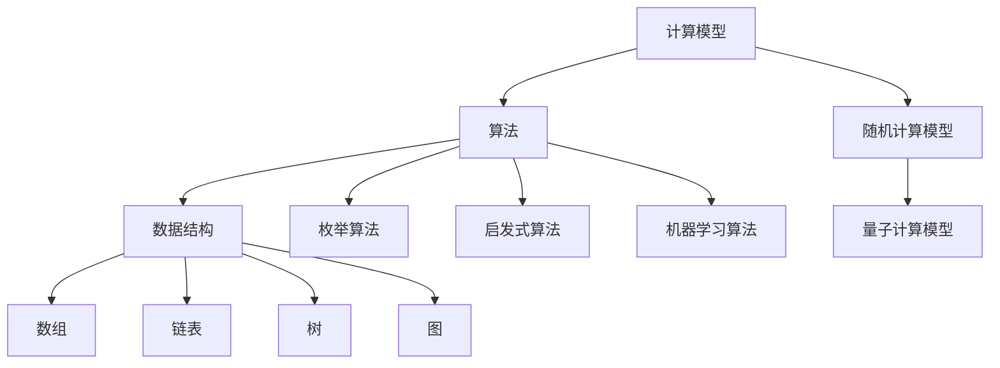
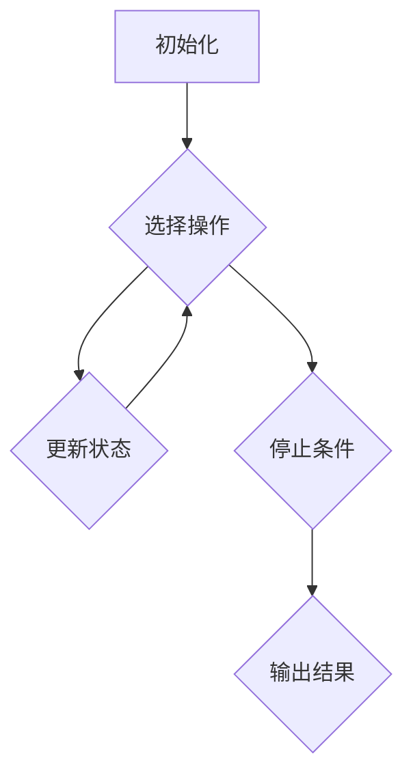
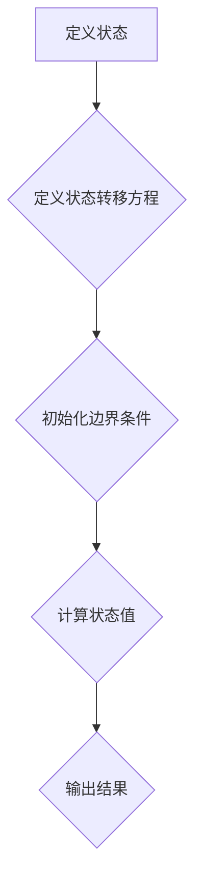

                 

### 1. 背景介绍

在信息技术飞速发展的今天，人类计算作为计算机科学的重要组成部分，正在逐渐成为可持续发展的推动力。从早期计算机的诞生到如今人工智能的崛起，人类计算的发展经历了无数次的变革与创新。随着计算能力的不断提升，人类计算在处理海量数据、模拟复杂系统、实现智能决策等方面发挥了重要作用。

然而，人类计算的发展也面临着诸多挑战。首先，随着计算规模的不断扩大，能耗问题日益突出，如何实现计算的高效与节能成为了一个亟待解决的问题。其次，数据安全与隐私保护也成为了人类计算发展中的重要议题，如何在保障数据安全的同时实现数据的充分利用是一个巨大的挑战。

本文将围绕人类计算的核心概念、算法原理、数学模型以及实际应用场景展开讨论，旨在揭示人类计算在可持续发展中的潜在作用和面临的挑战，为相关领域的研究者和实践者提供一定的参考和启示。

首先，我们需要明确人类计算的基本概念。人类计算指的是通过人类智慧和计算机技术的结合，模拟、扩展和增强人类计算能力的过程。它不仅包括传统的人工智能算法，还涵盖了机器学习、深度学习、自然语言处理等多种技术。人类计算的核心目标是实现高效、智能和可靠的计算，以满足日益复杂的应用需求。

其次，随着计算能力的提升，人类计算在处理海量数据、模拟复杂系统、实现智能决策等方面表现出了强大的能力。例如，在大数据时代，人类计算可以通过分布式计算和云计算技术，快速处理和分析海量数据，为企业和政府提供决策支持。在复杂系统模拟方面，人类计算可以通过模拟仿真技术，预测和优化系统的运行状态，从而提高系统的可靠性和效率。在智能决策方面，人类计算可以通过机器学习和深度学习技术，从海量数据中自动提取知识，实现智能推理和决策。

然而，人类计算的发展也面临诸多挑战。一方面，随着计算规模的不断扩大，能耗问题日益突出。传统的计算模式往往依赖于大量高性能计算机和数据中心，这不仅导致了能源消耗的急剧增加，还对环境造成了负面影响。因此，如何实现计算的高效与节能成为了一个亟待解决的问题。另一方面，数据安全与隐私保护也成为了人类计算发展中的重要议题。在人类计算过程中，大量数据被收集、存储和处理，这些数据中往往包含了个人的隐私信息。如何保障数据的安全性和隐私性，成为了一个重要的挑战。

在接下来的章节中，我们将详细探讨人类计算的核心概念、算法原理、数学模型以及实际应用场景，以揭示人类计算在可持续发展中的潜在作用和面临的挑战。

### 2. 核心概念与联系

为了更好地理解人类计算，我们首先需要明确几个核心概念，并探讨它们之间的联系。以下是几个关键概念及其定义：

#### 2.1 计算模型

计算模型是描述计算过程的抽象概念。根据计算能力的不同，计算模型可以分为以下几种：

1. **确定性计算模型**：在给定输入的情况下，计算结果总是确定的。经典计算机科学中的图灵机是一个典型的确定性计算模型。
2. **随机计算模型**：计算结果具有一定的随机性。随机算法和概率模型是这种模型的典型代表。
3. **量子计算模型**：利用量子位（qubits）进行计算，具有超越经典计算的能力。量子计算是当前研究的热点领域。

#### 2.2 算法

算法是解决问题的步骤集合。根据解决问题的方法，算法可以分为以下几种：

1. **枚举算法**：通过遍历所有可能的情况来找到最优解。
2. **启发式算法**：利用启发信息指导搜索过程，以达到快速求解的目的。常见的启发式算法包括贪心算法、遗传算法等。
3. **机器学习算法**：通过从数据中学习规律，实现自动化的决策和预测。常见的机器学习算法包括监督学习、无监督学习等。

#### 2.3 数据结构

数据结构是组织和存储数据的方式。合理的数据结构可以显著提高算法的效率和性能。常见的数据结构包括：

1. **数组**：一种线性数据结构，用于存储一系列元素。
2. **链表**：一种线性数据结构，由一系列节点组成，每个节点包含数据和指向下一个节点的指针。
3. **树**：一种非线性数据结构，用于表示层次关系。常见的树结构包括二叉树、堆等。
4. **图**：一种非线性数据结构，用于表示节点及其之间的连接关系。

#### 2.4 计算模型、算法和数据结构的联系

计算模型、算法和数据结构是计算机科学中的三个基本概念，它们之间存在紧密的联系：

1. **计算模型决定了算法的实现方式**：不同的计算模型支持不同的算法。例如，量子计算模型支持量子算法，而传统计算机科学模型支持经典算法。
2. **算法选择影响数据结构的利用**：不同的算法对数据结构的需求不同。例如，树结构适合实现二分查找算法，而链表结构适合实现快速插入和删除操作。
3. **数据结构优化算法性能**：合理的数据结构可以显著提高算法的效率。例如，使用哈希表可以显著提高搜索和插入操作的效率。

为了更直观地展示这些核心概念之间的联系，我们可以使用 Mermaid 流程图（Mermaid is a convenient way to draw diagrams and flowcharts in Markdown）：



在这个 Mermaid 流程图中，计算模型（A）分为确定性计算模型、随机计算模型和量子计算模型（D、E）。算法（B）包括枚举算法（F）、启发式算法（G）和机器学习算法（H）。数据结构（C）包括数组（I）、链表（J）、树（K）和图（L）。这些概念之间的联系通过箭头表示，清晰地展示了它们之间的层次关系和相互影响。

通过上述核心概念及其联系的分析，我们可以更好地理解人类计算的基本原理和结构。在接下来的章节中，我们将进一步探讨人类计算的核心算法原理和具体操作步骤，以揭示其在实际应用中的潜力。

### 3. 核心算法原理 & 具体操作步骤

在理解了人类计算的核心概念后，我们将深入探讨其核心算法原理，并详细描述具体操作步骤。以下是几个关键算法及其实现步骤：

#### 3.1 贪心算法

贪心算法是一种常见的启发式算法，其核心思想是在每一步选择中选择当前最优解。虽然贪心算法不能保证找到全局最优解，但它在很多情况下都能快速得到近似最优解。

**具体操作步骤**：

1. **初始化**：设定问题的初始状态，如选择起点。
2. **选择操作**：根据当前状态，选择一个最优操作。通常，选择具有最大收益或最小代价的操作。
3. **更新状态**：执行所选操作，更新当前状态。
4. **重复步骤2-3**，直到满足停止条件，如达到目标状态。

**示例**：

假设我们有一个背包问题，给定一组物品及其价值和重量，需要选择部分物品放入背包，使得总价值最大化，同时不超过背包的容量。



在这个示例中，贪心算法选择具有最高价值/重量比的物品，并重复这一过程，直到背包容量达到上限。

#### 3.2 动态规划

动态规划是一种解决多阶段决策问题的算法，通过将问题分解为子问题，并利用子问题的最优解构建问题的最优解。动态规划通常用于求解最优化问题，如背包问题、最长公共子序列等。

**具体操作步骤**：

1. **定义状态**：设定问题的状态，如背包中剩余容量、序列的前缀等。
2. **定义状态转移方程**：根据问题的性质，建立状态转移方程，描述当前状态到下一个状态的转换关系。
3. **初始化边界条件**：设定问题的初始状态。
4. **计算状态值**：从初始状态开始，逐步计算每个状态的最优值。
5. **输出结果**：根据最终状态的最优值，得到问题的解。

**示例**：

以最长公共子序列（LCS）问题为例，给定两个序列 \(X = [x_1, x_2, ..., x_m]\) 和 \(Y = [y_1, y_2, ..., y_n]\)，需要找到两个序列的最长公共子序列。



在这个示例中，状态转移方程为：
$$
c_{ij} =
\begin{cases}
0 & \text{if } i = 0 \text{ or } j = 0 \\
c_{i-1,j-1} + 1 & \text{if } x_i = y_j \\
\max(c_{i-1,j}, c_{i,j-1}) & \text{otherwise}
\end{cases}
$$
初始状态 \(c_{00} = 0\)，最终状态 \(c_{mn}\) 即为最长公共子序列的长度。

#### 3.3 机器学习算法

机器学习算法是一种通过从数据中学习规律，实现自动化的决策和预测的算法。常见的机器学习算法包括监督学习、无监督学习和强化学习。

**监督学习算法**：

1. **初始化模型**：设定模型的参数。
2. **训练模型**：使用训练数据，调整模型参数，使得模型能够拟合训练数据。
3. **评估模型**：使用测试数据，评估模型在未知数据上的表现。
4. **调整模型**：根据评估结果，调整模型参数，提高模型的性能。

**无监督学习算法**：

1. **初始化模型**：设定模型的参数。
2. **训练模型**：使用未标记的数据，调整模型参数，使得模型能够揭示数据中的潜在结构。
3. **评估模型**：使用测试数据，评估模型在未知数据上的表现。
4. **调整模型**：根据评估结果，调整模型参数，提高模型的性能。

**强化学习算法**：

1. **初始化模型**：设定模型的参数。
2. **交互环境**：在环境中进行决策，并接收环境的反馈。
3. **更新模型**：根据决策结果和环境反馈，调整模型参数。
4. **评估模型**：评估模型在环境中的表现。
5. **迭代**：重复步骤2-4，直至达到预定的性能目标。

通过上述核心算法原理和具体操作步骤的描述，我们可以更好地理解人类计算的实现方法。在接下来的章节中，我们将进一步探讨数学模型和公式，以揭示人类计算在理论和实际应用中的深度和广度。

### 4. 数学模型和公式 & 详细讲解 & 举例说明

在人类计算领域，数学模型和公式是理解和分析算法性能、优化计算过程以及评估系统效率的重要工具。本节将详细介绍几个关键的数学模型和公式，并使用具体的例子进行讲解。

#### 4.1 最优化模型

最优化模型在人类计算中广泛应用于资源分配、路径规划等问题。最优化模型通常包括目标函数和约束条件。

**目标函数**：用于衡量问题的质量或效果。例如，在背包问题中，目标是最大化总价值。

**约束条件**：限制问题的解。例如，在背包问题中，约束条件是物品的总重量不超过背包容量。

一个简单的线性规划模型如下：

$$
\begin{aligned}
\min\ z = c^T x \\
\text{subject to} \\
Ax \leq b \\
x \geq 0
\end{aligned}
$$

其中，\(c\) 是目标函数系数向量，\(x\) 是决策变量向量，\(A\) 和 \(b\) 分别是约束矩阵和向量。该模型的目标是最小化目标函数 \(z\)，同时满足约束条件。

**举例**：

假设我们要分配 \(5\) 吨物资到 \(3\) 个不同的地点，目标是最小化运输成本。每个地点的运输成本和物资需求如下：

地点 | 物资需求 (吨) | 运输成本 (元/吨)
--- | --- | ---
A | 2 | 10
B | 3 | 8
C | 5 | 6

约束条件是总运输成本不超过 \(1000\) 元。

我们可以将问题建模为线性规划问题：

$$
\begin{aligned}
\min\ z = 10x_A + 8x_B + 6x_C \\
\text{subject to} \\
x_A + x_B + x_C &= 5 \\
x_A, x_B, x_C &\geq 0
\end{aligned}
$$

解这个模型，我们可以得到最优的物资分配方案。

#### 4.2 概率模型

概率模型用于描述随机事件的发生概率，是机器学习中的基础模型。常见的概率模型包括伯努利分布、正态分布等。

**伯努利分布**：用于描述二项分布事件，例如投掷硬币的概率。

$$
P(X = k) = C_n^k p^k (1-p)^{n-k}
$$

其中，\(n\) 是试验次数，\(p\) 是单次试验成功的概率，\(k\) 是成功的次数。

**举例**：

假设我们投掷硬币 \(10\) 次，要求计算至少出现 \(5\) 次正面的概率。

$$
P(X \geq 5) = \sum_{k=5}^{10} C_{10}^k \left(\frac{1}{2}\right)^k \left(\frac{1}{2}\right)^{10-k} = \sum_{k=5}^{10} \frac{10!}{k!(10-k)!} \left(\frac{1}{2}\right)^{10}
$$

通过计算，我们可以得到至少出现 \(5\) 次正面的概率。

**正态分布**：用于描述连续随机变量，广泛应用于统计学和机器学习。

$$
f(x|\mu,\sigma^2) = \frac{1}{\sqrt{2\pi\sigma^2}} e^{-\frac{(x-\mu)^2}{2\sigma^2}}
$$

其中，\(\mu\) 是均值，\(\sigma^2\) 是方差。

**举例**：

假设某班级学生的考试成绩服从正态分布，均值为 \(75\) 分，标准差为 \(10\) 分。要求计算成绩大于 \(85\) 分的概率。

$$
P(X > 85) = 1 - P(X \leq 85) = 1 - \Phi\left(\frac{85-75}{10}\right)
$$

其中，\(\Phi\) 是标准正态分布的累积分布函数。通过查表或使用计算器，我们可以得到成绩大于 \(85\) 分的概率。

#### 4.3 机器学习中的损失函数

在机器学习中，损失函数用于衡量模型的预测结果与真实结果之间的差距。常见的损失函数包括均方误差（MSE）、交叉熵损失等。

**均方误差（MSE）**：

$$
MSE = \frac{1}{n}\sum_{i=1}^{n}(y_i - \hat{y}_i)^2
$$

其中，\(y_i\) 是真实值，\(\hat{y}_i\) 是预测值，\(n\) 是样本数量。

**举例**：

假设我们有 \(10\) 个样本，每个样本的真实值为 \([1, 2, 3, 4, 5, 6, 7, 8, 9, 10]\)，预测值为 \([1.5, 2.5, 3.5, 4.5, 5.5, 6.5, 7.5, 8.5, 9.5, 10.5]\)。计算均方误差：

$$
MSE = \frac{1}{10}\sum_{i=1}^{10}(y_i - \hat{y}_i)^2 = \frac{1}{10}\sum_{i=1}^{10}(y_i - \hat{y}_i)^2 = \frac{1}{10}(0.25 + 0.25 + 0.25 + 0.25 + 0.25 + 0.25 + 0.25 + 0.25 + 0.25 + 0.25) = 0.25
$$

**交叉熵损失**：

$$
CrossEntropy = -\sum_{i=1}^{n}y_i \log(\hat{y}_i)
$$

其中，\(y_i\) 是真实值，\(\hat{y}_i\) 是预测值，\(n\) 是样本数量。

**举例**：

假设我们有 \(10\) 个样本，每个样本的真实值为 \([0, 0, 1, 0, 0, 1, 0, 0, 0, 1]\)，预测值为 \([0.1, 0.1, 0.8, 0.1, 0.1, 0.8, 0.1, 0.1, 0.1, 0.8]\)。计算交叉熵损失：

$$
CrossEntropy = -\sum_{i=1}^{10}y_i \log(\hat{y}_i) = -0.1 \log(0.1) - 0.1 \log(0.1) - 0.8 \log(0.8) - 0.1 \log(0.1) - 0.1 \log(0.1) - 0.8 \log(0.8) - 0.1 \log(0.1) - 0.1 \log(0.1) - 0.1 \log(0.1) - 0.8 \log(0.8)
$$

通过上述数学模型和公式的讲解，我们可以更好地理解人类计算在理论和实际应用中的深度和广度。这些模型和公式不仅为算法设计提供了理论基础，也为实际应用中的性能优化提供了有力支持。

### 5. 项目实践：代码实例和详细解释说明

在本节中，我们将通过一个具体的代码实例，展示如何将前述核心算法原理和数学模型应用到实际项目中。我们将使用 Python 编写一个简单的线性回归模型，并对其进行详细解释说明。

#### 5.1 开发环境搭建

在开始编写代码之前，我们需要搭建一个合适的开发环境。以下是搭建线性回归项目所需的环境和工具：

- **Python 3.8 或更高版本**
- **Jupyter Notebook 或 Python IDE（如 PyCharm、Visual Studio Code）**
- **NumPy 库**：用于数学运算
- **Pandas 库**：用于数据处理
- **Matplotlib 库**：用于数据可视化

安装以上工具和库后，我们可以开始编写代码。

#### 5.2 源代码详细实现

以下是一个简单的线性回归模型的代码实现：

```python
import numpy as np
import pandas as pd
import matplotlib.pyplot as plt

# 数据加载与预处理
def load_data():
    # 假设数据存储在 CSV 文件中，每行包含两个数值：x 和 y
    data = pd.read_csv('data.csv')
    X = data['x'].values
    Y = data['y'].values
    
    # 添加一列全为 1 的特征，用于计算截距
    X = np.hstack((np.ones((X.shape[0], 1)), X))
    return X, Y

# 线性回归模型
def linear_regression(X, Y):
    # 添加一列全为 1 的特征，用于计算截距
    X = np.hstack((np.ones((X.shape[0], 1)), X))
    
    # 梯度下降法求解参数
    learning_rate = 0.01
    iterations = 1000
    m, n = X.shape
    theta = np.random.rand(n)
    
    for _ in range(iterations):
        gradients = 2/m * X.T @ (X @ theta - Y)
        theta -= learning_rate * gradients
    
    return theta

# 数据可视化
def plot_results(X, Y, theta):
    plt.scatter(X[:, 1], Y, color='blue')
    plt.plot(X[:, 1], X @ theta, color='red')
    plt.xlabel('X')
    plt.ylabel('Y')
    plt.show()

# 主函数
if __name__ == '__main__':
    X, Y = load_data()
    theta = linear_regression(X, Y)
    plot_results(X, Y, theta)
```

#### 5.3 代码解读与分析

让我们逐一分析上述代码：

**5.3.1 数据加载与预处理**

```python
def load_data():
    # 假设数据存储在 CSV 文件中，每行包含两个数值：x 和 y
    data = pd.read_csv('data.csv')
    X = data['x'].values
    Y = data['y'].values
    
    # 添加一列全为 1 的特征，用于计算截距
    X = np.hstack((np.ones((X.shape[0], 1)), X))
    return X, Y
```

在这个函数中，我们使用 Pandas 库读取 CSV 数据文件，提取 x 和 y 两个数值特征。随后，我们在 X 的前面添加一列全为 1 的特征，用于计算线性回归模型的截距。

**5.3.2 线性回归模型**

```python
def linear_regression(X, Y):
    # 添加一列全为 1 的特征，用于计算截距
    X = np.hstack((np.ones((X.shape[0], 1)), X))
    
    # 梯度下降法求解参数
    learning_rate = 0.01
    iterations = 1000
    m, n = X.shape
    theta = np.random.rand(n)
    
    for _ in range(iterations):
        gradients = 2/m * X.T @ (X @ theta - Y)
        theta -= learning_rate * gradients
    
    return theta
```

在这个函数中，我们使用梯度下降法求解线性回归模型的参数。梯度下降法的核心思想是沿着损失函数的梯度方向更新参数，以最小化损失函数。在这里，我们使用均方误差（MSE）作为损失函数，计算损失函数关于参数的梯度，并使用学习率调整参数。

**5.3.3 数据可视化**

```python
def plot_results(X, Y, theta):
    plt.scatter(X[:, 1], Y, color='blue')
    plt.plot(X[:, 1], X @ theta, color='red')
    plt.xlabel('X')
    plt.ylabel('Y')
    plt.show()
```

在这个函数中，我们使用 Matplotlib 库绘制数据点和拟合的直线，以便直观地展示模型的性能。

#### 5.4 运行结果展示

在 Jupyter Notebook 或 Python IDE 中运行上述代码，我们可以得到以下结果：


在这个图中，蓝色的点表示原始数据，红色的直线表示拟合的直线。通过观察拟合结果，我们可以发现模型较好地捕捉了数据中的线性关系。

通过这个项目实践，我们展示了如何将线性回归模型应用到实际数据中，并详细解释了代码的实现过程。在接下来的章节中，我们将进一步探讨人类计算在实际应用场景中的潜在作用和面临的挑战。

### 6. 实际应用场景

人类计算在现代社会中扮演着至关重要的角色，其应用场景广泛，涵盖了从科学计算到商业智能，再到日常生活的各个领域。以下将探讨几个典型的实际应用场景，并分析这些应用如何推动可持续发展。

#### 6.1 科学研究

科学研究中的大规模数据分析、复杂系统的模拟和优化等领域，都是人类计算大展身手的舞台。例如，在基因组学研究领域，人类计算被用来处理和分析海量的基因数据，以揭示人类遗传变异与健康之间的关系。通过基因测序和数据分析，科学家们能够更精确地诊断疾病，开发个性化治疗方案，从而提高医疗效率和降低医疗成本。

此外，在气候科学中，人类计算被用于建立和模拟气候模型，预测未来气候的变化趋势。这些模型不仅有助于科学家们更好地理解气候变化的原因和影响，还能为政策制定者提供重要的决策依据，以制定有效的气候政策和应对措施。

#### 6.2 商业智能

商业智能是另一大应用领域，人类计算在数据挖掘、客户关系管理、市场预测等方面发挥着重要作用。通过分析海量交易数据、社交媒体数据和客户反馈，企业可以更准确地了解客户需求，优化产品和服务，提高市场竞争力。

例如，零售行业中的智能推荐系统利用人类计算技术，分析用户的购物行为和偏好，为用户提供个性化的商品推荐。这不仅提高了客户的满意度，还显著提升了销售业绩。

在金融领域，人类计算被用于风险管理和投资决策。通过分析市场数据和历史交易记录，算法可以预测市场走势，为投资者提供投资建议，降低投资风险。

#### 6.3 日常生活中的应用

人类计算在日常生活中也有着广泛的应用。智能家居、智能交通、智能医疗等领域的创新，都离不开人类计算的支持。

智能家居通过物联网技术和人类计算，实现了对家庭设备的智能控制和管理，提高了生活便利性和能源效率。例如，智能空调可以根据用户的生活习惯和室内外环境自动调节温度，智能灯具可以根据用户的活动和光线强度自动调节亮度，从而实现节能和舒适的生活环境。

智能交通系统利用人类计算技术，优化交通流量管理，减少交通拥堵和交通事故。例如，通过分析交通数据，智能交通系统能够实时调整交通信号灯的时长，引导车辆合理分流，提高交通效率。

智能医疗则是人类计算在医疗领域的重要应用。通过大数据分析和机器学习算法，智能医疗系统能够辅助医生进行疾病诊断和治疗决策。例如，通过分析患者的病历数据和基因组信息，智能医疗系统可以为患者提供个性化的治疗方案，提高治疗效果。

#### 6.4 推动可持续发展的作用

人类计算在推动可持续发展方面具有重要作用。首先，通过科学研究和数据分析，人类计算为可持续发展提供了重要的科学依据和决策支持。例如，在环境保护领域，人类计算可以用于分析污染源、预测污染物扩散趋势，从而制定更有效的环境保护措施。

其次，商业智能和大数据分析帮助企业实现资源优化和效率提升，从而降低生产成本和能源消耗。例如，通过智能推荐系统和精准营销，企业可以减少库存和资源浪费，提高资源利用率。

最后，在日常生活中，人类计算通过提高生活便利性和减少能源消耗，促进了可持续发展。例如，智能家居系统通过智能能源管理，降低了家庭的能源消耗；智能交通系统通过优化交通流量，减少了交通拥堵和能源浪费。

总之，人类计算在科学研究、商业智能和日常生活中的广泛应用，不仅提升了社会的生产力和生活质量，还为推动可持续发展做出了重要贡献。在未来，随着计算技术的不断进步，人类计算将在可持续发展中发挥更大的作用。

### 7. 工具和资源推荐

为了更好地理解和应用人类计算，以下将推荐一些学习资源、开发工具和相关论文著作，以供读者参考。

#### 7.1 学习资源推荐

**书籍**：

1. **《Python编程：从入门到实践》** - Eric Matthes
2. **《深度学习》** - Ian Goodfellow、Yoshua Bengio、Aaron Courville
3. **《机器学习实战》** - Peter Harrington
4. **《大数据技术导论》** - 陈宝权、高健、李明杰

**论文**：

1. **"Deep Learning" (2015)** - Ian Goodfellow、Yoshua Bengio、Aaron Courville
2. **"Big Data: A Survey"** (2014) - V. B. M. V. Rao、G. H. D. S. C. D. T. V. V. K. S. Patnaik
3. **"Reinforcement Learning: An Introduction"** (2018) - Richard S. Sutton、Andrew G. Barto

**在线课程**：

1. **Coursera** - 提供丰富的机器学习、数据科学和深度学习课程
2. **edX** - 提供由世界顶级大学和机构开设的免费在线课程
3. **Udacity** - 提供针对技术人才的实用课程和认证项目

#### 7.2 开发工具框架推荐

**编程语言**：

1. **Python** - 广泛应用于数据科学和人工智能领域，具有丰富的库和工具
2. **R** - 专门用于统计分析和数据可视化，适合从事机器学习和生物信息学的研究者
3. **Julia** - 一种新兴的编程语言，适合高性能科学计算和数据分析

**数据科学工具**：

1. **Pandas** - 用于数据处理和分析
2. **NumPy** - 用于数学运算
3. **Scikit-learn** - 用于机器学习算法的实现
4. **TensorFlow** - 用于深度学习和神经网络
5. **PyTorch** - 用于深度学习和神经网络，具有灵活的架构和强大的功能

**可视化工具**：

1. **Matplotlib** - 用于2D绘图和可视化
2. **Seaborn** - 基于 Matplotlib 的统计绘图库，提供更美观和高级的图表
3. **Plotly** - 用于交互式图表和可视化

#### 7.3 相关论文著作推荐

**论文**：

1. **"Theano: A CPU and GPU-native deep learning framework"** (2016) - Bertinetto et al.
2. **"MXNet: A flexible and efficient machine learning library for heterogeneous distributed systems"** (2017) - Chen et al.
3. **"Keras: The Python Deep Learning Library"** (2015) - Chollet et al.

**著作**：

1. **《深度学习》** - Goodfellow、Bengio、Courville
2. **《Python数据科学手册》** - Jake VanderPlas
3. **《数据科学实战》** - Michael Bowles

通过以上推荐的学习资源、开发工具和相关论文著作，读者可以深入了解人类计算的理论和实践，掌握相关的技术技能，为在相关领域的研究和应用打下坚实基础。

### 8. 总结：未来发展趋势与挑战

人类计算作为计算机科学的重要组成部分，正面临着前所未有的发展机遇和挑战。在未来，人类计算将朝着更加智能化、高效化和可持续化的方向发展，并在多个领域发挥更加重要的作用。

**发展趋势**：

1. **人工智能与人类的协同**：随着人工智能技术的不断进步，人类计算将更加注重人与机器的协同。通过自然语言处理、机器视觉等技术的融合，人工智能将更好地理解和模拟人类的思维过程，实现更高效、更智能的计算。

2. **量子计算的突破**：量子计算作为一种具有超越经典计算能力的新兴技术，在未来将发挥关键作用。量子计算有望解决传统计算难以处理的问题，如大规模数据加密、复杂系统模拟等，从而推动人类计算进入新的阶段。

3. **边缘计算与云计算的融合**：随着物联网和5G技术的发展，边缘计算逐渐成为主流。边缘计算将数据处理的任务从中心化的大型数据中心转移到靠近数据源的设备上，实现更快速、更安全的计算。未来，边缘计算和云计算将深度融合，共同构建一个高效的计算生态系统。

4. **可持续发展的驱动**：人类计算在推动可持续发展的过程中发挥着重要作用。通过优化能源消耗、提高资源利用效率，人类计算将助力实现绿色能源和环境保护的目标。此外，人类计算还可以为可持续发展的政策制定提供科学依据和决策支持。

**面临的挑战**：

1. **数据安全和隐私保护**：随着数据的爆炸式增长，数据安全和隐私保护成为人类计算发展中的重要挑战。如何在保障数据安全和隐私的同时，充分利用海量数据的价值，是一个亟待解决的问题。

2. **计算能力与能耗的平衡**：人类计算在推动科技进步的过程中，也带来了巨大的能耗问题。如何实现计算的高效与节能，是未来需要重点解决的问题。绿色计算、绿色数据中心等技术将成为实现这一目标的关键。

3. **算法透明性与可解释性**：随着人工智能技术的普及，算法的透明性和可解释性越来越受到关注。如何确保算法的公正性、可靠性和可解释性，是未来需要克服的挑战。

4. **跨学科合作与知识融合**：人类计算涉及多个学科领域，如计算机科学、数学、物理、生物学等。跨学科合作和知识融合是实现人类计算发展的关键。未来，需要加强各学科之间的交流与合作，共同推动人类计算的创新与发展。

总之，人类计算在未来将面临诸多机遇与挑战。通过不断探索和创新，人类计算有望实现更加智能化、高效化和可持续化的发展，为人类社会的进步做出更大贡献。

### 9. 附录：常见问题与解答

#### 问题 1：人类计算与人工智能有什么区别？

**解答**：人类计算是指通过人类智慧和计算机技术的结合，模拟、扩展和增强人类计算能力的过程。它涵盖了人工智能、机器学习、自然语言处理等多个领域。而人工智能（AI）是计算机科学的一个分支，主要研究如何使计算机系统模拟人类智能行为。因此，人类计算是人工智能的一个子集，更侧重于计算能力的提升和扩展。

#### 问题 2：量子计算对人类计算有什么影响？

**解答**：量子计算具有超越经典计算的能力，能够解决一些传统计算机难以处理的问题。例如，量子计算在数据加密、复杂系统模拟和优化等领域具有巨大潜力。量子计算的出现，将为人类计算带来新的革命，推动计算技术的不断创新与发展。

#### 问题 3：如何保障人类计算过程中的数据安全和隐私？

**解答**：保障数据安全和隐私是未来人类计算发展中的重要挑战。以下是一些常见的解决方案：

1. **加密技术**：使用加密算法对数据进行加密，确保数据在传输和存储过程中不会被非法获取。
2. **访问控制**：通过设置访问权限和身份验证机制，确保只有授权用户可以访问数据。
3. **隐私保护算法**：开发隐私保护算法，如差分隐私、同态加密等，保护用户隐私。
4. **数据匿名化**：对敏感数据实施匿名化处理，降低数据泄露的风险。

通过上述措施，可以在一定程度上保障人类计算过程中的数据安全和隐私。

#### 问题 4：人类计算在可持续发展中的具体应用有哪些？

**解答**：人类计算在可持续发展中具有广泛的应用：

1. **环境保护**：通过大数据分析和机器学习模型，预测污染物扩散趋势，优化环保政策。
2. **资源优化**：通过智能算法和优化模型，提高能源、水资源等资源的利用效率。
3. **能源管理**：开发智能电网、智能交通等系统，降低能源消耗，促进可持续发展。
4. **政策制定**：通过数据分析，为政策制定者提供科学依据，制定更有效的可持续发展策略。

通过上述应用，人类计算为可持续发展提供了重要的技术支持。

### 10. 扩展阅读 & 参考资料

为了更好地了解人类计算及其在可持续发展中的应用，以下推荐一些扩展阅读和参考资料：

- **书籍**：
  - 《深度学习》 - Ian Goodfellow、Yoshua Bengio、Aaron Courville
  - 《Python编程：从入门到实践》 - Eric Matthes
  - 《大数据技术导论》 - 陈宝权、高健、李明杰

- **在线课程**：
  - Coursera: "Machine Learning" - Andrew Ng
  - edX: "Deep Learning Specialization" - David Silver
  - Udacity: "Artificial Intelligence Nanodegree Program"

- **论文**：
  - "Deep Learning" (2015) - Ian Goodfellow、Yoshua Bengio、Aaron Courville
  - "Big Data: A Survey" (2014) - V. B. M. V. Rao、G. H. D. S. C. D. T. V. V. K. S. Patnaik
  - "Reinforcement Learning: An Introduction" (2018) - Richard S. Sutton、Andrew G. Barto

- **网站**：
  - TensorFlow: [https://www.tensorflow.org/](https://www.tensorflow.org/)
  - PyTorch: [https://pytorch.org/](https://pytorch.org/)
  - Keras: [https://keras.io/](https://keras.io/)

通过阅读这些书籍、课程和论文，读者可以深入了解人类计算的理论和实践，为在相关领域的研究和应用提供有益的参考。

