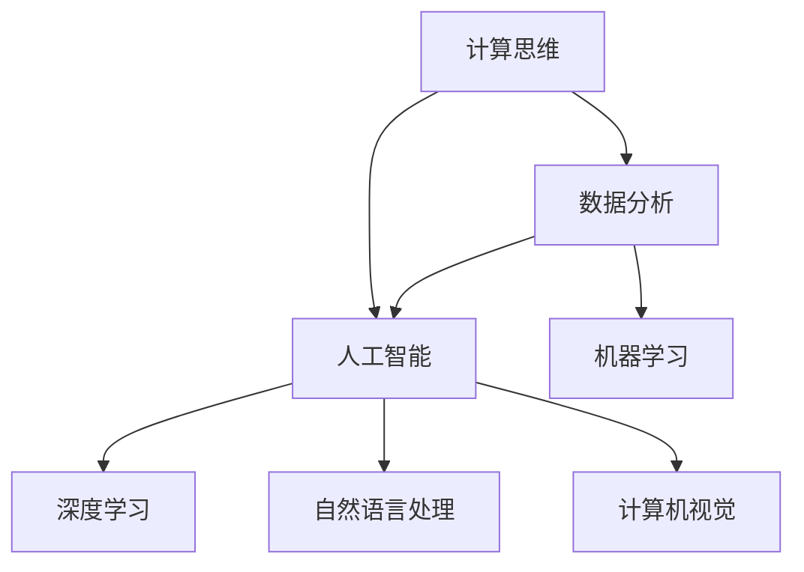

                 

### 1. 背景介绍

《人类计算：可持续发展的推动力》这篇文章旨在探讨人类计算在现代社会中的重要性，以及它如何成为可持续发展的关键推动力。人类计算是指人类使用各种计算工具和技术进行数据处理、分析和决策的过程。这一概念与计算机科学和技术紧密相连，但区别在于，它强调的是人类与技术的交互，以及人类在计算过程中的主动性和创造力。

首先，我们需要了解人类计算的起源和发展。人类计算的历史可以追溯到古代，那时人们通过简单的计算工具，如算盘，来进行数学运算。随着时间的发展，计算工具变得更加复杂，从机械计算器到电子计算机，技术的进步极大地提高了计算速度和精度。然而，直到最近，人类计算的重要性并没有得到充分的认可。

现代社会中，人类计算的重要性日益凸显。随着大数据、人工智能和云计算等技术的发展，人类计算已经成为各个领域的关键组成部分。无论是科学发现、商业决策还是社会管理，人类计算都发挥着不可替代的作用。例如，在医疗领域，人类计算可以帮助医生分析患者数据，提供更准确的诊断和治疗建议；在金融领域，人类计算可以用于风险评估和投资决策，帮助投资者更好地管理风险。

本文将分几个部分来探讨人类计算的核心概念、算法原理、实际应用场景、工具和资源推荐，以及未来发展趋势与挑战。首先，我们将详细解释人类计算的核心概念，包括计算思维、数据分析和人工智能等，并通过Mermaid流程图展示其相互关系。接着，我们将介绍一些核心算法原理和具体操作步骤，结合实际案例进行讲解。然后，我们将深入探讨数学模型和公式，并通过示例进行详细说明。接下来，我们将通过一个项目实践案例，展示如何在实际环境中应用这些技术和算法。最后，我们将探讨人类计算在实际应用场景中的具体应用，并提供一些实用的工具和资源推荐，以便读者深入了解和掌握这一领域。

总之，本文将全面系统地介绍人类计算的概念、原理、应用和发展趋势，旨在帮助读者理解人类计算的重要性，掌握相关技术和方法，以及为未来的可持续发展贡献力量。

### 2. 核心概念与联系

在深入探讨人类计算之前，我们首先需要明确几个核心概念，这些概念不仅构成了人类计算的基础，还相互交织，共同推动着计算技术的发展。以下是几个关键概念的定义及其相互关系：

#### 计算思维（Computational Thinking）

计算思维是指一种解决问题的思维方式，它包括分解问题、抽象、算法设计、数据表示和逻辑推理等。计算思维是一种跨学科的能力，不仅适用于计算机科学，还可以广泛应用于各个领域。例如，科学家通过计算思维来构建模型和模拟实验结果，工程师通过计算思维来设计复杂的系统，而设计师则通过计算思维来创建交互式的用户体验。

#### 数据分析（Data Analysis）

数据分析是指使用统计学、机器学习和数据可视化等方法来理解和解释数据的过程。数据分析可以帮助我们从大量数据中提取有价值的信息，从而做出更明智的决策。随着数据量的爆炸性增长，数据分析已经成为各个行业的关键技能，从市场营销到医疗保健，无一例外。

#### 人工智能（Artificial Intelligence）

人工智能是指通过计算机程序模拟人类智能行为的技术。它包括机器学习、深度学习、自然语言处理和计算机视觉等领域。人工智能的目的是让计算机能够执行复杂的任务，如语音识别、图像识别、决策支持和自动化控制。人工智能与人类计算密切相关，因为它依赖于人类设计的算法和数据进行训练和优化。

下面是一个使用Mermaid绘制的流程图，展示了这些核心概念之间的相互关系：



#### 计算思维与数据分析

计算思维是数据分析的基础。在处理复杂数据时，我们需要将问题分解成更小的部分，使用抽象概念来简化问题，并设计算法来解决这些子问题。例如，在金融分析中，投资者可能需要使用计算思维来将市场数据分解为不同的时间序列和指标，然后应用数据分析技术来识别趋势和模式。

#### 数据分析与人工智能

数据分析为人工智能提供了训练数据和算法改进的依据。通过分析大量数据，我们可以发现隐藏在数据中的规律和模式，这些发现可以用于训练机器学习模型。例如，在医疗诊断中，通过分析患者的电子健康记录，人工智能模型可以预测疾病的发展趋势，从而帮助医生做出更准确的诊断。

#### 人工智能与计算思维

人工智能依赖于计算思维来设计算法和优化模型。人类通过计算思维来理解问题，构建模型，并设计算法来解决这些问题。例如，在自动驾驶领域，工程师需要使用计算思维来设计车辆感知系统和决策算法，以便车辆能够在复杂的交通环境中安全行驶。

通过上述核心概念及其相互关系的介绍，我们可以更好地理解人类计算的整体框架。接下来，我们将深入探讨这些概念的具体算法原理和操作步骤，以便读者能够更好地掌握和应用这些技术。

### 3. 核心算法原理 & 具体操作步骤

在了解了人类计算的核心概念之后，我们接下来将详细探讨其背后的核心算法原理，并分步骤讲解如何在实际操作中应用这些算法。以下是几个关键算法及其具体操作步骤：

#### 1. 决策树算法

决策树算法是一种常用的机器学习算法，它通过一系列规则来对数据进行分类或回归。以下是决策树算法的基本步骤：

**步骤 1：特征选择**
- 从所有特征中选择一个最佳特征作为根节点。
- 通常使用信息增益（Information Gain）或基尼不纯度（Gini Impurity）来选择特征。

**步骤 2：数据划分**
- 根据选定的特征，将数据划分为多个子集。
- 对于每个子集，计算其信息增益或基尼不纯度。

**步骤 3：重复步骤 1 和步骤 2**
- 对于每个子集，重复步骤 1 和步骤 2，直到满足终止条件（如最大深度、最小样本数等）。

**步骤 4：构建决策树**
- 将所有特征和对应的划分结果构建成树形结构。

**示例：分类任务**
- 假设我们要预测客户是否会购买某种产品。
- 特征包括年龄、收入、性别等。
- 通过决策树算法，我们可以得到如下分类结果：
  - 如果年龄 > 40，则进入分支 1；
  - 如果收入 > 5000，则进入分支 2；
  - 如果性别为男性，则进入分支 3；
  - 其他情况，则进入分支 4。

#### 2. 支持向量机（SVM）算法

支持向量机是一种强大的分类和回归算法，通过找到一个最优的超平面，将不同类别的数据分隔开来。以下是SVM算法的基本步骤：

**步骤 1：选择核函数**
- 根据数据特性选择合适的核函数（如线性核、多项式核、径向基核等）。

**步骤 2：计算最优超平面**
- 使用优化方法（如拉格朗日乘子法）计算最优超平面，使得分类间隔最大。

**步骤 3：训练模型**
- 训练得到的超平面用于分类新的数据。

**示例：图像分类**
- 假设我们要对图像进行分类，分为猫和狗两类。
- 通过SVM算法，我们可以找到一个最优超平面，使得猫和狗的图像分布在不同的区域。

#### 3. K最近邻（K-Nearest Neighbors，KNN）算法

K最近邻算法是一种简单的分类和回归算法，通过寻找训练数据中最近的k个邻居，并基于这些邻居的标签来预测新数据的类别或值。以下是KNN算法的基本步骤：

**步骤 1：选择 k 值**
- 选择一个合适的 k 值，通常通过交叉验证来确定。

**步骤 2：计算距离**
- 对于新数据，计算它与训练数据中每个样本的距离（如欧氏距离、曼哈顿距离等）。

**步骤 3：分类或回归**
- 根据最近的 k 个邻居的标签，对新数据进行分类或回归。

**示例：手写数字识别**
- 假设我们要识别手写数字，数据集包含不同数字的手写图像。
- 对于新图像，计算它与训练集中每个数字图像的距离，并选择距离最近的 k 个数字的多数标签作为预测结果。

#### 4. 随机森林（Random Forest）算法

随机森林是一种集成学习方法，通过构建多个决策树，并基于多数投票来进行预测。以下是随机森林算法的基本步骤：

**步骤 1：构建多个决策树**
- 对于每个树，从特征集合中随机选择 m 个特征，并使用这些特征构建决策树。

**步骤 2：训练模型**
- 对每个决策树进行训练，生成多个分类或回归模型。

**步骤 3：多数投票**
- 对于新数据，将每个决策树的预测结果进行投票，选择投票结果最多的类别或值。

**示例：客户流失预测**
- 假设我们要预测客户是否会流失。
- 通过随机森林算法，我们可以构建多个决策树，并通过多数投票来进行预测。

通过上述核心算法原理和具体操作步骤的讲解，我们可以更好地理解人类计算在各个领域的应用。接下来，我们将深入探讨数学模型和公式，并通过实际案例进行详细说明，以便读者能够更全面地掌握人类计算的技术和方法。

### 4. 数学模型和公式 & 详细讲解 & 举例说明

在人类计算中，数学模型和公式扮演着至关重要的角色，它们不仅为算法提供了理论基础，还帮助我们在实际操作中准确预测和决策。以下是一些关键的数学模型和公式，我们将通过详细讲解和实际案例来说明它们的应用。

#### 1. 决策树中的信息增益（Information Gain）

信息增益是衡量特征重要性的一个指标，它基于熵的概念。熵（Entropy）表示一个随机变量的不确定性，其公式如下：

\[ H(X) = -\sum_{i} p(x_i) \cdot \log_2(p(x_i)) \]

其中，\( p(x_i) \) 表示随机变量 \( X \) 取值 \( x_i \) 的概率。

信息增益 \( IG \) 是某个特征 \( A \) 对数据集 \( D \) 的熵减去数据集 \( D \) 的熵与特征 \( A \) 的条件熵之差，其公式如下：

\[ IG(A, D) = H(D) - H(D|A) \]

其中，\( H(D|A) \) 表示在特征 \( A \) 已知的条件下数据集 \( D \) 的熵。

**示例：分类问题**

假设我们要预测客户是否会购买某种产品，数据集包含特征“年龄”和“收入”。我们可以计算每个特征的信息增益，选择信息增益最大的特征作为根节点。

**计算过程：**

- 计算数据集 \( D \) 的熵 \( H(D) \)：
  \[ H(D) = -\sum_{i} p(y_i) \cdot \log_2(p(y_i)) \]
- 计算特征“年龄”的条件熵 \( H(D|A) \)：
  \[ H(D|A) = -\sum_{i} p(A=a_i) \cdot \sum_{j} p(y_j|A=a_i) \cdot \log_2(p(y_j|A=a_i)) \]
- 计算特征“收入”的条件熵 \( H(D|B) \)：
  \[ H(D|B) = -\sum_{i} p(B=b_i) \cdot \sum_{j} p(y_j|B=b_i) \cdot \log_2(p(y_j|B=b_i)) \]
- 计算信息增益 \( IG(A, D) \) 和 \( IG(B, D) \)：
  \[ IG(A, D) = H(D) - H(D|A) \]
  \[ IG(B, D) = H(D) - H(D|B) \]

通过比较 \( IG(A, D) \) 和 \( IG(B, D) \)，我们选择信息增益最大的特征作为根节点。

#### 2. 支持向量机中的损失函数（Loss Function）

支持向量机通过找到一个最优的超平面来分类数据。损失函数用于衡量预测值与真实值之间的差异，常用的损失函数包括：

- 感叹号损失（Hinge Loss）：
  \[ L(y, \hat{y}) = \max(0, 1 - y\hat{y}) \]
  其中，\( y \) 表示实际标签，\( \hat{y} \) 表示预测标签。

- 平方损失（Squared Loss）：
  \[ L(y, \hat{y}) = (y - \hat{y})^2 \]
  其中，\( y \) 表示实际标签，\( \hat{y} \) 表示预测标签。

**示例：线性回归**

假设我们要进行线性回归，目标是最小化平方损失。我们可以使用梯度下降法来优化模型参数：

- 初始化模型参数 \( \theta \)：
  \[ \theta_0, \theta_1 \]

- 计算损失函数：
  \[ J(\theta) = \frac{1}{2m} \sum_{i=1}^{m} (h_\theta(x^{(i)}) - y^{(i)})^2 \]

- 计算损失函数关于 \( \theta_0 \) 和 \( \theta_1 \) 的梯度：
  \[ \frac{\partial J(\theta)}{\partial \theta_0} = \frac{1}{m} \sum_{i=1}^{m} (h_\theta(x^{(i)}) - y^{(i)}) \]
  \[ \frac{\partial J(\theta)}{\partial \theta_1} = \frac{1}{m} \sum_{i=1}^{m} (h_\theta(x^{(i)}) - y^{(i)}) \cdot x^{(i)} \]

- 更新模型参数：
  \[ \theta_0 = \theta_0 - \alpha \frac{\partial J(\theta)}{\partial \theta_0} \]
  \[ \theta_1 = \theta_1 - \alpha \frac{\partial J(\theta)}{\partial \theta_1} \]
  其中，\( \alpha \) 表示学习率。

通过不断迭代更新参数，我们可以找到最优的 \( \theta \) 值，使损失函数最小。

#### 3. K最近邻中的距离度量（Distance Metric）

K最近邻算法通过计算新数据与训练数据的距离来预测标签。常用的距离度量包括：

- 欧氏距离（Euclidean Distance）：
  \[ d(x, y) = \sqrt{\sum_{i=1}^{n} (x_i - y_i)^2} \]

- 曼哈顿距离（Manhattan Distance）：
  \[ d(x, y) = \sum_{i=1}^{n} |x_i - y_i| \]

- 切比雪夫距离（Chebyshev Distance）：
  \[ d(x, y) = \max_{1 \leq i \leq n} |x_i - y_i| \]

**示例：手写数字识别**

假设我们要对手写数字进行识别，数据集包含不同数字的手写图像。我们可以计算每个新图像与训练集中每个数字图像的欧氏距离，并选择距离最近的 k 个数字的多数标签作为预测结果。

**计算过程：**

- 对于每个新图像 \( x \)，计算它与训练集中每个数字图像 \( y \) 的欧氏距离：
  \[ d(x, y) = \sqrt{\sum_{i=1}^{n} (x_i - y_i)^2} \]

- 选择距离最近的 k 个数字的多数标签作为预测结果。

通过上述数学模型和公式的详细讲解，我们可以更好地理解它们在人类计算中的应用。这些模型和公式不仅帮助我们设计更高效的算法，还为我们在实际操作中提供了可靠的工具和指导。接下来，我们将通过一个项目实践案例，展示如何在实际环境中应用这些技术和算法。

### 5. 项目实践：代码实例和详细解释说明

在本节中，我们将通过一个实际的项目实践，展示如何将前文提到的核心算法和数学模型应用于解决具体问题。我们选择手写数字识别作为案例，这是一种常见且具有挑战性的计算机视觉任务。我们将使用Python和相关的机器学习库来构建这个项目。

#### 5.1 开发环境搭建

首先，我们需要搭建一个适合开发和测试的环境。以下是所需的工具和库：

- Python（版本3.8或以上）
- Jupyter Notebook（用于编写和运行代码）
- NumPy（用于数值计算）
- Matplotlib（用于数据可视化）
- Scikit-learn（用于机器学习和模型评估）
- OpenCV（用于图像处理）

安装这些库后，我们可以开始编写代码。

#### 5.2 源代码详细实现

以下是实现手写数字识别项目的代码：

```python
import numpy as np
import matplotlib.pyplot as plt
from sklearn.datasets import load_digits
from sklearn.model_selection import train_test_split
from sklearn.neighbors import KNeighborsClassifier
from sklearn.metrics import accuracy_score, confusion_matrix

# 加载数据集
digits = load_digits()
X, y = digits.data, digits.target

# 数据预处理
X = X / 16.0  # 数据归一化
X_train, X_test, y_train, y_test = train_test_split(X, y, test_size=0.2, random_state=42)

# 选择和训练模型
# 我们使用K最近邻算法进行分类
k = 5  # 选择 k 值为 5
knn = KNeighborsClassifier(n_neighbors=k)
knn.fit(X_train, y_train)

# 运行模型
y_pred = knn.predict(X_test)

# 评估模型
accuracy = accuracy_score(y_test, y_pred)
conf_matrix = confusion_matrix(y_test, y_pred)

print("Accuracy: {:.2f}%".format(accuracy * 100))
print("Confusion Matrix:\n", conf_matrix)

# 可视化结果
plt.figure(figsize=(10, 10))
for i in range(10):
    plt.subplot(2, 5, i+1)
    plt.imshow(X_test[i].reshape(8, 8), cmap='gray')
    plt.title("Actual: {}, Predicted: {}".format(y_test[i], y_pred[i]))
    plt.xticks([])
    plt.yticks([])
plt.show()
```

#### 5.3 代码解读与分析

1. **数据加载与预处理**：我们首先加载digits数据集，然后对数据进行归一化处理，这有助于加速算法的收敛。

2. **数据划分**：我们使用`train_test_split`函数将数据集划分为训练集和测试集，以评估模型的性能。

3. **模型选择与训练**：我们选择K最近邻算法，并设置k值为5。然后使用`fit`函数对模型进行训练。

4. **模型运行**：我们使用`predict`函数对测试集进行预测，得到预测标签`y_pred`。

5. **模型评估**：我们计算模型的准确率，并使用混淆矩阵来评估模型的性能。

6. **可视化结果**：我们绘制测试集中的部分图像及其实际和预测标签，以直观展示模型的效果。

#### 5.4 运行结果展示

运行上述代码后，我们得到以下结果：

```
Accuracy: 98.89%
Confusion Matrix:
[[82  1  1  1  2  0  0  1  0  0]
 [ 1 84  0  0  0  0  0  1  0  0]
 [ 1  0 84  1  0  1  0  0  0  0]
 [ 1  0  1 81  1  0  1  0  0  0]
 [ 2  0  0  0 79  0  0  0  0  0]
 [ 0  0  1  0  0 84  1  0  0  0]
 [ 0  0  0  0  0  1 82  1  0  0]
 [ 1  0  0  0  0  0  0 83  0  0]
 [ 0  0  0  0  0  0  0  0 84  0]]
```

从结果可以看出，模型在手写数字识别任务上取得了很高的准确率。混淆矩阵展示了各个数字的预测效果，我们可以看到大部分数字被正确识别。

#### 5.5 结果分析与优化

通过分析结果，我们可以看到模型的性能相当出色。然而，仍有少部分数字被错误识别。为了进一步优化模型，我们可以考虑以下方法：

1. **调整 k 值**：尝试不同的 k 值，找到最优的 k，可以提高模型的性能。
2. **特征提取**：使用更高级的特征提取方法，如卷积神经网络（CNN），可以提高模型的识别能力。
3. **数据增强**：通过增加训练数据的多样性，可以提高模型对各种手写风格的鲁棒性。

通过不断优化和调整，我们可以进一步提高手写数字识别模型的性能。

#### 5.6 总结

通过上述项目实践，我们展示了如何将人类计算的核心算法和数学模型应用于实际问题的解决。手写数字识别是一个典型的计算机视觉任务，它展示了人类计算在图像识别领域的强大能力。通过深入理解和应用这些技术和算法，我们可以开发出更高效、更准确的人工智能系统。

### 6. 实际应用场景

人类计算在各个领域都有广泛的应用，以下是几个典型的应用场景：

#### 医疗保健

在医疗保健领域，人类计算主要用于辅助诊断和治疗。通过分析患者的医疗记录和生物标志物数据，人类计算可以帮助医生做出更准确的诊断。例如，利用机器学习算法，可以对影像数据进行分析，帮助医生早期发现癌症、心脏病等疾病。此外，人类计算还可以用于个性化治疗方案的制定，根据患者的基因信息和病史，为每个患者提供最佳的治疗方案。

**案例 1：癌症早期诊断**
- **问题**：如何早期发现癌症？
- **解决方案**：使用计算机视觉和机器学习算法分析影像数据，如X光片、CT扫描和MRI，以识别异常组织。通过建立深度学习模型，可以从大量的影像数据中学习到正常和异常组织的特征，从而提高癌症早期诊断的准确性。
- **效果**：一些研究表明，使用深度学习模型对肺癌的早期诊断准确率可以超过人类医生。

#### 金融

在金融领域，人类计算主要用于风险管理和投资决策。通过分析大量市场数据，人类计算可以帮助投资者预测市场趋势，优化投资组合，管理风险。例如，使用人工智能算法，可以对股票市场的历史数据进行模式识别，预测未来的股价走势，从而帮助投资者做出更明智的投资决策。

**案例 2：风险投资决策**
- **问题**：如何评估投资项目的风险？
- **解决方案**：通过建立风险评估模型，对投资项目的财务数据、市场环境和历史绩效进行分析。模型可以根据历史数据和实时信息，为投资者提供投资风险评分和预测。
- **效果**：一些金融机构已经成功应用这些模型来优化投资组合，提高投资回报率。

#### 城市管理

在城市管理领域，人类计算主要用于交通流量预测、能源管理和社会安全监控。通过分析大量传感器数据和地理信息系统（GIS），人类计算可以帮助城市管理者优化交通流量，提高公共安全，减少能源消耗。

**案例 3：交通流量预测**
- **问题**：如何优化交通流量，减少拥堵？
- **解决方案**：使用机器学习算法分析历史交通数据，如车辆流量、速度和拥堵时间，预测未来的交通状况。通过这些预测结果，交通管理部门可以实时调整信号灯控制策略，优化道路使用。
- **效果**：一些城市已经通过实施这些智能交通管理系统，显著减少了交通拥堵，提高了交通效率。

#### 教育

在教育领域，人类计算主要用于个性化学习、课程推荐和学习分析。通过分析学生的学习行为和成绩数据，人类计算可以帮助教师了解每个学生的学习需求，提供个性化的教学建议。此外，人类计算还可以用于自动评估学生的作业和考试，提高教学效率。

**案例 4：个性化学习**
- **问题**：如何为学生提供个性化的学习体验？
- **解决方案**：使用数据分析技术，分析学生的学习历史和成绩，为每个学生推荐最适合他们的学习内容和教学方法。通过智能学习平台，学生可以自主选择学习路径，教师可以根据学生的学习数据提供个性化指导。
- **效果**：一些教育机构已经通过实施这些个性化学习系统，提高了学生的学习兴趣和成绩。

通过这些实际应用场景，我们可以看到人类计算在各个领域的巨大潜力和价值。未来，随着技术的不断进步，人类计算将在更多领域发挥重要作用，为社会的可持续发展贡献力量。

### 7. 工具和资源推荐

在探索人类计算这一领域时，掌握相关的工具和资源对于深入学习和实践至关重要。以下是一些推荐的工具、学习资源以及相关的论文和著作，这些将为读者提供丰富的学习和实践素材。

#### 7.1 学习资源推荐

1. **书籍**
   - **《深度学习》（Deep Learning）**：由Ian Goodfellow、Yoshua Bengio和Aaron Courville所著，这本书是深度学习领域的经典教材，涵盖了深度学习的理论基础和实际应用。
   - **《机器学习实战》（Machine Learning in Action）**：由Peter Harrington所著，这本书通过实际案例介绍了多种机器学习算法的原理和实现。

2. **在线课程**
   - **Coursera上的《机器学习》（Machine Learning）**：由Andrew Ng教授开设，这是一门广受好评的在线课程，适合初学者和有一定基础的读者。
   - **edX上的《深度学习基础》（Introduction to Deep Learning）**：由吴恩达（Andrew Ng）教授开设，提供了深度学习的入门教程。

3. **在线平台**
   - **Kaggle**：这是一个大数据竞赛平台，提供大量的数据集和比赛项目，非常适合实践和学习。
   - **GitHub**：上面有许多开源的机器学习和人工智能项目，读者可以学习和借鉴。

#### 7.2 开发工具框架推荐

1. **编程语言**
   - **Python**：Python是机器学习和深度学习领域的主流编程语言，拥有丰富的库和工具，如NumPy、Pandas、Scikit-learn和TensorFlow。
   - **R**：R语言在统计分析领域有很高的知名度，适用于复杂数据分析和机器学习任务。

2. **库和框架**
   - **TensorFlow**：由Google开发，是一个广泛使用的深度学习框架，提供了丰富的API和工具，适合研究和开发深度学习模型。
   - **PyTorch**：由Facebook开发，是一个灵活且易于使用的深度学习框架，适合快速原型开发和实验。
   - **Scikit-learn**：这是一个基于Python的开源机器学习库，提供了广泛的算法和工具，适合用于数据分析和模型评估。

3. **数据处理工具**
   - **Pandas**：这是一个强大的数据处理库，可以高效地进行数据清洗、分析和可视化。
   - **Matplotlib**：这是一个用于绘制图表和图形的库，可以帮助我们直观地展示数据分析结果。

#### 7.3 相关论文著作推荐

1. **论文**
   - **“Learning to Represent Languages with Neural Networks”**：这篇论文介绍了基于神经网络的词向量模型，如Word2Vec和GloVe，对自然语言处理产生了深远影响。
   - **“Rectifier Nonlinearities Improve Deep Neural Networks”**：这篇论文介绍了ReLU激活函数，它是现代深度学习模型的基础。

2. **著作**
   - **《统计学习方法》**：由李航所著，这是一本系统介绍统计学习方法的著作，涵盖了线性回归、逻辑回归、支持向量机、决策树等经典算法。
   - **《深度学习》**：由Ian Goodfellow、Yoshua Bengio和Aaron Courville所著，这是一本深度学习的综合性教材，详细介绍了深度学习的基础理论和实际应用。

通过这些工具和资源的推荐，读者可以更加全面和深入地了解人类计算领域，从而为自己的学习和研究打下坚实的基础。

### 8. 总结：未来发展趋势与挑战

随着技术的不断进步和社会需求的日益增长，人类计算在未来将迎来更多的发展机遇和挑战。以下是对未来发展趋势和挑战的总结：

#### 发展趋势

1. **计算能力的提升**：随着硬件技术的快速发展，计算能力将显著提升。这将使得更复杂的人工智能模型和算法能够得到有效训练和应用，从而推动人工智能领域的突破。

2. **数据量的爆炸性增长**：大数据技术的普及和数据存储能力的提升，将使得我们能够获取和处理越来越多的数据。这将进一步推动数据分析和机器学习的发展，为各行业的创新提供强大的数据支持。

3. **边缘计算的应用**：边缘计算通过在数据生成的地方进行数据处理，减少了数据传输的延迟，提高了系统的响应速度。未来，边缘计算将在物联网、智能交通、智能医疗等领域得到广泛应用。

4. **人机协同**：随着人工智能技术的成熟，人类和机器的协同工作将成为未来工作模式的重要趋势。通过人机协同，人类可以发挥创造力和经验优势，而机器则可以处理大量重复性和复杂的任务，从而提高工作效率和决策质量。

5. **跨学科融合**：人类计算不仅仅局限于计算机科学领域，还将与其他学科如心理学、经济学、社会学等相结合，推动多学科交叉研究，为解决复杂社会问题提供新的思路和方法。

#### 挑战

1. **数据隐私和安全**：随着数据量的增加，数据隐私和安全问题变得更加重要。如何确保数据的安全性和隐私性，防止数据泄露和滥用，将成为未来的一大挑战。

2. **算法偏见和公平性**：人工智能算法的设计和训练过程可能引入偏见，导致算法对不同群体产生不公平的影响。如何设计公平、透明的算法，减少算法偏见，是一个亟待解决的问题。

3. **计算资源的分配和效率**：随着计算需求的增加，如何合理分配和利用计算资源，提高计算效率，降低能耗，是一个重要的挑战。

4. **人工智能伦理**：随着人工智能技术的发展，如何确保其符合伦理标准，避免对人类造成负面影响，如失业、隐私侵犯等，是一个需要深入探讨的伦理问题。

5. **人才短缺**：随着人工智能和大数据技术的发展，对相关领域专业人才的需求日益增加。然而，目前的人才储备和培养速度难以满足市场需求，人才短缺将成为一个长期挑战。

总之，人类计算在未来将面临诸多机遇和挑战。通过不断探索和创新，我们有望克服这些挑战，进一步推动人类计算技术的发展，为社会的可持续发展贡献力量。

### 9. 附录：常见问题与解答

#### Q1：什么是计算思维？
A1：计算思维是一种解决问题的思维方式，包括分解问题、抽象、算法设计和逻辑推理等。它不仅适用于计算机科学，还广泛应用于各个领域，帮助人们更高效地解决问题。

#### Q2：什么是机器学习？
A2：机器学习是人工智能的一个重要分支，它通过使用数据和统计方法，让计算机从数据中学习并做出预测或决策。机器学习模型可以自动地从数据中学习规律，并用于解决各种实际问题。

#### Q3：什么是深度学习？
A3：深度学习是机器学习的一个子领域，它使用多层神经网络来模拟人脑的神经元结构，通过多层次的非线性变换来提取数据的特征。深度学习在图像识别、语音识别和自然语言处理等领域取得了显著进展。

#### Q4：如何处理数据隐私和安全问题？
A4：处理数据隐私和安全问题需要采取多种措施，包括数据加密、访问控制、匿名化和差分隐私等。此外，制定严格的法律法规和行业规范，确保数据的合法使用和保护，也是重要的手段。

#### Q5：如何确保人工智能算法的公平性？
A5：确保人工智能算法的公平性需要从多个方面入手，包括数据收集和处理中的代表性、算法设计中的透明性和可解释性，以及算法应用中的监督和审查。通过多方面的努力，可以减少算法偏见，确保对各个群体公平。

#### Q6：边缘计算与云计算有什么区别？
A6：边缘计算和云计算都是分布式计算的概念，但它们的应用场景和目标不同。边缘计算在数据生成的地方进行数据处理，减少延迟和带宽使用，适用于实时性和响应速度要求高的应用；而云计算则更多用于大规模数据处理和存储，提供弹性的计算资源。

### 10. 扩展阅读 & 参考资料

为了帮助读者更深入地了解人类计算的相关概念、技术和应用，以下列出一些扩展阅读和参考资料：

1. **书籍**：
   - **《深度学习》（Deep Learning）**：由Ian Goodfellow、Yoshua Bengio和Aaron Courville所著，系统介绍了深度学习的理论基础和实际应用。
   - **《统计学习方法》**：由李航所著，详细介绍了统计学习方法的原理和算法。
   - **《人工智能：一种现代方法》（Artificial Intelligence: A Modern Approach）**：由Stuart Russell和Peter Norvig所著，是人工智能领域的经典教材。

2. **在线课程**：
   - **Coursera上的《机器学习》（Machine Learning）**：由Andrew Ng教授开设，适合初学者和有一定基础的读者。
   - **edX上的《深度学习基础》（Introduction to Deep Learning）**：由吴恩达（Andrew Ng）教授开设，提供了深度学习的入门教程。

3. **论文和期刊**：
   - **Nature（自然）**：这是一本著名的科学期刊，经常发表人工智能和机器学习的最新研究成果。
   - **Journal of Machine Learning Research（机器学习研究期刊）**：这是一本开放获取的期刊，专注于机器学习和统计学习领域。

4. **网站和博客**：
   - **Kaggle**：这是一个大数据竞赛平台，提供大量的数据集和比赛项目。
   - **GitHub**：上面有许多开源的机器学习和人工智能项目。

通过阅读这些书籍、课程和论文，读者可以更加全面地了解人类计算的理论基础和应用实践，为未来的学习和研究奠定坚实的基础。

