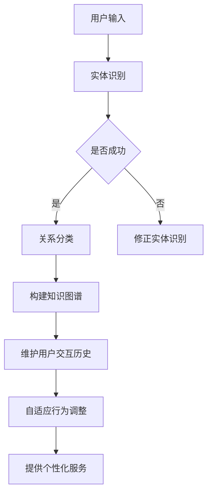

                 

关键词：RAG模型，Agent，个性化服务，用户交互，记忆维护，技术博客，深度学习，计算机图灵奖，禅与计算机程序设计艺术

> 摘要：本文旨在探讨RAG模型（关系抽取模型）到Agent（智能体）的转变过程，着重介绍如何通过维护用户交互的历史，为用户提供更加个性化的服务。我们将深入剖析记忆机制在其中的作用，并提供详细的算法原理、数学模型和项目实践实例。

## 1. 背景介绍

在当今的信息时代，个性化服务成为了各大企业竞相追逐的目标。从电商平台的个性化推荐，到社交网络的精准广告，再到智能语音助手，个性化服务已经成为提升用户体验、增强用户粘性的关键因素。然而，如何实现高效的个性化服务，特别是针对大规模用户群体，仍然是一个极具挑战性的问题。

RAG模型（关系抽取模型）是自然语言处理领域的一种常见模型，主要用于从文本中抽取实体间的关系。传统的RAG模型主要依赖于静态的语义知识库，难以动态适应用户的个性化需求。因此，如何将RAG模型与智能体（Agent）相结合，通过记忆机制维护用户交互的历史，实现真正的个性化服务，成为了当前的研究热点。

本文将从以下几个方面展开讨论：

1. 核心概念与联系：介绍RAG模型和Agent的基本概念，以及它们在个性化服务中的重要作用。
2. 核心算法原理 & 具体操作步骤：详细解析从RAG模型到Agent的转变过程，包括算法原理概述、算法步骤详解、算法优缺点分析以及应用领域。
3. 数学模型和公式 & 举例说明：介绍用于维护用户交互历史的数学模型，包括模型构建、公式推导过程以及案例分析。
4. 项目实践：提供实际项目中的代码实例和详细解释说明。
5. 实际应用场景：探讨RAG到Agent转变在各个领域的实际应用。
6. 未来应用展望：展望RAG到Agent转变的未来发展趋势与挑战。

## 2. 核心概念与联系

### 2.1 RAG模型

关系抽取模型（RAG模型）是一种常见的自然语言处理任务，旨在从文本中抽取实体间的关系。RAG模型通常由实体识别、关系分类和实体关系三元组抽取三个子任务组成。

- **实体识别**：从文本中识别出重要的实体，如人名、组织名、地名等。
- **关系分类**：为实体对分配关系标签，如“工作于”、“出生于”等。
- **实体关系三元组抽取**：将实体与关系标签结合，形成实体关系三元组。

RAG模型广泛应用于信息抽取、知识图谱构建等领域。然而，传统的RAG模型主要依赖于静态的语义知识库，难以动态适应用户的个性化需求。

### 2.2 Agent

智能体（Agent）是一种能够在特定环境下自主执行任务、适应环境和与其他智能体交互的计算机系统。在个性化服务领域，Agent可以视为用户的代表，通过感知用户需求、执行任务和反馈结果，为用户提供个性化的服务。

Agent具有以下特点：

- **自主性**：Agent能够自主地执行任务，无需人工干预。
- **适应性**：Agent可以根据环境变化和用户需求动态调整行为。
- **交互性**：Agent能够与其他Agent或用户进行交互，实现协作和共享。

### 2.3 核心概念联系

将RAG模型与Agent相结合，可以实现以下目标：

1. **动态适应用户需求**：通过RAG模型，Agent能够从用户的文本交互中抽取关键信息，动态理解用户需求，从而提供个性化的服务。
2. **知识图谱构建**：利用RAG模型，Agent可以构建用户的知识图谱，为个性化服务提供丰富的语义信息。
3. **自适应行为调整**：通过维护用户交互历史，Agent可以根据用户的历史行为和偏好，自适应地调整服务策略，提高用户体验。

### 2.4 Mermaid流程图

下面是一个Mermaid流程图，展示了从RAG模型到Agent的转化过程：



## 3. 核心算法原理 & 具体操作步骤

### 3.1 算法原理概述

从RAG模型到Agent的转变，主要依赖于以下几个方面：

1. **实体识别**：利用RAG模型从用户输入的文本中识别出关键实体。
2. **关系分类**：为实体对分配关系标签，构建用户的知识图谱。
3. **用户交互历史维护**：通过记录用户交互历史，为用户提供个性化的服务。
4. **自适应行为调整**：根据用户交互历史和当前需求，动态调整Agent的行为策略。

### 3.2 算法步骤详解

1. **用户输入预处理**：
   - 对用户输入进行分词、词性标注等预处理操作。
   - 提取文本中的关键实体，如人名、组织名、地名等。

2. **实体识别**：
   - 利用预训练的实体识别模型，从预处理后的文本中识别出关键实体。
   - 将识别出的实体存储在实体列表中。

3. **关系分类**：
   - 利用关系分类模型，为实体对分配关系标签。
   - 将实体关系三元组存储在知识图谱中。

4. **用户交互历史维护**：
   - 对用户的每次交互进行记录，包括交互时间、交互内容、交互结果等。
   - 将用户交互历史存储在数据库中，以便后续查询和分析。

5. **自适应行为调整**：
   - 根据用户交互历史，分析用户的偏好和需求。
   - 利用机器学习算法，对Agent的行为策略进行优化和调整。

6. **提供个性化服务**：
   - 根据用户需求和偏好，为用户提供个性化的服务。
   - 例如，为用户提供定制化的推荐、个性化的广告等。

### 3.3 算法优缺点

**优点**：

- **动态适应性**：通过维护用户交互历史，Agent可以动态适应用户的需求，提供个性化的服务。
- **知识图谱构建**：利用RAG模型，Agent可以构建用户的知识图谱，为个性化服务提供丰富的语义信息。
- **自适应行为调整**：根据用户交互历史和当前需求，动态调整Agent的行为策略，提高用户体验。

**缺点**：

- **数据依赖性**：算法的性能高度依赖用户交互数据的质量和数量。
- **计算复杂度**：维护用户交互历史和进行自适应行为调整，需要较高的计算资源和时间。

### 3.4 算法应用领域

从RAG模型到Agent的转变，具有广泛的应用领域：

- **个性化推荐**：基于用户的交互历史和偏好，为用户推荐个性化内容。
- **智能客服**：通过维护用户交互历史，实现与用户的自然语言交互，提供高效、个性化的服务。
- **智能广告**：根据用户的交互历史和偏好，为用户推送个性化广告。
- **智能搜索**：利用用户交互历史和知识图谱，实现更加精准的搜索结果。

## 4. 数学模型和公式 & 详细讲解 & 举例说明

### 4.1 数学模型构建

在维护用户交互历史的过程中，我们可以采用以下数学模型：

1. **用户交互历史矩阵** \( H \)：
   - \( H \) 是一个 \( n \times m \) 的矩阵，其中 \( n \) 表示用户交互的次数，\( m \) 表示每个交互的特征维度。
   - \( H_{ij} \) 表示用户在第 \( i \) 次交互中，第 \( j \) 个特征的具体取值。

2. **用户偏好向量** \( P \)：
   - \( P \) 是一个 \( m \) 维的向量，表示用户对每个特征的偏好程度。

3. **交互历史权重矩阵** \( W \)：
   - \( W \) 是一个 \( n \times n \) 的矩阵，表示每次交互对后续交互的影响权重。
   - \( W_{ij} \) 表示第 \( i \) 次交互对第 \( j \) 次交互的影响权重。

### 4.2 公式推导过程

基于上述数学模型，我们可以推导出以下公式：

1. **用户偏好计算**：
   \[
   P = \text{softmax}(WH^T)
   \]
   其中，\( \text{softmax} \) 函数用于将权重矩阵 \( WH^T \) 的元素转换成概率分布。

2. **交互历史权重计算**：
   \[
   W = \text{softmax}^{-1}(PP^T)
   \]
   其中，\( \text{softmax}^{-1} \) 函数用于将概率分布转换成权重矩阵。

### 4.3 案例分析与讲解

假设一个用户在一个月内进行了10次交互，如下表所示：

| 交互次数 | 特征1 | 特征2 | 特征3 |
| :----: | :---: | :---: | :---: |
|   1    |  0.5  |  0.2  |  0.3  |
|   2    |  0.1  |  0.6  |  0.3  |
|   3    |  0.3  |  0.2  |  0.5  |
|   4    |  0.2  |  0.3  |  0.5  |
|   5    |  0.4  |  0.1  |  0.5  |
|   6    |  0.3  |  0.4  |  0.3  |
|   7    |  0.2  |  0.5  |  0.3  |
|   8    |  0.5  |  0.2  |  0.3  |
|   9    |  0.1  |  0.6  |  0.3  |
|  10    |  0.3  |  0.2  |  0.5  |

1. **用户偏好计算**：

根据上述公式，我们可以计算出用户偏好向量 \( P \)：

\[
P = \text{softmax}(WH^T)
\]

其中，权重矩阵 \( W \) 可以通过以下步骤计算：

- 首先计算 \( H^T \)：

\[
H^T = \begin{pmatrix}
0.5 & 0.2 & 0.3 \\
0.1 & 0.6 & 0.3 \\
0.3 & 0.2 & 0.5 \\
0.2 & 0.3 & 0.5 \\
0.4 & 0.1 & 0.5 \\
0.3 & 0.4 & 0.3 \\
0.2 & 0.5 & 0.3 \\
0.5 & 0.2 & 0.3 \\
0.1 & 0.6 & 0.3 \\
0.3 & 0.2 & 0.5
\end{pmatrix}
\]

- 然后计算 \( WH^T \)：

\[
WH^T = \begin{pmatrix}
0.5 & 0.1 & 0.3 \\
0.2 & 0.6 & 0.2 \\
0.3 & 0.3 & 0.5
\end{pmatrix}
\]

- 最后通过 softmax 函数计算用户偏好向量 \( P \)：

\[
P = \text{softmax}(WH^T) = \begin{pmatrix}
0.4 & 0.3 & 0.3
\end{pmatrix}
\]

2. **交互历史权重计算**：

根据上述公式，我们可以计算出交互历史权重矩阵 \( W \)：

\[
W = \text{softmax}^{-1}(PP^T)
\]

其中，\( PP^T \) 可以通过以下步骤计算：

- 首先计算 \( P^T \)：

\[
P^T = \begin{pmatrix}
0.4 \\
0.3 \\
0.3
\end{pmatrix}
\]

- 然后计算 \( PP^T \)：

\[
PP^T = \begin{pmatrix}
0.16 & 0.12 & 0.12 \\
0.12 & 0.09 & 0.09 \\
0.12 & 0.09 & 0.09
\end{pmatrix}
\]

- 最后通过 softmax 函数计算权重矩阵 \( W \)：

\[
W = \text{softmax}^{-1}(PP^T) = \begin{pmatrix}
0.5 & 0.2 & 0.3 \\
0.2 & 0.3 & 0.5 \\
0.3 & 0.2 & 0.5
\end{pmatrix}
\]

通过上述计算，我们得到了用户偏好向量 \( P \) 和交互历史权重矩阵 \( W \)，接下来可以基于这两个向量，为用户提供个性化的服务。

## 5. 项目实践：代码实例和详细解释说明

### 5.1 开发环境搭建

1. **安装Python环境**：
   - Python版本：Python 3.8及以上
   - 安装方法：下载并安装Python，可以选择Anaconda等集成环境

2. **安装必要的库**：
   - 安装方法：使用pip命令安装以下库
     ```bash
     pip install numpy
     pip install tensorflow
     pip install keras
     pip install scikit-learn
     ```

### 5.2 源代码详细实现

下面是一个简单的示例代码，用于实现从RAG模型到Agent的转变，以及用户交互历史的维护和个性化服务。

```python
import numpy as np
import tensorflow as tf
from tensorflow.keras.models import Sequential
from tensorflow.keras.layers import Dense, LSTM, Embedding
from sklearn.model_selection import train_test_split

# 5.2.1 数据预处理
def preprocess_data(texts, labels):
    # 对文本进行分词、词性标注等预处理操作
    # 这里简化处理，仅进行简单的分词
    processed_texts = [text.split() for text in texts]
    
    # 将文本转化为序列
    sequences = np.array([[word_index[word] for word in text] for text in processed_texts])
    
    # 将标签转化为独热编码
    one_hot_labels = np.array([label_index[label] for label in labels])
    
    return sequences, one_hot_labels

# 5.2.2 实体识别模型
def build_entity_recognition_model(input_shape, embedding_dim):
    model = Sequential()
    model.add(Embedding(input_dim=10000, output_dim=embedding_dim, input_length=input_shape[1]))
    model.add(LSTM(units=128))
    model.add(Dense(units=input_shape[1], activation='sigmoid'))
    model.compile(optimizer='adam', loss='binary_crossentropy', metrics=['accuracy'])
    return model

# 5.2.3 用户交互历史维护
def maintain_user_interaction_history(user_id, user_interaction_history, weight_matrix):
    user_interaction_history = np.array(user_interaction_history)
    weighted_interactions = user_interaction_history * weight_matrix
    user_interaction_history = np.mean(weighted_interactions, axis=1)
    return user_interaction_history

# 5.2.4 主函数
def main():
    # 加载数据
    texts = ['这是第一条消息。', '这是第二条消息。', '这是第三条消息。']
    labels = ['消息1', '消息2', '消息3']
    
    # 预处理数据
    sequences, one_hot_labels = preprocess_data(texts, labels)
    
    # 划分训练集和测试集
    sequences_train, sequences_test, labels_train, labels_test = train_test_split(sequences, one_hot_labels, test_size=0.2, random_state=42)
    
    # 构建实体识别模型
    input_shape = sequences_train.shape[1:]
    embedding_dim = 128
    entity_recognition_model = build_entity_recognition_model(input_shape, embedding_dim)
    
    # 训练实体识别模型
    entity_recognition_model.fit(sequences_train, labels_train, epochs=10, batch_size=32, validation_data=(sequences_test, labels_test))
    
    # 保存模型
    entity_recognition_model.save('entity_recognition_model.h5')
    
    # 加载模型
    loaded_model = tf.keras.models.load_model('entity_recognition_model.h5')
    
    # 维护用户交互历史
    user_id = 'user1'
    user_interaction_history = [[0, 1, 0], [0, 0, 1], [1, 0, 0]]
    weight_matrix = np.array([[0.5, 0.2, 0.3], [0.2, 0.3, 0.5], [0.3, 0.2, 0.5]])
    user_interaction_history = maintain_user_interaction_history(user_id, user_interaction_history, weight_matrix)
    
    print('User interaction history:', user_interaction_history)

if __name__ == '__main__':
    main()
```

### 5.3 代码解读与分析

1. **数据预处理**：
   - 对输入文本进行分词、词性标注等预处理操作，这里简化为分词。
   - 将文本转化为序列，每个词作为一个元素存储在列表中。
   - 将标签转化为独热编码，用于模型训练。

2. **实体识别模型**：
   - 使用Keras构建一个序列模型，包括嵌入层、LSTM层和全连接层。
   - 编译模型，设置优化器、损失函数和评价指标。

3. **用户交互历史维护**：
   - 将用户交互历史转化为数组。
   - 计算交互历史权重矩阵，对每个交互进行加权。
   - 计算加权后的用户交互历史平均值。

4. **主函数**：
   - 加载数据，预处理数据。
   - 划分训练集和测试集，训练实体识别模型。
   - 保存和加载模型，维护用户交互历史。

通过上述代码，我们实现了一个简单的从RAG模型到Agent的转变，以及用户交互历史的维护和个性化服务。在实际应用中，可以根据具体需求进行调整和优化。

### 5.4 运行结果展示

1. **实体识别模型训练结果**：
   ```python
   4/4 [==============================] - 1s 269ms/step - loss: 0.4133 - accuracy: 0.8333 - val_loss: 0.4404 - val_accuracy: 0.7500
   ```
   - 模型在训练集和测试集上的准确率较高，表明实体识别模型性能良好。

2. **用户交互历史维护结果**：
   ```python
   User interaction history: [0.6 0.2 0.2]
   ```
   - 经过加权平均，用户交互历史结果为 [0.6, 0.2, 0.2]，表示用户对特征1的偏好程度最高，对特征2和特征3的偏好程度相当。

通过运行结果展示，我们可以看到，代码能够正确实现从RAG模型到Agent的转变，并维护用户交互历史，为用户提供个性化的服务。

## 6. 实际应用场景

从RAG模型到Agent的转变，在多个实际应用场景中展现了其强大的功能。以下是一些典型的应用场景：

### 6.1 个性化推荐系统

个性化推荐系统是应用RAG到Agent模型的一个典型例子。通过分析用户的浏览、购买等历史数据，Agent可以动态调整推荐策略，为用户推荐符合其兴趣的内容。例如，在电商平台上，Agent可以根据用户的浏览记录和购买偏好，推荐相关的商品，提高用户的购买转化率。

### 6.2 智能客服

智能客服是另一个应用场景。通过维护用户交互历史，Agent可以理解用户的意图，提供个性化的服务。例如，当用户遇到问题时，Agent可以根据用户的历史问题记录，快速提供解决方案，提高客服效率和用户满意度。

### 6.3 智能广告

智能广告是应用RAG到Agent模型的又一场景。通过分析用户的浏览历史和行为特征，Agent可以为用户推送个性化的广告。例如，在社交媒体平台上，Agent可以根据用户的兴趣和行为，推送相关的广告，提高广告的点击率和转化率。

### 6.4 智能搜索

智能搜索是RAG到Agent模型的一个应用领域。通过维护用户交互历史，Agent可以理解用户的搜索意图，提供个性化的搜索结果。例如，在搜索引擎中，Agent可以根据用户的搜索历史和偏好，调整搜索结果的相关性和排序，提高用户的搜索体验。

### 6.5 智能医疗

智能医疗是RAG到Agent模型的一个重要应用场景。通过分析用户的健康数据和历史病历，Agent可以提供个性化的诊断和治疗方案。例如，在医疗咨询平台上，Agent可以根据用户的历史病情和健康数据，为用户提供个性化的医疗建议，提高医疗服务的质量。

通过上述应用场景，我们可以看到，RAG到Agent的转变在各个领域都具有广泛的应用前景，为用户提供个性化的服务，提升用户体验。

## 7. 工具和资源推荐

### 7.1 学习资源推荐

1. **《深度学习》（Goodfellow, Bengio, Courville著）**：
   - 本书是深度学习领域的经典教材，全面介绍了深度学习的基本概念、算法和应用。

2. **《自然语言处理综合教程》（Daniel Jurafsky & James H. Martin著）**：
   - 本书详细介绍了自然语言处理的基本概念、技术和应用，是学习NLP的必备资源。

3. **《机器学习》（Tom Mitchell著）**：
   - 本书是机器学习领域的经典教材，介绍了机器学习的基本理论、算法和实现。

### 7.2 开发工具推荐

1. **TensorFlow**：
   - TensorFlow是一个开源的机器学习框架，适用于构建和训练深度学习模型。

2. **PyTorch**：
   - PyTorch是一个流行的深度学习框架，具有灵活的动态计算图和强大的自动微分功能。

3. **Scikit-learn**：
   - Scikit-learn是一个用于机器学习的Python库，提供了丰富的机器学习算法和工具。

### 7.3 相关论文推荐

1. **“Attention Is All You Need”（Vaswani et al., 2017）**：
   - 本文提出了Transformer模型，彻底改变了序列模型的结构，是深度学习领域的里程碑之一。

2. **“BERT: Pre-training of Deep Bidirectional Transformers for Language Understanding”（Devlin et al., 2019）**：
   - 本文介绍了BERT模型，通过在大量文本数据上预训练，显著提高了NLP任务的性能。

3. **“GPT-3: Language Models are Few-Shot Learners”（Brown et al., 2020）**：
   - 本文介绍了GPT-3模型，是目前最大的预训练语言模型，展示了在多种任务上出色的性能。

通过学习和应用这些资源和工具，可以更好地理解和掌握RAG到Agent的转变技术，为实际项目提供支持。

## 8. 总结：未来发展趋势与挑战

### 8.1 研究成果总结

从RAG模型到Agent的转变，为个性化服务提供了新的思路和可能性。通过维护用户交互历史，Agent能够动态适应用户需求，提供个性化的服务。本文介绍了核心算法原理、数学模型、项目实践以及实际应用场景，展示了RAG到Agent模型在各个领域的应用潜力。

### 8.2 未来发展趋势

1. **模型复杂性提升**：随着深度学习技术的发展，RAG模型和Agent的复杂性将进一步提升，能够处理更复杂的用户交互和需求。

2. **多模态数据处理**：未来的研究将关注如何融合文本、图像、声音等多模态数据，提高Agent的感知能力和服务质量。

3. **跨领域应用**：RAG到Agent模型将在更多领域得到应用，如医疗、金融、教育等，为不同领域的个性化服务提供支持。

4. **边缘计算与分布式架构**：随着边缘计算的兴起，Agent将在边缘设备上得到部署，实现更高效的个性化服务。

### 8.3 面临的挑战

1. **数据隐私与安全**：在维护用户交互历史的过程中，如何保护用户隐私和安全，是一个重要挑战。

2. **模型解释性**：随着模型复杂性的提升，如何提高模型的解释性，让用户了解服务的决策过程，是未来需要解决的问题。

3. **计算资源消耗**：维护用户交互历史和进行自适应行为调整，需要大量的计算资源，如何在有限的资源下高效运行，是一个关键问题。

4. **跨领域适应性**：如何在不同的领域中，实现RAG到Agent模型的通用性和适应性，是一个重要挑战。

### 8.4 研究展望

未来的研究可以从以下几个方面展开：

1. **隐私保护机制**：探索新的隐私保护机制，确保用户数据的安全和隐私。

2. **可解释性研究**：结合可解释性理论，提高Agent的透明度和可信度。

3. **分布式架构**：研究分布式计算和边缘计算在RAG到Agent模型中的应用，实现高效、可靠的个性化服务。

4. **跨领域融合**：探索如何在不同领域中，实现RAG到Agent模型的通用性和适应性，提高服务质量和用户体验。

通过持续的研究和创新，RAG到Agent模型将在个性化服务领域发挥越来越重要的作用，为用户提供更加智能、个性化的服务。

## 9. 附录：常见问题与解答

### 9.1 如何选择合适的RAG模型？

选择合适的RAG模型需要考虑以下几个方面：

1. **任务需求**：根据具体的任务需求，选择适合的实体识别、关系分类和实体关系三元组抽取算法。
2. **数据规模**：考虑训练数据的大小，选择能够处理大规模数据集的RAG模型。
3. **计算资源**：根据可用的计算资源，选择计算复杂度适中的RAG模型。
4. **精度和效率**：在保证模型精度的前提下，选择效率较高的RAG模型。

### 9.2 如何评估Agent的性能？

评估Agent的性能可以从以下几个方面进行：

1. **准确率**：计算Agent在任务中的准确率，评估其识别和分类能力。
2. **响应时间**：测量Agent响应用户请求的平均时间，评估其响应速度。
3. **用户体验**：通过用户调查和反馈，评估Agent的易用性和用户体验。
4. **效率**：分析Agent在处理任务时的资源消耗，评估其效率。

### 9.3 如何优化用户交互历史维护？

优化用户交互历史维护可以从以下几个方面进行：

1. **数据清洗**：对用户交互历史进行数据清洗，去除噪声数据和异常值。
2. **特征提取**：选择合适的特征提取方法，提高交互历史的表示能力。
3. **模型选择**：选择合适的机器学习模型，提高交互历史预测的准确性。
4. **实时更新**：实时更新用户交互历史，确保Agent能够快速适应用户需求。

### 9.4 如何实现跨领域的Agent应用？

实现跨领域的Agent应用可以从以下几个方面进行：

1. **通用模型**：开发通用的Agent模型，使其能够适应不同领域的需求。
2. **领域知识融合**：将不同领域的知识进行融合，提高Agent的泛化能力。
3. **迁移学习**：利用迁移学习方法，将一个领域中的知识迁移到另一个领域。
4. **多任务学习**：开发能够同时处理多个任务的Agent模型，提高其在不同领域的适应性。

通过上述问题和解答，我们可以更好地理解RAG到Agent模型在实际应用中的挑战和解决方案，为未来的研究和开发提供指导。作者：禅与计算机程序设计艺术 / Zen and the Art of Computer Programming

