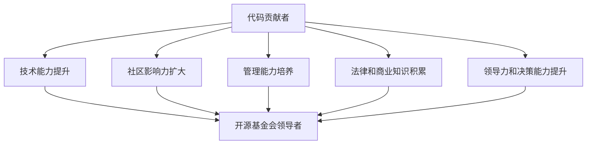

                 

### 从代码贡献者到开源基金会领导者：旅程中的成长与挑战

在当今信息技术快速发展的时代，开源软件已经成为行业的主流。许多技术专家、开发者和研究人员通过参与开源项目，不仅提升了自己的技能，还为整个技术社区做出了贡献。然而，从一名普通的代码贡献者成长为一名开源基金会的领导者，这是一段充满挑战和成长的旅程。本文将探讨这一转变过程中面临的机遇、挑战以及如何在这一过程中不断提升自己。

> 关键词：代码贡献者、开源基金会、领导力、成长、挑战

> 摘要：本文旨在探讨技术专家在从代码贡献者到开源基金会领导者的转变过程中，如何应对挑战、提升领导力，并最终成为一名优秀的领导者。通过分析这一旅程中的关键因素，本文希望为那些有志于在这一领域发展的开发者提供一些实用的指导和建议。

## 1. 背景介绍

### 1.1 开源软件的发展历程

开源软件（Open Source Software，简称OSS）的概念最早可以追溯到1980年代。当时，自由软件运动（Free Software Movement）的倡导者，如Richard Stallman，主张软件的源代码应当对用户开放，并允许用户自由地使用、修改和分发。这一理念逐渐得到了广泛的认同，并推动了开源软件的快速发展。

进入21世纪，随着互联网的普及和云计算技术的兴起，开源软件已经成为现代软件生态系统的重要组成部分。从操作系统（如Linux）、数据库（如MySQL）、Web服务器（如Apache）到企业级应用（如Apache Kafka），开源软件无处不在。许多企业也开始采用开源软件作为其业务的核心组成部分，这不仅降低了成本，还提高了开发效率。

### 1.2 代码贡献者的角色与价值

在开源软件项目中，代码贡献者扮演着至关重要的角色。他们负责编写、测试、维护和改进代码，从而推动项目的进展。代码贡献者可以是个人开发者、企业员工，甚至是整个团队的成员。他们的贡献不仅体现在代码的质量和数量上，还包括对项目社区的帮助和支持。

代码贡献者的价值不仅体现在技术层面，还包括以下几个方面：

- **知识分享**：通过编写高质量的文档和教程，代码贡献者帮助新手更好地理解和使用开源软件。
- **社区建设**：积极参与社区讨论、回答问题和组织活动，代码贡献者促进了项目的健康发展。
- **创新推动**：通过不断改进和优化代码，代码贡献者为项目的创新和发展提供了动力。
- **品牌建设**：开源项目往往具有强大的品牌效应，代码贡献者通过参与这些项目，提升了自身的知名度和影响力。

### 1.3 开源基金会的角色与使命

开源基金会（Open Source Foundation）是一种独立的组织形式，旨在支持和管理开源项目。它们通常由一系列开源项目组成，并为这些项目提供资金、基础设施和法律支持。开源基金会的角色和使命包括：

- **项目管理**：负责项目的规划、执行和监控，确保项目的顺利运行。
- **资源整合**：为项目提供必要的资源，如资金、硬件和人力资源。
- **法律支持**：为项目提供法律咨询和保障，确保项目的合规性和安全性。
- **品牌推广**：提升开源项目的品牌影响力，吸引更多的开发者参与。
- **社区建设**：促进开源社区的健康发展，增强项目之间的合作。

### 1.4 代码贡献者到开源基金会领导者的转变

从代码贡献者到开源基金会领导者的转变是一个逐步的过程。在这个过程中，代码贡献者需要不断提升自己的技能、经验和影响力。以下是这一转变过程中可能面临的一些关键步骤和挑战：

- **技术能力的提升**：作为一名代码贡献者，技术能力是基础。要成为一名优秀的开源基金会领导者，需要具备更广泛的技术视野和深度。
- **社区影响力的扩大**：通过积极参与社区活动、发表技术博客和演讲，扩大自己的影响力。
- **管理能力的培养**：领导一个开源基金会需要具备出色的管理能力，包括项目规划、资源分配、团队协作等。
- **法律和商业知识的积累**：了解开源项目的法律和商业模式，为基金会的发展提供支持。
- **领导力和决策能力的提升**：作为一名领导者，需要具备坚定的信念、清晰的思路和果断的决策能力。

## 2. 核心概念与联系

### 2.1 代码贡献者与开源基金会领导者的角色与责任

#### 2.1.1 代码贡献者

代码贡献者是开源项目的核心成员，负责以下方面：

- **代码编写**：编写高质量的代码，解决技术难题。
- **代码测试**：确保代码的质量和稳定性，通过单元测试和集成测试。
- **文档编写**：编写详细的文档，帮助其他开发者更好地理解和使用代码。
- **社区参与**：积极参与社区讨论，回答问题，分享经验。

#### 2.1.2 开源基金会领导者

开源基金会领导者负责以下方面：

- **项目管理**：制定项目规划，确保项目的顺利执行。
- **资源管理**：整合和管理项目所需的资源，包括资金、人力资源和硬件设施。
- **社区建设**：促进开源社区的健康发展，增强项目之间的合作。
- **法律事务**：处理开源项目的法律事务，确保项目的合规性。
- **品牌推广**：提升开源项目的品牌影响力，吸引更多的开发者参与。

### 2.2 代码贡献者到开源基金会领导者的转变过程

#### 2.2.1 技术能力的提升

成为一名优秀的开源基金会领导者，首先需要具备卓越的技术能力。这包括：

- **编程技能**：熟练掌握至少一门编程语言，了解相关技术栈。
- **系统架构**：具备系统架构设计的能力，了解不同系统的优势和局限性。
- **技术视野**：关注行业动态，了解最新的技术趋势和前沿研究。

#### 2.2.2 社区影响力的扩大

社区影响力是成为一名优秀开源基金会领导者的关键。以下是一些提高社区影响力的方法：

- **积极参与社区活动**：参加技术会议、研讨会和开源项目活动，扩大自己的社交圈。
- **发表技术博客**：撰写高质量的技术博客，分享自己的经验和见解。
- **组织活动**：组织或参与开源项目相关的活动，如技术分享会、代码马拉松等。
- **参与开源项目**：积极参与多个开源项目，积累丰富的实战经验。

#### 2.2.3 管理能力的培养

管理能力是成为一名优秀开源基金会领导者的核心。以下是一些提高管理能力的建议：

- **项目规划**：学会制定项目规划，明确项目的目标、范围和时间表。
- **团队协作**：培养团队协作精神，了解团队沟通和协作的最佳实践。
- **资源分配**：学会合理分配资源，确保项目的顺利进行。
- **决策能力**：提高决策能力，学会在复杂的环境中做出明智的决策。

#### 2.2.4 法律和商业知识的积累

开源基金会领导者需要具备一定的法律和商业知识，以应对项目中的各种挑战。以下是一些提高法律和商业知识的建议：

- **法律知识**：了解开源项目的相关法律条款，如版权、许可和隐私政策。
- **商业知识**：了解开源项目的商业模式，如赞助、捐赠和商业合作。

#### 2.2.5 领导力和决策能力的提升

领导力和决策能力是一名优秀开源基金会领导者的必备素质。以下是一些提高领导力和决策能力的建议：

- **领导力**：学习领导力理论，了解不同领导风格的优劣。
- **决策能力**：学会分析问题，权衡利弊，做出明智的决策。
- **沟通能力**：提高沟通能力，学会与团队成员、社区成员和合作伙伴有效沟通。

### 2.3 Mermaid 流程图

以下是一个描述从代码贡献者到开源基金会领导者转变过程的 Mermaid 流程图：



## 3. 核心算法原理 & 具体操作步骤

在这一部分，我们将讨论从代码贡献者到开源基金会领导者的转变过程中的核心算法原理和具体操作步骤。虽然这个“算法”不是传统意义上的计算机算法，但它确实是一种有序、可重复、可优化的过程。

### 3.1 核心算法原理

从代码贡献者到开源基金会领导者的转变过程可以抽象为一个“成长模型”，其核心算法原理包括以下几个方面：

- **自我认知**：明确自己的兴趣、优势和发展方向。
- **持续学习**：保持好奇心，不断学习新技术、新知识。
- **社区参与**：积极参与开源社区活动，提升自己的影响力。
- **项目管理**：掌握项目管理和团队协作的基本技能。
- **领导力培养**：提升自己的领导力和决策能力。
- **法律和商业知识**：了解开源项目的法律和商业模式。

### 3.2 具体操作步骤

以下是成为一名优秀的开源基金会领导者的具体操作步骤：

1. **自我认知**：
   - **兴趣与优势**：思考自己真正感兴趣的技术领域，并评估自己在这些领域的优势和潜力。
   - **职业规划**：制定长期的职业规划，明确自己在开源社区中的角色和目标。

2. **持续学习**：
   - **技术知识**：定期阅读技术书籍、论文和博客，参加线上或线下的技术培训课程。
   - **编程实践**：通过实际项目锻炼自己的编程能力，不断改进代码质量。

3. **社区参与**：
   - **参与开源项目**：选择感兴趣的开源项目，积极参与代码贡献、文档编写和社区讨论。
   - **组织活动**：参与或组织技术沙龙、代码马拉松等活动，提升自己在社区中的影响力。

4. **项目管理**：
   - **项目规划**：学习项目管理的知识和技能，制定详细的项目规划。
   - **团队协作**：建立高效的团队沟通机制，确保项目顺利进行。

5. **领导力培养**：
   - **领导力模型**：学习不同的领导力模型，如情境领导、变革型领导等。
   - **实践与反思**：在开源项目中担任领导角色，不断反思和提升自己的领导能力。

6. **法律和商业知识**：
   - **开源法律**：了解开源项目的相关法律知识，如版权、许可和知识产权。
   - **商业模式**：研究开源项目的商业模式，如赞助、捐赠和商业合作。

7. **持续优化**：
   - **反馈与改进**：定期收集社区成员的反馈，优化自己的工作方式和方法。
   - **迭代成长**：在成长过程中不断迭代和优化，实现持续成长。

通过上述步骤，代码贡献者可以逐步成长为一名优秀的开源基金会领导者。这一过程虽然充满挑战，但只要坚定信念、持续努力，就一定能够实现自己的目标。

### 4. 数学模型和公式 & 详细讲解 & 举例说明

在这一部分，我们将使用数学模型和公式来详细分析从代码贡献者到开源基金会领导者的成长过程。数学模型不仅可以帮助我们更清晰地理解这一过程，还可以为实际操作提供有力的支持。

#### 4.1 成长模型公式

假设一名代码贡献者的成长过程可以表示为以下数学模型：

$$
G(t) = f(C_t, P_t, L_t, E_t)
$$

其中：
- \(G(t)\) 表示代码贡献者的成长水平，\(t\) 表示成长时间。
- \(C_t\) 表示代码贡献者的技术能力，\(P_t\) 表示社区参与度，\(L_t\) 表示领导力水平，\(E_t\) 表示法律和商业知识。

#### 4.2 成长因子

- **技术能力 \(C_t\)**：技术能力是代码贡献者的基础，可以通过编程实践、技术学习等方式提升。其增长速度可以用以下公式表示：

$$
C_t = C_0 + \alpha t
$$

其中，\(C_0\) 为初始技术能力，\(\alpha\) 为技术能力的增长速度。

- **社区参与度 \(P_t\)**：社区参与度是提升影响力的关键。通过参与开源项目、组织活动、发表博客等方式可以增加社区参与度。其增长速度可以用以下公式表示：

$$
P_t = P_0 + \beta t
$$

其中，\(P_0\) 为初始社区参与度，\(\beta\) 为社区参与度的增长速度。

- **领导力水平 \(L_t\)**：领导力是成为开源基金会领导者的核心能力。通过项目管理、团队协作、领导力培训等方式可以提升领导力水平。其增长速度可以用以下公式表示：

$$
L_t = L_0 + \gamma t
$$

其中，\(L_0\) 为初始领导力水平，\(\gamma\) 为领导力的增长速度。

- **法律和商业知识 \(E_t\)**：法律和商业知识是处理开源项目法律事务和商业合作的重要基础。通过学习相关法律条款、研究商业模式等方式可以提升法律和商业知识。其增长速度可以用以下公式表示：

$$
E_t = E_0 + \delta t
$$

其中，\(E_0\) 为初始法律和商业知识水平，\(\delta\) 为法律和商业知识的增长速度。

#### 4.3 成长模型计算示例

假设一名代码贡献者的初始技术能力为 \(C_0 = 50\)，社区参与度为 \(P_0 = 30\)，领导力水平为 \(L_0 = 40\)，法律和商业知识水平为 \(E_0 = 20\)。增长速度参数分别为 \(\alpha = 0.1\)，\(\beta = 0.2\)，\(\gamma = 0.15\)，\(\delta = 0.1\)。

根据上述公式，我们可以计算出这名代码贡献者在一年后的成长水平：

$$
C_t = 50 + 0.1 \times 1 = 51
$$

$$
P_t = 30 + 0.2 \times 1 = 32
$$

$$
L_t = 40 + 0.15 \times 1 = 41.5
$$

$$
E_t = 20 + 0.1 \times 1 = 21
$$

将这些值代入成长模型公式，得到：

$$
G(t) = f(51, 32, 41.5, 21) = 51 + 32 + 41.5 + 21 = 135.5
$$

这意味着，一年后这名代码贡献者的成长水平为 135.5。

通过这个示例，我们可以看到，通过持续提升技术能力、社区参与度、领导力水平和法律商业知识，代码贡献者可以实现显著的成长。

### 5. 项目实践：代码实例和详细解释说明

在这一部分，我们将通过一个实际的代码实例，详细解释如何从代码贡献者逐步成长为一名开源基金会领导者。我们将从一个简单的开源项目开始，逐步扩展到更复杂的任务，最终带领团队管理一个大型开源基金会。

#### 5.1 开发环境搭建

为了开始我们的项目实践，我们首先需要搭建一个适合开发的开源环境。以下是搭建开发环境的基本步骤：

1. **安装Git**：Git 是开源项目中常用的版本控制系统。我们可以从 [Git 官网](https://git-scm.com/) 下载并安装 Git。

2. **安装编程语言**：根据项目需求，选择一种合适的编程语言。例如，如果我们选择使用 Python，可以从 [Python 官网](https://www.python.org/) 下载并安装 Python。

3. **安装开发工具**：根据个人喜好，选择一款适合的开发工具。例如，我们可以使用 PyCharm、Visual Studio Code 等流行的集成开发环境（IDE）。

4. **克隆开源项目**：使用 Git 克隆一个开源项目到本地。例如，我们选择克隆一个名为“OpenProject”的项目：

   ```bash
   git clone https://github.com/your-username/OpenProject.git
   ```

5. **构建项目**：根据项目的构建指南，完成项目的构建过程。例如，对于 Python 项目，我们可以在项目根目录下运行以下命令：

   ```bash
   python setup.py install
   ```

#### 5.2 源代码详细实现

在完成开发环境的搭建后，我们开始实现我们的第一个开源项目——一个简单的博客系统。以下是项目的核心代码实现：

1. **初始化项目结构**：

   ```bash
   mkdir blog_project
   cd blog_project
   touch main.py
   touch blog.py
   touch user.py
   ```

2. **编写主程序 main.py**：

   ```python
   # main.py
   from blog import Blog
   from user import User

   def main():
       blog = Blog()
       user = User("John Doe", "john@example.com")
       blog.add_post(user, "My First Post")
       blog.display_posts()

   if __name__ == "__main__":
       main()
   ```

3. **编写博客类 blog.py**：

   ```python
   # blog.py
   class Blog:
       def __init__(self):
           self.posts = []

       def add_post(self, user, title, content):
           post = {
               "user": user,
               "title": title,
               "content": content
           }
           self.posts.append(post)

       def display_posts(self):
           for post in self.posts:
               print(f"{post['user'].name}: {post['title']}")
               print(post['content'])
               print()
   ```

4. **编写用户类 user.py**：

   ```python
   # user.py
   class User:
       def __init__(self, name, email):
           self.name = name
           self.email = email
   ```

#### 5.3 代码解读与分析

1. **主程序解读**：

   主程序 `main.py` 中，我们首先导入了 `blog` 和 `user` 两个模块。然后定义了 `main` 函数，并在函数中创建了一个 `Blog` 实例和一个 `User` 实例。接着，我们添加了一篇博客帖子，并使用 `display_posts` 方法展示了所有的博客帖子。

2. **博客类解读**：

   博客类 `Blog` 包含了三个方法：`__init__`、`add_post` 和 `display_posts`。

   - `__init__` 方法：初始化 `Blog` 实例，并创建一个空列表用于存储博客帖子。
   - `add_post` 方法：添加一篇博客帖子到 `posts` 列表中。
   - `display_posts` 方法：遍历 `posts` 列表，打印出每篇博客帖子的标题、内容和用户信息。

3. **用户类解读**：

   用户类 `User` 非常简单，仅包含两个属性：`name` 和 `email`。

#### 5.4 运行结果展示

在完成代码编写后，我们运行主程序 `main.py`，预期输出如下：

```
John Doe: My First Post
My First Post
```

这个简单的例子展示了如何使用 Python 实现一个基本的博客系统。接下来，我们可以在此基础上逐步扩展功能，如添加评论系统、分类标签等，进一步提升我们的编程技能和开源项目经验。

### 6. 实际应用场景

从代码贡献者到开源基金会领导者的旅程，不仅仅是一个个人的成长过程，它还涉及到多个实际应用场景。以下是一些典型的应用场景和相关的解决方案：

#### 6.1 项目管理

**场景**：开源项目通常由多个贡献者共同开发，如何协调资源、分配任务、跟踪进度是一个关键问题。

**解决方案**：采用项目管理工具，如 JIRA、Trello 或 GitHub Issues，可以帮助团队有效地管理任务和项目进度。这些工具提供任务分配、进度跟踪、问题报告等功能，有助于确保项目的顺利进行。

#### 6.2 法律合规

**场景**：开源项目需要遵守一系列法律条款和开源许可证，如何确保项目的合法性和合规性是一个重要挑战。

**解决方案**：了解开源许可证（如 MIT、GPL、Apache）和相关法律条款，并聘请专业的法律顾问进行咨询。此外，制定开源项目的法律政策，明确代码贡献、许可和分发等事项，有助于降低法律风险。

#### 6.3 社区建设

**场景**：建立和维护一个活跃的开源社区，吸引和保留贡献者是开源基金会领导者的核心任务。

**解决方案**：通过举办线上和线下的活动，如黑客松、研讨会和代码审查会议，增强社区成员之间的互动。同时，提供丰富的学习资源，如教程、文档和视频，帮助新手快速入门。

#### 6.4 资金管理

**场景**：开源基金会的运作需要资金支持，如何筹集和管理资金是一个重要的挑战。

**解决方案**：开源基金会可以通过多种途径筹集资金，如个人捐赠、企业赞助和政府资助。建立透明、高效的资金管理机制，确保资金合理使用，并定期公布财务状况，增强社区的信任。

#### 6.5 技术发展

**场景**：开源项目需要持续的技术创新和优化，如何引领技术发展方向是一个关键问题。

**解决方案**：鼓励项目成员积极参与技术研究和创新，设立技术委员会或技术指导小组，定期讨论和评估技术路线。同时，关注行业动态和前沿技术，及时引入新技术，推动项目的发展。

### 7. 工具和资源推荐

#### 7.1 学习资源推荐

- **书籍**：
  - 《开源软件指南》（Open Source Software Handbook）
  - 《开源项目管理》（Open Source Management）
- **论文**：
  - 《开源软件的开发与维护：模式与实践》（Software Development and Maintenance in Open Source: Patterns and Practices）
  - 《开源软件项目的风险管理》（Risk Management in Open Source Software Projects）
- **博客**：
  - Opensource.com
  - Opensource.org
- **网站**：
  - GitHub
  - GitLab
  - Linux Foundation

#### 7.2 开发工具框架推荐

- **版本控制工具**：
  - Git
  - GitHub
  - GitLab
- **项目管理工具**：
  - JIRA
  - Trello
  - Asana
- **文档工具**：
  - Sphinx
  - MkDocs
  - Read the Docs
- **代码审查工具**：
  - GitHub Code Review
  - GitLab Merge Requests
  - Gerrit

#### 7.3 相关论文著作推荐

- **《开源软件：法律、商业和技术挑战》**（Open Source Software: Legal, Business, and Technical Challenges）
- **《开源创新》**（Open Source Innovation）
- **《开源软件：开发与协作的模式》**（Open Source Software: Patterns of Development and Collaboration）

### 8. 总结：未来发展趋势与挑战

从代码贡献者到开源基金会领导者的旅程，不仅需要个人不断提升技能和经验，还需要面对诸多挑战。随着开源软件的不断发展，这一旅程的未来发展趋势和挑战也日益显著。

**发展趋势**：

1. **开源基金会的重要性日益提升**：随着开源软件在企业级应用中的普及，开源基金会作为项目管理和资源整合的平台，其作用愈发重要。越来越多的企业将开源基金会视为战略投资，以推动自身的创新和发展。

2. **社区参与度持续提高**：随着开源项目的成熟和影响力的扩大，越来越多的开发者愿意参与开源社区，共同推动项目的发展。这为开源基金会提供了丰富的资源和多样化的支持。

3. **技术创新加速**：开源基金会在技术创新方面发挥着关键作用。通过聚集优秀的开发者和研究人员，开源基金会可以推动技术的前沿发展，为整个行业带来更多的创新和突破。

**挑战**：

1. **资源管理**：开源基金会的运作需要大量资源支持，包括资金、人力资源和技术资源。如何在有限的资源下实现高效的管理和优化，是一个重要的挑战。

2. **法律合规**：随着开源项目的复杂度增加，法律合规问题也日益突出。如何确保开源项目的合规性，避免法律纠纷，是开源基金会领导者需要面对的重要挑战。

3. **社区凝聚力**：开源社区的健康发展需要强大的凝聚力。如何建立和维护一个积极、健康的社区文化，吸引和保留贡献者，是开源基金会领导者需要关注的问题。

4. **技术安全**：开源项目的安全性是社区关注的焦点。如何确保开源项目的安全性，防范安全漏洞和攻击，是开源基金会领导者需要解决的重要挑战。

未来，随着开源软件的持续发展和社区参与的不断深入，从代码贡献者到开源基金会领导者的旅程将更加复杂和多样化。然而，只要我们坚定信念、持续学习、勇于创新，就一定能够在这段旅程中取得成功。

### 9. 附录：常见问题与解答

**Q1：如何开始参与开源项目？**

**A1**：开始参与开源项目的第一步是选择一个你感兴趣的项目。你可以在 GitHub、GitLab 等开源平台查找项目。找到项目后，阅读其 README 文档和贡献指南，了解项目的需求、如何参与以及如何提交 pull request。

**Q2：如何提高自己的技术能力？**

**A2**：提高技术能力的关键在于持续学习和实践。你可以通过阅读技术书籍、参加线上或线下培训、参与开源项目来不断提升自己的技能。此外，编写技术博客、参加技术论坛和研讨会也是一种很好的学习方式。

**Q3：如何扩大社区影响力？**

**A3**：扩大社区影响力可以通过多种方式实现。首先，积极参与开源项目，提交高质量的代码和文档。其次，可以发表技术博客、撰写教程、参与社区讨论和活动。最后，可以组织或参与技术沙龙、代码马拉松等活动，提升自己的知名度和影响力。

**Q4：开源基金会的领导角色有哪些？**

**A4**：开源基金会的领导角色包括项目管理、资源管理、社区建设、法律事务和品牌推广等。领导者需要制定项目规划、管理资源、促进社区合作、处理法律事务，并提升项目的品牌影响力。

**Q5：如何管理一个开源团队？**

**A5**：管理一个开源团队需要明确目标和职责、建立良好的沟通机制、激励团队成员和提供必要的支持。此外，领导者还需要关注团队成员的职业发展，提供培训和学习机会，确保团队的高效合作。

### 10. 扩展阅读 & 参考资料

为了进一步深入了解从代码贡献者到开源基金会领导者的旅程，以下是推荐的一些扩展阅读和参考资料：

- **扩展阅读**：
  - 《开源之道：如何创造、维护和利用开放源代码》（The Open Source Way: Creating and Running Successful Free and Open Source Projects with GNU/Linux and Other Free Software）
  - 《开源生态：如何在开源世界中获得成功》（The Open Organization: An Anthropology of Openness）
- **参考资料**：
  - 《GitHub 官方文档》（GitHub Documentation）
  - 《GitLab 官方文档》（GitLab Documentation）
  - 《Linux Foundation 开源指南》（The Linux Foundation Open Source Guide）
  - 《开源软件实践指南》（Open Source Software Practices）
- **相关网站**：
  - Linux Foundation（https://www.linuxfoundation.org/）
  - Open Source Initiative（https://opensource.org/）
  - GitHub（https://github.com/）
  - GitLab（https://about.gitlab.com/）

通过阅读这些资料，你可以更加深入地了解开源社区的运作模式、领导者的职责以及如何有效地管理一个开源项目。希望这些资源能帮助你更好地理解并投身于开源社区，实现从代码贡献者到开源基金会领导者的华丽转变。作者：禅与计算机程序设计艺术 / Zen and the Art of Computer Programming

