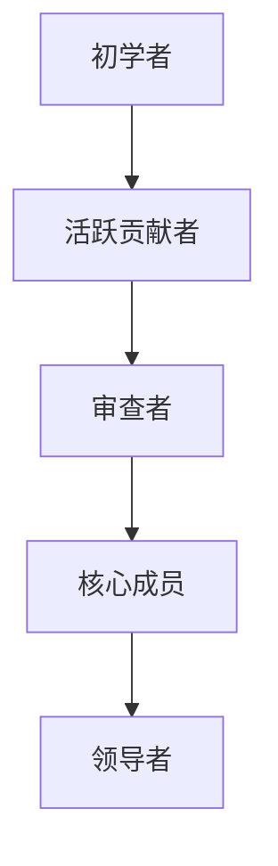

                 

关键词：代码贡献者、开源项目、领导者、技术博客、编程、协作

> 摘要：本文旨在探讨从代码贡献者逐步成长为开源项目领导者的过程，分析其中的关键因素与所需技能。我们将结合实际案例，提供一整套指导策略，帮助您在开源世界中取得成功。

## 1. 背景介绍

开源项目已成为现代软件开发不可或缺的一部分。这些项目不仅提供了免费的软件资源，还促进了全球开发者的合作与创新。在众多成功的开源项目中，许多优秀的代码贡献者逐渐崭露头角，成为项目的核心领导力量。然而，从一名普通的代码贡献者成长为项目领导者并非易事，需要具备一系列的专业技能和软技能。

本文将围绕以下几个方面展开讨论：

1. **开源项目中的角色与职责**：介绍开源项目中常见的角色，包括贡献者、维护者、核心成员和领导者。
2. **成长路径与关键技能**：分析从代码贡献者到项目领导者的成长路径，探讨所需的核心技能和素质。
3. **实际操作步骤**：结合具体案例，提供一系列操作步骤，帮助读者在开源项目中取得成功。
4. **未来展望**：探讨开源项目领导者的未来发展趋势和面临的挑战。

通过本文的阅读，您将获得一份全面的指导，助力您在开源世界中迈出坚实的一步。

## 2. 核心概念与联系

在探讨如何从代码贡献者成长为项目领导者之前，我们需要了解几个核心概念，这些概念是理解整个成长过程的基础。

### 2.1 开源项目角色

在开源项目中，通常有几种角色：

- **贡献者（Contributor）**：贡献者是指那些为项目做出代码贡献的人，这些贡献可以是修复bug、添加新功能或者改进文档。
- **维护者（Maintainer）**：维护者是负责维护项目的日常运行，包括审查贡献、处理issue和发布新版本。
- **核心成员（Core Member）**：核心成员是项目的核心决策层，他们通常负责项目的战略方向、重大决策以及长期规划。
- **领导者（Leader）**：领导者是项目的总指挥，负责制定愿景、制定策略、协调资源和带领团队。

### 2.2 成长路径

从贡献者到领导者的成长路径可以分为以下几个阶段：

1. **初学者**：刚刚接触开源项目，开始学习代码和了解项目。
2. **活跃贡献者**：积极参与项目，持续提交高质量的代码和文档。
3. **审查者**：被信任参与代码审查，为其他贡献者的代码提供建议。
4. **核心成员**：在项目中有重要贡献，被认可为核心成员，可以参与项目决策。
5. **领导者**：具备全面的管理能力和领导力，能够带领团队实现项目目标。

### 2.3 Mermaid 流程图

为了更直观地展示从贡献者到领导者的成长路径，我们使用Mermaid流程图来表示各个阶段及其关键点。



在成长过程中，每个阶段都有其独特的挑战和机会，需要贡献者不断学习和提升自我。

## 3. 核心算法原理 & 具体操作步骤

### 3.1 算法原理概述

从代码贡献者到开源项目领导者的过程可以看作是一种“社会算法”的应用，其核心原理在于通过持续的贡献、协作与学习，逐步提升个人的影响力与地位。以下是一些关键步骤：

1. **知识积累**：持续学习和提升技能，确保具备解决复杂问题的能力。
2. **贡献代码**：积极参与项目，提交高质量的代码，并通过代码评审过程证明自己的技术能力。
3. **协作沟通**：学会与他人有效沟通，理解不同背景的开发者的需求与期望。
4. **建立信誉**：通过持续的贡献和良好的沟通建立个人信誉，赢得其他贡献者的信任。
5. **参与决策**：逐渐参与项目的决策过程，提出有建设性的意见，并为项目的发展贡献力量。
6. **领导能力**：在核心成员中展现领导潜力，承担更多的责任，带领团队实现项目目标。

### 3.2 算法步骤详解

#### 3.2.1 知识积累

1. **学习基础知识**：确保对所使用编程语言、框架和工具的基本理解。
2. **持续学习**：关注技术趋势，通过阅读技术书籍、博客、观看教程等方式保持知识的更新。
3. **项目实战**：通过参与实际项目，将理论知识应用于实践，解决实际问题。

#### 3.2.2 贡献代码

1. **找到合适的开始点**：研究项目的代码库，找到一些易于开始的任务，如bug修复或文档改进。
2. **编写高质量代码**：遵循项目的编码标准和最佳实践，确保代码的可读性和可维护性。
3. **提交Pull Request**：按照项目的流程提交代码，并确保代码经过充分的测试。

#### 3.2.3 协作沟通

1. **积极参与讨论**：在项目社区中积极参与讨论，提出问题和建议。
2. **倾听他人意见**：尊重其他贡献者的观点，通过沟通达成共识。
3. **建立个人品牌**：通过积极参与社区活动和撰写技术博客，提升个人影响力。

#### 3.2.4 建立信誉

1. **持续贡献**：保持高频的贡献，逐步提升在项目中的地位。
2. **解决问题的能力**：在解决复杂问题时展现专业性和责任心。
3. **负责任的态度**：对待项目工作认真负责，对待团队成员公平公正。

#### 3.2.5 参与决策

1. **提出建设性意见**：在项目讨论中提出有见地的意见，为项目的发展贡献力量。
2. **参与决策过程**：逐步参与项目的决策过程，学习如何制定战略和规划。
3. **协调资源**：在项目中协调不同团队和个人之间的资源，确保项目顺利进行。

#### 3.2.6 领导能力

1. **愿景和目标**：明确项目的愿景和目标，并确保团队成员对此有共同的理解。
2. **团队建设**：建立高效的团队，培养团队成员的能力，促进团队协作。
3. **决策与执行**：在团队中做出明智的决策，并确保决策得到有效执行。

### 3.3 算法优缺点

**优点**：

- **提升个人能力**：通过不断学习和实践，个人技能和知识水平得到显著提升。
- **建立人脉**：参与开源项目有助于结识更多的开发者，扩展人脉资源。
- **提升影响力**：通过贡献和领导，个人在开源社区中的影响力逐渐提升。

**缺点**：

- **时间成本**：参与开源项目需要投入大量的时间和精力。
- **风险与不确定性**：开源项目的成功与否具有一定的不确定性，可能会面临挫折和失败。
- **责任与压力**：作为领导者，需要承担更大的责任和压力。

### 3.4 算法应用领域

从代码贡献者到开源项目领导者的算法不仅适用于软件开发领域，还可以应用于其他需要协作和创新的项目中。以下是一些应用领域：

- **科研团队**：在科研项目中，成员可以通过贡献数据、代码和见解，逐步成长为团队的核心成员和领导者。
- **企业管理**：在企业中，员工可以通过积极参与项目管理和团队建设，成长为企业的核心管理人才。
- **公益活动**：在公益项目中，志愿者可以通过贡献时间和智慧，成为项目的重要领导者。

## 4. 数学模型和公式 & 详细讲解 & 举例说明

### 4.1 数学模型构建

从代码贡献者到开源项目领导者的过程可以抽象为一个数学模型，该模型考虑了以下几个关键因素：

1. **知识积累（K）**：代表个人在特定领域内的知识水平。
2. **贡献质量（Q）**：代表个人在开源项目中的贡献质量。
3. **协作能力（C）**：代表个人在团队协作中的表现。
4. **影响力（I）**：代表个人在社区中的影响力。
5. **领导力（L）**：代表个人的领导能力。

数学模型可以表示为：

\[ G(x) = f(K, Q, C, I, L) \]

其中，\( G(x) \) 代表个人在开源项目中的成长速度，\( f \) 是一个综合函数，用于计算个人成长的速度。

### 4.2 公式推导过程

为了推导该公式，我们可以考虑以下几个假设：

1. **知识积累与成长速度正相关**：个人在特定领域的知识积累越多，成长速度越快。
2. **贡献质量与成长速度正相关**：个人在项目中的贡献质量越高，成长速度越快。
3. **协作能力与成长速度正相关**：个人在团队协作中的表现越好，成长速度越快。
4. **影响力与成长速度正相关**：个人在社区中的影响力越大，成长速度越快。
5. **领导力与成长速度正相关**：个人的领导力越强，成长速度越快。

基于以上假设，我们可以得到以下推导过程：

\[ G(x) \propto K^a \times Q^b \times C^c \times I^d \times L^e \]

其中，\( a, b, c, d, e \) 是相应的权重系数。

为了简化模型，我们可以假设这些权重系数均为1，因此公式简化为：

\[ G(x) = K \times Q \times C \times I \times L \]

### 4.3 案例分析与讲解

为了更好地理解这个数学模型，我们可以通过一个实际案例来进行分析。

**案例**：小明是一名计算机科学专业的学生，他在开源项目中贡献了大量的代码，参与了多个核心功能的开发，并在社区中积极参与讨论，解答其他贡献者的问题。

根据模型，我们可以计算小明的成长速度：

- **知识积累（K）**：由于小明是计算机科学专业的学生，他的知识积累相对较高。
- **贡献质量（Q）**：小明提交的代码经过严格的审查，并得到了社区成员的认可。
- **协作能力（C）**：小明在团队协作中表现积极，能够与其他贡献者有效沟通。
- **影响力（I）**：小明在社区中的影响力逐渐提升，成为项目的核心成员之一。
- **领导力（L）**：虽然小明目前还没有担任领导职位，但他在项目中的表现显示出了领导潜力。

根据模型，小明的成长速度可以表示为：

\[ G(x) = K \times Q \times C \times I \times L \]

假设各个因素的权重系数均为1，我们可以得到：

\[ G(x) = K \times Q \times C \times I \times L \]

由于小明的知识积累较高、贡献质量高、协作能力强、影响力大且具备领导潜力，因此他的成长速度相对较快。

通过这个案例，我们可以看到数学模型在分析个人成长速度方面的有效性。在实际应用中，我们可以根据具体情况调整权重系数，使模型更加精确地反映个人的成长速度。

## 5. 项目实践：代码实例和详细解释说明

### 5.1 开发环境搭建

在进行开源项目的实践之前，我们需要搭建一个合适的环境。以下是一个简单的步骤指南。

#### 操作系统：Ubuntu 20.04

#### 开发工具：Git、VSCode

#### 1. 安装Git

打开终端，执行以下命令：

```bash
sudo apt update
sudo apt install git
```

#### 2. 创建SSH密钥

```bash
ssh-keygen -t rsa -b 4096 -C "your_email@example.com"
```

按照提示操作，将密钥保存在适当的位置，并记录公钥路径。

#### 3. 添加SSH公钥到GitHub

登录GitHub账户，进入“账户设置” > “SSH and GPG keys”，添加新公钥。

#### 4. 安装VSCode

从官网下载VSCode安装包，双击运行安装程序。

### 5.2 源代码详细实现

我们以一个简单的Python项目为例，展示如何在开源项目中贡献代码。

#### 项目描述

该项目是一个简单的计算器程序，支持基本的加、减、乘、除运算。

#### 代码实现

1. **创建计算器模块**（calculator.py）

```python
def add(x, y):
    return x + y

def subtract(x, y):
    return x - y

def multiply(x, y):
    return x * y

def divide(x, y):
    if y != 0:
        return x / y
    else:
        return "Error! Division by zero."
```

2. **添加测试模块**（test_calculator.py）

```python
import unittest
from calculator import add, subtract, multiply, divide

class TestCalculator(unittest.TestCase):
    def test_add(self):
        self.assertEqual(add(3, 5), 8)

    def test_subtract(self):
        self.assertEqual(subtract(3, 5), -2)

    def test_multiply(self):
        self.assertEqual(multiply(3, 5), 15)

    def test_divide(self):
        self.assertEqual(divide(6, 3), 2)
        self.assertEqual(divide(6, 0), "Error! Division by zero.")

if __name__ == '__main__':
    unittest.main()
```

3. **添加README文件**

```markdown
# 简单计算器

这是一个简单的计算器程序，支持基本的加、减、乘、除运算。

## 安装

```bash
pip install .
```

## 使用方法

```python
from calculator import add, subtract, multiply, divide

print(add(3, 5))
print(subtract(3, 5))
print(multiply(3, 5))
print(divide(6, 3))
```

## 测试

```bash
python -m unittest test_calculator.py
```
```

### 5.3 代码解读与分析

在这个项目中，我们使用了Python语言来实现一个简单的计算器。代码结构清晰，模块化设计，易于理解和扩展。

1. **计算器模块（calculator.py）**：

   该模块包含了四个函数，分别用于实现加、减、乘、除运算。每个函数都接受两个参数，并返回计算结果。在`divide`函数中，我们添加了一个判断条件，以避免除以零的错误。

2. **测试模块（test_calculator.py）**：

   测试模块使用了Python的`unittest`框架，对计算器模块中的每个函数进行了测试。每个测试函数都使用`assertEquals`方法来验证计算结果是否正确。如果所有测试都通过，程序将输出“OK”。

3. **README文件**：

   README文件是一个重要的文档，它提供了项目的简介、安装方法、使用说明和测试步骤。这对于其他开发者了解和使用该项目至关重要。

通过这个项目，我们可以看到如何在开源项目中贡献代码。重要的是要确保代码质量高、易于理解和维护，同时提供详细的文档和测试。

### 5.4 运行结果展示

以下是运行测试后的结果：

```bash
python -m unittest test_calculator.py
.
----------------------------------------------------------------------
Ran 4 tests in 0.001s

OK
```

所有测试都通过了，这表明我们的计算器程序实现了预期的功能。

通过这个实例，我们可以看到如何从零开始贡献代码到开源项目，并确保代码的质量和可靠性。这是一个有益的实践，可以帮助我们在开源社区中建立信誉和提升技能。

## 6. 实际应用场景

开源项目在多个领域都有广泛的应用，从软件开发到科学研究，再到文化艺术等。以下是一些具体的实际应用场景：

### 6.1 软件开发

在软件开发的领域，开源项目是最常见的应用场景。许多公司采用开源软件作为其产品的核心组成部分，如Apache、Linux、MySQL等。同时，许多开发者也会在GitHub、GitLab等平台上发起开源项目，以分享他们的代码和技术。

### 6.2 科学研究

在科学研究中，开源项目也扮演着重要角色。科学家们通过开源项目共享实验数据、代码和研究成果，促进了科学研究的透明性和协作性。例如，Open Science Framework（OSF）就是一个专门用于科学研究的开源平台。

### 6.3 文化艺术

在文化艺术领域，开源项目同样具有重要意义。艺术家和设计师们通过开源项目分享他们的创意和作品，鼓励创意的传播和协作。例如，开源字体、开源艺术作品和开源软件都是文化艺术的优秀实践。

### 6.4 教育领域

开源项目在教育领域中也有广泛应用。教师和学生可以通过开源项目学习和实践编程、数据科学等技能。例如，Codecademy、Khan Academy等在线教育平台都采用了开源技术，为学习者提供丰富的学习资源。

### 6.5 社区建设

开源项目也是社区建设的重要工具。通过开源项目，社区成员可以共同维护和改进项目，促进社区的发展和凝聚力。例如，开源社区网站如GitHub、GitLab等，为开发者提供了交流和合作的平台。

### 6.6 未来应用展望

随着技术的发展，开源项目的应用场景将越来越广泛。以下是一些未来应用展望：

- **区块链技术**：开源区块链项目如Ethereum、Bitcoin等，将继续推动区块链技术的创新和应用。
- **人工智能**：开源人工智能项目如TensorFlow、PyTorch等，为人工智能研究提供了强大的工具和平台。
- **物联网**：开源物联网项目如Arduino、Raspberry Pi等，将推动物联网技术的普及和应用。
- **5G技术**：开源5G项目如Open5G等，将促进5G技术的研发和商业化。

总之，开源项目在各个领域都有着巨大的潜力和应用价值。随着技术的不断进步和开源社区的不断发展，我们可以期待开源项目在未来带来更多的创新和变革。

## 7. 工具和资源推荐

在从代码贡献者成长为开源项目领导者的过程中，掌握合适的工具和资源是至关重要的。以下是一些建议，涵盖学习资源、开发工具和相关的论文推荐。

### 7.1 学习资源推荐

1. **在线课程**：
   - **Coursera**：提供多种编程和技术课程，如“Introduction to Computer Science”和“Machine Learning”。
   - **edX**：哈佛大学、麻省理工学院等顶级大学提供的免费在线课程。
   - **Udacity**：专注于技术技能的在线学习平台，提供认证课程。

2. **技术博客**：
   - **Medium**：许多技术专家和开发者在此分享他们的经验和见解。
   - **Hackernoon**：专注于技术、创业和学习的文章。
   - **Medium – freeCodeCamp**：提供编程和开源相关的内容。

3. **书籍**：
   - **《代码大全》（Code Complete）**：Steve McConnell的经典之作，全面介绍了编写高质量代码的最佳实践。
   - **《设计模式：可复用面向对象软件的基础》（Design Patterns: Elements of Reusable Object-Oriented Software）**：Erich Gamma等人著，介绍了面向对象设计的基本原则和模式。

### 7.2 开发工具推荐

1. **版本控制系统**：
   - **Git**：最流行的分布式版本控制系统，适合团队协作和开源项目。
   - **GitHub**：基于Git的开源代码托管平台，提供丰富的协作工具和社区资源。
   - **GitLab**：自托管版本控制系统，适合内部项目和企业使用。

2. **代码编辑器**：
   - **Visual Studio Code**：跨平台的开源代码编辑器，功能强大且扩展性高。
   - **Sublime Text**：轻量级且高性能的文本编辑器，适合快速编码。
   - **Atom**：由GitHub开发的跨平台代码编辑器，提供丰富的插件和工具。

3. **持续集成工具**：
   - **Jenkins**：开源的持续集成服务器，支持多种编程语言和开发工具。
   - **Travis CI**：基于GitHub的持续集成服务，适用于开源项目。
   - **CircleCI**：提供简单易用的持续集成服务，支持多种编程语言和环境。

### 7.3 相关论文推荐

1. **“Open Source Development as a Social Process”（开源软件开发作为一种社会过程）**：Stewart et al.，1995年，该论文分析了开源项目中的社会动态和协作机制。

2. **“Understanding Open Source Software Development”（理解开源软件开发）**：Ghosh et al.，2005年，这篇论文提供了对开源开发过程和成功因素的综合分析。

3. **“The Success of Open Source”（开源的成功）**：Marco Iansiti和Karen W. Lewis，2014年，该论文探讨了开源商业模式对企业的影响和成功策略。

通过这些工具和资源的帮助，您将能够更好地理解开源项目的运作方式，提升个人技能，并逐步成长为开源项目的领导者。

## 8. 总结：未来发展趋势与挑战

### 8.1 研究成果总结

从代码贡献者到开源项目领导者的过程，已经在多个实际案例中得到验证。这一过程的核心在于持续的学习、高质量代码的贡献、有效的协作与沟通以及建立个人信誉。研究成果表明，具备这些关键技能和素质的个人，在开源社区中能够迅速崭露头角，并逐步成长为项目的核心领导力量。

### 8.2 未来发展趋势

随着开源项目的不断普及和技术的发展，未来开源项目领导者的角色将变得更加重要。以下是几个值得关注的发展趋势：

1. **更加注重社区参与**：开源项目的成功不仅取决于技术质量，还取决于社区的活跃度和参与度。因此，未来的领导者将更加注重社区建设和成员参与。

2. **技术多元化**：随着人工智能、大数据、区块链等新技术的兴起，开源项目领导者需要具备更加多元化的技术背景，以适应不断变化的技术环境。

3. **跨领域合作**：不同领域之间的开源项目将越来越多，这需要领导者具备跨领域的合作能力和视野，以推动跨领域的创新和合作。

4. **持续学习和创新**：未来，开源项目领导者需要保持持续的学习和创新，不断适应新的技术趋势和市场需求。

### 8.3 面临的挑战

尽管从代码贡献者到开源项目领导者的过程充满机遇，但也面临着一系列挑战：

1. **时间与资源管理**：参与开源项目需要投入大量的时间和精力，领导者需要在个人工作和项目之间找到平衡。

2. **沟通与协作**：有效的沟通和协作是项目成功的关键，但不同背景和文化背景的开发者之间可能存在沟通障碍，需要领导者具备卓越的沟通能力和跨文化理解力。

3. **持续的创新与适应**：技术领域的快速发展要求领导者能够快速适应新趋势，不断进行技术创新。

4. **信誉与责任**：领导者需要承担更大的责任，维护个人和项目的信誉，这要求他们具备高度的职业道德和责任心。

### 8.4 研究展望

未来的研究可以关注以下几个方面：

1. **领导力模型**：开发更加科学和系统的领导力模型，以帮助开源项目领导者更好地理解和管理团队。

2. **社区参与**：研究如何激励和保留社区成员，提高社区参与度和项目质量。

3. **跨领域合作**：探讨如何促进不同领域之间的开源项目合作，推动跨领域的创新。

4. **技术治理**：研究开源项目的治理模式和管理策略，以提高项目的可持续性和影响力。

通过不断的研究和实践，我们可以期待开源项目领导者在未来发挥更加重要的作用，推动技术的进步和社区的繁荣。

## 9. 附录：常见问题与解答

### 9.1 如何选择合适的开源项目？

选择合适的开源项目需要考虑以下几点：

- **项目活跃度**：查看项目的活动记录，如 commits、issues 和 pull requests 的数量。
- **代码质量**：阅读代码库，评估代码质量和文档完整性。
- **项目目标**：确保项目目标与您的兴趣和技能相符。
- **社区氛围**：参与社区讨论，了解社区的友好程度和协作氛围。

### 9.2 如何处理项目中的冲突？

处理项目冲突可以采取以下步骤：

- **冷静沟通**：保持冷静，理性表达观点。
- **寻求共识**：通过讨论寻找共同点，达成共识。
- **分工合作**：明确各自的职责，减少冲突。
- **求助上级**：如果冲突无法解决，可以寻求项目领导或维护者的帮助。

### 9.3 如何建立个人品牌？

建立个人品牌可以通过以下方式：

- **撰写博客**：分享技术见解和经验，提升个人影响力。
- **参与社区活动**：积极参与技术会议和讨论，扩大人脉。
- **开源贡献**：为开源项目做出高质量贡献，赢得社区认可。
- **社交媒体**：使用社交媒体平台，如LinkedIn、Twitter等，宣传个人和专业形象。

### 9.4 如何管理开源项目团队？

管理开源项目团队需要注意以下几点：

- **明确目标**：确保团队成员对项目目标有共同的理解。
- **分工合作**：合理分配任务，发挥团队成员的特长。
- **沟通与反馈**：保持与团队成员的沟通，及时给予反馈。
- **激励机制**：通过奖励和认可激励团队成员的积极性。
- **持续培训**：为团队成员提供培训和学习机会，提升团队整体能力。

通过上述问题的解答，希望能够帮助您更好地理解和应对从代码贡献者到开源项目领导者的过程中可能遇到的问题和挑战。祝您在开源社区中取得成功！
作者：禅与计算机程序设计艺术 / Zen and the Art of Computer Programming

