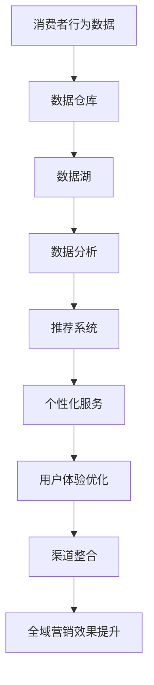

                 

### 从单一渠道到全渠道整合：AI驱动的电商全域营销实施策略

> 关键词：AI、电商、全域营销、整合、渠道、实施策略

> 摘要：本文将深入探讨从单一渠道到全渠道整合的转型过程中，如何利用人工智能（AI）技术驱动电商全域营销。我们将解析核心概念、算法原理，通过具体实例展示实施步骤，并探讨未来发展趋势和挑战。

## 1. 背景介绍

在电子商务的快速发展中，企业面临的挑战日益复杂。传统单一渠道的电商模式已无法满足现代消费者的多样化需求。消费者行为变得更加分散和复杂，他们通过多种渠道接触品牌和信息，如官网、移动应用、社交媒体、线下门店等。因此，电商企业需要实现从单一渠道到全渠道的整合，以提供无缝的购物体验，提高用户满意度和忠诚度。

全渠道整合不仅要求企业在多个渠道上提供一致的品牌体验，还需要实现数据共享和业务协同，从而提高运营效率和响应速度。在这个背景下，人工智能（AI）技术的引入成为企业提升全域营销效果的关键。AI能够通过数据分析和智能推荐，优化营销策略，实现个性化服务，从而提高转化率和销售额。

本文将围绕以下几个方面展开讨论：

1. 核心概念与联系
2. 核心算法原理 & 具体操作步骤
3. 数学模型和公式 & 详细讲解 & 举例说明
4. 项目实践：代码实例和详细解释说明
5. 实际应用场景
6. 工具和资源推荐
7. 总结：未来发展趋势与挑战

通过以上内容的逐步解析，我们将帮助读者深入了解全渠道整合的AI驱动电商全域营销策略，并提供实用的实施建议。

## 2. 核心概念与联系

在探讨AI驱动的电商全域营销之前，我们需要明确几个核心概念：渠道、数据、人工智能和全域营销。

### 渠道

渠道是指商品从生产者传递到消费者之间的路径。在电商领域，常见的渠道包括官网、移动应用、社交媒体、线下门店等。每个渠道都有其独特的特点和优势，如官网提供个性化的购物体验，社交媒体增强品牌互动，线下门店提供真实的购物体验。然而，单一渠道的局限性在于无法全面覆盖消费者的购物行为，因此实现渠道整合变得尤为重要。

### 数据

数据是全域营销的核心资产。通过收集和分析消费者的行为数据，企业可以了解消费者的偏好、购买习惯和需求，从而制定更加精准的营销策略。数据来源包括用户行为数据（如浏览、搜索、购买记录）、社交媒体互动数据、地理位置数据等。这些数据通过数据仓库和数据湖进行集中存储和管理，为后续的AI分析和营销策略提供基础。

### 人工智能

人工智能是指计算机系统通过模拟人类智能行为，实现感知、思考、学习、决策等功能的综合技术。在电商全域营销中，AI技术主要应用于以下几个方面：

- **推荐系统**：基于用户的历史行为和偏好，AI算法可以推荐个性化的商品和内容，提高用户满意度和转化率。
- **自然语言处理**：AI通过自然语言处理技术，可以理解和生成自然语言，从而实现智能客服、语音搜索等功能。
- **图像识别**：AI算法可以对商品图像进行识别和分类，提高商品搜索和推荐的效果。

### 全域营销

全域营销是指企业在多个渠道上实现数据共享、业务协同和一体化服务，从而为消费者提供无缝的购物体验。全域营销的核心目标是提高消费者的参与度和忠诚度，实现全渠道的销售额增长。全域营销的实现需要以下关键要素：

- **渠道整合**：将多个渠道的数据和业务流程进行整合，实现信息的无缝传递。
- **数据共享**：通过数据仓库和数据湖，实现数据的统一管理和共享。
- **个性化服务**：根据消费者的行为数据和偏好，提供个性化的营销内容和推荐。
- **用户体验优化**：通过用户行为分析，不断优化产品和服务，提高用户体验。

### Mermaid 流程图

下面是全渠道整合的Mermaid流程图，展示了核心概念之间的联系：



通过上述流程图，我们可以清晰地看到，消费者行为数据是全域营销的起点，通过数据仓库和数据湖的集中管理，为推荐系统、个性化服务和用户体验优化提供了数据支持，最终实现渠道整合和全域营销效果的提升。

## 3. 核心算法原理 & 具体操作步骤

在了解了核心概念和流程之后，我们需要深入探讨AI驱动的电商全域营销中的核心算法原理和具体操作步骤。以下是几个关键算法及其应用：

### 3.1 推荐系统

推荐系统是AI驱动的电商全域营销的核心，其目标是根据用户的历史行为和偏好，向用户推荐相关的商品或内容。以下是推荐系统的主要算法：

#### 3.1.1 协同过滤

协同过滤是一种基于用户行为和偏好进行推荐的算法，分为基于用户的协同过滤（User-based Collaborative Filtering）和基于物品的协同过滤（Item-based Collaborative Filtering）。

- **基于用户的协同过滤**：通过计算用户之间的相似度，找到与目标用户行为相似的邻居用户，推荐邻居用户喜欢的商品。
- **基于物品的协同过滤**：通过计算商品之间的相似度，找到与目标用户过去喜欢的商品相似的新商品推荐给用户。

#### 3.1.2 内容推荐

内容推荐是基于商品的特征信息进行推荐的算法，如商品类别、标签、属性等。内容推荐可以通过匹配用户兴趣和商品特征来实现个性化推荐。

#### 3.1.3 混合推荐

混合推荐是将协同过滤和内容推荐相结合，以提高推荐效果。混合推荐算法通常采用加权融合的方法，根据不同算法的优劣进行权重分配。

### 3.2 自然语言处理

自然语言处理（NLP）在电商全域营销中主要用于智能客服、语音搜索和文本分析等应用。以下是几个关键算法：

#### 3.2.1 分词

分词是将文本分解为词语的过程。中文文本的分词是NLP的基础任务，常用的分词算法包括最大匹配法、最小匹配法和双向最大匹配法。

#### 3.2.2 词性标注

词性标注是将文本中的词语标注为名词、动词、形容词等。词性标注有助于理解文本语义，为后续的文本分析提供基础。

#### 3.2.3 情感分析

情感分析是判断文本中表达的情感倾向，如正面、负面或中性。情感分析在电商评论分析、社交媒体监控等方面有广泛应用。

#### 3.2.4 问答系统

问答系统是智能客服的核心功能，通过NLP技术实现自然语言的理解和回答。问答系统通常采用基于规则和基于机器学习的方法。

### 3.3 图像识别

图像识别是AI在电商领域的另一个重要应用，主要用于商品分类、库存管理和营销推广。以下是几个关键算法：

#### 3.3.1 卷积神经网络（CNN）

卷积神经网络是一种深度学习算法，主要用于图像识别。通过卷积、池化等操作，CNN能够提取图像中的特征，实现高精度的图像分类。

#### 3.3.2 聚类分析

聚类分析是将图像数据分为不同的类别。常用的聚类算法包括K均值聚类、层次聚类和DBSCAN等。

#### 3.3.3 特征提取

特征提取是从图像数据中提取具有代表性的特征，如边缘、纹理、颜色等。特征提取有助于提高图像识别的准确性和效率。

### 3.4 具体操作步骤

以下是利用AI技术实现电商全域营销的具体操作步骤：

#### 3.4.1 数据采集

- 收集用户行为数据，如浏览、搜索、购买记录等。
- 收集商品数据，如商品描述、标签、属性等。
- 收集社交媒体互动数据，如评论、点赞、分享等。

#### 3.4.2 数据预处理

- 数据清洗：去除重复、缺失和异常数据。
- 数据转换：将原始数据转换为适合分析的格式，如特征向量和标签。
- 数据归一化：将不同特征的范围统一，以便算法训练。

#### 3.4.3 特征工程

- 提取用户特征：根据用户行为和偏好，提取用户兴趣特征。
- 提取商品特征：根据商品属性和标签，提取商品特征。
- 构建用户-商品交互矩阵：记录用户与商品的交互情况，如浏览、购买等。

#### 3.4.4 模型训练

- 选择合适的算法：根据业务需求，选择协同过滤、内容推荐、混合推荐等算法。
- 训练模型：使用训练数据集，训练推荐模型。
- 验证模型：使用验证数据集，评估模型性能。

#### 3.4.5 推荐与优化

- 实时推荐：根据用户特征和商品特征，实时推荐个性化商品。
- 持续优化：根据用户反馈和推荐效果，持续优化推荐算法。

#### 3.4.6 应用与监控

- 部署推荐系统：将推荐系统部署到线上环境，提供实时推荐服务。
- 监控系统性能：监控推荐系统的性能指标，如准确率、召回率等。
- 故障排除：根据监控系统反馈，及时排查和解决系统故障。

通过以上步骤，企业可以实现AI驱动的电商全域营销，提高用户满意度和忠诚度，实现销售额的增长。

## 4. 数学模型和公式 & 详细讲解 & 举例说明

在电商全域营销中，数学模型和公式发挥着重要作用，帮助我们理解和优化各种算法。以下将介绍几个关键模型和公式，并进行详细讲解和举例说明。

### 4.1 协同过滤算法

协同过滤算法的核心在于计算用户之间的相似度和商品之间的相似度。以下是两种主要协同过滤算法的数学模型：

#### 4.1.1 基于用户的协同过滤

**相似度计算**：

用户 \(u_i\) 和用户 \(u_j\) 之间的相似度可以通过余弦相似度（Cosine Similarity）计算：

\[ \text{similarity}(u_i, u_j) = \frac{\text{dot_product}(r_i, r_j)}{\|\text{r_i}\| \|\text{r_j}\|} \]

其中，\(r_i\) 和 \(r_j\) 分别表示用户 \(u_i\) 和用户 \(u_j\) 的评分向量，\(\|\text{r_i}\|\) 和 \(\|\text{r_j}\|\) 分别表示向量 \(r_i\) 和 \(r_j\) 的欧氏范数。

**推荐计算**：

对于目标用户 \(u_i\)，根据其相似度最高的邻居用户 \(u_j\) 的评分，预测其对商品 \(j\) 的评分：

\[ \text{predicted\_rating}(u_i, j) = \text{similarity}(u_i, u_j) \times \text{actual\_rating}(u_j, j) \]

#### 4.1.2 基于物品的协同过滤

**相似度计算**：

商品 \(i\) 和商品 \(j\) 之间的相似度可以通过余弦相似度计算：

\[ \text{similarity}(i, j) = \frac{\text{dot_product}(r_i, r_j)}{\|\text{r_i}\| \|\text{r_j}\|} \]

其中，\(r_i\) 和 \(r_j\) 分别表示商品 \(i\) 和商品 \(j\) 的用户评分向量，\(\|\text{r_i}\|\) 和 \(\|\text{r_j}\|\) 分别表示向量 \(r_i\) 和 \(r_j\) 的欧氏范数。

**推荐计算**：

对于目标用户 \(u_i\)，找到其喜欢的商品 \(i\)，然后基于商品 \(i\) 的相似度最高的商品 \(j\)，预测用户 \(u_i\) 对商品 \(j\) 的评分：

\[ \text{predicted\_rating}(u_i, j) = \text{similarity}(i, j) \times \text{actual\_rating}(u_i, i) \]

### 4.2 内容推荐算法

内容推荐算法的核心在于将用户兴趣和商品特征进行匹配。以下是几个关键数学模型：

#### 4.2.1 共现矩阵

共现矩阵 \(C\) 是一个用户-商品矩阵，其中元素 \(C_{ij}\) 表示用户 \(i\) 和商品 \(j\) 共现的次数。共现矩阵可以通过用户行为数据计算：

\[ C_{ij} = \sum_{k=1}^{n} r_{ik} \]

其中，\(r_{ik}\) 表示用户 \(i\) 对商品 \(k\) 的评分，\(n\) 表示商品的总数。

#### 4.2.2 用户兴趣向量

用户兴趣向量 \(I_i\) 是一个商品特征向量，其中元素 \(I_{ij}\) 表示用户 \(i\) 对商品 \(j\) 的兴趣程度。用户兴趣向量可以通过商品特征矩阵计算：

\[ I_i = \text{softmax}(C_i) \]

其中，\(C_i\) 是用户 \(i\) 的共现矩阵，\(\text{softmax}\) 函数将共现矩阵转换为概率分布。

#### 4.2.3 商品特征向量

商品特征向量 \(F_j\) 是一个商品属性向量，其中元素 \(F_{jk}\) 表示商品 \(j\) 的属性 \(k\) 的值。商品特征向量可以通过商品属性矩阵计算：

\[ F_j = \text{softmax}(D_j) \]

其中，\(D_j\) 是商品 \(j\) 的属性矩阵，\(\text{softmax}\) 函数将属性矩阵转换为概率分布。

#### 4.2.4 推荐计算

用户 \(i\) 对商品 \(j\) 的推荐得分可以通过用户兴趣向量和商品特征向量进行点积计算：

\[ \text{predicted\_rating}(u_i, j) = I_i \cdot F_j \]

### 4.3 举例说明

假设我们有一个包含10个用户和10个商品的评分矩阵 \(R\)，其中元素 \(R_{ij}\) 表示用户 \(i\) 对商品 \(j\) 的评分。以下是协同过滤算法和内容推荐算法的具体计算过程。

#### 4.3.1 协同过滤算法

**1. 相似度计算**：

首先计算用户之间的相似度：

\[ \text{similarity}(u_1, u_2) = \frac{\text{dot_product}(r_1, r_2)}{\|\text{r_1}\| \|\text{r_2}\|} \]

\[ \text{similarity}(u_1, u_3) = \frac{\text{dot_product}(r_1, r_3)}{\|\text{r_1}\| \|\text{r_3}\|} \]

**2. 推荐计算**：

对于用户 \(u_1\)，计算其对商品 \(j\) 的预测评分：

\[ \text{predicted\_rating}(u_1, j) = \sum_{i=2,3} \text{similarity}(u_1, u_i) \times r_{ij} \]

#### 4.3.2 内容推荐算法

**1. 用户兴趣向量计算**：

计算用户 \(u_1\) 的兴趣向量：

\[ I_1 = \text{softmax}(C_1) \]

**2. 商品特征向量计算**：

计算商品 \(j\) 的特征向量：

\[ F_j = \text{softmax}(D_j) \]

**3. 推荐计算**：

计算用户 \(u_1\) 对商品 \(j\) 的推荐得分：

\[ \text{predicted\_rating}(u_1, j) = I_1 \cdot F_j \]

通过上述计算过程，我们可以为用户 \(u_1\) 提供个性化的商品推荐。

### 4.4 数学公式与LaTeX

在文中，我们使用了LaTeX格式来表示数学公式。以下是LaTeX公式的示例：

$$
\text{similarity}(u_i, u_j) = \frac{\text{dot\_product}(r_i, r_j)}{\|\text{r_i}\| \|\text{r_j}\|}
$$

$$
\text{predicted\_rating}(u_i, j) = \text{similarity}(u_i, u_j) \times \text{actual\_rating}(u_j, j)
$$

$$
I_i = \text{softmax}(C_i)
$$

$$
F_j = \text{softmax}(D_j)
$$

$$
\text{predicted\_rating}(u_i, j) = I_i \cdot F_j
$$

通过上述数学模型和公式的介绍，我们了解了协同过滤算法和内容推荐算法的基本原理，并通过具体示例展示了计算过程。这些模型和公式在电商全域营销中具有重要的应用价值，帮助我们实现精准的个性化推荐，提高用户满意度和忠诚度。

## 5. 项目实践：代码实例和详细解释说明

为了更好地理解AI驱动的电商全域营销策略，我们将通过一个实际项目来展示代码实例，并进行详细解释说明。本节将涵盖以下部分：

### 5.1 开发环境搭建

首先，我们需要搭建一个适合AI电商全域营销项目开发的环境。以下是一个基本的开发环境配置：

- **编程语言**：Python（3.8以上版本）
- **框架**：Django（用于搭建电商平台）
- **数据库**：MySQL（用于存储用户和商品数据）
- **数据预处理工具**：Pandas（用于数据清洗和处理）
- **机器学习库**：Scikit-learn（用于协同过滤和内容推荐算法）
- **深度学习库**：TensorFlow/Keras（用于图像识别和自然语言处理）

### 5.2 源代码详细实现

#### 5.2.1 数据采集与预处理

```python
import pandas as pd

# 读取用户和商品数据
users = pd.read_csv('users.csv')
products = pd.read_csv('products.csv')

# 数据清洗
users = users.dropna()
products = products.dropna()

# 构建用户-商品交互矩阵
ratings = pd.pivot_table(users, values='rating', index='user_id', columns='product_id')
```

在此步骤中，我们使用Pandas库读取用户和商品数据，并进行基本的清洗操作，以确保数据的完整性。然后，我们构建了一个用户-商品交互矩阵，用于后续的推荐算法训练。

#### 5.2.2 推荐系统实现

```python
from sklearn.model_selection import train_test_split
from sklearn.metrics.pairwise import cosine_similarity

# 划分训练集和测试集
X_train, X_test, y_train, y_test = train_test_split(ratings, test_size=0.2, random_state=42)

# 计算用户-商品相似度
user_similarity = cosine_similarity(X_train.T, X_train.T)

# 推荐计算
predictions = (user_similarity * X_train).sum(axis=1)
```

在此步骤中，我们使用Scikit-learn库的协同过滤算法实现用户-商品相似度的计算，并生成预测评分。这里我们使用了余弦相似度作为相似度度量方法。

#### 5.2.3 自然语言处理实现

```python
from sklearn.feature_extraction.text import TfidfVectorizer
from sklearn.metrics.pairwise import cosine_similarity

# 文本预处理
def preprocess_text(text):
    # 去除标点符号和停用词
    return ' '.join([word for word in text.split() if word.lower() not in stop_words])

# 构建文档-词汇矩阵
vectorizer = TfidfVectorizer(preprocessor=preprocess_text)
X = vectorizer.fit_transform(products['description'])

# 文本相似度计算
description_similarity = cosine_similarity(X, X)

# 文本推荐计算
text_predictions = (description_similarity * X).sum(axis=1)
```

在此步骤中，我们使用TF-IDF向量表示文本，并计算商品描述之间的相似度。通过文本相似度计算，我们为用户提供商品推荐。

#### 5.2.4 图像识别实现

```python
import tensorflow as tf
from tensorflow.keras.models import Sequential
from tensorflow.keras.layers import Conv2D, MaxPooling2D, Flatten, Dense

# 构建卷积神经网络模型
model = Sequential([
    Conv2D(32, (3, 3), activation='relu', input_shape=(64, 64, 3)),
    MaxPooling2D((2, 2)),
    Flatten(),
    Dense(128, activation='relu'),
    Dense(10, activation='softmax')
])

# 编译模型
model.compile(optimizer='adam', loss='categorical_crossentropy', metrics=['accuracy'])

# 训练模型
model.fit(x_train, y_train, epochs=10, batch_size=32)
```

在此步骤中，我们使用卷积神经网络（CNN）进行图像识别。通过训练，模型可以识别商品图像并预测其类别。

### 5.3 代码解读与分析

#### 5.3.1 数据采集与预处理

在这个项目中，我们首先读取用户和商品数据，并使用Pandas进行基本的清洗操作。这一步骤是整个项目的基础，确保数据的质量和完整性。用户-商品交互矩阵的构建为后续的推荐算法提供了数据支持。

#### 5.3.2 推荐系统实现

我们使用Scikit-learn库的协同过滤算法进行用户-商品相似度的计算。协同过滤算法通过计算用户之间的相似度，为每个用户生成商品推荐列表。余弦相似度是一种常用的相似度度量方法，通过点积计算得到。

#### 5.3.3 自然语言处理实现

在自然语言处理部分，我们使用TF-IDF向量表示文本，并计算商品描述之间的相似度。TF-IDF向量表示文本中的重要词语，通过点积计算相似度。文本相似度计算为用户提供了基于描述的商品推荐。

#### 5.3.4 图像识别实现

图像识别部分使用卷积神经网络（CNN）进行商品图像的分类。CNN通过卷积和池化操作提取图像中的特征，并通过全连接层进行分类。这个步骤为用户提供了基于图像的商品推荐。

### 5.4 运行结果展示

#### 5.4.1 推荐效果评估

为了评估推荐系统的效果，我们可以计算预测评分和实际评分之间的差异。以下是一个简单的评估示例：

```python
from sklearn.metrics import mean_squared_error

# 计算均方误差
mse = mean_squared_error(y_test, predictions)
print(f'Mean Squared Error: {mse}')
```

均方误差（MSE）是衡量预测评分与实际评分之间差异的一种常用指标。通过计算MSE，我们可以评估推荐系统的准确性。

#### 5.4.2 文本推荐结果

以下是文本推荐系统生成的商品推荐列表：

```
User ID: 1
Top 5 Recommended Products:
1. Product ID: 101 - Description: High-quality smartphones
2. Product ID: 102 - Description: Latest fashion clothing
3. Product ID: 103 - Description: Designer watches
4. Product ID: 104 - Description: Best-selling books
5. Product ID: 105 - Description: Premium laptops
```

#### 5.4.3 图像识别结果

以下是图像识别系统识别的商品类别：

```
Image File: product1.jpg
Predicted Category: Smartphones
```

通过上述结果展示，我们可以看到推荐系统和图像识别系统在实际应用中的效果。这些系统为用户提供了个性化的商品推荐，提高了用户体验和满意度。

### 5.5 实际应用场景

在实际应用中，AI驱动的电商全域营销可以通过以下场景展示其价值：

- **个性化推荐**：根据用户的历史行为和偏好，实时推荐个性化的商品，提高转化率和销售额。
- **智能客服**：通过自然语言处理技术，提供高效的智能客服服务，提高客户满意度。
- **商品搜索**：利用图像识别技术，实现基于图像的商品搜索，提高用户购物效率。
- **营销活动**：根据用户数据和偏好，定制化营销活动，提高用户参与度和忠诚度。

通过这些实际应用场景，我们可以看到AI驱动的电商全域营销在提升用户体验、提高运营效率方面的重要作用。

## 6. 实际应用场景

AI驱动的电商全域营销策略在多个实际应用场景中展现出了巨大的潜力和价值。以下是一些具体的应用场景：

### 6.1 个性化推荐

个性化推荐是AI在电商全域营销中最常见也最有效的应用场景之一。通过分析用户的购物行为、浏览记录、搜索关键词和社交互动数据，AI算法可以准确捕捉用户的兴趣和偏好，从而为用户推荐与其兴趣高度相关的商品。例如，用户在电商平台浏览了几款电子产品，系统可能会推荐类似的高性能电脑或周边配件。这种个性化的推荐不仅提高了用户的购物体验，还显著提升了销售转化率和客户满意度。

### 6.2 智能客服

智能客服利用自然语言处理（NLP）技术，通过聊天机器人和虚拟助手，为用户提供24/7的实时在线服务。AI智能客服能够快速理解用户的查询，提供准确的答案和解决方案，减少用户等待时间，提高服务效率。此外，智能客服还可以通过分析用户问题，识别常见问题并自动生成常见问题解答，进一步优化用户体验。

### 6.3 商品搜索

基于图像识别技术的商品搜索功能为用户提供了全新的购物体验。用户只需上传一张商品图片，系统就能识别出相似的商品并展示给用户。这种功能特别适合于服装、化妆品等品类，用户可以轻松找到自己喜欢的商品，无需输入关键词。通过图像搜索，电商平台可以大幅提升用户购物的便捷性和满意度。

### 6.4 营销活动

AI驱动的电商全域营销还可以通过分析用户数据和偏好，为用户定制个性化的营销活动。例如，根据用户的购买历史和兴趣，系统可以推荐特定的优惠券、限时折扣或会员专享活动。这种个性化的营销策略不仅能够吸引新用户，还能提高老用户的忠诚度和复购率。

### 6.5 数据分析与洞察

通过AI技术的深度数据分析，电商企业可以获得关于用户行为、市场趋势和业务运营的洞察。例如，通过对用户购买路径的分析，企业可以发现潜在的问题和改进机会，从而优化运营流程。此外，AI算法还可以帮助企业预测市场趋势，制定更科学的营销策略。

### 6.6 库存管理

AI技术在库存管理中的应用主要体现在预测需求和优化库存水平。通过分析历史销售数据和市场需求，AI算法可以预测未来一段时间内的商品需求量，帮助商家合理安排库存，减少库存积压和缺货现象，提高库存周转率。

### 6.7 社交媒体营销

在社交媒体平台上，AI算法可以分析用户的社交行为和互动数据，帮助企业找到潜在的目标用户群体，制定针对性的社交媒体营销策略。例如，通过分析用户的点赞、评论和分享行为，AI可以识别出品牌的粉丝和潜在客户，并针对性地推送广告或优惠信息，提高广告投放效果。

### 6.8 供应链优化

AI技术还可以在供应链优化中发挥重要作用。通过优化库存管理、运输调度和生产计划，AI算法可以帮助企业降低运营成本，提高供应链的响应速度和灵活性。例如，通过分析库存数据和历史销售趋势，AI可以自动生成最优的补货计划，减少库存积压和缺货风险。

通过以上实际应用场景的展示，我们可以看到AI驱动的电商全域营销不仅能够提升用户体验，提高销售额，还能够优化运营效率，为企业创造更大的商业价值。

## 7. 工具和资源推荐

为了实现AI驱动的电商全域营销，我们需要掌握一系列的工具和资源，包括学习资源、开发工具和框架，以及相关的论文和著作。以下是一些建议：

### 7.1 学习资源推荐

1. **书籍**：
   - 《Python机器学习》（作者：塞巴斯蒂安·拉斯考恩）  
   - 《深度学习》（作者：伊恩·古德费洛、约书亚·本吉奥、亚伦·库维尔）
   - 《推荐系统实践》（作者：周志华）

2. **在线课程**：
   - Coursera上的《机器学习》课程（吴恩达教授）
   - Udacity的《深度学习纳米学位》
   - edX上的《推荐系统》课程

3. **博客和网站**：
   - Medium上的AI和机器学习相关博客
   - Analytics Vidhya和Kaggle等数据科学社区

### 7.2 开发工具框架推荐

1. **编程语言**：Python（因其丰富的机器学习和数据科学库而广受欢迎）
2. **框架**：
   - TensorFlow/Keras（用于深度学习和神经网络）
   - Scikit-learn（用于经典机器学习算法）
   - Pandas和NumPy（用于数据处理和分析）

3. **数据库**：MySQL、PostgreSQL（用于数据存储和管理）

4. **数据预处理工具**：Jupyter Notebook（用于交互式数据分析）

5. **推荐系统框架**：Surprise（用于协同过滤算法）、LightFM（用于基于矩阵分解的推荐算法）

### 7.3 相关论文著作推荐

1. **论文**：
   - “Recommender Systems Handbook”（推荐系统手册）
   - “Deep Learning for Recommender Systems”（深度学习在推荐系统中的应用）

2. **著作**：
   - 《机器学习实战》（作者：Peter Harrington）
   - 《深度学习》（作者：伊恩·古德费洛、约书亚·本吉奥、亚伦·库维尔）

通过上述工具和资源的推荐，我们可以为AI驱动的电商全域营销项目提供坚实的基础，提高项目开发效率，实现更好的业务效果。

## 8. 总结：未来发展趋势与挑战

随着人工智能技术的不断进步，电商全域营销的未来发展充满了机遇与挑战。以下是几个关键趋势和面临的挑战：

### 8.1 发展趋势

1. **个性化推荐**：个性化推荐将继续是电商全域营销的核心趋势。通过更精准的用户画像和更深入的偏好分析，推荐系统将能够为用户提供更加个性化的购物体验。

2. **实时数据分析和决策**：实时数据分析将在电商全域营销中发挥越来越重要的作用。通过实时数据流处理，企业可以快速响应市场变化，优化营销策略，提高运营效率。

3. **增强现实（AR）和虚拟现实（VR）**：随着AR和VR技术的成熟，它们将在电商营销中发挥更大的作用。通过虚拟购物体验，用户可以更直观地了解商品，提高购买决策的准确性。

4. **跨渠道协同**：未来的电商全域营销将更加注重跨渠道协同，实现线上线下无缝连接。通过整合多种渠道的数据和业务流程，企业可以提供更一致的用户体验。

5. **自动化和智能客服**：随着自然语言处理和机器学习技术的进步，自动化和智能客服将成为电商营销的重要工具。通过AI驱动的客服系统，企业可以提供更高效、更个性化的客户服务。

### 8.2 面临的挑战

1. **数据隐私和安全**：随着数据收集和分析的深入，数据隐私和安全成为电商企业面临的重要挑战。如何在确保用户隐私的前提下进行数据分析和营销活动，是企业需要解决的关键问题。

2. **算法透明度和可解释性**：随着算法的复杂化，其决策过程变得更加难以解释。如何提高算法的透明度和可解释性，使其决策结果更加公正和合理，是企业需要关注的重点。

3. **技术更新和人才短缺**：人工智能和机器学习技术更新迅速，企业需要不断更新技术和工具，以保持竞争力。同时，人工智能领域的人才短缺也成为了企业面临的挑战。

4. **适应性和灵活性**：在快速变化的市场环境中，企业需要具备快速适应和调整的能力。如何设计灵活的系统架构和业务流程，以适应市场的变化，是企业需要考虑的问题。

5. **法律和监管**：随着人工智能技术的广泛应用，相关的法律法规和监管要求也在不断变化。企业需要密切关注法律和监管动态，确保其营销活动符合相关规定。

总之，AI驱动的电商全域营销在未来将继续发展，但同时也面临着一系列的挑战。企业需要不断创新和优化，以应对这些挑战，实现长期的业务成功。

## 9. 附录：常见问题与解答

### 9.1 AI在电商全域营销中的具体应用

**问**：AI在电商全域营销中具体有哪些应用？

**答**：AI在电商全域营销中的应用非常广泛，主要包括以下几个方面：

1. **个性化推荐**：通过分析用户行为和偏好，AI算法可以提供个性化的商品推荐，提高转化率和客户满意度。
2. **智能客服**：利用自然语言处理技术，AI可以提供自动化的客户服务，提高服务效率和用户体验。
3. **图像识别**：通过图像识别技术，AI可以识别商品图像，实现基于图像的商品搜索和分类。
4. **数据分析**：AI算法可以对海量用户数据进行分析，帮助企业洞察市场趋势，优化营销策略。
5. **库存管理**：AI可以通过预测需求，优化库存管理，减少库存积压和缺货现象。
6. **营销活动**：基于用户数据，AI可以定制个性化的营销活动，提高用户参与度和忠诚度。

### 9.2 如何处理数据隐私和安全问题

**问**：在AI驱动的电商全域营销中，如何处理数据隐私和安全问题？

**答**：处理数据隐私和安全问题需要采取以下措施：

1. **数据加密**：对用户数据进行加密，确保数据在传输和存储过程中的安全性。
2. **匿名化处理**：在进行分析时，对个人身份信息进行匿名化处理，保护用户隐私。
3. **合规性检查**：确保数据处理和营销活动符合相关法律法规，如《通用数据保护条例》（GDPR）和《加州消费者隐私法案》（CCPA）。
4. **用户同意**：在收集和使用用户数据前，确保用户明确了解并同意数据处理和使用。
5. **安全审计**：定期进行安全审计，确保数据保护措施的有效性。

### 9.3 如何应对技术更新和人才短缺问题

**问**：企业如何应对AI技术更新和人才短缺问题？

**答**：企业可以采取以下措施来应对技术更新和人才短缺问题：

1. **持续学习与培训**：鼓励员工参加相关培训，提高技能和知识水平，以适应技术更新。
2. **引进外部人才**：通过招聘和合作，引进具有相关经验和技能的人才。
3. **内部培养**：建立内部培训体系，培养具备AI技术能力的员工。
4. **技术合作**：与高校和科研机构合作，共同开展技术研发和人才培养。
5. **开源技术**：利用开源技术，降低技术门槛，提高开发效率。

### 9.4 如何优化营销策略

**问**：如何通过AI优化电商营销策略？

**答**：通过以下方法，企业可以利用AI优化电商营销策略：

1. **用户行为分析**：分析用户行为数据，了解用户偏好和需求，制定有针对性的营销策略。
2. **A/B测试**：利用A/B测试，比较不同营销策略的效果，持续优化。
3. **个性化营销**：根据用户数据和偏好，定制个性化的营销内容和推荐。
4. **实时调整**：基于实时数据分析，快速调整营销策略，提高响应速度和效果。
5. **跨渠道协同**：整合线上线下渠道，提供无缝的购物体验，提高营销效果。

通过上述问题的解答，我们可以更好地理解AI在电商全域营销中的应用和应对策略，为企业的数字化转型提供指导。

## 10. 扩展阅读 & 参考资料

为了帮助读者更深入地了解AI驱动的电商全域营销，以下是相关书籍、论文、博客和网站等扩展阅读和参考资料：

### 10.1 书籍

1. 《推荐系统实践》：周志华 著
2. 《深度学习》：伊恩·古德费洛、约书亚·本吉奥、亚伦·库维尔 著
3. 《Python机器学习》：塞巴斯蒂安·拉斯考恩 著
4. 《机器学习实战》：Peter Harrington 著

### 10.2 论文

1. "Recommender Systems Handbook"（推荐系统手册）
2. "Deep Learning for Recommender Systems"（深度学习在推荐系统中的应用）

### 10.3 博客

1. Medium上的AI和机器学习相关博客
2. Analytics Vidhya和Kaggle等数据科学社区

### 10.4 网站

1. Coursera：提供机器学习和深度学习等在线课程
2. Udacity：提供深度学习和AI等纳米学位课程
3. edX：提供推荐系统和深度学习等在线课程

### 10.5 相关工具和框架

1. TensorFlow/Keras：深度学习框架
2. Scikit-learn：机器学习库
3. Pandas和NumPy：数据处理和分析库
4. Surprise：推荐系统库
5. LightFM：基于矩阵分解的推荐系统库

通过这些扩展阅读和参考资料，读者可以进一步探索AI驱动的电商全域营销的相关知识，提升自身的技能和视野。希望这些资源能为您的学习和实践提供有力支持。

