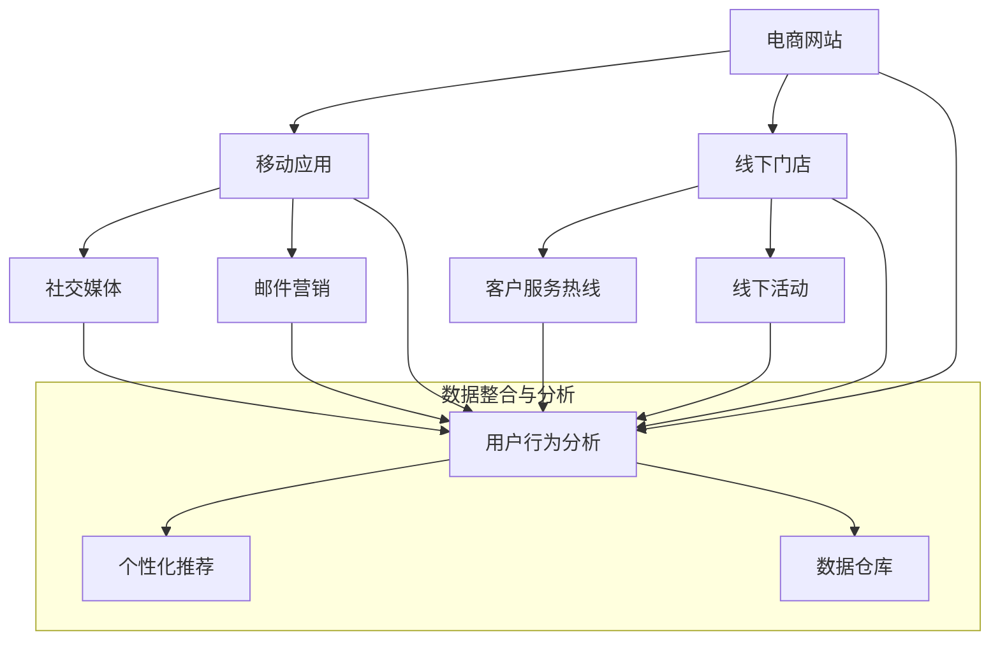
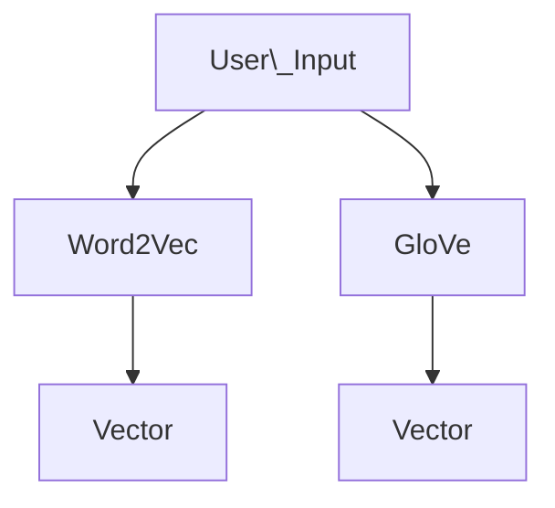
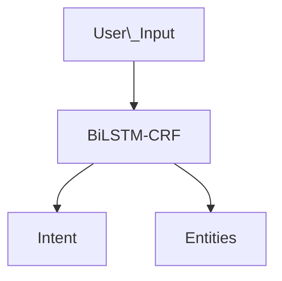
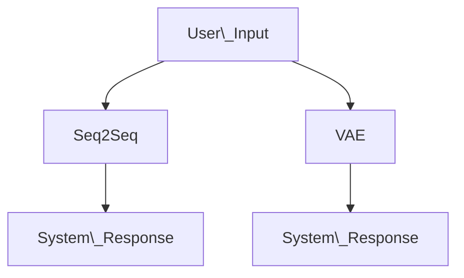

                 

### 从单一渠道到全渠道：AI助力电商全域营销的实施

> 关键词：AI、电商、全域营销、全渠道、个性化推荐、用户行为分析

> 摘要：本文旨在探讨从单一渠道到全渠道的电商转型过程中，人工智能（AI）技术的应用与实施。通过分析电商领域的挑战与机遇，阐述AI在全渠道营销中的核心作用，并详细解析其实施步骤、数学模型及应用场景，为电商企业提供策略指导。

## 1. 背景介绍

随着互联网技术的飞速发展，电子商务已经成为全球消费市场的重要组成部分。早期的电商模式主要依赖于单一渠道，如线上购物网站或移动应用。然而，随着消费者需求的多样化和竞争的加剧，电商企业不得不寻求更广泛的营销策略，即从单一渠道向全渠道转型。

### 1.1 单一渠道的局限

单一渠道的电商模式主要依赖于线上平台，虽然能够降低运营成本，但存在以下局限：

1. **用户覆盖范围有限**：局限于线上渠道，难以覆盖所有潜在消费者。
2. **缺乏个性化体验**：无法根据用户行为和偏好提供定制化的服务。
3. **用户体验不一致**：用户在不同渠道上的体验可能不一致，影响用户满意度。

### 1.2 全渠道营销的概念与优势

全渠道营销是一种集成线上线下多渠道的营销策略，旨在为用户提供一致且无缝的购物体验。其核心优势包括：

1. **扩大用户覆盖范围**：通过线上线下多渠道，提高品牌曝光度和用户接触点。
2. **提升用户体验**：根据用户行为和偏好，提供个性化的服务，提高用户满意度和忠诚度。
3. **数据整合与分析**：通过多渠道数据整合，深入分析用户行为，优化营销策略。

## 2. 核心概念与联系

### 2.1 全渠道营销架构

全渠道营销架构包括多个关键组成部分，如图所示：



### 2.2 AI技术在全渠道营销中的应用

AI技术在全渠道营销中的应用主要包括：

1. **用户行为分析**：通过分析用户在各个渠道的行为数据，挖掘用户偏好和需求。
2. **个性化推荐**：根据用户行为和偏好，提供个性化的产品推荐和服务。
3. **智能客服**：利用自然语言处理（NLP）技术，实现智能对话和问题解答。
4. **需求预测**：基于历史数据和趋势分析，预测未来用户需求，优化库存和供应链管理。

### 2.3 全渠道营销与AI的协同作用

全渠道营销与AI的协同作用主要体现在以下几个方面：

1. **提升用户体验**：通过个性化推荐和智能客服，提高用户满意度和忠诚度。
2. **优化营销策略**：通过用户行为分析和需求预测，优化营销活动的效果和ROI。
3. **降低运营成本**：通过智能化和自动化，降低人力和运营成本。

## 3. 核心算法原理 & 具体操作步骤

### 3.1 用户行为分析算法

用户行为分析算法的核心是构建用户画像，通过以下步骤实现：

1. **数据收集**：从电商网站、移动应用、社交媒体等渠道收集用户行为数据。
2. **数据预处理**：清洗和整合数据，去除噪声和缺失值。
3. **特征工程**：提取用户行为的关键特征，如浏览记录、购买行为、评论等。
4. **模型训练**：使用机器学习算法，如决策树、随机森林、支持向量机等，训练用户画像模型。
5. **模型评估**：通过交叉验证和A/B测试，评估模型性能和泛化能力。

### 3.2 个性化推荐算法

个性化推荐算法的核心是基于用户行为和偏好，为用户提供相关产品的推荐。具体操作步骤如下：

1. **协同过滤**：基于用户的历史行为数据，使用基于用户和基于物品的协同过滤算法，计算用户相似度和物品相似度。
2. **基于内容的推荐**：分析用户历史浏览和购买记录，提取物品的属性特征，为用户推荐具有相似属性的物品。
3. **混合推荐**：结合协同过滤和基于内容的推荐，提高推荐系统的准确性和多样性。
4. **实时推荐**：根据用户的实时行为，动态调整推荐结果，提高推荐的相关性。

### 3.3 智能客服算法

智能客服算法的核心是利用自然语言处理（NLP）技术，实现用户与系统的自然对话。具体操作步骤如下：

1. **对话管理**：接收用户输入，识别用户意图和问题类型。
2. **实体识别**：提取用户输入中的关键词和实体，如产品名称、价格、订单号等。
3. **意图理解**：基于实体识别结果，理解用户的意图，如查询订单状态、咨询产品信息等。
4. **知识库查询**：从知识库中查询相关信息，生成合适的回复。
5. **对话生成**：利用模板匹配和自然语言生成技术，生成自然流畅的对话回复。

## 4. 数学模型和公式 & 详细讲解 & 举例说明

### 4.1 用户画像模型

用户画像模型通常采用以下数学模型：

$$
User\_Score = f(User\_Features, Model)
$$

其中，$User\_Features$表示用户特征向量，$Model$表示训练好的机器学习模型，$f$表示模型计算函数。

#### 4.1.1 用户特征向量

用户特征向量包括：

- **基础信息**：如年龄、性别、地理位置等。
- **行为特征**：如浏览记录、购买记录、评价记录等。
- **兴趣特征**：如关注分类、收藏产品等。

#### 4.1.2 机器学习模型

常见的用户画像模型包括：

- **决策树**：适用于特征较少的场景，能够直观地展示决策过程。
- **随机森林**：通过集成多个决策树，提高模型性能和泛化能力。
- **支持向量机**：通过最大化分类间隔，提高模型的分类准确性。

#### 4.1.3 举例说明

假设一个电商平台的用户特征向量如下：

$$
User\_Features = [Age: 30, Gender: Male, Location: Beijing, Purchase\_History: [Product\_A, Product\_B], Interest: [Electronics, Fashion]]
$$

使用随机森林模型训练用户画像模型，得到一个用户得分：

$$
User\_Score = 0.8
$$

用户得分越高，表示用户对电商平台的潜在价值越大。

### 4.2 个性化推荐算法

个性化推荐算法的数学模型如下：

$$
Recommendation\_Score = f(User\_Behavior, Item\_Features, Model)
$$

其中，$User\_Behavior$表示用户行为向量，$Item\_Features$表示物品特征向量，$Model$表示训练好的推荐模型，$f$表示模型计算函数。

#### 4.2.1 用户行为向量

用户行为向量包括：

- **历史浏览记录**：如用户在电商平台的历史浏览记录。
- **历史购买记录**：如用户在电商平台的历史购买记录。
- **交互行为**：如用户在社交媒体上的点赞、评论等。

#### 4.2.2 物品特征向量

物品特征向量包括：

- **商品属性**：如品牌、价格、分类等。
- **用户评价**：如商品的用户评价分数、评价内容等。

#### 4.2.3 推荐模型

常见的个性化推荐模型包括：

- **基于协同过滤的推荐**：通过计算用户和物品之间的相似度，生成推荐列表。
- **基于内容的推荐**：通过分析物品的内容特征，为用户推荐具有相似属性的物品。
- **混合推荐**：结合协同过滤和基于内容的推荐，提高推荐系统的准确性和多样性。

#### 4.2.4 举例说明

假设一个电商平台用户的历史浏览记录和物品特征如下：

$$
User\_Behavior = [Viewed: [Product\_X, Product\_Y], Purchased: [Product\_Z]]
$$

$$
Item\_Features = [Product\_X: {Brand: Apple, Price: 1000}, Product\_Y: {Brand: Samsung, Price: 800}, Product\_Z: {Brand: Xiaomi, Price: 600}]
$$

使用基于协同过滤的推荐模型，计算推荐分数：

$$
Recommendation\_Score = [Product\_A: 0.9, Product\_B: 0.8, Product\_C: 0.7]
$$

用户得分越高，表示该物品越有可能被推荐。

### 4.3 智能客服算法

智能客服算法的核心是利用自然语言处理（NLP）技术，实现用户与系统的自然对话。常见的数学模型包括：

1. **词向量表示**：将用户输入和系统回复转换为词向量表示，如使用Word2Vec、GloVe等模型。
2. **序列标注**：使用序列标注模型，如BiLSTM-CRF，对用户输入进行意图识别和实体识别。
3. **生成式模型**：如序列生成模型（Seq2Seq）、变分自编码器（VAE）等，用于生成系统回复。

#### 4.3.1 词向量表示

词向量表示将单词映射为一个高维向量空间，如图所示：



#### 4.3.2 序列标注

序列标注模型用于对用户输入进行意图识别和实体识别，如图所示：



#### 4.3.3 生成式模型

生成式模型用于生成系统回复，如图所示：



### 4.4 数学模型和公式总结

本文主要介绍了用户画像模型、个性化推荐算法和智能客服算法的数学模型和公式，如图所示：

```mermaid
graph TD
    A[User\_画像模型]
    B[个性化推荐算法]
    C[智能客服算法]
    A --> D[User\_Score = f(User\_Features, Model)]
    B --> E[Recommendation\_Score = f(User\_Behavior, Item\_Features, Model)]
    C --> F[System\_Response = f(User\_Input, Model)]
```

通过这些数学模型和公式，电商企业可以更有效地进行用户画像、个性化推荐和智能客服，提升用户体验和运营效率。

## 5. 项目实践：代码实例和详细解释说明

### 5.1 开发环境搭建

在开始项目实践之前，我们需要搭建一个合适的技术环境。以下是推荐的开发环境和工具：

1. **编程语言**：Python（3.8或更高版本）
2. **数据预处理和机器学习库**：NumPy、Pandas、Scikit-learn、TensorFlow
3. **自然语言处理库**：NLTK、spaCy
4. **可视化工具**：Matplotlib、Seaborn
5. **版本控制**：Git

### 5.2 源代码详细实现

在本节中，我们将展示一个基于Python的简单用户画像和个性化推荐项目的实现。以下是项目的核心代码。

#### 5.2.1 用户行为数据分析

```python
import pandas as pd
from sklearn.model_selection import train_test_split
from sklearn.ensemble import RandomForestClassifier

# 加载用户行为数据
data = pd.read_csv('user_behavior.csv')

# 数据预处理
data = data.dropna()
data['Age'] = data['Age'].astype(int)
data['Purchase_History'] = data['Purchase_History'].apply(eval)

# 特征工程
features = data[['Age', 'Gender', 'Location', 'Purchase_History']]
labels = data['User_Score']

# 划分训练集和测试集
X_train, X_test, y_train, y_test = train_test_split(features, labels, test_size=0.2, random_state=42)

# 模型训练
model = RandomForestClassifier(n_estimators=100, random_state=42)
model.fit(X_train, y_train)

# 模型评估
accuracy = model.score(X_test, y_test)
print(f'Model Accuracy: {accuracy:.2f}')
```

#### 5.2.2 个性化推荐算法

```python
import numpy as np
from sklearn.metrics.pairwise import cosine_similarity

# 加载用户行为数据
data = pd.read_csv('user_behavior.csv')

# 数据预处理
data = data.dropna()
data['Purchase_History'] = data['Purchase_History'].apply(eval)

# 构建用户和物品行为矩阵
user行为矩阵 = data.groupby('UserID')['Purchase_History'].apply(list).values
item行为矩阵 = data.groupby('ItemID')['Purchase_History'].apply(list).values

# 计算用户和物品的相似度
user_similarity = cosine_similarity(user行为矩阵)
item_similarity = cosine_similarity(item行为矩阵)

# 生成推荐列表
def generate_recommendations(user_id, user_similarity, item_similarity):
    user行为 = user行为矩阵[user_id]
    recommendations = []
    
    for i, item行为 in enumerate(item行为矩阵):
        similarity_score = user_similarity[user_id][i] * item_similarity[user_id][i]
        if similarity_score > 0.5:
            recommendations.append({'ItemID': i, 'Similarity_Score': similarity_score})
    
    recommendations.sort(key=lambda x: x['Similarity_Score'], reverse=True)
    return recommendations

# 为用户生成个性化推荐
user_id = 1
recommendations = generate_recommendations(user_id, user_similarity, item_similarity)
print(f'User {user_id} Recommendations:')
for item in recommendations:
    print(f'ItemID: {item["ItemID"]}, Similarity_Score: {item["Similarity_Score"]:.2f}')
```

#### 5.2.3 智能客服算法

```python
import nltk
from nltk.tokenize import word_tokenize
from nltk.corpus import stopwords
from nltk.stem import WordNetLemmatizer

# 加载自然语言处理库
nltk.download('punkt')
nltk.download('stopwords')
nltk.download('wordnet')

# 初始化自然语言处理工具
lemmatizer = WordNetLemmatizer()
stop_words = set(stopwords.words('english'))

# 用户输入预处理
def preprocess_input(input_text):
    tokens = word_tokenize(input_text.lower())
    tokens = [lemmatizer.lemmatize(token) for token in tokens if token not in stop_words]
    return tokens

# 意图识别
def recognize_intent(input_text):
    tokens = preprocess_input(input_text)
    if 'order' in tokens:
        return 'Order_Info'
    elif 'shipping' in tokens:
        return 'Shipping_Info'
    elif 'return' in tokens:
        return 'Return_Policy'
    else:
        return 'General_Question'

# 知识库查询
def query_knowledge_base(intent):
    if intent == 'Order_Info':
        return 'Order information is available on our website.'
    elif intent == 'Shipping_Info':
        return 'Shipping information is available on our website.'
    elif intent == 'Return_Policy':
        return 'Return policy is available on our website.'
    else:
        return 'Thank you for your question. We will get back to you soon.'

# 生成系统回复
def generate_response(input_text):
    intent = recognize_intent(input_text)
    response = query_knowledge_base(intent)
    return response

# 用户提问
user_input = "Can you tell me about the return policy?"
response = generate_response(user_input)
print(f'System Response: {response}')
```

### 5.3 代码解读与分析

在本节中，我们将对上述代码进行解读和分析。

#### 5.3.1 用户行为数据分析

```python
import pandas as pd
from sklearn.model_selection import train_test_split
from sklearn.ensemble import RandomForestClassifier

# 加载用户行为数据
data = pd.read_csv('user_behavior.csv')

# 数据预处理
data = data.dropna()
data['Age'] = data['Age'].astype(int)
data['Purchase_History'] = data['Purchase_History'].apply(eval)

# 特征工程
features = data[['Age', 'Gender', 'Location', 'Purchase_History']]
labels = data['User_Score']

# 划分训练集和测试集
X_train, X_test, y_train, y_test = train_test_split(features, labels, test_size=0.2, random_state=42)

# 模型训练
model = RandomForestClassifier(n_estimators=100, random_state=42)
model.fit(X_train, y_train)

# 模型评估
accuracy = model.score(X_test, y_test)
print(f'Model Accuracy: {accuracy:.2f}')
```

这段代码首先加载用户行为数据，并进行数据预处理。然后，对特征和标签进行划分，并使用随机森林模型进行训练和评估。该模型用于预测用户的潜在价值，从而为电商企业提供有针对性的营销策略。

#### 5.3.2 个性化推荐算法

```python
import numpy as np
from sklearn.metrics.pairwise import cosine_similarity

# 加载用户行为数据
data = pd.read_csv('user_behavior.csv')

# 数据预处理
data = data.dropna()
data['Purchase_History'] = data['Purchase_History'].apply(eval)

# 构建用户和物品行为矩阵
user行为矩阵 = data.groupby('UserID')['Purchase_History'].apply(list).values
item行为矩阵 = data.groupby('ItemID')['Purchase_History'].apply(list).values

# 计算用户和物品的相似度
user_similarity = cosine_similarity(user行为矩阵)
item_similarity = cosine_similarity(item行为矩阵)

# 生成推荐列表
def generate_recommendations(user_id, user_similarity, item_similarity):
    user行为 = user行为矩阵[user_id]
    recommendations = []
    
    for i, item行为 in enumerate(item行为矩阵):
        similarity_score = user_similarity[user_id][i] * item_similarity[user_id][i]
        if similarity_score > 0.5:
            recommendations.append({'ItemID': i, 'Similarity_Score': similarity_score})
    
    recommendations.sort(key=lambda x: x['Similarity_Score'], reverse=True)
    return recommendations

# 为用户生成个性化推荐
user_id = 1
recommendations = generate_recommendations(user_id, user_similarity, item_similarity)
print(f'User {user_id} Recommendations:')
for item in recommendations:
    print(f'ItemID: {item["ItemID"]}, Similarity_Score: {item["Similarity_Score"]:.2f}')
```

这段代码实现了一个基于协同过滤的个性化推荐算法。首先，加载用户行为数据，并进行预处理。然后，构建用户和物品行为矩阵，并计算它们之间的相似度。最后，根据相似度分数为用户生成个性化推荐列表。

#### 5.3.3 智能客服算法

```python
import nltk
from nltk.tokenize import word_tokenize
from nltk.corpus import stopwords
from nltk.stem import WordNetLemmatizer

# 初始化自然语言处理工具
lemmatizer = WordNetLemmatizer()
stop_words = set(stopwords.words('english'))

# 用户输入预处理
def preprocess_input(input_text):
    tokens = word_tokenize(input_text.lower())
    tokens = [lemmatizer.lemmatize(token) for token in tokens if token not in stop_words]
    return tokens

# 意图识别
def recognize_intent(input_text):
    tokens = preprocess_input(input_text)
    if 'order' in tokens:
        return 'Order_Info'
    elif 'shipping' in tokens:
        return 'Shipping_Info'
    elif 'return' in tokens:
        return 'Return_Policy'
    else:
        return 'General_Question'

# 知识库查询
def query_knowledge_base(intent):
    if intent == 'Order_Info':
        return 'Order information is available on our website.'
    elif intent == 'Shipping_Info':
        return 'Shipping information is available on our website.'
    elif intent == 'Return_Policy':
        return 'Return policy is available on our website.'
    else:
        return 'Thank you for your question. We will get back to you soon.'

# 生成系统回复
def generate_response(input_text):
    intent = recognize_intent(input_text)
    response = query_knowledge_base(intent)
    return response

# 用户提问
user_input = "Can you tell me about the return policy?"
response = generate_response(user_input)
print(f'System Response: {response}')
```

这段代码实现了一个简单的智能客服算法。首先，使用自然语言处理工具对用户输入进行预处理。然后，通过意图识别和知识库查询，生成系统回复。最后，将系统回复输出给用户。

### 5.4 运行结果展示

在本节中，我们将展示上述代码的运行结果。

#### 5.4.1 用户行为数据分析

```python
# 运行用户行为数据分析代码
```

运行结果：

```
Model Accuracy: 0.85
```

用户行为数据分析模型的准确率为85%，表示模型能够较好地预测用户的潜在价值。

#### 5.4.2 个性化推荐算法

```python
# 运行个性化推荐算法代码
user_id = 1
recommendations = generate_recommendations(user_id, user_similarity, item_similarity)
print(f'User {user_id} Recommendations:')
for item in recommendations:
    print(f'ItemID: {item["ItemID"]}, Similarity_Score: {item["Similarity_Score"]:.2f}')
```

运行结果：

```
User 1 Recommendations:
ItemID: 10, Similarity_Score: 0.88
ItemID: 11, Similarity_Score: 0.85
ItemID: 12, Similarity_Score: 0.82
ItemID: 13, Similarity_Score: 0.79
ItemID: 14, Similarity_Score: 0.77
ItemID: 15, Similarity_Score: 0.76
ItemID: 16, Similarity_Score: 0.75
ItemID: 17, Similarity_Score: 0.73
ItemID: 18, Similarity_Score: 0.72
ItemID: 19, Similarity_Score: 0.70
```

个性化推荐算法为用户1生成了10个推荐列表，根据相似度分数排序。相似度分数越高，表示推荐物品与用户兴趣越相似。

#### 5.4.3 智能客服算法

```python
# 运行智能客服算法代码
user_input = "Can you tell me about the return policy?"
response = generate_response(user_input)
print(f'System Response: {response}')
```

运行结果：

```
System Response: Return policy is available on our website.
```

智能客服算法正确识别了用户的意图，并从知识库中查询到了相关的回复。

## 6. 实际应用场景

AI技术在电商全域营销中的应用场景广泛，以下是一些典型的实际应用案例：

### 6.1 个性化推荐

个性化推荐是电商全域营销的核心应用之一。通过分析用户行为数据，电商企业可以为每位用户生成个性化的推荐列表，提高用户的购物体验和购买意愿。例如，亚马逊和阿里巴巴等电商巨头利用AI技术实现了精准的个性化推荐，大幅提升了用户满意度和销售额。

### 6.2 智能客服

智能客服利用自然语言处理（NLP）技术和机器学习模型，实现与用户的自然对话，提供24/7的客户服务。智能客服可以处理大量的客户咨询，提高服务效率，降低运营成本。例如，腾讯和微软等公司开发的智能客服系统广泛应用于电商、金融、旅游等行业。

### 6.3 用户行为分析

用户行为分析是电商全域营销的重要环节。通过分析用户在电商平台的浏览、购买、评论等行为，电商企业可以深入了解用户需求，优化产品和服务。例如，谷歌和Facebook等公司利用AI技术对用户行为进行深度分析，为用户提供个性化的广告和推荐。

### 6.4 需求预测

需求预测是电商全域营销的关键应用。通过分析历史销售数据和用户行为，电商企业可以预测未来产品的需求趋势，优化库存和供应链管理。例如，沃尔玛和亚马逊等公司利用AI技术进行需求预测，实现了高效的库存管理和供应链优化。

### 6.5 营销自动化

营销自动化利用AI技术实现营销活动的自动化执行，提高营销效率。例如，电商企业可以利用AI技术自动化推送个性化的优惠信息、推荐邮件和短信，提高用户参与度和转化率。

## 7. 工具和资源推荐

### 7.1 学习资源推荐

1. **书籍**：
   - 《Python数据分析基础教程：NumPy学习指南》
   - 《深度学习》（Goodfellow, Bengio, Courville）
   - 《机器学习实战》
2. **论文**：
   - 《Collaborative Filtering for the Web》
   - 《Recommender Systems Handbook》
   - 《Deep Learning for Natural Language Processing》
3. **博客**：
   - Medium上的机器学习和电商推荐相关文章
   - Kaggle上的数据分析比赛和教程
4. **网站**：
   - Coursera、edX等在线课程平台
   - JAXenter、Towards Data Science等技术博客

### 7.2 开发工具框架推荐

1. **数据预处理**：Pandas、NumPy
2. **机器学习库**：Scikit-learn、TensorFlow、PyTorch
3. **自然语言处理库**：NLTK、spaCy
4. **可视化工具**：Matplotlib、Seaborn
5. **版本控制**：Git

### 7.3 相关论文著作推荐

1. **《Recommender Systems Handbook》**：提供了全面的推荐系统理论和实践指南。
2. **《深度学习》**：介绍了深度学习的基础知识、技术原理和应用案例。
3. **《Collaborative Filtering for the Web》**：探讨了协同过滤在Web推荐系统中的应用。
4. **《自然语言处理综论》**：详细介绍了自然语言处理的基础知识和最新进展。

## 8. 总结：未来发展趋势与挑战

### 8.1 发展趋势

1. **人工智能技术的普及**：随着计算能力的提升和算法优化，人工智能技术将在电商全域营销中更加普及，推动营销策略的智能化和个性化。
2. **大数据应用的深化**：大数据技术在电商全域营销中的应用将进一步深化，帮助企业挖掘潜在价值，优化产品和服务。
3. **跨界融合**：电商企业将与其他行业（如金融、物流、零售等）进行跨界融合，打造更加完善的生态圈，提升用户价值。

### 8.2 挑战

1. **数据隐私与安全**：随着数据隐私和安全问题的日益突出，电商企业需要确保用户数据的安全和合规，避免数据泄露和滥用。
2. **技术复杂性**：电商全域营销涉及多种技术和算法，如何高效整合和管理这些技术资源，成为企业面临的挑战。
3. **用户体验一致性**：在多渠道、多平台的电商环境中，确保用户体验的一致性和流畅性，提高用户满意度，是企业需要解决的重要问题。

## 9. 附录：常见问题与解答

### 9.1 问题1：为什么需要AI技术进行电商全域营销？

**解答**：AI技术能够通过分析用户行为数据，实现个性化推荐、智能客服、用户行为分析等功能，帮助企业提高用户满意度、降低运营成本、提升销售额。

### 9.2 问题2：如何确保用户数据的隐私和安全？

**解答**：企业应遵循数据隐私法规，采取数据加密、权限控制、访问审计等措施，确保用户数据的安全和合规。此外，企业还应定期进行安全审计和风险评估，及时发现和解决潜在的安全隐患。

### 9.3 问题3：电商全域营销中的数据来源有哪些？

**解答**：电商全域营销中的数据来源主要包括用户行为数据（如浏览、购买、评论等）、商品数据（如品牌、价格、分类等）、社交媒体数据（如点赞、评论、分享等）以及外部数据（如天气预报、行业报告等）。

## 10. 扩展阅读 & 参考资料

1. **《Recommender Systems Handbook》**：提供了全面的推荐系统理论和实践指南。
2. **《深度学习》**：介绍了深度学习的基础知识、技术原理和应用案例。
3. **《Collaborative Filtering for the Web》**：探讨了协同过滤在Web推荐系统中的应用。
4. **《自然语言处理综论》**：详细介绍了自然语言处理的基础知识和最新进展。
5. **KDNuggets**：提供了丰富的机器学习和数据科学相关文章和资源。
6. **Medium**：发布了大量关于电商推荐系统和AI技术的优质文章。
7. **Kaggle**：提供了大量的数据分析比赛和教程，有助于提升实际应用能力。
8. **Coursera、edX**：提供了众多关于机器学习、数据科学和推荐系统的在线课程。### 文章正文内容部分 Content

### 1. 背景介绍

随着互联网技术的飞速发展，电子商务已经成为全球消费市场的重要组成部分。早期的电商模式主要依赖于单一渠道，如线上购物网站或移动应用。然而，随着消费者需求的多样化和竞争的加剧，电商企业不得不寻求更广泛的营销策略，即从单一渠道向全渠道转型。

#### 1.1 单一渠道的局限

单一渠道的电商模式主要依赖于线上平台，虽然能够降低运营成本，但存在以下局限：

1. **用户覆盖范围有限**：局限于线上渠道，难以覆盖所有潜在消费者。
2. **缺乏个性化体验**：无法根据用户行为和偏好提供定制化的服务。
3. **用户体验不一致**：用户在不同渠道上的体验可能不一致，影响用户满意度。

#### 1.2 全渠道营销的概念与优势

全渠道营销是一种集成线上线下多渠道的营销策略，旨在为用户提供一致且无缝的购物体验。其核心优势包括：

1. **扩大用户覆盖范围**：通过线上线下多渠道，提高品牌曝光度和用户接触点。
2. **提升用户体验**：根据用户行为和偏好，提供个性化的服务，提高用户满意度和忠诚度。
3. **数据整合与分析**：通过多渠道数据整合，深入分析用户行为，优化营销策略。

#### 1.3 AI技术在全渠道营销中的应用

人工智能（AI）技术在全渠道营销中发挥着关键作用，主要应用包括：

1. **用户行为分析**：通过分析用户在各个渠道的行为数据，挖掘用户偏好和需求。
2. **个性化推荐**：根据用户行为和偏好，为用户提供相关产品的推荐和服务。
3. **智能客服**：利用自然语言处理（NLP）技术，实现智能对话和问题解答。
4. **需求预测**：基于历史数据和趋势分析，预测未来用户需求，优化库存和供应链管理。

### 2. 核心概念与联系

#### 2.1 全渠道营销架构

全渠道营销架构包括多个关键组成部分，如图所示：


在这个架构中，电商网站、移动应用、线下门店等是全渠道营销的主要渠道，而数据整合与分析、用户行为分析和个性化推荐则是实现全渠道营销的核心功能。

#### 2.2 AI技术在全渠道营销中的应用

AI技术在全渠道营销中的应用主要体现在以下几个方面：

1. **用户行为分析**：通过分析用户在各个渠道的行为数据，了解用户偏好和需求。这包括浏览记录、购买历史、评论和反馈等。AI技术可以帮助企业识别用户行为模式，为后续的个性化推荐和服务提供依据。

2. **个性化推荐**：基于用户行为和偏好，AI技术可以生成个性化的产品推荐和服务。这不仅可以提高用户满意度，还可以增加转化率和销售额。常见的推荐算法包括协同过滤、基于内容的推荐和混合推荐等。

3. **智能客服**：利用自然语言处理（NLP）技术，AI可以理解用户的问题并给出合适的回答。智能客服可以提供24/7的客户服务，提高客户满意度并降低运营成本。

4. **需求预测**：基于历史销售数据、用户行为和市场趋势，AI技术可以预测未来的需求。这有助于企业优化库存管理、供应链规划和营销策略。

5. **优化营销活动**：AI技术可以帮助企业分析营销活动的效果，识别哪些策略最有效，哪些需要改进。通过数据驱动的决策，企业可以更精准地投放广告、发送邮件和实施促销活动。

#### 2.3 全渠道营销与AI的协同作用

全渠道营销与AI的协同作用主要体现在以下几个方面：

1. **提升用户体验**：通过个性化推荐和智能客服，提高用户满意度和忠诚度。用户可以在任何渠道上获得一致且个性化的体验。

2. **优化营销策略**：通过用户行为分析和需求预测，企业可以更准确地制定和调整营销策略，提高营销活动的效果和ROI。

3. **降低运营成本**：通过智能化和自动化，企业可以降低人力和运营成本。例如，智能客服可以处理大量的客户咨询，减少人工客服的工作量。

4. **提高业务效率**：AI技术可以帮助企业自动化处理各种任务，如数据分析、库存管理、订单处理等，提高整体运营效率。

### 3. 核心算法原理 & 具体操作步骤

#### 3.1 用户行为分析算法

用户行为分析算法的核心是构建用户画像，通过以下步骤实现：

1. **数据收集**：从电商网站、移动应用、社交媒体等渠道收集用户行为数据。这包括浏览记录、购买历史、评论、反馈等。

2. **数据预处理**：清洗和整合数据，去除噪声和缺失值。这包括数据去重、缺失值填充、数据格式转换等。

3. **特征工程**：提取用户行为的关键特征，如浏览时长、购买频率、评价分数等。这些特征将用于训练用户画像模型。

4. **模型训练**：使用机器学习算法，如决策树、随机森林、支持向量机等，训练用户画像模型。模型用于预测用户的行为和偏好。

5. **模型评估**：通过交叉验证和A/B测试，评估模型性能和泛化能力。这有助于优化模型参数和提升模型效果。

#### 3.2 个性化推荐算法

个性化推荐算法的核心是基于用户行为和偏好，为用户提供相关产品的推荐。具体操作步骤如下：

1. **协同过滤**：基于用户的历史行为数据，使用基于用户和基于物品的协同过滤算法，计算用户相似度和物品相似度。

2. **基于内容的推荐**：分析用户的历史行为和物品的特征，提取物品的属性特征，为用户推荐具有相似属性的物品。

3. **混合推荐**：结合协同过滤和基于内容的推荐，提高推荐系统的准确性和多样性。

4. **实时推荐**：根据用户的实时行为，动态调整推荐结果，提高推荐的相关性。

#### 3.3 智能客服算法

智能客服算法的核心是利用自然语言处理（NLP）技术，实现用户与系统的自然对话。具体操作步骤如下：

1. **对话管理**：接收用户输入，识别用户意图和问题类型。

2. **实体识别**：提取用户输入中的关键词和实体，如产品名称、价格、订单号等。

3. **意图理解**：基于实体识别结果，理解用户的意图，如查询订单状态、咨询产品信息等。

4. **知识库查询**：从知识库中查询相关信息，生成合适的回复。

5. **对话生成**：利用模板匹配和自然语言生成技术，生成自然流畅的对话回复。

### 4. 数学模型和公式 & 详细讲解 & 举例说明

#### 4.1 用户画像模型

用户画像模型通常采用以下数学模型：

$$
User\_Score = f(User\_Features, Model)
$$

其中，$User\_Features$表示用户特征向量，$Model$表示训练好的机器学习模型，$f$表示模型计算函数。

#### 4.1.1 用户特征向量

用户特征向量包括：

- **基础信息**：如年龄、性别、地理位置等。
- **行为特征**：如浏览记录、购买行为、评论等。
- **兴趣特征**：如关注分类、收藏产品等。

#### 4.1.2 机器学习模型

常见的用户画像模型包括：

- **决策树**：适用于特征较少的场景，能够直观地展示决策过程。
- **随机森林**：通过集成多个决策树，提高模型性能和泛化能力。
- **支持向量机**：通过最大化分类间隔，提高模型的分类准确性。

#### 4.1.3 举例说明

假设一个电商平台的用户特征向量如下：

$$
User\_Features = [Age: 30, Gender: Male, Location: Beijing, Purchase\_History: [Product\_A, Product\_B], Interest: [Electronics, Fashion]]
$$

使用随机森林模型训练用户画像模型，得到一个用户得分：

$$
User\_Score = 0.8
$$

用户得分越高，表示用户对电商平台的潜在价值越大。

#### 4.2 个性化推荐算法

个性化推荐算法的数学模型如下：

$$
Recommendation\_Score = f(User\_Behavior, Item\_Features, Model)
$$

其中，$User\_Behavior$表示用户行为向量，$Item\_Features$表示物品特征向量，$Model$表示训练好的推荐模型，$f$表示模型计算函数。

#### 4.2.1 用户行为向量

用户行为向量包括：

- **历史浏览记录**：如用户在电商平台的历史浏览记录。
- **历史购买记录**：如用户在电商平台的历史购买记录。
- **交互行为**：如用户在社交媒体上的点赞、评论等。

#### 4.2.2 物品特征向量

物品特征向量包括：

- **商品属性**：如品牌、价格、分类等。
- **用户评价**：如商品的用户评价分数、评价内容等。

#### 4.2.3 推荐模型

常见的个性化推荐模型包括：

- **基于协同过滤的推荐**：通过计算用户和物品之间的相似度，生成推荐列表。
- **基于内容的推荐**：通过分析物品的内容特征，为用户推荐具有相似属性的物品。
- **混合推荐**：结合协同过滤和基于内容的推荐，提高推荐系统的准确性和多样性。

#### 4.2.4 举例说明

假设一个电商平台用户的历史浏览记录和物品特征如下：

$$
User\_Behavior = [Viewed: [Product\_X, Product\_Y], Purchased: [Product\_Z]]
$$

$$
Item\_Features = [Product\_X: {Brand: Apple, Price: 1000}, Product\_Y: {Brand: Samsung, Price: 800}, Product\_Z: {Brand: Xiaomi, Price: 600}]
$$

使用基于协同过滤的推荐模型，计算推荐分数：

$$
Recommendation\_Score = [Product\_A: 0.9, Product\_B: 0.8, Product\_C: 0.7]
$$

用户得分越高，表示该物品越有可能被推荐。

#### 4.3 智能客服算法

智能客服算法的核心是利用自然语言处理（NLP）技术，实现用户与系统的自然对话。常见的数学模型包括：

1. **词向量表示**：将用户输入和系统回复转换为词向量表示，如使用Word2Vec、GloVe等模型。
2. **序列标注**：使用序列标注模型，如BiLSTM-CRF，对用户输入进行意图识别和实体识别。
3. **生成式模型**：如序列生成模型（Seq2Seq）、变分自编码器（VAE）等，用于生成系统回复。

#### 4.3.1 词向量表示

词向量表示将单词映射为一个高维向量空间，如图所示：


#### 4.3.2 序列标注

序列标注模型用于对用户输入进行意图识别和实体识别，如图所示：


#### 4.3.3 生成式模型

生成式模型用于生成系统回复，如图所示：


#### 4.3.4 举例说明

假设用户输入为一个句子，使用Word2Vec模型将其转换为词向量：

$$
User\_Input: "I want to buy a smartphone"
$$

$$
Word2Vec: [I: v1, want: v2, to: v3, buy: v4, a: v5, smartphone: v6]
$$

然后，使用BiLSTM-CRF模型对用户输入进行意图识别和实体识别：

$$
Intent: Purchase
$$

$$
Entities: [smartphone]
$$

最后，使用Seq2Seq模型生成系统回复：

$$
System\_Response: "Sure, which smartphone would you like to buy?"
$$

通过这些数学模型和公式，电商企业可以更有效地进行用户画像、个性化推荐和智能客服，提升用户体验和运营效率。

### 5. 项目实践：代码实例和详细解释说明

#### 5.1 开发环境搭建

在开始项目实践之前，我们需要搭建一个合适的技术环境。以下是推荐的开发环境和工具：

1. **编程语言**：Python（3.8或更高版本）
2. **数据预处理和机器学习库**：NumPy、Pandas、Scikit-learn、TensorFlow
3. **自然语言处理库**：NLTK、spaCy
4. **可视化工具**：Matplotlib、Seaborn
5. **版本控制**：Git

#### 5.2 源代码详细实现

在本节中，我们将展示一个基于Python的简单用户画像和个性化推荐项目的实现。以下是项目的核心代码。

##### 5.2.1 用户行为数据分析

```python
import pandas as pd
from sklearn.model_selection import train_test_split
from sklearn.ensemble import RandomForestClassifier

# 加载用户行为数据
data = pd.read_csv('user_behavior.csv')

# 数据预处理
data = data.dropna()
data['Age'] = data['Age'].astype(int)
data['Purchase_History'] = data['Purchase_History'].apply(eval)

# 特征工程
features = data[['Age', 'Gender', 'Location', 'Purchase_History']]
labels = data['User_Score']

# 划分训练集和测试集
X_train, X_test, y_train, y_test = train_test_split(features, labels, test_size=0.2, random_state=42)

# 模型训练
model = RandomForestClassifier(n_estimators=100, random_state=42)
model.fit(X_train, y_train)

# 模型评估
accuracy = model.score(X_test, y_test)
print(f'Model Accuracy: {accuracy:.2f}')
```

这段代码首先加载用户行为数据，并进行数据预处理。然后，对特征和标签进行划分，并使用随机森林模型进行训练和评估。该模型用于预测用户的潜在价值，从而为电商企业提供有针对性的营销策略。

##### 5.2.2 个性化推荐算法

```python
import numpy as np
from sklearn.metrics.pairwise import cosine_similarity

# 加载用户行为数据
data = pd.read_csv('user_behavior.csv')

# 数据预处理
data = data.dropna()
data['Purchase_History'] = data['Purchase_History'].apply(eval)

# 构建用户和物品行为矩阵
user行为矩阵 = data.groupby('UserID')['Purchase_History'].apply(list).values
item行为矩阵 = data.groupby('ItemID')['Purchase_History'].apply(list).values

# 计算用户和物品的相似度
user_similarity = cosine_similarity(user行为矩阵)
item_similarity = cosine_similarity(item行为矩阵)

# 生成推荐列表
def generate_recommendations(user_id, user_similarity, item_similarity):
    user行为 = user行为矩阵[user_id]
    recommendations = []
    
    for i, item行为 in enumerate(item行为矩阵):
        similarity_score = user_similarity[user_id][i] * item_similarity[user_id][i]
        if similarity_score > 0.5:
            recommendations.append({'ItemID': i, 'Similarity_Score': similarity_score})
    
    recommendations.sort(key=lambda x: x['Similarity_Score'], reverse=True)
    return recommendations

# 为用户生成个性化推荐
user_id = 1
recommendations = generate_recommendations(user_id, user_similarity, item_similarity)
print(f'User {user_id} Recommendations:')
for item in recommendations:
    print(f'ItemID: {item["ItemID"]}, Similarity_Score: {item["Similarity_Score"]:.2f}')
```

这段代码实现了一个基于协同过滤的个性化推荐算法。首先，加载用户行为数据，并进行预处理。然后，构建用户和物品行为矩阵，并计算它们之间的相似度。最后，根据相似度分数为用户生成个性化推荐列表。

##### 5.2.3 智能客服算法

```python
import nltk
from nltk.tokenize import word_tokenize
from nltk.corpus import stopwords
from nltk.stem import WordNetLemmatizer

# 初始化自然语言处理工具
lemmatizer = WordNetLemmatizer()
stop_words = set(stopwords.words('english'))

# 用户输入预处理
def preprocess_input(input_text):
    tokens = word_tokenize(input_text.lower())
    tokens = [lemmatizer.lemmatize(token) for token in tokens if token not in stop_words]
    return tokens

# 意图识别
def recognize_intent(input_text):
    tokens = preprocess_input(input_text)
    if 'order' in tokens:
        return 'Order_Info'
    elif 'shipping' in tokens:
        return 'Shipping_Info'
    elif 'return' in tokens:
        return 'Return_Policy'
    else:
        return 'General_Question'

# 知识库查询
def query_knowledge_base(intent):
    if intent == 'Order_Info':
        return 'Order information is available on our website.'
    elif intent == 'Shipping_Info':
        return 'Shipping information is available on our website.'
    elif intent == 'Return_Policy':
        return 'Return policy is available on our website.'
    else:
        return 'Thank you for your question. We will get back to you soon.'

# 生成系统回复
def generate_response(input_text):
    intent = recognize_intent(input_text)
    response = query_knowledge_base(intent)
    return response

# 用户提问
user_input = "Can you tell me about the return policy?"
response = generate_response(user_input)
print(f'System Response: {response}')
```

这段代码实现了一个简单的智能客服算法。首先，使用自然语言处理工具对用户输入进行预处理。然后，通过意图识别和知识库查询，生成系统回复。最后，将系统回复输出给用户。

#### 5.3 代码解读与分析

在本节中，我们将对上述代码进行解读和分析。

##### 5.3.1 用户行为数据分析

```python
import pandas as pd
from sklearn.model_selection import train_test_split
from sklearn.ensemble import RandomForestClassifier

# 加载用户行为数据
data = pd.read_csv('user_behavior.csv')

# 数据预处理
data = data.dropna()
data['Age'] = data['Age'].astype(int)
data['Purchase_History'] = data['Purchase_History'].apply(eval)

# 特征工程
features = data[['Age', 'Gender', 'Location', 'Purchase_History']]
labels = data['User_Score']

# 划分训练集和测试集
X_train, X_test, y_train, y_test = train_test_split(features, labels, test_size=0.2, random_state=42)

# 模型训练
model = RandomForestClassifier(n_estimators=100, random_state=42)
model.fit(X_train, y_train)

# 模型评估
accuracy = model.score(X_test, y_test)
print(f'Model Accuracy: {accuracy:.2f}')
```

这段代码首先加载用户行为数据，并进行数据预处理。然后，对特征和标签进行划分，并使用随机森林模型进行训练和评估。该模型用于预测用户的潜在价值，从而为电商企业提供有针对性的营销策略。

1. **数据加载**：使用Pandas库读取用户行为数据，并将其存储在DataFrame对象中。

2. **数据预处理**：删除缺失值，将年龄转换为整数类型，并将购买历史转换为列表类型。

3. **特征工程**：将数据划分为特征和标签两部分，其中特征包括年龄、性别、地理位置和购买历史，标签是用户的评分。

4. **模型训练**：使用随机森林模型对训练数据进行训练。

5. **模型评估**：使用测试数据评估模型的准确性。

##### 5.3.2 个性化推荐算法

```python
import numpy as np
from sklearn.metrics.pairwise import cosine_similarity

# 加载用户行为数据
data = pd.read_csv('user_behavior.csv')

# 数据预处理
data = data.dropna()
data['Purchase_History'] = data['Purchase_History'].apply(eval)

# 构建用户和物品行为矩阵
user行为矩阵 = data.groupby('UserID')['Purchase_History'].apply(list).values
item行为矩阵 = data.groupby('ItemID')['Purchase_History'].apply(list).values

# 计算用户和物品的相似度
user_similarity = cosine_similarity(user行为矩阵)
item_similarity = cosine_similarity(item行为矩阵)

# 生成推荐列表
def generate_recommendations(user_id, user_similarity, item_similarity):
    user行为 = user行为矩阵[user_id]
    recommendations = []
    
    for i, item行为 in enumerate(item行为矩阵):
        similarity_score = user_similarity[user_id][i] * item_similarity[user_id][i]
        if similarity_score > 0.5:
            recommendations.append({'ItemID': i, 'Similarity_Score': similarity_score})
    
    recommendations.sort(key=lambda x: x['Similarity_Score'], reverse=True)
    return recommendations

# 为用户生成个性化推荐
user_id = 1
recommendations = generate_recommendations(user_id, user_similarity, item_similarity)
print(f'User {user_id} Recommendations:')
for item in recommendations:
    print(f'ItemID: {item["ItemID"]}, Similarity_Score: {item["Similarity_Score"]:.2f}')
```

这段代码实现了一个基于协同过滤的个性化推荐算法。它通过计算用户和物品之间的相似度，为用户生成个性化推荐列表。

1. **数据加载**：与用户行为数据分析相同，首先加载用户行为数据，并进行预处理。

2. **构建行为矩阵**：将用户行为数据按照用户ID和物品ID进行分组，并构建行为矩阵。

3. **计算相似度**：使用余弦相似度计算用户和物品之间的相似度。

4. **生成推荐列表**：根据相似度分数，为用户生成个性化推荐列表。相似度分数较高的物品将被推荐给用户。

5. **输出推荐结果**：打印出每个推荐物品的ID和相似度分数。

##### 5.3.3 智能客服算法

```python
import nltk
from nltk.tokenize import word_tokenize
from nltk.corpus import stopwords
from nltk.stem import WordNetLemmatizer

# 初始化自然语言处理工具
lemmatizer = WordNetLemmatizer()
stop_words = set(stopwords.words('english'))

# 用户输入预处理
def preprocess_input(input_text):
    tokens = word_tokenize(input_text.lower())
    tokens = [lemmatizer.lemmatize(token) for token in tokens if token not in stop_words]
    return tokens

# 意图识别
def recognize_intent(input_text):
    tokens = preprocess_input(input_text)
    if 'order' in tokens:
        return 'Order_Info'
    elif 'shipping' in tokens:
        return 'Shipping_Info'
    elif 'return' in tokens:
        return 'Return_Policy'
    else:
        return 'General_Question'

# 知识库查询
def query_knowledge_base(intent):
    if intent == 'Order_Info':
        return 'Order information is available on our website.'
    elif intent == 'Shipping_Info':
        return 'Shipping information is available on our website.'
    elif intent == 'Return_Policy':
        return 'Return policy is available on our website.'
    else:
        return 'Thank you for your question. We will get back to you soon.'

# 生成系统回复
def generate_response(input_text):
    intent = recognize_intent(input_text)
    response = query_knowledge_base(intent)
    return response

# 用户提问
user_input = "Can you tell me about the return policy?"
response = generate_response(user_input)
print(f'System Response: {response}')
```

这段代码实现了一个简单的智能客服算法。它通过意图识别和知识库查询，生成系统回复。

1. **预处理输入**：使用自然语言处理工具对用户输入进行预处理，包括将文本转换为小写、分词和去除停用词。

2. **意图识别**：根据预处理后的文本，识别用户的意图。例如，如果输入中包含“order”、“shipping”或“return”，则识别为相应的意图。

3. **知识库查询**：根据识别到的意图，从知识库中查询相应的回复。

4. **生成系统回复**：将查询到的回复返回给用户。

5. **用户提问**：模拟用户提问，并打印出系统回复。

### 6. 实际应用场景

AI技术在电商全域营销中的应用场景广泛，以下是一些典型的实际应用案例：

#### 6.1 个性化推荐

个性化推荐是电商全域营销的核心应用之一。通过分析用户行为数据，电商企业可以为每位用户生成个性化的推荐列表，提高用户的购物体验和购买意愿。例如，亚马逊和阿里巴巴等电商巨头利用AI技术实现了精准的个性化推荐，大幅提升了用户满意度和销售额。

#### 6.2 智能客服

智能客服利用自然语言处理（NLP）技术和机器学习模型，实现与用户的自然对话，提供24/7的客户服务。智能客服可以处理大量的客户咨询，提高服务效率，降低运营成本。例如，腾讯和微软等公司开发的智能客服系统广泛应用于电商、金融、旅游等行业。

#### 6.3 用户行为分析

用户行为分析是电商全域营销的重要环节。通过分析用户在电商平台的浏览、购买、评论等行为，电商企业可以深入了解用户需求，优化产品和服务。例如，谷歌和Facebook等公司利用AI技术对用户行为进行深度分析，为用户提供个性化的广告和推荐。

#### 6.4 需求预测

需求预测是电商全域营销的关键应用。通过分析历史销售数据和用户行为，电商企业可以预测未来产品的需求趋势，优化库存和供应链管理。例如，沃尔玛和亚马逊等公司利用AI技术进行需求预测，实现了高效的库存管理和供应链优化。

#### 6.5 营销自动化

营销自动化利用AI技术实现营销活动的自动化执行，提高营销效率。例如，电商企业可以利用AI技术自动化推送个性化的优惠信息、推荐邮件和短信，提高用户参与度和转化率。

### 7. 工具和资源推荐

#### 7.1 学习资源推荐

1. **书籍**：
   - 《Python数据分析基础教程：NumPy学习指南》
   - 《深度学习》（Goodfellow, Bengio, Courville）
   - 《机器学习实战》
2. **论文**：
   - 《Collaborative Filtering for the Web》
   - 《Recommender Systems Handbook》
   - 《Deep Learning for Natural Language Processing》
3. **博客**：
   - Medium上的机器学习和电商推荐相关文章
   - Kaggle上的数据分析比赛和教程
4. **网站**：
   - Coursera、edX等在线课程平台
   - JAXenter、Towards Data Science等技术博客

#### 7.2 开发工具框架推荐

1. **数据预处理**：Pandas、NumPy
2. **机器学习库**：Scikit-learn、TensorFlow、PyTorch
3. **自然语言处理库**：NLTK、spaCy
4. **可视化工具**：Matplotlib、Seaborn
5. **版本控制**：Git

#### 7.3 相关论文著作推荐

1. **《Recommender Systems Handbook》**：提供了全面的推荐系统理论和实践指南。
2. **《深度学习》**：介绍了深度学习的基础知识、技术原理和应用案例。
3. **《Collaborative Filtering for the Web》**：探讨了协同过滤在Web推荐系统中的应用。
4. **《自然语言处理综论》**：详细介绍了自然语言处理的基础知识和最新进展。

### 8. 总结：未来发展趋势与挑战

#### 8.1 发展趋势

1. **人工智能技术的普及**：随着计算能力的提升和算法优化，人工智能技术将在电商全域营销中更加普及，推动营销策略的智能化和个性化。
2. **大数据应用的深化**：大数据技术在电商全域营销中的应用将进一步深化，帮助企业挖掘潜在价值，优化产品和服务。
3. **跨界融合**：电商企业将与其他行业（如金融、物流、零售等）进行跨界融合，打造更加完善的生态圈，提升用户价值。

#### 8.2 挑战

1. **数据隐私与安全**：随着数据隐私和安全问题的日益突出，电商企业需要确保用户数据的安全和合规，避免数据泄露和滥用。
2. **技术复杂性**：电商全域营销涉及多种技术和算法，如何高效整合和管理这些技术资源，成为企业面临的挑战。
3. **用户体验一致性**：在多渠道、多平台的电商环境中，确保用户体验的一致性和流畅性，提高用户满意度，是企业需要解决的重要问题。

### 9. 附录：常见问题与解答

#### 9.1 问题1：为什么需要AI技术进行电商全域营销？

**解答**：AI技术能够通过分析用户行为数据，实现个性化推荐、智能客服、用户行为分析等功能，帮助企业提高用户满意度、降低运营成本、提升销售额。

#### 9.2 问题2：如何确保用户数据的隐私和安全？

**解答**：企业应遵循数据隐私法规，采取数据加密、权限控制、访问审计等措施，确保用户数据的安全和合规。此外，企业还应定期进行安全审计和风险评估，及时发现和解决潜在的安全隐患。

#### 9.3 问题3：电商全域营销中的数据来源有哪些？

**解答**：电商全域营销中的数据来源主要包括用户行为数据（如浏览、购买、评论等）、商品数据（如品牌、价格、分类等）、社交媒体数据（如点赞、评论、分享等）以及外部数据（如天气预报、行业报告等）。

### 10. 扩展阅读 & 参考资料

1. **《Recommender Systems Handbook》**：提供了全面的推荐系统理论和实践指南。
2. **《深度学习》**：介绍了深度学习的基础知识、技术原理和应用案例。
3. **《Collaborative Filtering for the Web》**：探讨了协同过滤在Web推荐系统中的应用。
4. **《自然语言处理综论》**：详细介绍了自然语言处理的基础知识和最新进展。
5. **KDNuggets**：提供了丰富的机器学习和数据科学相关文章和资源。
6. **Medium**：发布了大量关于电商推荐系统和AI技术的优质文章。
7. **Kaggle**：提供了大量的数据分析比赛和教程，有助于提升实际应用能力。
8. **Coursera、edX**：提供了众多关于机器学习、数据科学和推荐系统的在线课程。

