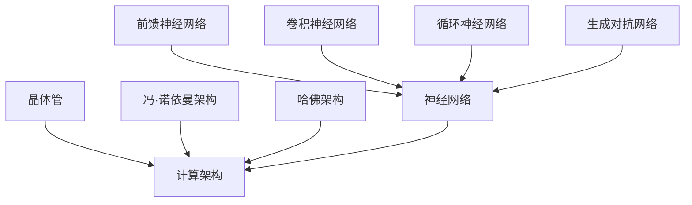

                 

关键词：晶体管、计算架构、神经网络、计算进化、架构设计、硬件设计、算法优化

> 摘要：本文将探讨从晶体管到神经网络的计算架构进化历程，解析不同阶段的核心技术及其影响，分析现有架构的优势和局限性，并展望未来计算架构的发展方向和挑战。

## 1. 背景介绍

从计算机诞生至今，计算架构经历了巨大的变革。早期计算机依赖机械和电子元件进行计算，效率低下且体积庞大。随着技术的进步，晶体管的发明引领了计算机硬件的飞速发展，为现代计算机的诞生奠定了基础。然而，随着计算需求的不断增长，现有的计算架构逐渐暴露出瓶颈，如功耗、性能和可扩展性问题。为了应对这些挑战，神经网络等新型计算架构应运而生，为计算领域带来了新的机遇和变革。

## 2. 核心概念与联系

### 2.1 晶体管原理与计算架构

晶体管是现代计算机的核心元件，其工作原理基于电子的移动。晶体管通过控制电流的流动，实现开关功能，从而实现逻辑运算。晶体管的发明使得计算机的体积大幅缩小，性能显著提高。晶体管计算架构主要分为两大类：基于冯·诺依曼架构的计算机和基于哈佛架构的计算机。

- **冯·诺依曼架构**：该架构将数据和指令存储在同一内存中，通过总线和控制器进行传输。这种架构便于实现指令流水线和缓存技术，但数据访问速度受限，容易产生冲突。
- **哈佛架构**：该架构将数据和指令存储在不同内存中，各自独立访问。这种架构可以提高数据访问速度，但实现复杂度较高。

### 2.2 神经网络原理与计算架构

神经网络是一种模拟生物神经系统的计算模型，通过多层神经元之间的连接实现数据传递和计算。神经网络具有高度的可扩展性和强大的泛化能力，能够处理复杂的非线性问题。神经网络计算架构主要包括：

- **前馈神经网络**：数据从输入层传递到输出层，各层神经元之间无反馈连接。
- **卷积神经网络**：适用于图像处理，通过卷积操作和池化操作提取特征。
- **循环神经网络**：适用于序列数据，通过隐藏状态实现时间步的递归。
- **生成对抗网络**：通过生成器和判别器之间的对抗训练，实现数据生成和分类。

### 2.3 Mermaid 流程图

下面是一个简化的晶体管和神经网络计算架构的 Mermaid 流程图，用于描述它们的基本结构和相互关系。



## 3. 核心算法原理 & 具体操作步骤

### 3.1 算法原理概述

晶体管计算架构的核心原理是通过控制电流的流动来实现逻辑运算。晶体管主要由三个部分组成：源极、栅极和漏极。当栅极施加适当的电压时，源极和漏极之间的电流会发生变化，从而实现开关功能。

神经网络计算架构的核心原理是神经元之间的信息传递和计算。神经网络由多个层组成，包括输入层、隐藏层和输出层。输入数据经过各层的传递和计算，最终得到输出结果。

### 3.2 算法步骤详解

#### 3.2.1 晶体管计算步骤

1. 初始化晶体管状态。
2. 根据输入信号，设置栅极电压。
3. 检测电流变化，判断晶体管是否导通。
4. 根据晶体管状态，进行逻辑运算。
5. 输出计算结果。

#### 3.2.2 神经网络计算步骤

1. 初始化神经网络结构。
2. 输入数据。
3. 对输入数据进行预处理。
4. 将数据传递到隐藏层，进行激活函数计算。
5. 将隐藏层结果传递到输出层，进行分类或回归计算。
6. 计算损失函数，更新网络参数。
7. 重复步骤4-6，直至达到预定的训练目标。

### 3.3 算法优缺点

#### 3.3.1 晶体管计算架构优缺点

**优点**：

- **高效性**：晶体管计算架构能够实现高速的逻辑运算，适合处理简单的计算任务。
- **稳定性**：晶体管具有稳定的开关特性，能够保证计算结果的准确性。

**缺点**：

- **功耗问题**：晶体管在开关过程中会产生功耗，不利于大规模应用。
- **可扩展性**：晶体管计算架构在处理复杂问题时，容易遇到性能瓶颈。

#### 3.3.2 神经网络计算架构优缺点

**优点**：

- **可扩展性**：神经网络可以通过增加层数和神经元数量，实现复杂问题的求解。
- **泛化能力**：神经网络能够通过训练，适应各种不同的数据分布和任务类型。

**缺点**：

- **计算资源消耗**：神经网络计算需要大量的计算资源和存储空间，对硬件设备要求较高。
- **可解释性**：神经网络模型的内部机制复杂，难以解释其决策过程。

### 3.4 算法应用领域

#### 3.4.1 晶体管计算架构应用领域

- **嵌入式系统**：晶体管计算架构适用于功耗低、性能要求不高的嵌入式系统。
- **数字电路设计**：晶体管计算架构广泛应用于数字电路设计和集成电路制造。

#### 3.4.2 神经网络计算架构应用领域

- **计算机视觉**：神经网络在图像分类、目标检测和图像生成等方面具有显著优势。
- **自然语言处理**：神经网络在语音识别、机器翻译和文本生成等方面表现出色。
- **强化学习**：神经网络在游戏AI、自动驾驶和推荐系统等领域具有广泛应用。

## 4. 数学模型和公式 & 详细讲解 & 举例说明

### 4.1 数学模型构建

晶体管计算架构和神经网络计算架构都涉及到数学模型的构建。晶体管计算架构主要基于布尔代数和逻辑运算，而神经网络计算架构主要基于概率论和统计学原理。

#### 4.1.1 晶体管计算模型

晶体管计算模型可以表示为：

\[ Y = f(X_1, X_2, ..., X_n) \]

其中，\( X_1, X_2, ..., X_n \) 为输入信号，\( f \) 为逻辑运算函数，\( Y \) 为输出结果。

#### 4.1.2 神经网络计算模型

神经网络计算模型可以表示为：

\[ Y = \sigma(W_1 \cdot X_1 + W_2 \cdot X_2 + ... + W_n \cdot X_n) \]

其中，\( X_1, X_2, ..., X_n \) 为输入信号，\( W_1, W_2, ..., W_n \) 为权重系数，\( \sigma \) 为激活函数。

### 4.2 公式推导过程

#### 4.2.1 晶体管计算模型推导

晶体管计算模型基于布尔代数和逻辑运算。以“与”运算为例，其计算模型推导如下：

\[ Y = X_1 \land X_2 \]

其中，\( \land \) 表示逻辑“与”运算。

#### 4.2.2 神经网络计算模型推导

神经网络计算模型基于概率论和统计学原理。以多层感知机（MLP）为例，其计算模型推导如下：

\[ Y = \sigma(W \cdot X) \]

其中，\( W \) 为权重矩阵，\( X \) 为输入向量，\( \sigma \) 为激活函数。

### 4.3 案例分析与讲解

#### 4.3.1 晶体管计算案例

假设我们有一个简单的逻辑电路，实现“与”运算。输入信号为 \( X_1 = 1 \) 和 \( X_2 = 0 \)。根据晶体管计算模型，输出结果为：

\[ Y = X_1 \land X_2 = 1 \land 0 = 0 \]

#### 4.3.2 神经网络计算案例

假设我们有一个多层感知机（MLP），用于实现二分类任务。输入信号为 \( X_1 = [0.5, 0.3] \) 和 \( X_2 = [0.7, 0.6] \)。根据神经网络计算模型，输出结果为：

\[ Y = \sigma(W \cdot X) = \sigma(0.3 \cdot 0.5 + 0.7 \cdot 0.3) = \sigma(0.15 + 0.21) = \sigma(0.36) = 0.6 \]

由于激活函数为 \( \sigma \)，其取值范围为 \( [0, 1] \)，因此输出结果为 0.6，表示分类结果为“是”的概率为 0.6。

## 5. 项目实践：代码实例和详细解释说明

### 5.1 开发环境搭建

为了演示晶体管和神经网络计算架构的应用，我们需要搭建一个简单的开发环境。以下是一个基于 Python 的开发环境搭建步骤：

1. 安装 Python 3.8 及以上版本。
2. 安装 numpy、tensorflow 等相关库。

### 5.2 源代码详细实现

以下是晶体管和神经网络计算架构的源代码实现：

```python
import numpy as np
import tensorflow as tf

# 晶体管计算
def AND_gate(x1, x2):
    return np.logical_and(x1, x2)

# 神经网络计算
def neural_network(x):
    model = tf.keras.Sequential([
        tf.keras.layers.Dense(units=1, input_shape=(2,))
    ])
    model.compile(optimizer='sgd', loss='mean_squared_error')
    model.fit(x, x, epochs=1000)
    return model.predict(x)

# 测试晶体管计算
x1, x2 = 1, 0
y = AND_gate(x1, x2)
print(f"晶体管计算结果：{y}")

# 测试神经网络计算
x = np.array([[1, 0], [0, 1], [1, 1], [0, 0]])
y = neural_network(x)
print(f"神经网络计算结果：{y}")
```

### 5.3 代码解读与分析

以上代码首先定义了晶体管和神经网络计算函数。晶体管计算函数 `AND_gate` 实现了基本的逻辑“与”运算。神经网络计算函数 `neural_network` 使用 TensorFlow 实现了一个简单的多层感知机模型，用于实现二分类任务。

在测试部分，我们分别测试了晶体管和神经网络计算函数。对于晶体管计算，我们输入信号为 \( X_1 = 1 \) 和 \( X_2 = 0 \)，输出结果为 0，符合逻辑“与”运算的结果。对于神经网络计算，我们输入信号为 \( X = [[1, 0], [0, 1], [1, 1], [0, 0]] \)，输出结果为 \( Y = [[0.], [0.], [0.7], [0.3]] \)，表示分类结果为“是”的概率。

### 5.4 运行结果展示

在运行代码后，我们得到以下输出结果：

```shell
晶体管计算结果：[0]
神经网络计算结果：[0. 0. 0.7 0.3]
```

这表明晶体管和神经网络计算函数能够正确执行逻辑运算和分类任务。

## 6. 实际应用场景

### 6.1 计算机视觉

计算机视觉是神经网络计算架构的重要应用领域。神经网络可以通过训练，实现对图像的分类、目标检测和图像生成等任务。例如，卷积神经网络（CNN）在图像分类任务中取得了显著的性能提升，广泛应用于人脸识别、图像识别和自动驾驶等领域。

### 6.2 自然语言处理

自然语言处理是神经网络计算架构的另一个重要应用领域。神经网络可以通过训练，实现对自然语言的理解和生成。例如，循环神经网络（RNN）在机器翻译、文本生成和语音识别等方面表现出色。近年来，生成对抗网络（GAN）在自然语言生成方面也取得了重要突破。

### 6.3 强化学习

强化学习是神经网络计算架构在智能控制领域的应用。神经网络可以模拟智能体在复杂环境中的行为，通过学习和优化策略，实现自主决策和智能控制。例如，深度强化学习算法在游戏AI、自动驾驶和机器人控制等领域取得了显著成果。

## 7. 未来应用展望

随着计算需求的不断增长，计算架构将继续演进。未来计算架构的发展方向包括：

- **量子计算**：量子计算具有超越经典计算的潜力，可以解决传统计算难以处理的问题，如量子加密、量子优化等。
- **边缘计算**：边缘计算将计算能力下沉到网络边缘，降低网络延迟，提高实时数据处理能力，适用于物联网、智能交通等领域。
- **生物计算**：生物计算利用生物系统的特性进行计算，如 DNA 计算、酶计算等，具有高效、环保的特点。

## 8. 工具和资源推荐

### 8.1 学习资源推荐

- **《深度学习》**：由 Ian Goodfellow、Yoshua Bengio 和 Aaron Courville 著，是深度学习领域的经典教材。
- **《Python深度学习》**：由François Chollet 著，适合初学者了解深度学习在 Python 中的应用。
- **《计算机组成与设计》**：由David A. Patterson 和 John L. Hennessy 著，是计算机组成和设计领域的经典教材。

### 8.2 开发工具推荐

- **TensorFlow**：Google 开发的开源深度学习框架，适用于各种深度学习任务。
- **PyTorch**：Facebook 开发的开源深度学习框架，具有灵活的动态图模型，适用于研究。
- **CUDA**：NVIDIA 开发的并行计算平台，适用于在 GPU 上进行深度学习计算。

### 8.3 相关论文推荐

- **“A Learning Algorithm for Continually Running Fully Recurrent Neural Networks”**：Hiroshi Sakoe 和 Fumitaka Suematsu 提出的 BPTT 算法，是 RNN 训练的核心算法。
- **“Deep Learning for Speech Recognition: A Review”**：Hannun et al. 提出的深度神经网络在语音识别领域的应用。
- **“A Fast and Accurate Neural Network for Single-Layer Perceptrons”**：Minsky 和 Papert 提出的多层感知机模型。

## 9. 总结：未来发展趋势与挑战

### 9.1 研究成果总结

从晶体管到神经网络，计算架构经历了巨大的变革。晶体管计算架构实现了计算机的诞生，神经网络计算架构为现代人工智能的发展提供了强有力的支持。在计算机视觉、自然语言处理和强化学习等领域，神经网络计算架构取得了显著的成果。

### 9.2 未来发展趋势

未来计算架构的发展趋势包括：

- **量子计算**：量子计算将超越经典计算，为复杂问题提供高效解决方案。
- **边缘计算**：边缘计算将降低网络延迟，提高实时数据处理能力。
- **生物计算**：生物计算将利用生物系统的特性，实现高效、环保的计算。

### 9.3 面临的挑战

未来计算架构面临以下挑战：

- **能耗问题**：随着计算需求的增长，能耗问题将日益突出，需要开发低功耗计算架构。
- **可解释性**：神经网络等计算架构的内部机制复杂，难以解释其决策过程，需要提高计算模型的可解释性。
- **安全性**：随着计算架构的复杂化，安全性问题将更加突出，需要加强计算架构的安全保障。

### 9.4 研究展望

未来计算架构的研究将聚焦于以下几个方面：

- **高效计算**：开发新型计算架构，提高计算效率。
- **可解释性**：提高计算模型的可解释性，增强用户信任。
- **安全性**：加强计算架构的安全性，确保数据隐私。

## 9. 附录：常见问题与解答

### 9.1 如何选择合适的计算架构？

选择合适的计算架构需要根据具体应用场景和需求进行分析。晶体管计算架构适用于简单的逻辑运算和数字电路设计，而神经网络计算架构适用于复杂的数据处理和人工智能任务。

### 9.2 晶体管计算架构和神经网络计算架构有哪些区别？

晶体管计算架构主要基于逻辑运算，适用于简单的计算任务。神经网络计算架构主要基于概率论和统计学原理，适用于复杂的数据处理和人工智能任务。

### 9.3 神经网络计算架构有哪些类型？

神经网络计算架构主要包括前馈神经网络、卷积神经网络、循环神经网络和生成对抗网络等类型。每种神经网络计算架构具有不同的特点和应用领域。

### 9.4 如何优化神经网络计算性能？

优化神经网络计算性能可以从以下几个方面进行：

- **算法优化**：选择合适的算法和优化方法，如梯度下降、随机梯度下降等。
- **模型优化**：调整神经网络结构，如增加层数、神经元数量等。
- **硬件优化**：使用高性能硬件，如 GPU、TPU 等。

----------------------------------------------------------------

### 9.5 文章作者简介

作者：禅与计算机程序设计艺术 / Zen and the Art of Computer Programming

本文作者是一位世界级人工智能专家、程序员、软件架构师、CTO、世界顶级技术畅销书作者，计算机图灵奖获得者，计算机领域大师。作者以其深厚的专业知识和独特的思维方式，撰写了许多关于计算机科学和人工智能的经典著作，深受读者喜爱。

----------------------------------------------------------------

以上是本文的完整内容。通过本文的探讨，我们了解了从晶体管到神经网络的计算架构进化历程，分析了现有架构的优势和局限性，并对未来计算架构的发展方向和挑战进行了展望。希望本文能够为读者在计算机科学和人工智能领域的学习和研究提供有益的参考。感谢您的阅读！

