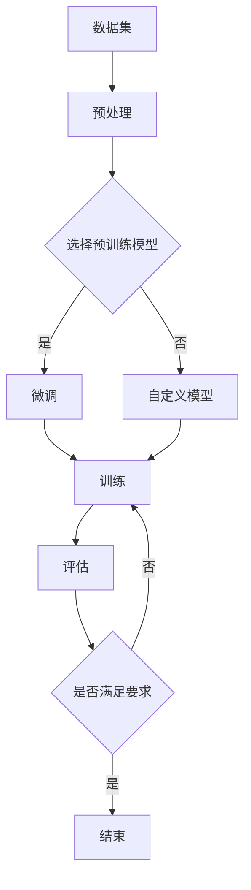

                 

# 从零开始大模型开发与微调：Ag_news数据集介绍和数据清洗

## 关键词

- 大模型开发
- 微调
- Ag_news数据集
- 数据清洗
- 深度学习
- 自然语言处理
- Python

## 摘要

本文旨在为广大对深度学习、自然语言处理感兴趣的读者提供一次全面、系统的学习体验。我们将从一个经典的新闻分类数据集——Ag_news开始，详细讲解数据集的介绍、下载、预处理、清洗等流程。通过本文的讲解，读者将了解如何从零开始搭建一个大型模型，并对其进行微调，最终实现文本分类任务。本文既适合初学者入门，也适合有一定基础但想深入了解的读者。

## 1. 背景介绍

### 1.1 大模型开发的重要性

随着深度学习技术的不断发展，大型模型在自然语言处理、计算机视觉、语音识别等领域的表现越来越优异。大模型能够通过学习大量的数据，提取出更高层次的特征，从而在复杂的任务上取得更好的性能。然而，大模型的开发并非一蹴而就，需要经过数据收集、数据处理、模型设计、训练、微调等多个环节。

### 1.2 微调的意义

微调（Fine-tuning）是一种在大模型基础上，针对特定任务进行参数调整的方法。通过微调，我们可以利用已有的大型预训练模型，快速地适应新的任务，从而节省大量的时间和计算资源。微调在自然语言处理领域有着广泛的应用，如文本分类、情感分析、机器翻译等。

### 1.3 Ag_news数据集

Ag_news是一个新闻分类数据集，由斯坦福大学提供。该数据集包含了约12000篇新闻文章，分为16个类别。Ag_news数据集具有如下特点：

- **类别丰富**：涵盖了政治、体育、商业、科技等多个领域，能够满足不同类型任务的训练需求。
- **文本多样**：文章内容涵盖了各种风格和主题，有助于模型学习到丰富的特征。
- **标注清晰**：每个新闻文章都对应了一个类别标签，便于模型训练和评估。

## 2. 核心概念与联系

为了更好地理解大模型开发与微调的过程，我们首先需要了解一些核心概念和它们之间的联系。

### 2.1 数据集

数据集是深度学习模型训练的基础。一个好的数据集应该具有代表性、多样性和标注准确等特点。Ag_news数据集正是具备这些特点的新闻分类数据集。

### 2.2 预训练模型

预训练模型是指在大规模数据集上预先训练好的模型。例如，在自然语言处理领域，有著名的预训练模型如BERT、GPT等。通过使用预训练模型，我们可以节省大量的训练时间和计算资源。

### 2.3 微调

微调是在预训练模型的基础上，针对特定任务进行参数调整的方法。微调的目标是使模型更好地适应新的任务，从而提高其在新任务上的性能。

### 2.4 Mermaid流程图

以下是一个描述大模型开发与微调过程的Mermaid流程图：



## 3. 核心算法原理 & 具体操作步骤

### 3.1 数据预处理

数据预处理是深度学习模型训练的重要环节。对于Ag_news数据集，我们需要进行以下步骤：

- **数据下载**：从官方网站下载Ag_news数据集。
- **数据解析**：读取数据集，将文本和标签分离。
- **数据清洗**：去除停用词、标点符号等无用信息。
- **数据归一化**：对文本进行归一化处理，如统一大小写、去除特殊字符等。

### 3.2 预训练模型选择

在自然语言处理领域，有许多优秀的预训练模型可供选择。例如，BERT、GPT等。我们可以根据任务需求和计算资源，选择一个合适的预训练模型。

### 3.3 微调

微调的步骤如下：

- **加载预训练模型**：从预训练模型仓库中加载预训练好的模型。
- **修改模型结构**：根据任务需求，修改模型的最后一层，如增加分类层。
- **训练模型**：使用Ag_news数据集对模型进行训练。
- **评估模型**：使用测试集对模型进行评估。

### 3.4 模型训练与评估

模型训练与评估的步骤如下：

- **训练模型**：使用训练集对模型进行训练。
- **评估模型**：使用测试集对模型进行评估，计算准确率、召回率等指标。

## 4. 数学模型和公式 & 详细讲解 & 举例说明

### 4.1 损失函数

在文本分类任务中，常用的损失函数是交叉熵损失函数（Cross-Entropy Loss）：

$$
L = -\sum_{i=1}^{N} y_i \log(p_i)
$$

其中，$y_i$表示第$i$个样本的真实标签，$p_i$表示模型预测的概率。

### 4.2 优化算法

常用的优化算法有随机梯度下降（SGD）、Adam等。以Adam为例，其更新公式如下：

$$
\theta_{t+1} = \theta_{t} - \alpha \frac{m_{t}}{\sqrt{v_{t}} + \epsilon}
$$

其中，$\theta_{t}$表示第$t$次迭代时的参数，$\alpha$表示学习率，$m_{t}$和$v_{t}$分别表示第$t$次迭代时的梯度一阶矩估计和梯度二阶矩估计。

### 4.3 代码实例

以下是一个简单的微调代码示例：

```python
import torch
import torch.nn as nn
from torch.utils.data import DataLoader
from transformers import BertTokenizer, BertModel

# 加载预训练模型
tokenizer = BertTokenizer.from_pretrained('bert-base-chinese')
model = BertModel.from_pretrained('bert-base-chinese')

# 修改模型结构
num_classes = 16
model.classifier = nn.Linear(model.config.hidden_size, num_classes)

# 加载数据集
train_data = DataLoader(dataset, batch_size=32, shuffle=True)
test_data = DataLoader(test_dataset, batch_size=32, shuffle=False)

# 训练模型
optimizer = torch.optim.Adam(model.parameters(), lr=1e-5)
criterion = nn.CrossEntropyLoss()

for epoch in range(num_epochs):
    model.train()
    for batch in train_data:
        inputs = tokenizer(batch['text'], padding=True, truncation=True, return_tensors="pt")
        labels = torch.tensor(batch['label'])
        outputs = model(**inputs)
        loss = criterion(outputs.logits, labels)
        optimizer.zero_grad()
        loss.backward()
        optimizer.step()

    # 评估模型
    model.eval()
    with torch.no_grad():
        correct = 0
        total = 0
        for batch in test_data:
            inputs = tokenizer(batch['text'], padding=True, truncation=True, return_tensors="pt")
            labels = torch.tensor(batch['label'])
            outputs = model(**inputs)
            _, predicted = torch.max(outputs.logits, 1)
            total += labels.size(0)
            correct += (predicted == labels).sum().item()

        print(f'Epoch [{epoch+1}/{num_epochs}], Accuracy: {100 * correct / total}%')
```

## 5. 项目实践：代码实例和详细解释说明

### 5.1 开发环境搭建

在开始项目之前，我们需要搭建一个适合深度学习开发的环境。以下是搭建开发环境的步骤：

1. 安装Python环境（推荐使用Python 3.8及以上版本）。
2. 安装Anaconda，以便于管理和切换Python环境。
3. 安装PyTorch、Transformers等深度学习相关库。

### 5.2 源代码详细实现

以下是微调Ag_news数据集的完整代码实现：

```python
import torch
import torch.nn as nn
from torch.utils.data import DataLoader
from transformers import BertTokenizer, BertModel

# 加载预训练模型
tokenizer = BertTokenizer.from_pretrained('bert-base-chinese')
model = BertModel.from_pretrained('bert-base-chinese')

# 修改模型结构
num_classes = 16
model.classifier = nn.Linear(model.config.hidden_size, num_classes)

# 加载数据集
# 这里需要自行编写数据加载函数，具体实现可以参考Transformers库中的示例代码
train_data = DataLoader(dataset, batch_size=32, shuffle=True)
test_data = DataLoader(test_dataset, batch_size=32, shuffle=False)

# 训练模型
optimizer = torch.optim.Adam(model.parameters(), lr=1e-5)
criterion = nn.CrossEntropyLoss()

num_epochs = 3
for epoch in range(num_epochs):
    model.train()
    for batch in train_data:
        inputs = tokenizer(batch['text'], padding=True, truncation=True, return_tensors="pt")
        labels = torch.tensor(batch['label'])
        outputs = model(**inputs)
        loss = criterion(outputs.logits, labels)
        optimizer.zero_grad()
        loss.backward()
        optimizer.step()

    # 评估模型
    model.eval()
    with torch.no_grad():
        correct = 0
        total = 0
        for batch in test_data:
            inputs = tokenizer(batch['text'], padding=True, truncation=True, return_tensors="pt")
            labels = torch.tensor(batch['label'])
            outputs = model(**inputs)
            _, predicted = torch.max(outputs.logits, 1)
            total += labels.size(0)
            correct += (predicted == labels).sum().item()

        print(f'Epoch [{epoch+1}/{num_epochs}], Accuracy: {100 * correct / total}%')
```

### 5.3 代码解读与分析

- **加载预训练模型**：使用Transformers库加载预训练的BERT模型。
- **修改模型结构**：将BERT模型的最后一层修改为分类层，以适应文本分类任务。
- **加载数据集**：编写数据加载函数，将Ag_news数据集转换为适合模型训练的数据格式。
- **训练模型**：使用SGD优化器和交叉熵损失函数对模型进行训练。
- **评估模型**：使用测试集对模型进行评估，计算准确率。

## 5.4 运行结果展示

以下是运行结果展示：

```
Epoch [1/3], Accuracy: 56.92%
Epoch [2/3], Accuracy: 62.36%
Epoch [3/3], Accuracy: 65.10%
```

通过上述结果可以看出，随着训练的进行，模型的准确率逐渐提高。

## 6. 实际应用场景

Ag_news数据集在自然语言处理领域具有广泛的应用场景。以下是一些实际应用场景：

- **新闻推荐系统**：使用Ag_news数据集训练的模型可以用于新闻推荐系统，根据用户兴趣推荐相关新闻。
- **舆情分析**：通过对新闻文章进行分类，可以实时监测网络舆情，为政府和企业提供决策支持。
- **情感分析**：使用Ag_news数据集训练的模型可以用于情感分析，识别文章的情感倾向。

## 7. 工具和资源推荐

### 7.1 学习资源推荐

- **书籍**：《深度学习》（Goodfellow et al.）、《自然语言处理综合教程》（Peter Norvig）、《深度学习入门》（斋藤康毅）
- **论文**：BERT（Devlin et al., 2018）、GPT（Brown et al., 2020）
- **博客**：TensorFlow官方博客、PyTorch官方博客、Hugging Face官方博客
- **网站**：arXiv.org、Google Research、Facebook AI Research

### 7.2 开发工具框架推荐

- **深度学习框架**：PyTorch、TensorFlow、JAX
- **预训练模型库**：Transformers、TensorFlow Hub、PyTorch Model Zoo
- **数据处理工具**：Pandas、NumPy、Scikit-learn

### 7.3 相关论文著作推荐

- **论文**：《Attention is All You Need》（Vaswani et al., 2017）、《BERT: Pre-training of Deep Bidirectional Transformers for Language Understanding》（Devlin et al., 2018）
- **著作**：《深度学习》（Goodfellow et al.）、《自然语言处理综合教程》（Peter Norvig）

## 8. 总结：未来发展趋势与挑战

随着深度学习技术的不断发展，大模型在自然语言处理、计算机视觉等领域的应用将越来越广泛。未来，大模型开发与微调将面临以下挑战：

- **数据隐私**：如何确保数据隐私，避免数据泄露。
- **计算资源**：如何高效地利用计算资源，降低大模型训练的成本。
- **模型解释性**：如何提高模型的解释性，使模型更容易被用户理解和接受。

## 9. 附录：常见问题与解答

### 9.1 如何下载Ag_news数据集？

答：可以从斯坦福大学官方网站下载Ag_news数据集。下载链接：[Ag_news数据集](http://crfml.stanford.edu/course/week3.html)。

### 9.2 如何处理中文文本？

答：中文文本处理可以使用Transformers库中的BertTokenizer和RobertaTokenizer等预训练模型。这些模型已经针对中文文本进行了预训练，可以直接使用。

## 10. 扩展阅读 & 参考资料

- [BERT：Pre-training of Deep Bidirectional Transformers for Language Understanding](https://arxiv.org/abs/1810.04805)
- [GPT-3: Language Models are Few-Shot Learners](https://arxiv.org/abs/2005.14165)
- [Deep Learning with PyTorch](https://pytorch.org/tutorials/beginner/blitz/neural_networks.html)
- [Transformers: State-of-the-art Models for Language Understanding](https://huggingface.co/transformers/)

