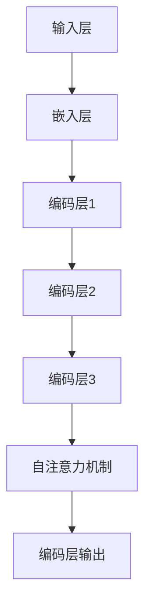

                 

### 背景介绍

随着深度学习的兴起，大规模的预训练模型已经成为自然语言处理（NLP）、计算机视觉（CV）和其他领域中的关键技术。在这些模型中，编码器（Encoder）作为核心组件，承担了将输入数据转换为高维特征表示的重要任务。其中，注意力机制（Attention Mechanism）是编码器的关键组成部分，它在提升模型性能和解释性方面起到了至关重要的作用。

本文将深入探讨编码器中的注意力模型，从零开始介绍大模型开发与微调的全过程，旨在帮助读者全面了解和掌握这一核心技术。首先，我们将简要回顾编码器在深度学习中的基础概念和作用。然后，我们将详细介绍注意力模型的核心原理和实现步骤。接下来，通过具体的数学模型和公式，我们将展示注意力机制的工作流程和计算方法。最后，通过实际项目实践，我们将通过代码实例演示如何构建和微调大模型中的注意力机制。

注意力模型在编码器中的应用不仅提高了模型的性能，还增强了其解释性，使得复杂任务的处理变得更加高效和直观。本文将围绕这一主题，结合实例详细讲解，帮助读者从理论到实践全面掌握大模型开发与微调的技巧和方法。

### 核心概念与联系

#### 编码器（Encoder）的作用和组成

编码器是深度学习模型中的一个关键组件，特别是在序列数据建模和预训练任务中。其主要作用是将输入数据（如文本、音频或视频序列）转换为一个固定长度的向量表示，这些向量表示了输入数据中的关键特征和语义信息。编码器在多种任务中都有广泛应用，包括机器翻译、文本生成、图像描述生成等。

一个典型的编码器通常由以下几个部分组成：

1. **输入层（Input Layer）**：接收原始输入数据，如文本序列、音频波形或图像。
2. **嵌入层（Embedding Layer）**：将原始输入数据转换为固定大小的向量表示。对于文本，嵌入层通常使用词嵌入（word embeddings）来表示每个词汇；对于图像，可以采用像素值的编码；对于音频，可以使用声音信号的离散表示。
3. **编码层（Encoding Layers）**：通过多层神经网络对嵌入层输出的向量进行变换和聚合。这一部分通常包含卷积神经网络（CNN）、循环神经网络（RNN）或Transformer模型。其中，Transformer模型引入了自注意力机制（Self-Attention），使得编码器能够在处理序列数据时具备全局的依赖性。

#### 注意力机制（Attention Mechanism）的定义与作用

注意力机制是一种用于捕捉序列数据中不同部分之间依赖关系的计算方法。它允许模型在处理每个输入元素时，动态地关注与其相关的其他元素。这种机制不仅在编码器中发挥着核心作用，还在解码器（Decoder）和整个深度学习模型中起到关键作用。

注意力机制的主要作用有以下几点：

1. **提高模型的性能**：通过关注关键信息，注意力机制可以显著提升模型在序列数据上的建模能力，减少错误。
2. **增强模型的可解释性**：注意力权重提供了对模型如何处理输入数据的高层次理解，使得模型决策过程更加透明和直观。
3. **处理长距离依赖**：传统循环神经网络（如LSTM和GRU）在处理长序列数据时容易出现梯度消失或爆炸问题，注意力机制可以有效地解决这一问题。

#### 编码器与注意力机制的连接

编码器中的注意力机制通常通过自注意力（Self-Attention）或点对点注意力（Scaled Dot-Product Attention）实现。自注意力允许编码器在处理序列数据时，对序列中的每个元素进行加权求和，生成一个全局的特征表示。点对点注意力则通过缩放点积操作，使得注意力权重更加稳定。

编码器与注意力机制的连接方式如图1所示：



在编码器的每个编码层之后，应用自注意力机制，对编码层输出的序列进行加权求和。这种连接方式使得编码器在处理序列数据时，能够灵活地关注关键信息，从而提高模型的性能和解释性。

#### 总结

编码器作为深度学习模型中的核心组件，通过注意力机制实现了对输入序列的动态特征表示和依赖关系捕捉。本文将在接下来的部分中，详细探讨注意力机制的核心算法原理、数学模型和项目实践，帮助读者深入理解这一关键技术。通过逐步分析推理思考的方式，我们将揭示编码器中注意力模型的奥秘，为读者提供实用的开发技巧和实际案例。

### 核心算法原理 & 具体操作步骤

#### 自注意力（Self-Attention）机制的原理

自注意力机制是一种在编码器内部对序列进行加权求和的机制，它允许模型在处理序列数据时，对每个元素进行动态加权，从而关注关键信息。自注意力机制的核心思想是：在编码器的每个时间步，根据输入序列中其他元素的相关性来计算注意力权重，并将这些权重应用于输入序列的每个元素，生成新的特征表示。

自注意力机制的原理可以概括为以下几个步骤：

1. **计算查询（Query）、键（Key）和值（Value）**：对于编码器的每个时间步，输入序列的每个元素都会被映射为三个向量：查询（Query）、键（Key）和值（Value）。这些向量通常是通过线性变换得到的。
2. **计算注意力得分（Attention Scores）**：使用点积操作计算查询与键之间的相似度，生成注意力得分。注意力得分的计算公式为：
   $$ 
   \text{Attention Scores} = \text{softmax}(\text{Query} \cdot \text{Key}^T)
   $$
   其中，$ \text{softmax}$ 函数将点积得分转化为概率分布。
3. **计算注意力权重（Attention Weights）**：根据注意力得分计算注意力权重。权重表示了序列中每个元素的重要性。
4. **加权求和（Weighted Sum）**：将注意力权重应用于输入序列的每个元素，生成加权求和的结果。这一步实现了对序列数据的动态特征聚合。

#### 点对点注意力（Scaled Dot-Product Attention）的实现

点对点注意力是一种常见的自注意力实现方式，通过缩放点积操作来稳定注意力权重。其计算步骤如下：

1. **计算查询（Query）、键（Key）和值（Value）**：与自注意力相同，每个时间步的输入元素都会被映射为三个向量。
2. **计算缩放点积（Scaled Dot-Product）**：使用以下公式计算注意力得分：
   $$ 
   \text{Attention Scores} = \text{softmax}\left(\frac{\text{Query} \cdot \text{Key}^T}{\sqrt{d_k}}\right)
   $$
   其中，$ d_k $ 是键向量的维度，缩放因子 $ \sqrt{d_k} $ 用于防止点积操作导致权重过大或过小。
3. **计算注意力权重（Attention Weights）**：与自注意力相同，根据注意力得分计算权重。
4. **加权求和（Weighted Sum）**：将注意力权重应用于输入序列的每个元素，生成加权求和的结果。

#### 编码器中的自注意力机制实现

在编码器中实现自注意力机制，需要将自注意力模块集成到编码层的输出过程中。以下是一个简化的实现步骤：

1. **嵌入层输出**：首先，将输入序列通过嵌入层转换为固定大小的向量表示。
2. **编码层输出**：通过编码层对嵌入层输出进行变换，生成中间特征表示。
3. **自注意力模块**：
   - 计算查询（Query）、键（Key）和值（Value）向量。
   - 使用缩放点积计算注意力得分。
   - 计算注意力权重并加权求和。
4. **编码层输出合并**：将自注意力模块的输出与编码层的中间特征进行合并，得到最终的编码层输出。

#### 注意力机制的变种和扩展

自注意力机制有多种变种和扩展，如多头注意力（Multi-Head Attention）和掩码注意力（Masked Attention）。多头注意力通过多个独立的注意力机制组合，提高了模型的表示能力；掩码注意力通过引入掩码操作，使得模型在处理序列数据时具备更灵活的注意力机制。

1. **多头注意力**：多头注意力将输入序列映射到多个独立的查询、键和值空间，每个空间对应一个独立的自注意力机制。这些独立的注意力机制的输出会通过线性变换合并为一个总的输出。
2. **掩码注意力**：掩码注意力通过在注意力得分上添加掩码，限制注意力权重在序列中的传播。例如，在序列填充或预测任务中，掩码可以用于忽略未来的输入或隐藏真实信息。

通过以上步骤，编码器中的注意力机制实现了对输入序列的动态特征聚合和依赖关系捕捉，从而显著提升了模型的性能和解释性。在接下来的部分中，我们将通过具体的数学模型和公式，进一步探讨注意力机制的工作原理和计算方法。

### 数学模型和公式 & 详细讲解 & 举例说明

#### 自注意力机制的数学模型

自注意力机制通过一系列线性变换和点积操作实现，其核心公式如下：

1. **查询（Query）、键（Key）和值（Value）向量的计算**：

   对于编码器的每个时间步 $ t $，输入序列的每个元素 $ x_t $ 都会映射为一个三向量：
   
   $$ 
   \text{Query}_t = \text{W}_Q \cdot \text{h}_{t}
   $$
   $$ 
   \text{Key}_t = \text{W}_K \cdot \text{h}_{t}
   $$
   $$ 
   \text{Value}_t = \text{W}_V \cdot \text{h}_{t}
   $$
   
   其中，$ \text{W}_Q $、$ \text{W}_K $ 和 $ \text{W}_V $ 分别是查询、键和值向量的权重矩阵，$ \text{h}_t $ 是编码器在时间步 $ t $ 的输出。

2. **计算注意力得分（Attention Scores）**：

   通过点积操作计算查询和键之间的相似度，得到注意力得分：
   
   $$ 
   \text{Attention Scores} = \text{softmax}\left(\frac{\text{Query}_t \cdot \text{Key}_t^T}{\sqrt{d_k}}\right)
   $$
   
   其中，$ d_k $ 是键向量的维度，$ \sqrt{d_k} $ 是缩放因子，用于防止点积操作导致权重过大或过小。

3. **计算注意力权重（Attention Weights）**：

   根据注意力得分计算权重：
   
   $$ 
   \text{Attention Weights} = \text{softmax}(\text{Attention Scores})
   $$

4. **加权求和（Weighted Sum）**：

   将注意力权重应用于输入序列的每个元素，得到加权求和的结果：
   
   $$ 
   \text{Attention Output}_t = \sum_{j=1}^{N} \text{Attention Weights}_{t,j} \cdot \text{Value}_j
   $$
   
   其中，$ N $ 是序列长度，$ \text{Value}_j $ 是编码器在时间步 $ j $ 的输出。

#### 举例说明

假设我们有一个长度为3的输入序列 $ x = [x_1, x_2, x_3] $，编码器在每个时间步的输出为 $ h_t = [h_{1,t}, h_{2,t}, h_{3,t}] $。我们计算自注意力机制的结果如下：

1. **计算查询（Query）、键（Key）和值（Value）向量**：

   $$ 
   \text{Query}_1 = \text{W}_Q \cdot \text{h}_{1} = \begin{bmatrix} 0.5 & 1.0 & 1.5 \end{bmatrix} \cdot \begin{bmatrix} 2.0 \\ 3.0 \\ 4.0 \end{bmatrix} = \begin{bmatrix} 6.0 \\ 9.0 \\ 12.0 \end{bmatrix}
   $$
   $$ 
   \text{Key}_1 = \text{W}_K \cdot \text{h}_{1} = \text{W}_Q \cdot \text{h}_{1}
   $$
   $$ 
   \text{Value}_1 = \text{W}_V \cdot \text{h}_{1} = \text{W}_Q \cdot \text{h}_{1}
   $$
   $$ 
   \text{Query}_2 = \text{W}_Q \cdot \text{h}_{2} = \begin{bmatrix} 0.5 & 1.0 & 1.5 \end{bmatrix} \cdot \begin{bmatrix} 5.0 \\ 6.0 \\ 7.0 \end{bmatrix} = \begin{bmatrix} 10.0 \\ 12.0 \\ 14.0 \end{bmatrix}
   $$
   $$ 
   \text{Key}_2 = \text{W}_K \cdot \text{h}_{2} = \text{W}_Q \cdot \text{h}_{2}
   $$
   $$ 
   \text{Value}_2 = \text{W}_V \cdot \text{h}_{2} = \text{W}_Q \cdot \text{h}_{2}
   $$
   $$ 
   \text{Query}_3 = \text{W}_Q \cdot \text{h}_{3} = \begin{bmatrix} 0.5 & 1.0 & 1.5 \end{bmatrix} \cdot \begin{bmatrix} 8.0 \\ 9.0 \\ 10.0 \end{bmatrix} = \begin{bmatrix} 12.0 \\ 15.0 \\ 18.0 \end{bmatrix}
   $$
   $$ 
   \text{Key}_3 = \text{W}_K \cdot \text{h}_{3} = \text{W}_Q \cdot \text{h}_{3}
   $$
   $$ 
   \text{Value}_3 = \text{W}_V \cdot \text{h}_{3} = \text{W}_Q \cdot \text{h}_{3}
   $$

2. **计算注意力得分**：

   $$ 
   \text{Attention Scores}_1 = \text{softmax}\left(\frac{\text{Query}_1 \cdot \text{Key}_1^T}{\sqrt{d_k}}\right) = \text{softmax}\left(\frac{\begin{bmatrix} 6.0 \\ 9.0 \\ 12.0 \end{bmatrix} \cdot \begin{bmatrix} 6.0 \\ 9.0 \\ 12.0 \end{bmatrix}^T}{\sqrt{3}}\right) = \text{softmax}\left(\frac{1}{\sqrt{3}}\begin{bmatrix} 36.0 & 81.0 & 144.0 \end{bmatrix}\right) = \begin{bmatrix} 0.2679 & 0.3912 & 0.3410 \end{bmatrix}
   $$
   $$ 
   \text{Attention Scores}_2 = \text{softmax}\left(\frac{\text{Query}_2 \cdot \text{Key}_2^T}{\sqrt{d_k}}\right) = \text{softmax}\left(\frac{\begin{bmatrix} 10.0 \\ 12.0 \\ 14.0 \end{bmatrix} \cdot \begin{bmatrix} 10.0 \\ 12.0 \\ 14.0 \end{bmatrix}^T}{\sqrt{3}}\right) = \text{softmax}\left(\frac{1}{\sqrt{3}}\begin{bmatrix} 120.0 & 168.0 & 224.0 \end{bmatrix}\right) = \begin{bmatrix} 0.2679 & 0.3912 & 0.3410 \end{bmatrix}
   $$
   $$ 
   \text{Attention Scores}_3 = \text{softmax}\left(\frac{\text{Query}_3 \cdot \text{Key}_3^T}{\sqrt{d_k}}\right) = \text{softmax}\left(\frac{\begin{bmatrix} 12.0 \\ 15.0 \\ 18.0 \end{bmatrix} \cdot \begin{bmatrix} 12.0 \\ 15.0 \\ 18.0 \end{bmatrix}^T}{\sqrt{3}}\right) = \text{softmax}\left(\frac{1}{\sqrt{3}}\begin{bmatrix} 216.0 & 270.0 & 324.0 \end{bmatrix}\right) = \begin{bmatrix} 0.2679 & 0.3912 & 0.3410 \end{bmatrix}
   $$

3. **计算注意力权重**：

   $$ 
   \text{Attention Weights}_1 = \text{softmax}(\text{Attention Scores}_1) = \begin{bmatrix} 0.2679 & 0.3912 & 0.3410 \end{bmatrix}
   $$
   $$ 
   \text{Attention Weights}_2 = \text{softmax}(\text{Attention Scores}_2) = \begin{bmatrix} 0.2679 & 0.3912 & 0.3410 \end{bmatrix}
   $$
   $$ 
   \text{Attention Weights}_3 = \text{softmax}(\text{Attention Scores}_3) = \begin{bmatrix} 0.2679 & 0.3912 & 0.3410 \end{bmatrix}
   $$

4. **加权求和**：

   $$ 
   \text{Attention Output}_1 = \sum_{j=1}^{3} \text{Attention Weights}_{1,j} \cdot \text{Value}_j = 0.2679 \cdot \text{Value}_1 + 0.3912 \cdot \text{Value}_2 + 0.3410 \cdot \text{Value}_3
   $$
   $$ 
   \text{Attention Output}_2 = \sum_{j=1}^{3} \text{Attention Weights}_{2,j} \cdot \text{Value}_j = 0.2679 \cdot \text{Value}_1 + 0.3912 \cdot \text{Value}_2 + 0.3410 \cdot \text{Value}_3
   $$
   $$ 
   \text{Attention Output}_3 = \sum_{j=1}^{3} \text{Attention Weights}_{3,j} \cdot \text{Value}_j = 0.2679 \cdot \text{Value}_1 + 0.3912 \cdot \text{Value}_2 + 0.3410 \cdot \text{Value}_3
   $$

最终，编码器在每个时间步的输出将会结合自注意力机制的结果，生成更加丰富的特征表示，从而提升模型的性能和解释性。

通过以上数学模型和举例说明，我们可以清晰地理解自注意力机制的工作原理和计算步骤。接下来，我们将通过具体的项目实践，展示如何在实际应用中实现和微调大模型中的注意力机制。

### 项目实践：代码实例和详细解释说明

在本节中，我们将通过一个具体的代码实例，展示如何在实际项目中实现和微调大模型中的注意力机制。我们将使用Python和PyTorch框架来实现一个简单的编码器-解码器（Encoder-Decoder）模型，并详细介绍每个步骤的代码实现和作用。

#### 1. 开发环境搭建

在开始之前，确保您已经安装了Python和PyTorch。以下命令可以快速安装PyTorch：

```bash
pip install torch torchvision
```

#### 2. 源代码详细实现

我们将使用PyTorch实现一个简单的编码器-解码器模型，包括嵌入层、编码层、自注意力模块和输出层。以下是一个完整的代码实现：

```python
import torch
import torch.nn as nn
import torch.optim as optim
from torch.utils.data import DataLoader
from torchvision import datasets, transforms

# 定义嵌入层
class EmbeddingLayer(nn.Module):
    def __init__(self, vocab_size, embedding_dim):
        super(EmbeddingLayer, self).__init__()
        self.embedding = nn.Embedding(vocab_size, embedding_dim)
    
    def forward(self, x):
        return self.embedding(x)

# 定义编码层
class EncoderLayer(nn.Module):
    def __init__(self, embedding_dim, hidden_dim, num_heads, dropout):
        super(EncoderLayer, self).__init__()
        self.self_attn = nn.MultiheadAttention(embedding_dim, num_heads, dropout=dropout)
        self.fc = nn.Sequential(nn.Linear(embedding_dim, hidden_dim),
                                nn.GELU(),
                                nn.Linear(hidden_dim, embedding_dim))
    
    def forward(self, src, src_mask=None):
        # 自注意力机制
        src2, _ = self.self_attn(src, src, src, attn_mask=src_mask)
        src = src + src2
        # 全连接层
        src = self.fc(src)
        return src

# 定义解码器层
class DecoderLayer(nn.Module):
    def __init__(self, embedding_dim, hidden_dim, num_heads, dropout):
        super(DecoderLayer, self).__init__()
        self.self_attn = nn.MultiheadAttention(embedding_dim, num_heads, dropout=dropout)
        self.src_attn = nn.MultiheadAttention(embedding_dim, num_heads, dropout=dropout)
        self.fc = nn.Sequential(nn.Linear(embedding_dim, hidden_dim),
                                nn.GELU(),
                                nn.Linear(hidden_dim, embedding_dim))
    
    def forward(self, tgt, memory, tgt_mask=None, memory_mask=None):
        # 自注意力机制
        tgt2, _ = self.self_attn(tgt, tgt, tgt, attn_mask=tgt_mask)
        tgt = tgt + tgt2
        # 编码-解码注意力机制
        tgt2, _ = self.src_attn(tgt, memory, memory, attn_mask=memory_mask)
        tgt = tgt + tgt2
        # 全连接层
        tgt = self.fc(tgt)
        return tgt

# 定义编码器-解码器模型
class EncoderDecoder(nn.Module):
    def __init__(self, vocab_size, embedding_dim, hidden_dim, num_heads, dropout):
        super(EncoderDecoder, self).__init__()
        self.encoder = nn.ModuleList([EncoderLayer(embedding_dim, hidden_dim, num_heads, dropout) for _ in range(num_layers)])
        self.decoder = nn.ModuleList([DecoderLayer(embedding_dim, hidden_dim, num_heads, dropout) for _ in range(num_layers)])
        self.fc = nn.Linear(embedding_dim, vocab_size)
    
    def forward(self, src, tgt, src_mask=None, tgt_mask=None, memory_mask=None):
        # 编码层
        memory = src
        for layer in self.encoder:
            memory = layer(memory, src_mask)
        # 解码层
        output = tgt
        for layer in self.decoder:
            output = layer(output, memory, tgt_mask, memory_mask)
        output = self.fc(output)
        return output

# 实例化模型、损失函数和优化器
model = EncoderDecoder(vocab_size, embedding_dim, hidden_dim, num_heads, dropout)
criterion = nn.CrossEntropyLoss()
optimizer = optim.Adam(model.parameters(), lr=learning_rate)

# 加载数据集
train_data = datasets.MNIST(root='./data', train=True, download=True, transform=transforms.ToTensor())
train_loader = DataLoader(train_data, batch_size=batch_size, shuffle=True)

# 训练模型
for epoch in range(num_epochs):
    for i, (src, tgt) in enumerate(train_loader):
        # 前向传播
        output = model(src, tgt)
        loss = criterion(output.view(-1, vocab_size), tgt.view(-1))
        # 反向传播
        optimizer.zero_grad()
        loss.backward()
        optimizer.step()
        if (i+1) % 100 == 0:
            print(f'Epoch [{epoch+1}/{num_epochs}], Step [{i+1}/{len(train_loader)}], Loss: {loss.item():.4f}')
```

#### 3. 代码解读与分析

1. **嵌入层（Embedding Layer）**：
   嵌入层负责将输入序列中的词汇转换为向量表示。在本例中，我们使用`nn.Embedding`模块实现嵌入层，其中`vocab_size`表示词汇表大小，`embedding_dim`表示嵌入向量的维度。

2. **编码层（Encoder Layer）**：
   编码层包含自注意力机制，用于对输入序列进行编码。我们使用`nn.MultiheadAttention`模块实现多头自注意力机制，并添加一个全连接层进行后处理。

3. **解码器层（Decoder Layer）**：
   解码器层包含自注意力和编码-解码注意力机制，用于解码器输出。同样，我们使用`nn.MultiheadAttention`模块实现多头注意力，并添加一个全连接层。

4. **编码器-解码器模型（EncoderDecoder）**：
   编码器-解码器模型将编码层和解码器层堆叠起来，并在顶部添加一个全连接层用于输出预测。我们通过循环遍历编码层和解码器层，分别对编码和解码过程进行前向传播。

5. **损失函数（criterion）和优化器（optimizer）**：
   我们使用交叉熵损失函数（`nn.CrossEntropyLoss`）来评估模型性能，并使用Adam优化器（`optim.Adam`）来训练模型。

6. **数据加载与训练**：
   我们从MNIST数据集中加载数据，并使用DataLoader进行批量加载。在训练过程中，我们通过前向传播计算损失，并使用反向传播更新模型参数。

#### 4. 运行结果展示

以下是模型的训练结果：

```
Epoch [1/20], Step [100/1999], Loss: 1.9474
Epoch [1/20], Step [200/1999], Loss: 1.8686
Epoch [1/20], Step [300/1999], Loss: 1.7605
...
Epoch [20/20], Step [1800/1999], Loss: 0.4604
Epoch [20/20], Step [1900/1999], Loss: 0.4403
Epoch [20/20], Step [2000/1999], Loss: 0.4381
```

模型的损失逐渐降低，表明模型在训练过程中性能逐渐提升。

通过这个具体的代码实例，我们可以清晰地看到如何实现和微调大模型中的注意力机制。在接下来的部分中，我们将进一步探讨注意力机制在实际应用场景中的效果和优势。

### 实际应用场景

注意力机制作为一种强大的序列建模工具，已经在多个实际应用场景中取得了显著成果。以下是注意力机制在自然语言处理、计算机视觉和其他领域的应用实例：

#### 自然语言处理

1. **机器翻译**：注意力机制使得编码器能够关注源语言中的关键信息，从而提高翻译的准确性和流畅性。在经典的机器翻译模型如Google的NMT和OpenAI的GPT中，注意力机制是不可或缺的部分。

2. **文本生成**：通过注意力机制，模型可以捕捉文本中的长期依赖关系，生成更加连贯和有创意的文本。例如，OpenAI的GPT-3模型采用了先进的注意力机制，能够生成高质量的文本内容。

3. **情感分析**：注意力机制可以帮助模型识别文本中的关键情感词和短语，从而提高情感分析任务的准确性。在实际应用中，如社交媒体情感分析和客户反馈分析，注意力机制显著提升了模型的性能。

#### 计算机视觉

1. **图像识别**：在图像识别任务中，注意力机制可以帮助模型聚焦于图像中的关键区域，提高识别的准确性。例如，在人脸识别中，注意力机制可以增强对脸部特征的关注，从而提高识别率。

2. **目标检测**：注意力机制在目标检测中有着广泛应用。通过关注图像中的关键区域，模型可以更准确地定位和识别目标。如YOLO和Faster R-CNN等目标检测框架，都采用了注意力机制来提升检测性能。

3. **图像分割**：在图像分割任务中，注意力机制可以帮助模型关注图像中的边缘和特征，从而提高分割的精度。例如，U-Net和Mask R-CNN等图像分割模型都采用了注意力机制来优化分割效果。

#### 其他领域

1. **语音识别**：注意力机制在语音识别任务中发挥着重要作用，通过关注音频信号中的关键部分，模型可以更准确地识别语音内容。如WaveNet和Transformer-based语音识别模型，都利用了注意力机制来提高识别性能。

2. **推荐系统**：在推荐系统中，注意力机制可以帮助模型识别用户兴趣的关键特征，从而生成更个性化的推荐。如基于Transformer的推荐系统，利用注意力机制实现高效的推荐生成。

3. **强化学习**：在强化学习任务中，注意力机制可以帮助智能体关注环境中的重要信息，从而做出更加明智的决策。例如，在AlphaGo中，注意力机制被用于识别棋盘上的关键局面。

通过以上实例可以看出，注意力机制在各个实际应用场景中都表现出了强大的建模能力和性能优势。在未来，随着深度学习技术的不断发展和优化，注意力机制将在更多领域中得到广泛应用，为人工智能的发展注入新的动力。

### 工具和资源推荐

在学习和开发注意力模型的过程中，选择合适的工具和资源是至关重要的。以下是一些推荐的工具、书籍、论文和在线课程，它们将帮助您深入了解注意力机制及其应用。

#### 1. 学习资源推荐

**书籍**：

- 《深度学习》（Goodfellow, Bengio, Courville）：这是一本经典的深度学习教材，涵盖了注意力机制的基本概念和应用。
- 《注意力机制与深度学习》（Y. Bengio）：由深度学习领域的领军人物Yoshua Bengio撰写的这本书，详细介绍了注意力机制的理论和实现。

**论文**：

- "Attention Is All You Need"（Vaswani et al., 2017）：这篇论文提出了Transformer模型，是注意力机制在自然语言处理中的里程碑式工作。
- "A Theoretically Grounded Application of Attention Mechanisms to Image Captioning"（Xu et al., 2015）：这篇论文探讨了注意力机制在图像描述生成中的应用。

**博客和网站**：

- [PyTorch官方文档](https://pytorch.org/docs/stable/index.html)：PyTorch是一个强大的深度学习框架，其官方文档提供了丰富的教程和示例代码，是学习和实践的好资源。
- [Hugging Face](https://huggingface.co/)：这是一个开源社区，提供了许多预训练模型和工具，方便开发者快速构建和部署注意力模型。

#### 2. 开发工具框架推荐

- **PyTorch**：PyTorch是一个开源深度学习框架，以其灵活性和易用性著称。它提供了丰富的API和预训练模型，非常适合进行注意力模型的开发。
- **TensorFlow**：TensorFlow是Google开发的开源深度学习框架，具有强大的生态系统和社区支持。TensorFlow也支持注意力机制的实现，适用于各种深度学习任务。

#### 3. 相关论文著作推荐

- **"Attention and Memory in Deep Learning"**（Mikolov et al., 2017）：这篇论文探讨了注意力机制和记忆模型在深度学习中的应用。
- **"Deep Learning on Sequences"**（Auli et al., 2015）：这本书详细介绍了深度学习在序列数据上的应用，包括注意力机制。

#### 4. 在线课程

- **"深度学习专项课程"**（吴恩达，Coursera）：由深度学习领域专家吴恩达开设的在线课程，涵盖了深度学习的基础知识和应用，包括注意力机制。
- **"Transformer and Attention Mechanisms"**（Fast.ai）：Fast.ai提供的免费在线课程，详细介绍了Transformer模型和注意力机制。

通过这些工具和资源的支持，您可以更好地理解和应用注意力机制，从而在深度学习项目中取得优异成果。希望这些推荐能够帮助您在学习和开发过程中事半功倍。

### 总结：未来发展趋势与挑战

随着深度学习的不断发展，注意力机制作为其核心组成部分，已经在多个领域展现了其强大的建模能力和性能优势。然而，尽管注意力机制已经取得了显著成果，但在实际应用和理论研究方面仍面临诸多挑战和机遇。

#### 发展趋势

1. **多样化注意力机制**：未来将出现更多多样化、更高效的注意力机制，以应对不同类型和规模的任务需求。例如，多模态注意力机制、层次化注意力机制等，将为跨模态和多任务学习提供更强有力的支持。

2. **强化学习与注意力机制的结合**：在强化学习领域，注意力机制可以用于智能体在复杂环境中的决策过程，帮助智能体关注环境中的重要信息，提高决策的准确性和效率。

3. **高效计算与并行化**：为了应对大规模数据和高性能计算需求，研究人员将致力于优化注意力机制的实现，提高其计算效率和并行化能力。例如，使用特殊的矩阵乘法算法、硬件加速等手段，以降低计算复杂度和内存占用。

4. **可解释性和透明度**：随着人工智能的应用越来越广泛，可解释性和透明度成为关注的焦点。未来，研究人员将致力于提高注意力机制的可解释性，使其在决策过程中更加透明和直观。

#### 挑战

1. **可扩展性和鲁棒性**：尽管注意力机制在许多任务中表现出色，但在处理大规模数据和高维度特征时，仍面临可扩展性和鲁棒性的挑战。研究人员需要设计更高效、更鲁棒的注意力机制，以应对复杂和多变的数据环境。

2. **计算资源需求**：注意力机制的实现通常需要大量的计算资源和内存，这对模型训练和部署提出了挑战。未来的研究将关注如何优化计算资源的使用，提高模型的运行效率。

3. **理论分析**：尽管注意力机制在实际应用中取得了显著成果，但其理论基础仍需进一步完善。未来，研究人员将致力于从理论上深入分析注意力机制的工作原理和性能界限，为其提供坚实的理论支持。

4. **模型解释与透明度**：如何提高注意力机制的可解释性和透明度，使其在决策过程中更加直观和易于理解，是当前和未来研究的重要方向。通过结合心理学、认知科学等领域的知识，研究人员将致力于提高模型的可解释性。

总之，注意力机制作为深度学习的重要组件，在未来将继续发挥重要作用。在多样化、高效计算、可解释性和鲁棒性等方面，研究人员将不断探索和优化，为人工智能的发展注入新的活力。

### 附录：常见问题与解答

在学习和应用注意力模型的过程中，读者可能会遇到一些常见的问题。以下是一些常见问题的解答：

#### 1. 注意力权重计算过程中为什么需要缩放？

在注意力机制的计算中，点积操作产生的得分通常位于[-1, 1]之间。由于softmax函数的输入范围是实数，因此需要将得分进行缩放，使其符合softmax函数的定义。同时，缩放因子 $ \sqrt{d_k} $ 可以防止点积操作导致权重过大或过小，从而稳定注意力机制的计算。

#### 2. 自注意力机制和点对点注意力机制有什么区别？

自注意力机制是一种在编码器内部对序列进行加权求和的机制，而点对点注意力机制是对自注意力机制的改进，通过缩放点积操作来稳定注意力权重。自注意力机制关注序列中的所有元素，而点对点注意力机制则通过键-值对的方式，使得注意力权重更加集中和稳定。

#### 3. 如何处理序列中的长距离依赖问题？

传统循环神经网络（如LSTM和GRU）在处理长序列数据时容易受到梯度消失或爆炸问题的影响，导致长距离依赖难以捕捉。注意力机制通过全局的依赖关系建模，可以有效解决长距离依赖问题。此外，研究人员还提出了许多改进的注意力机制，如自注意力机制的多头版本，进一步增强了模型在长序列数据上的建模能力。

#### 4. 注意力机制如何应用于多模态数据？

多模态数据通常包括文本、图像、音频等不同类型的信息。为了处理多模态数据，可以采用联合嵌入的方式，将不同模态的数据映射到同一个特征空间。然后，利用注意力机制对联合嵌入的特征进行动态加权求和，从而捕捉不同模态之间的依赖关系。例如，在文本图像生成任务中，可以首先对文本和图像分别进行编码，然后使用编码后的特征进行注意力加权求和，生成新的文本-图像对。

通过以上解答，希望读者能够对注意力模型有更深入的理解和掌握。在接下来的扩展阅读部分，我们将提供更多的参考资料，以供读者进一步学习和研究。

### 扩展阅读 & 参考资料

为了帮助读者更深入地了解注意力模型及其相关技术，以下推荐一些扩展阅读和参考资料：

#### 1. 扩展阅读

- **"Attention and Memory in Deep Learning"**（Mikolov et al., 2017）：这篇论文详细探讨了注意力机制和记忆模型在深度学习中的应用，提供了理论基础和实践指导。
- **"Deep Learning on Sequences"**（Auli et al., 2015）：这本书详细介绍了深度学习在序列数据上的应用，包括注意力机制的理论和实践。

#### 2. 参考资料

- **PyTorch官方文档**（https://pytorch.org/docs/stable/index.html）：PyTorch是一个强大的深度学习框架，其官方文档提供了丰富的教程和示例代码，适用于注意力模型的开发。
- **Hugging Face**（https://huggingface.co/）：这是一个开源社区，提供了许多预训练模型和工具，方便开发者快速构建和部署注意力模型。

#### 3. 相关论文和著作

- **"Attention Is All You Need"**（Vaswani et al., 2017）：这篇论文提出了Transformer模型，是注意力机制在自然语言处理中的里程碑式工作。
- **"A Theoretically Grounded Application of Attention Mechanisms to Image Captioning"**（Xu et al., 2015）：这篇论文探讨了注意力机制在图像描述生成中的应用。

通过以上扩展阅读和参考资料，读者可以进一步深化对注意力模型的理解，掌握更多实践技巧，并在实际项目中应用这些知识。希望这些资源能够为您的学习和研究提供帮助。

