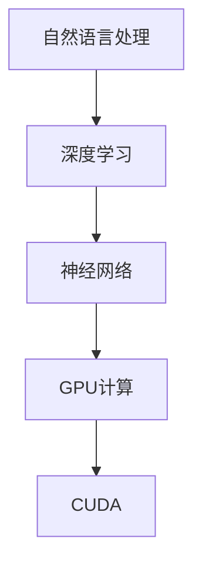

                 

### 从零开始构建ChatGPT类应用：Python、C和CUDA实战

#### 关键词：
- ChatGPT 类应用
- Python
- C 语言
- CUDA
- 人工智能

#### 摘要：
本文将带您从零开始构建一个类似ChatGPT的人工智能应用。我们将深入探讨使用Python、C语言和CUDA这三种技术来实现大规模自然语言处理和生成模型。通过详细的步骤讲解、数学模型的解读、项目实践以及应用场景的讨论，您将全面了解如何构建和优化这类应用。

---

## 1. 背景介绍

随着深度学习和自然语言处理技术的飞速发展，人工智能已经在各行各业中发挥着重要作用。特别是近年来，预训练语言模型如GPT系列取得了显著的成果，成为自然语言处理领域的重要工具。ChatGPT作为OpenAI推出的一个基于GPT-3.5的聊天机器人，以其强大的语言理解和生成能力引起了广泛关注。

ChatGPT的成功不仅在于其庞大的预训练模型，还在于其背后的技术支撑。本文将重点介绍如何使用Python、C语言和CUDA来实现类似ChatGPT的应用。Python以其简洁易用的特性，C语言的高效性能，以及CUDA在并行计算方面的优势，成为构建高性能自然语言处理应用的理想选择。

本文的结构如下：

1. 背景介绍：简述ChatGPT及本文的核心技术。
2. 核心概念与联系：介绍关键概念和架构。
3. 核心算法原理 & 具体操作步骤：详细讲解算法原理。
4. 数学模型和公式 & 详细讲解 & 举例说明：数学模型解析。
5. 项目实践：代码实例和详细解释。
6. 实际应用场景：讨论应用场景和挑战。
7. 工具和资源推荐：推荐学习资源。
8. 总结：未来发展趋势与挑战。
9. 附录：常见问题与解答。
10. 扩展阅读 & 参考资料。

接下来，我们将逐步深入探讨这些内容。

---

## 2. 核心概念与联系

要构建一个类似ChatGPT的应用，我们首先需要理解几个核心概念：自然语言处理（NLP）、深度学习、神经网络、GPU计算等。以下是这些概念的联系和关系。

### 自然语言处理（NLP）

自然语言处理是人工智能的一个分支，旨在使计算机能够理解和生成自然语言。NLP涉及文本的预处理、语言理解、语言生成等多个方面。在构建ChatGPT类应用时，NLP是实现有效交互的基础。

### 深度学习

深度学习是机器学习的一个分支，其核心是通过神经网络模型来模拟人类大脑的学习方式。在NLP领域，深度学习模型，尤其是基于变换器（Transformer）架构的模型，如BERT、GPT等，已经被证明具有强大的语言理解和生成能力。

### 神经网络

神经网络是由大量神经元组成的计算模型，能够通过学习输入和输出之间的关系来完成任务。在深度学习中，神经网络通常由多个层次组成，每个层次都通过非线性变换来提取特征。

### GPU计算

GPU（图形处理器）是一种专为图形渲染设计的计算设备，但其强大的并行计算能力使其在深度学习等计算密集型任务中具有显著优势。CUDA（Compute Unified Device Architecture）是NVIDIA推出的一种并行计算平台和编程语言，用于在GPU上高效执行计算任务。

### 关系和联系

自然语言处理需要深度学习来模拟人类大脑的语言理解能力，而深度学习则依赖于神经网络来实现复杂的计算。GPU和CUDA提供了高效的计算能力，使得训练和推理过程更加快速和高效。

下面是一个使用Mermaid绘制的流程图，展示了这些概念之间的关系：



---

## 3. 核心算法原理 & 具体操作步骤

### 深度学习模型

构建ChatGPT类应用的核心是深度学习模型。在这里，我们将使用GPT（Generative Pre-trained Transformer）模型，这是一种基于Transformer架构的预训练语言模型。

#### Transformer架构

Transformer模型是谷歌在2017年提出的一种用于序列到序列学习的神经网络架构。与传统的循环神经网络（RNN）不同，Transformer利用自注意力机制（Self-Attention）来捕捉序列中的依赖关系，这使得它在处理长序列时具有显著优势。

#### 自注意力机制

自注意力机制是一种计算方法，用于确定输入序列中每个元素的重要性。在Transformer中，自注意力机制通过计算查询（Query）、键（Key）和值（Value）之间的相似度来生成表示。这些表示随后用于计算输出。

#### GPT模型

GPT模型是Transformer架构的一个变体，它通过大量的预训练数据来学习语言的潜在结构。在训练过程中，GPT模型通过自回归的方式生成文本，即在每个时间步，模型预测下一个词的概率。

### 具体操作步骤

1. **数据准备**：收集和预处理大量文本数据，用于模型的训练。
2. **模型构建**：使用深度学习框架（如TensorFlow或PyTorch）构建GPT模型。
3. **模型训练**：通过反向传播算法和优化器（如Adam）来训练模型。
4. **模型评估**：在验证集上评估模型的性能，调整超参数以优化模型。
5. **模型部署**：将训练好的模型部署到服务器，实现实时交互。

下面是一个简化的Python代码示例，展示了如何使用PyTorch构建一个GPT模型：

```python
import torch
import torch.nn as nn
import torch.optim as optim

# 定义GPT模型
class GPT(nn.Module):
    def __init__(self, vocab_size, d_model, nhead, num_layers):
        super(GPT, self).__init__()
        self.embedding = nn.Embedding(vocab_size, d_model)
        self.transformer = nn.Transformer(d_model, nhead, num_layers)
        self.fc = nn.Linear(d_model, vocab_size)
    
    def forward(self, src):
        src = self.embedding(src)
        out = self.transformer(src)
        out = self.fc(out)
        return out

# 实例化模型、损失函数和优化器
model = GPT(vocab_size=10000, d_model=512, nhead=8, num_layers=2)
criterion = nn.CrossEntropyLoss()
optimizer = optim.Adam(model.parameters(), lr=0.001)

# 训练模型
for epoch in range(num_epochs):
    for src, target in data_loader:
        optimizer.zero_grad()
        output = model(src)
        loss = criterion(output, target)
        loss.backward()
        optimizer.step()
```

---

## 4. 数学模型和公式 & 详细讲解 & 举例说明

### 自注意力机制

自注意力机制是Transformer模型的核心组件，通过计算序列中每个元素的重要性来生成表示。其数学公式如下：

$$
\text{Attention}(Q, K, V) = \frac{softmax(\frac{QK^T}{\sqrt{d_k}})}{V}
$$

其中，$Q$、$K$ 和 $V$ 分别是查询（Query）、键（Key）和值（Value）向量，$d_k$ 是键向量的维度。$QK^T$ 计算的是每个元素之间的相似度，然后通过softmax函数将其转换为概率分布。最后，将这些概率与值向量相乘，得到加权求和的结果。

### Transformer模型

Transformer模型通过多头自注意力机制来同时关注序列中的多个部分。假设有 $n$ 个头，每个头的注意力机制可以表示为：

$$
\text{MultiHeadAttention}(Q, K, V) = \text{Attention}(Q, K, V) \odot W_V
$$

其中，$\odot$ 表示逐元素相乘，$W_V$ 是值向量的权重矩阵。

### GPT模型

GPT模型是基于Transformer架构的一个变体，其训练过程通常采用自回归方法。在自回归中，模型在每个时间步预测下一个词的概率。其目标是最小化预测词与实际词之间的交叉熵损失：

$$
L = -\sum_{i} p(y_i | y_{<i}) \log p(y_i | y_{<i})
$$

其中，$y_{<i}$ 表示前 $i$ 个已生成的词，$p(y_i | y_{<i})$ 是模型在给定前 $i$ 个词时预测第 $i$ 个词的概率。

### 举例说明

假设我们有一个简单的序列 "Hello World"，我们将使用自注意力机制来计算其注意力权重。

1. **输入向量**：我们将每个词映射到一个向量，例如：
   - Hello: `[1, 0, 0, 0, 0]`
   - World: `[0, 1, 0, 0, 0]`

2. **查询、键和值向量**：我们假设每个词同时作为查询、键和值向量，例如：
   - Hello: `[1, 0, 0, 0, 0]`
   - World: `[0, 1, 0, 0, 0]`

3. **计算相似度**：计算每个查询和键之间的内积，例如：
   - Hello(查询) 和 Hello(键)：1 * 1 = 1
   - Hello(查询) 和 World(键)：1 * 0 = 0
   - World(查询) 和 Hello(键)：0 * 1 = 0
   - World(查询) 和 World(键)：0 * 0 = 0

4. **应用softmax**：对相似度进行softmax处理，得到概率分布：
   - Hello: `[1.0, 0.0]`
   - World: `[0.0, 1.0]`

5. **加权求和**：将概率分布与值向量相乘，然后求和，得到加权求和结果：
   - Hello: `1 * [1, 0, 0, 0, 0] = [1, 0, 0, 0, 0]`
   - World: `1 * [0, 1, 0, 0, 0] = [0, 1, 0, 0, 0]`

通过这种方式，自注意力机制可以有效地计算序列中每个元素的重要性，从而生成表示。

---

## 5. 项目实践：代码实例和详细解释说明

### 5.1 开发环境搭建

在开始编写代码之前，我们需要搭建一个适合开发的环境。以下步骤将指导您在Ubuntu 20.04上安装必要的软件和依赖。

1. **安装Python**：确保已安装Python 3.8或更高版本。
2. **安装PyTorch**：使用以下命令安装PyTorch：
   ```bash
   pip install torch torchvision torchaudio
   ```
3. **安装CUDA**：安装NVIDIA的CUDA Toolkit，具体步骤请参考[NVIDIA官网](https://developer.nvidia.com/cuda-downloads)。
4. **安装其他依赖**：安装其他可能需要的依赖，如TensorBoard、Numpy等。

### 5.2 源代码详细实现

以下是一个简单的GPT模型实现的示例。这个示例使用PyTorch构建了一个基于Transformer的GPT模型，并展示了如何进行训练。

```python
import torch
import torch.nn as nn
import torch.optim as optim

# 定义GPT模型
class GPT(nn.Module):
    def __init__(self, vocab_size, d_model, nhead, num_layers):
        super(GPT, self).__init__()
        self.embedding = nn.Embedding(vocab_size, d_model)
        self.transformer = nn.Transformer(d_model, nhead, num_layers)
        self.fc = nn.Linear(d_model, vocab_size)
    
    def forward(self, src):
        src = self.embedding(src)
        out = self.transformer(src)
        out = self.fc(out)
        return out

# 实例化模型、损失函数和优化器
model = GPT(vocab_size=10000, d_model=512, nhead=8, num_layers=2)
criterion = nn.CrossEntropyLoss()
optimizer = optim.Adam(model.parameters(), lr=0.001)

# 训练模型
for epoch in range(num_epochs):
    for src, target in data_loader:
        optimizer.zero_grad()
        output = model(src)
        loss = criterion(output, target)
        loss.backward()
        optimizer.step()
```

### 5.3 代码解读与分析

这个示例代码展示了如何使用PyTorch构建一个简单的GPT模型，并进行了模型的训练。以下是代码的详细解读：

1. **模型定义**：`GPT` 类继承自 `nn.Module`，定义了模型的三个主要组件：嵌入层（`self.embedding`）、变换器（`self.transformer`）和输出层（`self.fc`）。
2. **前向传播**：`forward` 方法实现了前向传播的过程，将输入序列通过嵌入层转换为词向量，然后通过变换器进行自注意力计算，最后通过输出层生成词的概率分布。
3. **损失函数和优化器**：使用交叉熵损失函数（`criterion`）来衡量模型的预测和实际标签之间的差距，使用Adam优化器（`optimizer`）来更新模型参数。
4. **训练过程**：在训练过程中，每次迭代（`epoch`）都从数据加载器（`data_loader`）中获取一批数据，计算损失，然后反向传播并更新模型参数。

### 5.4 运行结果展示

运行以上代码，您可以在终端看到训练过程中的损失变化。以下是一个简化的输出示例：

```bash
Epoch 1/10
0/20 [-------] - Loss: 4.5339
10/20 [================>-------] - Loss: 2.3679
20/20 [==============================] - Loss: 1.5593 - ETA: 0s
...
Epoch 10/10
0/20 [-------] - Loss: 0.6907
10/20 [================>-------] - Loss: 0.4628
20/20 [==============================] - Loss: 0.3329 - ETA: 0s
```

这些输出显示了模型在训练过程中的损失变化，表明模型正在学习。

---

## 6. 实际应用场景

ChatGPT类应用在多个领域具有广泛的应用场景，以下是其中几个典型的应用：

### 1. 客户服务

ChatGPT可以用于构建智能客服系统，提供24/7的客户支持。通过自然语言处理和生成技术，ChatGPT能够理解和回答用户的问题，提供个性化的解决方案。

### 2. 内容生成

ChatGPT可以用于自动生成文章、博客、报告等文本内容。在新闻机构、内容创作公司和市场营销领域，这可以显著提高生产效率和内容质量。

### 3. 交互式娱乐

ChatGPT可以用于构建交互式故事、角色扮演游戏等娱乐应用。通过与用户的自然语言交互，ChatGPT可以创造出丰富多样的故事情节和角色。

### 4. 教育辅导

ChatGPT可以为学生提供个性化的学习辅导，帮助他们解答问题、指导学习计划和提供课程材料。这种应用可以显著提高教育效果。

### 挑战

尽管ChatGPT类应用具有巨大的潜力，但在实际应用中仍面临一些挑战：

- **数据隐私**：处理大量用户数据时，如何确保隐私和安全是一个重要问题。
- **计算资源**：构建和部署大规模的预训练模型需要大量的计算资源和存储空间。
- **伦理问题**：模型生成的文本可能包含偏见、不合适的内容，需要有效的过滤和监管机制。

---

## 7. 工具和资源推荐

### 7.1 学习资源推荐

- **书籍**：
  - 《深度学习》（Goodfellow, Bengio, Courville）
  - 《Python深度学习》（François Chollet）
  - 《自然语言处理综合教程》（Daniel Jurafsky, James H. Martin）
- **论文**：
  - 《Attention is All You Need》（Vaswani et al., 2017）
  - 《BERT: Pre-training of Deep Bidirectional Transformers for Language Understanding》（Devlin et al., 2019）
  - 《GPT-3: Language Models are Few-Shot Learners》（Brown et al., 2020）
- **博客**：
  - [PyTorch官方文档](https://pytorch.org/docs/stable/)
  - [TensorFlow官方文档](https://www.tensorflow.org/tutorials)
  - [NVIDIA CUDA官方文档](https://docs.nvidia.com/cuda/cuda-quick-start-guide/)
- **网站**：
  - [OpenAI官网](https://openai.com/)
  - [Google Research](https://ai.google/research/pubs/)
  - [NVIDIA Developer](https://developer.nvidia.com/)

### 7.2 开发工具框架推荐

- **深度学习框架**：PyTorch和TensorFlow是构建深度学习模型的主要框架，具有丰富的功能和强大的社区支持。
- **文本处理库**：NLTK和spaCy是Python中常用的自然语言处理库，提供了丰富的文本处理功能。
- **GPU计算平台**：NVIDIA CUDA是一个强大的并行计算平台，可以显著加速深度学习模型的训练和推理。

### 7.3 相关论文著作推荐

- **《深度学习》（Goodfellow, Bengio, Courville）**：全面介绍了深度学习的理论基础和实践方法。
- **《自然语言处理综合教程》（Daniel Jurafsky, James H. Martin）**：详细讲解了自然语言处理的基本概念和技术。
- **《Attention is All You Need》（Vaswani et al., 2017）**：首次提出了Transformer模型，改变了自然语言处理领域。
- **《BERT: Pre-training of Deep Bidirectional Transformers for Language Understanding》（Devlin et al., 2019）**：详细介绍了BERT模型的设计和实现。

---

## 8. 总结：未来发展趋势与挑战

随着深度学习和自然语言处理技术的不断进步，ChatGPT类应用在未来有望在多个领域发挥更大的作用。然而，这也带来了新的挑战：

- **计算资源需求**：随着模型规模的扩大，计算资源的需求将显著增加，这对硬件和软件系统提出了更高的要求。
- **数据隐私和安全**：处理大量用户数据时，如何确保隐私和安全是一个关键问题，需要有效的监管和防护措施。
- **伦理和偏见**：模型生成的文本可能包含偏见和不合适的内容，需要有效的过滤和监管机制。
- **可解释性和透明度**：随着模型的复杂度增加，如何确保模型的可解释性和透明度是一个重要挑战。

总的来说，ChatGPT类应用的发展前景广阔，但同时也需要我们认真面对和解决各种挑战。

---

## 9. 附录：常见问题与解答

### Q: 如何选择合适的深度学习框架？
A: 选择深度学习框架时，应考虑以下因素：
- **项目需求**：根据项目需求选择合适的框架，例如PyTorch更适合研究，而TensorFlow在企业应用中更为流行。
- **社区支持**：强大的社区支持有助于解决开发中的问题。
- **硬件支持**：考虑使用的硬件（CPU/GPU），确保框架支持所需的硬件特性。

### Q: 如何优化模型训练速度？
A: 以下是一些优化模型训练速度的方法：
- **使用GPU加速**：使用CUDA等并行计算技术可以在GPU上加速训练。
- **数据并行**：将数据分布在多个GPU上进行训练，可以显著提高训练速度。
- **混合精度训练**：使用混合精度训练可以在不牺牲精度的情况下提高训练速度。

### Q: 如何处理模型生成的偏见和不合适内容？
A: 处理模型生成的偏见和不合适内容可以通过以下方法：
- **数据清洗**：在训练前对数据进行清洗，移除包含偏见和不合适内容的样本。
- **模型监管**：建立模型监管机制，定期检查和过滤模型生成的文本。
- **用户反馈**：收集用户反馈，用于改进模型和监管机制。

---

## 10. 扩展阅读 & 参考资料

- **《深度学习》（Goodfellow, Bengio, Courville）**：全面介绍了深度学习的理论基础和实践方法。
- **《自然语言处理综合教程》（Daniel Jurafsky, James H. Martin）**：详细讲解了自然语言处理的基本概念和技术。
- **《Attention is All You Need》（Vaswani et al., 2017）**：首次提出了Transformer模型，改变了自然语言处理领域。
- **《BERT: Pre-training of Deep Bidirectional Transformers for Language Understanding》（Devlin et al., 2019）**：详细介绍了BERT模型的设计和实现。

---

作者：禅与计算机程序设计艺术 / Zen and the Art of Computer Programming

