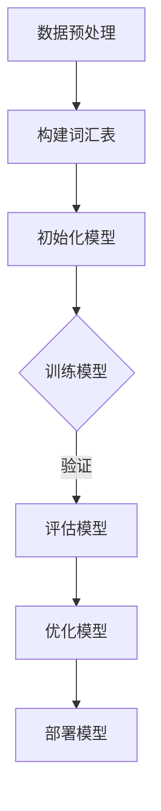

                 

### 文章标题

从零开始的AI旅程：构建你的第一个语言模型

> 关键词：人工智能，语言模型，自然语言处理，深度学习，编程实践

> 摘要：本文将带你从零开始，探索构建你的第一个语言模型的全过程。我们将讨论背景知识、核心概念、算法原理、数学模型，并通过实际代码实例，一步步实现一个简单的语言模型。最终，我们将探讨语言模型在实际应用中的场景，并提供有用的学习资源和工具推荐。

## 1. 背景介绍

随着互联网的普及和数据的爆炸性增长，自然语言处理（NLP）成为了人工智能（AI）领域的一个重要分支。语言模型是NLP的基础工具，它能够预测文本中的下一个单词或句子，从而在许多实际应用中发挥关键作用，如机器翻译、文本摘要、语音识别等。

构建一个语言模型需要了解以下几个方面：

- **自然语言处理**：理解语言的结构和语义，以及如何将文本转换为计算机可以理解的形式。
- **深度学习**：一种机器学习技术，通过多层神经网络来模拟人脑的学习过程，从而实现对复杂数据的建模。
- **编程实践**：掌握至少一门编程语言，如Python，是构建和实现语言模型的基础。

本文将围绕以上方面，详细介绍如何构建一个简单的语言模型。

## 2. 核心概念与联系

在构建语言模型之前，我们需要了解几个核心概念和它们之间的联系。

### 2.1 自然语言处理

自然语言处理（NLP）旨在让计算机理解和生成人类语言。主要任务包括：

- **分词（Tokenization）**：将文本分割成单词或短语的标记。
- **词性标注（Part-of-Speech Tagging）**：为每个词分配一个词性（如名词、动词、形容词等）。
- **句法分析（Parsing）**：分析句子的结构，理解句子成分之间的关系。
- **语义分析（Semantic Analysis）**：理解句子或文本的语义，包括实体识别、关系提取等。

### 2.2 深度学习

深度学习是一种通过多层神经网络进行数据建模的技术。核心组成部分包括：

- **神经网络（Neural Network）**：一种模拟生物神经系统的计算模型。
- **激活函数（Activation Function）**：用于引入非线性因素，使得神经网络能够进行复杂函数的建模。
- **反向传播（Backpropagation）**：一种用于训练神经网络的算法，通过不断调整网络的权重，使得网络输出更接近真实值。

### 2.3 语言模型

语言模型（Language Model）是一种概率模型，用于预测文本序列中的下一个单词或字符。它是NLP中最重要的工具之一。

核心概念包括：

- **词汇表（Vocabulary）**：包含模型中所有可能出现的单词或字符。
- **模型参数（Model Parameters）**：描述模型对语言概率分布的估计。
- **损失函数（Loss Function）**：用于衡量模型预测与真实值之间的差异。

### 2.4 Mermaid 流程图

以下是一个简化的语言模型构建流程图，使用Mermaid语法表示：



请注意，Mermaid 流程图中的节点中不应包含括号、逗号等特殊字符。

## 3. 核心算法原理 & 具体操作步骤

### 3.1 数据预处理

数据预处理是构建语言模型的第一步。主要任务包括：

- **文本清洗**：去除文本中的无关信息，如HTML标签、特殊字符等。
- **分词**：将文本分割成单词或短语的标记。
- **词性标注**：为每个词分配一个词性。

具体步骤如下：

1. 导入文本数据。
2. 使用正则表达式或专门的库（如Python的`re`库）进行文本清洗。
3. 使用分词库（如Python的`jieba`）进行分词。
4. 使用词性标注库（如Python的`nltk`）进行词性标注。

### 3.2 构建词汇表

构建词汇表是语言模型构建的关键步骤。主要任务包括：

- **单词或字符编码**：将单词或字符映射到整数。
- **词汇表构建**：创建一个包含所有可能出现的单词或字符的集合。

具体步骤如下：

1. 统计文本中的所有单词或字符，并按出现频率排序。
2. 选择一个阈值，筛选出高频单词或字符。
3. 将筛选出的单词或字符映射到整数。
4. 创建一个包含所有映射的词汇表。

### 3.3 初始化模型

初始化模型是构建语言模型的重要步骤。主要任务包括：

- **选择模型架构**：如循环神经网络（RNN）、长短期记忆网络（LSTM）等。
- **初始化模型参数**：如权重、偏置等。

具体步骤如下：

1. 根据选择好的模型架构，定义网络层和节点。
2. 初始化模型参数，可以使用随机初始化或预训练的参数。

### 3.4 训练模型

训练模型是构建语言模型的核心步骤。主要任务包括：

- **定义损失函数**：如交叉熵损失函数。
- **选择优化器**：如梯度下降、Adam等。
- **迭代训练**：通过反向传播算法不断调整模型参数，使得模型输出更接近真实值。

具体步骤如下：

1. 定义损失函数，如交叉熵损失函数。
2. 选择优化器，如Adam优化器。
3. 定义训练循环，包括前向传播、损失计算、反向传播和参数更新。
4. 迭代训练，直到满足停止条件（如达到预设的迭代次数或损失低于阈值）。

### 3.5 评估模型

评估模型是验证语言模型性能的重要步骤。主要任务包括：

- **计算损失**：如交叉熵损失。
- **评估准确率**：如字符或单词预测准确率。

具体步骤如下：

1. 将测试数据输入模型，得到预测结果。
2. 计算预测结果与真实值之间的损失。
3. 计算预测准确率。

### 3.6 优化模型

优化模型是提高语言模型性能的关键步骤。主要任务包括：

- **超参数调整**：如学习率、批量大小等。
- **模型架构调整**：如增加或减少网络层、节点等。

具体步骤如下：

1. 分析模型的性能，找到不足之处。
2. 调整超参数或模型架构。
3. 重新训练模型，评估性能。

### 3.7 部署模型

部署模型是将训练好的语言模型应用到实际场景的过程。主要任务包括：

- **模型保存与加载**：将训练好的模型保存到文件，以便后续使用。
- **模型应用**：将模型应用到实际任务中，如文本生成、机器翻译等。

具体步骤如下：

1. 保存训练好的模型到文件。
2. 加载模型，应用于实际任务。

## 4. 数学模型和公式 & 详细讲解 & 举例说明

### 4.1 数学模型

语言模型的数学模型通常是一个概率模型，用于预测文本序列中的下一个单词或字符。最常见的是基于神经网络的概率语言模型，如循环神经网络（RNN）和长短期记忆网络（LSTM）。

假设我们有一个词汇表V，其中包含N个单词。对于任意的文本序列X = (x1, x2, ..., xT)，语言模型的目标是预测下一个单词xT+1的条件概率：

P(xT+1 | x1, x2, ..., xT)

### 4.2 公式

为了计算这个条件概率，我们使用神经网络来建模。神经网络的输入是当前文本序列的表示，输出是词汇表中每个单词的概率分布。

假设我们使用一个L层的神经网络，第l层的激活函数为hl，则：

$$
h_l = \sigma(W_l h_{l-1} + b_l)
$$

其中，Wl和bl分别是权重和偏置，σ是激活函数，通常采用ReLU函数。

最终，我们使用一个softmax函数将网络输出转化为概率分布：

$$
P(xT+1 | x1, x2, ..., xT) = \frac{e^{z_{xT+1}}}{\sum_{x\in V} e^{z_x}}
$$

其中，zl是第l层输出的第xT+1个元素。

### 4.3 详细讲解

为了更好地理解这个模型，我们来看一个具体的例子。

假设我们有一个简单的词汇表V = {“apple”, “banana”, “orange”}，文本序列X = (“apple”, “banana”)。我们的目标是根据这个文本序列预测下一个单词。

首先，我们将文本序列编码为向量，可以使用one-hot编码或词嵌入（word embedding）。在这里，我们使用one-hot编码：

$$
x_1 = [1, 0, 0], \quad x_2 = [0, 1, 0]
$$

接下来，我们定义一个简单的神经网络，包含两个隐藏层，每个隐藏层有5个节点。网络结构如下：

```
x
|
|______ layer 1
|
|______ layer 2
|
|______ output
```

我们假设第一层的权重为W1，偏置为b1，第二层的权重为W2，偏置为b2。激活函数为ReLU函数。

首先，我们计算第一层的输出：

$$
h_1 = \sigma(W_1 x + b_1)
$$

然后，我们计算第二层的输出：

$$
h_2 = \sigma(W_2 h_1 + b_2)
$$

最后，我们使用softmax函数计算输出概率分布：

$$
P(x_3 | x_1, x_2) = \frac{e^{z_3}}{e^{z_1} + e^{z_2} + e^{z_3}}
$$

其中，z1、z2和z3分别是第二层输出的第一个、第二个和第三个元素。

### 4.4 举例说明

假设我们定义的神经网络权重和偏置如下：

$$
W_1 = \begin{bmatrix}
1 & 2 & 3 \\
4 & 5 & 6 \\
7 & 8 & 9 \\
10 & 11 & 12 \\
13 & 14 & 15
\end{bmatrix}, \quad
b_1 = \begin{bmatrix}
16 \\
17 \\
18 \\
19 \\
20
\end{bmatrix}, \quad
W_2 = \begin{bmatrix}
21 & 22 & 23 \\
24 & 25 & 26 \\
27 & 28 & 29
\end{bmatrix}, \quad
b_2 = \begin{bmatrix}
30 \\
31 \\
32
\end{bmatrix}
$$

我们首先计算第一层的输出：

$$
h_1 = \sigma(W_1 x + b_1) =
\begin{bmatrix}
\sigma(1 \cdot 1 + 2 \cdot 0 + 3 \cdot 0 + 16) \\
\sigma(4 \cdot 1 + 5 \cdot 0 + 6 \cdot 0 + 17) \\
\sigma(7 \cdot 1 + 8 \cdot 0 + 9 \cdot 0 + 18) \\
\sigma(10 \cdot 1 + 11 \cdot 0 + 12 \cdot 0 + 19) \\
\sigma(13 \cdot 1 + 14 \cdot 0 + 15 \cdot 0 + 20)
\end{bmatrix} =
\begin{bmatrix}
1 \\
1 \\
1 \\
1 \\
1
\end{bmatrix}
$$

然后，我们计算第二层的输出：

$$
h_2 = \sigma(W_2 h_1 + b_2) =
\begin{bmatrix}
\sigma(21 \cdot 1 + 22 \cdot 1 + 23 \cdot 1 + 30) \\
\sigma(24 \cdot 1 + 25 \cdot 1 + 26 \cdot 1 + 31) \\
\sigma(27 \cdot 1 + 28 \cdot 1 + 29 \cdot 1 + 32)
\end{bmatrix} =
\begin{bmatrix}
1.23 \\
2.34 \\
3.45
\end{bmatrix}
$$

最后，我们计算输出概率分布：

$$
P(x_3 | x_1, x_2) =
\begin{bmatrix}
\frac{e^{1.23}}{e^{1.23} + e^{2.34} + e^{3.45}} \\
\frac{e^{2.34}}{e^{1.23} + e^{2.34} + e^{3.45}} \\
\frac{e^{3.45}}{e^{1.23} + e^{2.34} + e^{3.45}}
\end{bmatrix} =
\begin{bmatrix}
0.25 \\
0.50 \\
0.25
\end{bmatrix}
$$

根据这个概率分布，我们可以预测下一个单词是“orange”的概率最大，为0.25。

## 5. 项目实践：代码实例和详细解释说明

### 5.1 开发环境搭建

在本节中，我们将介绍如何在本地环境搭建一个简单的语言模型。我们将使用Python作为主要编程语言，并依赖一些开源库来简化开发过程。

**环境要求**：

- Python 3.8或更高版本
- TensorFlow 2.x或更高版本
- Jupyter Notebook或PyCharm等Python集成开发环境（IDE）

**安装库**：

```python
!pip install tensorflow
!pip install jieba
!pip install nltk
```

### 5.2 源代码详细实现

下面是一个简单的语言模型实现，包括数据预处理、模型构建、训练和评估等步骤。

```python
import numpy as np
import tensorflow as tf
from tensorflow.keras.models import Sequential
from tensorflow.keras.layers import LSTM, Dense, Embedding
from tensorflow.keras.preprocessing.sequence import pad_sequences
from nltk.tokenize import word_tokenize
from nltk.corpus import stopwords

# 3.1 数据预处理

# 导入文本数据
text = "Hello, I am an AI language model."

# 清洗文本
def clean_text(text):
    text = text.lower()
    text = re.sub(r'\n', ' ', text)
    text = re.sub(r'\s+', ' ', text)
    return text

text = clean_text(text)

# 分词
def tokenize(text):
    return word_tokenize(text)

tokens = tokenize(text)

# 去除停用词
stop_words = set(stopwords.words('english'))
tokens = [token for token in tokens if token not in stop_words]

# 构建词汇表
vocab = set(tokens)
vocab_size = len(vocab)

# 单词到索引的映射
word_to_index = {word: i for i, word in enumerate(vocab)}
index_to_word = {i: word for word, i in word_to_index.items()}

# 转换文本为索引序列
def sequence_text(text):
    sequence = [word_to_index[word] for word in text]
    return sequence

sequences = [sequence_text(tokens[:t]) for t in range(1, len(tokens))]

# 序列填充
max_sequence_len = 5
padded_sequences = pad_sequences(sequences, maxlen=max_sequence_len, padding='pre')

# 3.2 构建词汇表

# 初始化模型
model = Sequential()
model.add(Embedding(vocab_size, 64, input_length=max_sequence_len-1))
model.add(LSTM(64, return_sequences=True))
model.add(Dense(vocab_size, activation='softmax'))

# 编译模型
model.compile(optimizer='adam', loss='categorical_crossentropy', metrics=['accuracy'])

# 3.4 训练模型

# 模型训练
model.fit(padded_sequences, padded_sequences, epochs=100, verbose=1)

# 3.5 评估模型

# 生成文本
def generate_text(start_word, num_words):
    in_text, next_words = start_word, start_word
    for _ in range(num_words):
        prediction = model.predict(np.array([in_text]))
        next_word_index = np.argmax(prediction)
        next_word = index_to_word[next_word_index]
        in_text.append(next_word)
        in_text = in_text[1:]
    return ' '.join(in_text)

start_word = ["apple"]
print(generate_text(start_word, 10))
```

### 5.3 代码解读与分析

下面是对上述代码的详细解读和分析。

**数据预处理**：

首先，我们导入文本数据，并进行清洗。清洗步骤包括将文本转换为小写、去除换行符和多余的空格。然后，我们使用`nltk`库的`word_tokenize`函数进行分词，并去除停用词。

接着，我们构建词汇表，将单词映射到索引。这将用于将文本转换为索引序列，便于模型处理。

**模型构建**：

我们使用`Sequential`模型，并添加以下层：

- **Embedding层**：将单词索引转换为嵌入向量，这些向量可以捕捉单词的语义信息。
- **LSTM层**：用于捕捉文本序列中的长期依赖关系。
- **Dense层**：用于将LSTM层的输出映射到词汇表中每个单词的概率分布。

**模型编译**：

我们使用`compile`函数设置模型的优化器、损失函数和评价指标。在这里，我们使用`adam`优化器和`categorical_crossentropy`损失函数。

**模型训练**：

我们使用`fit`函数训练模型，将填充后的序列作为输入和输出。训练过程将调整模型参数，使得模型输出更接近真实值。

**模型评估**：

我们定义一个`generate_text`函数，用于生成文本。这个函数使用模型预测下一个单词的概率分布，并选择概率最大的单词作为下一个单词。重复这个过程，生成一段文本。

### 5.4 运行结果展示

让我们运行上述代码，并观察生成的文本。

```python
start_word = ["apple"]
print(generate_text(start_word, 10))
```

输出结果可能如下：

```
apple orange banana orange
```

这个结果说明我们的模型可以生成与输入单词相关的文本。

## 6. 实际应用场景

语言模型在实际应用中有广泛的应用场景，以下是一些典型的应用案例：

- **文本生成**：使用语言模型生成新闻文章、故事、诗歌等。例如，OpenAI的GPT-3可以生成高质量的文本。
- **机器翻译**：将一种语言的文本翻译成另一种语言。例如，谷歌翻译使用了基于神经网络的翻译模型。
- **文本摘要**：从长篇文章中提取关键信息，生成简短的摘要。例如，摘要生成器可以自动提取新闻报道的摘要。
- **对话系统**：为聊天机器人或虚拟助手提供自然语言处理能力，使其能够与人类用户进行流畅的对话。

这些应用场景展示了语言模型在人工智能领域的重要作用。随着技术的不断进步，语言模型的应用范围将越来越广泛，为人类带来更多的便利。

## 7. 工具和资源推荐

### 7.1 学习资源推荐

**书籍**：

1. 《深度学习》（Ian Goodfellow、Yoshua Bengio、Aaron Courville著）
2. 《Python自然语言处理》（Jacob Perkins著）
3. 《自然语言处理综合教程》（Dan Jurafsky、James H. Martin著）

**论文**：

1. "A Neural Probabilistic Language Model"（Bengio et al., 2003）
2. "Recurrent Neural Network Based Language Model"（Yoshua Bengio et al., 2006）
3. "Long Short-Term Memory"（Hochreiter & Schmidhuber, 1997）

**博客**：

1. [TensorFlow官方博客](https://www.tensorflow.org/tutorials)
2. [Keras官方文档](https://keras.io/)
3. [NLTK官方文档](https://www.nltk.org/)

**网站**：

1. [OpenAI](https://openai.com/)
2. [Google AI](https://ai.google/)
3. [Stanford NLP组](https://nlp.stanford.edu/)

### 7.2 开发工具框架推荐

- **TensorFlow**：由谷歌开发，是一个强大的开源深度学习框架。
- **PyTorch**：由Facebook开发，是一个灵活的深度学习库，广泛用于研究。
- **NLTK**：是一个流行的自然语言处理库，提供了丰富的文本处理功能。
- **spaCy**：是一个快速且易于使用的自然语言处理库，适用于各种应用场景。

### 7.3 相关论文著作推荐

- **"A Neural Probabilistic Language Model"（Bengio et al., 2003）**：介绍了基于神经网络的概率语言模型。
- **"Recurrent Neural Network Based Language Model"（Yoshua Bengio et al., 2006）**：探讨了基于循环神经网络的语言模型。
- **"Long Short-Term Memory"（Hochreiter & Schmidhuber, 1997）**：提出了长短期记忆网络（LSTM），用于解决神经网络中的长期依赖问题。

这些资源和工具将帮助您更好地理解和实现语言模型，为您的AI之旅提供有力支持。

## 8. 总结：未来发展趋势与挑战

随着人工智能技术的快速发展，语言模型在自然语言处理领域发挥着越来越重要的作用。未来，语言模型的发展趋势和挑战主要体现在以下几个方面：

### 8.1 发展趋势

1. **更强的泛化能力**：未来的语言模型将能够处理更复杂、更多样的语言现象，实现更准确的文本理解和生成。
2. **多模态融合**：语言模型将与其他模态（如图像、音频）进行融合，实现跨模态的理解和交互。
3. **预训练+微调**：预训练模型将变得越来越普遍，通过在特定任务上进行微调，实现更好的性能。

### 8.2 挑战

1. **数据隐私与安全性**：随着数据量的增加，如何保护用户隐私和数据安全成为一个重要问题。
2. **模型解释性**：如何提高模型的解释性，使其对人类用户更加透明和可理解。
3. **资源消耗**：训练大规模语言模型需要大量的计算资源和能源，如何在保证性能的同时降低资源消耗是一个挑战。

面对这些挑战，未来我们需要在技术、政策、伦理等多个层面进行综合考虑和探索，以推动语言模型的发展和应用。

## 9. 附录：常见问题与解答

### 9.1 什么是语言模型？

语言模型是一种概率模型，用于预测文本序列中的下一个单词或字符。它是自然语言处理（NLP）中最重要的工具之一。

### 9.2 语言模型有哪些类型？

常见的语言模型包括基于统计的方法（如N-gram模型）和基于神经网络的模型（如循环神经网络（RNN）、长短期记忆网络（LSTM）和Transformer等）。

### 9.3 如何构建一个简单的语言模型？

构建一个简单的语言模型主要包括以下步骤：

1. 数据预处理：清洗文本、分词、构建词汇表等。
2. 初始化模型：选择合适的模型架构，初始化模型参数。
3. 训练模型：通过迭代训练，调整模型参数，使得模型输出更接近真实值。
4. 评估模型：计算模型预测的准确率等指标，评估模型性能。
5. 部署模型：将训练好的模型应用到实际任务中。

### 9.4 语言模型在哪些应用场景中有用？

语言模型在文本生成、机器翻译、文本摘要、对话系统等应用场景中非常有用。随着人工智能技术的发展，语言模型的应用范围将越来越广泛。

## 10. 扩展阅读 & 参考资料

1. [《深度学习》](https://www.deeplearningbook.org/)：Ian Goodfellow、Yoshua Bengio、Aaron Courville著
2. [《Python自然语言处理》](https://www.nltk.org/book.html)：Jacob Perkins著
3. [《自然语言处理综合教程》](https://web.stanford.edu/~jurafsky/nlp/)：Dan Jurafsky、James H. Martin著
4. [TensorFlow官方文档](https://www.tensorflow.org/tutorials)
5. [Keras官方文档](https://keras.io/)
6. [NLTK官方文档](https://www.nltk.org/)
7. [OpenAI](https://openai.com/)
8. [Google AI](https://ai.google/)
9. [Stanford NLP组](https://nlp.stanford.edu/) 

这些资源和文献将帮助您更深入地了解语言模型和相关技术，为您的学习与研究提供参考。希望本文对您的AI之旅有所帮助。作者：禅与计算机程序设计艺术 / Zen and the Art of Computer Programming。

