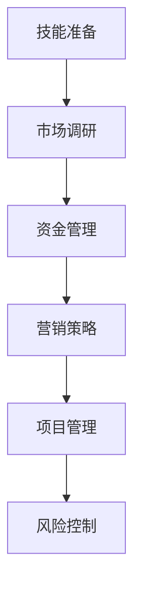

                 

### 从零开始：程序员独立创业完全指南

#### 摘要

独立创业是许多程序员心中的梦想，但实现这一梦想并不容易。本文将为您详细阐述从零开始成为一名独立程序员的创业之路。我们将探讨创业所需的核心技能、关键步骤、市场调研、资金管理、营销策略以及应对风险和挑战的方法。通过本文的指导，您将获得一份实用的创业指南，帮助您在编程领域开创自己的事业。

#### 1. 背景介绍

独立创业作为一种创业模式，日益受到程序员的青睐。这不仅是因为编程领域的持续增长和广阔的市场前景，还因为许多程序员具有出色的编程技能和解决问题的能力。独立创业可以让程序员自主掌控自己的事业，实现个人价值和财务自由。然而，独立创业并非易事，它需要清晰的目标、扎实的技能、周密的计划和坚定的决心。

本文旨在为那些希望独立创业的程序员提供一份实用的指南。我们将从多个方面探讨独立创业的各个方面，包括技能准备、市场调研、资金管理、营销策略、项目管理和风险控制。通过本文的指导，希望您能够更好地规划自己的创业之路，实现从零到一的突破。

#### 2. 核心概念与联系

在开始独立创业之前，我们需要了解一些核心概念和它们之间的联系。

- **技能准备**：独立创业需要具备一定的编程技能和业务理解能力。编程技能包括熟悉各种编程语言、框架和工具，而业务理解能力则要求您能够理解客户的需求、市场趋势和竞争环境。
- **市场调研**：市场调研是创业成功的关键一步。通过市场调研，您可以了解目标市场的规模、竞争对手、客户需求和市场趋势。
- **资金管理**：创业初期的资金管理至关重要。您需要制定详细的预算计划，确保资金的有效利用，并准备好应对可能的资金短缺。
- **营销策略**：营销策略是吸引客户的关键。您需要制定合适的营销策略，包括定位、目标客户、营销渠道和推广活动。
- **项目管理**：项目管理是确保项目按时按质完成的关键。您需要掌握项目管理的知识和技巧，包括需求分析、项目计划、进度控制和质量保证。
- **风险控制**：创业过程中充满了不确定性，您需要具备良好的风险控制能力，以便应对各种挑战和困难。

下面是一个Mermaid流程图，展示了这些核心概念之间的联系：



#### 3. 核心算法原理 & 具体操作步骤

在独立创业的过程中，核心算法原理可以帮助您更好地理解和执行各个关键步骤。

- **技能准备**：掌握编程技能和业务理解能力。具体步骤如下：

  1. **学习编程语言**：选择一种主流编程语言（如Python、Java或C++），系统学习其语法、特性和应用场景。
  2. **实践项目**：通过参与开源项目或自己动手实现小型项目，将理论知识应用到实践中。
  3. **持续学习**：编程领域不断发展，您需要保持学习的热情，不断更新自己的知识体系。

- **市场调研**：市场调研的目的是了解目标市场的需求、规模和趋势。具体步骤如下：

  1. **确定目标市场**：根据您的技能和兴趣，选择一个有潜力的目标市场。
  2. **收集数据**：通过在线调查、市场报告、行业新闻等途径，收集目标市场的相关信息。
  3. **分析数据**：对收集到的数据进行分析，确定市场趋势、客户需求和竞争对手状况。

- **资金管理**：资金管理是确保创业初期顺利进行的关键。具体步骤如下：

  1. **制定预算计划**：根据业务需求和资源情况，制定详细的预算计划。
  2. **监控资金使用**：定期监控资金使用情况，确保资金的有效利用。
  3. **应对资金短缺**：准备好应对可能的资金短缺，包括寻找投资人、降低成本、增加收入等。

- **营销策略**：营销策略是吸引客户的关键。具体步骤如下：

  1. **确定品牌定位**：根据目标市场和客户需求，确定品牌定位和差异化策略。
  2. **选择营销渠道**：根据品牌定位，选择合适的营销渠道，如社交媒体、博客、线下活动等。
  3. **制定推广活动**：根据营销渠道，制定具体的推广活动，如内容营销、社交媒体推广、广告投放等。

- **项目管理**：项目管理是确保项目按时按质完成的关键。具体步骤如下：

  1. **需求分析**：与客户沟通，明确项目需求，制定项目计划。
  2. **项目计划**：制定详细的项目计划，包括任务分配、时间表和预算。
  3. **进度控制**：监控项目进度，确保项目按时完成。
  4. **质量保证**：对项目进行质量检查，确保项目达到预期效果。

- **风险控制**：风险控制是应对创业过程中不确定性的关键。具体步骤如下：

  1. **识别风险**：识别可能影响业务的风险，如市场变化、技术风险、资金风险等。
  2. **评估风险**：对识别出的风险进行评估，确定其影响程度和发生概率。
  3. **制定应对措施**：针对评估出的高风险，制定应对措施，如风险转移、风险规避等。

通过以上核心算法原理和具体操作步骤，您将能够更好地规划和管理自己的独立创业之路。

#### 4. 数学模型和公式 & 详细讲解 & 举例说明

在独立创业过程中，数学模型和公式可以帮助您更准确地分析和决策。

- **成本效益分析**：成本效益分析（Cost-Benefit Analysis，CBA）是一种常用的决策工具，用于评估项目的经济效益。公式如下：

  $$ 
  CBA = \frac{EBIT}{Cost} 
  $$

  其中，EBIT（Earnings Before Interest and Taxes）表示税前利润，Cost表示项目总成本。

  例如，假设一个项目的EBIT为100万元，总成本为200万元，则其成本效益比为：

  $$ 
  CBA = \frac{100}{200} = 0.5 
  $$

  这意味着该项目每投入1元，可以获得0.5元的收益。

- **市场占有率**：市场占有率（Market Share）是衡量企业市场地位的重要指标。公式如下：

  $$ 
  Market Share = \frac{Revenue}{Total Market Revenue} 
  $$

  其中，Revenue表示企业销售收入，Total Market Revenue表示整个市场的销售收入。

  例如，假设某公司的销售收入为1000万元，整个市场的销售收入为5000万元，则其市场占有率为：

  $$ 
  Market Share = \frac{1000}{5000} = 0.2 
  $$

  这意味着该公司占据了整个市场20%的份额。

- **盈亏平衡点**：盈亏平衡点（Break-Even Point，BEP）是企业在不亏损的情况下需要达到的销售量或销售额。公式如下：

  $$ 
  BEP = \frac{Fixed Cost + Variable Cost}{Selling Price - Variable Cost} 
  $$

  其中，Fixed Cost表示固定成本，Variable Cost表示可变成本，Selling Price表示销售价格。

  例如，假设一家电商公司的固定成本为100万元，可变成本为10元/件，销售价格为100元/件，则其盈亏平衡点为：

  $$ 
  BEP = \frac{100 + 10}{100 - 10} = 11.11 
  $$

  这意味着该公司需要卖出至少11.11件商品才能不亏损。

通过这些数学模型和公式，您可以在独立创业过程中做出更科学的决策。

#### 5. 项目实践：代码实例和详细解释说明

为了更好地理解独立创业的理论知识，我们将通过一个实际的代码实例来讲解。

**项目背景**：假设您是一名独立开发者，计划开发一款在线教育平台，提供编程课程教学。

**技术栈**：选择Python作为主要编程语言，使用Flask作为Web框架，SQLite作为数据库。

**实现步骤**：

### 5.1 开发环境搭建

1. 安装Python（3.8及以上版本）。
2. 安装Flask和SQLite。

```bash
pip install Flask
pip install pysqlite3
```

### 5.2 源代码详细实现

**步骤1：创建Flask应用**

创建一个名为`app.py`的文件，并编写以下代码：

```python
from flask import Flask, request, jsonify

app = Flask(__name__)

@app.route('/register', methods=['POST'])
def register():
    data = request.get_json()
    username = data.get('username')
    password = data.get('password')
    # 存储用户信息到数据库
    # ...
    return jsonify({'message': '注册成功'})

@app.route('/login', methods=['POST'])
def login():
    data = request.get_json()
    username = data.get('username')
    password = data.get('password')
    # 验证用户信息
    # ...
    return jsonify({'message': '登录成功'})

if __name__ == '__main__':
    app.run(debug=True)
```

**步骤2：创建SQLite数据库**

创建一个名为`database.db`的SQLite数据库，并编写以下SQL语句：

```sql
CREATE TABLE users (
    id INTEGER PRIMARY KEY AUTOINCREMENT,
    username TEXT UNIQUE NOT NULL,
    password TEXT NOT NULL
);
```

**步骤3：实现用户注册和登录功能**

1. 在`app.py`中，添加以下代码以实现用户注册功能：

```python
import sqlite3

def register(username, password):
    conn = sqlite3.connect('database.db')
    c = conn.cursor()
    c.execute("INSERT INTO users (username, password) VALUES (?, ?)", (username, password))
    conn.commit()
    conn.close()

@app.route('/register', methods=['POST'])
def register():
    data = request.get_json()
    username = data.get('username')
    password = data.get('password')
    register(username, password)
    return jsonify({'message': '注册成功'})
```

2. 在`app.py`中，添加以下代码以实现用户登录功能：

```python
def login(username, password):
    conn = sqlite3.connect('database.db')
    c = conn.cursor()
    c.execute("SELECT * FROM users WHERE username=? AND password=?", (username, password))
    user = c.fetchone()
    conn.close()
    return user

@app.route('/login', methods=['POST'])
def login():
    data = request.get_json()
    username = data.get('username')
    password = data.get('password')
    user = login(username, password)
    if user:
        return jsonify({'message': '登录成功'})
    else:
        return jsonify({'message': '用户名或密码错误'})
```

### 5.3 代码解读与分析

**用户注册功能**

1. 接收用户提交的注册数据。
2. 调用`register`函数，将用户名和密码存储到SQLite数据库中。

**用户登录功能**

1. 接收用户提交的登录数据。
2. 调用`login`函数，从SQLite数据库中查询用户名和密码。
3. 判断用户是否存在，如果存在，返回登录成功信息；否则，返回错误信息。

### 5.4 运行结果展示

运行`app.py`，使用POST请求访问`/register`和`/login`接口，可以测试用户注册和登录功能。

```bash
$ curl -X POST -H "Content-Type: application/json" -d '{"username": "user1", "password": "pass123"}' http://localhost:5000/register
{"message": "注册成功"}

$ curl -X POST -H "Content-Type: application/json" -d '{"username": "user1", "password": "pass123"}' http://localhost:5000/login
{"message": "登录成功"}

$ curl -X POST -H "Content-Type: application/json" -d '{"username": "user2", "password": "pass456"}' http://localhost:5000/register
{"message": "注册成功"}

$ curl -X POST -H "Content-Type: application/json" -d '{"username": "user1", "password": "wrongpass"}' http://localhost:5000/login
{"message": "用户名或密码错误"}
```

通过以上代码实例，您将了解到如何使用Python和Flask实现一个简单的在线教育平台用户注册和登录功能。

#### 6. 实际应用场景

独立创业在编程领域有着广泛的应用场景。以下是一些典型的实际应用场景：

1. **软件开发**：许多程序员选择独立创业，开发自己的软件产品。这些产品可以是一个Web应用、移动应用或桌面应用。例如，您可以开发一款教育类应用，提供在线编程课程和学习资源。

2. **技术咨询**：拥有丰富编程经验的程序员可以提供技术咨询和开发服务。客户可以是中小企业、初创公司或大型企业，他们可能需要解决技术难题、优化现有系统或开发新的系统。

3. **外包服务**：独立创业的程序员可以为其他公司提供外包服务。例如，您可以为一家电商公司开发电商网站、为一家物流公司开发物流管理系统等。

4. **在线教育**：随着在线教育的兴起，独立创业者可以利用自己的编程技能，开发在线编程课程，为学生提供高质量的教育资源。

5. **开源项目**：参与开源项目是独立创业的一种方式。通过开源项目，您可以积累经验、提高知名度，并吸引潜在客户。

6. **创业孵化**：一些有经验的程序员选择创业孵化，帮助有潜力的初创公司提供技术支持和咨询服务。

#### 7. 工具和资源推荐

为了成功独立创业，您需要掌握一些关键的工具和资源。

**7.1 学习资源推荐**

1. **书籍**：
   - 《设计模式：可复用的面向对象软件架构》（Design Patterns: Elements of Reusable Object-Oriented Software）
   - 《代码大全》（The Art of Computer Programming）
   - 《深度学习》（Deep Learning）

2. **在线课程**：
   - Coursera、edX、Udemy等平台提供了丰富的编程和创业课程。

3. **博客和网站**：
   - Medium、GitHub、Stack Overflow等平台上有大量优质的编程和创业内容。

**7.2 开发工具框架推荐**

1. **编程语言**：Python、Java、C++、Go等。

2. **Web框架**：Flask、Django、Spring Boot等。

3. **数据库**：MySQL、PostgreSQL、MongoDB等。

4. **版本控制**：Git、GitHub等。

5. **项目管理工具**：JIRA、Trello、Asana等。

**7.3 相关论文著作推荐**

1. **论文**：
   - 《大型分布式系统的设计》（Designing Data-Intensive Applications）
   - 《算法导论》（Introduction to Algorithms）

2. **著作**：
   - 《代码大全》（The Art of Computer Programming）
   - 《编程珠玑》（The Practice of Programming）

通过以上工具和资源，您可以为独立创业打下坚实的基础。

#### 8. 总结：未来发展趋势与挑战

独立创业在编程领域具有广阔的发展前景。随着技术的不断进步和市场的变化，独立创业者需要不断适应和调整自己的策略。以下是一些未来发展趋势和挑战：

**发展趋势**：

1. **数字化转型**：越来越多的行业和企业将数字化转型作为战略重点，这为独立创业者提供了更多机会。
2. **人工智能与大数据**：人工智能和大数据技术的快速发展，为独立创业者提供了丰富的应用场景和解决方案。
3. **开源生态**：开源技术的发展，使得独立创业者可以更便捷地获取技术和资源，降低创业门槛。
4. **远程工作**：远程工作的普及，使得独立创业者可以更灵活地选择工作地点和方式。

**挑战**：

1. **市场竞争**：编程领域竞争激烈，独立创业者需要具备出色的技术能力和市场洞察力，以在市场中脱颖而出。
2. **技术更新**：技术更新速度快，独立创业者需要不断学习和掌握新技术，以保持竞争力。
3. **资金压力**：创业初期资金压力较大，独立创业者需要合理规划资金，确保业务的可持续发展。
4. **团队管理**：独立创业者需要具备良好的团队管理能力，吸引和留住优秀的团队成员。

通过积极应对这些挑战，独立创业者可以在编程领域取得成功。

#### 9. 附录：常见问题与解答

**Q1：独立创业需要哪些技能？**

独立创业需要具备以下技能：

- **编程技能**：熟练掌握至少一种编程语言，如Python、Java、C++等。
- **业务理解能力**：了解目标市场和客户需求，能够为客户提供有效的解决方案。
- **项目管理能力**：掌握项目管理的知识和技巧，确保项目按时按质完成。
- **沟通能力**：良好的沟通能力有助于与客户、团队成员和其他利益相关者有效沟通。
- **营销能力**：掌握一定的营销策略和技巧，能够吸引潜在客户。

**Q2：如何找到合适的投资人？**

找到合适的投资人需要以下步骤：

- **准备商业计划书**：编写详细的商业计划书，展示您的业务模式、市场前景、盈利模式等。
- **建立人脉网络**：通过参加行业会议、创业活动等途径，结识潜在的投资人。
- **寻找投资平台**：使用投资平台（如天使汇、36氪等），发布您的项目信息，吸引投资人的关注。
- **展示项目优势**：在投资人面前展示您的项目优势、团队实力和市场需求，提高投资机会。

**Q3：如何管理创业初期的资金？**

管理创业初期的资金需要注意以下几点：

- **制定预算计划**：根据业务需求和资源情况，制定详细的预算计划，确保资金的有效利用。
- **监控资金使用**：定期监控资金使用情况，及时发现和解决问题。
- **降低成本**：通过优化业务流程、降低运营成本等方式，提高资金利用效率。
- **应对资金短缺**：准备好应对可能的资金短缺，包括寻找投资人、降低成本、增加收入等。

**Q4：如何提高项目成功率？**

提高项目成功率需要注意以下几点：

- **市场需求**：确保项目满足市场需求，解决客户实际问题。
- **项目规划**：制定详细的项目计划，确保项目按时按质完成。
- **团队协作**：建立高效的团队，确保团队成员之间的有效协作。
- **风险管理**：识别项目风险，制定应对措施，降低风险对项目的影响。
- **客户反馈**：积极收集客户反馈，不断改进产品和服务。

通过以上措施，可以提高项目成功率，实现创业目标。

#### 10. 扩展阅读 & 参考资料

为了进一步了解独立创业的相关知识和技巧，以下是一些扩展阅读和参考资料：

- **书籍**：
  - 《创业维艰》（Hard Things About Hard Things） - 本·霍洛维茨
  - 《创业教父乔布斯传》（Steve Jobs） - 沃尔特·艾萨克森
  - 《创业梦工厂》（The Lean Startup） - 埃里克·莱斯

- **在线课程**：
  - Coursera上的“创业入门”（Introduction to Entrepreneurship）课程
  - edX上的“编程与创业”（Programming and Entrepreneurship）课程

- **博客和网站**：
  - TechCrunch：全球知名科技博客，提供最新的创业动态和案例分析。
  - Hacker News：一个知名的程序员社区，讨论创业、技术和发展趋势。

- **相关论文**：
  - “Entrepreneurship and the Business Environment” - 美国国家科学基金会（NSF）论文
  - “The Impact of Entrepreneurship on Economic Growth” - 国际创业研究协会（BERA）论文

通过阅读这些资料，您将能够更全面地了解独立创业的各个方面，为自己的创业之路做好准备。作者：禅与计算机程序设计艺术 / Zen and the Art of Computer Programming

