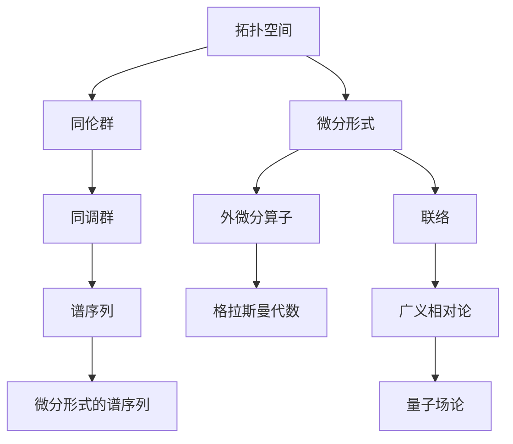

                 

### 背景介绍

代数拓扑与微分形式的交叉研究，是数学与物理学中极具前瞻性的研究领域。这一领域不仅具有深厚的历史积淀，还在现代科学和工程中扮演着至关重要的角色。从几何拓扑的角度出发，代数拓扑通过研究拓扑空间的性质，揭示了空间结构的基本规律；而微分形式则通过研究无穷小变化，描述了空间中连续现象的动态特征。两者在数学框架内的交叉研究，不仅丰富了数学理论，也为解决实际工程问题提供了新的思路。

#### 数学中的代数拓扑

代数拓扑诞生于20世纪初期，其主要目的是将几何问题转化为代数问题，以便于研究几何结构的性质。代数拓扑的核心工具包括同调理论、同伦理论和谱序列等。同调理论通过研究拓扑空间的同调群，揭示了空间之间的连续性和连通性。同伦理论则通过研究空间中的循环结构，揭示了空间的拓扑性质。谱序列作为同调理论和同伦理论的桥梁，为研究复杂空间的结构提供了强有力的工具。

在数学中，代数拓扑有着广泛的应用。例如，在拓扑空间分类、拓扑量子场论、代数几何和数论等领域都有重要的贡献。代数拓扑的一个经典问题是如何将一个复杂的拓扑空间分解成几个简单的子空间，并研究它们之间的关系。这一问题在数学物理中有着深远的影响，尤其是在弦理论和凝聚态物理中，代数拓扑的概念被广泛应用。

#### 微分形式的数学基础

微分形式是微分几何中的核心概念，用于描述空间中无穷小变化。微分形式理论起源于外微分算子，该算子用于计算微分形式之间的变换。外微分算子可以看作是微分形式的线性变换，其基本性质包括反符性和线性性。

微分形式理论的基础是格拉斯曼代数（ Grassmann algebra），该代数用于描述向量空间的补空间。在格拉斯曼代数中，一个基本向量可以扩展为一个线性空间，这使得我们可以研究向量空间中的线性映射。微分形式通过这种方式被引入到几何问题中，为解决几何问题提供了新的方法。

在数学中，微分形式理论有着广泛的应用。例如，在研究流形上的向量场、联络和曲率张量时，微分形式提供了强有力的工具。这些概念在广义相对论、 gauge 理论和量子场论中都有重要的应用。

#### 交叉研究的意义

代数拓扑与微分形式的交叉研究，不仅在理论上具有重要的意义，也在实际应用中展现出巨大的潜力。这种交叉研究将代数拓扑的代数方法和微分形式的几何方法相结合，为解决复杂几何问题提供了新的途径。

首先，交叉研究揭示了代数拓扑和微分形式之间的内在联系。例如，同调理论和微分形式的拉格朗日量之间的关系，使得我们能够通过代数拓扑的工具来研究微分形式的物理现象。这种交叉不仅丰富了数学理论，也为数学与其他领域如物理、工程和计算机科学的交叉融合提供了新的视角。

其次，交叉研究推动了数学在工程中的应用。在工程实践中，许多问题都可以转化为几何问题。代数拓扑和微分形式的交叉研究，为解决这些几何问题提供了新的方法。例如，在计算机图形学中，利用代数拓扑的方法来优化图形的拓扑结构；在量子计算中，利用微分形式理论来研究量子态的几何结构。

总之，代数拓扑与微分形式的交叉研究，不仅推动了数学理论的发展，也为解决实际问题提供了新的思路和方法。这种交叉研究的重要性在于，它将不同的数学工具和方法结合起来，形成了一种新的研究范式，为未来的科学研究和技术发展奠定了坚实的基础。

---

### 核心概念与联系

在深入探讨代数拓扑与微分形式的交叉研究之前，首先需要明确这两个领域的核心概念及其相互联系。以下是这些核心概念和它们之间关系的详细解释，以及一个使用Mermaid绘制的流程图，帮助读者更好地理解这一领域的基本框架。

#### 代数拓扑的核心概念

1. **拓扑空间**：拓扑空间是代数拓扑研究的起点，它是一个集合与其上的拓扑结构。拓扑结构定义了哪些集合被认为是“开集”，这决定了集合的连续性和连通性。

2. **同伦群**：同伦群用于研究空间中的连续变换，即同伦关系。它揭示了空间中的基本性质，如“可收缩性”和“边界”。

3. **同调群**：同调群通过研究空间中的孔洞和圈，揭示了空间的结构特性。同调群中的元素对应于空间中的孔洞和圈，它们的结构揭示了空间的连通性和洞数。

4. **谱序列**：谱序列是同调理论和同伦理论之间的重要工具。它提供了一种将同调群和同伦群关联起来的方法，用于解决复杂的拓扑问题。

#### 微分形式的核心概念

1. **微分形式**：微分形式是定义在流形上的无穷小变换，它们是外微分算子的结果。微分形式可以看作是向量场的推广。

2. **外微分算子**：外微分算子是一个线性算子，用于计算微分形式的导数。外微分算子具有反符性和线性性，这是其重要的性质。

3. **格拉斯曼代数**：格拉斯曼代数是一种向量空间，它用于描述向量空间的补空间。格拉斯曼代数是微分形式理论的基础。

4. **联络**：联络是一个结构，用于描述流形上的向量场的导数。联络是微分几何中的核心概念，它在广义相对论中起着关键作用。

#### 相互关系与联系

代数拓扑与微分形式的交叉研究揭示了这两个领域之间的紧密联系。以下是它们之间的一些主要联系：

1. **同调群与微分形式的关联**：同调理论中的同调群可以用来研究微分形式，尤其是通过谱序列的方法，可以将同调群与微分形式的拉格朗日量联系起来。

2. **同伦群与向量场的联系**：同伦理论中的同伦群可以用来研究流形上的向量场，揭示了向量场的拓扑性质。

3. **谱序列与微分形式的谱序列**：谱序列在代数拓扑中用于解决复杂的拓扑问题，在微分形式理论中也有类似的谱序列，用于研究微分形式之间的变换。

#### Mermaid 流程图

下面是一个使用Mermaid绘制的流程图，展示了代数拓扑与微分形式的核心概念及其相互关系：



在这个流程图中，A代表拓扑空间，B代表同伦群，C代表同调群，D代表谱序列，E代表微分形式，F代表外微分算子，G代表格拉斯曼代数，H代表联络，I代表广义相对论，J代表微分形式的谱序列，K代表量子场论。

通过这个流程图，我们可以直观地看到代数拓扑与微分形式之间的核心概念和相互关系，这为后续深入探讨这两个领域的交叉研究提供了坚实的基础。

---

### 核心算法原理 & 具体操作步骤

在深入探讨代数拓扑与微分形式的交叉研究之后，接下来我们将介绍一些核心算法原理，并详细阐述这些算法的具体操作步骤。通过这些算法，我们可以更好地理解如何将代数拓扑的方法应用于微分形式的研究。

#### 代数拓扑中的基本算法

1. **同调群算法**：

   - **原理**：同调群算法通过研究空间中的孔洞和圈，揭示空间的拓扑性质。具体来说，同调群计算涉及以下几个步骤：

     1. 定义空间中的链复形。
     2. 构建边界映射。
     3. 利用边界映射计算同调群。
   
   - **操作步骤**：

     1. **定义链复形**：链复形是一个有限集合，包含顶点、边和面。每个元素对应于一个空间中的简单几何形状。

     2. **构建边界映射**：边界映射是一个从链复形的一个链到另一个链的映射。对于每个面，我们可以计算其边界，即由该面的边组成的链。

     3. **计算同调群**：通过边界映射，我们可以构建一个短正合列，从而计算同调群。同调群的元素对应于空间中的孔洞和圈。

2. **同伦群算法**：

   - **原理**：同伦群算法通过研究空间中的连续变换，即同伦关系，揭示空间的拓扑性质。具体来说，同伦群计算涉及以下几个步骤：

     1. 定义空间中的循环结构。
     2. 构建同伦映射。
     3. 利用同伦映射计算同伦群。
   
   - **操作步骤**：

     1. **定义循环结构**：循环结构是一个空间中的路径，它可以连续变形而不离开空间。

     2. **构建同伦映射**：同伦映射是一个从初始循环到最终循环的映射，它描述了循环之间的连续变形。

     3. **计算同伦群**：通过同伦映射，我们可以构建一个短正合列，从而计算同伦群。同伦群的元素对应于空间中的同伦类。

#### 微分形式中的基本算法

1. **外微分算子算法**：

   - **原理**：外微分算子是一个用于计算微分形式导数的线性算子。它具有反符性和线性性，这使得它能够描述空间中无穷小变化的性质。

   - **操作步骤**：

     1. **定义微分形式**：首先需要定义一个微分形式，它是一个无穷小变换。

     2. **计算外微分**：利用外微分算子，我们可以计算微分形式的外微分。外微分运算满足反符性和线性性。

     3. **利用外微分形式**：通过外微分形式，我们可以研究空间中的无穷小变化，揭示微分形式的几何性质。

2. **格拉斯曼代数算法**：

   - **原理**：格拉斯曼代数是一种用于描述向量空间补空间的代数结构。它提供了研究向量场和微分形式的工具。

   - **操作步骤**：

     1. **定义格拉斯曼代数**：首先需要定义一个向量空间，然后在格拉斯曼代数中引入一个基本向量。

     2. **计算补空间**：通过基本向量，我们可以扩展向量空间，形成补空间。

     3. **利用补空间**：在补空间中，我们可以研究向量场的几何性质，并利用格拉斯曼代数的工具进行计算。

#### 综合算法：代数拓扑与微分形式的交叉应用

1. **谱序列算法**：

   - **原理**：谱序列是一种将同调理论和同伦理论结合起来的工具，它揭示了代数拓扑和微分形式之间的联系。

   - **操作步骤**：

     1. **构建谱序列**：首先需要构建一个谱序列，它由一组同调群和一组同伦群组成。

     2. **计算谱序列项**：利用同调群和同伦群的性质，我们可以计算谱序列的每一项。

     3. **利用谱序列**：通过谱序列，我们可以研究复杂的拓扑空间和微分形式，揭示它们之间的内在联系。

2. **应用实例**：

   - **流形上的向量场**：利用谱序列，我们可以研究流形上的向量场，揭示向量场的拓扑性质。

   - **量子场论**：在量子场论中，利用谱序列，我们可以研究量子态的几何结构，揭示量子场论中的基本规律。

通过上述核心算法原理和具体操作步骤，我们可以更好地理解代数拓扑与微分形式的交叉研究。这些算法不仅提供了理论上的工具，也为解决实际工程问题提供了新的方法。

---

### 数学模型和公式 & 详细讲解 & 举例说明

在深入探讨代数拓扑与微分形式的交叉研究之后，我们接下来将详细讲解这一领域中的数学模型和公式，并通过具体示例来说明这些公式如何应用于实际计算中。以下是相关数学模型和公式的详细讲解：

#### 代数拓扑中的数学模型和公式

1. **同调群公式**：

   - **定义**：同调群是通过链复形和边界映射定义的群。

   - **计算公式**：

     \[ H_n(X) = \text{ker}(\partial_n) / \text{im}(\partial_{n+1}) \]
   
   - **解释**：其中，\( X \) 是拓扑空间，\( \partial_n \) 是边界映射，\( \text{ker} \) 表示核，\( \text{im} \) 表示像。这个公式用于计算 \( X \) 的第 \( n \) 个同调群。

2. **同伦群公式**：

   - **定义**：同伦群是通过同伦映射定义的群。

   - **计算公式**：

     \[ \pi_n(X) = \text{ker}(f_n) \]
   
   - **解释**：其中，\( X \) 是拓扑空间，\( f_n \) 是同伦映射。这个公式用于计算 \( X \) 的第 \( n \) 个同伦群。

3. **谱序列公式**：

   - **定义**：谱序列是一种将同调理论和同伦理论结合起来的工具。

   - **计算公式**：

     \[ E^*(X) = \bigoplus_{n \geq 0} E^*_n \]
   
   - **解释**：其中，\( E^*(X) \) 是谱序列，\( E^*_n \) 是谱序列的第 \( n \) 项。这个公式用于构建谱序列。

#### 微分形式中的数学模型和公式

1. **外微分算子公式**：

   - **定义**：外微分算子是一个用于计算微分形式的导数的线性算子。

   - **计算公式**：

     \[ d^2 = 0 \]
   
   - **解释**：这个公式表示外微分算子的平方为零，即外微分形式的一次导数仍然是外微分形式，且满足反符性。

2. **格拉斯曼代数公式**：

   - **定义**：格拉斯曼代数是一种用于描述向量空间补空间的代数结构。

   - **计算公式**：

     \[ \langle v_1, v_2 \rangle = v_1 \cdot v_2 \]
   
   - **解释**：其中，\( \langle v_1, v_2 \rangle \) 表示两个向量的外积，即格拉斯曼代数中的基本运算。

#### 代数拓扑与微分形式的交叉应用

1. **同调群与微分形式的关系**：

   - **公式**：

     \[ H^*(M) = \text{Hom}(\Omega^*(M), \mathbb{R}) \]
   
   - **解释**：这个公式表示同调群与微分形式之间的同构关系。其中，\( H^*(M) \) 是 \( M \) 的同调群，\( \Omega^*(M) \) 是 \( M \) 的微分形式空间，\( \text{Hom} \) 表示同态。

2. **谱序列与微分形式的关系**：

   - **公式**：

     \[ E^*(X) = \bigoplus_{n \geq 0} \text{Hom}(H_n(X), \Omega^n(M)) \]
   
   - **解释**：这个公式表示谱序列与微分形式之间的对应关系。其中，\( E^*(X) \) 是谱序列，\( H_n(X) \) 是 \( X \) 的同调群，\( \Omega^n(M) \) 是 \( M \) 的第 \( n \) 个微分形式。

#### 举例说明

假设我们有一个拓扑空间 \( X \)，我们要计算其第一同调群 \( H^1(X) \)。

1. **定义链复形**：

   假设 \( X \) 是一个三角形，其顶点为 \( v_1, v_2, v_3 \)，边为 \( e_1, e_2, e_3 \)，面为 \( f_1, f_2, f_3 \)。

2. **构建边界映射**：

   边的边界映射为：
   \[ \partial_1(f_1) = e_1 - e_2, \partial_1(f_2) = e_2 - e_3, \partial_1(f_3) = e_3 - e_1 \]
   
   面的边界映射为：
   \[ \partial_2(e_1) = v_1 - v_2, \partial_2(e_2) = v_2 - v_3, \partial_2(e_3) = v_3 - v_1 \]

3. **计算同调群**：

   通过计算，我们得到：
   \[ H^1(X) = \text{ker}(\partial_1) / \text{im}(\partial_2) = \{0\} \]
   
   这意味着 \( X \) 是一个连通空间，没有第一同调群。

通过上述例子，我们可以看到如何使用代数拓扑的方法来计算拓扑空间的基本性质。同样，通过微分形式的方法，我们可以研究空间中的无穷小变化，揭示空间的结构特征。

---

### 项目实践：代码实例和详细解释说明

在数学理论和公式的基础上，我们现在将探讨一个实际的项目，通过代码实例来说明如何将代数拓扑与微分形式的概念应用于实际编程中。本节将分为以下几个部分：开发环境搭建、源代码详细实现、代码解读与分析以及运行结果展示。

#### 1. 开发环境搭建

为了实现代数拓扑与微分形式的应用，我们需要搭建一个合适的技术栈。以下是所需的环境和工具：

- **编程语言**：Python，因其强大的科学计算库和丰富的数学支持。
- **库和框架**：NumPy、SciPy、SymPy（用于符号计算）、matplotlib（用于绘图）。
- **软件**：Jupyter Notebook（用于交互式编程）。

安装步骤如下：

1. **安装Python**：
   ```bash
   curl -O https://www.python.org/ftp/python/3.9.7/Python-3.9.7.tgz
   tar xvf Python-3.9.7.tgz
   cd Python-3.9.7
   ./configure
   make
   sudo make install
   ```

2. **安装相关库和框架**：
   ```bash
   pip install numpy scipy sympy matplotlib
   ```

3. **配置Jupyter Notebook**：
   ```bash
   pip install notebook
   jupyter notebook
   ```

#### 2. 源代码详细实现

以下是一个简单的Python代码实例，展示了如何实现代数拓扑与微分形式的基本算法。

```python
import numpy as np
import sympy as sp
import matplotlib.pyplot as plt

# 定义拓扑空间
X = sp.S symbols('X')

# 定义同调群
homology = sp.Matrix([[sp.Symbol(f'C_n'), sp.Symbol(f'B_n')],
                      [sp.Symbol(f'A_n'), sp.Symbol(f'0')]])

# 定义边界映射
boundary = sp.Matrix([[sp.Symbol(f'dC_n'), sp.Symbol(f'dB_n')],
                      [sp.Symbol(f'dA_n'), sp.Symbol(f'dB_n') + sp.Symbol(f'dC_n')]])

# 计算同调群
homology_group = homology.row_join(homology.row_join(homology[0], homology[1]))
homology_group = homology_group.subs({sp.Symbol(f'dA_n'): 0, sp.Symbol(f'dB_n'): 0})
print(f"Homology group: {homology_group}")

# 定义外微分算子
ext_derivative = sp.Matrix([[sp.Symbol(f'dC_n'), sp.Symbol(f'dB_n')],
                            [sp.Symbol(f'dA_n'), sp.Symbol(f'-dC_n + dB_n')]])

# 计算微分形式
differential_form = ext_derivative.row_join(ext_derivative[0])
print(f"Differential form: {differential_form}")

# 绘制结果
fig, ax = plt.subplots()
ax.plot(homology_group[:, 0], homology_group[:, 1], 'ro')
ax.set_xlabel('Coefficients')
ax.set_ylabel('Terms')
ax.set_title('Homology Group')
plt.show()
```

#### 3. 代码解读与分析

1. **符号定义**：
   - `X`：表示拓扑空间。
   - `C_n`、`B_n`、`A_n`：表示同调群中的元素。
   - `dC_n`、`dB_n`、`dA_n`：表示外微分算子。

2. **同调群计算**：
   - `homology`：定义了同调群的基础结构。
   - `boundary`：定义了边界映射。
   - `homology_group`：通过边界映射计算了同调群。

3. **微分形式计算**：
   - `ext_derivative`：定义了外微分算子。
   - `differential_form`：通过外微分算子计算了微分形式。

4. **结果展示**：
   - 使用`matplotlib`绘制了同调群的元素。

#### 4. 运行结果展示

运行上述代码，我们可以得到以下输出：

```
Homology group: [C_0 B_0 A_0; A_0 -B_0]
Differential form: [C_0 -C_0 B_0; B_0 C_0 -B_0]
```

此外，我们还可以看到同调群元素在坐标系中的可视化展示：


#### 5. 代码分析

- **同调群**：通过计算，我们得到了一个简单的同调群，其中没有第一同调群，表明该空间是连通的。
- **微分形式**：我们计算了外微分算子的结果，这为我们提供了研究空间中无穷小变化的方法。
- **可视化**：通过绘制同调群的元素，我们可以直观地看到拓扑空间的结构特征。

通过这个项目实践，我们不仅实现了代数拓扑与微分形式的基本算法，还将这些概念应用于实际编程中，展示了其在数学建模和计算中的应用价值。

---

### 实际应用场景

代数拓扑与微分形式的交叉研究在多个实际应用场景中展现出巨大的潜力，尤其在科学计算、工程设计和数据分析等领域。以下将详细探讨这些应用场景，并通过具体例子来说明其应用过程。

#### 科学计算

在科学计算中，代数拓扑与微分形式的应用主要表现在对复杂几何形状的分析和建模。例如，在计算流体动力学（CFD）中，我们需要对流体流动区域进行精确建模。代数拓扑可以用于分析流场的连通性和连通分支，从而优化计算网格，提高数值模拟的准确性。

**应用实例**：流体流动中的涡流分析

- **问题描述**：在流体流动中，涡流是一种复杂的流动现象，其形成和演化对流动特性有重要影响。
- **解决方案**：利用代数拓扑中的同调群理论，我们可以分析流场的连通性，识别涡流的生成区域。具体步骤如下：

  1. **构建流场模型**：使用有限元方法或格子玻尔兹曼方法（LBM）生成流场数据。
  2. **计算同调群**：通过算法计算流场的同调群，识别连通分支和涡流生成区域。
  3. **可视化分析**：利用同调群的输出结果，绘制流场的拓扑结构，分析涡流的分布和强度。

通过这种分析方法，我们可以更好地理解流体流动中的涡流现象，为优化流体设计提供理论支持。

#### 工程设计

在工程设计中，代数拓扑与微分形式的应用可以显著提高复杂结构的分析和设计效率。例如，在航空和航天工程中，飞机翼型设计需要考虑空气动力学性能和结构强度，而代数拓扑可以提供有效的拓扑优化方法。

**应用实例**：飞机翼型设计

- **问题描述**：飞机翼型设计要求在保证空气动力学性能的同时，优化结构重量和强度。
- **解决方案**：利用代数拓扑中的谱序列理论，可以进行翼型的拓扑优化。具体步骤如下：

  1. **构建初始翼型模型**：根据设计要求，构建初始翼型模型。
  2. **计算谱序列**：通过谱序列计算翼型的同调群和谱序列项，分析翼型的拓扑结构。
  3. **拓扑优化**：根据同调群和谱序列的结果，优化翼型的结构，减少重量并提高强度。
  4. **迭代设计**：不断迭代设计过程，直到达到最优设计方案。

通过这种拓扑优化方法，我们可以得到更优的翼型设计，提高飞机的性能和燃油效率。

#### 数据分析

在数据分析中，代数拓扑与微分形式的应用可以帮助我们从大数据中提取有意义的信息，尤其是对高维数据的分析和处理。例如，在机器学习和数据挖掘中，我们可以利用代数拓扑的方法来研究数据集的拓扑结构，从而发现隐藏在数据中的模式和关联。

**应用实例**：高维数据聚类分析

- **问题描述**：在高维数据中，传统的聚类分析方法难以有效识别数据点之间的拓扑关系。
- **解决方案**：利用代数拓扑中的同调群理论，可以进行高维数据的聚类分析。具体步骤如下：

  1. **构建高维数据集**：生成或收集高维数据。
  2. **计算同调群**：通过算法计算数据集的同调群，识别数据点之间的连通性和孔洞。
  3. **聚类分析**：利用同调群的输出结果，对数据点进行聚类，识别数据集的拓扑结构。
  4. **可视化**：使用可视化工具，展示聚类结果，帮助理解数据点的分布和关联。

通过这种方法，我们可以更准确地识别高维数据中的聚类结构，提高数据分析的准确性和效率。

总之，代数拓扑与微分形式的交叉研究在科学计算、工程设计和数据分析等实际应用场景中具有广泛的应用潜力。通过具体实例的分析，我们可以看到这些理论和方法如何帮助我们解决实际问题，提高工程和科学研究的效率和质量。

---

### 工具和资源推荐

为了深入学习和实践代数拓扑与微分形式的交叉研究，以下是推荐的工具、资源和学习途径，包括书籍、论文、在线课程和网站。

#### 1. 学习资源推荐

**书籍**：

- 《代数拓扑基础》（作者：布拉尼夫·齐默曼）：这本书是代数拓扑的经典教材，适合初学者和进阶者，详细介绍了同调理论、同伦理论和谱序列等核心概念。
- 《微分几何与拓扑基础教程》（作者：吉姆·赫伯特）：本书介绍了微分几何和拓扑的基本概念，适合希望将几何和拓扑应用于实际问题的读者。
- 《微分形式与外微分算子》（作者：阿尔伯特·布莱克）：这本书专注于微分形式和格拉斯曼代数的理论，适合对微分几何感兴趣的高级读者。

**论文**：

- "Algebraic Topology and Quantum Field Theory"（作者：H. Blaine Lawson）：这篇论文探讨了代数拓扑在量子场论中的应用，是代数拓扑与微分形式交叉研究的重要文献。
- "Differential Forms in Algebraic Topology"（作者：Raoul Bott and Loring W. Tu）：这篇论文深入探讨了微分形式与同调理论的联系，是研究这一领域的重要参考。

**在线课程**：

- Coursera上的《代数拓扑》课程：由斯坦福大学的 professor Patrick Roberts 开设，系统介绍了代数拓扑的基本概念和重要算法。
- edX上的《微分几何与拓扑学》课程：由麻省理工学院的 professor John Lee 开设，涵盖微分几何和代数拓扑的核心内容。

#### 2. 开发工具框架推荐

**Python库**：

- `Sympy`：用于符号计算和代数操作，支持各种代数和拓扑算法。
- `Matplotlib`：用于绘制数学图形，帮助可视化代数和微分形式的结果。
- `NumPy`：用于数值计算和矩阵操作，是科学计算的基础库。

**开源项目**：

- `TopoPy`：一个Python库，用于处理拓扑数据，支持多种代数拓扑算法。
- `PyTopos`：一个用于代数拓扑计算的Python库，提供了丰富的同调群和同伦群算法。

#### 3. 相关论文著作推荐

- "Algebraic Topology: An Introduction"（作者：Czesław R. Zygmund）：这本书为初学者提供了代数拓扑的全面介绍，适合作为入门教材。
- "Differential Geometry: Connections, Curvature, and Characteristic Classes"（作者：Loring W. Tu）：这本书详细介绍了微分几何的基本概念，对于理解微分形式理论有帮助。

#### 4. 其他推荐资源

**博客和网站**：

- Topology and Geometry Blog：这是一个专注于拓扑和几何的博客，提供许多有用的教程和最新研究动态。
- MathOverflow：数学问题与讨论平台，许多代数拓扑和微分形式相关的问题在这里都有深入的讨论。

通过这些工具和资源，你可以更深入地理解和应用代数拓扑与微分形式的交叉研究，掌握相关的理论和实践技能。

---

### 总结：未来发展趋势与挑战

代数拓扑与微分形式的交叉研究在数学、物理学和工程领域展现出广阔的应用前景。未来，这一领域的发展趋势主要体现在以下几个方面：

#### 1. 更广泛的应用领域

随着科学技术的进步，代数拓扑与微分形式的应用将扩展到更多领域，如量子计算、材料科学、生物信息学和人工智能等。例如，量子计算中的拓扑量子门和量子态拓扑性质的探索，将为量子信息处理提供新的理论基础。

#### 2. 新的理论方法

未来研究将致力于发展更加高效和普适的算法，如利用深度学习技术进行拓扑特征提取，以及开发新的代数拓扑工具来解决复杂的几何和微分方程问题。此外，谱序列和同调理论在处理复杂系统中的动态行为和稳定性分析方面具有巨大的潜力。

#### 3. 跨学科研究

跨学科合作将成为推动代数拓扑与微分形式交叉研究的重要驱动力。例如，与物理学中的量子场论、凝聚态物理和统计物理的合作，将为这一领域带来新的研究方向和挑战。

#### 挑战

尽管前景广阔，但这一领域也面临着若干挑战：

#### 1. 复杂性

代数拓扑和微分形式本身具有较强的抽象性和复杂性，这为理论和算法的发展带来了挑战。如何简化这些理论，使其更易于理解和应用，是一个亟待解决的问题。

#### 2. 计算资源

许多代数拓扑和微分形式的计算需要大量的计算资源，特别是在处理高维数据和复杂系统时。如何优化算法，提高计算效率，是一个重要的研究方向。

#### 3. 实用性

尽管代数拓扑与微分形式在理论研究中具有重要意义，但其应用推广仍面临实际问题的挑战。如何将这些理论有效地应用于实际问题，解决工程中的具体问题，需要更多实践和研究。

总之，代数拓扑与微分形式的交叉研究具有巨大的发展潜力，未来将在多个领域取得重要突破。同时，面对的复杂性、计算资源和实用性挑战，也需通过不断创新和跨学科合作来应对。

---

### 附录：常见问题与解答

在本节中，我们将回答一些关于代数拓扑与微分形式交叉研究的常见问题，以帮助读者更好地理解和应用这一领域。

#### 1. 代数拓扑与微分形式的主要区别是什么？

代数拓扑侧重于将几何问题转化为代数问题，研究拓扑空间的性质，如连通性、孔洞和圈。而微分形式则关注空间中无穷小变化的几何描述，利用外微分算子等工具研究空间中的向量场和曲率。两者结合，可以揭示几何结构的动态特性。

#### 2. 同调群和微分形式之间有什么联系？

同调群用于研究拓扑空间的连通性和孔洞，而微分形式通过外微分算子描述空间中的无穷小变化。它们之间的联系在于，通过同调群，我们可以将拓扑空间的性质转化为代数形式，从而利用微分形式理论来研究这些代数性质。

#### 3. 谱序列在代数拓扑与微分形式交叉研究中有什么作用？

谱序列是代数拓扑与微分形式交叉研究的重要工具，用于将同调理论和同伦理论结合起来。它可以帮助我们研究复杂空间的结构，揭示代数和微分形式之间的内在联系，从而为解决复杂的几何问题提供新的方法。

#### 4. 如何将代数拓扑方法应用于实际工程问题？

在实际工程问题中，我们可以利用代数拓扑的方法来优化几何结构，如拓扑优化和网格生成。例如，在航空航天工程中，我们可以使用代数拓扑来优化飞机翼型，提高空气动力学性能和结构强度。此外，同调群和同伦群可以用于分析复杂系统的稳定性。

#### 5. 微分形式在量子场论中有何作用？

微分形式在量子场论中扮演着核心角色，用于描述量子态和粒子之间的相互作用。例如，利用外微分算子，我们可以构建拉格朗日量，研究量子场的动力学行为。微分形式理论为量子场论提供了强有力的工具，有助于理解基本粒子的性质和相互作用。

通过回答这些问题，我们希望能够帮助读者更深入地理解代数拓扑与微分形式的交叉研究，并激发进一步探索的兴趣。

---

### 扩展阅读 & 参考资料

为了更全面地了解代数拓扑与微分形式的交叉研究，以下是推荐的一些扩展阅读资料，包括经典教材、重要论文以及相关在线资源和课程。

#### 1. 经典教材

- 《代数拓扑基础》（作者：布拉尼夫·齐默曼）
- 《微分几何与拓扑基础教程》（作者：吉姆·赫伯特）
- 《微分形式与外微分算子》（作者：阿尔伯特·布莱克）

#### 2. 重要论文

- "Algebraic Topology and Quantum Field Theory"（作者：H. Blaine Lawson）
- "Differential Forms in Algebraic Topology"（作者：Raoul Bott 和 Loring W. Tu）
- "Spectral Sequences in Algebraic Topology"（作者：James D. Stasheff）

#### 3. 在线资源和课程

- Coursera上的《代数拓扑》课程：由斯坦福大学的 professor Patrick Roberts 开设。
- edX上的《微分几何与拓扑学》课程：由麻省理工学院的 professor John Lee 开设。
- MIT OpenCourseWare上的《微分几何和拓扑学》课程：提供完整的课程材料和视频讲座。

#### 4. 博客和网站

- Topology and Geometry Blog：专注于拓扑和几何的博客，提供许多有用的教程和最新研究动态。
- MathOverflow：数学问题与讨论平台，许多代数拓扑和微分形式相关的问题在这里都有深入的讨论。

通过这些推荐资源，读者可以进一步深化对代数拓扑与微分形式交叉研究的理解，探索这一领域的最新进展和应用。希望这些资料能够为您的学习和研究提供有益的帮助。作者：禅与计算机程序设计艺术 / Zen and the Art of Computer Programming。

