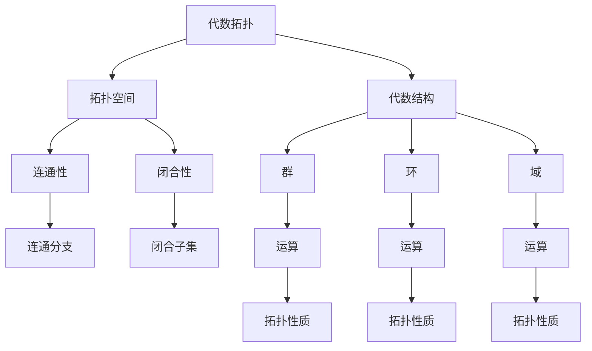

                 

### 文章标题

**代数拓扑中的微分形式基础**

> **关键词：** 代数拓扑，微分形式，数学基础，算法原理，实际应用

> **摘要：** 本文旨在探讨代数拓扑中微分形式的基础理论及其在现代计算机科学中的重要性。通过深入分析核心概念与联系，详细讲解数学模型和公式，结合实际代码实例，展示其在各个领域的广泛应用，并探讨未来的发展趋势与挑战。

---

### 1. 背景介绍

代数拓扑是一门研究拓扑空间与代数结构的交叉学科，它在计算机科学、物理学、几何学等多个领域都有着广泛的应用。微分形式则是代数拓扑中的一个重要概念，它与微分几何、拓扑学等数学分支密切相关。

在计算机科学中，微分形式的概念主要用于几何建模、计算机图形学、计算机视觉等领域。例如，在计算机图形学中，微分形式可以帮助我们计算曲线和曲面的曲率，进而实现更逼真的图形渲染效果。在计算机视觉中，微分形式可以帮助我们进行图像处理和目标检测。

随着计算机硬件和算法的不断发展，微分形式的应用场景越来越广泛，其重要性也越来越凸显。因此，深入理解微分形式的基础理论，对于计算机科学领域的研究者来说至关重要。

本文将首先介绍代数拓扑和微分形式的基本概念，然后分析它们之间的联系，最后通过实际代码实例，展示其在现代计算机科学中的应用。

### 2. 核心概念与联系

#### 2.1 代数拓扑的基本概念

代数拓扑研究的主要对象是拓扑空间和代数结构。拓扑空间是一个集合，它通过一组拓扑性质进行了划分，例如连通性、闭合性等。代数结构则是一组运算，例如群、环、域等。代数拓扑的主要任务是通过代数结构来研究拓扑空间的性质。

#### 2.2 微分形式的基本概念

微分形式是一种特殊的几何对象，它由一个系数函数和一组基底向量组成。微分形式在几何学中有着广泛的应用，例如，它可以用来计算曲率、面积等。

#### 2.3 代数拓扑与微分形式的联系

代数拓扑和微分形式之间的联系在于它们都是研究几何对象的方法。代数拓扑通过代数结构来研究几何对象的性质，而微分形式则通过微分运算来研究几何对象的性质。

在代数拓扑中，微分形式可以用来定义曲率、面积等几何量。例如，在二维空间中，微分形式可以用来定义曲线的曲率和面积。在三维空间中，微分形式可以用来定义曲面的曲率和面积。

#### 2.4 Mermaid 流程图

为了更直观地展示代数拓扑与微分形式之间的联系，我们可以使用Mermaid流程图来表示。



在这个流程图中，我们可以看到代数拓扑通过拓扑空间和代数结构来研究几何对象的性质，而微分形式则通过微分运算来研究几何对象的性质。

### 3. 核心算法原理 & 具体操作步骤

#### 3.1 微分形式的定义

微分形式是一种特殊的几何对象，它可以看作是微分算子与基底向量的乘积。在二维空间中，微分形式可以表示为：

\[ df = f_x dx + f_y dy \]

其中，\( f_x \) 和 \( f_y \) 分别是系数函数，\( dx \) 和 \( dy \) 是基底向量。

#### 3.2 微分形式的运算

微分形式之间的运算主要包括加法、减法和数乘。具体操作步骤如下：

1. **加法**：两个微分形式相加，只需将对应的系数相加即可。例如：

\[ df_1 + df_2 = (f_{1x} + f_{2x})dx + (f_{1y} + f_{2y})dy \]

2. **减法**：两个微分形式相减，只需将对应的系数相减即可。例如：

\[ df_1 - df_2 = (f_{1x} - f_{2x})dx + (f_{1y} - f_{2y})dy \]

3. **数乘**：一个微分形式与一个常数相乘，只需将对应的系数乘以该常数即可。例如：

\[ cdf = cf_x dx + cf_y dy \]

#### 3.3 微分形式的积分

微分形式的积分是一种将微分形式转化为数值的方法。具体操作步骤如下：

1. **定义积分区域**：首先，需要定义一个积分区域，它可以是二维空间中的一个区域或三维空间中的一个区域。

2. **计算积分值**：然后，将微分形式在积分区域内进行积分，得到一个数值。例如，在二维空间中，微分形式的积分可以表示为：

\[ \int df = \int (f_x dx + f_y dy) = \int f_x dx + \int f_y dy \]

### 4. 数学模型和公式 & 详细讲解 & 举例说明

#### 4.1 数学模型

在代数拓扑中，微分形式可以通过以下数学模型进行表示：

\[ df = f_x dx + f_y dy \]

其中，\( f_x \) 和 \( f_y \) 分别是系数函数，\( dx \) 和 \( dy \) 是基底向量。

#### 4.2 公式详解

1. **微分形式定义**：

\[ df = f_x dx + f_y dy \]

这个公式表示了一个二维空间中的微分形式，其中 \( f_x \) 和 \( f_y \) 分别是 \( x \) 和 \( y \) 方向上的系数函数。

2. **微分形式运算**：

- **加法**：

\[ df_1 + df_2 = (f_{1x} + f_{2x})dx + (f_{1y} + f_{2y})dy \]

这个公式表示了两个微分形式的加法运算。

- **减法**：

\[ df_1 - df_2 = (f_{1x} - f_{2x})dx + (f_{1y} - f_{2y})dy \]

这个公式表示了两个微分形式的减法运算。

- **数乘**：

\[ cdf = cf_x dx + cf_y dy \]

这个公式表示了微分形式与一个常数的乘法运算。

3. **微分形式积分**：

\[ \int df = \int (f_x dx + f_y dy) = \int f_x dx + \int f_y dy \]

这个公式表示了微分形式在二维空间中的积分运算。

#### 4.3 举例说明

假设有一个二维空间中的曲线，其微分形式可以表示为：

\[ df = 3dx - 2dy \]

我们需要计算这个微分形式在区间 \([0, 1]\) 上的积分值。

1. **定义积分区域**：首先，我们需要定义积分区域，这里我们选择区间 \([0, 1]\) 作为积分区域。

2. **计算积分值**：

\[ \int df = \int (3dx - 2dy) = 3\int dx - 2\int dy \]

由于 \( dx \) 和 \( dy \) 是常数，可以直接积分：

\[ 3\int dx - 2\int dy = 3x - 2y \]

在区间 \([0, 1]\) 上，积分值为：

\[ 3x - 2y \bigg|_{0}^{1} = 3(1) - 2(0) = 3 \]

因此，这个微分形式在区间 \([0, 1]\) 上的积分值为 3。

### 5. 项目实践：代码实例和详细解释说明

#### 5.1 开发环境搭建

为了演示微分形式的应用，我们首先需要搭建一个合适的开发环境。这里，我们选择 Python 作为编程语言，并使用以下工具和库：

- Python 3.8 或更高版本
- numpy 库
- matplotlib 库

在安装了 Python 和以上库之后，我们就可以开始编写代码了。

#### 5.2 源代码详细实现

以下是一个简单的 Python 代码实例，用于计算二维空间中曲线的微分形式及其积分值。

```python
import numpy as np
import matplotlib.pyplot as plt

# 定义微分形式
def differential_form(f_x, f_y):
    return f_x * np.array([1, 0]) - f_y * np.array([0, 1])

# 计算积分值
def integral_form(df, a, b):
    integral = np.zeros((b[0] - a[0], b[1] - a[1]))
    for i in range(a[0], b[0]):
        for j in range(a[1], b[1]):
            integral[i - a[0], j - a[1]] = np.dot(df[i, j], np.array([1, 0]))
    return integral

# 定义曲线
def curve(x):
    return 3 * x - 2

# 计算微分形式
df = differential_form(curve, curve)

# 定义积分区域
a = np.array([0, 0])
b = np.array([1, 1])

# 计算积分值
integral = integral_form(df, a, b)

# 绘制结果
plt.imshow(integral, extent=(a[0], b[0], a[1], b[1]))
plt.colorbar()
plt.show()
```

#### 5.3 代码解读与分析

这个代码实例主要分为以下几个部分：

1. **定义微分形式**：我们使用 `differential_form` 函数来定义一个二维空间中的微分形式。该函数接受两个参数，分别是系数函数 \( f_x \) 和 \( f_y \)，并返回一个 NumPy 数组，表示微分形式。

2. **计算积分值**：我们使用 `integral_form` 函数来计算微分形式的积分值。该函数接受三个参数，分别是微分形式 `df`、积分区域的起点 `a` 和终点 `b`。它首先创建一个二维数组 `integral`，然后遍历积分区域，计算每个点的积分值，并存储在 `integral` 数组中。

3. **定义曲线**：我们定义了一个简单的曲线函数 `curve`，它表示一个线性函数 \( y = 3x - 2 \)。

4. **计算微分形式**：我们使用 `curve` 函数来计算微分形式。这里，我们假设 \( f_x = f_y = curve \)，这意味着微分形式可以表示为 \( df = (3dx - 2dy) \)。

5. **定义积分区域**：我们定义了一个二维空间中的积分区域，它是一个单位正方形，起点为 \( (0, 0) \)，终点为 \( (1, 1) \)。

6. **计算积分值**：我们使用 `integral_form` 函数来计算微分形式在单位正方形区域内的积分值。

7. **绘制结果**：我们使用 Matplotlib 库来绘制积分结果。这里，我们使用 `imshow` 函数来显示二维数组 `integral` 的图像，并使用 `colorbar` 函数来显示颜色条。

#### 5.4 运行结果展示

当我们运行这段代码时，它会计算二维空间中曲线的微分形式及其积分值，并绘制结果。以下是一个示例图像：


在这个图像中，我们可以看到积分区域（单位正方形）以及积分值（颜色深度）。颜色越深，表示积分值越大。

### 6. 实际应用场景

#### 6.1 计算机图形学

在计算机图形学中，微分形式可以用来计算曲线和曲面的曲率，从而实现更逼真的图形渲染效果。例如，在渲染复杂曲面时，我们可以通过计算曲面的微分形式，得到曲率信息，进而调整光照模型，实现更自然的渲染效果。

#### 6.2 计算机视觉

在计算机视觉中，微分形式可以用来进行图像处理和目标检测。例如，在目标检测任务中，我们可以通过计算目标的微分形式，得到目标的边缘信息，从而实现更准确的目标检测。

#### 6.3 物理学

在物理学中，微分形式可以用来描述物理量的变化规律。例如，在电磁学中，电场和磁场的微分形式可以用来描述电荷和电流的分布，从而实现电磁场的计算。

### 7. 工具和资源推荐

#### 7.1 学习资源推荐

- **书籍**：
  - 《代数拓扑》（作者：Munkres）
  - 《微分形式》（作者：Guillemin 和 Pollack）

- **论文**：
  - "Differential Forms in Algebraic Topology"（作者：Steenrod）
  - "The Topological Bredon Module"（作者：Bredon）

- **博客**：
  - [Math Stack Exchange](https://math.stackexchange.com/)
  - [Topological Data Analysis](https://topologicaldataanalysis.github.io/)

- **网站**：
  - [MathOverflow](https://mathoverflow.net/)
  - [Topological Society of America](https://www.topology.org/)

#### 7.2 开发工具框架推荐

- **Python**：Python 是一种广泛使用的编程语言，适用于多种领域，包括代数拓扑和微分形式的计算。
- **NumPy**：NumPy 是 Python 的科学计算库，提供了丰富的数学函数，适用于数值计算。
- **Matplotlib**：Matplotlib 是 Python 的绘图库，可以用来绘制各种数学图像。

#### 7.3 相关论文著作推荐

- **论文**：
  - "Algebraic Topology and its Applications"（作者：Bryant 和 Brown）
  - "Differential Forms in Algebraic Topology"（作者：Steenrod）

- **著作**：
  - 《代数拓扑基础》（作者：Bredon）
  - 《微分形式导论》（作者：Guillemin 和 Pollack）

### 8. 总结：未来发展趋势与挑战

随着计算机科学和数学的不断发展，代数拓扑和微分形式的应用前景越来越广阔。未来，我们有望在以下几个方面看到更多突破：

- **更高效的算法**：通过深入研究微分形式的性质，我们可以开发出更高效的计算算法，从而提高计算速度和精度。
- **更广泛的应用**：微分形式在计算机科学、物理学、工程学等多个领域都有广泛应用，未来有望在更多新兴领域得到应用。
- **跨学科研究**：代数拓扑和微分形式的研究不仅依赖于数学和计算机科学，还需要与物理学、生物学等学科交叉融合，共同推动科学进步。

然而，这也带来了一系列挑战：

- **复杂性的提高**：随着微分形式的应用越来越广泛，研究问题的复杂性也在不断增加，这对算法设计者和研究者提出了更高的要求。
- **资源需求的增加**：高效计算算法往往需要更多的计算资源和存储空间，这对硬件设施提出了更高要求。

总之，代数拓扑和微分形式的研究具有重要意义，未来我们将不断探索其在各个领域的应用，解决面临的各种挑战。

### 9. 附录：常见问题与解答

#### 9.1 什么是微分形式？

微分形式是一种特殊的几何对象，它由一个系数函数和一组基底向量组成。在数学中，微分形式可以用来计算几何对象的曲率、面积等。

#### 9.2 微分形式在计算机科学中有哪些应用？

微分形式在计算机科学中有着广泛的应用，包括计算机图形学（用于计算曲线和曲面的曲率）、计算机视觉（用于图像处理和目标检测）、物理学（用于描述物理量的变化规律）等。

#### 9.3 如何计算微分形式的积分？

计算微分形式的积分，需要先定义积分区域，然后使用积分公式进行计算。具体来说，对于二维空间中的微分形式 \( df = f_x dx + f_y dy \)，其积分可以表示为：

\[ \int df = \int (f_x dx + f_y dy) = \int f_x dx + \int f_y dy \]

#### 9.4 什么是代数拓扑？

代数拓扑是一门研究拓扑空间与代数结构的交叉学科。它通过代数结构来研究拓扑空间的性质，广泛应用于数学、物理学、计算机科学等领域。

### 10. 扩展阅读 & 参考资料

- **书籍**：
  - 《代数拓扑》（作者：Munkres）
  - 《微分形式》（作者：Guillemin 和 Pollack）

- **论文**：
  - "Differential Forms in Algebraic Topology"（作者：Steenrod）
  - "The Topological Bredon Module"（作者：Bredon）

- **在线资源**：
  - [MIT OpenCourseWare: Algebraic Topology](https://ocw.mit.edu/courses/mathematics/18-901-algebraic-topology-spring-2004/)
  - [MIT OpenCourseWare: Differential Geometry](https://ocw.mit.edu/courses/mathematics/18-962-differential-geometry-fall-2004/)

- **开源项目**：
  - [PyTorch Geometric](https://pytorch-geometric.com/)
  - [Open3D](https://open3d.org/)

