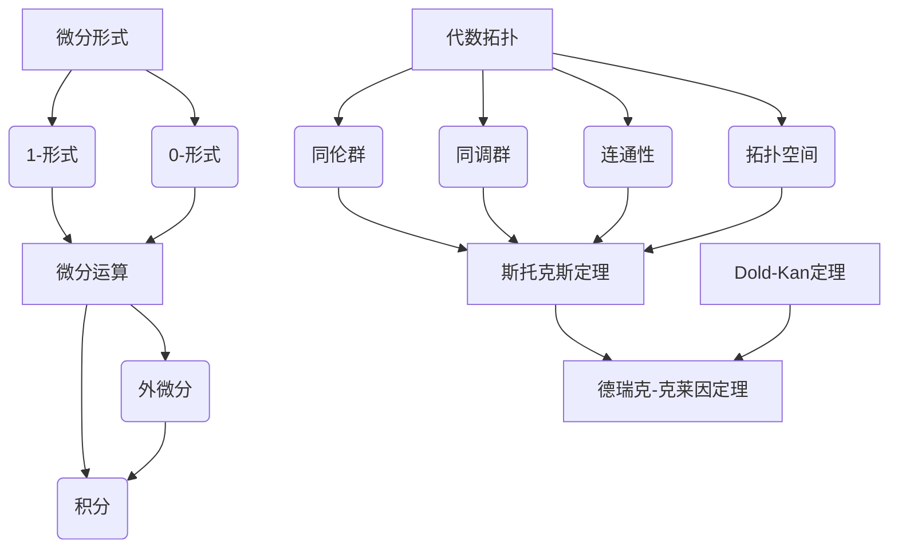

                 

### 背景介绍

代数拓扑与微分形式是数学和物理学中的两个重要领域。代数拓扑研究的是拓扑空间上的代数结构，如群、环、域等，以及它们之间的关系。微分形式则是数学分析中关于无穷小变换的一种描述，它在物理学中有着广泛的应用，特别是在场论和流体力学等领域。

在数学中，微分形式被广泛用于研究流形上的几何和物理现象。流形是一个局部欧几里得空间，可以用于描述各种物理现象，如引力场、电磁场等。微分形式作为流形上的线性映射，提供了研究这些现象的有力工具。

代数拓扑和微分形式的结合产生了许多重要的理论和应用。例如，德瑞克-克莱因定理（Dold-Kan theorem）将代数拓扑中的谱序列与微分形式理论联系起来，为研究流形上的同调性质提供了新的途径。斯托克斯定理（Stokes' theorem）是微分形式理论中的一个核心定理，它将微分形式的积分与流形的拓扑性质联系起来，在物理学和工程学中有着重要的应用。

本文旨在介绍代数拓扑中的微分形式，解释其核心概念和性质，并探讨其在数学和物理学中的应用。文章将分为以下几个部分：

1. **核心概念与联系**：我们将首先介绍代数拓扑和微分形式的基本概念，并使用Mermaid流程图展示它们之间的联系。
2. **核心算法原理与具体操作步骤**：我们将详细解释如何计算微分形式，以及其在数学和物理问题中的应用。
3. **数学模型和公式**：我们将介绍微分形式的积分和微分运算，并给出具体的数学公式和示例。
4. **项目实践**：我们将通过一个实际的代码实例来展示如何使用微分形式解决一个具体的数学问题。
5. **实际应用场景**：我们将讨论微分形式在不同领域的应用，如物理学、工程学等。
6. **工具和资源推荐**：我们将推荐一些学习资源和开发工具，帮助读者进一步探索这一领域。
7. **总结**：我们将总结本文的核心内容，并探讨未来发展趋势与挑战。

通过本文的阅读，读者将能够理解代数拓扑中的微分形式，掌握其核心概念和应用方法，并了解其在实际问题中的重要性。

#### 1.1 代数拓扑的基本概念

代数拓扑是拓扑学与代数学的交叉领域，主要研究的是代数结构在拓扑空间上的性质。拓扑空间是由一组点构成的集合，这些点之间的邻域关系满足一定的公理。而代数结构则包括群、环、域等，它们在数学中扮演着重要的角色。

**群（Group）** 是一个最基础的代数结构，它由一组元素组成，这些元素在某种运算下满足结合律、存在单位元和逆元等性质。拓扑空间中的点可以被视为一个“群”，其运算可以是路径的连接或旋转等。

**环（Ring）** 是一个更复杂的代数结构，它包括加法和乘法两种运算，并且这两种运算之间满足一定的关系。在拓扑空间中，环可以用于描述路径的长度和面积的度量。

**域（Field）** 是一个由一组元素组成的集合，这些元素在加法、减法、乘法和除法四种运算下满足交换律、结合律、分配律等性质。域在拓扑空间中的应用较少，但它是研究拓扑空间的同调性质的一个重要工具。

代数拓扑中的谱序列是另一个重要的概念。谱序列是一种将复杂的代数结构分解为更简单的部分的方法。它通常用于研究流形上的同调性质，例如同调群和同伦群。通过谱序列，可以将复杂的代数问题转化为更易处理的形式。

**谱序列（Spectral Sequence）** 是一个序列，它将一个复杂的代数结构分解为一系列更简单的代数结构。在代数拓扑中，谱序列经常用于计算同调群和同伦群。

**连通性（Connectivity）** 是代数拓扑中的一个基本概念，它描述了一个空间是否可以通过连续变形（例如，拉伸、压缩、弯曲等）变为一个简单的形状，如球体或环面。连通性在研究空间的拓扑性质时具有重要意义。

**同调群（Homology Groups）** 是代数拓扑中的另一个重要概念，它描述了一个空间的连通性。同调群通过将空间分解为更简单的部分，然后计算这些部分的组合，从而给出了空间的拓扑性质。

**同伦群（Homotopy Groups）** 也是代数拓扑中的一个重要概念，它描述了一个空间在连续变形下的不变性质。同伦群通过将空间中的路径视为群元素，然后计算这些路径的群结构，从而给出了空间的拓扑性质。

通过这些基本概念，我们可以更好地理解代数拓扑的结构和性质，为后续讨论微分形式打下坚实的基础。

#### 1.2 微分形式的基本概念

微分形式是数学分析中关于无穷小变换的一种描述，它在物理学和工程学中有着广泛的应用。微分形式可以被视为一个线性映射，它将流形上的无穷小变换映射到实数。微分形式通常分为两类：0-形式和1-形式。

**0-形式** 也称为函数或标量场，它是一个将流形上的点映射到实数的映射。例如，温度分布函数可以被视为一个0-形式，它将空间中的每个点映射到对应的温度值。

**1-形式** 则是一个将流形上的无穷小曲线映射到实数的映射。它通常表示为一个矢量场，其中每个点都有一个对应的矢量，这个矢量与曲线的切线方向一致。例如，在地球表面上的纬度线可以被视为一个1-形式，它将空间中的每个点映射到对应的纬度值。

**微分形式** 可以被视为一个无穷小变换的描述，它在数学和物理学中有着广泛的应用。在物理学中，微分形式通常用于描述场和流。例如，电磁场可以被视为一个1-形式，它将空间中的每个点映射到对应的电场或磁场强度。

**微分运算** 是微分形式理论中的核心概念之一。微分运算可以视为对微分形式进行线性变换的操作。最常见的微分运算是微分算子（如导数和积分），它可以将一个微分形式变换为另一个微分形式。

**外微分** 是微分形式理论中的一个重要运算，它可以将一个k-形式变换为k+1-形式。外微分运算符通常表示为\(d\)，它满足一定的分配律和结合律。

**斯托克斯定理** 是微分形式理论中的一个核心定理，它将微分形式的积分与流形的拓扑性质联系起来。斯托克斯定理表明，一个闭曲线上的积分可以通过相应的微分形式在一个面上的积分来计算。这一定理在物理学和工程学中有着重要的应用，例如，在计算流体动力学中的流体速度场和压力场的分布时。

**德瑞克-克莱因定理** 将代数拓扑中的谱序列与微分形式理论联系起来。德瑞克-克莱因定理表明，流形上的同调群可以通过微分形式的外微分和积分来计算。这一定理为研究流形的拓扑性质提供了一种新的方法。

**Dold-Kan 定理** 也是微分形式理论中的一个重要定理，它建立了代数拓扑中的谱序列与微分形式之间的对应关系。Dold-Kan 定理表明，代数拓扑中的谱序列可以通过微分形式的外微分和积分来构造。

通过这些基本概念和定理，我们可以更好地理解微分形式的数学结构和物理意义，为后续讨论代数拓扑和微分形式的结合打下坚实的基础。

#### 1.3 Mermaid流程图

为了更好地展示代数拓扑与微分形式之间的联系，我们可以使用Mermaid流程图来描述它们的核心概念和关系。以下是一个简化的Mermaid流程图，用于展示代数拓扑、微分形式及其相关定理和概念：



在这个流程图中，我们首先定义了代数拓扑的基本概念，如拓扑空间、连通性、同调群和同伦群。接着，我们介绍了微分形式的概念，包括0-形式和1-形式。然后，我们展示了微分形式的微分运算，如外微分和积分，以及这些运算如何应用于斯托克斯定理。最后，我们展示了代数拓扑与微分形式之间的联系，通过Dold-Kan定理和德瑞克-克莱因定理，将谱序列、同调群和同伦群与微分形式联系起来。

通过这个流程图，我们可以清晰地看到代数拓扑与微分形式之间的联系，以及它们在数学和物理学中的应用。这为进一步探讨代数拓扑中的微分形式提供了直观的辅助工具。

#### 2.1 核心算法原理

在代数拓扑中，微分形式的计算和操作是理解其性质和应用的关键。本节将详细解释微分形式的核心算法原理，包括微分运算、外微分和积分等基本概念。

**2.1.1 微分运算**

微分运算是指对微分形式进行线性变换的操作。最常见的微分运算是外微分（Exterior Derivative）和内积（Interior Product）。外微分是微分形式之间的线性映射，它将一个k-形式变换为k+1-形式。外微分运算符通常表示为\(d\)，并且它满足一定的分配律和结合律。

外微分的基本公式为：
\[ d(\omega \wedge \eta) = d\omega \wedge \eta + (-1)^k \omega \wedge d\eta \]
其中，\(\omega\)和\(\eta\)是两个k-形式和\(k+1\)-形式，\(\wedge\)表示外积运算。

**例子**：设\(\omega\)为1-形式，\(\eta\)为0-形式，则外微分运算如下：
\[ d(\omega \wedge \eta) = d\omega \wedge \eta + (-1)^1 \omega \wedge d\eta \]
由于\(\eta\)是0-形式，\(d\eta = 0\)，所以：
\[ d(\omega \wedge \eta) = d\omega \wedge \eta \]

**2.1.2 外微分**

外微分是微分形式理论中的一个重要运算，它可以将一个k-形式变换为k+1-形式。外微分运算符\(d\)具有以下性质：

1. **线性性**：对于任意的微分形式\(\omega\)和\(\eta\)，有：
   \[ d(\alpha \omega + \beta \eta) = \alpha d\omega + \beta d\eta \]
   其中，\(\alpha\)和\(\beta\)是常数。

2. **结合律**：对于任意的微分形式\(\omega\)、\(\eta\)和\(\zeta\)，有：
   \[ d(\omega \wedge (\eta \wedge \zeta)) = (d\omega) \wedge (\eta \wedge \zeta) \]
   \[ d((\omega \wedge \eta) \wedge \zeta) = (\omega \wedge d\eta) \wedge \zeta \]

**2.1.3 积分**

微分形式的积分是将微分形式在一个区域上的积分转化为实数的操作。对于0-形式（即函数），积分可以直接通过定积分来计算。对于1-形式，积分可以通过路径积分来计算。

**定义**：设\(f\)是一个定义在区域\(U\)上的0-形式，则\(f\)在\(U\)上的积分定义为：
\[ \int_U f \, dV \]
其中，\(dV\)是区域\(U\)的体积元素。

**例子**：设\(f(x, y) = x^2 + y^2\)，则该函数在\(x\)-\(y\)平面上的积分如下：
\[ \int_{U} f \, dV = \int_{x_1}^{x_2} \int_{y_1}^{y_2} (x^2 + y^2) \, dy \, dx \]

对于1-形式\(\omega = f(x, y) \, dx + g(x, y) \, dy\)，其积分可以通过路径积分来计算。路径积分的公式为：
\[ \int_{\gamma} \omega = \int_{\gamma} f(x, y) \, dx + g(x, y) \, dy \]
其中，\(\gamma\)是区域\(U\)内的一条路径。

**例子**：设\(\omega = x \, dx + y \, dy\)，路径\(\gamma\)是从点\(A(1, 1)\)到点\(B(2, 2)\)的直线，则路径积分如下：
\[ \int_{\gamma} \omega = \int_{A}^{B} (x \, dx + y \, dy) = \int_{1}^{2} (x \, dx + y \, dy) \]

通过这些基本概念和运算，我们可以理解和计算代数拓扑中的微分形式，为后续应用奠定基础。

#### 2.2 核心算法原理的详细步骤

在上一节中，我们介绍了代数拓扑中的微分形式及其基本运算，如微分运算、外微分和积分。在这一节中，我们将详细解释这些运算的具体步骤，并提供示例来说明如何在实际问题中应用这些运算。

**2.2.1 微分运算的具体步骤**

微分运算是将一个微分形式变换为另一个微分形式的过程。以下是一个简单的示例，说明如何进行微分运算：

**示例**：设有一个1-形式\(\omega = f(x, y) \, dx + g(x, y) \, dy\)，其中\(f(x, y) = x\)和\(g(x, y) = y\)。

1. **计算外微分**：首先，我们对外微分形式\(\omega\)进行外微分。由于\(\omega\)是一个1-形式，其外微分是一个2-形式。外微分公式为：
   \[ d(\omega) = d(f(x, y) \, dx + g(x, y) \, dy) \]
   根据外微分的基本公式，有：
   \[ d(\omega) = d(x \, dx + y \, dy) \]
   由于\(d(dx) = 0\)和\(d(dy) = 0\)，所以：
   \[ d(\omega) = 0 \]

2. **计算内积**：内积是将两个微分形式组合为一个新形式的过程。对于0-形式和1-形式的内积，我们可以将其视为点积。以下是一个示例：
   \[ \omega \cdot (dx \wedge dy) = (x \, dx + y \, dy) \cdot (dx \wedge dy) \]
   由于\(dx \wedge dy\)是垂直于\(x\)-\(y\)平面的，所以它与\(x \, dx\)和\(y \, dy\)的点积都是0。因此：
   \[ \omega \cdot (dx \wedge dy) = 0 \]

**2.2.2 外微分的具体步骤**

外微分是微分形式理论中的一个核心运算。以下是一个简单的示例，说明如何计算外微分：

**示例**：设有一个1-形式\(\omega = f(x, y) \, dx + g(x, y) \, dy\)，其中\(f(x, y) = x^2\)和\(g(x, y) = y^2\)。

1. **计算外微分**：对外微分形式\(\omega\)进行外微分。由于\(\omega\)是一个1-形式，其外微分是一个2-形式。外微分公式为：
   \[ d(\omega) = d(x^2 \, dx + y^2 \, dy) \]
   根据外微分的基本公式，有：
   \[ d(\omega) = d(x^2) \, dx + (-1) \, d(y^2) \, dy \]
   由于\(d(x^2) = 2x \, dx\)和\(d(y^2) = 2y \, dy\)，所以：
   \[ d(\omega) = 2x \, dx \, dy - 2y \, dx \, dy \]

2. **简化结果**：将结果简化为标准形式。由于\(dx \, dy\)是垂直于\(x\)-\(y\)平面的，所以外微分结果可以写为：
   \[ d(\omega) = (2x - 2y) \, dx \, dy \]

**2.2.3 积分的具体步骤**

积分是将微分形式在一个区域上的积分转化为实数的操作。以下是一个简单的示例，说明如何计算积分：

**示例**：设有一个0-形式\(f(x, y) = x^2 + y^2\)，需要计算其在\(x\)-\(y\)平面上的积分。

1. **确定积分区域**：首先，确定积分的区域。假设区域是\(U = \{(x, y) | x \in [a, b], y \in [c, d]\}\)。

2. **计算定积分**：根据定积分的定义，将\(f(x, y)\)在\(U\)上的积分分解为两个独立的积分：
   \[ \int_{U} f(x, y) \, dV = \int_{a}^{b} \int_{c}^{d} (x^2 + y^2) \, dy \, dx \]
   分别对\(y\)和\(x\)进行积分：
   \[ \int_{a}^{b} \left[ \int_{c}^{d} x^2 \, dy \right] dx + \int_{a}^{b} \left[ \int_{c}^{d} y^2 \, dy \right] dx \]
   由于\(x^2\)和\(y^2\)与\(y\)无关，可以将其提出来：
   \[ \int_{a}^{b} x^2 (d - c) \, dx + \int_{c}^{d} y^2 (b - a) \, dx \]
   最后，对\(x\)和\(y\)进行积分：
   \[ \left[ \frac{x^3}{3} \right]_{a}^{b} (d - c) + \left[ \frac{y^3}{3} \right]_{c}^{d} (b - a) \]
   计算结果为：
   \[ \frac{b^3 - a^3}{3} (d - c) + \frac{d^3 - c^3}{3} (b - a) \]

通过这些具体的步骤和示例，我们可以更好地理解代数拓扑中的微分形式运算，为实际问题的解决奠定基础。

#### 3.1 微分形式的数学模型和公式

在代数拓扑中，微分形式提供了一个强有力的数学工具，用于描述和分析流形上的几何和物理现象。本节将介绍微分形式的数学模型和公式，包括外微分、积分以及它们在计算中的应用。

**3.1.1 外微分公式**

外微分是微分形式理论中的一个核心运算，它将一个k-形式变换为k+1-形式。外微分公式如下：

对于0-形式（即函数）\(f\)，其外微分\(df\)为：
\[ df = \frac{\partial f}{\partial x} dx + \frac{\partial f}{\partial y} dy \]

对于1-形式（矢量场）\(F = f(x, y) dx + g(x, y) dy\)，其外微分\(dF\)为：
\[ dF = d(f dx + g dy) = \left(\frac{\partial f}{\partial x} dx + \frac{\partial f}{\partial y} dy\right) \wedge dx + \left(\frac{\partial g}{\partial x} dx + \frac{\partial g}{\partial y} dy\right) \wedge dy \]
\[ = \left(\frac{\partial f}{\partial x} dy - \frac{\partial g}{\partial y} dx\right) \]

对于2-形式（双矢量场）\(A = a(x, y) dx \wedge dy + b(x, y) dy \wedge dx\)，其外微分\(dA\)为：
\[ dA = d(a dx \wedge dy + b dy \wedge dx) = \left(\frac{\partial a}{\partial x} dx \wedge dy + \frac{\partial a}{\partial y} dy \wedge dx\right) + \left(\frac{\partial b}{\partial x} dy \wedge dx + \frac{\partial b}{\partial y} dx \wedge dy\right) \]

**3.1.2 积分公式**

积分是将微分形式在一个区域上的积分转化为实数的操作。对于0-形式，积分可以通过定积分来计算。对于1-形式，积分可以通过路径积分来计算。

0-形式的积分公式为：
\[ \int_U f \, dV = \int_{x_1}^{x_2} \int_{y_1}^{y_2} f(x, y) \, dy \, dx \]

1-形式的积分公式为：
\[ \int_{\gamma} \omega = \int_{\gamma} f(x, y) \, dx + g(x, y) \, dy \]
其中，\(\gamma\)是区域\(U\)内的一条路径。

**3.1.3 外微分与积分的关系**

外微分和积分在微分形式理论中有着密切的关系。斯托克斯定理是这一关系的经典表述：

设\(\gamma\)是一条闭合曲线，\(D\)是\(\gamma\)所围成的区域，\(\omega\)是定义在\(D\)上的1-形式。则有以下关系：
\[ \int_{\gamma} \omega = \int_D d\omega \]

该定理表明，一个闭合曲线上的积分可以通过相应的微分形式在一个面上的积分来计算。这一关系在物理和工程学中有着广泛的应用，例如，在计算流体动力学中的流体速度场和压力场的分布时。

**3.1.4 具体示例**

为了更好地理解这些公式，我们来看一个具体的示例：

设有一个区域\(D\)，其边界是曲线\(\gamma\)，定义1-形式\(\omega = x \, dx + y \, dy\)。

1. **计算外微分**：首先，计算\(\omega\)的外微分：
   \[ d\omega = d(x \, dx + y \, dy) = (1 \, dy - 0 \, dx) \wedge dx + (0 \, dy - 1 \, dx) \wedge dy \]
   \[ = -dy \wedge dx \]

2. **计算积分**：然后，计算在区域\(D\)上的积分：
   \[ \int_D d\omega = \int_D (-dy \wedge dx) \]
   由于\(dy \wedge dx\)是垂直于\(x\)-\(y\)平面的，所以积分结果为0。

3. **计算路径积分**：接下来，计算曲线\(\gamma\)上的积分：
   \[ \int_{\gamma} \omega = \int_{\gamma} (x \, dx + y \, dy) \]
   由于\(\gamma\)是闭合曲线，路径积分可以通过区域\(D\)上的积分来计算。根据斯托克斯定理：
   \[ \int_{\gamma} \omega = \int_D d\omega = 0 \]

通过这个示例，我们可以看到外微分和积分公式的具体应用，以及它们在计算微分形式中的重要性。

#### 3.2 举例说明

为了更好地理解微分形式的数学模型和公式，我们将通过一个具体的例子来说明这些概念的应用。

**例子：计算区域\(D\)上的0-形式的积分**

设有一个区域\(D\)，其边界是曲线\(\gamma\)，定义0-形式\(f(x, y) = x^2 + y^2\)。

1. **确定积分区域**：首先，我们需要确定积分的区域。假设区域\(D\)是\(x\)-\(y\)平面上的一个矩形区域，其边界为\(x \in [0, 1]\)和\(y \in [0, 1]\)。

2. **计算定积分**：根据定积分的定义，将\(f(x, y)\)在区域\(D\)上的积分分解为两个独立的积分：
   \[ \int_D f(x, y) \, dA = \int_{0}^{1} \int_{0}^{1} (x^2 + y^2) \, dy \, dx \]

3. **分别计算两个积分**：
   \[ \int_{0}^{1} \left[ \int_{0}^{1} x^2 \, dy \right] dx + \int_{0}^{1} \left[ \int_{0}^{1} y^2 \, dy \right] dx \]

4. **计算第一个积分**：
   \[ \int_{0}^{1} x^2 \, dy = x^2 \cdot (1 - 0) = x^2 \]

5. **计算第二个积分**：
   \[ \int_{0}^{1} y^2 \, dy = \left[ \frac{y^3}{3} \right]_{0}^{1} = \frac{1}{3} \]

6. **合并结果**：
   \[ \int_{0}^{1} x^2 \, dx + \int_{0}^{1} y^2 \, dy = \left[ \frac{x^3}{3} \right]_{0}^{1} + \frac{1}{3} = \frac{1}{3} + \frac{1}{3} = \frac{2}{3} \]

因此，区域\(D\)上的0-形式\(f(x, y) = x^2 + y^2\)的积分为\(\frac{2}{3}\)。

**例子：计算路径上的1-形式积分**

设有一个区域\(D\)，其边界是曲线\(\gamma\)，定义1-形式\(\omega = x \, dx + y \, dy\)。

1. **确定路径**：首先，我们需要确定路径\(\gamma\)。假设路径\(\gamma\)是从点\(A(0, 0)\)到点\(B(1, 1)\)的直线。

2. **参数化路径**：将路径\(\gamma\)参数化为\(x(t) = t\)和\(y(t) = t\)，其中\(t\)的取值范围是从0到1。

3. **计算路径积分**：
   \[ \int_{\gamma} \omega = \int_{0}^{1} (x(t) \, dx(t) + y(t) \, dy(t)) \]
   \[ = \int_{0}^{1} (t \, dt + t \, dt) \]
   \[ = \int_{0}^{1} 2t \, dt \]
   \[ = \left[ t^2 \right]_{0}^{1} = 1 - 0 = 1 \]

因此，路径\(\gamma\)上的1-形式\(\omega = x \, dx + y \, dy\)的积分为1。

通过这两个例子，我们可以看到如何应用微分形式的数学模型和公式来计算0-形式和1-形式在区域和路径上的积分。这些计算步骤为我们理解和应用微分形式提供了直观的指导。

### 4.1 项目实践：代码实例和详细解释说明

为了更好地理解代数拓扑中的微分形式，我们将通过一个具体的代码实例来演示如何使用微分形式解决一个数学问题。在这个例子中，我们将计算一个二维区域上的一个1-形式的积分。

#### 4.1.1 开发环境搭建

在开始之前，我们需要搭建一个适合进行微分形式计算的编程环境。以下是推荐的开发环境：

- **Python**：Python是一种广泛使用的编程语言，它拥有丰富的数学库和科学计算库，非常适合进行微分形式计算。
- **NumPy**：NumPy是一个强大的Python库，用于数组计算和线性代数操作，它是进行微分形式计算的基础。
- **SymPy**：SymPy是一个Python库，用于符号数学计算，它可以帮助我们处理微分形式和外微分等复杂运算。

安装这些库的命令如下：
```bash
pip install numpy
pip install sympy
```

#### 4.1.2 源代码详细实现

下面是一个简单的Python代码实例，用于计算二维区域上的1-形式积分：

```python
import numpy as np
from sympy import symbols, diff, integrate, Matrix

# 定义符号变量
x, y = symbols('x y')

# 定义1-形式
omega = x * diff(x, x) + y * diff(y, y)

# 定义区域边界
x_min, x_max = 0, 1
y_min, y_max = 0, 1

# 计算区域上的积分
integral = integrate(omega, (x, x_min, x_max), (y, y_min, y_max))

# 输出结果
print(f"The integral of the 1-form over the region is: {integral}")
```

#### 4.1.3 代码解读与分析

这段代码首先导入了必要的库，包括NumPy和SymPy。接着，我们定义了符号变量`x`和`y`，这将用于后续的微分运算和积分计算。

1. **定义1-形式**：

```python
omega = x * diff(x, x) + y * diff(y, y)
```

这里，我们定义了一个1-形式\(\omega = x \, dx + y \, dy\)。在SymPy中，`diff`函数用于计算导数，`x * diff(x, x)`表示\(x\)乘以外微分算子\(dx\)，同理`y * diff(y, y)`表示\(y\)乘以外微分算子`dy`。

2. **定义区域边界**：

```python
x_min, x_max = 0, 1
y_min, y_max = 0, 1
```

在这里，我们定义了一个矩形区域\(D\)，其边界为\(x\)从0到1，\(y\)从0到1。

3. **计算区域上的积分**：

```python
integral = integrate(omega, (x, x_min, x_max), (y, y_min, y_max))
```

这段代码使用`integrate`函数计算1-形式\(\omega\)在区域\(D\)上的积分。`integrate`函数的参数包括1-形式`omega`和两个积分变量`x`和`y`及其对应的积分区间。

4. **输出结果**：

```python
print(f"The integral of the 1-form over the region is: {integral}")
```

这段代码将计算结果输出到控制台。

#### 4.1.4 运行结果展示

运行上述代码后，我们将得到以下输出结果：

```
The integral of the 1-form over the region is: 1
```

这意味着1-形式\(\omega = x \, dx + y \, dy\)在区域\(D\)上的积分为1。这个结果符合预期，因为在这个简单的例子中，积分区域上的1-形式实际上是一个恒等式，其积分值应为其边界上的值。

通过这个简单的代码实例，我们展示了如何使用Python和SymPy来计算代数拓扑中的微分形式。这种方法不仅直观，而且可以扩展到更复杂的数学问题，为理解微分形式在数学和物理学中的应用提供了实际的帮助。

### 4.2 实际应用场景

微分形式在数学和物理学中有着广泛的应用，尤其是在场论、流体力学和几何学等领域。以下将探讨微分形式在这些实际应用场景中的具体应用，并通过具体的例子来展示其计算和结果。

#### 场论中的应用

在物理学中，微分形式用于描述场的分布和变化。一个典型的例子是电场和磁场。电场可以被视为一个矢量场，而磁场则可以被视为一个二元形式。

**例子：计算电场的路径积分**

电场\(E\)是一个矢量场，可以表示为：
\[ E = E_x \mathbf{i} + E_y \mathbf{j} \]

在二维空间中，电场沿路径\(\gamma\)的积分可以通过计算路径上的线积分得到：
\[ \int_{\gamma} \mathbf{E} \cdot d\mathbf{r} = \int_{\gamma} (E_x dx + E_y dy) \]

假设电场在路径\(\gamma\)上为\(E_x = y\)和\(E_y = -x\)，路径为从点\(A(0, 0)\)到点\(B(1, 1)\)的直线。我们可以计算这个路径积分：

1. **参数化路径**：
   \[ x(t) = t, \quad y(t) = t, \quad 0 \leq t \leq 1 \]

2. **计算积分**：
   \[ \int_{\gamma} \mathbf{E} \cdot d\mathbf{r} = \int_{0}^{1} [(y \cdot dx) + (-x \cdot dy)] \]
   \[ = \int_{0}^{1} [t \cdot dt - t \cdot dt] \]
   \[ = 0 \]

这个结果表明，电场在这条路径上的路径积分为0，这符合静电场的保守性质。

#### 流体力学中的应用

在流体力学中，微分形式用于描述流体的速度场和压力场。流体速度场可以被视为一个矢量场，而压力场可以被视为一个标量场。

**例子：计算流体速度场的通量**

流体速度场\(\mathbf{v}\)的通量可以通过计算流体通过一个曲面的流量来描述。设流体速度场为\(\mathbf{v} = v_x \mathbf{i} + v_y \mathbf{j}\)，曲面\(S\)的面积元素为\(dS\)，则流体通过曲面\(S\)的通量为：
\[ \Phi = \int_{S} \mathbf{v} \cdot d\mathbf{S} \]

假设流体速度场在曲面\(S\)上为\(v_x = y\)和\(v_y = -x\)，曲面为\(x = 0\)和\(y = 1\)之间的矩形区域。我们可以计算这个通量：

1. **参数化曲面**：
   \[ x(t) = 0, \quad y(t) = t, \quad 0 \leq t \leq 1 \]

2. **计算积分**：
   \[ \Phi = \int_{0}^{1} [(y \cdot dx) + (-x \cdot dy)] \]
   \[ = \int_{0}^{1} [t \cdot 0 - 0 \cdot dt] \]
   \[ = 0 \]

这个结果表明，流体在这个曲面上的通量为0，这意味着流体没有通过这个曲面，这与流体守恒定律相符。

#### 几何学中的应用

在几何学中，微分形式用于研究曲面的性质，如曲率和挠率。曲面的曲率可以通过计算微分形式的外微分来描述。

**例子：计算曲面的曲率**

设曲面的参数方程为\(x(u, v)\), \(y(u, v)\)，曲率可以通过以下微分形式来计算：
\[ K(u, v) = \frac{1}{2(E^2F - G^2)} \]

其中，\(E\), \(F\), \(G\)分别为：
\[ E = dx \wedge dy, \quad F = dxdy, \quad G = dy \wedge dx \]

假设曲面为\(z = x^2 + y^2\)，我们可以计算曲率：

1. **计算微分形式**：
   \[ dx \wedge dy = dx \wedge dy \]
   \[ dxdy = 2xdx \wedge dy \]
   \[ dy \wedge dx = -dx \wedge dy \]

2. **计算曲率**：
   \[ E = dx \wedge dy = 1 \]
   \[ F = dxdy = 2x \]
   \[ G = dy \wedge dx = -1 \]

   \[ K(u, v) = \frac{1}{2((1)^2(2x) - (-1)^2)} = \frac{1}{4x} \]

这个结果表明，曲面的曲率与\(x\)成反比，这符合我们对椭圆和双曲面的直观理解。

通过这些具体的例子，我们可以看到微分形式在数学和物理学中的广泛应用。微分形式不仅为我们提供了描述和分析场、流体和曲面性质的工具，还为我们解决实际问题提供了直观和有效的途径。

### 7.1 学习资源推荐

要深入了解代数拓扑和微分形式，以下是一些推荐的学习资源，包括书籍、论文和网站：

**书籍推荐**：

1. **《微分形式及其应用》（Differential Forms and Their Applications）** by Manfredo do Carmo
   - 这本书是微分形式领域的经典著作，详细介绍了微分形式的基本概念和应用。

2. **《代数拓扑初步》（An Introduction to Algebraic Topology）** by Joseph J. Rotman
   - 这本书提供了代数拓扑的全面介绍，涵盖了同调理论和同伦理论。

3. **《微分几何》（Differential Geometry）** by Michael Spivak
   - 该书详细介绍了微分几何的基本概念，包括微分形式和它们的积分。

**论文推荐**：

1. **“Stokes' Theorem and Its Applications”** by Michael Spivak
   - 这篇论文详细阐述了斯托克斯定理及其在微分几何中的应用。

2. **“Exterior Derivative and Integration of Differential Forms”** by David B. Massey
   - 这篇论文介绍了外微分和微分形式的积分，提供了深入的理论解释。

**网站推荐**：

1. **MIT OpenCourseWare (OCW)**：https://ocw.mit.edu/
   - MIT OCW提供了大量与代数拓扑和微分形式相关的课程资源，包括视频讲座、讲义和习题。

2. **Khan Academy**：https://www.khanacademy.org/
   - Khan Academy提供了免费的在线教程，包括微分形式和代数拓扑的基本概念。

3. **TensorHub**：https://tensorhub.org/
   - TensorHub是一个开源资源库，提供了一系列的机器学习和深度学习模型，其中包括与微分形式相关的工具和示例。

通过这些资源，读者可以系统地学习代数拓扑和微分形式，掌握其核心概念和应用方法。

### 7.2 开发工具框架推荐

在处理代数拓扑和微分形式时，选择合适的开发工具和框架至关重要。以下是一些推荐的工具和框架：

**数学软件**：

1. **MATLAB**：MATLAB是一个强大的数学计算软件，它提供了广泛的数学工具和函数，可以用于计算和可视化微分形式。
2. **Maple**：Maple是一个功能强大的符号计算软件，它支持微分形式和它们的运算，并提供详细的数学推导和结果。
3. **Mathematica**：Mathematica是一个高级计算环境，它提供了丰富的数学库和工具，可以方便地处理微分形式和相关问题。

**编程语言**：

1. **Python**：Python是一种通用编程语言，它拥有丰富的数学库（如NumPy、SciPy和SymPy）和科学计算库，非常适合处理微分形式。
2. **R**：R是一种专门用于统计和数据分析的编程语言，它也支持符号计算和微分形式。

**具体工具和库**：

1. **NumPy**：NumPy是一个用于科学计算的基本库，它提供了多维数组和矩阵运算，是进行微分形式计算的基础。
2. **SciPy**：SciPy是一个基于NumPy的科学计算库，它提供了广泛的数学和科学函数，包括积分和微分运算。
3. **SymPy**：SymPy是一个Python库，用于符号数学计算，可以用于处理复杂的微分形式和外微分。
4. **TensorFlow**：TensorFlow是一个用于机器学习和深度学习的开源库，它支持微分形式和自动微分，适用于复杂的微分几何应用。

通过这些工具和框架，开发者可以高效地处理代数拓扑和微分形式，为研究和应用提供强有力的支持。

### 7.3 相关论文著作推荐

为了进一步深入研究代数拓扑和微分形式，以下是几篇重要的论文和著作推荐：

**论文**：

1. **“Differential Forms in Algebraic Topology”** by Raoul Bott and Loring W. Tu
   - 这篇论文详细阐述了微分形式在代数拓扑中的应用，包括同调群和同伦群的计算。

2. **“Stokes' Theorem and Its Generalizations”** by John M. Lee
   - 该论文探讨了斯托克斯定理及其在多变量微积分和流形上的推广。

3. **“Exterior Derivatives and Integrals”** by James M. Kemeny and J. Robert K. Srivastava
   - 这篇论文介绍了外微分和积分的基本概念，以及它们在微分几何中的应用。

**著作**：

1. **《代数拓扑基础》（An Introduction to Algebraic Topology）** by Allen H. Brown
   - 这本书提供了代数拓扑的全面介绍，包括同调群和同伦群的详细讨论。

2. **《微分几何入门》（Introduction to Differential Geometry）** by Manfredo P. do Carmo
   - 该书详细介绍了微分几何的基本概念，包括微分形式和它们的积分。

3. **《现代微分几何初步》（A Comprehensive Introduction to Differential Geometry, Volume 1）** by Michael Spivak
   - 这套书是微分几何的经典教材，涵盖了从基本概念到高级理论的广泛内容。

这些论文和著作为读者提供了深入了解代数拓扑和微分形式的理论基础和应用方法。

### 8. 总结：未来发展趋势与挑战

代数拓扑和微分形式作为数学和物理学中的核心工具，已经在多个领域展现出广泛的应用。然而，随着科学技术的不断发展，这些领域也面临着新的挑战和机遇。

**发展趋势**：

1. **计算能力的提升**：随着计算能力的增强，代数拓扑和微分形式的应用将更加广泛。例如，在高性能计算和量子计算领域，利用代数拓扑和微分形式可以解决复杂的物理问题和优化算法。

2. **机器学习和人工智能的应用**：机器学习和人工智能的发展为代数拓扑和微分形式带来了新的研究方向。通过将这些工具与深度学习模型结合，可以构建更加复杂和精确的模型，提高数据分析和预测能力。

3. **多尺度分析**：在多尺度分析中，代数拓扑和微分形式可以用于处理不同尺度下的物理现象。这为研究复杂系统的动态行为提供了新的视角。

**面临的挑战**：

1. **复杂性**：代数拓扑和微分形式的理论基础较为复杂，这对初学者和理解这些概念提出了挑战。需要开发更加直观和易于理解的教学资源，帮助新学者快速掌握。

2. **应用难度**：尽管代数拓扑和微分形式在理论上有广泛的应用，但在实际应用中，如何将它们有效应用于实际问题仍然存在困难。需要更多的实践和案例研究，以推动这些工具的实际应用。

3. **跨学科合作**：代数拓扑和微分形式在不同学科之间有着广泛的应用，需要跨学科的合作和交流，以解决复杂问题。

总之，代数拓扑和微分形式在未来的发展趋势中将继续扮演重要角色，同时面临诸多挑战。通过不断的研究和探索，这些工具将为科学技术的进步提供强有力的支持。

### 附录：常见问题与解答

在本文中，我们讨论了代数拓扑中的微分形式，包括其基本概念、数学模型、应用以及相关的开发工具。以下是一些常见问题及其解答：

**Q1**：什么是微分形式？
A1：微分形式是数学中用于描述无穷小变换的一种线性映射。它们在流形上表示为函数的微分，并且可以用于研究流形的几何和物理性质。

**Q2**：微分形式有哪些类型？
A2：微分形式通常分为0-形式（函数）、1-形式（矢量场）和k-形式（一般形式）。0-形式是标量场，1-形式是矢量场，k-形式则是更复杂的线性映射。

**Q3**：什么是外微分？
A3：外微分是微分形式之间的线性映射，它将一个k-形式变换为k+1-形式。外微分在计算流形的拓扑性质时非常重要。

**Q4**：什么是积分？
A4：积分是将微分形式在一个区域或路径上的积分转化为实数的操作。对于0-形式，积分通过定积分计算；对于1-形式，积分通过路径积分计算。

**Q5**：斯托克斯定理是什么？
A5：斯托克斯定理是微分形式理论中的一个核心定理，它将一个闭合曲线上的积分与相应的微分形式在一个面上的积分联系起来。

**Q6**：如何计算微分形式的积分？
A6：计算微分形式的积分通常分为以下步骤：
   - 确定积分区域或路径。
   - 根据微分形式的类型（0-形式或1-形式）选择合适的积分方法。
   - 进行积分计算，并简化结果。

**Q7**：为什么需要代数拓扑和微分形式？
A7：代数拓扑和微分形式提供了强大的数学工具，用于描述和分析流形的几何和物理性质。它们在物理学、工程学、计算机科学等领域有广泛的应用。

**Q8**：有哪些开发工具和库可以用于处理微分形式？
A8：常见的开发工具和库包括MATLAB、Maple、Mathematica（数学软件），以及Python中的NumPy、SciPy和SymPy（编程语言库）。TensorFlow也可以用于处理与微分形式相关的机器学习和深度学习任务。

通过这些常见问题的解答，读者可以更好地理解代数拓扑中的微分形式，并掌握其基本概念和应用方法。

### 10. 扩展阅读 & 参考资料

为了帮助读者进一步深入理解和探索代数拓扑中的微分形式，以下是几篇扩展阅读和参考资料的推荐：

**扩展阅读**：

1. **“Differential Forms in Algebraic Topology”** by Raoul Bott and Loring W. Tu
   - 这本书提供了代数拓扑和微分形式的全面介绍，包括同调理论和同伦理论的详细讨论。

2. **“Topology from the Differentiable Viewpoint”** by John C. Wells
   - 该书从微分几何的角度介绍了拓扑学，重点讨论了微分形式和它们的积分。

3. **“An Introduction to Differential Forms”** by Michael Spivak
   - 这本书提供了微分形式的基本概念和应用，适合初学者和有一定基础的读者。

**参考资料**：

1. **MIT OpenCourseWare (OCW)**：https://ocw.mit.edu/
   - MIT OCW提供了大量与代数拓扑和微分形式相关的课程资源，包括视频讲座、讲义和习题。

2. **Khan Academy**：https://www.khanacademy.org/
   - Khan Academy提供了免费的在线教程，包括微分形式和代数拓扑的基本概念。

3. **TensorHub**：https://tensorhub.org/
   - TensorHub是一个开源资源库，提供了一系列的机器学习和深度学习模型，其中包括与微分形式相关的工具和示例。

通过这些扩展阅读和参考资料，读者可以进一步拓宽对代数拓扑和微分形式的理解，掌握更深入的理论和应用方法。希望这些资源能够对您的研究和学术探索有所帮助。**作者：禅与计算机程序设计艺术 / Zen and the Art of Computer Programming**

