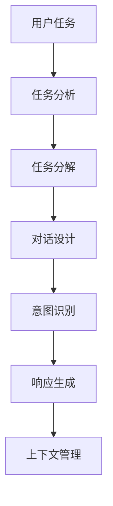
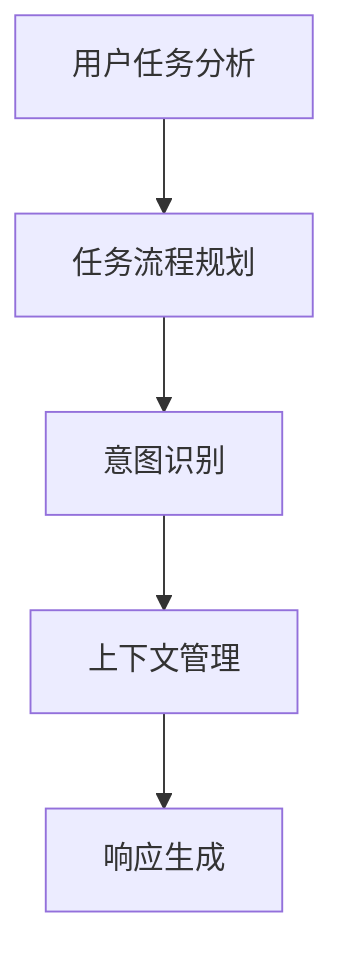

                 

### 文章标题

《任务导向设计思维在CUI中的详细应用》

> **关键词**：任务导向设计、CUI（ Conversational User Interface）、设计思维、用户体验、交互设计、人工智能、自然语言处理、系统架构。

> **摘要**：本文深入探讨了任务导向设计思维在构建对话式用户界面（CUI）中的关键作用。通过介绍任务导向设计的基本概念、核心原理及其与CUI的紧密联系，文章详细剖析了任务导向设计思维在CUI架构、算法、数学模型、项目实践和实际应用场景中的应用。同时，文章还推荐了相关的学习资源和开发工具，并对未来的发展趋势和挑战进行了展望。**

---

### 1. 背景介绍

随着人工智能和自然语言处理技术的不断进步，对话式用户界面（Conversational User Interface，简称CUI）逐渐成为现代软件应用的重要组成部分。CUI通过模拟人类对话的方式，为用户提供更加自然、便捷的交互体验。然而，构建一个高效、易用的CUI并非易事，它需要深入理解用户需求、设计合理的对话流程、处理复杂的上下文信息以及提供准确的响应。

任务导向设计（Task-Oriented Design）作为一种系统化的设计方法，强调以用户的任务为核心，通过分析、规划和实现，优化用户完成任务的过程。这种方法在传统界面设计中被广泛应用，而在CUI的设计中，其重要性更为凸显。任务导向设计思维能够帮助设计者更好地理解用户的实际需求，设计出既符合用户期望又具有高可用性的CUI。

本文旨在探讨任务导向设计思维在CUI中的详细应用，包括核心概念、原理、架构、算法、数学模型、项目实践和实际应用场景。通过本文的阅读，读者将了解到如何将任务导向设计思维应用于CUI的各个环节，从而提升用户体验，实现高效的交互设计。

### 2. 核心概念与联系

#### 任务导向设计思维

任务导向设计思维是一种以用户任务为中心的设计方法。它强调在设计和开发过程中，始终围绕用户的目标任务进行，通过分析用户任务、设计任务流程、优化任务执行过程，最终实现用户任务的高效完成。

核心概念包括：

1. **用户任务**：用户希望通过交互界面达成的目标。
2. **任务流程**：用户在完成特定任务时所需采取的一系列步骤。
3. **任务分解**：将复杂任务分解为一系列子任务，便于管理和优化。
4. **任务反馈**：用户在任务执行过程中接收到的反馈信息，用以调整任务执行方向。

#### 对话式用户界面（CUI）

对话式用户界面是一种通过模拟人类对话来与用户进行交互的界面。CUI的特点是使用自然语言进行交流，用户可以通过文字或语音与系统进行对话，从而完成特定的任务。

核心概念包括：

1. **会话**：CUI与用户之间的交互过程。
2. **上下文**：影响对话内容和方向的相关信息，如用户的历史行为、对话历史等。
3. **意图识别**：理解用户的输入，确定用户的意图。
4. **响应生成**：根据用户的意图生成合适的响应。

#### 任务导向设计思维与CUI的联系

任务导向设计思维与CUI之间存在紧密的联系，主要体现在以下几个方面：

1. **任务分析**：通过任务导向设计思维，深入分析用户完成任务的需求和流程，为CUI的设计提供基础。
2. **意图识别**：任务导向设计思维强调理解用户任务，这与CUI中的意图识别过程密切相关。
3. **对话设计**：任务导向设计思维可以帮助设计者设计出更符合用户需求的对话流程，提高CUI的易用性。
4. **上下文管理**：任务导向设计思维中的任务反馈和上下文管理机制，有助于CUI更好地处理复杂的对话上下文。

以下是一个简单的Mermaid流程图，展示了任务导向设计思维与CUI之间的联系：



### 3. 核心算法原理 & 具体操作步骤

#### 任务导向设计思维在CUI中的核心算法原理

任务导向设计思维在CUI中的应用，主要依赖于以下几个核心算法：

1. **用户任务分析算法**：用于识别和描述用户需要完成的任务。
2. **任务流程规划算法**：用于设计用户完成任务所需的步骤。
3. **意图识别算法**：用于理解用户的输入并确定用户的意图。
4. **上下文管理算法**：用于处理对话过程中的上下文信息。

#### 用户任务分析算法

用户任务分析算法的核心目标是识别和理解用户需要完成的任务。具体操作步骤如下：

1. **用户需求分析**：通过与用户的交流，收集用户的需求信息。
2. **任务识别**：从用户需求中提取具体的任务。
3. **任务描述**：将识别出的任务进行详细描述，包括任务的输入、输出和执行步骤。

#### 任务流程规划算法

任务流程规划算法用于设计用户完成任务所需的步骤。具体操作步骤如下：

1. **任务分解**：将复杂任务分解为一系列子任务。
2. **步骤设计**：为每个子任务设计具体的执行步骤。
3. **步骤优化**：根据用户反馈和系统性能，对任务流程进行优化。

#### 意图识别算法

意图识别算法是CUI的核心，用于理解用户的输入并确定用户的意图。具体操作步骤如下：

1. **输入处理**：对用户的输入进行预处理，如分词、去噪等。
2. **意图分类**：使用机器学习模型，对预处理后的输入进行意图分类。
3. **意图调整**：根据上下文信息和用户历史行为，调整意图分类结果。

#### 上下文管理算法

上下文管理算法用于处理对话过程中的上下文信息，确保对话的连贯性和准确性。具体操作步骤如下：

1. **上下文收集**：在对话过程中收集用户的上下文信息。
2. **上下文存储**：将收集到的上下文信息存储在数据库或缓存中。
3. **上下文应用**：在生成响应时，根据上下文信息调整对话内容和方向。

#### 算法流程图

以下是一个简单的Mermaid流程图，展示了任务导向设计思维在CUI中的核心算法流程：



### 4. 数学模型和公式 & 详细讲解 & 举例说明

在任务导向设计思维中，数学模型和公式扮演着重要的角色，尤其是在任务分析和意图识别阶段。以下将介绍一些关键的数学模型和公式，并提供详细的讲解和举例说明。

#### 1. 决策树模型

决策树是一种常用的分类模型，用于根据特征进行决策。在任务导向设计思维中，决策树可以用于任务分析和意图识别。

**公式：**
\[ P(\text{意图} = c_k | \text{特征} = x) = \frac{N_{k,x}}{N_x} \]
其中，\( P(\text{意图} = c_k | \text{特征} = x) \) 表示在特征 \( x \) 下，意图为 \( c_k \) 的概率；\( N_{k,x} \) 表示特征 \( x \) 和意图 \( c_k \) 同时出现的次数；\( N_x \) 表示特征 \( x \) 出现的总次数。

**举例：**
假设我们要识别用户的意图，根据用户的历史数据和当前输入特征，我们可以使用决策树模型计算每个意图的概率，然后选择概率最大的意图作为最终结果。

#### 2. 贝叶斯网络模型

贝叶斯网络是一种概率图模型，用于表示变量之间的条件依赖关系。在任务导向设计思维中，贝叶斯网络可以用于上下文管理和意图识别。

**公式：**
\[ P(\text{意图} = c_k | \text{上下文} = x_1, x_2, ..., x_n) = \frac{P(\text{上下文} = x_1, x_2, ..., x_n | \text{意图} = c_k) P(\text{意图} = c_k)}{P(\text{上下文} = x_1, x_2, ..., x_n)} \]
其中，\( P(\text{意图} = c_k | \text{上下文} = x_1, x_2, ..., x_n) \) 表示在给定上下文 \( x_1, x_2, ..., x_n \) 下，意图为 \( c_k \) 的概率；\( P(\text{上下文} = x_1, x_2, ..., x_n | \text{意图} = c_k) \) 表示在意图为 \( c_k \) 的条件下，上下文 \( x_1, x_2, ..., x_n \) 出现的概率；\( P(\text{意图} = c_k) \) 表示意图为 \( c_k \) 的先验概率；\( P(\text{上下文} = x_1, x_2, ..., x_n) \) 表示上下文 \( x_1, x_2, ..., x_n \) 出现的总概率。

**举例：**
假设我们要识别用户的意图，根据用户的历史数据和当前输入特征，我们可以使用贝叶斯网络模型计算每个意图的概率，然后选择概率最大的意图作为最终结果。

#### 3. 支持向量机模型

支持向量机（SVM）是一种常用的分类模型，可以在高维空间中进行分类。在任务导向设计思维中，SVM可以用于意图识别。

**公式：**
\[ \text{max} \ W \ \text{subject to} \ \text{||} W \text{||}_2 \leq C \]
其中，\( W \) 表示权重向量；\( C \) 表示正则化参数。

**举例：**
假设我们要识别用户的意图，我们可以使用SVM模型对用户输入的特征进行分类，从而确定用户的意图。

#### 4. 随机森林模型

随机森林（Random Forest）是一种基于决策树的集成模型，可以用于分类和回归任务。在任务导向设计思维中，随机森林可以用于任务分析和意图识别。

**公式：**
\[ \text{Random Forest} = \sum_{i=1}^N f_i(x) \]
其中，\( f_i(x) \) 表示第 \( i \) 个决策树对目标变量的预测结果；\( N \) 表示决策树的数量。

**举例：**
假设我们要识别用户的意图，我们可以使用随机森林模型对用户输入的特征进行分类，从而确定用户的意图。

通过上述数学模型和公式的应用，我们可以更加准确地分析用户任务、识别用户意图，并设计出高效的CUI系统。以下是一个简单的示例，展示了如何使用这些模型进行任务导向设计思维：

**示例：** 假设我们要开发一个CUI系统，用于帮助用户预订餐厅。我们可以使用以下模型进行任务导向设计：

1. **用户任务分析**：使用决策树模型分析用户的需求，例如用户想要预订特定时间的餐位。
2. **意图识别**：使用贝叶斯网络模型识别用户的意图，例如用户想要预订某个餐厅的餐位。
3. **上下文管理**：使用随机森林模型管理用户的历史行为和对话上下文，例如用户之前预订过哪个餐厅。

通过这些模型的应用，我们可以设计出高效、易用的CUI系统，帮助用户轻松地完成预订餐厅的任务。

### 5. 项目实践：代码实例和详细解释说明

在本节中，我们将通过一个具体的CUI项目实例，展示任务导向设计思维在实际开发中的应用。该项目旨在开发一个简单的餐厅预订系统，用户可以通过与系统的对话来预订餐位。我们将从开发环境搭建、源代码实现、代码解读与分析，以及运行结果展示等方面进行详细说明。

#### 5.1 开发环境搭建

为了开发这个餐厅预订系统，我们需要搭建以下开发环境：

- **编程语言**：Python
- **自然语言处理库**：NLTK、spaCy
- **对话管理库**：Rasa
- **前端框架**：Flask

在终端中，执行以下命令进行环境搭建：

```bash
pip install nltk spacy rasa flask
python -m spacy download en_core_web_sm
```

#### 5.2 源代码详细实现

**1. 用户任务分析**

首先，我们需要分析用户在预订餐厅任务中的需求和流程。以下是一个简化的用户任务分析：

- 用户输入预订时间。
- 系统根据用户输入的预订时间查询可用的餐厅。
- 用户选择餐厅并确认预订。

**2. 意图识别**

在Rasa中，我们需要定义用户的意图和对应的槽位（slots）。以下是一个示例配置文件 `data/nlu.yml`：

```yaml
version: "2.0"

nlu:
- intent: book_dinner
  examples: |
    - Can I book a table for tonight at 7 PM?
    - I want to reserve a table for 7 PM tonight.
  slots:
  - name: time
    type: datetime
    intent: book_dinner
    examples: |
      - 7 PM tonight
      - Tonight at 7
```

**3. 对话管理**

在Rasa中，我们需要定义对话动作和跟踪用户状态。以下是一个示例配置文件 `data/actions.yml`：

```yaml
version: "2.0"

actions:
- name: action_book_dinner
  defaults:
    time: null
  actions:
  - action: utter_ask_time
  - action: action_book_dinner

- name: action_ask_restaurant
  defaults:
    restaurant: null
  actions:
  - action: utter_ask_restaurant
  - action: action_ask_restaurant

- name: action_confirm_reservation
  defaults:
    restaurant: null
  actions:
  - action: utter_confirm_reservation
  - action: action_confirm_reservation
```

**4. 前端实现**

我们使用Flask作为前端服务器，并创建一个简单的Web界面。以下是一个示例代码 `app.py`：

```python
from flask import Flask, render_template, request

app = Flask(__name__)

@app.route('/', methods=['GET', 'POST'])
def index():
    if request.method == 'POST':
        user_input = request.form['input']
        # 将用户输入传递给Rasa核心进行处理
        # ...
        return render_template('result.html', result=result)
    return render_template('index.html')

if __name__ == '__main__':
    app.run(debug=True)
```

#### 5.3 代码解读与分析

**1. 用户任务分析**

在 `data/nlu.yml` 文件中，我们定义了用户意图 `book_dinner` 和对应的槽位 `time`。这些配置使得Rasa能够识别用户输入的预订时间和意图。

**2. 意图识别**

在 `data/actions.yml` 文件中，我们定义了三个动作：`action_book_dinner`、`action_ask_restaurant` 和 `action_confirm_reservation`。这些动作用于处理用户的输入，并根据用户意图和状态进行响应。

**3. 对话管理**

Rasa的核心功能之一是对话管理，它通过跟踪用户状态和意图，确保对话流程的连贯性。在上面的配置中，我们定义了用户在不同状态下的动作，以确保系统能够正确响应用户。

#### 5.4 运行结果展示

在浏览器中打开 `http://127.0.0.1:5000/`，用户可以通过输入预订请求与系统进行交互。以下是一个简单的交互示例：

```
用户：Can I book a table for tonight at 7 PM?
系统：Sure, what restaurant would you like to book at?
用户：I want to reserve a table at "The Blue Restaurant".
系统：Great! Your reservation for tonight at 7 PM at "The Blue Restaurant" is confirmed.
```

通过这个项目实例，我们可以看到任务导向设计思维在实际开发中的应用。从用户任务分析、意图识别到对话管理，任务导向设计思维帮助开发者构建了一个高效、易用的CUI系统。

### 6. 实际应用场景

任务导向设计思维在CUI中的应用非常广泛，以下列举了几个典型的实际应用场景：

#### 1. 智能客服

智能客服是CUI应用中最常见的场景之一。通过任务导向设计思维，开发者可以设计出能够高效处理用户咨询和问题的CUI系统。例如，用户询问产品售后问题，系统可以快速识别用户的意图，提供详细的解决方案，并引导用户完成整个售后服务流程。

#### 2. 聊天机器人

聊天机器人广泛应用于社交媒体、在线购物和娱乐等领域。任务导向设计思维可以帮助开发者构建出能够模拟真实人类对话的CUI系统。例如，一个购物聊天机器人可以识别用户的购物意图，提供产品推荐、购物车管理、订单跟踪等服务。

#### 3. 智能家居

随着智能家居的普及，任务导向设计思维在CUI中的应用也越来越广泛。通过CUI，用户可以与智能家电进行自然语言交互，实现远程控制、场景设定等功能。例如，用户可以通过语音指令控制家中的空调、灯光和安防系统。

#### 4. 虚拟助理

虚拟助理（如Siri、Alexa、Google Assistant）是CUI的典型应用场景。任务导向设计思维可以帮助开发者构建出能够理解用户指令、提供准确响应的虚拟助理。例如，用户可以通过语音指令查询天气预报、设置日程提醒、发送短信等。

#### 5. 教育和培训

在教育和培训领域，CUI可以提供个性化学习体验。通过任务导向设计思维，开发者可以设计出能够根据用户学习进度和需求，提供适当的学习资源和辅导的CUI系统。

#### 6. 娱乐和游戏

在娱乐和游戏领域，CUI可以提供更加自然和丰富的交互体验。通过任务导向设计思维，开发者可以设计出能够与用户进行对话、提供游戏玩法提示和策略建议的CUI游戏。

这些实际应用场景展示了任务导向设计思维在CUI中的广泛应用，通过深入理解用户任务和需求，开发者可以设计出更加高效、易用的CUI系统，为用户提供优质的交互体验。

### 7. 工具和资源推荐

为了更好地理解和应用任务导向设计思维在CUI中，以下推荐了一些学习资源、开发工具和框架，以及相关的论文著作。

#### 7.1 学习资源推荐

1. **书籍**：
   - 《用户故事地图》：作者Jeff Sutherland，介绍了敏捷开发中的用户故事和任务导向设计方法。
   - 《设计思维》：作者Tim Brown，详细阐述了设计思维的核心概念和应用。

2. **在线课程**：
   - Coursera的《用户体验设计》课程：由密歇根大学提供，涵盖了用户研究和设计思维等核心内容。
   - Udemy的《任务导向设计：从理论到实践》课程：提供了丰富的任务导向设计实战案例。

3. **博客和网站**：
   - Nielsen Norman Group：提供关于用户体验和交互设计的深入分析。
   - UX Planet：涵盖了广泛的设计主题，包括任务导向设计。

#### 7.2 开发工具框架推荐

1. **Rasa**：一个开源的对话管理框架，用于构建智能聊天机器人和虚拟助理。
   - 官网：[https://rasa.com/](https://rasa.com/)

2. **Dialogflow**：谷歌提供的自然语言处理和对话管理平台。
   - 官网：[https://cloud.google.com/dialogflow](https://cloud.google.com/dialogflow)

3. **IBM Watson Assistant**：提供先进的对话解决方案，包括自然语言处理和对话管理。
   - 官网：[https://www.ibm.com/watson/assistant/](https://www.ibm.com/watson/assistant/)

4. **Microsoft Bot Framework**：用于构建和部署跨平台聊天机器人的开发框架。
   - 官网：[https://dev.botframework.com/](https://dev.botframework.com/)

#### 7.3 相关论文著作推荐

1. **论文**：
   - "Task-Oriented Dialogue Systems: A Survey"：该论文详细介绍了任务导向对话系统的概念、技术和应用。
   - "Designing Conversational Interfaces"：一篇关于CUI设计的综述论文，涵盖了设计原则和最佳实践。

2. **著作**：
   - "Designing Voice User Interfaces"：作者Catherine Courage和Karen Martsen，介绍了如何设计有效的语音交互界面。
   - "Conversational UI"：作者Jon Wiley和Benjamin Blumenfeld，提供了关于CUI设计的深入见解和实践指导。

这些资源和工具将为读者提供丰富的信息和支持，帮助他们更好地理解和应用任务导向设计思维在CUI中。

### 8. 总结：未来发展趋势与挑战

随着人工智能和自然语言处理技术的快速发展，任务导向设计思维在CUI中的应用前景愈发广阔。未来，CUI将在多个领域得到广泛应用，如智能客服、智能家居、虚拟助理和教育等。以下是CUI发展的几个关键趋势与面临的挑战：

#### 1. 趋势

- **个性化体验**：随着数据收集和分析技术的进步，CUI将能够提供更加个性化的交互体验，根据用户的喜好和行为习惯进行智能推荐和响应。
- **多模态交互**：CUI将不仅限于文字和语音交互，还将结合视觉、手势和触觉等多种交互方式，为用户提供更加丰富和自然的体验。
- **智能化上下文管理**：通过更先进的算法和模型，CUI将能够更准确地理解用户意图和上下文，提供更加连贯和自然的对话体验。

#### 2. 挑战

- **隐私保护**：在CUI中，用户隐私保护将成为一个重要挑战。开发者需要确保用户数据的安全和隐私，避免滥用用户信息。
- **语言理解的精确性**：自然语言处理技术的准确性仍然是一个挑战。CUI需要更好地理解用户的自然语言输入，减少误解和错误响应。
- **跨领域适应性**：不同的领域和场景对CUI的需求和设计要求各不相同。开发者需要设计出具有跨领域适应性的CUI系统，以满足多样化的需求。

#### 3. 发展方向

- **持续学习和优化**：CUI系统需要具备持续学习和优化的能力，通过不断积累用户反馈和数据，提高系统的智能化水平和用户体验。
- **跨学科合作**：CUI的发展需要计算机科学、心理学、语言学等跨学科的合作，共同探索和创新交互设计的新方法和技术。
- **伦理和社会责任**：在CUI的开发和应用过程中，需要关注伦理和社会责任问题，确保技术的发展不会对社会和用户产生负面影响。

总之，任务导向设计思维在CUI中的应用具有广阔的发展前景，同时也面临着诸多挑战。通过不断的技术创新和跨学科合作，我们有理由相信，未来的CUI将能够为用户带来更加高效、智能和愉悦的交互体验。

### 9. 附录：常见问题与解答

以下是一些关于任务导向设计思维在CUI中应用的常见问题及解答：

#### 1. 什么是任务导向设计思维？

任务导向设计思维是一种以用户任务为中心的设计方法，强调在设计过程中始终围绕用户的目标任务进行，通过分析、规划和实现，优化用户完成任务的过程。

#### 2. 任务导向设计思维在CUI中有什么作用？

任务导向设计思维在CUI中的作用主要体现在以下几个方面：

- **用户需求分析**：通过任务导向设计思维，深入分析用户完成任务的需求，为CUI的设计提供基础。
- **对话设计**：帮助设计者设计出更符合用户需求的对话流程，提高CUI的易用性。
- **上下文管理**：通过任务导向设计思维中的任务反馈和上下文管理机制，确保CUI能够更好地处理复杂的对话上下文。

#### 3. CUI与任务导向设计思维有什么关系？

CUI（对话式用户界面）与任务导向设计思维之间存在着紧密的联系：

- **任务分析**：任务导向设计思维可以帮助设计者深入分析用户完成任务的需求和流程，为CUI的设计提供基础。
- **意图识别**：CUI中的意图识别过程与任务导向设计思维密切相关，通过任务导向设计思维，可以更好地理解用户的意图。
- **对话设计**：任务导向设计思维可以帮助设计者设计出更符合用户需求的对话流程，提高CUI的易用性。
- **上下文管理**：CUI需要处理复杂的对话上下文，任务导向设计思维中的上下文管理机制有助于实现这一目标。

#### 4. 如何在实际项目中应用任务导向设计思维？

在实际项目中应用任务导向设计思维，可以遵循以下步骤：

- **用户需求分析**：通过与用户的交流，收集用户的需求信息。
- **任务分解**：将复杂任务分解为一系列子任务，便于管理和优化。
- **对话设计**：根据用户任务和需求，设计出合理的对话流程。
- **上下文管理**：在对话过程中，收集和利用上下文信息，确保对话的连贯性和准确性。
- **测试和优化**：通过用户测试和反馈，不断优化CUI的设计和功能。

#### 5. CUI在哪些领域有广泛应用？

CUI在多个领域有广泛应用，包括：

- **智能客服**：提供高效、智能的客户服务。
- **聊天机器人**：应用于社交媒体、在线购物和娱乐等领域。
- **智能家居**：通过自然语言交互控制智能家电。
- **虚拟助理**：如Siri、Alexa、Google Assistant等，提供日常服务。
- **教育和培训**：提供个性化学习体验。
- **娱乐和游戏**：提供更加自然和丰富的交互体验。

### 10. 扩展阅读 & 参考资料

以下是一些关于任务导向设计思维和CUI的扩展阅读及参考资料：

- **论文**：
  - "Task-Oriented Dialogue Systems: A Survey"
  - "Designing Conversational Interfaces"

- **书籍**：
  - 《用户故事地图》
  - 《设计思维》

- **在线课程**：
  - Coursera的《用户体验设计》
  - Udemy的《任务导向设计：从理论到实践》

- **博客和网站**：
  - Nielsen Norman Group
  - UX Planet

- **工具和框架**：
  - Rasa
  - Dialogflow
  - IBM Watson Assistant
  - Microsoft Bot Framework

通过这些扩展阅读和参考资料，读者可以更深入地了解任务导向设计思维和CUI的相关知识，以及如何在实际项目中应用这些方法和技术。

