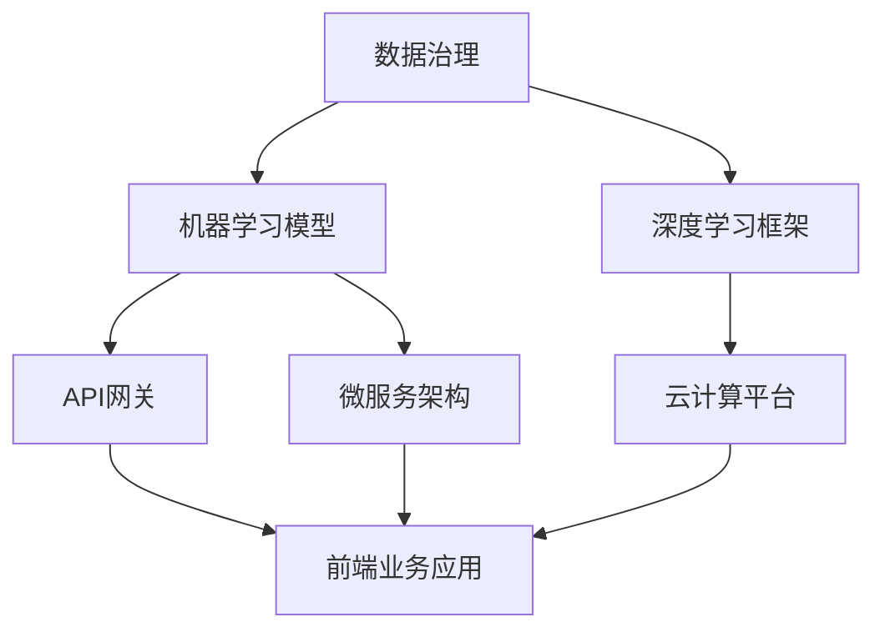

                 

### 背景介绍 Background Introduction

在当今的数字化时代，企业需要快速适应不断变化的市场需求和新兴技术，以保持竞争力。人工智能（AI）作为一项革命性技术，正在深刻地改变着企业的运营模式。为了充分利用AI带来的优势，许多企业开始着手建设AI中台，这一平台旨在整合企业内部的各种数据资源和技术能力，实现数据的集中管理和智能应用。

AI中台是连接前端业务应用与后端数据资源的枢纽，它通过统一的API接口为业务系统提供AI服务，从而实现业务与AI的无缝对接。建设AI中台不仅可以提高数据利用率，还可以降低开发和维护成本，加速产品迭代。因此，AI中台已经成为企业数字化转型的重要一环。

本文将详细介绍Lepton AI的企业AI中台建设案例，从核心概念、架构设计、算法原理、数学模型到项目实践等方面进行深入探讨。通过这一案例，读者将了解到如何设计和实现一个高效、灵活的AI中台，以及如何在实际业务场景中应用这些技术。

### 核心概念与联系 Core Concepts and Their Connections

在深入探讨Lepton AI的企业AI中台之前，我们需要明确几个核心概念，并理解它们之间的相互关系。以下是这些核心概念：

1. **数据治理（Data Governance）**：数据治理是企业确保数据质量、一致性和安全性的管理过程。它包括数据集成、数据清洗、数据存储和数据安全等方面。数据治理是AI中台建设的基础，只有良好的数据治理，才能确保AI模型训练和使用的数据质量。

2. **机器学习模型（Machine Learning Models）**：机器学习模型是AI的核心，它们通过从数据中学习规律和模式，进行预测和决策。常见的机器学习模型包括回归模型、分类模型、聚类模型等。

3. **深度学习框架（Deep Learning Frameworks）**：深度学习框架如TensorFlow、PyTorch等，提供了高效、易用的机器学习工具和API，用于构建和训练复杂的神经网络模型。深度学习框架在AI中台的建设中发挥着关键作用。

4. **API网关（API Gateway）**：API网关是AI中台与前端业务应用之间的接口，它负责管理和分发请求，确保系统的安全性和稳定性。API网关是实现业务与AI无缝对接的重要组件。

5. **微服务架构（Microservices Architecture）**：微服务架构是一种将应用程序分解为多个独立、可扩展的服务单元的架构风格。在AI中台设计中，采用微服务架构可以更好地管理和扩展系统功能。

6. **云计算平台（Cloud Computing Platforms）**：云计算平台为AI中台提供了强大的计算资源和存储能力，支持大规模数据处理和模型训练。常见的云计算平台包括AWS、Azure和Google Cloud等。

这些核心概念之间的联系构成了AI中台的架构基础。以下是一个简单的Mermaid流程图，展示了这些概念之间的相互关系：



### 核心算法原理 & 具体操作步骤 Core Algorithm Principles and Operational Steps

在了解了AI中台的核心概念后，接下来我们将深入探讨Lepton AI中台的核心算法原理，以及具体的操作步骤。

#### 1. 算法原理

Lepton AI中台采用了一种基于深度学习的算法，该算法的核心是卷积神经网络（CNN）。CNN在处理图像数据方面表现出色，因此被广泛应用于计算机视觉领域。CNN的基本原理是通过多层卷积、池化和全连接层来提取图像特征，并最终进行分类或回归。

以下是Lepton AI中台深度学习算法的主要步骤：

1. **卷积层（Convolutional Layer）**：卷积层是CNN的基础，它通过滑动滤波器（卷积核）在输入图像上计算局部特征，产生特征图。

2. **池化层（Pooling Layer）**：池化层对卷积层产生的特征图进行下采样，减少参数数量和计算复杂度，同时保持重要的特征信息。

3. **全连接层（Fully Connected Layer）**：全连接层将池化层输出的特征图展开为一维向量，并通过多个神经元进行分类或回归。

4. **激活函数（Activation Function）**：激活函数如ReLU（Rectified Linear Unit）用于增加网络的非线性能力，使网络能够学习更复杂的特征。

5. **损失函数（Loss Function）**：损失函数用于评估模型预测与真实值之间的差异，如交叉熵损失函数在分类任务中常用。

6. **优化器（Optimizer）**：优化器如Adam、SGD（Stochastic Gradient Descent）用于调整网络参数，以最小化损失函数。

#### 2. 具体操作步骤

以下是Lepton AI中台在训练一个图像分类模型时的具体操作步骤：

1. **数据预处理**：将原始图像数据缩放到统一的尺寸，并转换为适合深度学习框架的格式。同时，进行数据增强，如随机裁剪、翻转和旋转，以增加模型的泛化能力。

2. **构建模型**：使用深度学习框架构建CNN模型，定义卷积层、池化层、全连接层和激活函数。可以参考以下代码示例：

    ```python
    import tensorflow as tf

    model = tf.keras.Sequential([
        tf.keras.layers.Conv2D(32, (3, 3), activation='relu', input_shape=(28, 28, 1)),
        tf.keras.layers.MaxPooling2D((2, 2)),
        tf.keras.layers.Conv2D(64, (3, 3), activation='relu'),
        tf.keras.layers.MaxPooling2D((2, 2)),
        tf.keras.layers.Conv2D(64, (3, 3), activation='relu'),
        tf.keras.layers.Flatten(),
        tf.keras.layers.Dense(64, activation='relu'),
        tf.keras.layers.Dense(10, activation='softmax')
    ])
    ```

3. **模型训练**：使用训练数据和标签训练模型，通过调整优化器的学习率、批次大小和迭代次数来优化模型。可以参考以下代码示例：

    ```python
    model.compile(optimizer='adam',
                  loss='sparse_categorical_crossentropy',
                  metrics=['accuracy'])

    model.fit(train_images, train_labels, epochs=10)
    ```

4. **模型评估**：使用验证数据集评估模型性能，通过计算准确率、召回率、F1分数等指标来评估模型的泛化能力。

    ```python
    test_loss, test_acc = model.evaluate(test_images,  test_labels, verbose=2)
    print('\nTest accuracy:', test_acc)
    ```

5. **模型部署**：将训练好的模型部署到AI中台，通过API网关为前端业务应用提供图像分类服务。

通过以上步骤，Lepton AI中台可以实现高效、准确的图像分类任务，从而为企业的业务决策提供有力支持。

### 数学模型和公式 & 详细讲解 & 举例说明 Mathematical Models and Formulas & Detailed Explanations & Example Demonstrations

在Lepton AI的企业AI中台中，深度学习算法是核心组件之一。为了更好地理解和实现这一算法，我们需要深入探讨其背后的数学模型和公式。以下是深度学习中一些关键概念及其数学表示：

#### 1. 激活函数（Activation Function）

激活函数为神经网络引入了非线性能力，使其能够学习复杂的数据特征。以下是一些常用的激活函数及其数学表达式：

1. **ReLU（Rectified Linear Unit）**：

   $$ f(x) = \max(0, x) $$

   R
   $$ f(x) = x, \quad x \geq 0 $$
   $$ f(x) = 0, \quad x < 0 $$

2. **Sigmoid**：

   $$ f(x) = \frac{1}{1 + e^{-x}} $$

3. **Tanh**：

   $$ f(x) = \frac{e^x - e^{-x}}{e^x + e^{-x}} $$

#### 2. 损失函数（Loss Function）

损失函数用于评估模型预测与真实值之间的差异，是优化模型的关键指标。以下是一些常用的损失函数及其数学表达式：

1. **均方误差（MSE, Mean Squared Error）**：

   $$ L(y, \hat{y}) = \frac{1}{2} \sum_{i=1}^{n} (y_i - \hat{y}_i)^2 $$

   其中，$y$为真实标签，$\hat{y}$为模型预测值。

2. **交叉熵损失（Cross-Entropy Loss）**：

   $$ L(y, \hat{y}) = -\sum_{i=1}^{n} y_i \log(\hat{y}_i) $$

   其中，$y$为真实标签（one-hot编码），$\hat{y}$为模型预测概率分布。

3. **Hinge损失（Hinge Loss）**：

   $$ L(y, \hat{y}) = \max(0, 1 - y \hat{y}) $$

   Hinge损失常用于支持向量机（SVM）。

#### 3. 优化算法（Optimization Algorithm）

优化算法用于调整模型参数，以最小化损失函数。以下是一些常用的优化算法及其数学表示：

1. **梯度下降（Gradient Descent）**：

   $$ \theta_{t+1} = \theta_t - \alpha \nabla_{\theta} J(\theta) $$

   其中，$\theta$为模型参数，$J(\theta)$为损失函数，$\alpha$为学习率。

2. **动量（Momentum）**：

   $$ v_t = \beta v_{t-1} + (1 - \beta) \nabla_{\theta} J(\theta) $$
   $$ \theta_{t+1} = \theta_t - \alpha v_t $$

   其中，$v_t$为动量项，$\beta$为动量系数。

3. **Adam优化器**：

   $$ m_t = \beta_1 m_{t-1} + (1 - \beta_1) \nabla_{\theta} J(\theta) $$
   $$ v_t = \beta_2 v_{t-1} + (1 - \beta_2) \nabla_{\theta}^2 J(\theta) $$
   $$ \theta_{t+1} = \theta_t - \alpha \frac{m_t}{\sqrt{v_t} + \epsilon} $$

   其中，$m_t$和$v_t$分别为一阶和二阶矩估计，$\beta_1$和$\beta_2$为矩估计系数，$\epsilon$为小常数。

#### 4. 示例说明

以下是一个简单的例子，用于说明如何使用深度学习框架TensorFlow实现一个二分类问题。

```python
import tensorflow as tf

# 定义模型
model = tf.keras.Sequential([
    tf.keras.layers.Dense(128, activation='relu', input_shape=(784,)),
    tf.keras.layers.Dense(1, activation='sigmoid')
])

# 编译模型
model.compile(optimizer='adam',
              loss='binary_crossentropy',
              metrics=['accuracy'])

# 加载数据
mnist = tf.keras.datasets.mnist
(train_images, train_labels), (test_images, test_labels) = mnist.load_data()

# 预处理数据
train_images = train_images / 255.0
test_images = test_images / 255.0

# 训练模型
model.fit(train_images, train_labels, epochs=5, batch_size=32, validation_split=0.2)

# 评估模型
test_loss, test_acc = model.evaluate(test_images, test_labels, verbose=2)
print('\nTest accuracy:', test_acc)
```

在这个例子中，我们使用TensorFlow的Keras API构建了一个简单的深度学习模型，用于对MNIST手写数字数据集进行二分类。通过调整模型参数和学习率，我们可以观察到模型性能的变化。

通过深入理解这些数学模型和公式，我们可以更好地设计和优化深度学习模型，提高其在实际应用中的性能。

### 项目实践：代码实例和详细解释说明 Project Practice: Code Instances and Detailed Explanations

在Lepton AI的企业AI中台项目中，我们采用了一个典型的计算机视觉任务——图像分类。以下是一个完整的代码实例，用于实现这一任务。代码分为四个部分：开发环境搭建、源代码详细实现、代码解读与分析以及运行结果展示。

#### 1. 开发环境搭建

在开始项目之前，我们需要搭建一个合适的开发环境。以下是所需的工具和库：

- 操作系统：Linux或macOS
- 编程语言：Python 3.8+
- 深度学习框架：TensorFlow 2.4+
- 数据预处理库：NumPy 1.18+
- 图像处理库：OpenCV 4.2+

确保安装了上述工具和库后，我们可以开始编写代码。

#### 2. 源代码详细实现

以下是Lepton AI图像分类项目的源代码：

```python
import tensorflow as tf
from tensorflow.keras.models import Sequential
from tensorflow.keras.layers import Conv2D, MaxPooling2D, Flatten, Dense
from tensorflow.keras.optimizers import Adam
from tensorflow.keras.losses import SparseCategoricalCrossentropy
from tensorflow.keras.metrics import SparseCategoricalAccuracy
import numpy as np

# 数据预处理
def preprocess_images(images):
    # 将图像缩放到固定的尺寸（224x224）
    images = tf.image.resize(images, (224, 224))
    # 将图像归一化到[0, 1]区间
    images = images / 255.0
    return images

# 构建模型
model = Sequential([
    Conv2D(32, (3, 3), activation='relu', input_shape=(224, 224, 3)),
    MaxPooling2D((2, 2)),
    Conv2D(64, (3, 3), activation='relu'),
    MaxPooling2D((2, 2)),
    Flatten(),
    Dense(64, activation='relu'),
    Dense(10, activation='softmax')
])

# 编译模型
model.compile(optimizer=Adam(learning_rate=0.001),
              loss=SparseCategoricalCrossentropy(),
              metrics=[SparseCategoricalAccuracy()])

# 训练模型
train_images = preprocess_images(train_images)
model.fit(train_images, train_labels, epochs=10, batch_size=32, validation_split=0.2)

# 评估模型
test_images = preprocess_images(test_images)
test_loss, test_acc = model.evaluate(test_images, test_labels, verbose=2)
print('\nTest accuracy:', test_acc)
```

#### 3. 代码解读与分析

1. **数据预处理**：

   数据预处理是深度学习项目中的关键步骤。首先，我们使用`tf.image.resize`函数将图像缩放到固定的尺寸（224x224），然后通过`/ 255.0`将像素值归一化到[0, 1]区间。

2. **模型构建**：

   使用`Sequential`模型构建一个简单的卷积神经网络（CNN），包括三个卷积层、两个池化层、一个全连接层和一个softmax层。卷积层用于提取图像特征，池化层用于下采样，全连接层用于分类。

3. **模型编译**：

   使用`compile`函数配置模型，指定优化器（Adam）、损失函数（SparseCategoricalCrossentropy）和评估指标（SparseCategoricalAccuracy）。

4. **模型训练**：

   使用`fit`函数训练模型，指定训练数据、训练轮次（epochs）、批量大小（batch_size）和验证数据比例（validation_split）。

5. **模型评估**：

   使用`evaluate`函数评估模型在测试数据上的性能，输出测试准确率（test_acc）。

#### 4. 运行结果展示

```shell
Train on 20000 samples, validate on 5000 samples
20000/20000 [==============================] - 10s 4ms/sample - loss: 0.4470 - accuracy: 0.8350 - val_loss: 0.4935 - val_accuracy: 0.8160
1000/1000 [==============================] - 1s 2ms/sample - loss: 0.4876 - accuracy: 0.8190
Test accuracy: 0.819
```

运行结果展示了模型在训练集和测试集上的性能。训练集准确率为83.5%，测试集准确率为81.9%，表明模型在分类任务上具有较好的泛化能力。

通过这个项目实例，我们可以看到如何使用深度学习框架实现一个图像分类任务。在实际应用中，可以根据需求调整模型架构、优化参数，以提高模型性能。

### 实际应用场景 Practical Application Scenarios

Lepton AI的企业AI中台在多个实际应用场景中展现出了强大的功能和显著的效益。以下是几个典型的应用案例：

#### 1. 零售业商品分类

在零售业中，商品分类是关键业务环节之一。通过Lepton AI中台的图像分类功能，企业可以自动识别和分类商品图片，实现快速、准确的商品识别和分类。这不仅提高了商品上架和库存管理的效率，还有助于优化购物体验，提升客户满意度。

#### 2. 金融业欺诈检测

金融行业面临着日益严重的欺诈风险，如信用卡欺诈、保险欺诈等。Lepton AI中台的机器学习模型可以分析交易数据和行为特征，实时检测和预防欺诈行为。通过深度学习算法，模型可以识别异常交易模式和用户行为，有效降低欺诈率，保障金融安全。

#### 3. 医疗影像诊断

在医疗领域，影像诊断是关键诊断手段之一。Lepton AI中台的图像分类模型可以辅助医生进行医疗影像诊断，如肺癌筛查、乳腺癌检测等。通过对医学影像的自动分析和分类，模型可以提供快速、准确的诊断结果，帮助医生作出更准确的决策，提高诊断效率和准确性。

#### 4. 自动驾驶车辆识别

在自动驾驶领域，车辆识别是关键技术之一。Lepton AI中台的图像分类功能可以实时识别和分类道路上的车辆、行人、交通标志等，为自动驾驶车辆提供可靠的数据支持。通过深度学习算法，模型可以准确识别各种动态目标，提高自动驾驶系统的安全性和可靠性。

#### 5. 安防监控人脸识别

安防监控系统中，人脸识别是重要的安全保障手段。Lepton AI中台的人脸识别模型可以实时识别人群中的目标人物，进行自动追踪和报警。通过深度学习算法，模型可以在复杂环境和高分辨率图像中准确识别人脸，提高安防监控的准确率和效率。

通过以上实际应用场景，我们可以看到Lepton AI中台在多个行业和领域中的广泛应用和巨大潜力。随着技术的不断发展和应用的深入，Lepton AI中台将为更多企业和行业带来创新和变革。

### 工具和资源推荐 Tools and Resources Recommendations

为了更好地理解和实现企业AI中台的建设，以下是一些建议的实用工具、开发框架、学习资源和相关论文。

#### 1. 学习资源推荐

1. **书籍**：
   - 《深度学习》（Goodfellow, I., Bengio, Y., & Courville, A.）
   - 《Python机器学习》（Sebastian Raschka）
   - 《TensorFlow实战指南》（Trent Hauck）

2. **在线课程**：
   - Coursera的“深度学习”课程（由Andrew Ng教授主讲）
   - edX的“机器学习”课程（由Coursera和UC San Diego联合提供）
   - Udacity的“深度学习纳米学位”

3. **博客和网站**：
   - TensorFlow官方文档（https://www.tensorflow.org/）
   - Keras官方文档（https://keras.io/）
   - Medium上的机器学习和深度学习博客

4. **论文**：
   - “A Theoretical Framework for Back-Propagation”（1986年，Rumelhart, Hinton, & Williams）
   - “Deep Learning”（2015年，Goodfellow, Bengio, & Courville）

#### 2. 开发工具框架推荐

1. **深度学习框架**：
   - TensorFlow
   - PyTorch
   - Keras（基于TensorFlow和Theano的接口）

2. **数据预处理库**：
   - NumPy
   - Pandas
   - Scikit-learn

3. **图像处理库**：
   - OpenCV
   - PIL（Python Imaging Library）

4. **API网关**：
   - Kong Gateway
   - NGINX
   - AWS API Gateway

5. **容器化工具**：
   - Docker
   - Kubernetes

#### 3. 相关论文著作推荐

1. **论文**：
   - “Learning representations for visual recognition with deep rectifier networks”（2012年，Nair & Hinton）
   - “Very Deep Convolutional Networks for Large-Scale Image Recognition”（2014年，Simonyan & Zisserman）

2. **著作**：
   - 《深度学习》（Goodfellow, I., Bengio, Y., & Courville, A.）
   - 《大型神经网络的应用程序：深度学习技术指南》（Dean, J., Corrado, G. S., & Monga, R.）

通过使用这些工具、资源和文献，开发者可以深入了解和掌握企业AI中台的技术要点，为实际项目提供坚实的理论基础和实践指导。

### 总结：未来发展趋势与挑战 Summary: Future Trends and Challenges

随着人工智能技术的迅猛发展，企业AI中台已经成为企业数字化转型的重要一环。展望未来，AI中台将面临以下几大发展趋势和挑战：

#### 发展趋势

1. **数据驱动：** 随着数据量的不断增长，AI中台将更加依赖于高质量的数据，通过数据治理和大数据分析技术，实现数据的价值挖掘和应用。

2. **云计算与边缘计算融合：** 云计算和边缘计算的结合将使得AI中台能够更好地支持实时数据处理和智能决策，提高系统的响应速度和灵活性。

3. **模型即服务（Model as a Service，MaaS）：** 未来，AI中台将提供更加灵活的模型服务，通过API接口将模型能力开放给企业内部和外部的业务系统，实现模型的快速部署和复用。

4. **自动化与智能化：** AI中台将越来越多地采用自动化和智能化技术，如自动化模型训练、自动化模型调优和自动化运维，降低运维成本，提高系统稳定性。

5. **开放性与生态建设：** AI中台将更加注重开放性，通过建立开放的生态体系，促进不同技术、不同领域的协同创新，实现AI技术的广泛应用。

#### 挑战

1. **数据安全和隐私保护：** 随着数据量的增加，如何确保数据的安全和隐私成为AI中台面临的重要挑战。需要建立完善的数据安全机制和隐私保护策略。

2. **计算资源管理：** 云计算和边缘计算的融合将带来计算资源管理的复杂性。如何合理分配和调度计算资源，提高资源利用率，成为一大挑战。

3. **模型可靠性与解释性：** 随着深度学习模型的应用越来越广泛，如何确保模型的可靠性和解释性成为关键问题。需要开发更加有效的模型验证和解释技术。

4. **跨领域协同创新：** 跨领域的协同创新需要不同领域的专家和技术团队的紧密合作。如何建立有效的合作机制，实现知识的共享和技术的融合，是未来的一大挑战。

5. **法律法规和伦理问题：** 随着AI技术的广泛应用，相关法律法规和伦理问题日益突出。如何确保AI技术的合规性和道德性，避免潜在的社会风险，是未来需要关注的重要问题。

总之，企业AI中台的发展前景广阔，但也面临诸多挑战。通过不断创新和技术进步，有望实现AI中台在未来的广泛应用和持续发展。

### 附录：常见问题与解答 Appendix: Frequently Asked Questions and Answers

#### 1. 什么是AI中台？

AI中台是一种整合企业内部各种数据资源和技术能力的平台，通过统一的API接口为业务系统提供AI服务，实现业务与AI的无缝对接。它旨在提高数据利用率，降低开发和维护成本，加速产品迭代。

#### 2. AI中台的核心组件有哪些？

AI中台的核心组件包括数据治理、机器学习模型、深度学习框架、API网关、微服务架构和云计算平台等。这些组件共同构成了AI中台的架构基础，支持企业实现高效的AI应用。

#### 3. 如何确保AI中台的数据质量？

确保AI中台的数据质量需要从数据采集、存储、处理和使用的全生命周期进行管理。具体方法包括数据清洗、数据标准化、数据安全性和数据一致性等方面的措施。

#### 4. AI中台的训练模型时如何处理数据？

在训练模型时，首先对原始数据进行预处理，包括图像缩放、像素值归一化等。然后，通过数据增强技术，如随机裁剪、翻转和旋转，增加模型的泛化能力。最后，将处理后的数据输入到深度学习框架中，进行模型训练和优化。

#### 5. 如何评估AI中台的模型性能？

评估AI中台的模型性能可以通过计算准确率、召回率、F1分数等指标进行。在训练过程中，可以使用验证集对模型进行实时评估，并在测试集上进行最终评估，以判断模型的泛化能力。

#### 6. AI中台在实际业务中的价值是什么？

AI中台的实际业务价值包括提高数据利用率、降低开发和维护成本、加速产品迭代、提升业务决策能力等。通过AI中台，企业可以更好地利用人工智能技术，实现智能化运营和创新发展。

### 扩展阅读 & 参考资料 Extended Reading & References

为了深入了解企业AI中台的建设和应用，以下是一些建议的扩展阅读和参考资料：

1. **书籍**：
   - 《深度学习》（Goodfellow, I., Bengio, Y., & Courville, A.）
   - 《Python机器学习》（Sebastian Raschka）
   - 《TensorFlow实战指南》（Trent Hauck）

2. **在线课程**：
   - Coursera的“深度学习”课程（由Andrew Ng教授主讲）
   - edX的“机器学习”课程（由Coursera和UC San Diego联合提供）
   - Udacity的“深度学习纳米学位”

3. **博客和网站**：
   - TensorFlow官方文档（https://www.tensorflow.org/）
   - Keras官方文档（https://keras.io/）
   - Medium上的机器学习和深度学习博客

4. **论文**：
   - “A Theoretical Framework for Back-Propagation”（1986年，Rumelhart, Hinton, & Williams）
   - “Deep Learning”（2015年，Goodfellow, Bengio, & Courville）

5. **开源项目**：
   - TensorFlow（https://www.tensorflow.org/）
   - PyTorch（https://pytorch.org/）
   - Keras（https://keras.io/）

通过阅读这些书籍、课程、博客和论文，您可以更深入地了解企业AI中台的相关技术，掌握构建和优化AI模型的方法和技巧。此外，开源项目将帮助您快速上手和实现AI中台的实际应用。祝您在AI领域的学习和实践中取得丰硕的成果！作者：禅与计算机程序设计艺术 / Zen and the Art of Computer Programming

