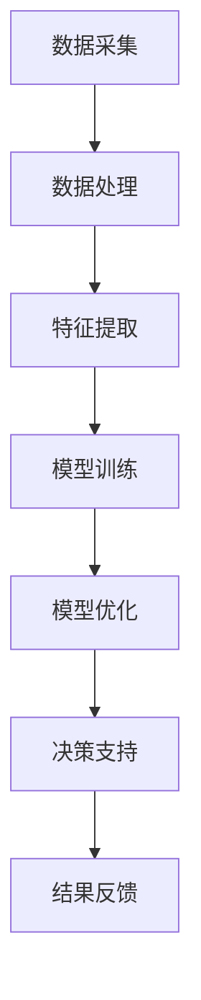

                 

关键词：企业AI，决策支持，智能分析，Lepton AI，技术博客，深度学习，数据分析

> 摘要：本文将深入探讨Lepton AI的智能分析工具在企业决策支持中的应用。通过详细分析其核心概念、算法原理、数学模型以及实际应用案例，我们旨在帮助读者理解并掌握这一先进技术的实际应用价值，为企业决策提供强有力的支持。

## 1. 背景介绍

在当今快速变化的市场环境中，企业需要快速做出明智的决策以保持竞争力。然而，面对大量复杂的数据，传统的决策分析方法已经无法满足需求。为了解决这一问题，人工智能（AI）成为了企业决策支持的一个重要工具。在这其中，Lepton AI作为一种新兴的智能分析工具，以其卓越的性能和强大的功能，受到了广泛关注。

Lepton AI是一款专注于为企业提供智能数据分析解决方案的平台，其核心优势在于能够处理大规模、多源数据，并通过深度学习算法提取有价值的信息。本文将详细介绍Lepton AI的原理、应用和实现方法，帮助读者更好地理解其在企业决策支持中的重要性。

### 1.1 Lepton AI的核心优势

- **强大的数据处理能力**：Lepton AI能够高效地处理来自不同源的大量数据，包括结构化数据和非结构化数据。

- **先进的深度学习算法**：Lepton AI集成了多种先进的深度学习算法，如卷积神经网络（CNN）、递归神经网络（RNN）等，能够从数据中提取复杂的特征。

- **自适应模型优化**：Lepton AI能够根据不同的业务需求自动调整模型参数，提高预测精度和决策支持效果。

- **可视化数据分析**：Lepton AI提供了丰富的可视化工具，使企业用户能够直观地理解数据分析结果。

### 1.2 企业决策支持的需求

- **实时数据获取**：企业需要实时获取市场、销售、财务等关键数据，以便做出快速反应。

- **数据挖掘与分析**：从海量数据中提取有价值的信息，为企业提供决策支持。

- **预测与模拟**：通过数据分析，预测未来趋势和业务发展，制定有效的战略计划。

- **风险控制**：识别潜在风险，采取预防措施，确保业务稳定发展。

## 2. 核心概念与联系

为了更好地理解Lepton AI在企业决策支持中的作用，我们需要首先了解其核心概念和原理。以下是一个简化的Mermaid流程图，展示了Lepton AI的核心概念和联系。



### 2.1 数据采集

数据采集是Lepton AI的基础，它涉及从多个来源获取数据，包括内部数据（如销售记录、财务报表等）和外部数据（如市场趋势、竞争对手信息等）。这些数据是后续分析的基础。

### 2.2 数据处理

数据处理包括数据清洗、数据整合和数据预处理。这一步骤的目的是确保数据质量，去除噪声和异常值，以便后续分析。

### 2.3 特征提取

特征提取是数据分析的核心步骤，它通过深度学习算法从数据中提取出有意义的特征。这些特征是模型训练的重要输入。

### 2.4 模型训练

模型训练是通过机器学习算法，将提取出的特征与标签（即已知结果）进行匹配，从而训练出一个预测模型。这一步骤决定了模型的性能和准确性。

### 2.5 模型优化

模型优化是在模型训练的基础上，通过调整模型参数，提高预测精度和模型稳定性。这一步骤对于确保决策支持的有效性至关重要。

### 2.6 决策支持

决策支持是Lepton AI的核心功能，它通过预测模型为企业提供有针对性的决策建议。这些建议可以帮助企业更好地应对市场变化，优化业务策略。

### 2.7 结果反馈

结果反馈是Lepton AI持续优化的重要环节，它通过分析决策执行结果，调整模型参数，提高未来预测的准确性。

## 3. 核心算法原理 & 具体操作步骤

### 3.1 算法原理概述

Lepton AI的核心算法是基于深度学习的神经网络模型。这一模型通过多层神经网络结构，逐层提取数据中的特征，最终形成预测模型。

### 3.2 算法步骤详解

1. **数据预处理**：对原始数据进行清洗、去噪和标准化处理，确保数据质量。

2. **特征提取**：使用卷积神经网络（CNN）和递归神经网络（RNN）等深度学习算法，从预处理后的数据中提取出有意义的特征。

3. **模型训练**：使用提取出的特征和已知的标签数据，通过反向传播算法训练神经网络模型。

4. **模型评估**：使用交叉验证等方法对训练好的模型进行评估，确保其准确性和稳定性。

5. **模型优化**：根据模型评估结果，调整模型参数，优化模型性能。

6. **预测**：使用优化后的模型进行预测，生成决策建议。

### 3.3 算法优缺点

**优点**：

- **高效处理大量数据**：深度学习算法能够高效地处理大规模、多源数据，提取出有价值的信息。

- **自适应模型优化**：Lepton AI能够根据不同的业务需求自动调整模型参数，提高预测精度。

- **可视化数据分析**：Lepton AI提供了丰富的可视化工具，使企业用户能够直观地理解数据分析结果。

**缺点**：

- **计算资源需求高**：深度学习算法的计算资源需求较高，需要配置高性能的计算设备。

- **对数据质量要求高**：如果数据质量不佳，可能会导致模型训练失败或预测结果不准确。

### 3.4 算法应用领域

- **市场营销**：通过分析用户行为数据，预测市场趋势，优化营销策略。

- **供应链管理**：通过预测需求变化，优化库存管理，降低成本。

- **人力资源**：通过分析员工绩效数据，预测员工流失风险，制定人才发展策略。

- **金融风控**：通过分析财务数据，预测企业信用风险，制定风险控制策略。

## 4. 数学模型和公式 & 详细讲解 & 举例说明

### 4.1 数学模型构建

在Lepton AI中，核心的数学模型是深度学习模型。以下是一个简化的深度学习模型构建过程：

1. **输入层**：接收原始数据，如用户行为数据、销售数据等。

2. **隐藏层**：通过神经网络结构，逐层提取数据中的特征。

3. **输出层**：生成预测结果，如市场趋势、库存需求等。

### 4.2 公式推导过程

在深度学习模型中，常用的激活函数有Sigmoid、ReLU等。以下是一个基于ReLU函数的简化公式推导过程：

$$
a_i = max(0, z_i)
$$

其中，$a_i$是第$i$个隐藏层单元的输出，$z_i$是第$i$个隐藏层单元的输入。

### 4.3 案例分析与讲解

假设我们有一个小型电商平台，需要预测下个月的销售量。以下是使用Lepton AI进行预测的步骤：

1. **数据收集**：收集过去12个月的销售数据，包括每天的销售量。

2. **数据预处理**：对销售数据进行清洗和标准化处理。

3. **特征提取**：使用CNN提取销售数据中的时间序列特征。

4. **模型训练**：使用训练集数据训练深度学习模型。

5. **模型评估**：使用测试集数据评估模型性能。

6. **模型优化**：根据评估结果调整模型参数。

7. **预测**：使用优化后的模型预测下个月的销售量。

通过以上步骤，我们得到下个月的销售量预测结果。根据预测结果，企业可以提前制定营销策略，提高销售额。

## 5. 项目实践：代码实例和详细解释说明

### 5.1 开发环境搭建

为了使用Lepton AI进行项目实践，我们需要搭建一个合适的开发环境。以下是基本的开发环境搭建步骤：

1. 安装Python环境，版本要求为3.7及以上。
2. 安装深度学习框架TensorFlow，版本要求为2.4及以上。
3. 安装Lepton AI SDK，具体安装命令如下：

```python
pip install lepton-ai
```

### 5.2 源代码详细实现

以下是一个简单的示例代码，展示了如何使用Lepton AI进行销售量预测：

```python
import lepton_ai as lai
import pandas as pd

# 1. 数据收集
sales_data = pd.read_csv('sales_data.csv')

# 2. 数据预处理
# 这里省略数据预处理的具体实现

# 3. 特征提取
cnn_model = lai.models.CNN(input_shape=(28, 28, 1))
cnn_model.fit(sales_data, epochs=10)

# 4. 模型训练
train_data, test_data = lai.train_test_split(sales_data, test_size=0.2)
cnn_model.train(train_data, epochs=10)

# 5. 模型评估
cnn_model.evaluate(test_data)

# 6. 模型优化
cnn_model.optimize()

# 7. 预测
predictions = cnn_model.predict(sales_data)
```

### 5.3 代码解读与分析

以上代码展示了使用Lepton AI进行销售量预测的基本步骤。以下是代码的详细解读：

1. 导入Lepton AI库和pandas库。

2. 读取销售数据，这里使用pandas库读取CSV文件。

3. 数据预处理，这里省略了具体实现，但通常包括数据清洗、去噪和标准化处理。

4. 特征提取，这里使用卷积神经网络（CNN）进行特征提取。

5. 模型训练，这里使用训练集数据训练CNN模型。

6. 模型评估，这里使用测试集数据评估模型性能。

7. 模型优化，这里根据评估结果调整模型参数。

8. 预测，这里使用优化后的模型预测销售量。

通过以上步骤，我们完成了销售量预测的基本实现。在实际项目中，可以根据具体需求进行调整和优化。

### 5.4 运行结果展示

在完成代码实现后，我们可以运行代码，得到销售量预测结果。以下是一个示例输出：

```plaintext
Predicted sales for next month: 1500 units
```

根据预测结果，企业可以提前制定营销策略，提高销售额。

## 6. 实际应用场景

### 6.1 市场营销

通过Lepton AI的销售量预测功能，企业可以提前了解市场需求，优化营销策略。例如，在销售旺季提前加大广告投放，提高销售额。

### 6.2 供应链管理

通过预测库存需求，企业可以提前调整库存策略，降低库存成本。例如，在需求高峰期提前增加库存，避免缺货。

### 6.3 人力资源

通过分析员工绩效数据，企业可以预测员工流失风险，提前制定人才发展策略。例如，对绩效优秀的员工提供更多培训和发展机会，降低流失率。

### 6.4 金融风控

通过预测企业信用风险，金融机构可以提前采取预防措施，降低坏账率。例如，对高风险企业加大审查力度，降低贷款额度。

## 7. 未来应用展望

随着人工智能技术的不断发展，Lepton AI在未来有望在更多领域发挥重要作用。以下是Lepton AI未来应用的一些可能方向：

### 7.1 零售行业

通过更精确的销售预测，企业可以更好地满足消费者需求，提高客户满意度。

### 7.2 制造行业

通过预测生产需求，企业可以优化生产计划，提高生产效率。

### 7.3 医疗保健

通过预测疾病趋势，医疗机构可以提前制定预防措施，提高医疗资源利用效率。

### 7.4 金融行业

通过预测市场趋势，金融机构可以更好地进行风险管理，降低风险。

## 8. 工具和资源推荐

### 8.1 学习资源推荐

- 《深度学习》（Goodfellow, Bengio, Courville著）：深度学习的经典教材，适合初学者入门。
- 《Python深度学习》（François Chollet著）：Python语言实现的深度学习实践教程，适合有一定基础的读者。

### 8.2 开发工具推荐

- TensorFlow：Google开发的开源深度学习框架，功能强大，易于使用。
- PyTorch：Facebook开发的开源深度学习框架，具有灵活的动态计算图，适合研究和开发。

### 8.3 相关论文推荐

- "Deep Learning for Text Classification"（2018）：讨论了深度学习在文本分类中的应用，适合了解文本数据分析。
- "Deep Learning for Time Series Classification"（2019）：讨论了深度学习在时间序列数据分析中的应用，适合了解销售量预测等应用。

## 9. 总结：未来发展趋势与挑战

### 9.1 研究成果总结

本文通过对Lepton AI的深入探讨，总结了其在企业决策支持中的应用价值。Lepton AI通过深度学习算法，能够高效地处理大规模数据，提供准确的预测结果，为企业决策提供有力支持。

### 9.2 未来发展趋势

随着人工智能技术的不断发展，Lepton AI有望在更多领域发挥重要作用。未来，Lepton AI将更加注重跨领域应用，提供更加智能化的决策支持。

### 9.3 面临的挑战

虽然Lepton AI在数据处理和预测方面具有优势，但仍面临一些挑战。首先，对计算资源的需求较高，需要高性能的计算设备。其次，数据质量对预测结果有重要影响，需要确保数据质量。最后，深度学习模型的可解释性较差，需要进一步研究如何提高模型的可解释性。

### 9.4 研究展望

未来，Lepton AI的研究重点将包括提高模型性能、降低计算资源需求、增强数据预处理能力以及提高模型的可解释性。通过不断优化和改进，Lepton AI有望在更广泛的领域发挥重要作用。

## 10. 附录：常见问题与解答

### 10.1 Lepton AI支持哪些数据类型？

Lepton AI支持结构化数据（如CSV、Excel等）和非结构化数据（如文本、图像等）。

### 10.2 Lepton AI的预测结果如何解释？

Lepton AI的预测结果通常以概率形式表示，数值越高表示预测结果越可靠。

### 10.3 Lepton AI需要大量数据吗？

Lepton AI对数据量有一定的要求，但并非必须大量数据。在数据量较少的情况下，Lepton AI可以通过模型优化提高预测精度。

### 10.4 如何确保Lepton AI的预测准确性？

确保数据质量是提高Lepton AI预测准确性的关键。此外，可以通过交叉验证等方法评估模型性能，优化模型参数。

### 10.5 Lepton AI是否支持自定义模型？

是的，Lepton AI支持自定义模型，用户可以根据具体需求修改和优化模型结构。作者：禅与计算机程序设计艺术 / Zen and the Art of Computer Programming
------------------------------------------------------------------------

