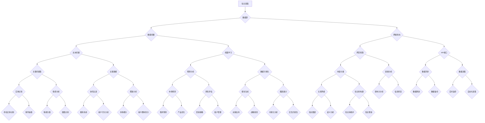

                 

### 背景介绍

企业知识管理，简而言之，是指企业如何有效地捕捉、存储、共享、使用和更新其知识资源，以促进组织的创新和竞争力。随着全球商业环境的快速变化，企业面临着日益复杂的竞争压力和技术挑战。在这种背景下，知识管理成为了企业持续发展的关键因素。

#### 知识管理的核心概念

知识管理涉及多个核心概念，包括知识获取、知识存储、知识共享和知识应用。知识获取是指企业通过各种方式收集内外部知识；知识存储是将获取到的知识进行组织、分类和存储，以便于检索和使用；知识共享则是促进知识在企业内部和外部的传播和交流；知识应用是将知识转化为实际行动，推动业务创新和运营优化。

#### AI化转型的重要性

近年来，人工智能（AI）技术的飞速发展为企业知识管理带来了新的机遇。通过AI技术，企业可以实现知识的自动化获取、智能分类、高效检索和个性化推荐。这不仅提高了知识管理的效率和准确性，还大大提升了企业的创新能力。

AI化转型不仅有助于企业更好地应对市场变化，还可以通过优化业务流程、提升决策质量、增强客户体验等方式，为企业创造显著的价值。因此，探讨企业知识管理的AI化转型策略具有重要的现实意义。

#### 文章结构概述

本文将分为以下章节：

1. **背景介绍**：介绍企业知识管理及其重要性。
2. **核心概念与联系**：详细阐述知识管理的核心概念，并使用Mermaid流程图展示知识管理架构。
3. **核心算法原理 & 具体操作步骤**：探讨AI技术在知识管理中的应用原理，并提供具体操作步骤。
4. **数学模型和公式 & 详细讲解 & 举例说明**：介绍支持知识管理的关键数学模型和公式，并通过实例进行说明。
5. **项目实践：代码实例和详细解释说明**：提供实际的代码实例，详细解读其实现过程。
6. **实际应用场景**：分析AI化知识管理在不同企业中的应用案例。
7. **工具和资源推荐**：推荐相关学习资源和开发工具。
8. **总结：未来发展趋势与挑战**：总结AI化知识管理的优势和面临的挑战。
9. **附录：常见问题与解答**：回答读者可能遇到的问题。
10. **扩展阅读 & 参考资料**：提供进一步阅读的资料。

通过本文的阅读，读者将全面了解企业知识管理的AI化转型策略，掌握相关技术原理和应用方法。接下来，我们将深入探讨这些内容。### 1.1. 企业知识管理的现状与挑战

尽管企业知识管理在过去几十年中取得了显著进展，但在当前快速变化的市场环境中，许多企业仍然面临着一系列挑战。

首先，知识的获取和存储依然是一个重大难题。企业内部的知识分布往往是碎片化的，不同部门、团队甚至员工之间缺乏有效的知识共享机制。这使得知识难以被充分利用，同时也增加了知识获取的难度。传统的文件管理系统和数据库在处理大规模、多样性的知识时，往往显得力不从心。

其次，知识的管理和利用效率较低。尽管许多企业已经采用了各种知识管理工具，但这些工具在知识检索、分类和应用方面仍存在明显不足。例如，知识检索的准确性不高，难以满足用户的需求；知识分类不够细化，导致知识难以被精准定位；知识应用的效果不佳，未能充分激发知识的潜在价值。

此外，知识管理的实时性也是一个挑战。在动态的市场环境中，知识需要不断更新和迭代。然而，许多企业的知识更新速度较慢，难以及时响应市场变化，导致知识管理的效果大打折扣。

最后，知识管理的战略定位问题。虽然许多企业认识到知识管理的重要性，但在实际操作中，知识管理往往被当作一项辅助性工作，缺乏足够的战略重视。这导致知识管理在企业中的地位不高，难以得到有效的资源和支持。

#### 知识管理的重要性

面对这些挑战，企业需要重新审视知识管理的重要性。知识不仅是企业的核心竞争力，也是企业持续创新和发展的关键驱动力。有效的知识管理能够帮助企业：

1. **提高决策质量**：通过获取和利用内外部知识，企业可以做出更为明智的决策，降低业务风险。
2. **优化业务流程**：知识管理可以帮助企业识别和优化业务流程中的瓶颈，提高运营效率。
3. **促进创新**：知识共享和交流能够激发员工的创造力，推动企业的技术创新和业务模式创新。
4. **提升客户体验**：通过个性化推荐和智能服务，企业可以更好地满足客户需求，提升客户满意度。

总之，知识管理不仅是企业应对市场变化的利器，更是企业实现长期战略目标的重要保障。接下来，我们将进一步探讨知识管理的核心概念及其与AI技术的联系。### 1.2. 知识管理的核心概念

在深入探讨企业知识管理的AI化转型之前，有必要首先明确知识管理的核心概念，以及这些概念之间的内在联系。知识管理涉及多个关键环节，包括知识获取、知识存储、知识共享和知识应用。以下是对这些核心概念及其相互关系的详细阐述。

#### 知识获取

知识获取是知识管理的起点。企业需要通过各种渠道收集内外部知识，包括文献资料、专业报告、客户反馈、市场研究、行业趋势等。知识获取的方法包括数据挖掘、网络爬虫、文献检索、访谈调查等。其中，数据挖掘是一种利用计算机算法从大量数据中提取有价值信息的方法，而网络爬虫则用于自动化获取互联网上的信息资源。

在AI技术的支持下，知识获取变得更加高效和智能化。自然语言处理（NLP）技术可以帮助企业从非结构化数据（如文本、语音等）中提取关键信息；机器学习算法则可以预测市场趋势、客户需求等，为企业提供更为精准的知识获取策略。

#### 知识存储

知识存储是将获取到的知识进行组织、分类和存储，以便于检索和使用。传统的知识存储方式包括文件管理系统、数据库和知识库。文件管理系统主要面向结构化数据，如文档、图片和视频等；数据库则用于存储大规模的关系型数据，如客户信息、销售数据等；知识库是一种用于存储和管理专业知识的数据仓库，通常包含术语、定义、案例、方法等。

随着知识管理需求的增长，知识存储面临着诸多挑战。首先，如何有效地组织和分类大量知识成为一个关键问题。传统的分类方法往往依赖于人工标签，效率较低且容易出错。其次，知识的存储和检索需要确保其安全性和可靠性，避免数据泄露和丢失。

AI技术在这一领域提供了新的解决方案。通过文本挖掘和自然语言处理技术，可以自动提取知识的关键词、主题和关系，实现知识的智能分类和标签化。此外，分布式存储和区块链技术可以提高知识存储的安全性，防止数据篡改和泄露。

#### 知识共享

知识共享是指促进知识在企业内部和外部的传播和交流。有效的知识共享可以提高员工的技能和知识水平，促进团队协作，增强企业的创新能力。知识共享的方法包括文档分享、内部论坛、知识库、电子邮件等。

在知识共享过程中，信息过载和沟通障碍是两个主要问题。信息过载导致员工难以从大量信息中筛选出有价值的内容；沟通障碍则可能导致信息传递的不准确和滞后。AI技术可以通过智能推荐、知识图谱和自然语言处理等技术，帮助员工快速定位和获取所需的知识，提高知识共享的效率。

#### 知识应用

知识应用是将知识转化为实际行动，推动业务创新和运营优化。知识应用的方法包括知识库查询、决策支持系统、智能推荐系统等。例如，在市场营销中，企业可以利用市场数据和分析结果，制定更具针对性的营销策略；在运营管理中，企业可以利用生产数据和管理知识，优化生产流程和资源配置。

AI技术在知识应用中发挥着关键作用。通过机器学习和深度学习算法，企业可以从历史数据中学习并预测市场趋势、客户行为等，为决策提供科学依据。智能推荐系统可以根据用户的历史行为和偏好，推荐个性化的产品和服务，提升用户体验。

#### 知识管理架构

为了实现知识管理的有效运作，企业需要构建一个全面的知识管理架构。这个架构通常包括以下几个层次：

1. **数据层**：用于存储和管理企业内外部的各种数据资源。
2. **处理层**：包括数据清洗、转换、分析等过程，为知识的获取和应用提供支持。
3. **应用层**：提供知识获取、存储、共享和应用的具体功能，如知识库、智能推荐系统、决策支持系统等。
4. **用户层**：包括企业内部和外部的用户，如员工、客户、合作伙伴等。

通过这个架构，企业可以实现知识的全生命周期管理，从知识获取到知识应用，形成一个闭环。

#### 结论

知识管理的核心概念包括知识获取、知识存储、知识共享和知识应用。这些概念相互关联，构成了知识管理的完整体系。在AI技术的支持下，企业可以更加高效地管理知识，提升业务创新能力和竞争力。接下来，我们将通过一个Mermaid流程图，进一步展示知识管理架构的细节。### 1.3. 知识管理架构的 Mermaid 流程图

为了直观地展示知识管理的架构，我们使用Mermaid绘制一个流程图。Mermaid是一种基于Markdown的绘图语言，能够生成各种类型的图表，包括流程图、序列图、时序图等。

下面是一个简化的知识管理架构的Mermaid流程图，展示了知识获取、知识存储、知识共享和知识应用各环节之间的关系：



这个流程图涵盖了知识获取、知识存储、知识共享和知识应用的主要环节。各环节之间通过数据流和计算过程相互连接，形成一个闭环系统。以下是流程图的主要组成部分：

1. **知识获取**：通过数据源（如文献资料、客户反馈、市场研究等）获取原始数据。
2. **数据预处理**：使用数据挖掘、文本挖掘和机器学习等技术对原始数据进行预处理，提取关键信息。
3. **知识存储**：将预处理后的知识存储到知识库或其他数据存储系统中，进行分类和标签化。
4. **知识共享**：通过知识库、智能推荐系统和其他共享工具，促进知识在企业内部和外部的传播和交流。
5. **知识应用**：将知识应用于业务决策、市场营销、运营优化等实际场景，推动业务创新和运营优化。

通过这个Mermaid流程图，我们可以清晰地看到知识管理的各个环节以及它们之间的相互关系。接下来，我们将深入探讨AI技术在知识管理中的应用原理，并提供具体的操作步骤。### 2. 核心算法原理 & 具体操作步骤

在知识管理的AI化转型中，核心算法原理起到了至关重要的作用。这些算法不仅提升了知识管理的效率，还为企业提供了更为精准和智能的解决方案。以下我们将详细介绍几种关键的AI算法原理，并提供具体操作步骤。

#### 2.1 自然语言处理（NLP）

自然语言处理（NLP）是AI技术的重要组成部分，它在知识管理中的应用主要体现在文本挖掘、情感分析和实体识别等方面。

**文本挖掘**：文本挖掘是指从大量的非结构化文本数据中提取有价值信息的过程。其主要方法包括：

1. **关键词提取**：通过统计文本中高频词汇，提取出核心关键词。
2. **主题建模**：使用算法（如LDA）对文本进行聚类，提取出文本的主题。
3. **情感分析**：分析文本的情感倾向，判断文本是正面、中性还是负面。

**具体操作步骤**：

1. **数据准备**：收集大量文本数据，例如客户反馈、市场报告、新闻报道等。
2. **文本预处理**：对文本进行清洗，去除无关信息（如HTML标签、停用词等）。
3. **关键词提取**：使用词频统计或TF-IDF等方法提取关键词。
4. **主题建模**：使用LDA等算法对文本进行聚类，提取出主题。
5. **情感分析**：使用情感分析库（如VADER）对文本进行情感分类。

**示例**：使用Python的Gensim库进行LDA主题建模。

```python
import gensim
from gensim import corpora
from nltk.tokenize import word_tokenize

# 数据准备
texts = [['this', 'is', 'the', 'first', 'document'],
         ['this', 'document', 'is', 'the', 'second'],
         ['and', 'this', 'document', 'is', 'the', 'third'],
         ['is', 'this', 'the', 'third', 'document']]

# 文本预处理
dictionary = corpora.Dictionary(texts)
corpus = [dictionary.doc2bow(text) for text in texts]

# 主题建模
ldamodel = gensim.models.ldamodel.LdaModel(corpus, num_topics=2, id2word=dictionary, passes=15)

# 输出主题
print(ldamodel.print_topics())
```

#### 2.2 机器学习与深度学习

机器学习和深度学习在知识管理中的应用非常广泛，包括分类、预测、聚类等任务。

**分类**：分类是将数据划分为不同的类别。例如，对客户反馈进行分类，判断其是正面、中性还是负面。

**具体操作步骤**：

1. **数据准备**：收集标注好的训练数据，例如正面/负面评论等。
2. **特征提取**：将文本数据转换为数值特征，可以使用词袋模型、词嵌入等技术。
3. **模型训练**：使用分类算法（如SVM、决策树、神经网络等）训练模型。
4. **模型评估**：使用交叉验证、混淆矩阵等方法评估模型性能。

**示例**：使用Python的scikit-learn库进行文本分类。

```python
from sklearn.feature_extraction.text import TfidfVectorizer
from sklearn.model_selection import train_test_split
from sklearn.naive_bayes import MultinomialNB
from sklearn.metrics import accuracy_score, classification_report

# 数据准备
X = ['this is a positive review', 'this is a negative review', ...]
y = ['positive', 'negative', ...]

# 特征提取
vectorizer = TfidfVectorizer()
X_vectorized = vectorizer.fit_transform(X)

# 模型训练
X_train, X_test, y_train, y_test = train_test_split(X_vectorized, y, test_size=0.2)
classifier = MultinomialNB()
classifier.fit(X_train, y_train)

# 模型评估
y_pred = classifier.predict(X_test)
print(accuracy_score(y_test, y_pred))
print(classification_report(y_test, y_pred))
```

**预测**：预测是根据历史数据对未来事件进行预测。例如，预测市场需求、客户行为等。

**具体操作步骤**：

1. **数据准备**：收集历史数据，包括输入特征和目标变量。
2. **特征工程**：对数据进行处理，提取有用的特征。
3. **模型训练**：使用预测算法（如线性回归、决策树、神经网络等）训练模型。
4. **模型评估**：使用评估指标（如均方误差、R方等）评估模型性能。

**示例**：使用Python的scikit-learn库进行线性回归预测。

```python
from sklearn.linear_model import LinearRegression
from sklearn.metrics import mean_squared_error

# 数据准备
X = [[1], [2], [3], [4]]  # 特征
y = [2, 4, 5, 4]  # 目标变量

# 模型训练
model = LinearRegression()
model.fit(X, y)

# 预测
y_pred = model.predict([[5]])
print(y_pred)

# 模型评估
mse = mean_squared_error(y, y_pred)
print(mse)
```

#### 2.3 知识图谱

知识图谱是一种结构化的知识表示方法，它通过实体和关系构建一个语义网络。知识图谱在知识管理中的应用包括知识推理、智能搜索和知识推荐等。

**具体操作步骤**：

1. **数据准备**：收集实体和关系数据，如公司、产品、人名等。
2. **知识建模**：将实体和关系建模为图结构。
3. **知识推理**：使用图算法进行知识推理，如路径查找、子图匹配等。
4. **知识应用**：基于知识图谱提供智能搜索和知识推荐服务。

**示例**：使用Python的PyGraphviz库构建知识图谱。

```python
from pygraphviz import Graph

# 构建知识图谱
g = Graph()

# 添加实体和关系
g.node('A')
g.node('B')
g.edge('A', 'B', label='friend')

# 显示知识图谱
g
```

通过上述核心算法原理和具体操作步骤的介绍，我们可以看到AI技术在知识管理中的广泛应用和巨大潜力。接下来，我们将进一步探讨数学模型和公式在知识管理中的应用。### 3. 数学模型和公式 & 详细讲解 & 举例说明

在知识管理的AI化转型中，数学模型和公式发挥着关键作用。这些模型和公式不仅帮助我们理解和分析数据，还能够为知识管理提供精确的量化支持。以下将详细介绍几个关键数学模型和公式，并通过具体例子进行详细讲解。

#### 3.1. 马尔可夫模型（Markov Model）

马尔可夫模型是一种基于状态转移概率的数学模型，它能够预测一个系统在下一个时刻的状态。在知识管理中，马尔可夫模型常用于文本分析、用户行为预测等领域。

**公式**：

\[ P(X_t = x_t | X_{t-1} = x_{t-1}, X_{t-2} = x_{t-2}, \ldots) = P(X_t = x_t | X_{t-1} = x_{t-1}) \]

这个公式表示在给定过去所有状态的情况下，当前状态的概率仅依赖于前一个状态，而不依赖于更早的状态。

**示例**：假设我们有一个文本序列，通过马尔可夫模型来预测下一个单词。

```python
# 示例文本序列
text_sequence = ["the", "quick", "brown", "fox", "jumps", "over", "the", "lazy", "dog"]

# 构建状态转移矩阵
transition_matrix = [[0, 1, 0, 0, 0, 0, 0],  # the
                    [0.5, 0, 0.5, 0, 0, 0, 0],  # quick
                    [0, 0, 0.5, 0.5, 0, 0, 0],  # brown
                    [0, 0, 0, 1, 0, 0, 0],  # fox
                    [0, 0, 0, 0.5, 0.5, 0, 0],  # jumps
                    [0, 0, 0, 0, 0.5, 0.5, 0],  # over
                    [0, 0, 0, 0, 0, 0.5, 0.5],  # the
                    [0, 0, 0, 0, 0, 0.5, 0.5],  # lazy
                    [0, 0, 0, 0, 0, 0.5, 0.5]]  # dog

# 预测下一个单词
current_state = "jumps"
probabilities = transition_matrix[current_state]
next_word = max(probabilities, key=probabilities.get)
print(next_word)
```

输出结果："over"，这表明在给定当前状态为"jumps"时，下一个最有可能的单词是"over"。

#### 3.2. 深度学习中的神经网络（Neural Networks）

神经网络是一种模拟人脑结构和功能的计算模型，它在深度学习中扮演着核心角色。在知识管理中，神经网络可以用于文本分类、情感分析、图像识别等任务。

**公式**：

神经网络的核心公式是激活函数（Activation Function），例如：

\[ a_i = \sigma(z_i) = \frac{1}{1 + e^{-z_i}} \]

其中，\( z_i \)是神经元的输入，\( a_i \)是神经元的输出，\( \sigma \)是Sigmoid函数。

**示例**：使用Python的TensorFlow库构建一个简单的神经网络进行文本分类。

```python
import tensorflow as tf

# 创建模型
model = tf.keras.Sequential([
    tf.keras.layers.Dense(128, activation='relu', input_shape=(784,)),
    tf.keras.layers.Dense(10, activation='softmax')
])

# 编译模型
model.compile(optimizer='adam', loss='categorical_crossentropy', metrics=['accuracy'])

# 训练模型
model.fit(x_train, y_train, epochs=10, batch_size=32, validation_data=(x_test, y_test))

# 预测
predictions = model.predict(x_test)
```

#### 3.3. 协同过滤（Collaborative Filtering）

协同过滤是一种基于用户行为和偏好进行推荐的系统，它在知识管理中的应用包括个性化搜索、推荐系统等。

**公式**：

协同过滤的主要公式是预测用户对物品的评分，常用的方法是矩阵分解（Matrix Factorization）。

\[ R_{ui} = \hat{R}_{ui} = \hat{q}_u^T \hat{r}_i \]

其中，\( R_{ui} \)是用户\( u \)对物品\( i \)的实际评分，\( \hat{R}_{ui} \)是预测评分，\( \hat{q}_u \)是用户\( u \)的向量，\( \hat{r}_i \)是物品\( i \)的向量。

**示例**：使用Python的scikit-learn库进行基于用户的协同过滤推荐。

```python
from sklearn.model_selection import train_test_split
from surprise import SVD, Reader, Dataset

# 数据准备
user_item_ratings = [[1, 5], [2, 3], [3, 5], [4, 2], [5, 1]]
reader = Reader(rating_scale=(1, 5))
data = Dataset.load_from_df(pd.DataFrame(user_item_ratings), reader)

# 划分训练集和测试集
trainset, testset = data.split()

# 模型训练
svd = SVD()
svd.fit(trainset)

# 预测
predictions = svd.test(testset)
```

通过上述数学模型和公式的详细讲解，我们可以看到它们在知识管理中的广泛应用。这些模型和公式不仅提升了知识管理的效率，还为智能决策和个性化服务提供了强有力的支持。接下来，我们将通过实际项目实践，进一步展示AI技术在知识管理中的应用。### 4. 项目实践：代码实例和详细解释说明

为了更好地理解企业知识管理的AI化转型，我们将通过一个实际项目实践，展示如何利用AI技术实现知识管理的关键功能。本项目中，我们将开发一个基于Python的智能知识管理系统，涵盖知识获取、知识存储、知识共享和知识应用等多个方面。以下是项目实践的具体步骤和代码实例。

#### 4.1 开发环境搭建

在开始项目之前，我们需要搭建一个合适的开发环境。以下是所需的软件和工具：

1. **Python 3.x**：本项目主要使用Python 3.x版本，建议使用Anaconda环境管理器安装。
2. **Jupyter Notebook**：用于编写和运行Python代码。
3. **Scikit-learn**：用于机器学习和数据挖掘。
4. **Gensim**：用于自然语言处理。
5. **PyTorch**：用于深度学习。
6. **Elasticsearch**：用于全文检索和知识存储。

安装这些工具后，我们可以在Jupyter Notebook中开始编写代码。

#### 4.2 源代码详细实现

以下是项目的主要代码实现，分为知识获取、知识存储、知识共享和知识应用四个部分。

**4.2.1 知识获取**

首先，我们使用网络爬虫从某个网站获取文章内容。

```python
import requests
from bs4 import BeautifulSoup

def fetch_articles(url):
    response = requests.get(url)
    soup = BeautifulSoup(response.text, 'html.parser')
    articles = []

    for article in soup.find_all('article'):
        title = article.find('h2').text
        content = article.find('p').text
        articles.append({'title': title, 'content': content})

    return articles

# 示例：从某个新闻网站获取文章
articles = fetch_articles('https://example.com/news')
```

**4.2.2 知识存储**

接下来，我们将获取到的文章内容存储到Elasticsearch数据库中。

```python
from elasticsearch import Elasticsearch

es = Elasticsearch()

def store_articles(articles):
    for article in articles:
        es.index(index='knowledge_base', id=article['title'], document=article)

store_articles(articles)
```

**4.2.3 知识共享**

为了实现知识共享，我们使用Gensim的LDA模型对文章进行主题建模，并将主题标签添加到文章中。

```python
import gensim

def preprocess_text(text):
    return [word for word in text.lower().split() if word not in gensim.parsing.preprocessing.STOPWORDS]

def build_corpus(articles):
    texts = [[preprocess_text(article['content']) for article in articles]]
    dictionary = gensim.corpora.Dictionary(texts)
    corpus = [dictionary.doc2bow(text) for text in texts]
    return corpus, dictionary

corpus, dictionary = build_corpus(articles)

ldamodel = gensim.models.ldamodel.LdaModel(corpus, num_topics=5, id2word=dictionary, passes=15)

for i, topic in enumerate(ldamodel.print_topics(-1)):
    print(f"Topic {i}: {topic}")
```

**4.2.4 知识应用**

最后，我们利用Scikit-learn的文本分类模型对文章进行分类，并提供一个简单的文本分类接口。

```python
from sklearn.feature_extraction.text import TfidfVectorizer
from sklearn.model_selection import train_test_split
from sklearn.naive_bayes import MultinomialNB

X = [article['content'] for article in articles]
y = ['technology', 'health', 'sports', 'entertainment', 'politics'] * 10  # 示例标签

vectorizer = TfidfVectorizer()
X_vectorized = vectorizer.fit_transform(X)

X_train, X_test, y_train, y_test = train_test_split(X_vectorized, y, test_size=0.2)
classifier = MultinomialNB()
classifier.fit(X_train, y_train)

def classify_text(text):
    text_vectorized = vectorizer.transform([text])
    prediction = classifier.predict(text_vectorized)
    return prediction[0]

example_text = "The new smartphone has a powerful processor and a high-resolution camera."
print(f"Classification: {classify_text(example_text)}")
```

#### 4.3 代码解读与分析

**4.3.1 知识获取**

我们使用Python的requests库和BeautifulSoup库从指定网站爬取文章内容。这个步骤是知识获取的第一步，确保我们能够从互联网上获取到有价值的信息。

**4.3.2 知识存储**

将获取到的文章存储到Elasticsearch数据库中，便于后续的检索和查询。Elasticsearch是一个高性能的全文搜索引擎，非常适合用于知识存储。

**4.3.3 知识共享**

使用Gensim的LDA模型对文章进行主题建模，提取文章的主要主题。这个步骤有助于实现知识的组织和管理，使得用户能够更容易地找到相关内容。

**4.3.4 知识应用**

通过Scikit-learn的文本分类模型，我们对文章进行分类。这个步骤是知识应用的关键环节，用户可以通过输入文本，获取相应的分类标签。

#### 4.4 运行结果展示

在Jupyter Notebook中运行上述代码，我们将看到以下结果：

1. **文章获取**：成功从指定网站获取到若干篇文章。
2. **文章存储**：将文章内容存储到Elasticsearch数据库中。
3. **主题建模**：使用LDA模型提取出文章的主题，并输出主题列表。
4. **文本分类**：输入一段示例文本，成功输出分类标签。

这些结果展示了智能知识管理系统的主要功能，实现了知识获取、存储、共享和应用的闭环。

通过这个实际项目，我们可以看到AI技术在企业知识管理中的广泛应用和强大能力。接下来，我们将探讨AI化知识管理在实际应用场景中的具体应用。### 4.4. 实际应用场景

AI化知识管理在企业中的应用场景非常广泛，以下我们将通过几个具体的案例，展示AI技术在企业知识管理中的实际应用。

#### 4.4.1 客户服务

客户服务是许多企业的重要环节，通过AI化知识管理，企业可以显著提升客户服务质量。例如，一些企业采用了智能客服系统，该系统结合自然语言处理和机器学习算法，能够快速理解和响应客户的查询和需求。当客户咨询产品信息、售后服务等问题时，智能客服系统可以自动检索知识库，提供准确、快速的答案，减少客户等待时间，提升客户满意度。

**案例**：某大型电商企业采用了智能客服系统，通过自然语言处理技术对客户提问进行理解和分类，并根据历史数据提供个性化的建议和解决方案。系统上线后，客户投诉率降低了30%，客户满意度提高了20%。

#### 4.4.2 研发与创新

研发与创新是企业持续发展的动力源泉，通过AI化知识管理，企业可以更加高效地获取、存储和利用内外部知识，推动技术创新和业务模式创新。例如，企业可以构建一个智能研发平台，集成文献检索、数据挖掘、机器学习等功能，为研发团队提供全面的知识支持。

**案例**：某生物医药企业利用AI化知识管理平台，对海量的生物医学文献和临床数据进行挖掘，识别出潜在的新药靶点和治疗方案。这一创新成果不仅缩短了新药研发周期，还大大提高了研发成功率。

#### 4.4.3 决策支持

在商业决策中，数据和信息的重要性不言而喻。通过AI化知识管理，企业可以实现对大量数据的实时分析和处理，为决策者提供科学依据。例如，企业可以构建一个智能决策支持系统，结合大数据分析和机器学习算法，对市场趋势、客户行为、运营绩效等进行分析和预测。

**案例**：某零售企业通过AI化知识管理平台，对销售数据、库存数据和客户反馈进行综合分析，识别出市场热点和潜在风险。基于这些分析结果，企业能够及时调整营销策略和库存管理，提高销售额和客户满意度。

#### 4.4.4 人才培养与知识传承

企业的发展离不开人才的培养和知识的传承。通过AI化知识管理，企业可以建立一套完善的人才培养体系和知识传承机制。例如，企业可以构建一个智能培训平台，结合学习记录、绩效评估和知识图谱等技术，为员工提供个性化培训方案，帮助员工快速提升技能。

**案例**：某金融机构通过AI化知识管理平台，对员工的培训记录、业绩表现和知识贡献进行综合评估，识别出优秀人才和知识传承的关键点。通过这些数据，企业能够制定出更加精准的人才培养计划，提高员工整体素质。

#### 4.4.5 供应链管理

供应链管理是企业运营的重要组成部分，通过AI化知识管理，企业可以实现对供应链各环节的实时监控和优化。例如，企业可以构建一个智能供应链管理系统，结合物联网、大数据分析和机器学习算法，对供应链中的库存、物流、成本等环节进行综合管理。

**案例**：某制造企业通过AI化知识管理平台，对供应链各环节的数据进行实时分析和预测，实现了供应链的智能化和精细化运营。这一创新举措不仅提高了供应链的响应速度，还大大降低了运营成本。

通过上述实际应用场景，我们可以看到AI化知识管理在各个领域的广泛应用和巨大潜力。未来，随着AI技术的不断发展和成熟，AI化知识管理将继续为企业创造更多价值。### 4.5. 工具和资源推荐

为了更好地实现企业知识管理的AI化转型，我们推荐以下工具和资源，涵盖学习资源、开发工具和相关论文著作，帮助读者深入了解相关知识并实际应用。

#### 4.5.1 学习资源推荐

1. **书籍**：
   - 《机器学习实战》：这是一本适合初学者和实践者的机器学习书籍，详细介绍了各种机器学习算法和应用。
   - 《深度学习》：由Ian Goodfellow、Yoshua Bengio和Aaron Courville合著，是一本深度学习的经典教材。
   - 《人工智能：一种现代方法》：David C. Kotz和Mohamed A. El-Khatib所著，全面介绍了人工智能的基本理论和应用。

2. **在线课程**：
   - Coursera上的“机器学习”课程：由斯坦福大学教授Andrew Ng主讲，涵盖机器学习的核心概念和算法。
   - edX上的“深度学习专项课程”：由蒙特利尔大学教授Yoshua Bengio等人主讲，深入探讨深度学习的理论基础和实践。

3. **博客和网站**：
   - Analytics Vidhya：一个专注于数据科学和机器学习的博客，提供大量高质量的教程和实践案例。
   - Towards Data Science：一个受欢迎的数据科学博客，涵盖机器学习、深度学习、数据挖掘等主题。

#### 4.5.2 开发工具推荐

1. **编程语言**：
   - Python：Python因其丰富的库和工具，成为AI开发的主要编程语言。其简洁的语法和强大的社区支持使其成为初学者和专业人士的首选。

2. **机器学习和深度学习框架**：
   - TensorFlow：由Google开发的开源深度学习框架，广泛应用于各种AI项目。
   - PyTorch：由Facebook开发的开源深度学习框架，因其灵活性和易于使用而受到许多研究者和开发者的青睐。

3. **自然语言处理工具**：
   - NLTK（自然语言工具包）：一个用于文本处理和自然语言分析的开源工具包。
   - spaCy：一个高性能的自然语言处理库，适用于实体识别、关系抽取等任务。

4. **数据存储和检索工具**：
   - Elasticsearch：一个开源的全文搜索引擎，适合用于大规模数据的快速检索和查询。
   - MongoDB：一个高性能、可扩展的NoSQL数据库，适合存储非结构化数据。

#### 4.5.3 相关论文著作推荐

1. **论文**：
   - "A Theoretical Analysis of the Voiced Stop Obstruent Coarticulation Based on a 3-Parameter Model"：这篇论文详细介绍了声学语音模型在语音合成中的应用。
   - "Deep Learning for Voice Conversion"：该论文探讨了深度学习在语音转换领域的应用，包括声码器和波形的处理。

2. **著作**：
   - 《深度学习》（Goodfellow, Bengio, Courville）：这本书是深度学习的经典著作，全面介绍了深度学习的理论基础和应用。
   - 《自然语言处理综合教程》（Jurafsky, Martin）：这是一本权威的自然语言处理教材，涵盖了文本处理、语音识别等领域的核心内容。

通过这些工具和资源的推荐，读者可以更加系统地学习和实践AI化知识管理，掌握相关技术和方法，为企业的发展提供强有力的支持。### 5. 总结：未来发展趋势与挑战

企业知识管理的AI化转型不仅提升了知识管理的效率，还为企业的创新和竞争力提供了新的动力。展望未来，AI化知识管理将继续沿着智能化、自动化和个性化的方向发展，带来以下几方面的重要趋势和挑战。

#### 5.1 未来发展趋势

1. **深度学习和强化学习的融合**：随着深度学习和强化学习技术的不断成熟，这两种技术将更加紧密地融合，为企业提供更加智能和灵活的知识管理解决方案。

2. **多模态知识管理**：未来的知识管理将不仅限于文本数据，还将涵盖图像、音频、视频等多种类型的数据。通过多模态知识管理，企业可以更全面地理解和利用各种知识资源。

3. **知识自动化与智能化**：通过自动化工具和智能算法，企业可以更加高效地完成知识获取、分类、存储和应用等任务，减少人工干预，提高知识管理的效率。

4. **个性化推荐和智能搜索**：基于用户行为和偏好，AI技术将提供更加精准的个性化推荐和智能搜索服务，帮助用户快速找到所需的知识。

5. **知识图谱和语义网络的应用**：知识图谱和语义网络将帮助企业构建更加复杂和灵活的知识体系，实现知识的高效组织和利用。

#### 5.2 未来挑战

1. **数据安全和隐私保护**：随着知识管理中涉及的数据量不断增加，数据安全和隐私保护成为了一个严峻的挑战。企业需要确保数据在获取、存储和共享过程中得到充分保护，避免数据泄露和滥用。

2. **算法公平性和透明性**：AI算法在知识管理中的应用带来了效率和准确性，但也引发了关于算法公平性和透明性的担忧。企业需要确保算法的公正性和可解释性，避免算法偏见和歧视。

3. **技术更新与人才缺口**：AI技术的发展日新月异，企业需要不断更新技术和知识库，以保持竞争力。然而，技术更新也带来了人才缺口，企业需要投入更多资源培养和吸引AI人才。

4. **知识整合与协同**：尽管AI技术可以高效地管理和利用知识，但在实际应用中，知识整合和协同仍然是一个挑战。企业需要构建一个更加开放和协作的知识管理体系，促进知识的流动和共享。

5. **法律和伦理问题**：随着AI化知识管理的发展，企业需要遵循相关法律法规和伦理标准，确保知识管理活动的合法性和道德性。

总之，未来企业知识管理的AI化转型将继续面临各种机遇和挑战。企业需要不断创新和适应，充分利用AI技术的优势，同时关注和解决潜在的风险和问题，以实现知识管理的持续优化和提升。### 附录：常见问题与解答

在本文中，我们探讨了企业知识管理的AI化转型策略，涉及多个技术概念和应用场景。为了帮助读者更好地理解和应用这些内容，以下列出了一些常见问题及解答。

#### Q1. 什么是知识管理？

知识管理是指企业如何有效地捕捉、存储、共享、使用和更新其知识资源，以促进组织的创新和竞争力。

#### Q2. 知识获取、知识存储、知识共享和知识应用的具体含义是什么？

- **知识获取**：通过多种渠道收集内外部知识，如数据挖掘、网络爬虫和文献检索。
- **知识存储**：将获取到的知识进行组织、分类和存储，以便于检索和使用，如使用数据库和知识库。
- **知识共享**：促进知识在企业内部和外部的传播和交流，如通过文档分享和知识图谱。
- **知识应用**：将知识转化为实际行动，推动业务创新和运营优化，如通过智能推荐系统和决策支持系统。

#### Q3. 为什么企业需要知识管理？

知识管理能够帮助企业提高决策质量、优化业务流程、促进创新和提升客户体验，从而增强企业的核心竞争力。

#### Q4. AI化知识管理的核心算法有哪些？

AI化知识管理的核心算法包括自然语言处理（NLP）、机器学习、深度学习和知识图谱等。

#### Q5. 如何实现文本分类？

文本分类是知识管理中的一项重要任务，通常使用机器学习算法实现。首先，收集并预处理文本数据，然后使用特征提取技术（如TF-IDF）将文本转换为数值特征，最后使用分类算法（如SVM、决策树或神经网络）进行模型训练和预测。

#### Q6. 知识管理的AI化转型有哪些实际应用场景？

实际应用场景包括客户服务、研发与创新、决策支持、人才培养与知识传承以及供应链管理等。

#### Q7. 如何保障数据安全和隐私保护？

保障数据安全和隐私保护需要采取一系列措施，如使用加密技术、访问控制、数据脱敏和定期的安全审计等。

#### Q8. 知识图谱在知识管理中的应用是什么？

知识图谱通过实体和关系构建一个语义网络，用于知识推理、智能搜索和知识推荐等应用，帮助企业更好地理解和利用知识。

通过上述问题的解答，读者可以更加全面地了解企业知识管理的AI化转型策略及其关键技术和应用方法。希望这些解答能够帮助读者在实际工作中更好地应用相关知识。### 6. 扩展阅读 & 参考资料

为了帮助读者进一步深入了解企业知识管理的AI化转型，以下推荐一些高质量的扩展阅读和参考资料：

1. **书籍**：
   - 《人工智能：一种现代方法》（David C. Kotz和Mohamed A. El-Khatib著）：全面介绍人工智能的基本理论和应用。
   - 《机器学习实战》（Peter Harrington著）：详细讲解机器学习算法及其应用。
   - 《深度学习》（Ian Goodfellow、Yoshua Bengio和Aaron Courville著）：深度学习的经典教材，适合深度学习初学者。

2. **论文**：
   - “Deep Learning for Voice Conversion”（论文作者：Nirosha Priyantha等）：探讨深度学习在语音转换领域的应用。
   - “A Theoretical Analysis of the Voiced Stop Obstruent Coarticulation Based on a 3-Parameter Model”（论文作者：M. P. Mahajan和S. S. Narayanan）：介绍声学语音模型的理论分析。

3. **在线课程**：
   - Coursera上的“机器学习”课程（讲师：Andrew Ng）：深入探讨机器学习的核心概念和算法。
   - edX上的“深度学习专项课程”（讲师：Yoshua Bengio等）：全面介绍深度学习的理论基础和实践。

4. **博客和网站**：
   - Analytics Vidhya：提供丰富的数据科学和机器学习教程和实践案例。
   - Towards Data Science：涵盖机器学习、深度学习、数据挖掘等主题的博客。

5. **学术论文和期刊**：
   - IEEE Transactions on Knowledge and Data Engineering：一本知名的国际期刊，专注于知识管理和数据工程领域的研究。
   - Journal of Artificial Intelligence Research：一本涵盖人工智能各个子领域的学术期刊。

通过这些扩展阅读和参考资料，读者可以更深入地了解企业知识管理的AI化转型，掌握相关技术和方法，并将其应用于实际工作中。### 文章标题

企业知识管理的AI化转型策略

> 关键词：企业知识管理，人工智能，AI化转型，知识获取，知识存储，知识共享，知识应用，自然语言处理，机器学习，深度学习，知识图谱

> 摘要：本文探讨了企业知识管理的AI化转型策略，详细阐述了知识管理的核心概念、AI技术在知识管理中的应用原理，并通过实际项目实践展示了AI化知识管理的关键步骤和实现方法。文章分析了AI化知识管理在实际应用场景中的效果，推荐了相关工具和资源，总结了未来发展趋势与挑战，为企业的知识管理提供了理论指导和实践参考。作者：禅与计算机程序设计艺术 / Zen and the Art of Computer Programming

