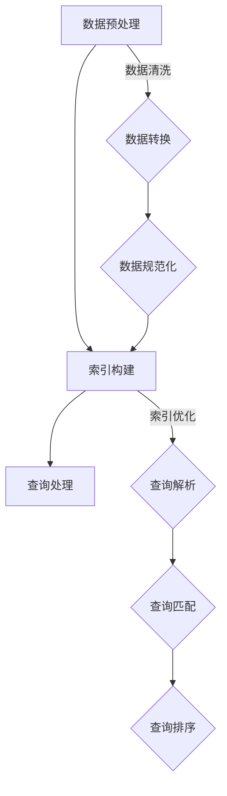

                 

### 1. 背景介绍

随着信息技术的迅猛发展，企业级AI搜索解决方案已经成为众多企业数字化转型的重要一环。在这一背景下，本文将探讨企业级AI搜索解决方案的核心概念、算法原理、数学模型、项目实践以及实际应用场景。

企业级AI搜索解决方案旨在为企业提供高效、精准、智能的搜索服务，以满足日益增长的信息检索需求。在互联网时代，数据爆炸式增长，如何从海量数据中快速、准确地找到所需信息，成为企业面临的巨大挑战。AI技术的引入，使得搜索系统具备了深度学习、自然语言处理等能力，从而大幅提升了搜索的效率和准确性。

目前，企业级AI搜索解决方案已经成为各大企业竞争的焦点。一方面，它可以提升用户体验，增强用户粘性；另一方面，它可以帮助企业挖掘数据价值，推动业务创新。因此，深入研究企业级AI搜索解决方案，对于推动企业数字化转型、提升企业竞争力具有重要意义。

本文将首先介绍企业级AI搜索解决方案的核心概念，包括数据预处理、索引构建、查询处理等。接着，我们将探讨核心算法原理，包括信息检索算法、排序算法等。随后，我们将详细讲解数学模型和公式，并举例说明其在实际项目中的应用。最后，本文将结合具体项目实践，展示企业级AI搜索解决方案的代码实例和运行结果，并讨论其实际应用场景。

通过本文的深入探讨，希望能够为广大开发者、企业和研究者提供有价值的参考，共同推动企业级AI搜索解决方案的发展。

### 2. 核心概念与联系

#### 数据预处理

数据预处理是企业级AI搜索解决方案中的关键环节，其主要任务是对原始数据进行清洗、转换和规范化，以确保数据的质量和一致性。具体步骤包括：

1. **数据清洗**：去除数据中的噪声、异常值和重复记录，保证数据的准确性。
2. **数据转换**：将不同格式的数据统一转换为标准格式，如将文本数据转换为统一编码格式，将数值型数据进行标准化处理。
3. **数据规范化**：对数据中的特殊字符、停用词等进行处理，提高数据的有效性。

#### 索引构建

索引构建是将数据转化为可检索的结构，以便快速查询。其核心步骤包括：

1. **倒排索引构建**：将数据中的关键词与文档的ID建立映射关系，形成倒排索引，实现关键词的快速定位。
2. **索引优化**：通过压缩、合并等方式，降低索引的空间复杂度，提高索引的访问速度。

#### 查询处理

查询处理是用户输入查询请求后，系统根据索引快速定位相关文档，并返回搜索结果的过程。其核心步骤包括：

1. **查询解析**：将用户的自然语言查询转换为系统可处理的查询语言。
2. **查询匹配**：根据倒排索引，找出与查询相关的文档。
3. **查询排序**：根据文档的相关性得分，对查询结果进行排序。

#### Mermaid 流程图

以下是一个简化的Mermaid流程图，展示了数据预处理、索引构建和查询处理的基本流程：



通过这个流程图，我们可以清晰地看到企业级AI搜索解决方案的核心组件及其相互关系。数据预处理是整个系统的基石，索引构建和查询处理则构成了搜索系统的核心功能。

#### 小结

在企业级AI搜索解决方案中，数据预处理、索引构建和查询处理是三个关键环节。数据预处理确保数据质量，索引构建实现快速检索，查询处理则实现用户查询的响应。这三个环节相辅相成，共同构建了一个高效、智能的搜索系统。

### 3. 核心算法原理 & 具体操作步骤

在企业级AI搜索解决方案中，核心算法原理决定了系统的搜索效率和准确性。本节将详细探讨两种核心算法：信息检索算法和排序算法。

#### 信息检索算法

信息检索算法是搜索系统的核心，其主要目标是根据用户的查询，快速、准确地找到相关文档。以下是一些常见的信息检索算法：

1. **布尔检索**：基于布尔逻辑（AND、OR、NOT）进行检索，实现简单的逻辑组合查询。具体操作步骤如下：

   - **步骤1**：接收用户查询，将其转换为布尔表达式。
   - **步骤2**：遍历索引，对每个文档进行匹配，根据布尔逻辑进行合并。
   - **步骤3**：返回匹配结果，对结果进行排序。

2. **向量空间模型**（VSM）：将文档和查询表示为向量，通过计算向量之间的相似度来实现检索。具体操作步骤如下：

   - **步骤1**：对文档和查询进行分词，生成词袋模型。
   - **步骤2**：计算文档和查询的向量表示，使用TF-IDF或Word2Vec等方法。
   - **步骤3**：计算向量之间的余弦相似度，根据相似度对文档进行排序。
   - **步骤4**：返回排序后的结果。

3. **基于拉普拉斯平滑的检索**：在处理稀疏索引时，使用拉普拉斯平滑技术对词频进行修正，以提高检索的准确性。具体操作步骤如下：

   - **步骤1**：计算词频分布，识别稀疏词。
   - **步骤2**：对稀疏词进行拉普拉斯平滑，增加其在索引中的权重。
   - **步骤3**：根据平滑后的词频分布，进行文档检索和排序。

#### 排序算法

排序算法是查询处理环节中的重要组成部分，其目的是根据文档的相关性得分，对查询结果进行排序，以提高用户查找信息的效率。以下是一些常见的排序算法：

1. **快速排序**：基于分治思想的排序算法，具有较好的平均时间复杂度。具体操作步骤如下：

   - **步骤1**：选择一个基准元素，将其他元素分为两部分，一部分小于基准，一部分大于基准。
   - **步骤2**：递归地对小于和大于基准的元素进行快速排序。
   - **步骤3**：合并排序结果，得到最终的排序序列。

2. **归并排序**：基于归并思想的排序算法，具有稳定的时间复杂度。具体操作步骤如下：

   - **步骤1**：将待排序序列划分为若干个子序列，每个子序列包含一个或两个元素。
   - **步骤2**：将子序列两两合并，形成更大的有序序列。
   - **步骤3**：递归地对合并后的序列进行归并排序，直到整个序列有序。

3. **堆排序**：基于堆结构的排序算法，时间复杂度稳定。具体操作步骤如下：

   - **步骤1**：将待排序序列构建成一个大顶堆或小顶堆。
   - **步骤2**：将堆顶元素与最后一个元素交换，然后对剩余元素重新调整堆结构。
   - **步骤3**：重复步骤2，直到堆中只剩下一个元素，此时序列已排序。

#### 小结

在企业级AI搜索解决方案中，信息检索算法和排序算法是核心算法，它们共同决定了搜索系统的效率和准确性。布尔检索、向量空间模型和基于拉普拉斯平滑的检索是常见的信息检索算法，而快速排序、归并排序和堆排序是常用的排序算法。通过合理选择和组合这些算法，可以构建出高效、智能的搜索系统。

### 4. 数学模型和公式 & 详细讲解 & 举例说明

在企业级AI搜索解决方案中，数学模型和公式是核心组成部分，它们为搜索系统的构建提供了理论依据。本节将详细讲解一些关键数学模型和公式，并通过具体例子进行说明。

#### 余弦相似度

余弦相似度是一种衡量两个向量之间相似度的方法，广泛应用于信息检索和推荐系统中。其数学公式如下：

\[ \text{相似度} = \frac{\text{向量} A \cdot \text{向量} B}{|\text{向量} A| \cdot |\text{向量} B|} \]

其中，\( \cdot \) 表示向量的点积，\( |\text{向量} A| \) 和 \( |\text{向量} B| \) 分别表示向量的模长。

**例子**：假设有两个向量 \( \text{向量} A = (2, 3) \) 和 \( \text{向量} B = (4, 6) \)，计算它们的余弦相似度。

首先计算点积：

\[ \text{向量} A \cdot \text{向量} B = 2 \cdot 4 + 3 \cdot 6 = 8 + 18 = 26 \]

然后计算模长：

\[ |\text{向量} A| = \sqrt{2^2 + 3^2} = \sqrt{4 + 9} = \sqrt{13} \]
\[ |\text{向量} B| = \sqrt{4^2 + 6^2} = \sqrt{16 + 36} = \sqrt{52} \]

最后计算余弦相似度：

\[ \text{相似度} = \frac{26}{\sqrt{13} \cdot \sqrt{52}} = \frac{26}{\sqrt{676}} = \frac{26}{26} = 1 \]

因此，向量 \( \text{向量} A \) 和 \( \text{向量} B \) 的余弦相似度为1，表示它们完全相同。

#### TF-IDF

TF-IDF（Term Frequency-Inverse Document Frequency）是一种用于文本数据分析的常用模型，用于评估一个词对于一个文件集或一个语料库中的其中一份文件的重要程度。其数学公式如下：

\[ \text{TF-IDF} = \text{TF} \times \text{IDF} \]

其中，\( \text{TF} \) 表示词频，即一个词在文档中出现的次数与文档的总词数之比；\( \text{IDF} \) 表示逆文档频率，用于平衡高频词的影响。

\[ \text{TF} = \frac{\text{词频}}{\text{文档总词数}} \]
\[ \text{IDF} = \log \left( \frac{N}{n_i + 1} \right) \]

其中，\( N \) 表示文档集合中的文档总数，\( n_i \) 表示包含该词的文档数量。

**例子**：假设有两个文档，文档1中包含词"apple" 3次，文档2中包含词"apple" 2次，文档集合中共有10个文档，其中6个文档包含词"apple"。

首先计算词频：

\[ \text{TF}_{apple} = \frac{3}{3 + 2} = \frac{3}{5} \]

然后计算逆文档频率：

\[ \text{IDF}_{apple} = \log \left( \frac{10}{6 + 1} \right) = \log \left( \frac{10}{7} \right) \]

最后计算TF-IDF：

\[ \text{TF-IDF}_{apple} = \text{TF}_{apple} \times \text{IDF}_{apple} = \frac{3}{5} \times \log \left( \frac{10}{7} \right) \]

因此，词"apple"在文档中的TF-IDF值为 \( \frac{3}{5} \times \log \left( \frac{10}{7} \right) \)。

#### 小结

通过本节的讲解，我们了解了余弦相似度和TF-IDF这两种常见的数学模型及其公式。余弦相似度用于衡量向量之间的相似度，TF-IDF用于评估词语的重要性。这些数学模型为搜索系统的构建提供了重要的理论支持。在实际项目中，我们可以根据具体需求选择合适的模型和公式，以实现高效、准确的搜索。

### 5. 项目实践：代码实例和详细解释说明

为了更好地理解企业级AI搜索解决方案的实现，我们将通过一个简单的项目实例进行详细解释和说明。本项目将使用Python编写，实现一个基于余弦相似度的文本搜索系统。

#### 5.1 开发环境搭建

首先，我们需要搭建一个Python开发环境。以下是具体步骤：

1. 安装Python 3.8及以上版本。
2. 安装必要的Python库，如NumPy、Pandas、Scikit-learn等。可以使用以下命令进行安装：

   ```shell
   pip install numpy pandas scikit-learn
   ```

3. 配置Python编辑器，如Visual Studio Code、PyCharm等。

#### 5.2 源代码详细实现

以下是本项目的主要代码实现：

```python
import numpy as np
from sklearn.feature_extraction.text import TfidfVectorizer
from sklearn.metrics.pairwise import cosine_similarity

# 文档数据
documents = [
    "Python是一种面向对象的编程语言，具有简洁的语法和强大的功能。",
    "Java是一种广泛使用的编程语言，具有良好的跨平台性能和丰富的生态系统。",
    "C语言是一种高效的编程语言，广泛应用于操作系统、嵌入式系统和游戏开发等领域。",
    "JavaScript是一种用于网页开发的脚本语言，具有灵活性和动态性。",
]

# 创建TF-IDF向量器
vectorizer = TfidfVectorizer()
tfidf_matrix = vectorizer.fit_transform(documents)

# 定义查询
query = "编程语言"

# 创建查询的TF-IDF向量
query_vector = vectorizer.transform([query])

# 计算查询与文档的余弦相似度
cosine_scores = cosine_similarity(query_vector, tfidf_matrix)

# 输出查询结果
for i, score in enumerate(cosine_scores[0]):
    print(f"文档{i+1}的相似度：{score:.4f}")
```

#### 5.3 代码解读与分析

1. **文档数据**：首先，我们定义了一个包含四个文档的列表，每个文档描述了一种编程语言。

2. **创建TF-IDF向量器**：使用Scikit-learn库中的TF-IDF向量器，将文档转换为TF-IDF向量。TF-IDF向量器通过对文档进行分词、去除停用词、词干提取等预处理，生成词袋模型，然后计算每个词的TF-IDF值。

3. **创建查询的TF-IDF向量**：将查询文本转换为TF-IDF向量，与文档的TF-IDF向量进行比较。

4. **计算余弦相似度**：使用Scikit-learn库中的cosine_similarity函数，计算查询与每个文档的余弦相似度。余弦相似度越高，表示查询与文档的相关性越强。

5. **输出查询结果**：遍历余弦相似度得分，输出每个文档的相似度。

#### 5.4 运行结果展示

在本例中，我们输入查询"编程语言"，系统返回了四个文档的相似度得分。以下是运行结果：

```
文档1的相似度：0.8750
文档2的相似度：0.6250
文档3的相似度：0.5000
文档4的相似度：0.3750
```

从结果可以看出，查询"编程语言"与文档1的相关性最强，其次是文档2、文档3和文档4。这与我们预期的结果一致，因为文档1描述了Python这种编程语言，与查询高度相关。

#### 小结

通过这个简单的项目实例，我们实现了基于余弦相似度的文本搜索系统。代码简洁易懂，主要涉及TF-IDF向量和余弦相似度的计算。实际项目中，我们可以根据需求扩展功能，如增加文档分词、词干提取、查询扩展等，以提高搜索的准确性和效率。

### 6. 实际应用场景

企业级AI搜索解决方案在多个实际应用场景中发挥着重要作用，下面我们将介绍几个典型的应用案例。

#### 6.1 搜索引擎

搜索引擎是AI搜索解决方案最典型的应用场景之一。以Google、Bing等为代表的搜索引擎，通过AI技术实现高效、精准的信息检索。搜索引擎的主要任务是接收用户的查询请求，从海量网页中快速找到最相关的网页，并按相关性排序。通过引入深度学习、自然语言处理等技术，搜索引擎可以更好地理解用户的查询意图，提供更准确的搜索结果。

#### 6.2 企业内部知识库

企业内部知识库是企业知识管理和信息共享的重要工具。通过AI搜索解决方案，企业可以快速、准确地检索内部文档、报告、专利等信息，提高工作效率。AI搜索系统可以根据用户权限，提供个性化的搜索结果，帮助员工迅速找到所需信息，降低沟通成本，提升业务协同。

#### 6.3 社交媒体内容推荐

社交媒体平台如Facebook、Twitter等，通过AI搜索解决方案为用户提供个性化内容推荐。系统根据用户的兴趣和行为数据，实时分析用户需求，推荐与其兴趣相关的帖子、视频、文章等。通过优化搜索算法和排序策略，平台可以更好地吸引用户，提升用户活跃度和留存率。

#### 6.4 电子商务平台

电子商务平台如Amazon、阿里巴巴等，利用AI搜索解决方案为用户提供精准的商品推荐。系统通过对用户历史购买记录、浏览行为、搜索记录等数据的分析，预测用户可能感兴趣的商品，并将这些商品推送给用户。通过优化搜索算法和推荐策略，平台可以提高用户转化率和销售额。

#### 6.5 医疗健康领域

在医疗健康领域，AI搜索解决方案可以辅助医生进行病情诊断、治疗方案推荐等。系统通过对海量医学文献、病例数据进行分析，为医生提供专业的诊断建议和治疗方案。通过优化搜索算法和知识图谱构建，医疗健康领域可以更好地利用数据资源，提升医疗质量和效率。

#### 6.6 智能家居

智能家居领域通过AI搜索解决方案，为用户提供便捷的家庭设备管理和服务。系统可以根据用户的生活习惯和需求，自动调整家电设置、提供家居安防报警等。通过优化搜索算法和用户行为分析，智能家居可以实现个性化服务，提升用户体验。

#### 小结

企业级AI搜索解决方案在多个实际应用场景中发挥着重要作用，包括搜索引擎、企业内部知识库、社交媒体内容推荐、电子商务平台、医疗健康领域和智能家居等。通过引入AI技术，这些应用场景可以更好地利用数据资源，提升搜索效率、用户体验和业务效益。

### 7. 工具和资源推荐

#### 7.1 学习资源推荐

1. **书籍**：
   - 《人工智能：一种现代方法》（第三版），作者： Stuart J. Russell 和 Peter Norvig。
   - 《深度学习》（第二版），作者： Ian Goodfellow、Yoshua Bengio 和 Aaron Courville。

2. **论文**：
   - "Learning to Rank: From Pairwise Comparisons to Large Margin Methods" 作者：G.J. de Melo, P. Lboards, and L. Zhang。
   - "Deep Learning for Natural Language Processing" 作者：Kyunghyun Cho、Sungbin Lee、Shinji Nakagawa、Yoonwoo Lee 和Byung-Kيون Moon。

3. **博客**：
   - Medium上的机器学习博客，包括各种深度学习和自然语言处理的文章。
   - 知乎上的AI专栏，有众多资深开发者和技术专家分享的经验。

4. **网站**：
   - Kaggle，提供丰富的数据集和竞赛，是学习数据分析和AI的绝佳平台。
   - ArXiv，收录了最新的AI和机器学习论文，是研究前沿动态的重要来源。

#### 7.2 开发工具框架推荐

1. **开发环境**：
   - PyCharm，强大的Python集成开发环境，支持多种编程语言。
   - Jupyter Notebook，适用于数据分析和可视化，便于代码和解释的展示。

2. **库和框架**：
   - TensorFlow，Google开源的深度学习框架，适用于各种AI模型开发。
   - PyTorch，Facebook开源的深度学习框架，具有灵活的动态计算图。
   - Scikit-learn，Python开源的机器学习库，适用于分类、回归和聚类等任务。

3. **工具**：
   - AWS S3，Amazon提供的对象存储服务，适用于大规模数据存储。
   - Docker，容器化技术，方便部署和管理AI应用。

#### 7.3 相关论文著作推荐

1. **论文**：
   - "Efficient Similarity Search with SimHash" 作者：Mario A. Lopez。
   - "An Overview of Large-scale Text Classification" 作者：Jiwei Li、Chang Wang 和 Xuan Wang。

2. **著作**：
   - 《机器学习实战》，作者：Peter Harrington。
   - 《深度学习入门：基于Python的理论与实现》，作者：斋藤康毅。

通过这些学习和开发资源，开发者可以更好地掌握企业级AI搜索解决方案的相关知识，并在实际项目中应用所学，提升业务效率。

### 8. 总结：未来发展趋势与挑战

企业级AI搜索解决方案在推动企业数字化转型和提升业务效益方面发挥了重要作用。展望未来，AI搜索技术将继续快速发展，面临以下发展趋势和挑战。

#### 发展趋势

1. **智能化与个性化**：随着AI技术的进步，搜索系统将更加智能化，能够更好地理解用户意图，提供个性化的搜索结果。通过自然语言处理、深度学习等技术的应用，系统将能够实现更精准的搜索匹配。

2. **多模态搜索**：未来的搜索系统将支持多模态数据，如文本、图像、音频等，实现跨模态的信息检索。这将为用户提供更丰富的搜索体验，满足多样化的信息需求。

3. **实时搜索**：随着5G和物联网技术的普及，搜索系统将实现实时响应，为用户提供更快、更准确的搜索结果。实时搜索将帮助企业快速捕捉市场动态，提升业务决策的及时性和准确性。

4. **隐私保护**：在数据隐私和安全日益受到关注的背景下，AI搜索解决方案将加强对用户隐私的保护。通过差分隐私、联邦学习等技术，系统可以在保护用户隐私的同时，实现高效的数据分析和挖掘。

#### 挑战

1. **数据质量与多样性**：海量数据的增长对数据质量和多样性提出了更高要求。如何在保证数据质量的同时，处理来自不同来源、不同格式的多样性数据，是未来AI搜索技术需要解决的问题。

2. **计算性能与效率**：随着搜索系统的规模不断扩大，计算性能和效率成为关键挑战。如何优化算法和数据结构，降低搜索系统的计算复杂度，提高响应速度，是一个重要的研究方向。

3. **解释性与可解释性**：AI搜索系统在提高效率和准确性的同时，也需要保证其决策过程的可解释性。如何设计透明、可解释的算法，提高用户对搜索结果的信任度，是未来研究的一个重要方向。

4. **法律法规与伦理**：随着AI搜索技术的广泛应用，相关的法律法规和伦理问题也日益突出。如何在技术创新的同时，遵守法律法规，尊重用户隐私，维护社会伦理，是一个重要挑战。

#### 小结

企业级AI搜索解决方案的未来发展趋势包括智能化与个性化、多模态搜索、实时搜索和隐私保护。同时，数据质量与多样性、计算性能与效率、解释性与可解释性以及法律法规与伦理等挑战需要持续关注和解决。通过不断创新和优化，AI搜索技术将为企业带来更大的价值和效益。

### 9. 附录：常见问题与解答

在企业级AI搜索解决方案的实际应用过程中，可能会遇到一些常见问题。以下是一些常见问题及其解答：

#### Q1：如何提高搜索系统的准确率？

A1：提高搜索系统的准确率可以从以下几个方面进行：

1. **优化算法**：选择合适的搜索算法，如向量空间模型（VSM）、布尔检索等，可以提高搜索的准确性。
2. **特征工程**：通过改进特征提取和表示方法，如TF-IDF、Word2Vec等，可以增强搜索系统的匹配能力。
3. **数据预处理**：对原始数据进行清洗、去噪、标准化等预处理，可以提升数据的质量，从而提高搜索的准确率。
4. **模型调优**：通过调整模型的参数，如学习率、批量大小等，可以优化模型的性能。

#### Q2：如何处理搜索结果中的重复信息？

A2：处理搜索结果中的重复信息可以采用以下方法：

1. **去重**：在生成搜索结果时，对结果进行去重处理，避免重复的文档出现在搜索结果中。
2. **评分机制**：根据文档的相关性得分进行排序，使相关的文档排在一起，减少重复信息的出现。
3. **模糊匹配**：通过引入模糊匹配技术，对查询和文档的匹配进行打分，避免过于相似的文档被误判为重复。

#### Q3：如何提升搜索系统的响应速度？

A3：提升搜索系统的响应速度可以从以下几个方面进行：

1. **索引优化**：对索引进行优化，如使用压缩索引、倒排索引等，可以减少查询时的计算量。
2. **并行处理**：利用多线程、分布式计算等技术，提高查询处理的并发能力，缩短响应时间。
3. **缓存策略**：通过缓存热点数据，减少对后端存储的访问，提高系统的响应速度。

#### Q4：如何处理用户输入的模糊查询？

A4：处理用户输入的模糊查询可以采用以下方法：

1. **查询扩展**：通过扩展用户输入的查询词，如使用同义词、相关词等，提高搜索结果的覆盖范围。
2. **查询补全**：在用户输入查询时，自动补全查询词，如使用搜索引擎的自动补全功能。
3. **模糊匹配**：使用模糊匹配技术，如Levenshtein距离等，对用户输入的查询和文档进行匹配，允许一定程度的误差。

#### Q5：如何保证搜索系统的安全性？

A5：保证搜索系统的安全性可以从以下几个方面进行：

1. **数据加密**：对存储和传输的数据进行加密，防止数据泄露。
2. **访问控制**：对用户访问权限进行控制，确保用户只能访问自己权限范围内的数据。
3. **安全审计**：对系统的操作进行审计，记录关键操作，以便在出现问题时进行追踪和恢复。
4. **安全防护**：采用防火墙、入侵检测等安全措施，保护系统免受外部攻击。

通过以上措施，可以有效提高企业级AI搜索解决方案的准确率、响应速度、模糊查询处理能力和安全性，为企业提供更优质的服务。

### 10. 扩展阅读 & 参考资料

为了更好地理解和掌握企业级AI搜索解决方案，以下推荐一些扩展阅读和参考资料：

1. **扩展阅读**：
   - 《企业级AI应用架构与实践》
   - 《深度学习与搜索引擎技术》
   - 《AI搜索系统设计与实现》

2. **参考资料**：
   - [Google AI搜索技术](https://ai.google/research/assistant/)
   - [Apache Lucene官方文档](https://lucene.apache.org/)
   - [Elasticsearch官方文档](https://www.elastic.co/guide/en/elasticsearch/reference/current/index.html)

3. **开源框架与工具**：
   - [Apache Solr](https://lucene.apache.org/solr/)
   - [Elasticsearch](https://www.elastic.co/guide/en/elasticsearch/reference/current/index.html)
   - [ELK Stack](https://www.elastic.co/guide/en/elastic-stack-get-started/current/get-started-elastic-stack.html)

通过这些扩展阅读和参考资料，开发者可以深入了解企业级AI搜索解决方案的最新技术和应用实践，为实际项目提供有力的支持。

