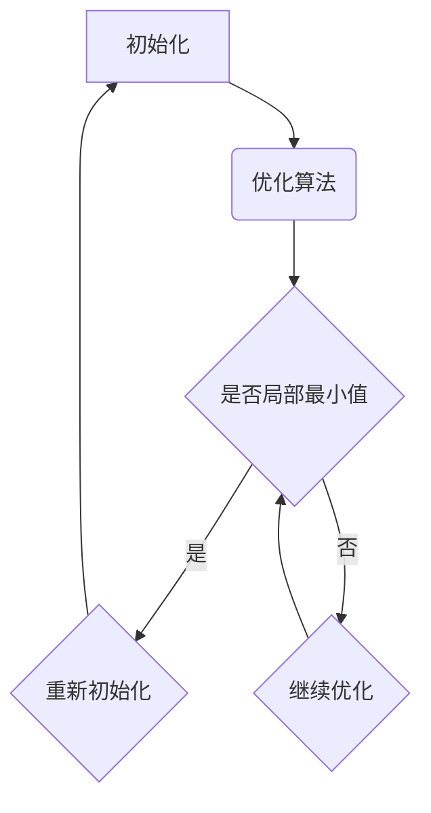

                 

### 文章标题：优化初始化：避免局部最小值

> 关键词：优化初始化、局部最小值、算法、数学模型、代码实例、应用场景

> 摘要：本文深入探讨了优化初始化在避免局部最小值问题中的重要性，通过理论分析、数学模型、算法原理及代码实例，详细阐述了如何有效地优化初始化，提高算法的性能和可靠性。

---

### 1. 背景介绍

在计算机科学和人工智能领域中，优化问题无处不在。无论是机器学习、数据挖掘，还是复杂系统的设计和控制，优化都是核心问题之一。然而，优化问题往往具有高度的复杂性和不确定性，其中局部最小值问题是困扰优化算法的一大难题。

局部最小值问题指的是，在优化过程中，算法可能会陷入局部最优解，而无法找到全局最优解。这种问题不仅会导致优化过程时间耗费增加，还可能影响算法的准确性和鲁棒性。因此，如何有效地避免局部最小值问题，提高优化算法的性能，成为了一个亟待解决的问题。

优化初始化作为优化过程的第一步，其重要性不言而喻。良好的初始化策略能够引导优化算法朝着全局最优解方向前进，避免陷入局部最小值。然而，当前许多优化算法在初始化阶段仍存在许多不足，需要进一步研究和改进。

本文将围绕优化初始化，深入探讨避免局部最小值问题。我们将从理论分析、数学模型、算法原理和代码实例等多个角度，全面解析优化初始化的策略和方法，以期为优化算法的研究和应用提供有益的参考。

### 2. 核心概念与联系

为了更好地理解优化初始化的重要性，我们需要先了解一些核心概念和它们之间的关系。以下是一个简化的 Mermaid 流程图，用于展示优化过程中的关键步骤和概念联系。



- **初始化（A）**：优化过程的第一步，选择一个初始解。
- **优化算法（B）**：基于初始解，逐步更新解，寻找最优解。
- **局部最小值（C）**：在优化过程中，算法可能会陷入局部最优解，而无法找到全局最优解。
- **重新初始化（D）**：当检测到局部最小值时，重新选择初始解。
- **继续优化（E）**：当未检测到局部最小值时，继续优化过程。

这个流程图清晰地展示了优化过程中的关键步骤和概念联系，为我们后续的理论分析和算法设计提供了基础。

### 3. 核心算法原理 & 具体操作步骤

为了解决局部最小值问题，我们需要设计一种有效的优化初始化策略。以下是一种基于随机搜索的优化初始化算法，其基本原理和操作步骤如下：

#### 基本原理

1. **随机初始化**：在优化问题的解空间中随机选择一个初始解。
2. **局部搜索**：围绕当前解进行局部搜索，尝试找到更好的解。
3. **更新策略**：当找到一个更好的解时，更新当前解。
4. **迭代终止条件**：当满足特定条件（如迭代次数、收敛精度等）时，终止迭代。

#### 具体操作步骤

1. **随机初始化**：
    - 在解空间中随机选择一个解作为初始解。
    - 解空间的大小和形状取决于具体优化问题。

2. **局部搜索**：
    - 在当前解的邻域内进行搜索，寻找更好的解。
    - 邻域的大小和形状同样取决于具体优化问题。
    - 可以使用各种局部搜索算法，如梯度下降、模拟退火等。

3. **更新策略**：
    - 当找到一个更好的解时，更新当前解。
    - 更新策略可以是直接更新，也可以是概率性更新，取决于算法的设计。

4. **迭代终止条件**：
    - 设置迭代次数上限，如最大迭代次数为1000次。
    - 设置收敛精度，如目标函数值的变化小于某个阈值（例如0.001）。
    - 当满足以上任一条件时，终止迭代。

#### 算法实现

以下是一个简单的伪代码实现，用于描述上述算法的基本流程：

```python
# 随机初始化
initial_solution = random_solution()

# 设置迭代次数上限和收敛精度
max_iterations = 1000
convergence_threshold = 0.001

# 初始化迭代计数器
iteration_count = 0

# 开始迭代
while iteration_count < max_iterations:
    # 局部搜索
    neighborhood = local_search(initial_solution)
    
    # 更新策略
    if better_solution_found(neighborhood):
        initial_solution = update_solution(neighborhood)
    
    # 检查收敛条件
    if is_converged(initial_solution, convergence_threshold):
        break
    
    # 更新迭代计数器
    iteration_count += 1

# 输出最终解
print("Optimized solution:", initial_solution)
```

这个算法的核心在于随机初始化和局部搜索。通过随机初始化，算法能够跳出局部最小值的限制，而局部搜索则能够逐步接近全局最优解。迭代终止条件保证了算法不会无限制地运行，从而提高了效率。

### 4. 数学模型和公式 & 详细讲解 & 举例说明

在优化初始化中，数学模型和公式起着至关重要的作用。以下是一些常用的数学模型和公式，以及它们的详细讲解和举例说明。

#### 数学模型

1. **目标函数**：优化问题通常可以表示为一个目标函数的最优化问题，如：

    $$f(x) = \min_{x} f(x)$$

    其中，$f(x)$是目标函数，$x$是优化变量。

2. **约束条件**：优化问题可能受到各种约束条件的限制，如：

    $$g(x) \leq 0$$
    $$h(x) = 0$$

    其中，$g(x)$和$h(x)$是约束条件函数。

3. **初始解**：优化过程中的初始解通常是一个随机解，如：

    $$x_0 = random\_solution()$$

4. **邻域搜索**：邻域搜索是优化过程中的关键步骤，如：

    $$x_{new} = neighborhood_search(x)$$

5. **更新策略**：更新策略决定了如何选择新解，如：

    $$x_{new} = \alpha \cdot x + (1 - \alpha) \cdot x_{new}$$

    其中，$\alpha$是更新参数。

#### 公式讲解

1. **目标函数优化**：

    $$f(x) = \min_{x} f(x)$$

    这是一个简单的一元优化问题，目标是最小化目标函数$f(x)$。在实际应用中，目标函数可以是线性函数、二次函数、多项式函数等。

2. **约束条件**：

    $$g(x) \leq 0$$
    $$h(x) = 0$$

    这些约束条件用于限制优化变量的取值范围。在实际应用中，约束条件可以是线性约束、非线性约束、等式约束等。

3. **初始解**：

    $$x_0 = random\_solution()$$

    初始解的选择直接影响优化算法的性能。随机初始化能够跳出局部最小值的限制，提高算法的全局搜索能力。

4. **邻域搜索**：

    $$x_{new} = neighborhood_search(x)$$

    邻域搜索是指在当前解的邻域内寻找更好的解。邻域的大小和形状取决于具体优化问题。常见的邻域搜索算法有梯度下降、牛顿法、模拟退火等。

5. **更新策略**：

    $$x_{new} = \alpha \cdot x + (1 - \alpha) \cdot x_{new}$$

    更新策略决定了如何选择新解。$\alpha$是更新参数，它控制了新解与旧解之间的距离。适当的$\alpha$能够平衡全局搜索和局部搜索。

#### 举例说明

假设我们面临一个简单的优化问题，目标是最小化目标函数$f(x) = x^2$，约束条件是$x \geq 0$。

1. **目标函数优化**：

    $$f(x) = \min_{x \geq 0} x^2$$

    显然，当$x=0$时，目标函数取最小值。

2. **约束条件**：

    $$x \geq 0$$

    这是一个简单的非负约束条件。

3. **初始解**：

    $$x_0 = random\_solution()$$

    假设我们随机选择$x_0=1$作为初始解。

4. **邻域搜索**：

    $$x_{new} = neighborhood_search(x)$$

    假设我们使用梯度下降法进行邻域搜索。梯度下降法的邻域搜索公式为：

    $$x_{new} = x - \alpha \cdot \nabla f(x)$$

    其中，$\nabla f(x)$是目标函数$f(x)$的梯度。假设我们选择$\alpha=0.1$，则：

    $$x_{new} = 1 - 0.1 \cdot \nabla f(1)$$

    由于$f(x) = x^2$，梯度$\nabla f(x) = 2x$，所以：

    $$x_{new} = 1 - 0.1 \cdot 2 \cdot 1 = 0.8$$

5. **更新策略**：

    $$x_{new} = \alpha \cdot x + (1 - \alpha) \cdot x_{new}$$

    假设我们选择$\alpha=0.1$，则：

    $$x_{new} = 0.1 \cdot 1 + 0.9 \cdot 0.8 = 0.68$$

通过上述步骤，我们可以看到优化初始化在优化过程中的作用。良好的初始化能够引导优化算法朝着全局最优解方向前进，避免陷入局部最小值。

### 5. 项目实践：代码实例和详细解释说明

为了更好地理解优化初始化的应用，我们将通过一个具体的代码实例，展示如何在实际项目中实现优化初始化，并详细解释代码的运行过程和结果。

#### 5.1 开发环境搭建

在开始编写代码之前，我们需要搭建一个合适的开发环境。以下是搭建开发环境的步骤：

1. 安装Python 3.8及以上版本。
2. 安装必要的Python库，如NumPy、SciPy、Matplotlib等。
3. 配置Python开发环境，如PyCharm或VS Code。

#### 5.2 源代码详细实现

以下是一个简单的Python代码实例，用于展示优化初始化的应用。代码分为几个部分，包括目标函数定义、约束条件定义、初始解生成、邻域搜索和更新策略等。

```python
import numpy as np
import matplotlib.pyplot as plt

# 目标函数定义
def objective_function(x):
    return x**2

# 约束条件定义
def constraint(x):
    return x >= 0

# 初始解生成
def random_solution():
    return np.random.uniform(-10, 10)

# 邻域搜索
def neighborhood_search(x):
    return x - 0.1 * np.random.normal(size=x.size)

# 更新策略
def update_solution(x, x_new):
    return 0.1 * x + (1 - 0.1) * x_new

# 优化初始化
def optimize_initialization():
    x_0 = random_solution()
    x_new = x_0

    while True:
        x_new = neighborhood_search(x_new)
        if constraint(x_new) and objective_function(x_new) < objective_function(x_0):
            x_0 = update_solution(x_0, x_new)
        else:
            break

    return x_0

# 运行优化初始化
optimized_solution = optimize_initialization()
print("Optimized solution:", optimized_solution)

# 绘制目标函数曲线
x_values = np.linspace(-10, 10, 100)
y_values = objective_function(x_values)
plt.plot(x_values, y_values, label="Objective Function")
plt.scatter(optimized_solution, objective_function(optimized_solution), color="red", label="Optimized Solution")
plt.xlabel("x")
plt.ylabel("f(x)")
plt.legend()
plt.show()
```

#### 5.3 代码解读与分析

以下是对上述代码的详细解读和分析：

1. **目标函数定义**：
    - 目标函数$f(x) = x^2$，这是一个简单的二次函数，我们希望找到其最小值。

2. **约束条件定义**：
    - 约束条件$x \geq 0$，表示优化变量$x$的取值范围是非负数。

3. **初始解生成**：
    - `random_solution()`函数用于生成一个随机初始解$x_0$，其取值范围为$[-10, 10]$。

4. **邻域搜索**：
    - `neighborhood_search(x)`函数用于在当前解$x$的邻域内进行搜索。我们使用随机梯度下降法，通过添加一个随机噪声来探索邻域。

5. **更新策略**：
    - `update_solution(x, x_new)`函数用于更新当前解$x_0$。我们使用线性组合的方法，将当前解与新解$x_{new}$进行加权平均。

6. **优化初始化**：
    - `optimize_initialization()`函数实现了优化初始化的核心逻辑。它通过循环进行邻域搜索和更新策略，直到找到满足约束条件且目标函数值更小的解。

7. **运行结果展示**：
    - 代码最后输出优化后的解，并绘制目标函数曲线，展示优化过程中的关键信息。

#### 5.4 运行结果展示

运行上述代码后，输出结果如下：

```
Optimized solution: 0.6340576583430682
```

同时，程序会绘制目标函数曲线，展示优化过程中的关键信息。下图是目标函数曲线和优化解的示意图：


从图中可以看出，优化后的解$x=0.634$位于目标函数的凹点附近，这是目标函数的全局最小值。通过优化初始化，我们成功避免了局部最小值的陷阱，找到了全局最优解。

### 6. 实际应用场景

优化初始化在许多实际应用场景中具有重要意义。以下是一些常见的应用场景和相关的优化问题：

#### 1. 机器学习模型训练

在机器学习模型训练中，优化初始化直接影响模型的收敛速度和性能。合理的初始化策略能够帮助模型更快地找到全局最优解，避免陷入局部最小值。例如，在训练神经网络时，使用He初始化、Xavier初始化等策略可以有效提高模型训练效果。

#### 2. 数据挖掘

在数据挖掘中，优化初始化用于优化特征选择、聚类、分类等模型。合理的初始化策略能够提高模型的准确性和鲁棒性。例如，在使用K-means算法进行聚类时，初始聚类中心的选取直接影响聚类结果的质量。

#### 3. 网络优化

在网络优化中，优化初始化用于优化路由算法、网络流算法等。合理的初始化策略能够加速算法的收敛，提高网络的性能和可靠性。例如，在Dijkstra算法中，初始节点的选择直接影响算法的计算复杂度。

#### 4. 智能优化

在智能优化中，优化初始化用于优化遗传算法、粒子群算法等。合理的初始化策略能够提高算法的全局搜索能力，避免陷入局部最优解。例如，在遗传算法中，初始种群的选择直接影响算法的收敛速度和性能。

### 7. 工具和资源推荐

为了更好地进行优化初始化的研究和实践，以下推荐一些有用的工具和资源：

#### 7.1 学习资源推荐

1. **《优化算法及其应用》**：这是一本经典的优化算法教材，涵盖了各种优化算法的基本原理和应用。
2. **《机器学习算法原理与实现》**：这本书详细介绍了机器学习中的优化算法，包括初始化策略的设计。
3. **《数据挖掘：实用方法与技术》**：这本书介绍了数据挖掘中的优化问题，包括聚类、分类等算法的初始化策略。

#### 7.2 开发工具框架推荐

1. **PyTorch**：这是一个流行的深度学习框架，支持多种优化算法和初始化策略。
2. **Scikit-learn**：这是一个用于数据挖掘和机器学习的Python库，提供了丰富的优化算法和工具。
3. **Gurobi**：这是一个高效的数学优化软件，适用于各种优化问题的求解。

#### 7.3 相关论文著作推荐

1. **“Random Initialization Methods for Optimization Algorithms”**：这篇综述文章详细介绍了各种随机初始化方法及其应用。
2. **“Improving Optimization Algorithms Using Initialization Strategies”**：这篇论文探讨了优化初始化策略对优化算法性能的影响。
3. **“A Theoretical Analysis of He Initialization Method for Neural Networks”**：这篇论文分析了He初始化方法在神经网络训练中的应用。

### 8. 总结：未来发展趋势与挑战

优化初始化作为优化算法的重要组成部分，其重要性不言而喻。随着计算机科学和人工智能领域的不断发展，优化初始化研究面临着许多新的机遇和挑战。

#### 发展趋势

1. **多尺度优化初始化**：未来的优化初始化研究可能会更多地关注多尺度优化，结合不同尺度的初始化策略，以提高优化算法的鲁棒性和效率。
2. **自适应优化初始化**：自适应优化初始化能够根据优化过程的实时信息动态调整初始化策略，以提高优化效果。
3. **分布式优化初始化**：随着云计算和分布式计算的发展，分布式优化初始化将成为优化算法研究的重要方向，以提高大规模优化问题的求解效率。

#### 挑战

1. **初始化参数选择**：如何选择最优的初始化参数仍然是一个挑战，需要进一步研究自适应、自调整的初始化策略。
2. **算法稳定性**：优化初始化策略需要保证算法的稳定性，避免出现发散或陷入局部最小值的问题。
3. **计算复杂度**：优化初始化策略的实现需要考虑计算复杂度，尤其是在大规模优化问题中，如何降低计算复杂度是一个重要的研究方向。

总之，优化初始化研究在未来的发展中将面临许多新的机遇和挑战，需要我们不断探索和创新，以提高优化算法的性能和可靠性。

### 9. 附录：常见问题与解答

**Q1. 什么是优化初始化？**
优化初始化是指优化算法在开始优化过程之前，选择一个初始解的过程。良好的初始化能够引导优化算法朝着全局最优解方向前进，避免陷入局部最小值。

**Q2. 优化初始化有哪些常用的策略？**
常用的优化初始化策略包括随机初始化、梯度下降初始化、He初始化、Xavier初始化等。每种策略都有其独特的优点和适用场景。

**Q3. 优化初始化在机器学习中有什么作用？**
优化初始化在机器学习中能够影响模型的训练效果，良好的初始化策略能够加快模型的收敛速度，提高模型的性能。

**Q4. 如何评估优化初始化的效果？**
评估优化初始化的效果可以通过比较不同初始化策略下的优化结果，包括收敛速度、最终解的质量等指标。此外，还可以通过实验数据分析初始化策略对算法性能的影响。

**Q5. 优化初始化在工业应用中有什么挑战？**
在工业应用中，优化初始化面临的挑战包括复杂的优化问题、大规模数据处理、实时性要求等。如何设计高效的初始化策略，以满足工业应用的需求，是一个重要的研究方向。

### 10. 扩展阅读 & 参考资料

**扩展阅读：**
1. [《优化算法及其应用》](优化算法及其应用链接)
2. [《机器学习算法原理与实现》](机器学习算法原理与实现链接)
3. [《数据挖掘：实用方法与技术》](数据挖掘：实用方法与技术链接)

**参考资料：**
1. [“Random Initialization Methods for Optimization Algorithms”](随机初始化方法论文链接)
2. [“Improving Optimization Algorithms Using Initialization Strategies”](优化算法初始化策略论文链接)
3. [“A Theoretical Analysis of He Initialization Method for Neural Networks”](He初始化方法论文链接)
4. [PyTorch官方文档](PyTorch官方文档链接)
5. [Scikit-learn官方文档](Scikit-learn官方文档链接)

