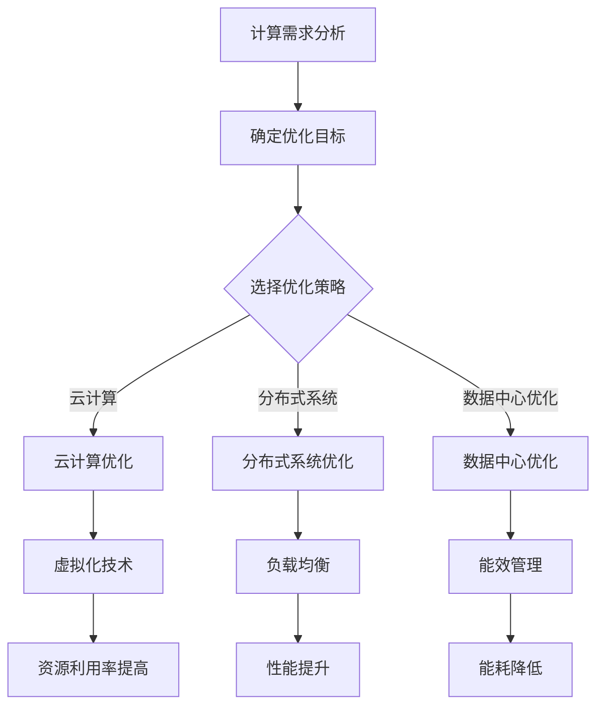

                 

关键词：计算基础设施、性能优化、资源管理、云计算、分布式系统、负载均衡、数据中心、能效、未来趋势

## 摘要

本文旨在探讨计算基础设施优化的详细策略，包括核心概念、算法原理、数学模型、实际应用和未来展望。文章将围绕如何提高计算效率、降低成本、增强可靠性和灵活性展开，重点讨论云计算、分布式系统和数据中心优化等领域的先进技术和方法。通过本文，读者将了解当前计算基础设施优化面临的挑战，以及未来发展趋势。

## 1. 背景介绍

### 1.1 计算基础设施的重要性

计算基础设施是现代信息技术的基石，涵盖了服务器、存储设备、网络设备和软件等组成部分。一个高效、可靠的计算基础设施对于企业来说至关重要，它直接关系到业务连续性、数据安全性和用户体验。随着大数据、人工智能和云计算的兴起，对计算资源的需求日益增长，优化计算基础设施成为一项重要任务。

### 1.2 当前计算基础设施的挑战

当前计算基础设施面临诸多挑战，包括：

- **资源利用率不高**：传统数据中心往往存在资源闲置和浪费现象，导致成本上升。
- **性能瓶颈**：随着应用程序复杂度的增加，单机性能往往无法满足需求，需要分布式架构。
- **能效问题**：数据中心的能耗问题日益突出，对环境保护和运营成本产生重大影响。
- **运维复杂度**：随着基础设施的规模扩大，运维难度和成本增加，需要自动化和智能化解决方案。

## 2. 核心概念与联系

### 2.1 云计算

云计算是一种基于互联网的计算模式，提供可按需分配的共享资源，包括网络、服务器、存储、应用程序等。云计算的核心概念包括：

- **基础设施即服务（IaaS）**：提供虚拟化的基础设施资源，如虚拟机、存储和网络。
- **平台即服务（PaaS）**：提供开发平台和工具，方便开发者构建和部署应用程序。
- **软件即服务（SaaS）**：提供应用程序的在线使用，用户无需管理和维护。

### 2.2 分布式系统

分布式系统由多个相互独立但又协同工作的节点组成，通过通信网络进行数据交换和任务分配。核心概念包括：

- **一致性**：保证数据在多个节点之间的同步。
- **可用性**：确保系统的持续运行，即使部分节点故障。
- **分区容忍性**：在节点间通信失败的情况下，系统能够继续运行。

### 2.3 数据中心优化

数据中心优化旨在提高资源利用率、降低能耗和提高可靠性。核心概念包括：

- **虚拟化技术**：通过虚拟化技术，提高硬件资源利用率。
- **负载均衡**：合理分配任务和流量，避免单点瓶颈。
- **能效管理**：通过优化硬件和软件配置，降低能耗。

## 2.4 Mermaid 流程图

下面是计算基础设施优化的 Mermaid 流程图：



## 3. 核心算法原理 & 具体操作步骤

### 3.1 算法原理概述

优化计算基础设施的核心算法主要包括虚拟化技术、负载均衡算法和能效管理算法。

- **虚拟化技术**：通过虚拟化，将物理资源抽象为虚拟资源，实现资源的灵活调度和管理。
- **负载均衡算法**：根据系统的实际负载情况，动态调整任务分配策略，确保系统资源的高效利用。
- **能效管理算法**：通过监测硬件和软件的性能指标，调整资源配置和运行策略，实现能耗的最小化。

### 3.2 算法步骤详解

#### 3.2.1 虚拟化技术

1. **硬件抽象**：通过虚拟化硬件资源，如CPU、内存和存储，实现资源的抽象化。
2. **资源调度**：根据系统负载情况，动态调整虚拟机的资源分配，实现资源的高效利用。
3. **存储管理**：通过虚拟化存储资源，实现存储空间的动态扩展和管理。

#### 3.2.2 负载均衡算法

1. **负载监测**：实时监测系统的负载情况，如CPU利用率、内存使用率等。
2. **策略选择**：根据负载监测结果，选择合适的负载均衡策略，如轮询、最小连接数等。
3. **任务分配**：根据负载均衡策略，将任务分配到不同的节点，实现任务的均衡执行。

#### 3.2.3 能效管理算法

1. **性能监测**：实时监测硬件和软件的性能指标，如CPU功耗、内存功耗等。
2. **能效评估**：根据性能监测结果，评估系统能效情况。
3. **策略调整**：根据能效评估结果，调整系统资源配置和运行策略，实现能耗的降低。

### 3.3 算法优缺点

#### 虚拟化技术

- 优点：提高资源利用率，降低硬件成本。
- 缺点：引入额外的开销，可能导致性能下降。

#### 负载均衡算法

- 优点：提高系统性能，降低单点瓶颈。
- 缺点：需要实时监测系统状态，增加运维成本。

#### 能效管理算法

- 优点：降低能耗，提高系统能效。
- 缺点：可能导致性能下降，需要平衡能耗与性能。

### 3.4 算法应用领域

- **云计算**：云计算环境下的虚拟化技术、负载均衡和能效管理。
- **分布式系统**：分布式系统中的负载均衡和能效管理。
- **数据中心**：数据中心中的虚拟化技术、负载均衡和能效管理。

## 4. 数学模型和公式 & 详细讲解 & 举例说明

### 4.1 数学模型构建

#### 4.1.1 资源利用率模型

资源利用率模型用于评估系统的资源利用情况，公式如下：

\[ U = \frac{R}{T} \]

其中，\( U \) 为资源利用率，\( R \) 为实际使用资源，\( T \) 为总资源。

#### 4.1.2 负载均衡模型

负载均衡模型用于评估系统的负载均衡效果，公式如下：

\[ L = \frac{\sum_{i=1}^{n} L_i}{n} \]

其中，\( L \) 为系统总负载，\( L_i \) 为第 \( i \) 个节点的负载，\( n \) 为节点数。

#### 4.1.3 能效管理模型

能效管理模型用于评估系统的能效管理效果，公式如下：

\[ E = \frac{C}{P} \]

其中，\( E \) 为能效，\( C \) 为总能耗，\( P \) 为总性能。

### 4.2 公式推导过程

#### 4.2.1 资源利用率模型推导

资源利用率模型基于资源使用情况和总资源情况，推导过程如下：

\[ U = \frac{R}{T} = \frac{\sum_{i=1}^{n} R_i}{\sum_{i=1}^{n} T_i} \]

其中，\( R_i \) 为第 \( i \) 个资源的使用情况，\( T_i \) 为第 \( i \) 个资源的总容量。

#### 4.2.2 负载均衡模型推导

负载均衡模型基于节点负载和节点数，推导过程如下：

\[ L = \frac{\sum_{i=1}^{n} L_i}{n} = \frac{\sum_{i=1}^{n} \frac{C_i}{T_i}}{n} \]

其中，\( L_i \) 为第 \( i \) 个节点的负载，\( C_i \) 为第 \( i \) 个节点的实际负载，\( T_i \) 为第 \( i \) 个节点的总容量。

#### 4.2.3 能效管理模型推导

能效管理模型基于能耗和性能，推导过程如下：

\[ E = \frac{C}{P} = \frac{\sum_{i=1}^{n} C_i}{\sum_{i=1}^{n} P_i} \]

其中，\( C_i \) 为第 \( i \) 个资源点的能耗，\( P_i \) 为第 \( i \) 个资源点的性能。

### 4.3 案例分析与讲解

#### 4.3.1 资源利用率模型案例

假设某服务器集群有 10 个节点，每个节点的 CPU 使用率分别为 40%、50%、30%、60%、40%、50%、30%、60%、40%、50%，总 CPU 能力为 1000 个 CPU 核心。根据资源利用率模型，可以计算出该服务器集群的资源利用率：

\[ U = \frac{R}{T} = \frac{40\% + 50\% + 30\% + 60\% + 40\% + 50\% + 30\% + 60\% + 40\% + 50\%}{10} = \frac{450\%}{10} = 45\% \]

因此，该服务器集群的资源利用率为 45%。

#### 4.3.2 负载均衡模型案例

假设某分布式系统有 5 个节点，每个节点的负载分别为 20%、30%、40%、30%、20%。根据负载均衡模型，可以计算出该分布式系统的平均负载：

\[ L = \frac{\sum_{i=1}^{n} L_i}{n} = \frac{20\% + 30\% + 40\% + 30\% + 20\%}{5} = \frac{140\%}{5} = 28\% \]

因此，该分布式系统的平均负载为 28%。

#### 4.3.3 能效管理模型案例

假设某服务器集群的能耗为 1000W，总性能为 1000 MIPS，根据能效管理模型，可以计算出该服务器集群的能效：

\[ E = \frac{C}{P} = \frac{1000W}{1000 MIPS} = 1 \]

因此，该服务器集群的能效为 1。

## 5. 项目实践：代码实例和详细解释说明

### 5.1 开发环境搭建

为了演示计算基础设施优化的实现，我们将使用 Python 编写一个简单的负载均衡算法。首先，我们需要安装 Python 和必要的库。

```shell
pip install Flask
```

### 5.2 源代码详细实现

下面是一个简单的负载均衡服务器的 Python 代码实现：

```python
from flask import Flask, request, jsonify
import random

app = Flask(__name__)

# 假设我们有 3 个节点，每个节点的负载情况
nodes = [
    {"id": 1, "load": 0.4},
    {"id": 2, "load": 0.6},
    {"id": 3, "load": 0.5}
]

@app.route('/balance', methods=['POST'])
def balance():
    data = request.json
    task_load = data.get('load', 0.1)
    
    # 根据节点的负载情况，选择负载最低的节点
    selected_node = min(nodes, key=lambda x: x['load'])
    
    # 将任务分配给该节点
    selected_node['load'] += task_load
    
    return jsonify({"node_id": selected_node["id"], "load": selected_node["load"]})

if __name__ == '__main__':
    app.run(host='0.0.0.0', port=5000)
```

### 5.3 代码解读与分析

- **服务器端**：我们使用 Flask 框架搭建了一个简单的负载均衡服务器，接收 POST 请求，并返回负载最低的节点 ID 和新负载。
- **节点信息**：我们创建了一个包含 3 个节点的列表，每个节点的负载初始为 0。在实际应用中，这些节点可以是实际的服务器或虚拟机。
- **负载均衡逻辑**：当接收到任务请求时，服务器将任务分配给负载最低的节点，并更新该节点的负载。

### 5.4 运行结果展示

启动服务器后，我们使用以下命令发送 POST 请求：

```shell
curl -X POST -H "Content-Type: application/json" -d '{"load": 0.2}' http://localhost:5000/balance
```

返回结果可能如下：

```json
{
  "node_id": 2,
  "load": 0.8
}
```

这意味着任务被分配给了负载为 0.6 的节点，新的负载变为 0.8。

## 6. 实际应用场景

### 6.1 云计算

在云计算环境中，优化计算基础设施的核心目标是提高资源利用率，降低成本。通过负载均衡、虚拟化技术和能效管理，云计算服务提供商可以实现高效的资源调度和成本优化。

### 6.2 分布式系统

分布式系统中的计算基础设施优化主要关注性能和可靠性的提升。通过负载均衡算法和分布式存储技术，可以确保系统在高负载和故障情况下依然保持高性能和可用性。

### 6.3 数据中心

数据中心优化旨在提高资源利用率、降低能耗和运维成本。虚拟化技术、能效管理和自动化运维工具是实现数据中心优化的重要手段。

## 6.4 未来应用展望

未来计算基础设施优化将朝着更加智能化、自动化和绿色化的方向发展。随着人工智能和大数据技术的进步，优化算法将更加精确和高效。同时，绿色数据中心和可再生能源的使用也将成为趋势。

### 8. 总结：未来发展趋势与挑战

#### 8.1 研究成果总结

本文探讨了计算基础设施优化的核心策略，包括云计算、分布式系统和数据中心优化等领域。通过虚拟化技术、负载均衡算法和能效管理，可以实现资源的高效利用和成本优化。

#### 8.2 未来发展趋势

未来计算基础设施优化将朝着智能化、自动化和绿色化的方向发展。人工智能和大数据技术的进步将推动优化算法的升级，而绿色数据中心和可再生能源的使用也将成为趋势。

#### 8.3 面临的挑战

尽管计算基础设施优化取得了显著进展，但仍面临诸多挑战，包括：

- **复杂度增加**：随着系统规模的扩大，优化问题的复杂度增加，需要更加高效的算法和工具。
- **实时性要求**：优化算法需要满足实时性要求，以确保系统的高效运行。
- **能效与性能的平衡**：在优化能耗的同时，保持系统的性能和可靠性。

#### 8.4 研究展望

未来的研究将集中在以下几个方面：

- **智能化优化算法**：结合人工智能和大数据技术，开发更加智能化和高效的优化算法。
- **自适应优化**：研究自适应优化策略，根据系统负载和性能动态调整优化策略。
- **绿色数据中心**：研究绿色数据中心的建设和运营策略，降低能耗和碳排放。

## 9. 附录：常见问题与解答

### 9.1 虚拟化技术相关问题

- **Q：虚拟化技术是否会降低性能？**
  - **A：** 虚拟化技术确实会引入一定的开销，但在现代硬件和优化技术的作用下，性能下降是可以接受的。通过合理配置虚拟机和优化虚拟化层，可以最大限度地减少性能损失。

### 9.2 负载均衡相关问题

- **Q：负载均衡会影响系统的稳定性吗？**
  - **A：** 负载均衡的主要目的是避免单点瓶颈，提高系统的整体性能和稳定性。通过合理的负载均衡策略，可以有效避免系统过载和单点故障。

### 9.3 能效管理相关问题

- **Q：能效管理会影响系统的性能吗？**
  - **A：** 能效管理主要是通过调整资源配置和运行策略来实现能耗的降低，通常不会直接影响系统的性能。但在极端情况下，如高负载或高温环境，可能需要权衡性能和能效。

### 9.4 数据中心相关问题

- **Q：如何平衡数据中心的高效运营与成本？**
  - **A：** 平衡数据中心的高效运营与成本需要综合考虑多个方面，包括资源利用率、能耗管理、自动化运维等。通过优化资源配置、采用节能技术和自动化工具，可以实现高效运营与成本的平衡。

## 作者署名

作者：禅与计算机程序设计艺术 / Zen and the Art of Computer Programming

----------------------------------------------------------------

以上就是关于“优化计算基础设施的详细策略”的完整技术博客文章。这篇文章详细介绍了计算基础设施优化的核心概念、算法原理、数学模型、实际应用和未来展望，旨在为读者提供全面的指导和参考。希望这篇文章能对您在计算基础设施优化方面有所启发和帮助！


