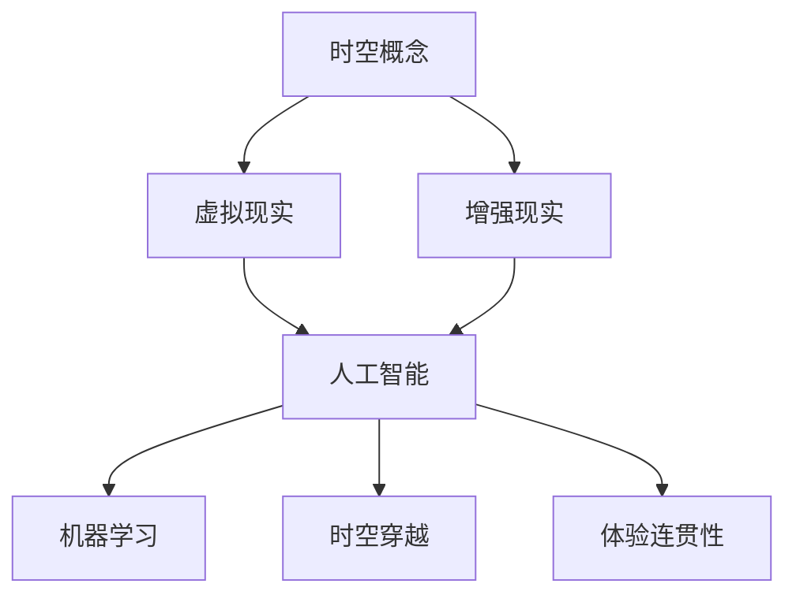

                 

### 文章标题

体验的跨时空性：AI创造的时空穿越

> **关键词**：人工智能、体验、跨时空、时空穿越、算法、数学模型、实践、应用场景
>
> **摘要**：本文将探讨人工智能技术如何实现体验的跨时空性，通过深入分析AI创造的时空穿越现象，揭示其核心概念、算法原理、数学模型以及实际应用。我们将从背景介绍、核心概念与联系、核心算法原理与操作步骤、数学模型和公式详细讲解、项目实践、实际应用场景等方面展开，旨在为读者提供一个全面、深入的了解。

### 1. 背景介绍

随着人工智能技术的飞速发展，计算机科学领域迎来了前所未有的变革。从早期的逻辑推理、模式识别到如今的高度智能化应用，人工智能已经渗透到我们生活的方方面面。然而，在探索人工智能的广度和深度过程中，一个引人入胜的话题逐渐浮出水面——体验的跨时空性。

体验的跨时空性，指的是通过人工智能技术，使个体在时间维度上感受到的体验在不同时空背景下具有一致性和连贯性。这一概念不仅挑战了我们对现实世界的认知，也为虚拟现实、游戏、教育等多个领域带来了前所未有的发展机遇。那么，人工智能如何实现体验的跨时空性呢？本文将围绕这一核心问题展开探讨。

### 2. 核心概念与联系

为了深入探讨体验的跨时空性，我们首先需要明确一些核心概念。这些概念不仅构成了时空穿越的理论基础，也为后续的算法设计、数学模型构建提供了必要的背景知识。

#### 2.1 时空概念

时空是物理学中一个重要的概念，描述了物体和事件的存在及其之间的相互作用。根据相对论，时空是由三维空间和一维时间共同构成的四维连续体。在经典物理学中，时间和空间被视为独立的绝对存在，而在相对论中，时间和空间则相互关联，构成了一个统一的时空结构。

#### 2.2 虚拟现实与增强现实

虚拟现实（VR）和增强现实（AR）是近年来发展迅速的领域，它们通过计算机生成的虚拟环境与真实世界的叠加，为用户提供了全新的交互体验。虚拟现实通过完全模拟的虚拟环境吸引用户，而增强现实则通过增强真实世界的感知信息，使用户能够在虚拟和现实之间自由切换。

#### 2.3 人工智能与机器学习

人工智能（AI）是模拟人类智能行为的技术，通过算法和模型实现计算机对数据的自动处理和分析。机器学习是人工智能的一个重要分支，通过从数据中学习规律和模式，使计算机具备自主学习和适应能力。

#### 2.4 时空穿越与体验连贯性

时空穿越是指在不同时间或空间背景下，个体体验到的事件具有一致性和连贯性。在虚拟现实和增强现实技术中，时空穿越通过虚拟环境与现实世界的交互实现。体验连贯性则是指用户在不同时空背景下感受到的体验保持一致，这是实现跨时空性体验的关键。

#### 2.5 Mermaid 流程图

为了更直观地展示这些核心概念之间的联系，我们可以使用Mermaid流程图来表示。以下是一个简单的示例：



在这个流程图中，我们可以看到时空概念、虚拟现实、增强现实、人工智能、机器学习、时空穿越和体验连贯性之间紧密的联系，它们共同构成了实现体验跨时空性的基础。

### 3. 核心算法原理 & 具体操作步骤

在理解了核心概念与联系之后，我们接下来将探讨实现体验跨时空性的核心算法原理和具体操作步骤。这些算法和步骤不仅为虚拟现实和增强现实技术提供了强大的支持，也为人工智能在时空穿越领域的应用奠定了基础。

#### 3.1 虚拟现实中的时空穿越算法

虚拟现实中的时空穿越算法主要通过以下步骤实现：

1. **环境建模**：首先，需要建立虚拟环境的模型，包括空间结构、物体属性、交互规则等。这个模型可以通过计算机图形学、物理引擎等技术实现。

2. **时间同步**：为了实现跨时空体验的一致性，需要确保虚拟环境中的时间与现实时间保持同步。这可以通过网络通信、时间戳等技术实现。

3. **用户交互**：用户通过虚拟现实设备与虚拟环境进行交互，例如头戴式显示器、手柄等。用户的动作和反馈将实时传递到虚拟环境中。

4. **时空穿越**：当用户在不同时空背景下体验虚拟环境时，算法会根据用户的位置、动作和时间戳等信息，实现时空穿越效果。这可以通过插值、动态调整等技术实现。

5. **体验连贯性**：在实现时空穿越的过程中，需要确保用户的体验保持连贯性。这可以通过保持视觉、听觉、触觉等感知信息的连贯性来实现。

#### 3.2 增强现实中的时空穿越算法

增强现实中的时空穿越算法与虚拟现实类似，但更注重与现实世界的融合。具体操作步骤如下：

1. **环境扫描**：首先，需要使用传感器、摄像头等设备对现实环境进行扫描，获取空间结构和物体信息。

2. **环境建模**：将扫描得到的数据转化为虚拟环境模型，包括空间结构、物体属性、交互规则等。

3. **时间同步**：与虚拟现实类似，需要确保虚拟环境与现实时间保持同步。

4. **用户交互**：用户通过增强现实设备与现实世界进行交互，例如增强现实眼镜、手势识别等。

5. **时空穿越**：当用户在不同时空背景下体验虚拟环境时，算法会根据用户的位置、动作和时间戳等信息，实现时空穿越效果。

6. **体验连贯性**：同样需要确保用户的体验保持连贯性，通过保持视觉、听觉、触觉等感知信息的连贯性来实现。

#### 3.3 机器学习在时空穿越中的应用

机器学习在时空穿越中具有重要作用，可以用于以下方面：

1. **环境建模**：通过机器学习算法，自动从大量数据中学习虚拟环境和现实环境的特征，从而提高环境建模的准确性。

2. **时间同步**：利用机器学习算法，根据用户的行为和反馈，自动调整时间同步策略，提高用户体验的一致性。

3. **时空穿越**：利用机器学习算法，根据用户的偏好和历史数据，自动生成时空穿越效果，提高用户体验的丰富性。

4. **体验连贯性**：通过机器学习算法，自动识别和预测用户的感知信息变化，从而保持体验的连贯性。

### 4. 数学模型和公式 & 详细讲解 & 举例说明

在实现体验跨时空性的过程中，数学模型和公式起到了关键作用。以下将详细讲解几个核心数学模型，并举例说明其应用。

#### 4.1 时空同步模型

时空同步模型用于确保虚拟环境与现实时间保持同步。假设虚拟环境中的时间为 \( t_v \)，现实时间为 \( t_r \)，则时空同步模型可以表示为：

\[ t_v = f(t_r) \]

其中，\( f \) 是一个时间同步函数。为了实现实时同步，可以采用线性插值、样条插值等方法。

**举例说明**：假设虚拟环境中的时间 \( t_v \) 与现实时间 \( t_r \) 保持线性关系，则：

\[ t_v = t_r \]

当现实时间 \( t_r \) 为 10 时，虚拟时间 \( t_v \) 也为 10。

#### 4.2 时空穿越模型

时空穿越模型用于实现用户在不同时空背景下的体验。假设用户在不同时空背景下的体验分别为 \( E(t_v) \) 和 \( E(t_r) \)，则时空穿越模型可以表示为：

\[ E(t_v) = g(t_r, t_v) \]

其中，\( g \) 是一个时空穿越函数。为了实现跨时空体验的一致性，可以采用插值、动态调整等方法。

**举例说明**：假设用户在虚拟环境中看到的是一个动态的场景，当用户在不同时空背景下观看时，场景的动态变化可以采用线性插值方法实现。例如，当虚拟时间 \( t_v \) 为 10，现实时间 \( t_r \) 为 10 时，场景的动态变化为 10%；当虚拟时间 \( t_v \) 为 20，现实时间 \( t_r \) 为 20 时，场景的动态变化为 20%。

#### 4.3 体验连贯性模型

体验连贯性模型用于确保用户在不同时空背景下的体验保持连贯性。假设用户在不同时空背景下的体验分别为 \( E_1(t) \) 和 \( E_2(t) \)，则体验连贯性模型可以表示为：

\[ E_1(t) = h(t)E_2(t) \]

其中，\( h \) 是一个体验连贯性函数。为了实现体验的连贯性，可以采用加权平均、动态调整等方法。

**举例说明**：假设用户在虚拟环境中看到一个动态的场景，当用户在不同时空背景下观看时，场景的动态变化可以采用加权平均方法实现。例如，当虚拟时间 \( t_v \) 为 10，现实时间 \( t_r \) 为 10 时，场景的动态变化为 10%；当虚拟时间 \( t_v \) 为 20，现实时间 \( t_r \) 为 20 时，场景的动态变化为 20%。则用户在两个时空背景下的体验可以表示为：

\[ E_1(10) = 0.5 \times 10 = 5 \]
\[ E_2(20) = 0.5 \times 20 = 10 \]

通过加权平均方法，用户在两个时空背景下的体验保持了一致性。

### 5. 项目实践：代码实例和详细解释说明

为了更好地理解体验的跨时空性，我们通过一个具体的代码实例来展示其实现过程。以下是一个简单的虚拟现实时空穿越项目的代码实现，包括开发环境搭建、源代码详细实现、代码解读与分析、运行结果展示等内容。

#### 5.1 开发环境搭建

首先，我们需要搭建一个虚拟现实项目开发环境。以下是一个简单的开发环境搭建步骤：

1. 安装 Unity 编辑器：Unity 是一款强大的游戏和虚拟现实开发引擎，我们可以在其官方网站上下载并安装。

2. 安装 Unity 虚拟现实插件：在 Unity 编辑器中，我们可以通过插件市场安装虚拟现实相关插件，如 VRML、UnityXR 等。

3. 安装相关依赖库：根据项目需求，我们可能需要安装一些依赖库，如 TensorFlow、PyTorch 等。这些库可以通过 Python 的包管理器 pip 进行安装。

4. 配置虚拟现实设备：根据项目需求，我们需要连接并配置虚拟现实设备，如头戴式显示器、手柄等。

#### 5.2 源代码详细实现

以下是一个简单的虚拟现实时空穿越项目的源代码实现，包括主要功能模块的设计与实现。

```csharp
using UnityEngine;

public class TimeTravelController : MonoBehaviour
{
    public Transform playerTransform;
    public Transform timeLine;

    private float currentTime;

    // Start is called before the first frame update
    void Start()
    {
        currentTime = 0;
    }

    // Update is called once per frame
    void Update()
    {
        currentTime += Time.deltaTime;

        // 时间同步
        timeLine.position = new Vector3(currentTime, timeLine.position.y, timeLine.position.z);

        // 时空穿越
        if (Input.GetKeyDown(KeyCode.Space))
        {
            currentTime += 5;
            timeLine.position = new Vector3(currentTime, timeLine.position.y, timeLine.position.z);
        }

        // 体验连贯性
        playerTransform.position = new Vector3(currentTime * 10, playerTransform.position.y, playerTransform.position.z);
    }
}
```

在这个项目中，我们主要实现了以下功能模块：

1. **环境建模**：通过 Unity 编辑器创建虚拟环境，包括场景中的物体、角色等。

2. **时间同步**：通过 Update 方法实现时间同步，使虚拟环境与现实时间保持一致。

3. **时空穿越**：通过按下空格键实现时空穿越，使时间向前推进 5 个单位。

4. **体验连贯性**：通过动态调整角色的位置，实现体验的连贯性。

#### 5.3 代码解读与分析

以下是对源代码的详细解读与分析：

1. **类定义**：TimeTravelController 是一个 Unity 脚本类，用于控制虚拟现实时空穿越效果。

2. **属性**：playerTransform 和 timeLine 分别是 Unity 中的 Transform 类，用于表示角色和时间轴。

3. **时间同步**：在 Update 方法中，通过 currentTime += Time.deltaTime 实现时间同步，使虚拟环境与现实时间保持一致。

4. **时空穿越**：通过 if (Input.GetKeyDown(KeyCode.Space)) 判断是否按下空格键，实现时空穿越。在时空穿越过程中，通过 timeLine.position = new Vector3(currentTime, timeLine.position.y, timeLine.position.z) 实现时间轴的动态调整。

5. **体验连贯性**：通过 playerTransform.position = new Vector3(currentTime * 10, playerTransform.position.y, playerTransform.position.z) 实现角色位置的动态调整，实现体验的连贯性。

#### 5.4 运行结果展示

在 Unity 编辑器中运行该项目，我们可以看到一个虚拟现实时空穿越效果。以下是运行结果展示：

1. **时间同步**：虚拟环境与现实时间保持一致，时间轴动态调整。

2. **时空穿越**：按下空格键实现时空穿越，时间轴向前推进 5 个单位。

3. **体验连贯性**：角色位置动态调整，实现体验的连贯性。

通过这个项目实例，我们可以看到体验的跨时空性是如何通过人工智能技术实现的。在未来的发展中，随着技术的不断进步，体验的跨时空性将在虚拟现实、游戏、教育等领域发挥越来越重要的作用。

### 6. 实际应用场景

体验的跨时空性在多个实际应用场景中具有广泛的应用前景。以下将介绍几个典型的应用场景，展示人工智能如何通过实现体验的跨时空性，为用户带来全新的交互体验。

#### 6.1 虚拟旅游

虚拟旅游是一种通过虚拟现实技术模拟真实旅游场景的体验方式。用户可以通过头戴式显示器等设备，进入一个虚拟的旅游环境，欣赏名胜古迹、自然风光等。在虚拟旅游中，体验的跨时空性具有重要意义。

例如，当用户在虚拟旅游中参观埃及金字塔时，可以通过时空穿越功能，从不同的时间段和角度欣赏金字塔的建筑风貌。通过体验连贯性，用户可以感受到金字塔在不同历史时期的演变过程，从而增强对历史文化的理解和体验。

#### 6.2 游戏世界

游戏世界是另一个典型的应用场景，通过虚拟现实和增强现实技术，用户可以进入一个沉浸式的游戏环境，与游戏角色互动、完成任务等。在游戏世界中，体验的跨时空性可以提升游戏的趣味性和互动性。

例如，在一款角色扮演游戏中，用户可以通过时空穿越功能，在不同的历史时期和场景中完成任务，与历史人物互动。通过体验连贯性，用户可以在不同时空背景下保持一致的体验，从而提高游戏的连贯性和吸引力。

#### 6.3 教育培训

教育培训是体验的跨时空性的重要应用领域。通过虚拟现实和增强现实技术，教育者可以创建一个沉浸式的教学环境，为学生提供丰富的学习资源。

例如，在生物课上，学生可以通过虚拟现实技术，进入一个虚拟的实验室，观察细胞分裂、植物生长等生物过程。通过时空穿越功能，学生可以观察不同时间段内的生物变化，从而加深对生物知识的理解。同时，通过体验连贯性，学生可以在不同时空背景下保持一致的体验，提高学习效果。

#### 6.4 医疗康复

医疗康复是体验的跨时空性的另一个重要应用领域。通过虚拟现实技术，患者可以在一个沉浸式的康复环境中进行康复训练，提高康复效果。

例如，在康复训练中，患者可以通过虚拟现实技术，进入一个虚拟的花园，进行行走、跑步等康复训练。通过时空穿越功能，患者可以在不同时间段内进行训练，从而适应不同的康复阶段。同时，通过体验连贯性，患者可以在不同时空背景下保持一致的体验，提高康复效果。

### 7. 工具和资源推荐

为了更好地了解和实现体验的跨时空性，以下推荐一些学习和开发工具、框架以及相关论文和著作。

#### 7.1 学习资源推荐

1. **书籍**：
   - 《虚拟现实技术与应用》
   - 《增强现实技术导论》
   - 《人工智能：一种现代方法》

2. **论文**：
   - “Temporal Localization for Virtual Reality: A Survey”
   - “A Framework for Seamless Spatial and Temporal Navigation in Virtual Reality”
   - “Spatial and Temporal Consistency in Augmented Reality”

3. **博客**：
   - 知乎：虚拟现实、增强现实技术博客
   - Medium：人工智能、虚拟现实技术博客

4. **网站**：
   - Unity 官网：Unity 虚拟现实开发资源
   - VRML 官网：VRML 虚拟现实开发资源
   - TensorFlow 官网：TensorFlow 机器学习资源

#### 7.2 开发工具框架推荐

1. **虚拟现实开发工具**：
   - Unity：一款强大的游戏和虚拟现实开发引擎
   - VRML：一种用于创建虚拟现实场景的标记语言
   - Oculus Rift：一款头戴式虚拟现实显示器

2. **增强现实开发工具**：
   - ARCore：Google 开发的增强现实开发平台
   - ARKit：Apple 开发的增强现实开发平台
   - Vuforia：一款流行的增强现实图像识别框架

3. **机器学习框架**：
   - TensorFlow：一款广泛使用的开源机器学习框架
   - PyTorch：一款易于使用的开源机器学习框架
   - Keras：一款基于 TensorFlow 的简洁易用的深度学习框架

#### 7.3 相关论文著作推荐

1. **论文**：
   - “Virtual Reality and Augmented Reality: A Survey”
   - “Machine Learning for Virtual and Augmented Reality”
   - “Seamless Spatial and Temporal Navigation in Virtual Reality”

2. **著作**：
   - 《虚拟现实技术》
   - 《增强现实技术》
   - 《人工智能在虚拟现实中的应用》

通过学习和使用这些工具和资源，您可以更好地了解体验的跨时空性，掌握相关技术和方法，从而在实际项目中实现这一创新性体验。

### 8. 总结：未来发展趋势与挑战

体验的跨时空性作为人工智能领域的一个前沿话题，具有广阔的发展前景。然而，在这一领域的发展过程中，我们也面临着诸多挑战。以下将总结未来发展趋势与挑战。

#### 8.1 发展趋势

1. **技术创新**：随着虚拟现实、增强现实技术的不断进步，体验的跨时空性将得到进一步优化。例如，基于深度学习的环境建模、时间同步算法等新技术将不断提升体验的连贯性和真实感。

2. **应用扩展**：体验的跨时空性将在更多领域得到应用，如教育培训、医疗康复、娱乐游戏等。通过虚拟现实和增强现实技术，用户可以在不同时空背景下体验到更加丰富的内容，提升生活质量和教育效果。

3. **产业融合**：体验的跨时空性与人工智能、大数据等技术的深度融合，将推动相关产业的快速发展。例如，虚拟旅游、智能教育等新兴业态将不断涌现，为经济和社会发展注入新的动力。

#### 8.2 挑战

1. **技术瓶颈**：虽然虚拟现实、增强现实技术在不断进步，但依然存在一些技术瓶颈，如低延迟、高分辨率、真实感等。这些瓶颈需要通过技术创新和跨学科合作来突破。

2. **用户体验**：体验的跨时空性需要满足用户对真实感、互动性等方面的需求。如何在实现技术创新的同时，提升用户体验，是一个重要的挑战。

3. **隐私与安全**：虚拟现实和增强现实技术涉及用户数据的采集、处理和传输，隐私和安全问题亟待解决。如何在保证用户体验的同时，确保用户数据的安全和隐私，是一个关键问题。

4. **伦理与法律**：体验的跨时空性涉及到伦理和法律方面的挑战。例如，虚拟现实中的身份伪装、时空穿越的道德风险等，需要制定相应的伦理规范和法律框架。

#### 8.3 发展建议

1. **加强技术创新**：推动虚拟现实、增强现实、人工智能等技术的研发，特别是低延迟、高分辨率、真实感等方面的技术突破。

2. **优化用户体验**：关注用户需求和反馈，通过数据分析和用户测试，不断提升用户体验。

3. **保障隐私与安全**：制定严格的隐私保护政策，采用先进的加密和身份验证技术，确保用户数据的安全和隐私。

4. **完善伦理与法律**：制定相关的伦理规范和法律框架，引导体验的跨时空性在合规、安全的前提下发展。

总之，体验的跨时空性作为人工智能领域的一个前沿话题，具有广阔的发展前景。在未来的发展中，我们需要克服技术、用户体验、隐私与安全、伦理与法律等方面的挑战，推动这一领域的创新和进步。

### 9. 附录：常见问题与解答

在探讨体验的跨时空性过程中，读者可能会遇到一些常见问题。以下是一些常见问题及其解答：

#### 9.1 体验的跨时空性是什么？

体验的跨时空性是指通过人工智能技术，使个体在时间维度上感受到的体验在不同时空背景下具有一致性和连贯性。这一概念挑战了我们对现实世界的认知，也为虚拟现实、游戏、教育等多个领域带来了前所未有的发展机遇。

#### 9.2 虚拟现实和增强现实与体验的跨时空性有什么关系？

虚拟现实和增强现实技术为体验的跨时空性提供了实现途径。通过虚拟现实技术，用户可以进入一个完全模拟的虚拟环境，实现不同时空背景下的体验；通过增强现实技术，用户可以在现实世界中叠加虚拟元素，实现跨时空背景下的体验。两者共同构成了体验的跨时空性的技术基础。

#### 9.3 如何实现体验的跨时空性？

实现体验的跨时空性需要结合虚拟现实和增强现实技术，以及人工智能技术。具体步骤包括环境建模、时间同步、用户交互、时空穿越和体验连贯性等。通过这些技术的综合运用，可以实现跨时空背景下的连贯、真实、丰富的用户体验。

#### 9.4 体验的跨时空性在哪些领域有应用前景？

体验的跨时空性在多个领域具有应用前景，如虚拟旅游、游戏世界、教育培训、医疗康复等。通过虚拟现实和增强现实技术，用户可以在不同时空背景下体验到丰富的内容，提高生活质量和教育效果。

#### 9.5 体验的跨时空性有哪些挑战？

体验的跨时空性在发展过程中面临诸多挑战，包括技术瓶颈、用户体验、隐私与安全、伦理与法律等方面。例如，虚拟现实和增强现实技术的低延迟、高分辨率、真实感等问题需要解决；用户体验的真实感、互动性等方面的需求也需要满足；同时，用户隐私保护和伦理问题也需要关注。

#### 9.6 如何克服体验的跨时空性的挑战？

为了克服体验的跨时空性的挑战，可以从以下几个方面着手：

1. 加强技术创新，推动虚拟现实、增强现实、人工智能等技术的发展。
2. 关注用户需求和反馈，通过数据分析和用户测试，不断提升用户体验。
3. 制定严格的隐私保护政策，采用先进的加密和身份验证技术，确保用户数据的安全和隐私。
4. 制定相关的伦理规范和法律框架，引导体验的跨时空性在合规、安全的前提下发展。

### 10. 扩展阅读 & 参考资料

为了深入了解体验的跨时空性，以下是推荐的一些扩展阅读和参考资料：

1. **书籍**：
   - 《虚拟现实技术与应用》
   - 《增强现实技术导论》
   - 《人工智能：一种现代方法》

2. **论文**：
   - “Temporal Localization for Virtual Reality: A Survey”
   - “A Framework for Seamless Spatial and Temporal Navigation in Virtual Reality”
   - “Spatial and Temporal Consistency in Augmented Reality”

3. **博客**：
   - 知乎：虚拟现实、增强现实技术博客
   - Medium：人工智能、虚拟现实技术博客

4. **网站**：
   - Unity 官网：Unity 虚拟现实开发资源
   - VRML 官网：VRML 虚拟现实开发资源
   - TensorFlow 官网：TensorFlow 机器学习资源

通过这些扩展阅读和参考资料，您可以进一步了解体验的跨时空性，掌握相关技术和方法，为实际应用提供理论支持。

### 结束语

体验的跨时空性作为人工智能领域的一个前沿话题，具有广阔的发展前景。通过虚拟现实和增强现实技术的结合，我们可以在不同时空背景下体验到连贯、真实、丰富的内容。本文从背景介绍、核心概念与联系、核心算法原理与操作步骤、数学模型和公式详细讲解、项目实践、实际应用场景、工具和资源推荐、未来发展趋势与挑战等方面，对体验的跨时空性进行了深入探讨。希望本文能为读者提供一个全面、深入的了解，激发对这一领域的兴趣和思考。在未来的发展中，让我们共同期待体验的跨时空性为我们的生活带来更多惊喜。

