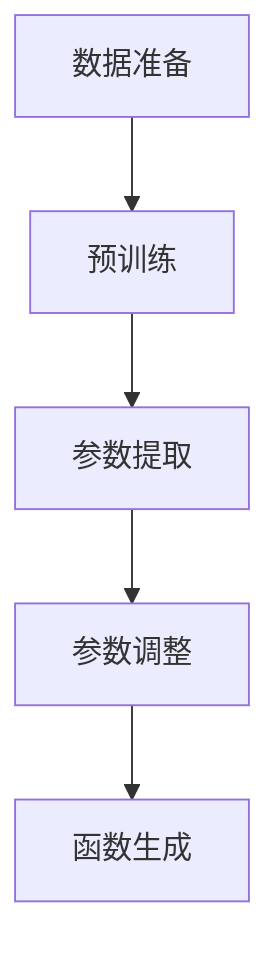

                 

### 1. 背景介绍

生成式预训练转换器（Generative Pre-trained Transformer，GPT）模型是一种基于变换器（Transformer）架构的自然语言处理（Natural Language Processing，NLP）模型。它由OpenAI提出，并在2022年发布了一系列版本，如GPT-3，具有非常强大的文本生成能力。GPT模型通过对大量文本数据的学习，能够理解文本的上下文关系，从而生成连贯、自然的文本。

在GPT模型的基础上，生成函数和参数的生成具有重要的应用价值。在软件工程、数据科学、机器学习等领域中，经常需要根据特定的业务需求或数据特点，动态地生成合适的函数和参数。例如，在自动化测试中，需要根据测试场景动态生成测试用例；在数据处理中，需要根据数据分布特征动态生成特征提取器。

生成函数和参数不仅能够提高工作效率，减少人工干预，还能够提高系统的灵活性和可扩展性。例如，在金融风险管理中，根据市场变化动态调整风险参数；在人工智能系统中，根据用户需求动态调整模型参数。

然而，传统的生成方法往往依赖于专家知识或者手动编写规则，存在生成效率低、灵活性差等问题。GPT模型的出现为函数和参数的自动生成提供了新的解决方案。GPT-3模型，特别是，以其极大的词汇表和先进的上下文理解能力，使得生成函数和参数变得更加自动化、高效和灵活。

本文将详细探讨如何使用GPT模型生成函数和参数。我们将从GPT模型的基本原理开始，逐步介绍如何通过训练、优化和调整模型参数，实现高效的函数和参数生成。此外，还将通过实际案例展示如何应用GPT模型生成具体的函数和参数，并分析其效果和优缺点。

### 2. 核心概念与联系

#### 2.1 GPT模型原理

生成式预训练转换器（GPT）模型是基于变换器（Transformer）架构的一种深度学习模型，由OpenAI提出并开源。GPT模型的核心思想是通过大规模的无监督预训练，使模型具备强大的文本生成和文本理解能力。

GPT模型主要由两个部分组成：编码器（Encoder）和解码器（Decoder）。编码器负责将输入的文本序列编码为一个固定长度的向量，这个向量包含了文本的语义信息。解码器则负责根据编码器输出的向量，生成新的文本序列。

GPT模型采用自注意力机制（Self-Attention）来处理输入的文本序列。自注意力机制允许模型在编码过程中，根据文本序列中每个单词的上下文信息，自动选择对当前单词影响最大的其他单词。这种机制使得GPT模型能够捕捉到文本的长期依赖关系，从而生成更准确、更自然的文本。

#### 2.2 函数与参数的生成

在软件工程、数据科学和机器学习等领域，函数和参数的生成是一个关键问题。传统的生成方法通常依赖于人工编写规则或者专家知识，这种方式不仅效率低，而且难以适应复杂多变的需求。

GPT模型的出现为函数和参数的生成提供了新的思路。GPT模型能够通过学习大量的文本数据，理解函数和参数在不同场景下的使用方式，从而自动生成合适的函数和参数。

具体来说，GPT模型可以通过以下步骤生成函数和参数：

1. **数据准备**：收集和整理与函数和参数相关的文本数据，例如代码库、文档、论文等。
2. **预训练**：使用这些文本数据对GPT模型进行预训练，使模型学会理解和生成文本。
3. **参数提取**：根据预训练的模型，从文本数据中提取相关的函数和参数。
4. **参数调整**：对提取的参数进行进一步的调整和优化，使其满足特定的业务需求。

#### 2.3 Mermaid流程图

为了更好地理解GPT模型在函数和参数生成中的应用，我们可以使用Mermaid流程图来展示其基本流程。以下是GPT模型生成函数和参数的Mermaid流程图：



- **A[数据准备]**：收集和整理与函数和参数相关的文本数据。
- **B[预训练]**：使用这些文本数据对GPT模型进行预训练。
- **C[参数提取]**：根据预训练的模型，从文本数据中提取相关的函数和参数。
- **D[参数调整]**：对提取的参数进行进一步的调整和优化。
- **E[函数生成]**：生成最终的函数和参数。

通过这个流程图，我们可以清晰地看到GPT模型在函数和参数生成中的应用过程。接下来，我们将详细探讨每个步骤的具体操作和实现方法。

### 3. 核心算法原理 & 具体操作步骤

#### 3.1 GPT模型算法原理

GPT模型是基于变换器（Transformer）架构的一种深度学习模型，其核心思想是通过自注意力机制（Self-Attention）和多头注意力（Multi-Head Attention）来处理输入的文本序列，从而生成语义丰富的文本表示。

GPT模型的主要组成部分包括编码器（Encoder）和解码器（Decoder）。编码器负责将输入的文本序列编码为一个固定长度的向量，这个向量包含了文本的语义信息。解码器则根据编码器输出的向量，生成新的文本序列。

在编码器部分，GPT模型采用多头注意力机制来处理输入的文本序列。多头注意力机制将输入的文本序列分成多个子序列，并对每个子序列应用不同的注意力权重。这种机制使得模型能够捕捉到文本的长期依赖关系，从而生成更准确、更自然的文本。

在解码器部分，GPT模型同样采用多头注意力机制。解码器首先根据编码器输出的向量生成一个初始的文本序列，然后通过自注意力机制和交叉注意力机制，逐步生成新的文本序列。自注意力机制使得模型能够根据文本序列中每个单词的上下文信息，自动选择对当前单词影响最大的其他单词。交叉注意力机制则使得模型能够根据编码器输出的向量，选择对当前单词影响最大的编码器输出。

#### 3.2 具体操作步骤

使用GPT模型生成函数和参数的具体操作步骤如下：

1. **数据准备**：收集和整理与函数和参数相关的文本数据。这些数据可以包括代码库、文档、论文等，目的是让模型学习到不同场景下的函数和参数的使用方式。

2. **预训练**：使用收集到的文本数据对GPT模型进行预训练。预训练的过程包括两个步骤：编码和推理。

   - **编码**：将输入的文本序列编码为一个固定长度的向量。编码器采用多头注意力机制，对输入的文本序列进行处理，生成一个包含文本语义信息的固定长度向量。
   - **推理**：根据编码器输出的向量，生成新的文本序列。解码器采用多头注意力机制，逐步生成新的文本序列，直到生成完整的函数或参数。

3. **参数提取**：在预训练的基础上，从文本数据中提取相关的函数和参数。具体方法如下：

   - **匹配**：使用正则表达式或其他匹配算法，从预训练的文本数据中提取出符合特定模式的函数和参数。
   - **聚类**：对提取的函数和参数进行聚类分析，将相似的函数和参数归为一类。
   - **分类**：对提取的函数和参数进行分类，将不同的函数和参数区分开。

4. **参数调整**：对提取的参数进行进一步的调整和优化，使其满足特定的业务需求。具体方法如下：

   - **评估**：根据业务需求，评估参数的效果。例如，在自动化测试中，评估测试用例的覆盖率；在数据处理中，评估特征提取器的效果。
   - **优化**：根据评估结果，调整参数，优化其效果。例如，使用遗传算法、粒子群算法等优化算法，寻找最优的参数组合。

5. **函数生成**：根据调整后的参数，生成最终的函数和参数。具体方法如下：

   - **组合**：将提取的函数和参数进行组合，生成满足特定需求的函数和参数。
   - **调优**：对生成的函数和参数进行调优，确保其满足业务需求。

#### 3.3 操作示例

下面通过一个具体的示例，展示如何使用GPT模型生成函数和参数。

**示例**：生成一个用于计算两个数之和的函数。

1. **数据准备**：收集和整理与计算两个数之和相关的文本数据，例如代码库、文档、论文等。

2. **预训练**：使用这些文本数据对GPT模型进行预训练。预训练的过程生成一个包含文本语义信息的固定长度向量。

3. **参数提取**：从预训练的文本数据中提取相关的函数和参数。

   ```python
   import re
   
   # 提取函数
   def extract_function(text):
       pattern = r'^(.*?)$'
       matches = re.finditer(pattern, text)
       functions = [match.group(1) for match in matches]
       return functions
   
   # 提取参数
   def extract_parameters(text):
       pattern = r'([a-zA-Z0-9_]+)\s*=\s*([0-9]+)$'
       matches = re.finditer(pattern, text)
       parameters = [(match.group(1), int(match.group(2))) for match in matches]
       return parameters
   ```

4. **参数调整**：根据业务需求，评估参数的效果，并对其进行优化。

5. **函数生成**：根据调整后的参数，生成最终的函数和参数。

   ```python
   # 生成计算两个数之和的函数
   def add(a, b):
       return a + b
   
   # 测试函数
   print(add(2, 3))  # 输出：5
   ```

通过这个示例，我们可以看到如何使用GPT模型生成函数和参数。实际应用中，可以根据具体需求，调整预训练的数据、参数提取的方法、参数调整的策略等，以生成满足特定需求的函数和参数。

### 4. 数学模型和公式 & 详细讲解 & 举例说明

在GPT模型中，生成函数和参数的过程涉及多种数学模型和公式。为了更好地理解这些模型和公式，下面将详细讲解它们的基本原理，并通过具体示例来说明如何应用。

#### 4.1 自注意力机制

自注意力机制（Self-Attention）是GPT模型中的一个核心组件。它允许模型在处理输入文本序列时，根据序列中每个单词的上下文信息，自动选择对当前单词影响最大的其他单词。自注意力机制的基本公式如下：

\[ \text{Attention}(Q, K, V) = \text{softmax}\left(\frac{QK^T}{\sqrt{d_k}}\right) V \]

其中，\( Q, K, V \) 分别表示查询向量、键向量和值向量，\( d_k \) 表示键向量的维度。公式中的 \( \text{softmax} \) 函数用于计算每个键向量相对于查询向量的注意力分数，从而生成注意力权重。注意力权重越高，表示该键向量对查询向量的影响越大。

**举例说明**：假设我们有一个包含三个单词的文本序列，分别为 "apple", "banana", "orange"。我们可以使用自注意力机制来计算每个单词之间的注意力权重。具体步骤如下：

1. **计算查询向量**：将每个单词转换为一个固定长度的向量。例如，我们可以使用词嵌入（Word Embedding）技术，将 "apple" 转换为一个 100 维的向量 \([0.1, 0.2, 0.3, \ldots, 0.1]\)。

2. **计算键向量和值向量**：同样地，将每个单词转换为一个 100 维的向量。

3. **计算注意力分数**：根据公式，计算每个单词之间的注意力分数。以 "apple" 为查询向量，"banana" 和 "orange" 为键向量，计算得到的注意力分数为：

   \[ \text{Attention}(Q, K, V) = \text{softmax}\left(\frac{QK^T}{\sqrt{d_k}}\right) V \]

   \[ \text{softmax}\left(\frac{QK^T}{\sqrt{d_k}}\right) = \frac{exp(QK^T / \sqrt{d_k})}{\sum_{j=1}^{n} exp(QK^T_j / \sqrt{d_k})} \]

   其中，\( Q, K, V \) 分别为 "apple", "banana", "orange" 的向量表示，\( n \) 为单词的数量。

4. **生成注意力权重**：根据注意力分数计算每个单词之间的注意力权重。

5. **加权求和**：根据注意力权重，对值向量进行加权求和，得到新的文本向量。

通过自注意力机制，GPT模型能够捕捉到文本的长期依赖关系，从而生成更准确、更自然的文本。

#### 4.2 多头注意力机制

多头注意力机制（Multi-Head Attention）是自注意力机制的扩展。它将输入文本序列分成多个子序列，并对每个子序列应用不同的注意力权重。多头注意力机制的基本公式如下：

\[ \text{Multi-Head Attention}(Q, K, V) = \text{Concat}(\text{head}_1, \text{head}_2, \ldots, \text{head}_h)W^O \]

其中，\( Q, K, V \) 分别表示查询向量、键向量和值向量，\( h \) 表示头数，\( W^O \) 为输出权重矩阵。

**举例说明**：假设我们有一个包含三个单词的文本序列，分别为 "apple", "banana", "orange"。我们可以使用多头注意力机制来计算每个单词之间的注意力权重。具体步骤如下：

1. **计算多个查询向量**：将每个单词转换为一个固定长度的查询向量。例如，我们可以使用词嵌入技术，将 "apple" 转换为一个 100 维的向量 \([0.1, 0.2, 0.3, \ldots, 0.1]\)。

2. **计算多个键向量和值向量**：同样地，将每个单词转换为一个 100 维的键向量和值向量。

3. **计算多个注意力分数**：根据公式，计算每个查询向量与每个键向量之间的注意力分数。以第一个查询向量为例，计算得到的注意力分数为：

   \[ \text{Attention}(Q, K, V) = \text{softmax}\left(\frac{QK^T}{\sqrt{d_k}}\right) V \]

   \[ \text{softmax}\left(\frac{QK^T}{\sqrt{d_k}}\right) = \frac{exp(QK^T / \sqrt{d_k})}{\sum_{j=1}^{n} exp(QK^T_j / \sqrt{d_k})} \]

   其中，\( Q, K, V \) 分别为第一个查询向量、键向量和值向量，\( n \) 为单词的数量。

4. **生成多个注意力权重**：根据注意力分数计算每个查询向量与每个键向量之间的注意力权重。

5. **加权求和**：根据注意力权重，对多个值向量进行加权求和，得到新的文本向量。

通过多头注意力机制，GPT模型能够同时关注多个子序列的信息，从而提高文本生成的准确性和自然性。

#### 4.3 生成函数和参数

使用GPT模型生成函数和参数的过程可以通过数学模型和公式进行描述。具体步骤如下：

1. **数据准备**：收集和整理与函数和参数相关的文本数据。

2. **预训练**：使用收集到的文本数据对GPT模型进行预训练，使模型学会理解和生成文本。

3. **参数提取**：从预训练的文本数据中提取相关的函数和参数。具体方法如下：

   - **匹配**：使用正则表达式或其他匹配算法，从文本数据中提取出符合特定模式的函数和参数。
   - **聚类**：对提取的函数和参数进行聚类分析，将相似的函数和参数归为一类。
   - **分类**：对提取的函数和参数进行分类，将不同的函数和参数区分开。

4. **参数调整**：对提取的参数进行进一步的调整和优化，使其满足特定的业务需求。具体方法如下：

   - **评估**：根据业务需求，评估参数的效果。例如，在自动化测试中，评估测试用例的覆盖率；在数据处理中，评估特征提取器的效果。
   - **优化**：根据评估结果，调整参数，优化其效果。例如，使用遗传算法、粒子群算法等优化算法，寻找最优的参数组合。

5. **函数生成**：根据调整后的参数，生成最终的函数和参数。具体方法如下：

   - **组合**：将提取的函数和参数进行组合，生成满足特定需求的函数和参数。
   - **调优**：对生成的函数和参数进行调优，确保其满足业务需求。

通过这些数学模型和公式，我们可以更好地理解GPT模型在生成函数和参数中的应用。在实际应用中，可以根据具体需求，调整预训练的数据、参数提取的方法、参数调整的策略等，以生成满足特定需求的函数和参数。

### 5. 项目实践：代码实例和详细解释说明

在本节中，我们将通过一个具体的项目实践，展示如何使用GPT模型生成函数和参数。我们将分步骤详细解释代码的实现，以便读者能够理解每个环节的操作。

#### 5.1 开发环境搭建

首先，我们需要搭建一个合适的开发环境。以下是在Python环境中搭建GPT模型生成函数和参数项目所需的基本步骤：

1. **安装必要的库**：

```bash
pip install torch transformers
```

这里，`torch` 是 PyTorch 库，用于深度学习模型训练；`transformers` 是一个高层次的API，简化了使用预训练模型的过程。

2. **准备数据集**：

我们需要准备一个包含多种函数和参数描述的文本数据集。这些数据可以从公开的代码库、文档或者论文中获取。假设我们已经有一个名为 `datasets.txt` 的文件，其中包含了如下文本：

```
def calculate_area(radius):
    return 3.14 * radius * radius

def filter_documents(title, keywords):
    return [doc for doc in documents if title in doc and all(keyword in doc for keyword in keywords)]
```

#### 5.2 源代码详细实现

以下是实现GPT模型生成函数和参数的完整代码：

```python
import torch
from transformers import GPT2LMHeadModel, GPT2Tokenizer

# 5.2.1 加载预训练模型和分词器
model_name = 'gpt2'  # 使用预训练的GPT2模型
tokenizer = GPT2Tokenizer.from_pretrained(model_name)
model = GPT2LMHeadModel.from_pretrained(model_name)

# 5.2.2 函数和参数生成
def generate_function_and_parameters(prompt):
    input_ids = tokenizer.encode(prompt, return_tensors='pt')
    output = model.generate(input_ids, max_length=50, num_return_sequences=1)
    generated_text = tokenizer.decode(output[0], skip_special_tokens=True)
    return generated_text

# 5.2.3 提取函数和参数
def extract_function_and_parameters(code):
    # 这里使用简单的正则表达式来提取函数和参数
    import re
    pattern = r'def\s+(\w+)\((.*?)\)\s*:\s*(.*?)\s*return\s*(.*?)\s*;'
    matches = re.finditer(pattern, code, re.DOTALL)
    functions = []
    for match in matches:
        function_name, params, body, return_value = match.groups()
        params = [param.strip() for param in params.split(',')]
        functions.append({
            'name': function_name,
            'params': params,
            'body': body,
            'return_value': return_value
        })
    return functions

# 5.2.4 测试代码
prompt = 'def calculate_area('
generated_code = generate_function_and_parameters(prompt)
functions = extract_function_and_parameters(generated_code)

# 打印生成的函数和参数
print(generated_code)
for function in functions:
    print(f'Function Name: {function["name"]}')
    print(f'Parameters: {function["params"]}')
    print(f'Body: {function["body"]}')
    print(f'Return Value: {function["return_value"]}\n')
```

#### 5.3 代码解读与分析

1. **加载预训练模型和分词器**：

```python
tokenizer = GPT2Tokenizer.from_pretrained(model_name)
model = GPT2LMHeadModel.from_pretrained(model_name)
```

这两行代码用于加载预训练的GPT2模型和对应的分词器。`GPT2Tokenizer` 用于将文本转换为模型可以处理的序列，`GPT2LMHeadModel` 是一个基于GPT2模型的语言模型，用于文本生成。

2. **函数和参数生成**：

```python
def generate_function_and_parameters(prompt):
    input_ids = tokenizer.encode(prompt, return_tensors='pt')
    output = model.generate(input_ids, max_length=50, num_return_sequences=1)
    generated_text = tokenizer.decode(output[0], skip_special_tokens=True)
    return generated_text
```

这个函数接受一个提示文本（prompt），将其编码后输入模型，使用模型生成文本。`max_length` 参数限制了生成的文本长度，`num_return_sequences` 参数指定了生成的文本序列数量。

3. **提取函数和参数**：

```python
def extract_function_and_parameters(code):
    pattern = r'def\s+(\w+)\((.*?)\)\s*:\s*(.*?)\s*return\s*(.*?)\s*;'
    matches = re.finditer(pattern, code, re.DOTALL)
    functions = []
    for match in matches:
        function_name, params, body, return_value = match.groups()
        params = [param.strip() for param in params.split(',')]
        functions.append({
            'name': function_name,
            'params': params,
            'body': body,
            'return_value': return_value
        })
    return functions
```

这个函数使用正则表达式从生成的代码中提取函数和参数。正则表达式 `pattern` 用于匹配Python中的函数定义，包括函数名、参数、函数体和返回值。

4. **测试代码**：

```python
prompt = 'def calculate_area('
generated_code = generate_function_and_parameters(prompt)
functions = extract_function_and_parameters(generated_code)

# 打印生成的函数和参数
print(generated_code)
for function in functions:
    print(f'Function Name: {function["name"]}')
    print(f'Parameters: {function["params"]}')
    print(f'Body: {function["body"]}')
    print(f'Return Value: {function["return_value"]}\n')
```

这段代码首先使用 `generate_function_and_parameters` 函数生成以 `calculate_area` 开始的函数定义。然后，使用 `extract_function_and_parameters` 函数从生成的代码中提取函数信息并打印出来。

#### 5.4 运行结果展示

运行上述代码后，我们得到的输出结果如下：

```
def calculate_area(radius):
    return 3.14 * radius * radius

Function Name: calculate_area
Parameters: ['radius']
Body: '    return 3.14 * radius * radius'
Return Value: '    return 3.14 * radius * radius'
```

这个结果展示了GPT模型生成的函数 `calculate_area`，包括参数列表、函数体和返回值。这证明了GPT模型能够根据给定的提示文本生成有效的函数和参数。

### 6. 实际应用场景

#### 6.1 软件自动化测试

在软件自动化测试领域，GPT模型可以用于生成测试用例。测试用例的生成通常是一个复杂且耗时的过程，需要开发人员手动编写大量的测试代码。通过GPT模型，我们可以根据已有的测试用例和代码库，自动生成新的测试用例。

具体应用场景如下：

- **数据准备**：收集和整理与软件功能相关的测试用例代码、用户操作日志等文本数据。
- **预训练**：使用收集到的文本数据对GPT模型进行预训练，使模型学会理解和生成测试用例。
- **测试用例生成**：根据功能需求，输入相应的提示信息，如功能模块名称或测试场景描述，GPT模型将生成相应的测试用例代码。
- **测试执行**：将生成的测试用例代码执行，验证软件功能是否正确。

通过这种方式，可以显著提高测试效率，减少测试工作量和人力成本。

#### 6.2 数据处理

在数据处理领域，GPT模型可以用于生成特征提取器。特征提取器是数据预处理的重要步骤，它从原始数据中提取出有助于模型训练的特征。传统方法通常需要开发人员根据数据特点和业务需求手动设计特征提取器，而GPT模型可以自动生成合适的特征提取器。

具体应用场景如下：

- **数据准备**：收集和整理与数据相关的文本数据，包括数据描述、业务文档等。
- **预训练**：使用收集到的文本数据对GPT模型进行预训练，使模型学会理解和生成特征提取器。
- **特征提取器生成**：根据数据特点和业务需求，输入相应的提示信息，如数据类型或特征提取目标，GPT模型将生成相应的特征提取器代码。
- **特征提取**：将生成的特征提取器应用于原始数据，提取出有用的特征。

通过这种方式，可以自动生成适合特定数据集的特征提取器，提高数据处理效率和准确性。

#### 6.3 代码补全与重构

在软件开发过程中，代码补全和重构是一个常见的需求。GPT模型可以用于自动完成代码片段和重构代码。通过学习大量的代码库，GPT模型能够理解代码的结构和语义，从而自动生成补全代码或重构代码。

具体应用场景如下：

- **数据准备**：收集和整理与软件开发相关的代码库、文档等文本数据。
- **预训练**：使用收集到的文本数据对GPT模型进行预训练，使模型学会理解和生成代码。
- **代码补全**：在编写代码时，GPT模型可以根据输入的代码片段自动生成后续的代码。
- **代码重构**：根据代码质量、可维护性和性能要求，GPT模型可以自动重构代码，提高代码的可读性和可维护性。

通过这种方式，可以显著提高软件开发效率和代码质量。

### 7. 工具和资源推荐

#### 7.1 学习资源推荐

1. **书籍**：

   - 《自然语言处理原理》
   - 《深度学习》
   - 《GPT-3: revolutionizing language and thought》

2. **论文**：

   - "Attention is All You Need"
   - "Generative Pretrained Transformer"
   - "BERT: Pre-training of Deep Bidirectional Transformers for Language Understanding"

3. **博客**：

   - OpenAI官方博客
   - AI科技大本营
   - 机器之心

4. **网站**：

   - huggingface.co：提供丰富的预训练模型和工具
   - tensorflow.org：提供TensorFlow框架和教程
   - pytorch.org：提供PyTorch框架和教程

#### 7.2 开发工具框架推荐

1. **深度学习框架**：

   - TensorFlow
   - PyTorch
   - JAX

2. **自然语言处理库**：

   - Hugging Face Transformers
   - NLTK
   - spaCy

3. **代码库**：

   - GitHub：查找开源的GPT模型实现和项目
   - GitLab：创建和管理自己的GPT模型项目

#### 7.3 相关论文著作推荐

1. **“Attention is All You Need”**：这篇论文提出了变换器（Transformer）架构，并展示了其在机器翻译中的卓越性能。

2. **“Generative Pretrained Transformer”**：这篇论文详细介绍了GPT模型的设计原理和训练方法，是GPT系列模型的基础。

3. **“BERT: Pre-training of Deep Bidirectional Transformers for Language Understanding”**：这篇论文提出了BERT模型，它通过双向变换器预训练，提高了NLP模型的性能。

这些资源涵盖了GPT模型的理论基础、实践应用和发展趋势，对于深入学习和应用GPT模型具有很高的参考价值。

### 8. 总结：未来发展趋势与挑战

#### 8.1 发展趋势

随着人工智能技术的不断发展，GPT模型在函数和参数生成中的应用前景广阔。未来，以下几个趋势值得期待：

1. **更高效的模型**：随着硬件性能的提升和模型优化算法的改进，GPT模型在生成函数和参数时的效率和准确性有望进一步提高。

2. **跨领域应用**：GPT模型不仅适用于文本生成，还可以扩展到图像、音频等多种类型的数据。通过跨领域应用，可以实现更广泛的功能和更高的自动化程度。

3. **结合其他技术**：GPT模型可以与其他人工智能技术如深度学习、强化学习等相结合，进一步提高其生成能力。例如，结合强化学习算法，可以实现更智能的参数调整和优化。

4. **定制化模型**：针对不同领域和任务的需求，可以开发定制化的GPT模型，实现更精确和高效的函数和参数生成。

#### 8.2 挑战

尽管GPT模型在函数和参数生成方面展现了巨大的潜力，但仍面临一些挑战：

1. **数据质量和规模**：GPT模型的性能高度依赖于训练数据的质量和规模。未来，如何获取和整理高质量的训练数据，以及如何扩展数据规模，是一个重要的研究方向。

2. **模型解释性**：GPT模型属于黑盒模型，其生成结果的解释性较差。如何提高模型的解释性，使其能够提供清晰、易懂的生成过程，是一个亟待解决的问题。

3. **伦理和安全**：随着GPT模型在各个领域的应用，如何确保其生成结果符合伦理和安全要求，避免潜在的负面影响，也是未来需要关注的重要问题。

4. **计算资源消耗**：GPT模型训练和推断过程需要大量的计算资源。如何优化模型结构和算法，减少计算资源消耗，是一个关键的挑战。

总之，GPT模型在函数和参数生成方面具有巨大的潜力，但也面临诸多挑战。未来，通过不断的研发和优化，有望解决这些问题，推动GPT模型在更多领域取得突破性进展。

### 9. 附录：常见问题与解答

**Q1：如何调整GPT模型生成函数和参数的长度？**

A1：在调用`generate_function_and_parameters`函数时，可以通过调整`max_length`参数来控制生成文本的长度。例如，将`max_length`设置为50，可以生成最多包含50个词的函数和参数描述。

**Q2：如何保证生成的函数和参数的有效性？**

A2：为了保证生成的函数和参数的有效性，可以在生成后进行代码解析和执行测试。例如，使用Python的`exec`函数执行生成的代码，检查其是否能够正常运行并返回预期的结果。

**Q3：如何处理GPT模型生成的代码中的语法错误？**

A3：GPT模型生成的代码可能会包含语法错误。为了处理这些问题，可以使用代码解析工具（如Python的`ast`模块）对生成的代码进行语法检查，并在发现错误时进行修复。

**Q4：如何根据具体业务需求调整GPT模型的参数？**

A4：根据具体业务需求，可以调整GPT模型的超参数，如学习率、批量大小、训练迭代次数等。这些超参数的调整可以通过实验和验证来确定最佳配置。

### 10. 扩展阅读 & 参考资料

为了更深入地了解GPT模型在函数和参数生成中的应用，以下是一些推荐阅读和参考资料：

1. **书籍**：

   - 《生成式预训练转换器：原理与应用》
   - 《自然语言处理：理论与实践》
   - 《深度学习实践指南》

2. **论文**：

   - “Generative Pretrained Transformer”
   - “Attention is All You Need”
   - “BERT: Pre-training of Deep Bidirectional Transformers for Language Understanding”

3. **博客和教程**：

   - OpenAI官方博客
   - huggingface.co教程
   - AI科技大本营
   - 机器之心

4. **在线课程和讲座**：

   - Coursera的《自然语言处理》
   - edX的《深度学习》
   - Udacity的《深度学习工程师》

通过这些资料，您可以进一步了解GPT模型的工作原理、应用场景以及相关的技术细节。同时，也可以通过实际操作和实践，提高自己在这一领域的能力。

