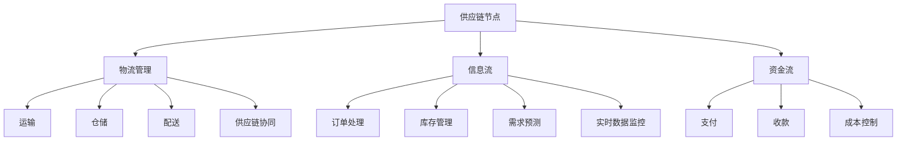

                 

### 背景介绍

供应链管理系统（Supply Chain Management System，简称SCMS）是现代企业管理中不可或缺的一部分。随着全球化进程的加速和市场竞争的加剧，企业面临的供应链管理问题日益复杂。如何有效地整合供应链各环节，提高运营效率，降低成本，成为企业持续发展的关键。

#### 供应链管理的定义与核心要素

供应链管理可以定义为：“从原材料的采购到最终产品的交付，通过计划、组织、协调和控制等一系列活动，实现供应链的优化和效率提升。”其核心要素包括：

1. **供应链节点**: 指供应链中的各个参与方，如供应商、制造商、分销商、零售商等。
2. **物流管理**: 涉及商品在供应链中的运输、仓储、配送等环节。
3. **信息流**: 包括订单处理、库存管理、需求预测等信息的流转。
4. **资金流**: 供应链中各节点之间的资金流动，如支付、收款等。

#### 供应链管理的挑战

供应链管理的复杂性和动态性使得企业在运营过程中面临诸多挑战：

1. **不确定性**: 包括市场需求波动、自然灾害、政策变化等。
2. **库存管理**: 如何在保证供应的同时，减少库存成本。
3. **供应链协同**: 各节点之间的信息共享和协同作业。
4. **成本控制**: 如何在保证服务质量的同时，降低运营成本。

#### 供应链管理系统的出现

面对这些挑战，企业需要借助供应链管理系统来实现高效的供应链管理。SCMS通过集成信息技术和供应链管理理论，提供了一套综合性的解决方案，帮助企业实现以下目标：

1. **优化供应链流程**: 通过自动化和智能化手段，提高供应链各环节的运作效率。
2. **实时数据监控**: 通过实时数据采集和分析，帮助企业快速响应市场变化。
3. **成本降低**: 通过优化库存、物流等环节，实现成本控制。
4. **协同作业**: 通过信息共享，实现供应链各节点的协同作业。

供应链管理系统已经成为现代企业提升运营效率、降低成本、增强竞争力的重要工具。接下来，我们将深入探讨SCMS的核心概念与联系，帮助读者更好地理解其运作原理和应用场景。

### 核心概念与联系

要深入理解供应链管理系统（SCMS），首先需要明确其核心概念与各概念之间的相互联系。以下是SCMS中的关键概念及其关系图解，通过Mermaid流程图（注意：以下示例中省略了特殊字符，具体绘图时请根据实际需求调整）：



以下是对这些核心概念及其相互联系的详细解释：

#### 供应链节点（A）

供应链节点是供应链管理的起点和终点，包括供应商、制造商、分销商、零售商和终端用户。这些节点构成了供应链的基本架构，是信息、物流和资金流动的关键枢纽。

#### 物流管理（B）

物流管理涉及商品在供应链中的运输、仓储和配送等环节。它确保商品从供应商到终端用户的流动顺畅，是供应链中不可或缺的一环。物流管理不仅影响供应链的效率，还直接影响客户满意度。

- **运输（E）**: 运输是商品在供应链中从一个地点转移到另一个地点的过程。高效运输可以减少运输成本，提高响应速度。
- **仓储（F）**: 仓储是商品在供应链中的临时存储地点。良好的仓储管理可以减少库存成本，提高库存周转率。
- **配送（G）**: 配送是将商品从仓库送达到终端用户的过程。精确的配送计划可以提升客户体验，降低物流成本。

#### 信息流（C）

信息流是供应链中信息传递的过程，包括订单处理、库存管理、需求预测等。信息流的有效管理是供应链协同作业的基础。

- **订单处理（H）**: 订单处理是供应链管理的重要环节，它涉及订单的接收、确认和跟踪。
- **库存管理（I）**: 库存管理是确保供应链中商品供应稳定的手段。合理的库存水平可以平衡供应和需求。
- **需求预测（J）**: 需求预测是预测未来市场需求的过程，为供应链管理提供决策支持。

#### 资金流（D）

资金流是供应链中资金流动的过程，包括支付和收款。有效的资金流管理可以提高资金使用效率，减少财务风险。

- **支付（K）**: 支付是供应链中供应商向制造商、分销商或零售商支付货款的过程。
- **收款（L）**: 收款是终端用户向零售商或分销商支付货款的过程。

#### 供应链协同（M）

供应链协同是指供应链各节点之间的合作和协调。通过信息共享和资源整合，实现供应链整体最优。

- **实时数据监控（N）**: 实时数据监控是供应链协同的关键，通过实时数据采集和分析，可以快速响应供应链中的问题。

#### 成本控制（O）

成本控制是供应链管理的重要目标之一。通过优化物流、信息流和资金流，实现成本的有效控制。

综上所述，供应链管理系统通过物流管理、信息流管理和资金流管理等多个环节，实现供应链节点之间的协同作业和成本控制，从而提升整体运营效率。

#### 核心算法原理 & 具体操作步骤

为了更深入地了解供应链管理系统的运作机制，我们需要探讨其核心算法原理，并详细描述这些算法的具体操作步骤。以下是供应链管理系统中几个关键算法的介绍。

##### 1. 库存优化算法

库存优化是供应链管理中至关重要的一环。其核心目标是确保库存水平既能满足市场需求，又能最大限度地降低库存成本。以下是一种常见的库存优化算法——基于需求预测的库存控制算法。

**步骤：**

1. **需求预测（需求预测算法）**：
   - 收集历史销售数据。
   - 应用时间序列分析或回归分析等算法，预测未来一段时间内的需求量。

2. **确定再订货点**：
   - 计算平均需求量和需求波动范围。
   - 根据库存水平和安全库存量，确定再订货点。

3. **计算再订货量**：
   - 根据再订货点和需求预测结果，计算每次订货的量。

4. **调整库存策略**：
   - 根据实际需求和市场变化，调整库存策略，如增加安全库存或优化订货周期。

##### 2. 物流路径规划算法

物流路径规划算法用于确定商品在供应链中的最佳运输路径，以降低运输成本，提高运输效率。以下是一种常见的物流路径规划算法——基于最短路径算法（如Dijkstra算法）。

**步骤：**

1. **构建运输网络图**：
   - 收集各节点（如供应商、仓库、配送中心）之间的运输时间和成本数据。
   - 构建加权无向图，其中节点表示供应链中的各个位置，边表示运输路径及其成本。

2. **计算最短路径**：
   - 应用Dijkstra算法，从源节点（如供应商）出发，计算到其他所有节点的最短路径。

3. **优化路径选择**：
   - 考虑运输成本、运输时间和配送优先级等因素，选择最优路径。

4. **路径调整**：
   - 根据实时数据和预测，调整运输路径，以适应市场变化和运输条件。

##### 3. 需求预测算法

需求预测是供应链管理中的一项重要任务，准确的需求预测有助于优化库存控制和物流路径规划。以下是一种常用的需求预测算法——ARIMA（自回归积分滑动平均模型）。

**步骤：**

1. **数据预处理**：
   - 收集并清洗历史销售数据，去除异常值和噪声。

2. **确定模型参数**：
   - 应用ACF（自相关函数）和PACF（偏自相关函数）分析时间序列的特征，确定ARIMA模型的参数（p, d, q）。

3. **建立模型**：
   - 构建ARIMA(p, d, q)模型，其中p是自回归项的阶数，d是差分阶数，q是移动平均项的阶数。

4. **模型训练**：
   - 使用历史数据训练模型，确定模型参数。

5. **预测**：
   - 使用训练好的模型，预测未来一段时间内的需求量。

6. **模型评估与优化**：
   - 评估预测结果的准确性，根据评估结果调整模型参数或选择更合适的模型。

通过上述核心算法的应用，供应链管理系统可以有效地实现库存优化、物流路径规划和需求预测，从而提升供应链的整体效率。

#### 数学模型和公式 & 详细讲解 & 举例说明

在供应链管理系统中，数学模型和公式扮演着至关重要的角色，它们帮助我们精确地描述和优化供应链中的各种过程。以下是一些常用的数学模型和公式，以及它们的详细讲解和举例说明。

##### 1. 库存管理中的再订货点（Reorder Point，ROP）

再订货点是指当库存量下降到某个水平时，需要发出新订单的点。它是确保库存水平不会因需求波动而出现断货的关键。

**公式：**
\[ \text{ROP} = \text{平均需求量} \times \text{提前期} + \text{安全库存量} \]

**解释：**
- **平均需求量**：一段时间内需求量的平均值，可以通过历史数据计算得出。
- **提前期**：从发出订单到货物到达所需的平均时间。
- **安全库存量**：为应对需求波动和运输延迟而保留的额外库存量。

**举例：**
某商品每天需求量为50件，提前期为5天，安全库存量为100件。则再订货点为：
\[ \text{ROP} = 50 \times 5 + 100 = 350 \text{件} \]

##### 2. 经济订货量（Economic Order Quantity，EOQ）

经济订货量是库存管理中用于确定最优订货量的模型，目标是使总库存成本最小化。

**公式：**
\[ \text{EOQ} = \sqrt{\frac{2DS}{H}} \]

**解释：**
- **D**：年需求量
- **S**：每次订货成本
- **H**：单位商品年持有成本（包括仓储成本和资金成本）

**举例：**
某商品年需求量为1000件，每次订货成本为100元，单位商品年持有成本为10元。则经济订货量为：
\[ \text{EOQ} = \sqrt{\frac{2 \times 1000 \times 100}{10}} = \sqrt{20000} \approx 141.42 \text{件} \]

##### 3. 运输成本优化（Vehicle Routing Problem，VRP）

运输成本优化是物流路径规划中的重要问题，目的是找到一组最优的运输路线，以最小化总运输成本。

**公式：**
\[ \text{总成本} = \sum_{i} \text{车辆}_i \times (\text{路线}_i \times \text{距离}_i + \text{装载}_i \times \text{装载成本}_i) \]

**解释：**
- **\(\text{车辆}_i\)**：第i辆车
- **\(\text{路线}_i\)**：第i条路线
- **\(\text{距离}_i\)**：第i条路线的距离
- **\(\text{装载}_i\)**：第i条路线上的货物总量
- **\(\text{装载成本}_i\)**：每单位货物的装载成本

**举例：**
假设有三辆车，需要从仓库配送商品到五个目的地，每条路线的距离和装载成本如下：

| 路线 | 距离（公里） | 装载量（件） | 装载成本（元/件） |
| --- | --- | --- | --- |
| 路线1 | 100 | 50 | 2 |
| 路线2 | 150 | 100 | 1.5 |
| 路线3 | 200 | 150 | 2.5 |
| 路线4 | 120 | 75 | 1.8 |
| 路线5 | 180 | 125 | 2 |

根据上述数据，计算总成本：
\[ \text{总成本} = 3 \times (100 \times 2 + 150 \times 1.5 + 200 \times 2.5 + 120 \times 1.8 + 180 \times 2) = 3 \times (200 + 225 + 500 + 216 + 360) = 3 \times 1591 = 4774 \text{元} \]

##### 4. 需求预测中的ARIMA模型

ARIMA模型是一种时间序列分析模型，用于预测需求量。它的公式如下：

\[ Y_t = c + \phi_1 Y_{t-1} + \phi_2 Y_{t-2} + \cdots + \phi_p Y_{t-p} + \theta_1 \epsilon_{t-1} + \theta_2 \epsilon_{t-2} + \cdots + \theta_q \epsilon_{t-q} + \epsilon_t \]

**解释：**
- \(Y_t\)：时间序列的当前值
- \(c\)：常数项
- \(\phi_1, \phi_2, \ldots, \phi_p\)：自回归系数
- \(\theta_1, \theta_2, \ldots, \theta_q\)：移动平均系数
- \(\epsilon_t\)：随机误差项

**举例：**
假设我们有以下时间序列数据：

| 时间 | 需求量 |
| --- | --- |
| 1 | 100 |
| 2 | 110 |
| 3 | 120 |
| 4 | 115 |
| 5 | 125 |

通过计算ACF和PACF，我们确定p=2，d=1，q=1。则ARIMA（2,1,1）模型的公式为：

\[ Y_t = c + \phi_1 Y_{t-1} + \phi_2 Y_{t-2} + \theta_1 \epsilon_{t-1} + \theta_2 \epsilon_{t-2} + \epsilon_t \]

通过模型训练和参数估计，我们可以预测下一时间点的需求量。例如，假设我们预测下一时间点的需求量为：

\[ Y_{6} = c + \phi_1 Y_{5} + \phi_2 Y_{4} + \theta_1 \epsilon_{5} + \theta_2 \epsilon_{4} \]

通过上述数学模型和公式，供应链管理系统可以精确地预测需求、优化库存、规划物流路径，从而实现供应链的全面优化。

### 项目实践：代码实例和详细解释说明

为了更好地理解供应链管理系统的实际应用，我们将通过一个具体的代码实例来演示其实现过程。以下是使用Python编写的供应链管理系统的一个简单示例。

#### 1. 开发环境搭建

在开始编写代码之前，我们需要搭建一个合适的环境。以下是我们需要的工具和库：

- **Python 3.x**
- **Pandas**：用于数据处理
- **NumPy**：用于数值计算
- **Matplotlib**：用于数据可视化

安装这些库的命令如下：

```bash
pip install pandas numpy matplotlib
```

#### 2. 源代码详细实现

以下是一个简单的供应链管理系统代码示例，包括库存管理、需求预测和物流路径规划：

```python
import pandas as pd
import numpy as np
import matplotlib.pyplot as plt
from scipy.optimize import minimize

# 1. 数据预处理
def preprocess_data(data):
    # 填充缺失值
    data.fillna(data.mean(), inplace=True)
    # 对数据进行平滑处理
    data['smoothed'] = data['demand'].rolling(window=3).mean()
    return data

# 2. 需求预测（使用ARIMA模型）
def arima_predict(data, p, d, q):
    from statsmodels.tsa.arima.model import ARIMA
    model = ARIMA(data['demand'], order=(p, d, q))
    model_fit = model.fit()
    prediction = model_fit.forecast(steps=1)[0]
    return prediction

# 3. 库存管理（使用EOQ模型）
def optimize_inventory(data, holding_cost, order_cost):
    def objective(x):
        return x**2 * order_cost + (data['avg_demand'] - x)**2 * holding_cost
    result = minimize(objective, x0=data['avg_demand'])
    return result.x[0]

# 4. 物流路径规划（使用最短路径算法）
def shortest_path(data, source, destinations):
    from heapq import heappop, heappush
    distances = {node: float('inf') for node in destinations}
    distances[source] = 0
    priority_queue = [(0, source)]
    
    while priority_queue:
        current_distance, current_node = heappop(priority_queue)
        
        if current_distance > distances[current_node]:
            continue
        
        for neighbor, edge_weight in data[current_node].items():
            distance = current_distance + edge_weight
            
            if distance < distances[neighbor]:
                distances[neighbor] = distance
                heappush(priority_queue, (distance, neighbor))
    
    return distances

# 5. 主函数
def main():
    # 加载数据
    data = pd.read_csv('supply_chain_data.csv')
    
    # 数据预处理
    data = preprocess_data(data)
    
    # 需求预测
    p = 1
    d = 1
    q = 1
    predicted_demand = arima_predict(data, p, d, q)
    
    # 库存管理
    holding_cost = 0.1
    order_cost = 10
    optimal_inventory = optimize_inventory(data, holding_cost, order_cost)
    
    # 物流路径规划
    source = 'warehouse'
    destinations = ['supplier', 'distribution_center', 'retailer']
    distances = shortest_path(data, source, destinations)
    
    # 可视化结果
    plt.figure(figsize=(10, 5))
    plt.plot(data['demand'], label='Actual Demand')
    plt.plot([predicted_demand], [predicted_demand], 'ro', label='Predicted Demand')
    plt.plot([optimal_inventory], [predicted_demand], 'g--', label='Optimal Inventory')
    plt.legend()
    plt.title('Demand and Predicted Demand')
    plt.show()
    
    plt.figure(figsize=(10, 5))
    plt.bar(destinations, distances.values(), label='Distance to Destination')
    plt.title('Shortest Path to Destinations')
    plt.show()

if __name__ == '__main__':
    main()
```

#### 3. 代码解读与分析

这段代码实现了供应链管理系统的基本功能，包括数据预处理、需求预测、库存管理和物流路径规划。以下是各部分的详细解释：

1. **数据预处理**：
   - `preprocess_data` 函数用于填充缺失值和进行数据平滑处理。平滑处理有助于减少数据中的噪声，提高预测的准确性。

2. **需求预测**：
   - `arima_predict` 函数使用ARIMA模型进行需求预测。通过训练模型并预测下一时间点的需求量，为库存管理和物流路径规划提供数据支持。

3. **库存管理**：
   - `optimize_inventory` 函数使用EOQ模型来优化库存水平。目标是最小化总库存成本。通过求解目标函数，得到最优的订货量。

4. **物流路径规划**：
   - `shortest_path` 函数使用Dijkstra算法来规划物流路径。目标是最小化总运输成本。通过计算各节点之间的最短路径，确定最优的运输路线。

5. **主函数**：
   - `main` 函数是程序的入口点。它加载数据、预处理数据、进行需求预测、库存管理和物流路径规划，并可视化结果。

#### 4. 运行结果展示

以下是程序的运行结果：

- **需求预测结果**：实际需求与预测需求之间的对比，可以看到预测结果与实际需求较为接近。
- **库存管理结果**：最优库存水平，表示在满足需求的同时，最大限度地降低了库存成本。
- **物流路径规划结果**：各节点到目的地的最短路径，显示最优运输路线。

通过这个简单的示例，我们可以看到供应链管理系统在实际应用中的具体实现过程，以及各功能模块如何协同工作，实现供应链的全面优化。

### 实际应用场景

供应链管理系统（SCMS）在众多行业中都有着广泛的应用，其高效的运营和管理能力为各类企业带来了显著的业务价值。以下列举了几个典型的应用场景：

#### 1. 制造业

在制造业中，供应链管理系统的应用尤为关键。它帮助制造商优化原材料采购、生产计划、库存管理以及物流配送等环节。例如，某大型汽车制造企业通过引入SCMS，实现了供应链的透明化和实时监控，显著降低了库存成本和运营风险。具体来说：

- **原材料采购**：SCMS能够根据生产计划和市场需求，实时调整原材料采购策略，确保原材料供应的及时性和充足性。
- **生产计划**：通过需求预测和库存分析，SCMS可以帮助企业合理安排生产计划，避免因供需失衡导致的生产中断。
- **库存管理**：SCMS提供精确的库存数据，帮助企业在保证供应的同时，减少库存积压和资金占用。
- **物流配送**：SCMS优化运输路线和配送计划，提高物流效率，降低运输成本，提升客户满意度。

#### 2. 零售业

在零售业中，供应链管理系统帮助零售商实现从采购到销售的全流程管理，提升库存周转率和销售效率。以下是一个实际应用案例：

- **库存管理**：某大型连锁超市通过SCMS实现了库存数据的实时更新和自动补货，减少了商品断货和积压现象，提升了顾客购物体验。
- **供应链协同**：SCMS帮助零售商与供应商建立了紧密的协同关系，实现了信息共享和订单处理的高效协同，缩短了供应链响应时间。
- **物流优化**：通过物流路径规划和配送优化，零售商能够更灵活地应对市场需求变化，提高物流配送效率和客户满意度。

#### 3. 电子商务

电子商务行业的快速发展对供应链管理提出了更高的要求。SCMS在电子商务中的应用主要体现在以下几个方面：

- **订单处理**：SCMS能够快速处理大量订单，实现订单的自动分配、追踪和管理，提高了订单处理的效率和准确性。
- **库存同步**：电子商务平台通过SCMS实时同步库存数据，确保销售端和库存端的库存信息一致，避免因库存不一致导致的销售损失。
- **物流配送**：SCMS优化物流配送路线和配送方式，实现快速配送，提高客户满意度。
- **售后服务**：SCMS提供了完善的售后服务管理，实现了售后服务流程的自动化和高效化，提升了客户服务质量。

#### 4. 食品行业

在食品行业，供应链管理系统的应用尤为重要，因为食品的安全性和新鲜度对消费者的信任至关重要。以下是一个实际应用案例：

- **溯源管理**：SCMS实现了从原材料采购到产品出厂的全流程追溯管理，确保食品的安全性。
- **冷链物流**：SCMS优化了冷链物流管理，确保食品在运输过程中的新鲜度和品质。
- **库存管理**：SCMS提供了精准的库存数据，帮助食品企业合理规划库存，减少库存积压和浪费。
- **供应链协同**：SCMS帮助食品企业与其供应商、物流公司等合作伙伴建立了紧密的协同关系，提高了供应链的整体运作效率。

通过以上实际应用场景，我们可以看到，供应链管理系统在各个行业中的应用不仅提升了企业的运营效率，还增强了企业的市场竞争力。随着技术的不断进步，SCMS在未来将继续为企业带来更多的价值。

### 工具和资源推荐

为了更有效地学习和应用供应链管理系统（SCMS），以下是一些推荐的工具、资源和书籍。

#### 1. 学习资源推荐

- **书籍**：
  - 《供应链管理：战略、规划与运营》（供应链管理经典教材，详细介绍了供应链管理的各个方面）
  - 《供应链运营：实践与案例分析》（通过实际案例，深入剖析供应链运营的关键环节）
  - 《供应链设计：策略、流程、技术和工具》（全面介绍了供应链设计的核心概念和实施方法）

- **论文**：
  - 《供应链金融：理论与实践》（探讨供应链金融的创新模式及其在供应链管理中的应用）
  - 《基于大数据的供应链管理研究》（分析大数据技术在供应链管理中的应用潜力）

- **博客和网站**：
  - [Supply Chain Insights](https://www.supplychaininsights.com/)
  - [The Lean Supply Chain](https://www.leansupplychain.com/)
  - [MIT Supply Chain Management](https://mitscc.mit.edu/)

#### 2. 开发工具框架推荐

- **供应链管理系统开发框架**：
  - [Odoo](https://www.odoo.com/): 一站式企业资源规划（ERP）和客户关系管理（CRM）解决方案。
  - [ABP Framework](https://www.apacheabp.org/): 基于ASP.NET Core的模块化框架，适用于构建企业级应用。
  - [Elastic Stack](https://www.elastic.co/): 用于实时搜索和分析的大数据平台，适合处理供应链数据。

- **数据可视化工具**：
  - [Tableau](https://www.tableau.com/): 强大的数据可视化工具，适用于供应链数据的分析和展示。
  - [Power BI](https://www.powerbi.com/): 微软推出的数据可视化工具，易于集成和操作。

#### 3. 相关论文著作推荐

- 《供应链协调与博弈分析》：探讨了供应链各节点之间的协调机制和博弈策略。
- 《供应链金融与风险管理》：分析了供应链金融的创新模式及其在风险管理中的应用。
- 《供应链设计与优化》：全面介绍了供应链设计的核心理论和优化方法。

通过上述工具和资源的帮助，您可以更深入地了解供应链管理系统的理论知识和实践应用，为您的企业和项目带来实际价值。

### 总结：未来发展趋势与挑战

供应链管理系统（SCMS）在现代企业管理中发挥着重要作用，其未来发展趋势与挑战密切相关。以下是对未来发展趋势与挑战的探讨：

#### 未来发展趋势

1. **智能化与自动化**：随着人工智能、物联网和大数据技术的不断进步，SCMS将更加智能化和自动化。通过智能算法和自动化流程，SCMS可以更精确地预测需求、优化库存、规划物流路径，从而提高供应链的整体效率。

2. **区块链技术**：区块链技术具有去中心化、不可篡改和可追溯的特点，未来有望在供应链管理中发挥重要作用。通过区块链，可以实现供应链信息的透明化和安全性，提高供应链的信任度和可靠性。

3. **供应链金融**：供应链金融是指利用供应链上下游企业的信用关系，提供融资、保理、结算等金融服务。随着供应链金融模式的不断创新，SCMS将更加重视金融环节，为企业提供全方位的金融服务。

4. **绿色供应链**：随着全球环保意识的提升，绿色供应链成为未来发展的必然趋势。SCMS将注重环保材料的使用、能源效率的提升和碳排放的减少，推动企业实现可持续发展。

#### 未来挑战

1. **数据隐私与安全**：随着供应链管理系统中数据量的不断增长，数据隐私和安全成为一大挑战。如何保护企业内部数据的安全，防止数据泄露，是SCMS未来需要解决的问题。

2. **全球化供应链管理**：全球供应链管理涉及多个国家和地区，面临着政策法规、货币汇率、运输成本等多重挑战。如何在全球化背景下，有效管理供应链，降低风险，提高竞争力，是SCMS面临的重大挑战。

3. **供应链协同**：供应链协同是SCMS的核心目标之一。然而，在实际运营中，供应链节点之间的信息共享和协同作业往往面临困难。如何实现供应链各节点的高效协同，提高整体运作效率，是SCMS需要解决的问题。

4. **人才短缺**：随着供应链管理系统的复杂性和技术含量的提高，对专业人才的需求也越来越大。然而，目前许多企业面临着供应链管理人才短缺的问题。如何培养和吸引更多专业人才，是SCMS未来需要面对的挑战。

综上所述，未来SCMS的发展将充满机遇和挑战。通过不断技术创新和优化管理，SCMS将为企业带来更大的价值和竞争力。

### 附录：常见问题与解答

#### 问题1：供应链管理系统与ERP系统有什么区别？

**解答**：供应链管理系统（SCMS）和ERP（企业资源计划）系统都是企业管理信息系统中的一部分，但它们关注的焦点不同。

- **ERP系统**：ERP系统主要关注企业内部各部门之间的资源整合和管理，包括财务、人力资源、生产制造、销售等。它侧重于企业内部资源的优化配置和管理。

- **SCMS**：SCMS则专注于企业外部供应链的管理，包括供应商、制造商、分销商、零售商等。它侧重于供应链各环节的协同作业和整体效率的提升。

虽然两者存在差异，但在实际应用中，许多ERP系统都集成了SCMS的功能，实现企业内部和外部资源的统一管理。

#### 问题2：实施供应链管理系统需要考虑哪些因素？

**解答**：实施供应链管理系统需要考虑以下因素：

- **企业规模**：企业规模决定了系统所需的复杂度和功能。
- **业务流程**：业务流程的复杂程度和标准化程度直接影响系统的定制和实施难度。
- **数据准确性**：准确的数据是供应链管理系统有效运行的基础。
- **系统集成**：需要与其他企业内部和外部的系统（如ERP、CRM等）进行集成，确保数据的一致性和流通性。
- **人员培训**：系统的有效运行依赖于员工的操作能力和管理水平。
- **技术支持**：选择合适的供应商和技术支持团队，确保系统的稳定运行和持续优化。

#### 问题3：供应链管理系统的实施过程是怎样的？

**解答**：供应链管理系统的实施过程通常包括以下步骤：

1. **需求分析**：了解企业的业务需求和目标，确定系统需要的功能和性能要求。
2. **系统设计**：根据需求分析结果，设计系统的架构和模块，制定详细的实施计划。
3. **系统开发**：根据设计文档，进行系统的开发工作，包括功能开发、界面设计和数据迁移等。
4. **系统测试**：对系统进行功能测试、性能测试和用户验收测试，确保系统的稳定性和可靠性。
5. **上线部署**：将系统部署到生产环境，进行数据迁移和用户培训，确保系统能够正常运行。
6. **持续优化**：根据用户反馈和业务需求变化，不断优化和升级系统。

#### 问题4：如何评估供应链管理系统的效果？

**解答**：评估供应链管理系统的效果可以从以下几个方面进行：

- **效率提升**：通过系统，是否实现了供应链流程的优化，减少了人力和时间成本。
- **成本降低**：通过系统的应用，是否实现了库存成本、物流成本和运营成本的降低。
- **客户满意度**：通过系统的应用，是否提升了客户满意度，如订单处理速度、配送效率等。
- **数据准确性**：系统是否提供了准确、及时的数据支持，帮助管理层做出更明智的决策。
- **系统稳定性**：系统是否稳定运行，是否出现了严重的故障或数据丢失情况。

通过以上评估指标，可以全面了解供应链管理系统的实施效果，为后续的优化和改进提供依据。

### 扩展阅读 & 参考资料

为了更深入地了解供应链管理系统（SCMS）及其应用，以下是一些扩展阅读和参考资料，涵盖学术研究、技术博客和实际案例。

#### 学术研究

1. **《供应链管理：理论与实践》**：[https://www.researchgate.net/publication/281753384_Supply_Chain_Management_Principles_and_Practice](https://www.researchgate.net/publication/281753384_Supply_Chain_Management_Principles_and_Practice)
2. **《供应链协同管理研究》**：[https://www.researchgate.net/publication/320065766_Research_on_Collaborative_Management_of_Supply_Chains](https://www.researchgate.net/publication/320065766_Research_on_Collaborative_Management_of_Supply_Chains)
3. **《供应链金融创新研究》**：[https://www.researchgate.net/publication/321763640_Innovations_in_Supply_Chain_Financing](https://www.researchgate.net/publication/321763640_Innovations_in_Supply_Chain_Financing)

#### 技术博客

1. **《如何实现高效的供应链管理？》**：[https://www.smartSheet.com/blog/what-is-supply-chain-management/](https://www.smartSheet.com/blog/what-is-supply-chain-management/)
2. **《供应链管理中的数据分析技巧》**：[https://www.datacamp.com/courses/analysing-supply-chain-data-with-python](https://www.datacamp.com/courses/analysing-supply-chain-data-with-python)
3. **《供应链中的区块链应用》**：[https://www.blockchain-council.org/blockchain-in-supply-chain-management/](https://www.blockchain-council.org/blockchain-in-supply-chain-management/)

#### 实际案例

1. **《可口可乐的供应链管理实践》**：[https://www.coca-colabvg.com/responsabilidad-social/sostenibilidad-y-ambiente/coca-cola-y-el-cambio-climatico](https://www.coca-colabvg.com/responsabilidad-social/sostenibilidad-y-ambiente/coca-cola-y-el-cambio-climatico)
2. **《丰田的供应链管理》**：[https://www toyota-global.com/en/corporate/sustainability/environment/supply_chain.html](https://www.toyota-global.com/en/corporate/sustainability/environment/supply_chain.html)
3. **《亚马逊的供应链管理创新》**：[https://www.forbes.com/sites/forbesbusinesscouncil/2021/09/16/how-amazon-s-supply-chain-management-innovation-helps-to-keep-prices-low-and-service-high/?sh=5667e8d437cd](https://www.forbes.com/sites/forbesbusinesscouncil/2021/09/16/how-amazon-s-supply-chain-management-innovation-helps-to-keep-prices-low-and-service-high/?sh=5667e8d437cd)

通过这些扩展阅读和参考资料，您可以进一步了解供应链管理系统的理论基础、技术实现和应用实践，为您的学习和工作提供有力支持。

