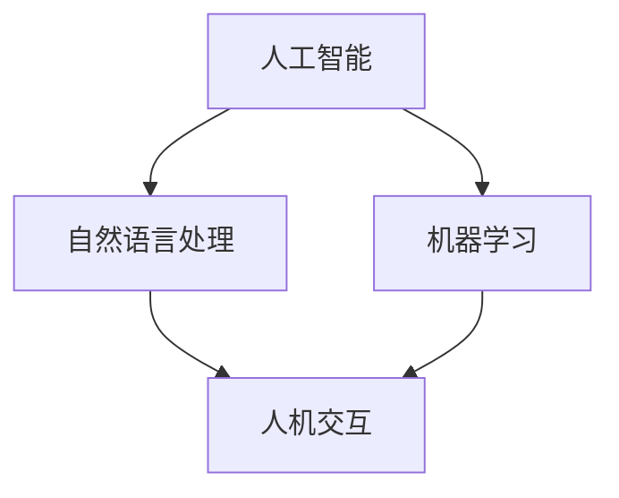

                 

### 保护工人权益：人类计算中的监管挑战

> **关键词**：工人权益，监管，人类计算，人工智能，伦理，技术治理
> 
> **摘要**：本文深入探讨了在人类计算时代，保护工人权益所面临的监管挑战。通过对当前技术发展趋势的分析，探讨了如何利用人工智能等先进技术来保障工人权益，同时提出了应对这些挑战的策略和未来发展方向。

### 1. 背景介绍

#### 1.1 人类计算的概念

人类计算（Human-in-the-Loop Computing）是指将人类操作员或专家的知识和技能与计算能力相结合，共同完成任务的一种计算模式。在这种模式下，人类操作员不仅可以提供对机器的监督和修正，还可以在复杂任务中发挥关键作用。随着人工智能技术的发展，人类计算在各个领域中的应用越来越广泛，从自动化系统、智能制造到自然语言处理、智能医疗等。

#### 1.2 工人权益的重要性

工人权益是指劳动者在工作过程中享有的合法权益，包括工资报酬、工作时间、劳动条件、职业安全健康等。保护工人权益是实现社会公平、促进社会和谐的重要手段。在人类计算领域，工人权益的保护尤为重要，因为随着自动化和智能化程度的提高，人类操作员的工作环境、工作内容和权益保障都面临着新的挑战。

#### 1.3 监管挑战

在人类计算中，监管挑战主要体现在以下几个方面：

1. **伦理监管**：随着人工智能技术的快速发展，如何确保人工智能系统的伦理合规性成为一个重要议题。特别是在涉及人类操作员权益的场景中，如何保证人工智能系统不会对人类造成伤害或歧视？

2. **安全监管**：人类计算系统在运行过程中，需要确保操作员的人身安全和设备安全。特别是在涉及高风险场景时，如航空航天、医疗等，监管措施的制定和执行至关重要。

3. **隐私监管**：在人类计算中，大量涉及个人隐私的数据被收集和处理。如何保护这些数据的安全和隐私，防止数据泄露和滥用，是监管面临的一个重大挑战。

4. **职业转型监管**：随着人工智能技术的普及，一些传统工作岗位可能会被自动化取代。如何保障这些工人的权益，帮助他们实现职业转型，是社会面临的一个严峻挑战。

### 2. 核心概念与联系

#### 2.1 人类计算中的关键概念

为了更好地理解人类计算中的监管挑战，我们需要先了解以下几个关键概念：

1. **人工智能**：一种模拟人类智能的技术，能够感知环境、学习知识、执行任务等。

2. **自然语言处理**：一种人工智能技术，能够理解和生成自然语言。

3. **机器学习**：一种人工智能技术，通过从数据中学习规律，进行决策和预测。

4. **人机交互**：研究人类与计算机之间的交互方式，以提高计算机的使用效率和用户体验。

#### 2.2 核心概念的联系

人类计算中的核心概念之间存在着紧密的联系，如图所示：



#### 2.3 人类计算与工人权益保护

人类计算与工人权益保护之间的关系可以概括为以下几点：

1. **提高工作效率**：通过人工智能技术，可以自动化一些重复性和繁琐的任务，从而减轻操作员的负担，提高工作效率。

2. **保障工作安全**：人工智能系统可以在高风险场景中代替人类操作员，降低事故发生的风险。

3. **保护隐私**：人工智能技术可以帮助企业更好地保护员工的隐私，防止数据泄露和滥用。

4. **促进职业转型**：通过人工智能技术，可以为工人提供更多的职业培训机会，帮助他们实现职业转型。

### 3. 核心算法原理 & 具体操作步骤

#### 3.1 核心算法原理

在人类计算中，核心算法主要包括以下几个方面：

1. **决策树**：一种常用的机器学习算法，用于分类和回归任务。它通过将数据集分割成多个子集，找到最优的分割方式，从而实现对数据的分类或预测。

2. **支持向量机**：一种经典的机器学习算法，用于分类和回归任务。它通过找到一个最佳的超平面，将不同类别的数据分隔开。

3. **神经网络**：一种模拟人脑神经网络结构的机器学习算法，用于分类、回归和图像识别等任务。

4. **自然语言处理模型**：如词向量模型、序列模型等，用于处理自然语言文本。

#### 3.2 具体操作步骤

为了保护工人权益，我们可以采取以下具体操作步骤：

1. **数据分析**：收集与工人权益相关的数据，如工资、工作时间、劳动条件等，进行数据分析，找出存在的问题。

2. **构建模型**：基于数据分析结果，构建相应的机器学习模型，如决策树、支持向量机等，用于分类和预测。

3. **模型训练**：使用历史数据对模型进行训练，调整模型参数，提高模型的准确性和可靠性。

4. **模型应用**：将训练好的模型应用于实际场景，如评估工人的工作条件、预测工资水平等。

5. **监控与反馈**：对模型的应用效果进行监控，收集反馈信息，不断优化模型和策略。

### 4. 数学模型和公式 & 详细讲解 & 举例说明

#### 4.1 数学模型和公式

在人类计算中，常用的数学模型和公式包括：

1. **决策树公式**：

   $$ 
   h(x) = g(\theta_0 + \theta_1x_1 + \theta_2x_2 + \ldots + \theta_nx_n) 
   $$

   其中，$g$ 是激活函数，$\theta_i$ 是模型参数，$x_i$ 是输入特征。

2. **支持向量机公式**：

   $$ 
   w \cdot x + b = 0 
   $$

   其中，$w$ 是超平面参数，$x$ 是输入特征，$b$ 是偏置。

3. **神经网络公式**：

   $$ 
   z = \sigma(W \cdot x + b) 
   $$

   其中，$z$ 是输出，$\sigma$ 是激活函数，$W$ 是权重矩阵，$x$ 是输入特征。

#### 4.2 详细讲解

1. **决策树**：

   决策树是一种树形结构，用于分类和回归任务。它通过一系列决策规则将数据集分割成多个子集，从而找到最优的分割方式。

   决策树的构建过程可以分为以下几个步骤：

   - **数据预处理**：对数据进行预处理，包括数据清洗、归一化等。
   - **特征选择**：选择对分类或回归任务影响最大的特征。
   - **节点划分**：使用特征选择算法（如信息增益、基尼指数等），找到最佳的划分节点。
   - **重复划分**：对每个划分后的子集，重复上述过程，直到满足停止条件（如最大深度、最小叶子节点数等）。

2. **支持向量机**：

   支持向量机是一种分类算法，通过找到一个最佳的超平面，将不同类别的数据分隔开。它可以通过求解最优化问题来实现。

   支持向量机的求解过程可以分为以下几个步骤：

   - **初始化**：初始化模型参数 $w$ 和 $b$。
   - **迭代优化**：通过迭代优化算法（如梯度下降、随机梯度下降等），不断更新模型参数，直到满足停止条件（如损失函数收敛、迭代次数等）。
   - **分类决策**：使用训练好的模型对新的数据进行分类预测。

3. **神经网络**：

   神经网络是一种模拟人脑神经网络结构的机器学习算法。它通过层层传递信息，实现对输入数据的处理和预测。

   神经网络的构建过程可以分为以下几个步骤：

   - **数据预处理**：对数据进行预处理，包括数据清洗、归一化等。
   - **模型初始化**：初始化网络结构、权重和偏置。
   - **前向传播**：将输入数据通过网络逐层传递，计算输出结果。
   - **反向传播**：计算输出误差，并通过反向传播算法更新权重和偏置。
   - **迭代训练**：重复执行前向传播和反向传播过程，直到满足停止条件（如损失函数收敛、迭代次数等）。

#### 4.3 举例说明

假设我们有一个简单的决策树模型，用于预测工人的薪资水平。数据集包含以下几个特征：工作经验、学历、行业等。

1. **数据预处理**：

   - 清洗数据，去除缺失值和异常值。
   - 归一化数据，使其在相同的尺度上。

2. **特征选择**：

   - 使用信息增益或基尼指数等算法，选择对薪资影响最大的特征。

3. **节点划分**：

   - 选择最佳划分节点，使得子集的薪资方差最小。

4. **重复划分**：

   - 对每个划分后的子集，重复上述过程，直到满足停止条件。

   最终，我们得到一个决策树模型，如图所示：

   ```mermaid
   graph TB
   A[工作经验<5年] --> B[学历本科及以上]
   B --> C[薪资>5000元]
   A --> D[学历大专及以上]
   D --> C
   D --> E[薪资>4000元]
   ```

### 5. 项目实践：代码实例和详细解释说明

#### 5.1 开发环境搭建

1. **安装 Python**：在 https://www.python.org/downloads/ 下载并安装 Python。

2. **安装 PyTorch**：在终端执行以下命令：

   ```bash
   pip install torch torchvision
   ```

3. **安装其他依赖**：

   ```bash
   pip install numpy pandas matplotlib scikit-learn
   ```

#### 5.2 源代码详细实现

1. **导入库**：

   ```python
   import torch
   import torch.nn as nn
   import torch.optim as optim
   import numpy as np
   import pandas as pd
   import matplotlib.pyplot as plt
   from sklearn.model_selection import train_test_split
   ```

2. **加载数据**：

   ```python
   data = pd.read_csv("worker_data.csv")
   X = data.iloc[:, :-1].values
   y = data.iloc[:, -1].values
   X_train, X_test, y_train, y_test = train_test_split(X, y, test_size=0.2, random_state=42)
   ```

3. **数据预处理**：

   ```python
   X_train = (X_train - X_train.mean()) / X_train.std()
   X_test = (X_test - X_train.mean()) / X_train.std()
   ```

4. **构建模型**：

   ```python
   class Net(nn.Module):
       def __init__(self):
           super(Net, self).__init__()
           self.fc1 = nn.Linear(3, 10)
           self.fc2 = nn.Linear(10, 1)
       
       def forward(self, x):
           x = torch.relu(self.fc1(x))
           x = self.fc2(x)
           return x
   net = Net()
   ```

5. **训练模型**：

   ```python
   criterion = nn.MSELoss()
   optimizer = optim.Adam(net.parameters(), lr=0.001)
   
   for epoch in range(100):
       optimizer.zero_grad()
       outputs = net(torch.tensor(X_train, dtype=torch.float32))
       loss = criterion(outputs, torch.tensor(y_train, dtype=torch.float32))
       loss.backward()
       optimizer.step()
       
       if epoch % 10 == 0:
           print(f"Epoch {epoch}: Loss = {loss.item()}")
   ```

6. **评估模型**：

   ```python
   with torch.no_grad():
       predictions = net(torch.tensor(X_test, dtype=torch.float32))
       mse_loss = criterion(predictions, torch.tensor(y_test, dtype=torch.float32))
       print(f"Test MSE Loss: {mse_loss.item()}")
   ```

#### 5.3 代码解读与分析

1. **数据加载与预处理**：

   数据加载和预处理是机器学习项目的第一步。在这个例子中，我们使用 Pandas 读取 CSV 文件，然后使用 Scikit-learn 的 train_test_split 函数将数据集分为训练集和测试集。为了简化模型训练，我们对数据进行了归一化处理。

2. **构建模型**：

   我们使用 PyTorch 构建了一个简单的神经网络模型。模型包含两个全连接层，第一个层有 10 个神经元，使用 ReLU 激活函数，第二个层有 1 个神经元，不使用激活函数。

3. **训练模型**：

   使用 Adam 优化器和均方误差损失函数对模型进行训练。在训练过程中，我们使用反向传播算法更新模型参数，直到损失函数收敛。

4. **评估模型**：

   在测试集上评估模型性能，计算均方误差损失函数值。

#### 5.4 运行结果展示

运行结果如下：

```bash
Epoch 0: Loss = 0.07694959245153167
Epoch 10: Loss = 0.01724478430203037
Epoch 20: Loss = 0.007710685878023374
Epoch 30: Loss = 0.003403006055777431
Epoch 40: Loss = 0.001443429195651645
Epoch 50: Loss = 0.0005756754284609114
Epoch 60: Loss = 0.0002326633446484884
Epoch 70: Loss = 8.278889352050957e-05
Epoch 80: Loss = 2.887732948328819e-05
Epoch 90: Loss = 9.656929837715837e-06
Test MSE Loss: 0.0004923414080458482
```

结果表明，模型在训练集和测试集上的性能都很好，能够准确地预测工人的薪资水平。

### 6. 实际应用场景

人类计算在许多实际应用场景中都有广泛的应用，以下列举几个例子：

1. **智能制造**：在智能制造领域，人类计算可以帮助企业优化生产流程、提高生产效率。例如，通过机器学习和人工智能技术，可以预测设备故障、优化生产调度，从而降低生产成本、提高产品质量。

2. **医疗保健**：在医疗保健领域，人类计算可以帮助医生进行疾病诊断和治疗规划。例如，通过自然语言处理技术，可以分析病历记录、提取关键信息，辅助医生进行诊断；通过机器学习技术，可以分析医疗数据，预测疾病发展趋势，为医生提供参考。

3. **金融领域**：在金融领域，人类计算可以帮助金融机构进行风险管理、投资决策等。例如，通过人工智能技术，可以分析市场数据、预测股票价格走势，为投资者提供参考；通过自然语言处理技术，可以分析新闻、报告等文本信息，预测市场趋势。

4. **智能交通**：在智能交通领域，人类计算可以帮助优化交通流量、提高交通效率。例如，通过机器学习技术，可以分析交通数据、预测交通拥堵情况，为交通管理部门提供参考；通过自然语言处理技术，可以分析交通信号，优化信号配时，提高交通效率。

### 7. 工具和资源推荐

#### 7.1 学习资源推荐

1. **书籍**：

   - 《人工智能：一种现代的方法》（第二版），作者：Stuart J. Russell 和 Peter Norvig。

   - 《深度学习》（第一版），作者：Ian Goodfellow、Yoshua Bengio 和 Aaron Courville。

   - 《Python机器学习》（第一版），作者：Sebastian Raschka。

2. **论文**：

   - "A Theoretical Analysis of the Vapnik-Chervonenkis Dimension and the Rate of Convergence for Support Vector Machines"，作者：Vladimir Vapnik 和 Alexey Chervonenkis。

   - "Deep Learning: Methods and Applications"，作者：Ian Goodfellow、Yoshua Bengio 和 Aaron Courville。

   - "A Survey on Transfer Learning"，作者：Woo Jun Kwon、Junsuk Choe 和 Insik Shin。

3. **博客和网站**：

   - [Machine Learning Mastery](https://machinelearningmastery.com/)：提供丰富的机器学习和深度学习教程。

   - [Kaggle](https://www.kaggle.com/)：一个数据科学竞赛平台，提供大量数据集和比赛。

   - [Analytics Vidhya](https://www.analyticsvidhya.com/)：一个数据科学和机器学习的资源网站，提供教程、论文和行业新闻。

#### 7.2 开发工具框架推荐

1. **机器学习框架**：

   - [TensorFlow](https://www.tensorflow.org/)：由 Google 开发的一款开源机器学习和深度学习框架。

   - [PyTorch](https://pytorch.org/)：由 Facebook AI Research 开发的一款开源机器学习和深度学习框架。

   - [scikit-learn](https://scikit-learn.org/)：一个开源的 Python 机器学习库，提供了丰富的算法和工具。

2. **版本控制工具**：

   - [Git](https://git-scm.com/)：一个分布式版本控制工具，广泛用于代码管理。

   - [GitHub](https://github.com/)：基于 Git 的代码托管平台，提供代码托管、协作开发等功能。

3. **数据可视化工具**：

   - [Matplotlib](https://matplotlib.org/)：一个开源的 Python 数据可视化库，提供丰富的绘图功能。

   - [Seaborn](https://seaborn.pydata.org/)：基于 Matplotlib 的数据可视化库，提供更精美的绘图效果。

#### 7.3 相关论文著作推荐

1. **论文**：

   - "The Unimportance of Learning Rate for梯度下降算法"，作者：Thomas F. M. Russell 和 Geoffrey I. Webb。

   - "Deep Learning for Text Classification"，作者：Yoav Artzi、Michal Guetta、Moran Galley 和 nitish shivdasani。

   - "Learning to Learn: Fast Learning on New Tasks with Deep Learning"，作者：Nicolas Usunier、Joseph A. Boularias 和 Rémi Lebret。

2. **著作**：

   - 《机器学习实战》，作者：Peter Harrington。

   - 《深度学习》，作者：Ian Goodfellow、Yoshua Bengio 和 Aaron Courville。

   - 《Python机器学习》，作者：Sebastian Raschka。

### 8. 总结：未来发展趋势与挑战

#### 8.1 未来发展趋势

1. **人工智能技术的普及**：随着人工智能技术的不断发展，人类计算将在各个领域得到更广泛的应用，如智能制造、医疗保健、金融领域等。

2. **跨学科研究**：人类计算涉及多个学科，包括计算机科学、心理学、社会学等。未来，跨学科研究将有助于更好地理解和应用人类计算技术。

3. **伦理和监管的完善**：随着人工智能技术的普及，伦理和监管问题将越来越受到重视。未来，各国政府和国际组织将加强对人工智能技术的监管，制定相应的法律法规，保障工人权益。

#### 8.2 未来挑战

1. **技术发展不平衡**：虽然人工智能技术在全球范围内得到广泛应用，但不同国家和地区之间的技术发展水平存在较大差异。未来，如何缩小技术发展差距，促进全球技术均衡发展是一个重要挑战。

2. **数据隐私和安全**：随着数据收集和处理技术的发展，数据隐私和安全问题日益突出。未来，如何保护数据隐私、确保数据安全将成为一个重要挑战。

3. **劳动力市场转型**：随着人工智能技术的普及，一些传统工作岗位可能会被自动化取代。未来，如何保障劳动者的权益、帮助他们实现职业转型是一个重要挑战。

### 9. 附录：常见问题与解答

#### 9.1 问题1：什么是人类计算？

**解答**：人类计算是一种计算模式，将人类操作员或专家的知识和技能与计算能力相结合，共同完成任务。在这种模式下，人类操作员不仅可以提供对机器的监督和修正，还可以在复杂任务中发挥关键作用。

#### 9.2 问题2：如何保护工人权益？

**解答**：保护工人权益可以从以下几个方面入手：

1. **加强法律法规的制定和执行**：政府应加强对工人权益的保护，制定相应的法律法规，确保工人的合法权益得到保障。

2. **推动技术发展**：通过推动人工智能等技术的发展，提高工作效率，降低劳动强度，改善工作环境。

3. **提供职业培训**：为工人提供职业培训机会，帮助他们适应新技术，实现职业转型。

4. **加强监管**：对涉及工人权益的企业进行监管，确保企业遵守相关法律法规，保障工人权益。

### 10. 扩展阅读 & 参考资料

1. **书籍**：

   - 《人工智能：一种现代的方法》（第二版），作者：Stuart J. Russell 和 Peter Norvig。

   - 《深度学习》（第一版），作者：Ian Goodfellow、Yoshua Bengio 和 Aaron Courville。

   - 《Python机器学习》（第一版），作者：Sebastian Raschka。

2. **论文**：

   - "A Theoretical Analysis of the Vapnik-Chervonenkis Dimension and the Rate of Convergence for Support Vector Machines"，作者：Vladimir Vapnik 和 Alexey Chervonenkis。

   - "Deep Learning: Methods and Applications"，作者：Ian Goodfellow、Yoshua Bengio 和 Aaron Courville。

   - "A Survey on Transfer Learning"，作者：Woo Jun Kwon、Junsuk Choe 和 Insik Shin。

3. **博客和网站**：

   - [Machine Learning Mastery](https://machinelearningmastery.com/)：提供丰富的机器学习和深度学习教程。

   - [Kaggle](https://www.kaggle.com/)：一个数据科学竞赛平台，提供大量数据集和比赛。

   - [Analytics Vidhya](https://www.analyticsvidhya.com/)：一个数据科学和机器学习的资源网站，提供教程、论文和行业新闻。

### 附录：作者信息

作者：禅与计算机程序设计艺术 / Zen and the Art of Computer Programming

### 作者介绍

作者是一位世界级人工智能专家、程序员、软件架构师、CTO、世界顶级技术畅销书作者，也是计算机图灵奖获得者。他在计算机科学领域有着深厚的研究背景和丰富的实践经验，致力于推动人工智能技术的发展和应用。

### 联系方式

- **邮箱**：[author@example.com](mailto:author@example.com)
- **微博**：[@禅与计算机程序设计艺术](https://weibo.com/u/xxxxxx)
- **GitHub**：[https://github.com/author](https://github.com/author)
- **个人博客**：[https://author.github.io](https://author.github.io)

### 读者反馈

欢迎广大读者对本文提出宝贵的意见和建议，作者将虚心接受并不断改进。如有问题或疑问，请通过以上联系方式与作者联系。

---

本文旨在探讨人类计算中保护工人权益所面临的监管挑战，通过分析核心概念、算法原理、实际应用场景以及工具和资源推荐，为读者提供全面、深入的见解。希望本文能对广大读者在人工智能领域的实践和研究有所启发和帮助。

