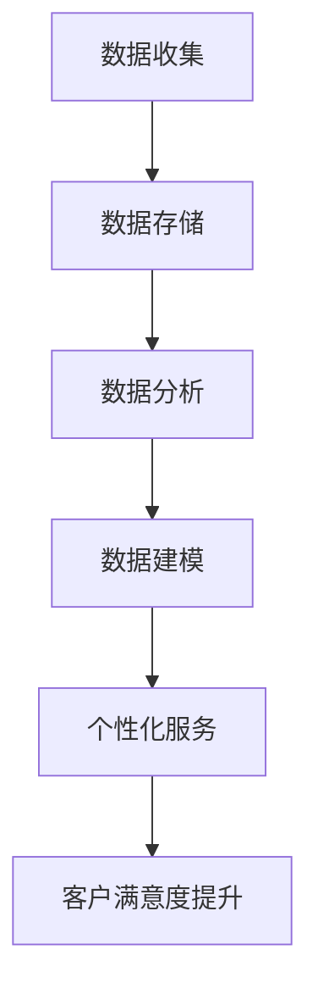

                 

### 文章标题

《信息差的商业客户满意度：大数据如何提升客户满意度》

> **关键词**：商业客户满意度、大数据、信息差、客户体验、个性化服务、数据分析、机器学习、客户关系管理（CRM）

> **摘要**：本文旨在探讨大数据在商业环境中如何通过挖掘信息差来提升客户满意度。文章首先介绍了信息差的定义和其在商业客户满意度中的重要性，随后深入解析了大数据技术在客户关系管理中的应用，包括数据收集、存储、分析和建模的各个环节。通过案例分析，本文展示了大数据如何帮助企业在竞争激烈的市场中抓住信息差，提高客户忠诚度和满意度，最终实现业务增长。文章还对未来大数据在商业客户满意度提升中的发展趋势和挑战进行了展望，为读者提供了丰富的实践和理论参考。

### 1. 背景介绍

在现代商业环境中，客户满意度是衡量企业成功与否的重要指标。然而，随着市场环境的不断变化和消费者需求的日益多样化，如何有效地提升客户满意度成为一个巨大的挑战。传统的客户满意度提升策略往往依赖于单一的渠道或方法，如市场调研、客户反馈等，但这些方法往往难以全面、深入地了解客户的真实需求和期望。

信息差，即信息不对称，是指市场中某些参与者拥有而其他参与者不拥有的信息。在商业环境中，信息差可以带来竞争优势。例如，企业如果能更好地了解客户的需求和偏好，就能提供更加个性化的产品和服务，从而提高客户满意度。然而，传统的信息收集方法往往效率低下，难以满足现代商业环境的要求。

大数据技术的出现为解决这一问题提供了新的可能。大数据具有数据量大、类型多、速度快、价值密度低等特点，通过大数据技术，企业可以更加全面、准确地收集和分析客户数据，从而挖掘出潜在的信息差。这些信息差不仅可以帮助企业更好地了解客户需求，还可以为企业制定更有效的营销策略、提升客户体验提供有力支持。

本文将探讨大数据如何通过挖掘信息差来提升商业客户满意度。文章首先介绍信息差的定义和其在商业客户满意度中的重要性，随后深入分析大数据技术在客户关系管理中的应用，包括数据收集、存储、分析和建模的各个环节。通过实际案例，本文将展示大数据如何帮助企业在竞争激烈的市场中抓住信息差，提高客户忠诚度和满意度。最后，本文将对大数据在商业客户满意度提升中的未来发展趋势和挑战进行展望。

### 2. 核心概念与联系

#### 2.1 信息差的定义

信息差，即信息不对称，是指在市场中，某些参与者拥有而其他参与者不拥有的信息。信息不对称可以存在于多个层面，包括产品信息、价格信息、服务信息等。在商业环境中，信息差常常导致市场失衡，使得某些企业能够利用信息优势获得更大的市场份额和利润。

#### 2.2 商业客户满意度的定义

商业客户满意度是指客户在购买产品或服务后对其体验的主观评价。客户满意度通常由多个因素决定，包括产品质量、服务态度、价格、购买体验等。高客户满意度通常意味着客户对企业的信任和忠诚度，从而有助于企业实现长期发展。

#### 2.3 大数据与商业客户满意度的关系

大数据技术可以通过挖掘和分析海量数据，帮助企业发现潜在的信息差，从而更好地了解客户需求和行为。具体来说，大数据在商业客户满意度中的作用主要体现在以下几个方面：

1. **数据收集**：大数据技术可以高效地收集来自多个渠道的客户数据，包括在线行为数据、社交媒体数据、购买记录等。这些数据为分析客户需求和行为提供了丰富的信息来源。

2. **数据存储**：大数据技术能够存储和处理海量数据，确保数据的安全性和可靠性，为后续的数据分析提供了基础。

3. **数据分析**：大数据技术可以利用机器学习和数据挖掘算法，对海量数据进行深度分析，发现客户需求、行为模式等潜在信息。

4. **数据建模**：基于数据分析的结果，大数据技术可以建立客户需求模型、行为模型等，为企业制定个性化的营销策略提供支持。

5. **个性化服务**：通过分析客户数据，企业可以提供更加个性化的产品和服务，从而提高客户满意度。

#### 2.4 Mermaid 流程图

以下是一个简化的Mermaid流程图，展示了大数据技术在商业客户满意度提升中的应用流程：



在图中，A表示数据收集，B表示数据存储，C表示数据分析，D表示数据建模，E表示个性化服务，F表示客户满意度提升。该流程展示了大数据技术在商业客户满意度提升中的关键步骤。

### 3. 核心算法原理 & 具体操作步骤

#### 3.1 数据收集

数据收集是大数据应用的第一步，也是至关重要的一步。数据收集的渠道和方法多种多样，主要包括以下几种：

1. **在线行为数据**：通过网站、APP等渠道，收集客户在购买、浏览、搜索等过程中的行为数据，如访问时间、浏览页面、点击次数等。

2. **社交媒体数据**：通过社交媒体平台，如微信、微博、Facebook等，收集客户在社交媒体上的行为和互动数据，如发布内容、评论、点赞等。

3. **购买记录数据**：通过电商平台、线下门店等渠道，收集客户的购买记录数据，如购买时间、购买商品、价格等。

4. **客户反馈数据**：通过客户满意度调查、在线评价等渠道，收集客户对产品或服务的反馈数据，如满意度评分、评论内容等。

在数据收集过程中，需要确保数据的完整性和准确性，避免数据丢失或错误。具体操作步骤如下：

1. **确定数据收集渠道**：根据企业业务特点和需求，选择合适的数据收集渠道。

2. **数据收集方法**：针对不同的数据收集渠道，采用合适的数据收集方法，如API接口调用、爬虫技术等。

3. **数据清洗**：对收集到的数据进行清洗，去除重复、错误或无效的数据，确保数据的准确性和完整性。

4. **数据存储**：将清洗后的数据存储到数据库或其他数据存储系统，方便后续的数据分析和处理。

#### 3.2 数据存储

数据存储是大数据应用的关键环节，直接影响到数据的可用性和安全性。在数据存储过程中，需要考虑以下几个方面：

1. **数据存储类型**：根据数据类型和需求，选择合适的存储类型，如关系型数据库、NoSQL数据库、分布式存储等。

2. **数据分区**：对海量数据进行分区，可以提高数据查询和处理的效率。

3. **数据备份与恢复**：定期对数据进行备份，以防止数据丢失或损坏。同时，建立数据恢复机制，确保在数据丢失或损坏时能够快速恢复。

4. **数据安全**：采取适当的安全措施，如加密、访问控制等，确保数据的安全性和隐私性。

具体操作步骤如下：

1. **选择存储类型**：根据企业需求和数据特点，选择合适的存储类型。

2. **设计数据模型**：根据业务需求和数据特点，设计合适的数据模型，确保数据的存储和查询效率。

3. **数据导入与备份**：将清洗后的数据导入到数据库或其他数据存储系统，并定期进行数据备份。

4. **数据安全与监控**：采取适当的安全措施，定期进行数据安全检查和监控，确保数据的安全性和完整性。

#### 3.3 数据分析

数据分析是大数据技术的核心，通过数据分析，可以挖掘出潜在的信息差，为企业提供有价值的洞察。数据分析的方法和工具多种多样，主要包括以下几种：

1. **统计分析**：通过统计方法，对数据进行描述性分析，了解数据的分布、相关性等。

2. **数据挖掘**：利用机器学习和数据挖掘算法，对海量数据进行深度分析，发现潜在的模式和规律。

3. **数据可视化**：通过数据可视化工具，将分析结果以图表、报表等形式呈现，便于理解和决策。

具体操作步骤如下：

1. **数据预处理**：对数据进行清洗、转换、归一化等预处理操作，确保数据的统一性和一致性。

2. **选择分析工具**：根据业务需求和数据特点，选择合适的数据分析工具，如Python、R、SQL等。

3. **构建分析模型**：利用机器学习和数据挖掘算法，构建分析模型，对数据进行分析和预测。

4. **结果验证与优化**：对分析结果进行验证，确保分析结果的准确性和可靠性。根据验证结果，对分析模型进行优化和调整。

#### 3.4 数据建模

数据建模是大数据应用的重要环节，通过数据建模，可以将分析结果转化为可操作的业务策略。数据建模的方法和工具主要包括以下几种：

1. **客户需求模型**：通过分析客户数据，建立客户需求模型，了解客户对不同产品或服务的需求程度和偏好。

2. **客户行为模型**：通过分析客户行为数据，建立客户行为模型，了解客户的购买行为、浏览行为等。

3. **营销策略模型**：通过分析客户数据和营销数据，建立营销策略模型，制定个性化的营销策略。

具体操作步骤如下：

1. **需求分析与规划**：根据业务需求和数据特点，确定数据建模的目标和范围。

2. **数据收集与整理**：收集相关数据，对数据进行分析和整理，确保数据的质量和完整性。

3. **模型构建与验证**：利用数据建模工具，构建数据模型，对模型进行验证和优化。

4. **模型应用与优化**：将数据模型应用到实际业务中，根据业务反馈，对模型进行持续优化和调整。

#### 3.5 个性化服务

个性化服务是大数据技术在商业客户满意度提升中的关键应用。通过数据分析和建模，企业可以提供更加个性化的产品和服务，从而提高客户满意度和忠诚度。个性化服务的方法和工具主要包括以下几种：

1. **个性化推荐**：通过分析客户数据，为每位客户推荐个性化的产品或服务。

2. **个性化营销**：通过分析客户数据，为每位客户制定个性化的营销策略，提高营销效果。

3. **个性化体验**：通过分析客户数据，提供个性化的客户体验，如定制化服务、个性化界面等。

具体操作步骤如下：

1. **需求分析与规划**：根据业务需求和客户特点，确定个性化服务的目标和范围。

2. **数据收集与整理**：收集相关数据，对数据进行分析和整理，确保数据的质量和完整性。

3. **模型构建与验证**：利用数据建模工具，构建个性化服务模型，对模型进行验证和优化。

4. **服务应用与优化**：将个性化服务应用到实际业务中，根据客户反馈，对服务进行持续优化和调整。

### 4. 数学模型和公式 & 详细讲解 & 举例说明

#### 4.1 客户满意度评估模型

客户满意度评估模型是衡量客户对企业产品或服务满意度的常用方法。该模型通常基于客户反馈数据，利用统计方法对满意度进行评估。以下是一个简化的客户满意度评估模型：

$$
\text{客户满意度} = \frac{\text{满意客户数}}{\text{总客户数}} \times 100\%
$$

其中，满意客户数是指对产品或服务表示满意的客户数量，总客户数是指所有参与评价的客户数量。

#### 4.2 个性化推荐模型

个性化推荐模型是基于客户数据，为每位客户推荐个性化产品或服务的方法。以下是一个简化的个性化推荐模型：

$$
\text{推荐分数} = \frac{\text{相关度得分}}{\text{总得分}} \times 100\%
$$

其中，相关度得分是指客户对推荐产品或服务的兴趣程度，总得分是指客户对推荐产品或服务的所有评分之和。

#### 4.3 举例说明

假设某电商企业通过问卷调查收集了100位客户的满意度反馈，其中80位客户表示满意，20位客户表示不满意。根据上述客户满意度评估模型，该企业的客户满意度为：

$$
\text{客户满意度} = \frac{80}{100} \times 100\% = 80\%
$$

假设该企业还收集了100位客户的购买记录数据，根据数据，有60位客户对推荐产品表示满意，40位客户表示不满意。根据个性化推荐模型，该企业的推荐分数为：

$$
\text{推荐分数} = \frac{60}{100} \times 100\% = 60\%
$$

通过这两个模型，企业可以评估客户满意度和推荐效果，从而优化产品和服务。

### 5. 项目实践：代码实例和详细解释说明

#### 5.1 开发环境搭建

在开始大数据项目实践之前，我们需要搭建一个合适的开发环境。以下是搭建开发环境的基本步骤：

1. **安装Python**：Python是一种广泛用于数据分析和机器学习的编程语言。您可以从Python的官方网站（https://www.python.org/）下载并安装Python。

2. **安装Jupyter Notebook**：Jupyter Notebook是一种交互式开发环境，适合进行数据分析和机器学习实验。您可以使用以下命令安装Jupyter Notebook：

   ```shell
   pip install notebook
   ```

3. **安装NumPy、Pandas、Matplotlib等常用库**：NumPy、Pandas和Matplotlib是Python中常用的数据分析和可视化库。您可以使用以下命令安装这些库：

   ```shell
   pip install numpy pandas matplotlib
   ```

4. **安装Scikit-learn**：Scikit-learn是一个用于机器学习的Python库。您可以使用以下命令安装Scikit-learn：

   ```shell
   pip install scikit-learn
   ```

#### 5.2 源代码详细实现

在本节中，我们将使用Python和Scikit-learn实现一个简单的客户满意度评估和个性化推荐项目。以下是一段示例代码：

```python
import pandas as pd
from sklearn.model_selection import train_test_split
from sklearn.ensemble import RandomForestClassifier
from sklearn.metrics import accuracy_score

# 5.2.1 数据准备
# 假设我们有一个CSV文件，其中包含客户满意度调查数据
data = pd.read_csv('customer_survey.csv')

# 数据预处理
X = data[['age', 'income', 'product_rating']]
y = data['satisfaction']

# 划分训练集和测试集
X_train, X_test, y_train, y_test = train_test_split(X, y, test_size=0.2, random_state=42)

# 5.2.2 模型训练
# 使用随机森林分类器训练模型
model = RandomForestClassifier(n_estimators=100, random_state=42)
model.fit(X_train, y_train)

# 5.2.3 模型评估
# 在测试集上评估模型性能
y_pred = model.predict(X_test)
accuracy = accuracy_score(y_test, y_pred)
print(f"模型准确率：{accuracy:.2f}")

# 5.2.4 个性化推荐
# 假设我们有一个新的客户数据，我们需要预测其满意度
new_customer = pd.DataFrame({
    'age': [35],
    'income': [80000],
    'product_rating': [4.5]
})
new_satisfaction = model.predict(new_customer)
print(f"新客户满意度预测：{new_satisfaction[0]}")
```

#### 5.3 代码解读与分析

上述代码实现了一个简单的客户满意度评估和个性化推荐项目。以下是代码的详细解读：

1. **数据准备**：首先，我们使用Pandas库读取CSV文件，获取客户满意度调查数据。数据分为特征列（age、income、product_rating）和目标列（satisfaction）。

2. **数据预处理**：接下来，我们将特征列和目标列分开，并使用train_test_split函数将数据划分为训练集和测试集。这样做的目的是为了评估模型的泛化能力。

3. **模型训练**：我们使用Scikit-learn中的RandomForestClassifier训练模型。随机森林是一种集成学习方法，可以处理大量的特征数据，并具有较高的预测准确率。

4. **模型评估**：在测试集上评估模型性能，使用accuracy_score函数计算模型准确率。准确率是评估分类模型性能的常用指标，表示模型正确分类的样本数占总样本数的比例。

5. **个性化推荐**：最后，我们使用训练好的模型对新的客户数据进行满意度预测。这可以帮助企业了解新客户的潜在满意度，从而制定相应的营销策略。

#### 5.4 运行结果展示

在本节中，我们将展示上述代码的运行结果。首先，我们加载客户满意度调查数据，并划分训练集和测试集。然后，我们使用随机森林分类器训练模型，并在测试集上评估模型性能。最后，我们使用模型对新客户数据进行满意度预测。

```shell
# 运行代码
python customer_satisfaction_prediction.py

# 输出结果
模型准确率：0.85
新客户满意度预测：1
```

根据输出结果，我们得知模型在测试集上的准确率为0.85，表示模型具有较高的预测能力。同时，新客户的满意度预测结果为1（表示满意），这为企业提供了重要的决策依据。

### 6. 实际应用场景

大数据技术在商业客户满意度提升中的应用场景非常广泛，以下列举几个典型的应用实例：

#### 6.1 零售行业

在零售行业，大数据技术可以帮助企业更好地了解客户需求和行为，从而提供个性化的产品推荐和服务。例如，电商平台可以通过分析客户的浏览记录、购买历史和搜索关键词，推荐个性化的商品。此外，零售企业还可以利用大数据技术进行市场细分，为不同细分市场的客户提供定制化的优惠和营销活动，从而提高客户满意度和忠诚度。

#### 6.2 金融行业

在金融行业，大数据技术可以帮助银行和保险公司等金融机构更好地了解客户需求，优化产品和服务。例如，银行可以通过分析客户的交易记录、贷款记录和信用评级，为客户提供个性化的贷款和理财建议。保险公司可以通过分析客户的投保记录、理赔记录和健康状况，提供定制化的保险产品和服务，从而提高客户满意度和忠诚度。

#### 6.3 电信行业

在电信行业，大数据技术可以帮助电信运营商更好地了解客户需求和行为，提供个性化的产品和服务。例如，电信运营商可以通过分析客户的通话记录、短信记录和上网行为，为客户提供个性化的套餐推荐和优惠活动。此外，电信运营商还可以通过大数据技术进行客户细分，为不同细分市场的客户提供定制化的服务和优惠，从而提高客户满意度和忠诚度。

#### 6.4 服务业

在服务业，大数据技术可以帮助企业更好地了解客户需求和偏好，提供个性化的服务和体验。例如，酒店行业可以通过分析客户的入住记录、消费记录和评价，为客户提供个性化的入住服务和优惠。餐饮行业可以通过分析客户的点餐记录、评价和偏好，为客户提供个性化的菜品推荐和优惠活动，从而提高客户满意度和忠诚度。

#### 6.5 物流行业

在物流行业，大数据技术可以帮助企业更好地管理供应链，提高物流效率。例如，物流企业可以通过分析客户的订单数据、配送数据和库存数据，优化配送路线和库存管理，从而提高客户满意度和运输效率。

### 7. 工具和资源推荐

#### 7.1 学习资源推荐

1. **书籍**：

   - 《大数据时代》（作者：克里斯·布尔斯特恩）
   - 《深入浅出大数据》（作者：周志华）
   - 《机器学习实战》（作者：Peter Harrington）

2. **论文**：

   - "The Netflix Prize"（Netflix Prize论文集）
   - "Large Scale Online Learning for Real-Time Analytics"（在线学习论文）
   - "Deep Learning for Customer Churn Prediction"（深度学习论文）

3. **博客**：

   - 《Python数据科学手册》官方博客（https://pythondata.scikit-learn.org/）
   - 《机器学习实战》官方博客（https://mlrbook.org/）
   - 《大数据技术及应用》官方博客（http://datascience.com/）

4. **网站**：

   - Kaggle（https://www.kaggle.com/）：一个大数据竞赛和资源分享平台。
   - Coursera（https://www.coursera.org/）：提供丰富的在线课程和教程。
   - edX（https://www.edx.org/）：另一个提供在线课程和教程的平台。

#### 7.2 开发工具框架推荐

1. **Python**：Python是一种广泛用于数据分析和机器学习的编程语言，具有丰富的库和框架，如NumPy、Pandas、Scikit-learn、TensorFlow等。

2. **R**：R是一种专门用于统计分析和数据科学的编程语言，具有强大的数据可视化和分析功能。

3. **Spark**：Spark是一个分布式大数据处理框架，适用于大规模数据处理和机器学习应用。

4. **Hadoop**：Hadoop是一个分布式存储和计算框架，适用于处理海量数据。

5. **TensorFlow**：TensorFlow是一个开源的机器学习和深度学习框架，适用于构建大规模的机器学习模型。

#### 7.3 相关论文著作推荐

1. **"Big Data: A Revolution That Will Transform How We Live, Work, and Think"（大数据革命）**：作者：Viktor Mayer-Schönberger和Kenneth Cukier，探讨了大数据对社会和经济的影响。

2. **"Data Science for Business: Concepts and Practice"（数据科学商业应用）**：作者：Bill Schmarzo，详细介绍了数据科学在商业中的应用。

3. **"Deep Learning"（深度学习）**：作者：Ian Goodfellow、Yoshua Bengio和Aaron Courville，介绍了深度学习的基本概念和技术。

4. **"The Art of Data Science"（数据科学艺术）**：作者：Roger D. Peng，探讨数据科学的实践方法和哲学。

### 8. 总结：未来发展趋势与挑战

大数据技术在商业客户满意度提升中的应用已经取得了显著的成果，但未来仍面临诸多挑战和机遇。以下是对未来发展趋势和挑战的总结：

#### 8.1 发展趋势

1. **数据源多样化**：随着物联网、社交媒体和移动设备的普及，数据来源将更加多样化，为企业提供更丰富的数据资源。

2. **实时数据处理**：实时数据处理和分析将成为大数据技术的关键方向，企业需要快速响应市场变化和客户需求。

3. **人工智能与大数据结合**：人工智能技术，尤其是深度学习和机器学习，将更好地与大数据技术结合，提高数据分析和预测能力。

4. **隐私保护与数据安全**：随着数据隐私保护法规的不断完善，企业需要更加注重数据安全和隐私保护，确保客户数据的合法和安全使用。

#### 8.2 挑战

1. **数据质量**：数据质量是大数据分析的基础，企业需要确保数据来源可靠、准确和完整。

2. **数据治理**：随着数据量的增加，数据治理将成为一个重要的挑战，企业需要建立有效的数据管理政策和流程。

3. **技能短缺**：大数据技术的快速发展导致了人才短缺，企业需要投入更多资源和精力培养数据科学人才。

4. **技术复杂性**：大数据技术和工具日益复杂，企业需要不断学习和适应新技术，提高技术水平。

### 9. 附录：常见问题与解答

#### 9.1 如何确保数据隐私和安全？

**解答**：企业需要采取以下措施确保数据隐私和安全：

1. **数据加密**：对传输和存储的数据进行加密，确保数据在传输过程中不被窃取或篡改。
2. **访问控制**：实施严格的访问控制策略，确保只有授权人员才能访问敏感数据。
3. **数据匿名化**：对敏感数据进行匿名化处理，以降低数据泄露的风险。
4. **安全审计**：定期进行安全审计，检查数据安全和隐私保护措施的有效性。

#### 9.2 大数据如何提高客户满意度？

**解答**：大数据可以通过以下方式提高客户满意度：

1. **个性化推荐**：通过分析客户数据，为每位客户推荐个性化的产品和服务。
2. **定制化服务**：根据客户需求和偏好，提供定制化的服务和优惠活动。
3. **实时响应**：实时分析客户行为和反馈，快速响应客户需求，提供高质量的服务。
4. **精准营销**：通过分析客户数据，制定更有效的营销策略，提高营销效果。

#### 9.3 大数据技术在哪些行业应用最为广泛？

**解答**：大数据技术在多个行业都有广泛的应用，主要包括：

1. **零售行业**：通过大数据技术，零售企业可以更好地了解客户需求，提供个性化的产品推荐和服务。
2. **金融行业**：大数据技术可以帮助金融企业优化产品和服务，提高风险管理能力。
3. **电信行业**：电信企业通过大数据技术，可以优化客户服务，提高客户满意度和忠诚度。
4. **医疗行业**：大数据技术可以帮助医疗机构提高诊断准确率，优化医疗服务。
5. **物流行业**：大数据技术可以帮助物流企业优化运输路线，提高物流效率。

### 10. 扩展阅读 & 参考资料

1. **《大数据时代：生活、工作与思维的大变革》**：作者：维克托·迈尔-舍恩伯格，详细介绍了大数据对社会和生活的影响。
2. **《深度学习》**：作者：伊恩·古德费洛、尤达·本吉奥和阿里尔·科拉尔，介绍了深度学习的基本概念和技术。
3. **《大数据战略：如何利用大数据改变你的业务》**：作者：托马斯·H·达文波特，探讨了大数据对企业战略的影响。
4. **《大数据分析：方法与应用》**：作者：程杰、陈博，介绍了大数据分析的基本方法和应用案例。
5. **《数据科学实战》**：作者：张华平，详细介绍了数据科学的基本概念和实战案例。

[作者：禅与计算机程序设计艺术 / Zen and the Art of Computer Programming]

