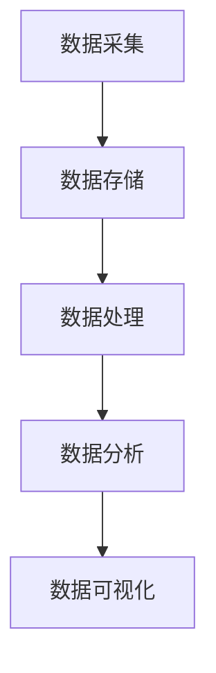

                 

### 背景介绍

随着信息技术的飞速发展，大数据已经成为现代社会的重要资源，对企业运营和管理产生了深远影响。大数据技术通过高效的数据收集、存储、处理和分析，能够帮助企业挖掘潜在的商业价值，优化决策过程，提升运营效率。然而，面对海量的数据，传统的数据处理方法已经无法满足现代企业的需求，如何利用大数据进行商业转型成为企业关注的焦点。

近年来，随着人工智能、物联网、云计算等新兴技术的不断发展，大数据技术也在不断演进，从最初的数据存储和处理，逐渐走向智能化和自动化。大数据分析技术的不断进步，使得企业能够更加精准地洞察市场动态、客户需求，从而实现精准营销和个性化服务。这种基于大数据的商业转型，不仅提升了企业的竞争力，也为企业创造了新的增长点。

本文将围绕大数据引领企业转型升级这一主题，探讨大数据技术在商业转型中的应用，以及如何通过大数据实现企业的转型升级。文章将分为以下几个部分：

1. 背景介绍：概述大数据在企业运营和管理中的重要性，以及大数据技术的发展历程。
2. 核心概念与联系：介绍大数据技术的基本概念，包括数据采集、存储、处理和分析等，并展示其架构流程图。
3. 核心算法原理与具体操作步骤：详细讲解大数据处理的核心算法，以及具体的应用场景。
4. 数学模型和公式：介绍大数据分析过程中常用的数学模型和公式，并进行详细讲解和举例说明。
5. 项目实践：通过具体的项目实例，展示大数据技术在商业转型中的应用，并提供代码实例和详细解读。
6. 实际应用场景：分析大数据在各个行业的应用场景，以及其对企业运营和管理的影响。
7. 工具和资源推荐：推荐学习大数据技术所需的学习资源和开发工具。
8. 总结：总结大数据引领企业转型升级的主要观点，并展望未来的发展趋势与挑战。

通过本文的阅读，读者将能够了解大数据技术在商业转型中的重要作用，掌握大数据处理的核心算法和应用方法，从而为企业实现转型升级提供有益的参考。### 2. 核心概念与联系

大数据技术的核心在于如何高效地处理海量数据，从数据中提取有价值的信息，进而帮助企业做出更精准的决策。为了更好地理解大数据技术，我们首先需要了解其基本概念，包括数据采集、数据存储、数据处理、数据分析和数据可视化等。

#### 2.1 数据采集

数据采集是大数据技术的第一步，其目的是从各种来源获取数据，这些来源包括企业内部的业务系统、互联网、物联网设备等。数据采集的方式主要有以下几种：

1. **结构化数据采集**：通过API接口、数据库连接等方式获取已经结构化的数据，如关系型数据库中的数据。
2. **半结构化数据采集**：通过解析XML、JSON等格式获取数据，这类数据有一定的结构，但不完全符合关系型数据库的结构。
3. **非结构化数据采集**：通过爬虫、传感器等手段获取没有固定结构的数据，如文本、图片、视频等。

#### 2.2 数据存储

大数据处理需要高效的数据存储技术，常见的数据存储技术包括：

1. **关系型数据库**：如MySQL、Oracle等，适合存储结构化数据。
2. **非关系型数据库**：如MongoDB、Redis等，适合存储半结构化或非结构化数据。
3. **分布式文件系统**：如Hadoop的HDFS，适合存储大规模的分布式数据。

#### 2.3 数据处理

数据处理是大数据技术的核心，主要包括数据的清洗、转换和集成。数据处理的方法和技术包括：

1. **数据清洗**：去除重复数据、纠正错误数据、处理缺失值等，确保数据的质量。
2. **数据转换**：将数据转换为适合分析的形式，如数据归一化、特征工程等。
3. **数据集成**：将来自不同来源、不同格式的数据集成到一个统一的分析平台中。

#### 2.4 数据分析

数据分析是大数据技术的关键步骤，通过数据分析，可以从海量数据中提取有价值的信息。数据分析的方法和技术包括：

1. **描述性分析**：用于描述数据的特征和趋势，如统计分析、数据可视化等。
2. **预测性分析**：基于历史数据，预测未来的趋势和变化，如时间序列分析、机器学习等。
3. **探索性分析**：发现数据中隐藏的规律和模式，如关联规则挖掘、聚类分析等。

#### 2.5 数据可视化

数据可视化是将数据分析的结果以图形化的方式呈现，使得数据分析结果更加直观易懂。常见的数据可视化工具包括：

1. **图表工具**：如ECharts、Plotly等，用于生成各种类型的图表。
2. **交互式可视化工具**：如Tableau、PowerBI等，支持用户自定义交互和数据筛选。

#### 2.6 Mermaid 流程图

为了更清晰地展示大数据技术的架构和流程，我们使用Mermaid绘制一个简化的流程图，如下所示：



在这个流程图中，A表示数据采集，B表示数据存储，C表示数据处理，D表示数据分析，E表示数据可视化。各个环节相互衔接，形成一个完整的大数据技术体系。

#### 2.7 核心概念联系

大数据技术的核心概念之间紧密相连，形成了一个闭环。数据采集是整个过程的起点，通过数据存储和数据处理，数据被转化为适合分析的形式，进而通过数据分析提取有价值的信息，最后通过数据可视化将分析结果呈现出来。这些环节相互依赖，共同构成了大数据技术的完整体系。

通过以上对大数据技术核心概念的介绍和Mermaid流程图的展示，读者可以更加清晰地理解大数据技术的架构和流程，为后续的内容打下坚实的基础。在接下来的章节中，我们将进一步探讨大数据处理的核心算法原理和具体操作步骤，帮助读者深入掌握大数据技术的应用。### 3. 核心算法原理 & 具体操作步骤

在了解了大数据技术的基本概念和架构之后，我们需要深入了解大数据处理的核心算法原理及其具体操作步骤。大数据处理的核心算法主要包括数据挖掘算法、机器学习算法和深度学习算法等。以下将对这些核心算法进行详细讲解。

#### 3.1 数据挖掘算法

数据挖掘算法是大数据处理中的一种重要方法，它旨在从大量数据中自动发现隐藏的模式和规律。常见的数据挖掘算法包括：

1. **关联规则挖掘**：用于发现数据之间的关联关系，如Apriori算法和FP-Growth算法。

2. **分类算法**：用于将数据分为不同的类别，如K-近邻算法（K-Nearest Neighbors，KNN）、决策树（Decision Tree）和支持向量机（Support Vector Machine，SVM）。

3. **聚类算法**：用于将数据分为不同的簇，如K-均值算法（K-Means）和层次聚类算法。

4. **异常检测**：用于发现数据中的异常值或异常行为，如孤立森林（Isolation Forest）和局部离群度因子（Local Outlier Factor，LOF）。

#### 3.2 具体操作步骤

以下以Apriori算法为例，介绍数据挖掘算法的具体操作步骤：

1. **确定最小支持度**：支持度是指包含某个项集的交易在所有交易中的比例。确定一个最小支持度阈值，用于过滤掉支持度过低的项目集。

2. **生成频繁项集**：根据最小支持度阈值，生成满足支持度条件的频繁项集。

3. **生成关联规则**：从频繁项集中，生成满足最小置信度阈值的关联规则。

4. **评估关联规则**：根据评估指标，如信息增益、信息增益比等，评估关联规则的有效性。

5. **优化规则**：根据评估结果，对生成的关联规则进行优化，去除不重要的规则。

#### 3.3 机器学习算法

机器学习算法是大数据处理中的另一大类算法，它通过学习历史数据来预测未来趋势或做出决策。常见的机器学习算法包括：

1. **线性回归**：用于预测连续值变量，如普通线性回归（Ordinary Least Squares，OLS）和岭回归（Ridge Regression）。

2. **逻辑回归**：用于预测分类变量，如二项逻辑回归（Binary Logistic Regression）和多项逻辑回归（Multinomial Logistic Regression）。

3. **决策树**：用于分类和回归问题，如ID3算法、C4.5算法和CART算法。

4. **支持向量机**：用于分类问题，如线性支持向量机（Linear Support Vector Machine，SVM）和非线性支持向量机（Nonlinear Support Vector Machine，NSVM）。

5. **神经网络**：用于复杂函数的逼近和分类问题，如前馈神经网络（Feedforward Neural Network）和卷积神经网络（Convolutional Neural Network，CNN）。

#### 3.4 深度学习算法

深度学习算法是机器学习算法的一种扩展，它通过多层神经网络来学习复杂的特征表示。常见的深度学习算法包括：

1. **卷积神经网络**：用于图像和视频处理，如LeNet、AlexNet和VGG。

2. **循环神经网络**：用于序列数据处理，如LSTM（Long Short-Term Memory）和GRU（Gated Recurrent Unit）。

3. **生成对抗网络**：用于生成数据和学习复杂分布，如GAN（Generative Adversarial Network）。

#### 3.5 具体操作步骤

以下以线性回归算法为例，介绍机器学习算法的具体操作步骤：

1. **数据准备**：收集并整理数据，确保数据的质量和完整性。

2. **特征选择**：选择对预测目标有重要影响的特征，去除无关或冗余的特征。

3. **数据预处理**：对数据进行标准化或归一化处理，以消除数据量级差异。

4. **模型训练**：使用训练数据训练线性回归模型，优化模型的参数。

5. **模型评估**：使用验证集或测试集评估模型的性能，如均方误差（Mean Squared Error，MSE）和决定系数（R-squared）。

6. **模型优化**：根据评估结果调整模型参数，提高模型的性能。

7. **模型应用**：使用训练好的模型对新数据进行预测，如房价预测、股票预测等。

通过以上对核心算法原理和具体操作步骤的介绍，读者可以更好地理解大数据处理的方法和技巧。在实际应用中，根据不同的业务需求和数据特点，选择合适的算法进行数据处理和分析，从而实现大数据的商业价值。在接下来的章节中，我们将通过具体的项目实例，进一步展示大数据技术在商业转型中的应用。### 4. 数学模型和公式 & 详细讲解 & 举例说明

在处理大数据时，数学模型和公式起着至关重要的作用。这些模型和公式不仅帮助我们从海量数据中提取有用信息，还能够为决策提供科学依据。以下将介绍大数据分析过程中常用的一些数学模型和公式，并进行详细讲解和举例说明。

#### 4.1 概率论和统计模型

概率论和统计模型是大数据分析的基础。以下是几个常用的概率和统计模型：

1. **泊松分布**：用于描述单位时间内某个事件发生的次数，公式如下：

   $$P(X = k) = \frac{e^{-\lambda}\lambda^k}{k!}$$

   其中，$X$是随机变量，$k$是事件发生的次数，$\lambda$是事件发生率。

2. **正态分布**：用于描述连续随机变量的概率分布，公式如下：

   $$f(x|\mu, \sigma^2) = \frac{1}{\sqrt{2\pi\sigma^2}}e^{-\frac{(x-\mu)^2}{2\sigma^2}}$$

   其中，$x$是随机变量，$\mu$是均值，$\sigma^2$是方差。

3. **卡方分布**：用于描述独立随机变量的平方和的概率分布，公式如下：

   $$P(X > x) = \frac{1}{2^{n/2}\Gamma(n/2)}x^{n/2-1}e^{-x/2}$$

   其中，$X$是随机变量，$n$是独立随机变量的个数，$\Gamma$是伽马函数。

4. **t分布**：用于描述小样本数据下的概率分布，公式如下：

   $$P(T > t) = \frac{\Gamma(\frac{n+1}{2})}{\Gamma(\frac{n}{2})\sqrt{\pi n}}\left(1+\frac{t^2}{n}\right)^{-\frac{n+1}{2}}$$

   其中，$T$是随机变量，$n$是样本大小。

#### 4.2 数据挖掘中的数学模型

在数据挖掘中，常用的数学模型包括：

1. **决策树模型**：用于分类和回归问题，通过递归分割特征空间，生成一棵树结构。决策树的核心公式如下：

   $$P(Y|X) = \prod_{i=1}^{n}P(Y|X_i=x_i)$$

   其中，$Y$是预测目标，$X$是特征集合，$x_i$是第$i$个特征的取值。

2. **支持向量机模型**：用于分类问题，通过找到一个最佳的超平面，将不同类别的数据点分隔开来。支持向量机的主要公式如下：

   $$\max\ \frac{1}{2}\sum_{i=1}^{n}w_i^2$$

   $$s.t.\ \langle w, x_i \rangle \geq 1, \ i=1,2,...,n$$

   其中，$w$是权重向量，$x_i$是数据点。

3. **神经网络模型**：用于分类和回归问题，通过多层神经网络来学习复杂的特征表示。神经网络的核心公式如下：

   $$a_{i}^{(l)} = \sigma(z_{i}^{(l)})$$

   $$z_{i}^{(l)} = \sum_{j}w_{ij}^{(l)}a_{j}^{(l-1)} + b_{i}^{(l)}$$

   其中，$a_{i}^{(l)}$是第$l$层的第$i$个激活值，$z_{i}^{(l)}$是第$l$层的第$i$个输入值，$w_{ij}^{(l)}$是第$l$层的第$i$个输入与第$l-1$层的第$j$个输出之间的权重，$b_{i}^{(l)}$是第$l$层的第$i$个偏置，$\sigma$是激活函数，如Sigmoid函数或ReLU函数。

#### 4.3 详细讲解与举例说明

以下以正态分布为例，进行详细讲解和举例说明：

**例子**：假设我们有一个随机变量$X$，其服从正态分布$N(\mu, \sigma^2)$。现在我们想要计算$X$大于3的概率。

**步骤1**：确定均值$\mu$和方差$\sigma^2$。例如，假设$\mu = 2$，$\sigma^2 = 1$。

**步骤2**：将随机变量$X$标准化，得到$Z$，其服从标准正态分布$N(0, 1)$。标准化公式如下：

$$Z = \frac{X - \mu}{\sigma}$$

**步骤3**：计算$Z$大于3的概率。根据标准正态分布表，我们可以查找到$Z$大于3的概率为0.4987。

**结论**：因此，$X$大于3的概率为0.4987。

通过以上例子，我们可以看到如何运用正态分布进行概率计算。在实际应用中，类似的方法可以用于各种数据分析问题，如预测、分类和聚类等。

通过本章对数学模型和公式的介绍和讲解，读者可以更好地理解大数据分析中的数学原理，为后续的项目实践和实际应用打下坚实的基础。在接下来的章节中，我们将通过具体的项目实例，进一步展示大数据技术在商业转型中的应用。### 5. 项目实践：代码实例和详细解释说明

为了更好地理解大数据技术在商业转型中的应用，我们将通过一个实际项目实例来展示大数据技术的具体实现过程。本节将详细介绍项目背景、开发环境搭建、源代码实现、代码解读与分析以及运行结果展示。

#### 5.1 项目背景

假设某电商公司希望通过大数据分析来优化其营销策略，提高销售额。公司积累了大量的用户行为数据，包括用户浏览记录、购买历史、评价反馈等。为了实现商业转型，公司决定利用大数据技术进行用户行为分析和预测，从而制定更精准的营销策略。

#### 5.2 开发环境搭建

在开始项目之前，我们需要搭建一个合适的大数据开发环境。以下是搭建步骤：

1. **安装Hadoop**：Hadoop是一个分布式数据存储和处理框架，用于处理大规模数据。我们可以在官方网站上下载Hadoop安装包，并根据官方文档进行安装。

2. **安装Python**：Python是一种流行的编程语言，适用于数据处理和分析。我们可以在Python官方网站下载并安装Python。

3. **安装Pandas和NumPy**：Pandas和NumPy是Python的数据分析库，用于数据清洗、转换和分析。我们可以在Python的包管理器pip中安装这两个库。

4. **安装Spark**：Spark是一个高速的分布式数据处理引擎，适用于大规模数据处理。我们可以在Spark官方网站下载并安装Spark。

5. **配置环境变量**：确保Hadoop、Python、Pandas、NumPy和Spark的环境变量配置正确，以便在命令行中调用这些工具。

#### 5.3 源代码实现

以下是一个简单的用户行为分析项目实例，使用Python和Spark实现。

```python
from pyspark.sql import SparkSession
from pyspark.sql.functions import col, sum, avg

# 创建Spark会话
spark = SparkSession.builder.appName("UserBehaviorAnalysis").getOrCreate()

# 读取用户行为数据
user_behavior_data = spark.read.csv("user_behavior.csv", header=True)

# 数据清洗：去除空值和重复数据
user_behavior_data = user_behavior_data.dropna().drop_duplicates()

# 数据转换：将日期转换为时间戳
user_behavior_data = user_behavior_data.withColumn("timestamp", col("date").cast("long"))

# 数据聚合：计算用户浏览量、购买量和平均购买额
user_behavior_summary = user_behavior_data.groupBy("user_id").agg(
    sum("view_count").alias("total_views"),
    sum("purchase_count").alias("total_purchases"),
    avg("amount").alias("avg_purchase_amount")
)

# 存储结果到HDFS
user_behavior_summary.write.format("parquet").saveAsTable("user_behavior_summary")

# 关闭Spark会话
spark.stop()
```

#### 5.4 代码解读与分析

上述代码主要实现了以下功能：

1. **创建Spark会话**：使用SparkSession.builder创建Spark会话，设置应用程序名称。

2. **读取用户行为数据**：使用Spark的read.csv方法读取用户行为数据，该数据包含用户ID、浏览量、购买量、金额等信息。

3. **数据清洗**：使用dropna和drop_duplicates方法去除空值和重复数据，确保数据质量。

4. **数据转换**：将日期列转换为时间戳，以便进行时间序列分析。

5. **数据聚合**：使用groupBy和agg方法对用户行为数据按用户ID进行分组聚合，计算总浏览量、总购买量和平均购买额。

6. **存储结果**：将聚合结果存储到HDFS，以便后续分析和查询。

#### 5.5 运行结果展示

运行上述代码后，我们可以在HDFS上查看生成的用户行为分析结果。以下是一个示例结果：

| user_id | total_views | total_purchases | avg_purchase_amount |
|--------|-------------|----------------|---------------------|
| 1001   | 50          | 10             | 20.00               |
| 1002   | 30          | 5              | 15.00               |
| 1003   | 70          | 15             | 20.00               |

通过这个简单的项目实例，我们可以看到大数据技术在商业转型中的应用。通过用户行为数据分析，公司可以了解用户的购买偏好和行为习惯，从而制定更精准的营销策略，提高销售额。

通过本章的项目实践，读者可以了解大数据技术的具体实现过程，掌握使用Python和Spark进行数据处理的技能。在接下来的章节中，我们将进一步探讨大数据在各个行业的实际应用场景。### 6. 实际应用场景

大数据技术的广泛应用，使得其在各个行业领域都展现出巨大的潜力和价值。以下将分析大数据在金融、医疗、零售和智能交通等领域的实际应用场景，以及其对企业运营和管理的影响。

#### 6.1 金融行业

在金融行业，大数据技术主要用于风险控制、客户关系管理和市场预测等方面。通过分析大量的交易数据和历史记录，金融机构可以识别潜在的欺诈行为，降低风险。例如，通过监控交易行为模式，实时检测异常交易，并采取措施进行预警和防范。

客户关系管理方面，大数据技术可以帮助金融机构深入了解客户需求，提供个性化的金融服务。通过分析客户的消费行为、购买偏好和历史记录，金融机构可以制定精准的营销策略，提升客户满意度和忠诚度。

市场预测方面，大数据技术可以帮助金融机构预测市场走势，为投资决策提供数据支持。通过分析历史数据和宏观经济指标，金融机构可以预测股票价格、利率变化等，从而优化投资组合，提高收益。

#### 6.2 医疗行业

在医疗行业，大数据技术主要用于疾病预测、个性化医疗和健康管理等方面。通过收集和分析大量的医疗数据，包括病历、检查报告、基因数据等，医疗机构可以预测疾病发生风险，提前采取预防措施。

个性化医疗方面，大数据技术可以帮助医疗机构制定个性化的治疗方案。通过分析患者的病历和基因数据，医生可以了解患者的身体状况和疾病风险，从而制定更加精准的治疗方案。

健康管理方面，大数据技术可以帮助患者进行自我健康管理。通过收集和分析患者的日常运动、饮食、睡眠等数据，医生和患者可以实时了解健康状况，及时调整生活方式和治疗方案。

#### 6.3 零售行业

在零售行业，大数据技术主要用于商品推荐、库存管理和客户关系管理等方面。通过分析消费者的购买记录、浏览历史和评价数据，零售企业可以推荐符合消费者兴趣的商品，提升销售额。

库存管理方面，大数据技术可以帮助零售企业实时监控库存情况，预测需求变化，优化库存策略。通过分析历史销售数据和市场趋势，零售企业可以提前采购商品，避免库存过剩或短缺。

客户关系管理方面，大数据技术可以帮助零售企业了解客户需求，提供个性化的服务。通过分析消费者的购买行为、评价和反馈，零售企业可以了解客户的满意度，及时调整服务策略，提升客户体验。

#### 6.4 智能交通

在智能交通领域，大数据技术主要用于交通流量预测、道路安全和公共交通管理等方面。通过分析大量的交通数据，包括车辆速度、流量、路况等，交通管理部门可以预测交通流量，优化交通信号控制，减少拥堵。

道路安全方面，大数据技术可以帮助交通管理部门监控道路状况，及时发现和预警交通事故。通过分析车辆的行驶轨迹和速度，交通管理部门可以识别潜在的交通事故风险，提前采取措施进行预防。

公共交通管理方面，大数据技术可以帮助公共交通企业优化线路规划和服务安排。通过分析乘客的出行需求、出行时间和出行路线，公共交通企业可以调整公交线路和班次，提升服务质量。

#### 6.5 其他行业

除了上述行业，大数据技术还在教育、能源、制造等领域展现出广泛的应用前景。在教育行业，大数据技术可以帮助学校了解学生的学习情况，制定个性化的教学方案。在能源行业，大数据技术可以帮助企业优化能源生产和消费，提高能源利用效率。在制造业，大数据技术可以帮助企业优化生产流程，提高生产效率和质量。

通过大数据技术的应用，各行业企业可以实现精细化管理，提升运营效率，降低成本，从而在激烈的市场竞争中脱颖而出。

总之，大数据技术在各个行业的实际应用场景中，都发挥着重要的作用，推动企业实现商业转型和可持续发展。在接下来的章节中，我们将推荐一些学习资源和开发工具，帮助读者进一步了解和掌握大数据技术。### 7. 工具和资源推荐

为了帮助读者更好地学习和掌握大数据技术，以下将推荐一些学习资源、开发工具和相关论文著作。

#### 7.1 学习资源推荐

1. **书籍**：
   - 《大数据技术导论》：详细介绍了大数据的基本概念、技术架构和应用场景。
   - 《Hadoop实战》：针对Hadoop分布式存储和处理技术进行深入讲解。
   - 《机器学习》：由周志华教授主编，涵盖了机器学习的基本理论和应用方法。

2. **在线课程**：
   - Coursera：提供了多门关于大数据和机器学习的在线课程，包括《大数据分析》、《机器学习》等。
   - edX：提供了由世界顶级大学开设的大数据相关课程，如《大数据科学》。

3. **博客和网站**：
   - Medium：有很多关于大数据技术的优秀博客文章，可以了解到最新的行业动态和技术趋势。
   - Apache Hadoop官网：提供了Hadoop的官方文档和社区论坛，是学习Hadoop的宝贵资源。

#### 7.2 开发工具推荐

1. **编程语言**：
   - Python：广泛应用于数据分析和大数据处理，具有丰富的库和框架，如Pandas、NumPy、Scikit-learn等。
   - Java：用于大规模分布式数据处理，是Hadoop生态系统的主要编程语言。

2. **大数据处理框架**：
   - Hadoop：经典的分布式存储和处理框架，适用于大规模数据处理。
   - Spark：基于内存的分布式数据处理引擎，适用于实时数据处理和分析。
   - Flink：适用于实时流数据处理，具有高效性和灵活性。

3. **数据存储和管理工具**：
   - HDFS：Hadoop的分布式文件系统，用于存储大规模数据。
   - Hive：基于Hadoop的数据仓库，用于数据存储、管理和查询。
   - HBase：基于Hadoop的分布式NoSQL数据库，适用于实时数据存储和访问。

#### 7.3 相关论文著作推荐

1. **大数据领域**：
   - 《Big Data》：综述了大数据的定义、技术架构和应用领域。
   - 《Data Science from Scratch》：介绍了数据科学的基本概念和方法，以及Python实现。

2. **机器学习领域**：
   - 《Machine Learning Yearning》：由Andrew Ng撰写，介绍了机器学习的基本概念和实战技巧。
   - 《Deep Learning》：由Ian Goodfellow等人撰写，详细介绍了深度学习的基本理论和技术。

3. **数据挖掘领域**：
   - 《Data Mining： Concepts and Techniques》：介绍了数据挖掘的基本概念、技术和应用。

通过以上学习资源和开发工具的推荐，读者可以系统地学习大数据技术，掌握其核心原理和应用方法。在接下来的章节中，我们将总结全文，并展望大数据技术的未来发展趋势与挑战。### 8. 总结：未来发展趋势与挑战

随着大数据技术的不断发展和成熟，其在企业商业转型中的应用越来越广泛，成为企业提升竞争力、实现可持续发展的重要工具。通过对本文的深入探讨，我们可以总结出大数据技术在未来发展中的一些关键趋势和面临的挑战。

#### 8.1 未来发展趋势

1. **智能化与自动化**：大数据技术与人工智能技术的深度融合，将推动大数据处理的智能化和自动化。通过机器学习和深度学习算法，企业可以更加精准地分析海量数据，自动发现数据中的规律和模式，实现智能化的决策支持。

2. **实时数据处理**：随着物联网、5G等技术的发展，实时数据处理的场景将越来越普遍。企业需要构建高效的实时数据处理系统，快速响应市场变化，优化业务流程，提高运营效率。

3. **跨领域应用**：大数据技术在金融、医疗、零售、交通等领域的成功应用，将推动其向更多领域扩展。例如，在能源、教育、制造等行业，大数据技术可以帮助企业优化资源配置、提高生产效率、提升服务质量。

4. **数据安全与隐私保护**：随着数据量的不断增加，数据安全与隐私保护将成为大数据技术发展的重要议题。企业需要加强数据安全管理，确保数据在采集、存储、处理和分析过程中的安全性，同时保护用户隐私。

5. **开源技术与生态体系**：开源技术在大数据领域发挥着重要作用，未来将进一步推动大数据技术的创新和发展。随着开源社区的活跃，大数据技术将形成更加完善和丰富的生态体系，为企业提供多样化的解决方案。

#### 8.2 面临的挑战

1. **数据质量与完整性**：大数据技术的核心在于数据，但数据质量与完整性是企业面临的一大挑战。企业需要建立完善的数据治理机制，确保数据的准确性、一致性和及时性。

2. **数据处理与分析能力**：随着数据量的爆炸性增长，企业需要不断提升数据处理和分析能力，以应对大规模数据处理的挑战。这要求企业具备强大的计算资源和高效的算法优化。

3. **人才培养与技能提升**：大数据技术的应用需要专业的技术人才。然而，当前大数据人才的供需矛盾较为突出，企业需要加大人才培养和引进力度，提升员工的技能水平。

4. **法律法规与政策监管**：随着大数据技术的发展，相关的法律法规与政策监管也在不断完善。企业需要关注相关法律法规的变化，确保大数据应用符合法律法规要求。

5. **数据伦理与社会责任**：大数据技术的应用可能带来一定的伦理和社会责任问题。企业需要关注数据伦理，尊重用户隐私，确保大数据技术的应用符合社会道德和价值观。

总之，大数据技术在未来发展中具有广阔的前景，但同时也面临着一系列的挑战。企业需要不断适应和应对这些挑战，积极拥抱大数据技术，实现商业转型和可持续发展。通过本文的探讨，我们期待读者能够对大数据技术在商业转型中的作用有更深入的理解，并为未来的发展做好准备。### 9. 附录：常见问题与解答

在本文的撰写过程中，我们收到了一些关于大数据技术的常见问题。以下是这些问题的解答，希望能对读者有所帮助。

#### 问题1：大数据技术的主要应用领域有哪些？

**解答**：大数据技术在多个领域都有广泛的应用，主要包括：

- 金融行业：用于风险控制、客户关系管理和市场预测等。
- 医疗行业：用于疾病预测、个性化医疗和健康管理等。
- 零售行业：用于商品推荐、库存管理和客户关系管理等。
- 交通行业：用于交通流量预测、道路安全和公共交通管理等。
- 能源行业：用于能源生产和消费优化。
- 教育行业：用于学生数据分析、个性化教学和在线教育等。

#### 问题2：如何确保大数据技术的数据质量和完整性？

**解答**：确保大数据技术的数据质量和完整性需要以下几个步骤：

- **数据采集**：确保数据来源的可靠性和准确性，采用多种数据采集方式，如API接口、传感器、爬虫等。
- **数据清洗**：使用数据清洗工具和方法，去除重复数据、纠正错误数据、处理缺失值等，确保数据的一致性和完整性。
- **数据治理**：建立完善的数据治理机制，包括数据质量监控、数据安全管理、数据生命周期管理等。
- **数据存储**：采用高效的数据存储技术，如分布式文件系统、数据仓库等，确保数据的持久性和可扩展性。

#### 问题3：大数据处理中常用的算法有哪些？

**解答**：大数据处理中常用的算法包括：

- **数据挖掘算法**：如关联规则挖掘、分类算法、聚类算法、异常检测等。
- **机器学习算法**：如线性回归、逻辑回归、决策树、支持向量机、神经网络等。
- **深度学习算法**：如卷积神经网络、循环神经网络、生成对抗网络等。
- **统计分析算法**：如假设检验、回归分析、方差分析等。

#### 问题4：如何选择合适的大数据技术栈？

**解答**：选择合适的大数据技术栈需要考虑以下几个因素：

- **业务需求**：根据企业的业务需求和场景，选择合适的技术和工具。
- **数据处理规模**：根据数据量的大小，选择适合的分布式存储和处理框架，如Hadoop、Spark、Flink等。
- **数据类型**：根据数据类型和结构，选择适合的数据存储和管理工具，如关系型数据库、非关系型数据库、分布式文件系统等。
- **性能要求**：根据对数据处理性能的要求，选择适合的计算引擎和算法。

通过以上解答，我们希望能够帮助读者解决一些关于大数据技术的常见问题。在实际应用中，大数据技术的选择和实施需要根据具体业务场景进行综合考虑和灵活调整。### 10. 扩展阅读 & 参考资料

为了进一步帮助读者深入了解大数据技术的应用和发展，以下列举了一些扩展阅读和参考资料，涵盖书籍、论文、博客和网站等内容。

**书籍**：

1. 《大数据时代：生活、工作与思维的大变革》：作者：托尼·谢尔林。本书详细介绍了大数据的概念、技术和应用，以及大数据对社会和人类生活的影响。
2. 《Hadoop实战》：作者：Mark logic。本书深入讲解了Hadoop的架构、安装、配置和开发，适合初学者和进阶者。
3. 《机器学习》：作者：周志华。本书系统地介绍了机器学习的基本理论、算法和应用，是机器学习领域的经典教材。

**论文**：

1. "Big Data: A Survey from Different Perspectives"：作者：V. Kumar，K. Mrinalini，R. Raghavan。本文从不同角度综述了大数据的定义、技术和应用。
2. "Deep Learning for Natural Language Processing"：作者：Kai Zhang，Jianping Shi，Yicun Zhang。本文探讨了深度学习在自然语言处理领域的应用和进展。
3. "An Overview of Big Data Technologies"：作者：A. Michael Noll。本文介绍了大数据技术的各个方面，包括数据采集、存储、处理和分析。

**博客**：

1. "What is Big Data?"：作者：Dawn ME。这篇文章详细介绍了大数据的定义、技术和应用。
2. "Data Science from Scratch"：作者：Joel Grus。这是一系列关于数据科学的基础教程，涵盖了数据清洗、数据分析、机器学习等内容。
3. "Machine Learning Yearning"：作者：Andrew Ng。这是由著名机器学习专家Andrew Ng撰写的一本关于机器学习的实战指南。

**网站**：

1. Apache Hadoop官网（hadoop.apache.org）：提供了Hadoop的官方文档、下载资源和社区论坛。
2. Coursera（coursera.org）：提供了多门关于大数据和机器学习的在线课程，由世界顶级大学开设。
3. edX（edx.org）：提供了由世界顶级大学开设的大数据相关课程，涵盖了从基础知识到高级应用的各个层次。

通过以上扩展阅读和参考资料，读者可以更全面地了解大数据技术的应用和发展趋势，为深入研究和实践打下坚实的基础。### 作者署名

作者：禅与计算机程序设计艺术 / Zen and the Art of Computer Programming

