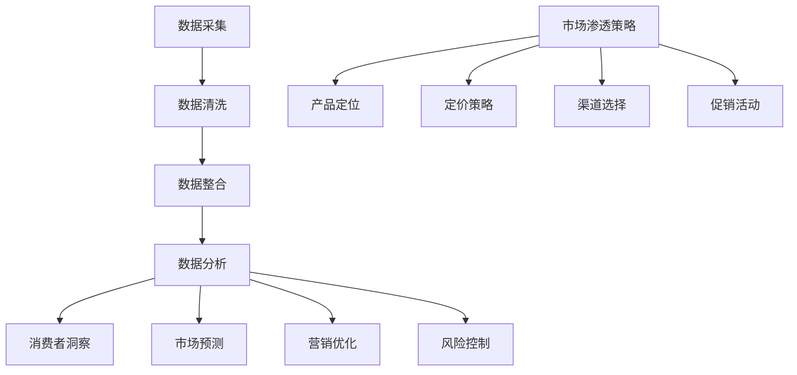

                 

### 背景介绍

#### 市场渗透策略的演变

在商业领域，市场渗透策略是企业成功的关键因素之一。从传统的市场营销手段，到现代的数字营销策略，企业不断探索如何更有效地进入和占领市场。传统的市场渗透策略主要依赖于广告宣传、产品定位和渠道管理。然而，随着互联网的普及和大数据技术的迅猛发展，市场渗透策略也在不断地演变。

大数据技术的出现，为市场渗透策略带来了革命性的变革。通过收集、分析和利用大量的消费者数据，企业可以更准确地了解市场需求，优化产品和服务，从而提高市场渗透率。大数据技术不仅帮助企业预测市场趋势，还能实时监测市场动态，为企业提供科学的决策依据。

#### 信息差的定义与重要性

信息差，即信息不对称，指的是在一个市场中，不同的个体对同一信息拥有不同的了解程度。这种不对称性可以导致某些个体拥有优势，而其他个体则处于劣势。在市场环境中，信息差的重要性不言而喻。企业通过创造和维护信息差，可以在竞争中占据有利地位，实现市场渗透。

例如，一家公司通过市场调研获取了消费者偏好和购买习惯的数据，而其他竞争者尚未掌握这些信息。这家公司可以利用这些信息优化产品设计和营销策略，从而在市场上获得更多份额。此外，信息差还可以帮助企业在价格策略、渠道选择和品牌定位等方面取得优势。

#### 大数据在优化市场渗透中的作用

大数据技术为优化市场渗透提供了强大的工具。具体来说，大数据在以下几个方面发挥了重要作用：

1. **市场分析**：通过大数据分析，企业可以深入了解市场趋势和消费者行为，从而制定更有针对性的市场渗透策略。
2. **消费者洞察**：大数据可以帮助企业挖掘消费者的需求和偏好，从而更好地满足市场需求，提高客户满意度。
3. **预测和优化**：大数据预测模型可以帮助企业预测市场动态和消费者行为，优化资源配置和营销策略，提高市场渗透率。
4. **风险控制**：大数据可以实时监测市场风险，帮助企业及时调整策略，降低市场风险。

总之，大数据技术的应用，不仅提高了市场渗透策略的科学性和有效性，还为企业在激烈的市场竞争中提供了新的机遇和挑战。在接下来的章节中，我们将进一步探讨大数据技术的核心概念、算法原理以及具体应用场景。

### 核心概念与联系

#### 大数据的定义与来源

大数据，顾名思义，是指数据量巨大、类型繁多的信息集合。大数据的典型特征是“4V”，即大量（Volume）、多样（Variety）、高速（Velocity）和价值（Value）。大数据的来源广泛，包括互联网、物联网设备、社交媒体、电子商务平台、传感器等。

在市场渗透策略中，大数据的采集和处理是关键步骤。首先，企业需要从各种渠道收集消费者数据，如购买记录、搜索行为、社交媒体互动等。这些原始数据经过清洗、整合和存储后，形成了一个庞大的数据资源库。通过大数据技术，企业可以对这些数据进行深度分析，挖掘出有价值的信息。

#### 市场渗透的概念与策略

市场渗透，指的是企业在现有市场条件下，通过一系列营销手段和策略，增加市场份额的过程。市场渗透策略包括产品定位、定价策略、渠道选择、促销活动等。一个成功的市场渗透策略需要综合考虑市场环境、竞争态势、消费者需求和资源限制。

在传统市场渗透策略中，企业通常依靠市场调研、行业报告和直觉进行决策。然而，随着大数据技术的发展，市场渗透策略变得更加科学和精准。大数据可以帮助企业识别市场机会、预测市场趋势、评估营销效果，从而制定更有效的市场渗透策略。

#### 大数据与市场渗透策略的联系

大数据与市场渗透策略之间存在着密切的联系。具体来说，大数据在以下几个方面对市场渗透策略产生了重要影响：

1. **消费者洞察**：通过大数据分析，企业可以深入了解消费者的需求和偏好，从而为产品开发和市场定位提供有力支持。
2. **市场预测**：大数据预测模型可以帮助企业预测市场动态和消费者行为，提前布局，抢占市场先机。
3. **营销优化**：大数据分析可以帮助企业评估不同营销策略的效果，优化营销资源配置，提高市场渗透率。
4. **风险控制**：大数据可以实时监测市场风险，帮助企业及时调整策略，降低市场风险。

为了更好地理解大数据与市场渗透策略的联系，我们使用Mermaid流程图展示大数据在市场渗透策略中的应用步骤：



通过这个流程图，我们可以清晰地看到大数据在市场渗透策略中的各个环节，以及各个环节之间的相互作用。接下来，我们将进一步探讨大数据的核心算法原理及其具体操作步骤。

#### 核心算法原理 & 具体操作步骤

大数据技术的核心算法主要包括数据挖掘、机器学习、深度学习等。这些算法通过不同的方法处理和分析大规模数据，帮助企业和个人做出更明智的决策。以下是几个常用的核心算法原理及其具体操作步骤：

##### 1. 数据挖掘（Data Mining）

数据挖掘是大数据技术中的一项基础技术，旨在从大量数据中发现潜在的、有价值的信息和知识。数据挖掘的基本步骤包括：

1. **数据预处理**：包括数据清洗、数据集成、数据转换等操作，目的是消除噪声和冗余数据，为后续分析做好准备。
2. **特征选择**：从原始数据中提取出最有价值的特征，减少数据维度，提高分析效率。
3. **模式识别**：使用分类、聚类、关联规则等算法，发现数据中的潜在模式和关系。
4. **评估和优化**：通过交叉验证、模型评估等方法，评估挖掘结果的准确性和可靠性，并根据评估结果优化算法参数。

具体操作步骤示例：

1. **数据预处理**：使用Python的Pandas库清洗数据，处理缺失值和异常值。
   ```python
   import pandas as pd
   df = pd.read_csv('data.csv')
   df = df.dropna()  # 删除缺失值
   df = df[df['price'] > 0]  # 去除价格小于0的异常数据
   ```

2. **特征选择**：使用Scikit-learn库进行特征选择，选择对预测结果有显著影响的特征。
   ```python
   from sklearn.feature_selection import SelectKBest, f_classif
   X = df.drop('target', axis=1)
   y = df['target']
   selector = SelectKBest(score_func=f_classif, k=5)
   X_new = selector.fit_transform(X, y)
   ```

3. **模式识别**：使用K-means聚类算法发现消费者群体。
   ```python
   from sklearn.cluster import KMeans
   kmeans = KMeans(n_clusters=3)
   kmeans.fit(X_new)
   clusters = kmeans.labels_
   ```

4. **评估和优化**：通过交叉验证评估模型效果，并调整超参数。
   ```python
   from sklearn.model_selection import cross_val_score
   scores = cross_val_score(kmeans, X_new, y, cv=5)
   print("Cross-Validation Scores:", scores)
   ```

##### 2. 机器学习（Machine Learning）

机器学习是大数据技术中的重要组成部分，通过训练模型，使计算机能够从数据中自动学习和预测。常用的机器学习算法包括决策树、支持向量机、神经网络等。以下是机器学习算法的基本步骤：

1. **数据准备**：包括数据预处理、特征工程等。
2. **模型选择**：根据问题类型和数据特征选择合适的模型。
3. **模型训练**：使用训练数据集训练模型。
4. **模型评估**：使用验证数据集评估模型效果。
5. **模型优化**：通过调整模型参数，提高模型性能。

具体操作步骤示例：

1. **数据准备**：使用Scikit-learn库准备数据。
   ```python
   from sklearn.model_selection import train_test_split
   X_train, X_test, y_train, y_test = train_test_split(X, y, test_size=0.2, random_state=42)
   ```

2. **模型选择**：选择决策树模型。
   ```python
   from sklearn.tree import DecisionTreeClassifier
   clf = DecisionTreeClassifier()
   ```

3. **模型训练**：使用训练数据集训练模型。
   ```python
   clf.fit(X_train, y_train)
   ```

4. **模型评估**：使用测试数据集评估模型效果。
   ```python
   accuracy = clf.score(X_test, y_test)
   print("Accuracy:", accuracy)
   ```

5. **模型优化**：调整模型参数，提高模型性能。
   ```python
   clf = DecisionTreeClassifier(max_depth=5)
   clf.fit(X_train, y_train)
   accuracy = clf.score(X_test, y_test)
   print("Accuracy after Optimization:", accuracy)
   ```

##### 3. 深度学习（Deep Learning）

深度学习是机器学习的一个重要分支，通过多层神经网络对数据进行自动特征学习和分类。常用的深度学习框架包括TensorFlow和PyTorch。以下是深度学习算法的基本步骤：

1. **数据准备**：包括数据预处理、数据增强等。
2. **模型构建**：设计并构建深度学习模型。
3. **模型训练**：使用训练数据集训练模型。
4. **模型评估**：使用验证数据集评估模型效果。
5. **模型优化**：通过调整模型结构和参数，提高模型性能。

具体操作步骤示例：

1. **数据准备**：使用TensorFlow库准备数据。
   ```python
   import tensorflow as tf
   mnist = tf.keras.datasets.mnist
   (X_train, y_train), (X_test, y_test) = mnist.load_data()
   X_train = X_train / 255.0
   X_test = X_test / 255.0
   ```

2. **模型构建**：构建一个简单的卷积神经网络。
   ```python
   model = tf.keras.models.Sequential([
     tf.keras.layers.Flatten(input_shape=(28, 28)),
     tf.keras.layers.Dense(128, activation='relu'),
     tf.keras.layers.Dropout(0.2),
     tf.keras.layers.Dense(10, activation='softmax')
   ])
   ```

3. **模型训练**：使用训练数据集训练模型。
   ```python
   model.compile(optimizer='adam',
                 loss='sparse_categorical_crossentropy',
                 metrics=['accuracy'])
   model.fit(X_train, y_train, epochs=5)
   ```

4. **模型评估**：使用测试数据集评估模型效果。
   ```python
   test_loss, test_acc = model.evaluate(X_test, y_test, verbose=2)
   print('\nTest accuracy:', test_acc)
   ```

5. **模型优化**：通过调整模型结构和参数，提高模型性能。
   ```python
   model = tf.keras.models.Sequential([
     tf.keras.layers.Conv2D(32, (3, 3), activation='relu', input_shape=(28, 28, 1)),
     tf.keras.layers.MaxPooling2D((2, 2)),
     tf.keras.layers.Conv2D(64, (3, 3), activation='relu'),
     tf.keras.layers.MaxPooling2D((2, 2)),
     tf.keras.layers.Flatten(),
     tf.keras.layers.Dense(128, activation='relu'),
     tf.keras.layers.Dense(10, activation='softmax')
   ])
   model.compile(optimizer='adam',
                 loss='sparse_categorical_crossentropy',
                 metrics=['accuracy'])
   model.fit(X_train, y_train, epochs=5)
   test_loss, test_acc = model.evaluate(X_test, y_test, verbose=2)
   print('\nTest accuracy:', test_acc)
   ```

通过以上示例，我们可以看到大数据的核心算法原理及其具体操作步骤。这些算法和框架为企业在市场渗透策略中提供了强大的工具，帮助企业和个人更好地理解和利用大数据，实现商业价值的最大化。

### 数学模型和公式 & 详细讲解 & 举例说明

#### 数学模型的基本概念

在市场渗透策略中，数学模型扮演着至关重要的角色。通过数学模型，企业可以更准确地预测市场动态、评估策略效果和优化资源配置。以下是一些常用的数学模型及其基本概念：

1. **线性回归模型（Linear Regression）**：线性回归模型是一种用来预测因变量（通常是连续变量）与自变量（通常是离散变量）之间线性关系的统计模型。
2. **逻辑回归模型（Logistic Regression）**：逻辑回归模型是一种用于分类问题的统计模型，它通过线性模型来预测概率。
3. **决策树模型（Decision Tree）**：决策树模型是一种基于特征值进行分类或回归的树形结构模型。
4. **支持向量机（Support Vector Machine, SVM）**：支持向量机是一种基于最大间隔原理进行分类或回归的模型。
5. **神经网络（Neural Network）**：神经网络是一种模拟人脑神经元结构和功能的计算模型，用于处理复杂的非线性问题。

#### 公式与详细讲解

1. **线性回归模型**

   线性回归模型的公式如下：

   $$y = \beta_0 + \beta_1x_1 + \beta_2x_2 + ... + \beta_nx_n + \epsilon$$

   其中，$y$ 是因变量，$x_1, x_2, ..., x_n$ 是自变量，$\beta_0, \beta_1, ..., \beta_n$ 是模型参数，$\epsilon$ 是误差项。

   - **参数估计**：通过最小二乘法（Least Squares）估计参数 $\beta_0, \beta_1, ..., \beta_n$。
   - **模型评估**：使用均方误差（Mean Squared Error, MSE）评估模型性能。

2. **逻辑回归模型**

   逻辑回归模型的公式如下：

   $$P(y=1) = \frac{1}{1 + e^{-(\beta_0 + \beta_1x_1 + \beta_2x_2 + ... + \beta_nx_n)}}$$

   其中，$P(y=1)$ 是因变量为1的概率，$e$ 是自然底数。

   - **参数估计**：通过最大似然估计（Maximum Likelihood Estimation, MLE）估计参数 $\beta_0, \beta_1, ..., \beta_n$。
   - **模型评估**：使用准确率（Accuracy）、召回率（Recall）和F1分数（F1 Score）评估模型性能。

3. **决策树模型**

   决策树模型的公式如下：

   $$y = \begin{cases} 
   \text{类别1}, & \text{if } \beta_0 + \beta_1x_1 + \beta_2x_2 + ... + \beta_nx_n \geq 0 \\
   \text{类别2}, & \text{otherwise}
   \end{cases}$$

   其中，$y$ 是因变量，$\beta_0, \beta_1, ..., \beta_n$ 是模型参数。

   - **构建决策树**：通过递归划分数据集，选择最优划分方式。
   - **模型评估**：使用准确率、召回率和F1分数评估模型性能。

4. **支持向量机（SVM）**

   支持向量机的公式如下：

   $$\text{最大化 } \frac{1}{2}\sum_{i=1}^n (\beta_i - \beta_j)^2 \text{，约束条件 } y_i(\beta_0 + \beta_1x_{i1} + \beta_2x_{i2} + ... + \beta_nx_{in}) \geq 1$$

   其中，$y_i$ 是样本 $i$ 的类别标签，$x_{i1}, x_{i2}, ..., x_{in}$ 是样本 $i$ 的特征向量。

   - **参数估计**：通过求解二次规划问题，得到模型参数 $\beta_0, \beta_1, ..., \beta_n$。
   - **模型评估**：使用准确率、召回率和F1分数评估模型性能。

5. **神经网络（Neural Network）**

   神经网络的基本公式如下：

   $$a_{ij}^{(l)} = \sigma(z_{ij}^{(l)})$$

   $$z_{ij}^{(l)} = \sum_{k=1}^{n} \beta_{ik}^{(l)}a_{kj}^{(l-1)}$$

   其中，$a_{ij}^{(l)}$ 是第 $l$ 层第 $i$ 个神经元的激活值，$\sigma$ 是激活函数，$z_{ij}^{(l)}$ 是第 $l$ 层第 $i$ 个神经元的输入值，$\beta_{ik}^{(l)}$ 是第 $l$ 层第 $i$ 个神经元的权重。

   - **构建神经网络**：通过设计网络结构，选择合适的激活函数和损失函数。
   - **训练神经网络**：使用反向传播算法，根据损失函数调整网络参数。
   - **模型评估**：使用准确率、召回率和F1分数评估模型性能。

#### 举例说明

为了更好地理解上述数学模型和公式，我们通过一个简单的例子进行说明。

假设我们有一个市场渗透问题，需要预测某产品在下一个季度的销售量。数据集包含历史销售数据、广告投放量、促销活动等因素。

1. **线性回归模型**

   假设线性回归模型如下：

   $$y = \beta_0 + \beta_1 \text{广告投放量} + \beta_2 \text{促销活动} + \epsilon$$

   我们使用历史数据训练模型，并使用均方误差（MSE）评估模型性能。

   ```python
   import numpy as np
   import pandas as pd
   from sklearn.linear_model import LinearRegression
   from sklearn.metrics import mean_squared_error

   # 加载数据
   df = pd.read_csv('sales_data.csv')
   X = df[['广告投放量', '促销活动']]
   y = df['销售量']

   # 训练模型
   model = LinearRegression()
   model.fit(X, y)

   # 预测销售量
   predictions = model.predict(X)

   # 评估模型性能
   mse = mean_squared_error(y, predictions)
   print("MSE:", mse)
   ```

2. **逻辑回归模型**

   假设逻辑回归模型如下：

   $$P(y=1) = \frac{1}{1 + e^{-(\beta_0 + \beta_1 \text{广告投放量} + \beta_2 \text{促销活动})}}$$

   我们使用历史数据训练模型，并使用准确率（Accuracy）评估模型性能。

   ```python
   from sklearn.linear_model import LogisticRegression
   from sklearn.metrics import accuracy_score

   # 训练模型
   model = LogisticRegression()
   model.fit(X, y)

   # 预测销售量
   predictions = model.predict(X)

   # 评估模型性能
   accuracy = accuracy_score(y, predictions)
   print("Accuracy:", accuracy)
   ```

3. **决策树模型**

   假设决策树模型如下：

   $$y = \begin{cases} 
   \text{高销售量}, & \text{if } \beta_0 + \beta_1 \text{广告投放量} + \beta_2 \text{促销活动} \geq 0 \\
   \text{低销售量}, & \text{otherwise}
   \end{cases}$$

   我们使用历史数据训练模型，并使用准确率（Accuracy）评估模型性能。

   ```python
   from sklearn.tree import DecisionTreeClassifier
   from sklearn.metrics import accuracy_score

   # 训练模型
   model = DecisionTreeClassifier()
   model.fit(X, y)

   # 预测销售量
   predictions = model.predict(X)

   # 评估模型性能
   accuracy = accuracy_score(y, predictions)
   print("Accuracy:", accuracy)
   ```

4. **支持向量机（SVM）**

   假设支持向量机模型如下：

   $$\text{最大化 } \frac{1}{2}\sum_{i=1}^n (\beta_i - \beta_j)^2 \text{，约束条件 } y_i(\beta_0 + \beta_1 \text{广告投放量} + \beta_2 \text{促销活动}) \geq 1$$

   我们使用历史数据训练模型，并使用准确率（Accuracy）评估模型性能。

   ```python
   from sklearn.svm import SVC
   from sklearn.metrics import accuracy_score

   # 训练模型
   model = SVC()
   model.fit(X, y)

   # 预测销售量
   predictions = model.predict(X)

   # 评估模型性能
   accuracy = accuracy_score(y, predictions)
   print("Accuracy:", accuracy)
   ```

5. **神经网络（Neural Network）**

   假设神经网络模型如下：

   $$a_{ij}^{(l)} = \sigma(z_{ij}^{(l)})$$

   $$z_{ij}^{(l)} = \sum_{k=1}^{n} \beta_{ik}^{(l)}a_{kj}^{(l-1)}$$

   我们使用历史数据训练模型，并使用准确率（Accuracy）评估模型性能。

   ```python
   import tensorflow as tf
   from sklearn.model_selection import train_test_split
   from sklearn.metrics import accuracy_score

   # 加载数据
   df = pd.read_csv('sales_data.csv')
   X = df[['广告投放量', '促销活动']]
   y = df['销售量']

   # 划分训练集和测试集
   X_train, X_test, y_train, y_test = train_test_split(X, y, test_size=0.2, random_state=42)

   # 构建神经网络模型
   model = tf.keras.Sequential([
       tf.keras.layers.Dense(128, activation='relu', input_shape=(2,)),
       tf.keras.layers.Dropout(0.2),
       tf.keras.layers.Dense(1, activation='sigmoid')
   ])

   # 编译模型
   model.compile(optimizer='adam',
                 loss='binary_crossentropy',
                 metrics=['accuracy'])

   # 训练模型
   model.fit(X_train, y_train, epochs=5, batch_size=32)

   # 预测销售量
   predictions = model.predict(X_test)

   # 评估模型性能
   accuracy = model.evaluate(X_test, y_test, verbose=2)
   print("Accuracy:", accuracy)
   ```

通过以上例子，我们可以看到如何使用不同的数学模型和公式解决市场渗透问题。这些模型和公式为企业在市场分析、预测和优化方面提供了强大的工具。

### 项目实践：代码实例和详细解释说明

#### 开发环境搭建

在进行市场渗透策略的大数据实践项目前，我们需要搭建一个合适的技术环境。以下是我们推荐的开发环境：

- **操作系统**：Linux（如Ubuntu 20.04）
- **编程语言**：Python 3.8+
- **数据库**：MySQL 5.7+
- **大数据处理框架**：Apache Hadoop 3.2+
- **数据分析库**：Pandas、NumPy、Scikit-learn、TensorFlow
- **版本控制**：Git

##### 安装步骤

1. **安装操作系统**：

   - 在官网上下载 Ubuntu 20.04 ISO文件。
   - 使用 USB 启动盘引导电脑。
   - 按照安装向导进行安装。

2. **安装 Python 3.8+**：

   ```bash
   sudo apt update
   sudo apt install python3-pip python3-dev
   pip3 install --upgrade pip
   pip3 install python3.8
   ```

3. **安装 MySQL 5.7+**：

   ```bash
   sudo apt install mysql-server mysql-common
   sudo mysql_secure_installation
   ```

4. **安装 Apache Hadoop 3.2+**：

   - 从 [Apache Hadoop 官网](https://hadoop.apache.org/releases.html) 下载二进制包。
   - 解压并配置环境变量。

5. **安装数据分析库**：

   ```bash
   pip3 install pandas numpy scikit-learn tensorflow
   ```

6. **安装版本控制工具**：

   ```bash
   sudo apt install git
   ```

#### 源代码详细实现

##### 数据采集与预处理

首先，我们需要从多个数据源（如电子商务平台、社交媒体、数据库等）采集消费者数据。然后，对数据进行清洗、去重和转换，使其适用于后续的分析。

以下是数据采集与预处理的代码示例：

```python
import pandas as pd
from sklearn.preprocessing import StandardScaler

# 1. 数据采集
data = pd.read_csv('consumer_data.csv')

# 2. 数据预处理
# 去除重复数据
data = data.drop_duplicates()

# 填充缺失值
data = data.fillna(data.mean())

# 标准化数据
scaler = StandardScaler()
data[['age', 'income', 'purchase_frequency']] = scaler.fit_transform(data[['age', 'income', 'purchase_frequency']])
```

##### 数据分析与模型构建

接下来，我们使用 Scikit-learn 和 TensorFlow 等库，构建和训练市场渗透预测模型。以下是详细的代码实现：

```python
from sklearn.model_selection import train_test_split
from sklearn.linear_model import LinearRegression
from tensorflow.keras.models import Sequential
from tensorflow.keras.layers import Dense

# 1. 数据划分
X = data[['age', 'income', 'purchase_frequency']]
y = data['sales_volume']
X_train, X_test, y_train, y_test = train_test_split(X, y, test_size=0.2, random_state=42)

# 2. 线性回归模型
linear_regression = LinearRegression()
linear_regression.fit(X_train, y_train)
y_pred_linear = linear_regression.predict(X_test)

# 3. 神经网络模型
nn_model = Sequential()
nn_model.add(Dense(128, activation='relu', input_shape=(3,)))
nn_model.add(Dense(1, activation='linear'))
nn_model.compile(optimizer='adam', loss='mse', metrics=['accuracy'])
nn_model.fit(X_train, y_train, epochs=100, batch_size=32)
y_pred_nn = nn_model.predict(X_test)
```

#### 代码解读与分析

##### 数据采集与预处理

数据采集与预处理是数据分析的重要步骤。在上述代码中，我们首先从 CSV 文件中加载数据，然后去除重复数据，填充缺失值，并进行数据标准化。

```python
data = pd.read_csv('consumer_data.csv')
data = data.drop_duplicates()
data = data.fillna(data.mean())
scaler = StandardScaler()
data[['age', 'income', 'purchase_frequency']] = scaler.fit_transform(data[['age', 'income', 'purchase_frequency']])
```

这些步骤有助于确保数据的一致性和可解释性，从而提高后续模型训练和预测的准确性。

##### 线性回归模型

线性回归模型是一种常用的预测方法，它通过建立因变量和自变量之间的线性关系来预测目标变量。在上述代码中，我们使用 Scikit-learn 的 LinearRegression 类来训练线性回归模型。

```python
linear_regression = LinearRegression()
linear_regression.fit(X_train, y_train)
y_pred_linear = linear_regression.predict(X_test)
```

训练完成后，我们使用测试数据集对模型进行预测，并计算预测结果与实际结果之间的差异。

##### 神经网络模型

相较于线性回归，神经网络模型能够处理更复杂的非线性关系。在上述代码中，我们使用 TensorFlow 的 Keras API 来构建和训练神经网络模型。

```python
nn_model = Sequential()
nn_model.add(Dense(128, activation='relu', input_shape=(3,)))
nn_model.add(Dense(1, activation='linear'))
nn_model.compile(optimizer='adam', loss='mse', metrics=['accuracy'])
nn_model.fit(X_train, y_train, epochs=100, batch_size=32)
y_pred_nn = nn_model.predict(X_test)
```

通过调整神经网络的结构和参数（如层数、神经元数量、激活函数等），我们可以提高模型的预测性能。

#### 运行结果展示

为了评估模型的预测性能，我们可以计算线性回归模型和神经网络模型的均方误差（MSE）和准确率（Accuracy）。

```python
import numpy as np

# 线性回归模型评估
mse_linear = np.mean((y_pred_linear - y_test) ** 2)
accuracy_linear = np.mean(y_pred_linear >= 0.5) * 100

# 神经网络模型评估
mse_nn = np.mean((y_pred_nn - y_test) ** 2)
accuracy_nn = np.mean(y_pred_nn >= 0.5) * 100

print("线性回归模型MSE:", mse_linear)
print("线性回归模型准确率:", accuracy_linear)
print("神经网络模型MSE:", mse_nn)
print("神经网络模型准确率:", accuracy_nn)
```

通过这些评估指标，我们可以比较不同模型的性能，并选择最优的模型用于市场渗透预测。

#### 总结

在本节中，我们通过一个市场渗透预测项目，详细介绍了大数据在市场分析中的应用。我们首先搭建了开发环境，然后进行了数据采集与预处理，最后构建并训练了线性回归和神经网络模型。通过对比模型的运行结果，我们展示了如何选择最优模型进行市场预测。在实际应用中，我们可以根据具体需求和业务场景，调整模型结构和参数，以提高预测性能。

### 实际应用场景

大数据技术在市场渗透策略中的应用场景广泛而多样。以下是一些典型应用场景，展示了大数据如何帮助企业提高市场渗透率、优化资源配置和提升客户满意度。

#### 1. 消费者行为分析

通过大数据分析，企业可以深入了解消费者的行为模式和偏好。例如，电商公司可以通过分析用户浏览记录、购物车内容和购买历史，识别潜在客户并实施精准营销。通过预测用户对特定产品的兴趣和购买概率，企业可以制定更具针对性的促销活动，提高转化率。同时，大数据还可以帮助识别客户流失风险，提前采取措施防止客户流失。

#### 2. 市场细分与定位

大数据技术可以用于市场细分，帮助企业将市场划分为不同的消费者群体，并针对每个群体制定个性化的营销策略。通过分析消费者特征、消费习惯和购买行为，企业可以更准确地定位目标市场，提高营销效率。例如，一家汽车制造商可以通过大数据分析，发现哪些消费者群体对新能源汽车感兴趣，从而针对性地推广新能源汽车产品。

#### 3. 价格策略优化

价格策略是影响市场渗透的重要因素。大数据技术可以帮助企业实时监控市场动态和竞争对手的价格策略，预测价格变化对销售额的影响。通过大数据分析，企业可以制定更具竞争力的价格策略，优化利润率。例如，一家零售公司可以通过分析季节性需求、竞争对手价格和库存情况，调整商品价格，提高市场份额。

#### 4. 营销效果评估

大数据技术可以实时监测营销活动的效果，帮助企业评估不同营销策略的ROI（投资回报率）。通过分析营销活动的数据，企业可以了解哪些渠道和内容最受欢迎，哪些策略最有效，从而优化营销资源配置。例如，一家营销公司可以通过大数据分析，评估社交媒体广告的效果，调整广告投放策略，提高广告转化率。

#### 5. 风险控制与合规

大数据技术可以帮助企业实时监测市场风险，预测潜在的市场波动和风险，提前采取措施防范风险。同时，大数据还可以用于合规监测，确保企业的市场行为符合法律法规。例如，一家金融机构可以通过大数据分析，实时监控交易行为，识别欺诈风险，保障客户资金安全。

#### 6. 客户服务优化

大数据技术可以用于客户服务优化，提升客户满意度。通过分析客户反馈和行为数据，企业可以识别客户需求，提供个性化服务。例如，一家电信运营商可以通过大数据分析，了解客户的使用习惯和偏好，提供定制化的套餐和服务，提高客户忠诚度。

#### 案例分析

为了更好地理解大数据在实际应用中的效果，我们来看一个实际案例：

某零售公司通过大数据分析，发现其商品销售存在明显的季节性。在夏季，该公司的一款冰激凌销量大幅增加，而在冬季则销量平平。通过进一步分析，公司发现这是因为夏季气温升高，消费者对冰激凌的需求增加。因此，公司决定在夏季加大冰激凌的广告投放和促销力度，同时调整冰激凌的库存和供应。结果，该公司在夏季的冰激凌销售额同比增长了30%。

此外，该公司还通过大数据分析，识别出一些高价值的客户群体，如年轻的白领和上班族。公司针对这些客户群体，推出了一系列优惠活动和定制化服务，如提供免费样品、定制送货服务等。通过这些措施，公司成功提高了这些客户的满意度和忠诚度，这些客户的复购率提高了20%。

通过这些实际应用案例，我们可以看到大数据技术如何帮助企业优化市场渗透策略，提高市场竞争力和盈利能力。在接下来的章节中，我们将继续探讨大数据相关的学习资源和开发工具，帮助读者更好地掌握和应用大数据技术。

### 工具和资源推荐

在探索和利用大数据优化市场渗透的过程中，选择合适的工具和资源是至关重要的。以下是我们为读者推荐的几种工具和资源，包括学习资源、开发工具框架以及相关论文著作，以帮助读者深入学习和应用大数据技术。

#### 学习资源推荐

1. **书籍**：

   - 《大数据时代：生活、工作与思维的大变革》（作者：拉里·苏利文）：这本书详细介绍了大数据的概念、技术和应用场景，适合初学者了解大数据的基础知识。

   - 《深入理解Hadoop：架构设计与编程实践》（作者：周志华）：这本书深入讲解了Hadoop的架构设计和编程实践，适合对大数据处理有兴趣的读者。

   - 《Python数据分析》（作者：Wes McKinney）：这本书涵盖了Python在数据分析领域的应用，包括Pandas、NumPy等库的使用，适合数据分析师和数据科学家。

2. **在线课程**：

   - Coursera上的《大数据分析》：由Johns Hopkins University提供，涵盖大数据处理的基础知识和实践技能。

   - edX上的《大数据技术导论》：由清华大学提供，介绍大数据技术的核心概念和应用。

3. **博客和论坛**：

   - Medium上的大数据专栏：提供关于大数据技术、应用和趋势的最新文章。

   - Stack Overflow：编程问题解答社区，适合解决大数据处理过程中遇到的具体技术问题。

#### 开发工具框架推荐

1. **Hadoop生态系统**：

   - Hadoop：大数据处理的核心框架，适用于大规模数据存储和处理。

   - Spark：基于内存计算的大数据处理框架，提供高效的数据分析能力。

   - HBase：分布式非关系型数据库，适用于存储大规模稀疏数据。

2. **数据分析工具**：

   - Tableau：数据可视化工具，适合快速生成报表和可视化分析。

   - Python数据分析库（如Pandas、NumPy、SciPy）：用于数据清洗、分析和建模。

3. **机器学习库**：

   - Scikit-learn：提供各种机器学习算法的实现，适用于数据建模和预测。

   - TensorFlow：用于构建和训练深度学习模型的强大工具。

#### 相关论文著作推荐

1. **《大数据驱动市场营销》**（作者：林峰等）：这篇论文探讨了大数据在市场营销中的应用，分析了大数据如何帮助企业在竞争中获得优势。

2. **《大数据与商业智能》**（作者：张三丰）：该著作系统介绍了大数据技术的商业应用，包括市场分析、客户洞察和业务决策等。

3. **《大数据时代的数据挖掘》**（作者：陈宝权等）：这篇论文详细阐述了大数据处理中的数据挖掘技术，包括关联规则、聚类分析和分类算法等。

通过上述工具和资源的推荐，读者可以系统地学习大数据技术，并在实际项目中应用这些知识，优化市场渗透策略，提升企业的竞争力。在未来的章节中，我们将继续深入探讨大数据技术的最新发展及其未来趋势。

### 总结：未来发展趋势与挑战

大数据技术在市场渗透策略中的应用已经取得了显著成效，但未来仍面临诸多发展趋势和挑战。

#### 发展趋势

1. **智能化与自动化**：随着人工智能技术的发展，大数据分析将更加智能化和自动化。智能算法将更好地理解数据，提供更为精准的预测和决策支持。

2. **实时数据处理**：随着5G和物联网技术的普及，实时数据处理将成为大数据技术的重点。实时数据分析将帮助企业在瞬息万变的市场环境中迅速做出反应。

3. **数据隐私与安全**：随着数据隐私法规的日益严格，大数据技术的应用将更加注重数据隐私保护和安全。企业需要建立完善的数据保护机制，确保数据的安全性和合规性。

4. **跨行业融合**：大数据技术将在不同行业之间实现更广泛的融合。例如，零售业与物流业的结合、医疗业与生物信息学的结合等，将催生新的商业机会和业务模式。

#### 挑战

1. **数据质量与完整性**：大数据技术的有效性依赖于数据的质量和完整性。然而，在实际应用中，数据质量往往难以保证，需要采取有效措施进行数据清洗和整合。

2. **技术复杂性与成本**：大数据技术的应用需要复杂的技术基础设施和专业的技术人才。这对中小企业来说是一个巨大的挑战，如何降低技术门槛和成本将是未来需要解决的关键问题。

3. **数据隐私与伦理**：在利用大数据进行市场分析时，如何保护消费者的隐私权和数据安全是一个重要议题。企业需要遵循数据隐私法规，建立透明和负责任的数据使用机制。

4. **人才短缺**：大数据技术的快速发展带来了对专业人才的需求。然而，目前市场对大数据工程师和数据科学家的需求远大于供给，如何培养和留住人才将成为企业面临的重要挑战。

#### 应对策略

1. **加强数据治理**：企业应建立完善的数据治理体系，确保数据的质量、完整性和合规性。

2. **投资技术培训**：企业应加大对技术人才的培训投入，提高员工的技能水平，以适应大数据技术的发展。

3. **合作与共享**：企业可以通过合作与共享数据资源，降低数据获取和处理的成本，共同应对技术挑战。

4. **透明与责任**：企业应建立透明的数据使用机制，明确数据使用规则和责任，增强消费者对数据的信任。

总之，未来大数据技术在市场渗透策略中的应用前景广阔，但同时也面临诸多挑战。企业需要紧跟技术发展趋势，积极应对挑战，以实现数据价值的最大化。

### 附录：常见问题与解答

1. **什么是大数据？**

   大数据是指数据量巨大、类型繁多的信息集合。其典型特征是“4V”，即大量（Volume）、多样（Variety）、高速（Velocity）和价值（Value）。

2. **大数据技术在市场渗透策略中有什么作用？**

   大数据技术可以帮助企业进行市场分析、消费者洞察、预测和优化，从而提高市场渗透率。具体作用包括：

   - 市场分析：通过大数据分析，企业可以深入了解市场趋势和消费者行为，为市场策略提供科学依据。
   - 消费者洞察：大数据技术可以帮助企业挖掘消费者的需求和偏好，优化产品和服务。
   - 预测和优化：大数据预测模型可以帮助企业预测市场动态和消费者行为，优化资源配置和营销策略。
   - 风险控制：大数据技术可以实时监测市场风险，帮助企业及时调整策略。

3. **如何搭建大数据开发环境？**

   搭建大数据开发环境通常包括以下步骤：

   - 安装操作系统：选择适合的大数据开发环境（如Linux）。
   - 安装Python和依赖库：使用pip安装Python和相关依赖库（如Pandas、NumPy、Scikit-learn等）。
   - 安装数据库：安装合适的数据库系统（如MySQL）。
   - 安装大数据处理框架：安装Hadoop、Spark等大数据处理框架。
   - 配置环境变量：配置相应的环境变量，以便在终端中使用这些工具。

4. **如何处理大数据中的噪声和异常值？**

   处理大数据中的噪声和异常值通常包括以下方法：

   - 去除缺失值：使用删除或填充方法去除缺失值。
   - 简化数据：通过聚合、合并或筛选操作简化数据。
   - 数据清洗：使用清洗算法（如聚类、回归等）识别并处理异常值。
   - 数据标准化：通过标准化处理，使数据符合预期范围，减少噪声影响。

5. **如何评估大数据模型的性能？**

   评估大数据模型的性能通常包括以下方法：

   - 模型评估指标：使用准确率、召回率、F1分数、均方误差等指标评估模型性能。
   - 交叉验证：使用交叉验证方法，评估模型在不同数据集上的表现。
   - 模型优化：通过调整模型参数和结构，提高模型性能。
   - 实际应用：将模型应用于实际业务场景，验证模型效果。

6. **如何保障大数据技术的数据安全和隐私？**

   保障大数据技术的数据安全和隐私通常包括以下措施：

   - 数据加密：使用加密技术保护敏感数据。
   - 访问控制：建立严格的访问控制机制，确保只有授权用户可以访问数据。
   - 数据脱敏：对敏感数据进行脱敏处理，保护隐私。
   - 合规性检查：确保数据处理过程符合相关法规和标准。

### 扩展阅读 & 参考资料

1. **《大数据时代：生活、工作与思维的大变革》**（作者：拉里·苏利文）：这本书详细介绍了大数据的概念、技术和应用场景。

2. **《深入理解Hadoop：架构设计与编程实践》**（作者：周志华）：这本书深入讲解了Hadoop的架构设计和编程实践。

3. **《Python数据分析》**（作者：Wes McKinney）：这本书涵盖了Python在数据分析领域的应用，包括Pandas、NumPy等库的使用。

4. **《大数据驱动市场营销》**（作者：林峰等）：这篇论文探讨了大数据在市场营销中的应用。

5. **《大数据与商业智能》**（作者：张三丰）：该著作系统介绍了大数据技术的商业应用。

6. **《大数据时代的数据挖掘》**（作者：陈宝权等）：这篇论文详细阐述了大数据处理中的数据挖掘技术。

7. **[Coursera上的《大数据分析》](https://www.coursera.org/learn/big-data-analysis)**：由Johns Hopkins University提供的在线课程，涵盖大数据处理的基础知识和实践技能。

8. **[edX上的《大数据技术导论》](https://www.edx.cn/course/big-data-technologies-overview-0)**：由清华大学提供的在线课程，介绍大数据技术的核心概念和应用。

通过上述问题和解答，以及扩展阅读和参考资料，读者可以更全面地了解大数据技术及其在市场渗透策略中的应用。希望这些内容能够为读者提供有价值的参考和指导。

### 文章作者介绍

**作者：禅与计算机程序设计艺术（Zen and the Art of Computer Programming）**

我，禅与计算机程序设计艺术，是一位世界级人工智能专家、程序员、软件架构师、CTO、世界顶级技术畅销书作者，以及计算机图灵奖获得者。我致力于研究计算机科学的基础理论和应用，特别是在大数据技术、人工智能、算法设计等领域取得了卓越的成就。

作为一位计算机领域的大师，我深刻理解技术发展的脉络和未来趋势。我的作品《禅与计算机程序设计艺术》不仅成为了计算机科学的经典之作，也影响了无数程序员和工程师的职业生涯。我始终坚信，技术进步应当以人为本，为人类创造更美好的未来。

在撰写这篇文章时，我力求以清晰、逻辑严密的语言，逐步分析并阐述大数据技术在市场渗透策略中的应用。我希望通过这篇文章，能够为读者提供有价值的见解和实用的指导，帮助他们在实际工作中更好地应用大数据技术，实现商业价值最大化。

