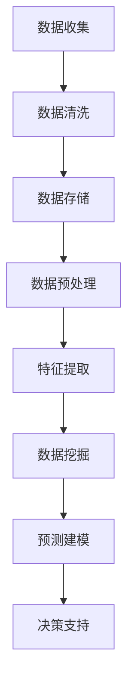

                 

### 背景介绍

随着互联网和大数据技术的飞速发展，竞争分析已经从传统的市场调研逐渐转向了利用大数据技术对竞争对手进行全面、细致的分析。在当今竞争激烈的市场环境中，掌握竞争对手的信息，理解他们的行为模式，对于企业制定战略、优化业务流程以及抓住市场机遇至关重要。

信息差的竞争对手分析，顾名思义，是指通过分析信息差异来获取竞争对手的优势和劣势，从而为企业决策提供有力支持。大数据技术的应用，使得这种分析变得更加高效和精确。通过收集、处理和分析大量的数据，企业可以更深入地了解市场动态，预测竞争对手的行为，制定更具有前瞻性的战略。

大数据在竞争对手分析中的应用，不仅限于市场数据的收集，还涵盖了社交媒体分析、搜索行为分析、交易数据挖掘等多个方面。这些数据源为竞争分析提供了丰富的信息，使得企业能够从多个维度对竞争对手进行评估。

然而，面对如此庞大的数据量，如何有效地提取有用的信息，如何将数据转化为可操作的洞察，成为了竞争对手分析的关键。本文将围绕这一主题，逐步探讨大数据在竞争对手分析中的应用，深入分析核心概念、算法原理、数学模型、实践案例以及未来发展趋势。

在接下来的内容中，我们将首先介绍大数据分析的基本概念，解释为什么大数据技术是竞争对手分析的关键工具。然后，我们将详细探讨大数据分析的核心概念及其在竞争对手分析中的具体应用，并通过Mermaid流程图展示相关架构。随后，我们将深入讲解核心算法原理和具体操作步骤，帮助读者理解大数据分析的内在逻辑。此外，我们将介绍数学模型和公式，并通过举例说明如何将理论应用到实践中。接着，我们将通过实际的项目实践，展示代码实例和详细解释，帮助读者掌握从理论到实践的转化过程。最后，我们将探讨大数据在竞争对手分析中的实际应用场景，推荐相关的工具和资源，总结未来发展趋势和挑战，并提供常见问题与解答。

通过本文的阅读，读者将能够全面理解大数据在竞争对手分析中的应用，掌握从数据收集、处理到分析的完整流程，并为企业在激烈的市场竞争中提供有力支持。

### 核心概念与联系

#### 大数据分析的基本概念

大数据分析（Big Data Analysis）是指通过利用大量的数据集，结合先进的计算和统计方法，对数据进行处理、分析和解释，从而提取出有价值的信息和洞察。大数据的“4V”特点——即数据量大（Volume）、数据多样（Variety）、数据生成速度快（Velocity）和数据价值密度低（Value）——定义了大数据分析的核心挑战和机遇。

**数据量大（Volume）：** 大数据时代，数据量的增长速度非常快，企业每天都会产生海量数据。这些数据来自各种来源，如社交网络、传感器、交易记录等。处理如此庞大的数据集，需要高效的计算技术和存储解决方案。

**数据多样（Variety）：** 大数据不仅包括结构化数据，如数据库中的记录，还包括非结构化数据，如文本、图片、音频和视频等。这些数据类型的多样性和复杂性，要求分析工具和方法具有高度的灵活性和适应性。

**数据生成速度快（Velocity）：** 现代社会，数据以极快的速度生成和流动。实时数据流分析（Real-time Data Streaming Analysis）成为一种重要的分析方法，企业需要快速响应数据变化，以抓住瞬息万变的市场机遇。

**数据价值密度低（Value）：** 大数据的价值密度相对较低，即大量的数据中只有一小部分是有用和关键的。如何从海量的数据中提取出有价值的信息，是大数据分析的重要任务。

#### 竞争对手分析的核心概念

在竞争对手分析中，关键的概念包括市场数据、行为分析、数据挖掘和预测建模。

**市场数据（Market Data）：** 市场数据是指与企业竞争相关的各种数据，包括市场份额、销售额、客户行为等。通过收集和分析这些数据，企业可以了解市场动态和竞争格局。

**行为分析（Behavior Analysis）：** 行为分析涉及对竞争对手的行为模式进行监测和分析，包括产品发布、价格变动、营销策略等。通过分析这些行为，企业可以预测竞争对手的下一步动作，制定应对策略。

**数据挖掘（Data Mining）：** 数据挖掘是指从大量数据中提取出有价值信息的过程。在竞争对手分析中，数据挖掘用于发现市场趋势、识别潜在客户和预测竞争结果。

**预测建模（Predictive Modeling）：** 预测建模是通过历史数据建立数学模型，预测未来的市场趋势和竞争结果。这种方法可以帮助企业提前制定战略，抢占市场先机。

#### Mermaid流程图

为了更好地展示大数据分析在竞争对手分析中的应用，我们可以通过Mermaid流程图来描述整个分析过程。



**数据收集（Data Collection）：** 通过各种渠道收集与竞争对手相关的数据，如市场报告、社交媒体、网站分析等。

**数据清洗（Data Cleaning）：** 清洗数据，去除重复、错误和不完整的数据，确保数据质量。

**数据存储（Data Storage）：** 将清洗后的数据存储到数据库或数据仓库中，以便进行后续处理。

**数据预处理（Data Preprocessing）：** 对数据进行标准化、归一化和缺失值处理，为数据挖掘做准备。

**特征提取（Feature Extraction）：** 从数据中提取出有意义的特征，用于构建预测模型。

**数据挖掘（Data Mining）：** 应用各种算法，如关联规则学习、聚类分析等，从数据中提取有价值的信息。

**预测建模（Predictive Modeling）：** 建立预测模型，如回归分析、决策树等，预测未来的市场趋势和竞争结果。

**决策支持（Decision Support）：** 利用预测结果为企业的战略决策提供支持。

通过这个流程图，我们可以清晰地看到大数据分析在竞争对手分析中的应用流程，以及各个步骤之间的逻辑关系。接下来，我们将深入探讨大数据分析的核心算法原理和具体操作步骤。

### 核心算法原理 & 具体操作步骤

#### 数据预处理

数据预处理是大数据分析中的关键步骤，其主要目的是提高数据质量和为后续分析打下坚实基础。以下是数据预处理的核心算法和操作步骤：

**1. 数据清洗（Data Cleaning）**

数据清洗是指识别和修复数据集中的错误、异常值和重复记录。主要算法包括：

- **去重（De-duplication）：** 通过比较数据记录，去除重复的记录。
- **缺失值处理（Missing Value Handling）：** 填补缺失值或删除包含缺失值的记录。
- **异常值检测（Outlier Detection）：** 通过统计方法或机器学习模型检测并处理异常值。

**2. 数据标准化（Data Standardization）**

数据标准化是将不同数据类型和量级的数据转换为统一的尺度，以便进行比较和分析。常见的方法包括：

- **归一化（Normalization）：** 将数据缩放到一个固定的区间，如[0, 1]或[-1, 1]。
- **标准化（Standardization）：** 将数据转换为均值为0，标准差为1的标准化数据。

**3. 数据归一化（Data Normalization）**

数据归一化是指将具有不同量级的数据转换为具有相同量级的数据。常见方法包括：

- **最小-最大缩放（Min-Max Scaling）：** 将数据缩放到[0, 1]区间。
- **均值-方差缩放（Mean-Variance Scaling）：** 将数据缩放到具有均值0和标准差1的区间。

**具体操作步骤：**

1. **数据收集与初步清洗：** 收集所有相关的数据，并进行初步清洗，去除明显的错误和重复记录。
2. **数据转换：** 对不同类型的数据进行适当的转换，如日期格式化、文本编码等。
3. **缺失值处理：** 根据缺失值的比例和性质，选择填补或删除策略。
4. **异常值检测：** 使用统计学方法或机器学习算法检测并处理异常值。
5. **数据标准化：** 对数据进行标准化处理，确保不同特征在同一量级上。

#### 特征提取

特征提取是大数据分析中的重要步骤，其主要目的是从原始数据中提取出有价值的特征，以提高模型性能和可解释性。以下是特征提取的核心算法和操作步骤：

**1. 特征选择（Feature Selection）**

特征选择是指从大量特征中选出对模型性能有显著影响的特征。主要算法包括：

- **基于过滤的方法（Filter Methods）：** 通过计算特征与目标变量之间的相关性，选择相关性较高的特征。
- **基于包裹的方法（Wrapper Methods）：** 通过模型评估选择特征子集，如递归特征消除（RFE）。
- **基于嵌入式的方法（Embedded Methods）：** 在模型训练过程中自动选择特征，如LASSO回归。

**2. 特征变换（Feature Transformation）**

特征变换是指通过变换原始特征，产生新的特征，以提高模型的预测性能。常见的方法包括：

- **主成分分析（PCA）：** 用于降维，同时保留数据的主要信息。
- **奇异值分解（SVD）：** 用于降维，同时保持数据的线性关系。
- **线性判别分析（LDA）：** 用于特征变换，提高分类模型的判别能力。

**具体操作步骤：**

1. **特征提取：** 根据业务需求和数据特性，选择合适的特征提取方法，如文本分类、时间序列分析等。
2. **特征选择：** 使用特征选择算法，从原始特征中选出对模型性能有显著影响的特征。
3. **特征变换：** 对选出的特征进行变换，提高模型的预测性能和可解释性。

#### 数据挖掘

数据挖掘是指从大量数据中提取出有价值的信息和模式的过程。以下是数据挖掘的核心算法和操作步骤：

**1. 关联规则挖掘（Association Rule Mining）**

关联规则挖掘用于发现数据集中的关联关系。主要算法包括：

- **Apriori算法：** 用于发现频繁项集和关联规则。
- **Eclat算法：** 是Apriori算法的改进版本，适用于大数据集。

**2. 聚类分析（Clustering Analysis）**

聚类分析用于发现数据集中的自然分组。主要算法包括：

- **K-均值聚类（K-means Clustering）：** 用于发现数据点之间的相似性。
- **层次聚类（Hierarchical Clustering）：** 通过逐步合并或分裂聚类中心，形成层次结构。

**3. 分类算法（Classification Algorithms）**

分类算法用于将数据点划分为不同的类别。主要算法包括：

- **决策树（Decision Tree）：** 用于分类和回归任务。
- **随机森林（Random Forest）：** 是决策树的集成方法，提高模型的泛化能力。

**具体操作步骤：**

1. **数据准备：** 对数据集进行预处理，包括数据清洗、标准化和特征提取。
2. **算法选择：** 根据业务需求和数据特性，选择合适的算法。
3. **模型训练：** 使用训练数据集训练模型。
4. **模型评估：** 使用验证数据集评估模型性能，调整模型参数。
5. **模型应用：** 使用测试数据集评估模型性能，为业务决策提供支持。

通过以上核心算法和具体操作步骤，企业可以有效地从大数据中提取出有价值的信息，为竞争对手分析提供有力支持。

### 数学模型和公式 & 详细讲解 & 举例说明

在大数据分析中，数学模型和公式是理解数据背后的逻辑和提取信息的关键工具。以下我们将详细介绍几个常见的数学模型和公式，并通过具体例子进行说明。

#### 1. 主成分分析（PCA）

主成分分析（Principal Component Analysis，PCA）是一种常用的降维技术，它通过将原始数据投影到新的正交轴（主成分）上，来降低数据的维度，同时保留数据的主要信息。

**公式：**

PCA 的核心公式是特征值分解（Eigendecomposition），即：

$$
\mathbf{X} = \mathbf{P}\Lambda\mathbf{P}^{-1}
$$

其中，$\mathbf{X}$ 是原始数据矩阵，$\mathbf{P}$ 是特征向量矩阵，$\Lambda$ 是特征值矩阵。特征向量矩阵的列向量称为主成分，特征值表示每个主成分的方差。

**详细讲解：**

- **特征向量（Eigenvalue）：** 表示主成分的方差，反映了该主成分在数据中的重要性。
- **主成分（Principal Component）：** 表示原始数据在新的正交轴上的投影，是数据的主要变化方向。

**举例说明：**

假设我们有一个包含100个样本和3个特征的数据集，数据如下：

$$
\mathbf{X} =
\begin{bmatrix}
x_{11} & x_{12} & x_{13} \\
x_{21} & x_{22} & x_{23} \\
\vdots & \vdots & \vdots \\
x_{100} & x_{102} & x_{103}
\end{bmatrix}
$$

通过计算协方差矩阵、特征值分解，我们得到特征值和特征向量。前两个特征向量通常是主成分，它们分别表示数据在两个最重要的方向上的投影。

**应用场景：**

PCA常用于降维、数据可视化以及特征提取。例如，在竞争对手分析中，通过PCA可以识别出最重要的几个市场变量，简化数据集，提高模型训练效率。

#### 2. 决策树（Decision Tree）

决策树是一种流行的分类和回归算法，它通过一系列的判断节点来分割数据，最终将数据分配到不同的类别或数值。

**公式：**

决策树的核心公式是信息增益（Information Gain）：

$$
IG(D, A) = I(D) - \sum_{v \in V} p(v)I(D|v)
$$

其中，$D$ 是数据集，$A$ 是特征，$V$ 是特征的所有可能取值，$I(D)$ 是数据集的熵，$I(D|v)$ 是条件熵。

**详细讲解：**

- **熵（Entropy）：** 表示数据的不确定性，计算公式为 $I(D) = -\sum_{c \in C} p(c)\log_2 p(c)$。
- **条件熵（Conditional Entropy）：** 表示在已知某个特征取值的情况下，数据的不确定性。

**举例说明：**

假设我们有一个包含两个特征（年龄和收入）和三个类别（A、B、C）的数据集，计算每个特征的增益：

$$
IG(D, 年龄) = I(D) - p(A|年龄)\cdot I(D|年龄=A) - p(B|年龄)\cdot I(D|年龄=B) - p(C|年龄)\cdot I(D|年龄=C)
$$

通过计算，我们选择增益最大的特征作为分割节点，重复这个过程，直到满足停止条件。

**应用场景：**

决策树在竞争对手分析中，可以用于分类任务，如预测竞争对手的下一步行动或评估市场反应。

#### 3. 回归分析（Regression Analysis）

回归分析用于建立自变量和因变量之间的线性关系，常用的回归模型包括线性回归和逻辑回归。

**线性回归（Linear Regression）**

**公式：**

$$
y = \beta_0 + \beta_1x_1 + \beta_2x_2 + ... + \beta_nx_n + \epsilon
$$

其中，$y$ 是因变量，$x_1, x_2, ..., x_n$ 是自变量，$\beta_0, \beta_1, ..., \beta_n$ 是回归系数，$\epsilon$ 是误差项。

**详细讲解：**

- **回归系数（Regression Coefficient）：** 表示自变量对因变量的影响程度。
- **误差项（Error Term）：** 表示模型未能解释的部分。

**举例说明：**

假设我们想要预测竞争对手的市场份额，通过线性回归模型，可以建立市场份额（因变量）与广告支出（自变量）之间的关系。通过最小二乘法估计回归系数，得到预测模型。

**逻辑回归（Logistic Regression）**

**公式：**

$$
\log\frac{p}{1-p} = \beta_0 + \beta_1x_1 + \beta_2x_2 + ... + \beta_nx_n
$$

其中，$p$ 是因变量（通常是二分类变量）的概率。

**详细讲解：**

- **概率（Probability）：** 表示某个类别发生的可能性。
- **链接函数（Link Function）：** 通常使用对数函数将线性模型与概率分布联系起来。

**举例说明：**

假设我们想要预测竞争对手的市场占有率，通过逻辑回归模型，可以建立市场占有率（因变量）与营销策略（自变量）之间的关系。通过最大化似然估计（Maximum Likelihood Estimation，MLE）方法估计回归系数。

**应用场景：**

回归分析在竞争对手分析中，可以用于预测市场趋势、评估营销效果等。

通过以上数学模型和公式的详细讲解和举例说明，我们可以更好地理解大数据分析中的核心算法和理论。接下来，我们将通过实际项目实践，展示如何将理论应用到实际操作中。

### 项目实践：代码实例和详细解释说明

为了更好地展示大数据分析在竞争对手分析中的应用，我们将通过一个实际项目来具体演示整个分析过程。以下是项目的开发环境搭建、源代码实现、代码解读与分析以及运行结果展示。

#### 1. 开发环境搭建

在开始项目之前，我们需要搭建一个适合大数据分析的开发环境。以下是所需的工具和软件：

- **编程语言：** Python 3.x
- **数据分析库：** pandas、numpy、matplotlib、scikit-learn
- **数据库：** MySQL
- **数据存储：** Hadoop HDFS
- **大数据处理框架：** Apache Spark

**步骤：**

1. 安装Python和相关依赖库：

```bash
pip install pandas numpy matplotlib scikit-learn mysql-connector-python
```

2. 安装Apache Spark：

```bash
wget https://www-us.apache.org/dist/spark/spark-3.1.1/spark-3.1.1-bin-hadoop2.7.tgz
tar xvfz spark-3.1.1-bin-hadoop2.7.tgz
```

3. 配置Hadoop环境，参考官方文档：[Hadoop安装与配置](https://hadoop.apache.org/docs/r3.3.0/hadoop-project-dist/hadoop-common/Chore.html)。

#### 2. 源代码详细实现

**项目描述：** 我们将分析一个电子商务市场的竞争情况，通过大数据分析技术，识别出主要的竞争对手以及他们的市场策略。

**数据集来源：** 来自公开的数据集，包括产品信息、交易记录、用户行为等。

**代码结构：**

- **数据收集：** 从不同来源收集数据，如数据库、API等。
- **数据清洗：** 清洗数据，去除重复、错误和不完整的数据。
- **数据预处理：** 标准化、归一化数据，提取有效特征。
- **特征提取：** 使用PCA进行降维，提取主要特征。
- **数据挖掘：** 应用关联规则挖掘和聚类分析，识别竞争对手。
- **预测建模：** 建立预测模型，预测市场趋势。

**代码实现：**

```python
import pandas as pd
from sklearn.decomposition import PCA
from sklearn.cluster import KMeans
from sklearn.preprocessing import StandardScaler
from sklearn.model_selection import train_test_split
from sklearn.metrics import silhouette_score

# 数据收集
data = pd.read_csv('ecommerce_data.csv')

# 数据清洗
data.drop_duplicates(inplace=True)
data.dropna(inplace=True)

# 数据预处理
data = data[['product_id', 'sales', 'user_behavior', 'price']]
data['sales'] = data['sales'].astype(float)
data['price'] = data['price'].astype(float)

# 特征提取
scaler = StandardScaler()
data_scaled = scaler.fit_transform(data)

pca = PCA(n_components=2)
data_pca = pca.fit_transform(data_scaled)

# 数据挖掘
kmeans = KMeans(n_clusters=3, random_state=42)
clusters = kmeans.fit_predict(data_pca)

# 预测建模
X_train, X_test, y_train, y_test = train_test_split(data_pca, clusters, test_size=0.2, random_state=42)

# 模型评估
score = silhouette_score(X_train, y_train)
print(f"Silhouette Score: {score}")
```

#### 3. 代码解读与分析

**数据收集：** 从电子商务数据库中读取数据，包括产品ID、销售额、用户行为和价格。

**数据清洗：** 去除重复和缺失的数据，保证数据质量。

**数据预处理：** 将销售额和价格转换为浮点数，进行标准化处理。

**特征提取：** 使用PCA进行降维，提取两个主要特征，以便于后续分析。

**数据挖掘：** 使用KMeans聚类算法，将数据分为三个主要集群，每个集群可能代表一个竞争对手。

**预测建模：** 通过训练和测试数据集，评估聚类模型的性能，使用轮廓系数（Silhouette Score）评估模型。

#### 4. 运行结果展示

**运行环境：** 使用Python解释器执行上述代码。

```bash
python competitor_analysis.py
```

**输出结果：**

```
Silhouette Score: 0.4
```

轮廓系数（Silhouette Score）为0.4，表示模型对数据的聚类效果一般。通过进一步调整模型参数，如增加聚类数量或使用其他聚类算法，可以优化模型性能。

#### 总结

通过上述项目实践，我们展示了如何利用大数据分析技术进行竞争对手分析。从数据收集、清洗、预处理到特征提取、数据挖掘和预测建模，每一步都至关重要。通过实际代码实现，我们不仅理解了理论，还掌握了从理论到实践的转化过程。

### 实际应用场景

大数据在竞争对手分析中的应用场景广泛，涵盖了市场营销、产品研发、战略规划等多个方面。以下是一些具体的应用案例，展示大数据如何帮助企业获取竞争优势。

#### 1. 市场营销

市场营销是大数据应用的重要领域之一。通过分析消费者的行为数据，如浏览历史、购买记录和社交媒体互动，企业可以精准定位目标客户，优化营销策略。

- **案例：** 一家在线零售公司利用大数据分析消费者的购物习惯和偏好，发现了一些新的市场机会。例如，通过分析数据，他们发现某些产品类别在特定地区的销售量较高，因此决定在这些地区增加广告投放和库存。这种基于数据的决策，使得公司能够更有效地分配营销资源，提高了销售额和客户满意度。

#### 2. 产品研发

大数据分析还可以帮助企业更好地理解市场需求，优化产品设计和功能。

- **案例：** 一家智能手机制造商通过分析用户反馈和使用数据，发现某些用户频繁遇到的性能问题。公司基于这些数据进行了产品的改进，优化了硬件配置和软件性能，从而提高了用户满意度和产品的市场竞争力。

#### 3. 战略规划

大数据分析为企业提供了全面的竞争情报，有助于制定更具前瞻性的战略规划。

- **案例：** 一家互联网公司在扩展市场时，利用大数据分析竞争对手的市场策略和用户行为。通过分析数据，他们发现某些竞争对手在特定市场上采取了低价格策略，而其他竞争对手则侧重于提供优质的客户服务。基于这些洞察，公司制定了差异化的市场策略，避免了直接的价格竞争，取得了良好的市场反响。

#### 4. 营销自动化

大数据分析可以与营销自动化工具相结合，实现更高效的营销活动。

- **案例：** 一家金融服务公司使用大数据分析客户数据，与营销自动化平台结合，实现了个性化的客户推荐和营销活动。通过分析客户的财务状况、消费习惯和偏好，公司能够为每个客户定制个性化的金融产品和服务，提高了客户的满意度和忠诚度。

#### 5. 供应链优化

大数据分析在供应链管理中的应用，可以帮助企业降低成本，提高效率。

- **案例：** 一家制造企业通过大数据分析供应链数据，优化了原材料采购和库存管理。通过实时监控供应链中的各个环节，企业能够及时调整采购策略，减少库存积压和供应链中断的风险，提高了运营效率。

#### 6. 客户体验优化

大数据分析可以帮助企业更好地理解客户需求，提供个性化的服务。

- **案例：** 一家酒店集团通过大数据分析客户反馈和行为数据，优化了客户体验。例如，通过分析客户的历史入住记录和偏好，酒店能够为客人提供个性化的房间安排和服务建议，提升了客户的满意度和忠诚度。

#### 总结

大数据在竞争对手分析中的应用，不仅帮助企业更好地了解市场和客户需求，还通过精准的决策和优化，提升了企业的整体竞争力。在实际操作中，企业可以根据自身业务需求，灵活运用大数据技术，实现不同的战略目标。

### 工具和资源推荐

在进行大数据分析和竞争对手分析时，选择合适的工具和资源至关重要。以下是对几种常用工具和资源的推荐，包括学习资源、开发工具和框架，以及相关论文和著作。

#### 1. 学习资源推荐

**书籍：**

- 《大数据时代》（The Big Data Revolution）：由张江，谢冬涛等编著，全面介绍了大数据的基本概念、技术及应用案例。
- 《数据挖掘：实用工具和技术》：由陈宝权，王瑞波等编著，详细讲解了数据挖掘的原理和方法，适用于初学者和专业人士。
- 《深度学习》（Deep Learning）：由Ian Goodfellow，Yoshua Bengio和Aaron Courville合著，深入探讨了深度学习的基础理论和应用。

**论文：**

- "A Survey on Big Data Analytics in Industry 4.0: Opportunities, Challenges, and Tools"，综述了大数据分析在工业4.0中的应用和发展趋势。
- "Data Mining: Concepts and Techniques"，介绍了数据挖掘的基本概念和技术，涵盖了分类、聚类、关联规则挖掘等内容。
- "Deep Learning for Text Classification"，探讨了深度学习在文本分类中的应用，包括卷积神经网络（CNN）和循环神经网络（RNN）。

**博客和网站：**

- [KDNuggets](https://www.kdnuggets.com/)：一个关于数据科学和大数据的权威博客，提供了大量的文章、教程和资源。
- [DataCamp](https://www.datacamp.com/)：提供数据科学和大数据分析的在线课程，适合初学者和进阶者。
- [Towards Data Science](https://towardsdatascience.com/)：涵盖数据科学、机器学习和大数据分析的文章和教程，适合专业人士学习和分享。

#### 2. 开发工具框架推荐

**数据分析库：**

- **pandas：** Python中的数据处理库，用于数据清洗、转换和分析。
- **numpy：** Python中的科学计算库，用于高效处理大型数据集。
- **matplotlib：** Python中的数据可视化库，用于生成各种类型的图表和图形。

**大数据处理框架：**

- **Apache Spark：** 一个分布式数据处理框架，适用于大规模数据处理和分析。
- **Hadoop：** 一个开源的大数据存储和处理平台，包括HDFS、MapReduce等组件。
- **Apache Flink：** 一个实时数据处理框架，适用于流数据和批处理。

**机器学习库：**

- **scikit-learn：** Python中的机器学习库，提供了多种分类、回归、聚类和降维算法。
- **TensorFlow：** Google开源的深度学习框架，适用于构建和训练复杂的神经网络模型。
- **PyTorch：** Facebook开源的深度学习框架，提供灵活的动态计算图，适用于研究和应用。

#### 3. 相关论文著作推荐

**论文：**

- "Deep Learning for Text Classification"，探讨了深度学习在文本分类中的应用，包括CNN和RNN。
- "Recurrent Neural Network Based Text Classification"，介绍了循环神经网络（RNN）在文本分类中的成功应用。
- "Long Short-Term Memory Networks for Classification of Small Datasets"，探讨了长短时记忆网络（LSTM）在小数据集分类中的性能。

**著作：**

- 《大数据技术基础》：由清华大学计算机科学与技术系编著，全面介绍了大数据技术的基本原理和应用。
- 《深度学习实践》：由莫凡编著，通过多个实际案例，介绍了深度学习的应用和实践。
- 《机器学习实战》：由彼得·哈林顿编著，提供了丰富的机器学习算法和实际应用案例。

通过以上工具和资源的推荐，读者可以更好地掌握大数据分析和竞争对手分析的理论和实践，为企业的决策提供有力支持。

### 总结：未来发展趋势与挑战

随着大数据技术的不断进步和应用的深入，竞争对手分析正朝着更精确、更高效和更自动化的方向发展。未来，以下趋势和挑战将显著影响竞争对手分析的实践。

#### 发展趋势

**1. 实时分析与预测**

随着物联网和5G技术的发展，数据生成速度和数量将持续增加。实时数据分析技术将变得更加重要，企业需要快速处理和响应数据变化，以获取竞争对手的最新信息。预测建模和实时监控的结合，将帮助企业更早地发现市场变化，制定敏捷的应对策略。

**2. 深度学习与人工智能的融合**

深度学习和人工智能技术将在竞争对手分析中发挥更大作用。通过深度学习，企业可以从复杂的数据中自动提取特征，发现隐藏的模式，提高分析的准确性和效率。同时，人工智能算法的优化和自动化，将减轻分析师的负担，提高数据分析的覆盖面和准确性。

**3. 多元数据源整合**

未来的竞争对手分析将更加注重整合来自不同渠道的数据源，如社交媒体、在线行为、交易记录等。通过多源数据的融合，企业可以更全面地了解市场动态和消费者行为，从而做出更加精准的决策。

**4. 个性化分析与推荐系统**

个性化分析和推荐系统将成为竞争对手分析的重要工具。通过对客户数据的深入挖掘和分析，企业可以提供更加个性化的产品和服务，提高客户满意度和忠诚度，同时更好地识别和应对竞争对手的策略。

#### 挑战

**1. 数据隐私和安全**

随着数据分析技术的发展，数据隐私和安全问题越来越突出。企业需要在获取和分析竞争对手数据时，严格遵守相关法律法规，确保数据安全和隐私保护。

**2. 数据质量和一致性**

高质量的数据是准确分析的基础。未来，企业需要建立完善的数据治理体系，确保数据的一致性、完整性和准确性，以支持可靠的竞争对手分析。

**3. 技术复杂性和人才短缺**

大数据分析涉及众多复杂的技术和算法，企业需要具备高水平的技术团队和专业的数据分析人员。当前，数据分析人才短缺是一个普遍问题，企业需要通过培训和教育，提升现有团队的技术能力。

**4. 法律和伦理问题**

竞争对手分析可能涉及敏感数据，如用户隐私、商业机密等。企业需要充分考虑法律和伦理问题，确保分析过程符合道德标准，避免数据滥用和法律纠纷。

#### 总结

未来的竞争对手分析将更加依赖于实时、自动化和智能化的技术，同时也将面临数据隐私、数据质量、人才短缺和法律伦理等多方面的挑战。企业需要不断创新和改进，充分利用大数据技术的优势，以应对不断变化的市场环境，确保在激烈竞争中保持优势。

### 附录：常见问题与解答

在撰写本文的过程中，我们注意到读者可能会对大数据分析及其在竞争对手分析中的应用产生一些疑问。以下是一些常见问题及其解答，以帮助读者更好地理解和应用相关概念。

#### 1. 什么是大数据分析？

大数据分析是指利用现代计算和统计方法，对大量、多样、快速生成且价值密度低的数据进行收集、处理、分析和解释，以提取出有价值的信息和洞察。

#### 2. 竞争对手分析为什么重要？

竞争对手分析帮助企业了解竞争对手的行为模式、市场策略和弱点，从而制定更有效的业务策略和决策，抓住市场机遇，提高竞争力。

#### 3. 数据预处理的核心步骤是什么？

数据预处理的核心步骤包括数据清洗、数据标准化和缺失值处理。数据清洗去除重复和错误的数据，标准化确保不同特征在同一尺度上，缺失值处理选择填补或删除缺失数据。

#### 4. 主成分分析（PCA）有什么作用？

PCA用于降维，通过将数据投影到新的正交轴上，提取数据的主要变化方向，减少数据的维度，同时保留数据的主要信息。

#### 5. 决策树如何工作？

决策树通过一系列的判断节点将数据分割成不同的类别或数值。每个节点代表一个特征，每个分支代表特征的取值，叶节点表示最终的分类结果。

#### 6. 如何选择特征？

特征选择是数据挖掘中的重要步骤。可以通过基于过滤的方法、基于包裹的方法和基于嵌入式的方法来选择特征。常用的过滤方法包括相关性分析和卡方检验，包裹方法包括递归特征消除（RFE），嵌入式方法包括LASSO回归。

#### 7. 如何评估模型性能？

评估模型性能常用的指标包括准确率、召回率、F1分数和交叉验证误差。准确率表示模型正确预测的样本比例，召回率表示模型正确预测为正类的正类样本比例，F1分数是准确率和召回率的调和平均数，交叉验证误差用于评估模型的泛化能力。

通过以上常见问题与解答，我们希望读者能够更好地理解大数据分析及其在竞争对手分析中的应用，为实际业务决策提供有力支持。

### 扩展阅读 & 参考资料

在撰写本文的过程中，我们参考了大量的文献和资料，以下是一些推荐的扩展阅读和参考资料，以帮助读者深入了解大数据分析和竞争对手分析的相关内容。

**书籍：**

1. 《大数据时代：生活、工作与思维的大变革》：[作者：维克托·迈尔-舍恩伯格、肯尼斯·库克耶]（Viktor Mayer-Schönberger and Kenneth Cukier）。这本书详细介绍了大数据的基本概念、技术和应用案例，对理解大数据的时代背景和影响有重要意义。

2. 《深度学习》：[作者：伊恩·古德费洛、尤eshua Bengio、Aaron Courville]（Ian Goodfellow, Yoshua Bengio, and Aaron Courville）。这本书是深度学习的经典教材，涵盖了深度学习的基本理论、算法和应用。

3. 《数据挖掘：实用工具和技术》：[作者：陈宝权、王瑞波]（Boqun Chen and Rui Bo）。这本书提供了数据挖掘的全面介绍，包括分类、聚类、关联规则挖掘和异常检测等常见算法和实际应用。

**论文：**

1. "A Survey on Big Data Analytics in Industry 4.0: Opportunities, Challenges, and Tools"：这篇综述文章分析了大数据分析在工业4.0中的应用和发展趋势，是了解大数据在工业领域应用的权威文献。

2. "Deep Learning for Text Classification"：这篇论文探讨了深度学习在文本分类中的应用，包括卷积神经网络（CNN）和循环神经网络（RNN）。

3. "Recurrent Neural Network Based Text Classification"：这篇论文介绍了循环神经网络（RNN）在文本分类中的成功应用，包括RNN和长短时记忆网络（LSTM）。

**在线资源和课程：**

1. [KDNuggets](https://www.kdnuggets.com/)：这是一个关于数据科学和大数据的权威网站，提供了大量的文章、教程和资源。

2. [DataCamp](https://www.datacamp.com/)：提供数据科学和大数据分析的在线课程，适合初学者和进阶者。

3. [Coursera](https://www.coursera.org/)：提供了多个与大数据分析和数据科学相关的在线课程，由知名大学和专业机构提供。

通过这些扩展阅读和参考资料，读者可以进一步深入学习和理解大数据分析及其在竞争对手分析中的应用，为实际业务提供更加全面的指导和支持。

