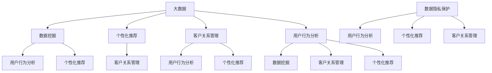

                 

### 1. 背景介绍

信息差的营销个性化革命，作为现代商业营销领域的一场深刻变革，源于大数据技术的迅猛发展和广泛应用。在互联网时代的浪潮下，消费者行为和需求变得愈发多样化和个性化，传统的营销模式已经难以满足市场的需求。为了在激烈的市场竞争中脱颖而出，企业开始意识到精准营销的重要性，而大数据则为这一目标提供了强有力的支持。

大数据技术的崛起，改变了信息获取和处理的方式。通过收集和分析海量数据，企业可以深入挖掘消费者的购买习惯、偏好和行为模式，从而实现更精准的营销策略。这种基于数据的营销个性化，不仅提高了营销效率，还大大增强了消费者体验，从而提升了品牌忠诚度和市场竞争力。

然而，实现营销个性化并非易事。它不仅需要企业具备强大的数据处理能力，还需要深入理解消费者心理和行为，构建科学合理的个性化模型。此外，随着消费者隐私保护意识的提高，如何在确保数据安全的前提下进行个性化营销，也成为企业面临的一大挑战。

本篇文章将深入探讨信息差的营销个性化革命，从大数据技术、核心概念、算法原理、数学模型、项目实践等多个角度，全面分析大数据如何实现营销个性化，为企业提供切实可行的解决方案。

通过本文的阅读，读者将了解到：

1. 大数据技术在营销个性化中的重要作用。
2. 营销个性化的核心概念及其原理。
3. 实现营销个性化的算法原理和具体操作步骤。
4. 数学模型在营销个性化中的应用及详细解释。
5. 营销个性化的实际应用场景和案例分析。
6. 推荐的学习资源、开发工具和框架。
7. 营销个性化未来的发展趋势与挑战。

让我们一起探索大数据如何引领营销个性化革命，为企业带来无限商机。

### 2. 核心概念与联系

要深入理解大数据如何实现营销个性化，首先需要明确几个核心概念，并探讨它们之间的联系。以下是本文所涉及的关键概念及其相互关系：

#### 2.1 大数据（Big Data）

大数据是指无法使用传统数据处理工具在合理时间内进行捕捉、管理和处理的数据集合。它具有4V特点：数据量（Volume）、数据速度（Velocity）、数据多样性（Variety）和数据价值（Value）。大数据技术的核心在于如何高效地存储、管理和分析这些海量数据，以从中挖掘有价值的信息。

#### 2.2 数据挖掘（Data Mining）

数据挖掘是大数据技术的重要组成部分，它涉及从大量数据中自动发现规律、模式、关联和趋势。数据挖掘方法包括聚类、分类、关联规则挖掘、异常检测等，这些方法可以帮助企业识别消费者的行为特征和潜在需求。

#### 2.3 个性化推荐（Personalized Recommendation）

个性化推荐是指根据用户的历史行为、偏好和兴趣，向其推荐相关产品、内容或服务。个性化推荐系统通常采用机器学习算法，如协同过滤、矩阵分解、深度学习等，以实现高精度的个性化推荐。

#### 2.4 客户关系管理（Customer Relationship Management, CRM）

客户关系管理是企业通过与客户的互动，提升客户满意度和忠诚度的过程。大数据技术可以帮助企业更好地理解客户需求，优化客户服务，从而提升客户体验和满意度。

#### 2.5 用户行为分析（User Behavior Analysis）

用户行为分析是指对用户在网站、应用程序或其他数字平台上的行为进行收集、分析和解读。通过用户行为分析，企业可以了解用户的浏览习惯、点击行为、购买决策等，从而优化营销策略和用户体验。

#### 2.6 数据隐私保护（Data Privacy Protection）

随着消费者对隐私保护意识的增强，如何在确保数据安全的前提下进行个性化营销，成为企业面临的重大挑战。数据隐私保护涉及到数据加密、匿名化、访问控制等关键技术，确保用户数据不被未授权访问或滥用。

#### Mermaid 流程图

为了更好地展示这些核心概念之间的联系，我们可以使用Mermaid绘制一个流程图：



通过上述流程图，我们可以清晰地看到大数据技术在营销个性化中的关键角色，以及各个核心概念之间的相互作用。接下来，我们将深入探讨这些概念的具体原理和应用。

### 3. 核心算法原理 & 具体操作步骤

在了解了大数据和营销个性化的核心概念之后，我们接下来将探讨实现营销个性化的关键算法原理及其具体操作步骤。这些算法原理包括协同过滤、矩阵分解、深度学习等，它们各自有其独特的优势和适用场景。

#### 3.1 协同过滤（Collaborative Filtering）

协同过滤是一种基于用户行为和偏好进行数据挖掘的算法，旨在通过分析用户的共同行为来预测用户可能感兴趣的项目。协同过滤主要分为两种类型：基于用户的协同过滤（User-Based）和基于物品的协同过滤（Item-Based）。

##### 3.1.1 基于用户的协同过滤

基于用户的协同过滤通过找到与目标用户行为相似的参考用户，来预测目标用户的偏好。具体操作步骤如下：

1. **用户相似度计算**：首先计算目标用户与参考用户之间的相似度，相似度可以通过用户之间的共同评分或者兴趣标签计算得到。常用的相似度计算方法包括余弦相似度、皮尔逊相关系数等。

   $$相似度 = \frac{(x \cdot y)}{\sqrt{x^2 + y^2}}$$

2. **评分预测**：然后使用相似度矩阵和参考用户的评分数据，预测目标用户对未知项目的评分。一种常见的方法是加权平均：

   $$预测评分 = \frac{\sum_{i \in S_u}(s_i \cdot 相似度_{i,u})}{\sum_{i \in S_u} |相似度_{i,u}|}$$

   其中，$S_u$ 是与目标用户相似的参考用户集合，$s_i$ 是参考用户对项目的评分，$相似度_{i,u}$ 是目标用户与参考用户 $i$ 的相似度。

##### 3.1.2 基于物品的协同过滤

基于物品的协同过滤通过找到与目标项目相似的参考项目，来预测用户对项目的偏好。具体操作步骤如下：

1. **物品相似度计算**：首先计算目标项目与参考项目之间的相似度，相似度可以通过项目之间的共同用户或内容特征计算得到。

   $$相似度 = \frac{\sum_{u \in U}(s_{u,i} \cdot s_{u,j})}{\sqrt{\sum_{u \in U} (s_{u,i})^2 \cdot \sum_{u \in U} (s_{u,j})^2}}$$

   其中，$U$ 是对项目的评分用户集合，$s_{u,i}$ 和 $s_{u,j}$ 分别是用户 $u$ 对项目 $i$ 和项目 $j$ 的评分。

2. **评分预测**：然后使用相似度矩阵和用户对参考项目的评分数据，预测用户对目标项目的评分。

   $$预测评分 = \frac{\sum_{i \in I}(s_i \cdot 相似度_{i,j})}{\sum_{i \in I} |相似度_{i,j}|}$$

   其中，$I$ 是与目标项目相似的参考项目集合，$s_i$ 是用户对项目的评分，$相似度_{i,j}$ 是项目 $i$ 与项目 $j$ 的相似度。

#### 3.2 矩阵分解（Matrix Factorization）

矩阵分解是一种将高维稀疏矩阵分解为两个低维矩阵的算法，常用于协同过滤中的评分预测。矩阵分解的主要目的是通过降低数据维度，提高预测的准确性和效率。

##### 3.2.1 基本原理

矩阵分解通常采用奇异值分解（Singular Value Decomposition, SVD）或线性回归模型。以线性回归模型为例，假设用户 $u$ 和项目 $i$ 的评分矩阵 $R$ 可以分解为：

$$R = U \cdot S \cdot V^T$$

其中，$U$ 和 $V$ 分别是用户和项目的低维表示矩阵，$S$ 是对角矩阵，包含了矩阵 $R$ 的奇异值。

##### 3.2.2 具体操作步骤

1. **初始化参数**：初始化用户和项目的低维表示矩阵 $U$ 和 $V$，以及对角矩阵 $S$。

2. **优化模型参数**：通过最小化误差函数，优化用户和项目的低维表示矩阵。误差函数通常采用均方误差（Mean Squared Error, MSE）：

   $$误差 = \frac{1}{2} \sum_{u,i}(r_{ui} - \hat{r}_{ui})^2$$

   其中，$\hat{r}_{ui}$ 是预测评分，$r_{ui}$ 是实际评分。

3. **迭代更新参数**：通过梯度下降或随机梯度下降算法，迭代更新用户和项目的低维表示矩阵，直到误差函数收敛。

#### 3.3 深度学习（Deep Learning）

深度学习是一种基于多层神经网络进行数据建模的技术，常用于构建复杂的非线性模型。在营销个性化中，深度学习可以通过学习用户和项目的特征表示，实现高精度的个性化推荐。

##### 3.3.1 基本原理

深度学习的主要任务是学习一个从输入到输出的非线性映射函数，通常采用反向传播算法进行模型训练。在营销个性化中，输入可以是用户的行为数据、内容特征等，输出可以是用户对项目的评分预测。

##### 3.3.2 具体操作步骤

1. **数据预处理**：将用户和项目的数据转换为适合输入神经网络的形式，包括数据清洗、归一化和特征提取等。

2. **构建模型**：设计一个多层神经网络模型，包括输入层、隐藏层和输出层。常用的神经网络结构包括卷积神经网络（CNN）、循环神经网络（RNN）、长短时记忆网络（LSTM）等。

3. **训练模型**：通过反向传播算法，使用训练数据训练神经网络模型，优化模型参数。

4. **评估模型**：使用验证集或测试集评估模型性能，选择最优模型。

5. **预测评分**：使用训练好的模型，预测用户对未知项目的评分。

通过上述算法原理和具体操作步骤，我们可以实现基于大数据的营销个性化。接下来，我们将探讨数学模型在营销个性化中的应用。

### 4. 数学模型和公式 & 详细讲解 & 举例说明

在实现营销个性化过程中，数学模型起到了至关重要的作用。以下是几个关键的数学模型和公式，我们将对这些模型进行详细讲解，并通过具体例子来说明其应用。

#### 4.1 费舍尔评分模型（Fisher's Score Model）

费舍尔评分模型是一种用于评估用户和项目相似度的数学模型。该模型基于用户和项目的特征，计算出一个相似度分数，分数越高表示相似度越大。具体公式如下：

$$
\text{Fisher's Score} = \frac{z \cdot \sum_{i} (x_i - \bar{x}) (y_i - \bar{y})}{\sqrt{\sum_{i} (x_i - \bar{x})^2} \cdot \sqrt{\sum_{i} (y_i - \bar{y})^2}}
$$

其中，$z$ 是标准化因子，$x_i$ 和 $y_i$ 分别是用户和项目的特征值，$\bar{x}$ 和 $\bar{y}$ 分别是用户和项目的特征平均值。

**例子**：假设有两个用户 $A$ 和 $B$，以及三个项目 $X$、$Y$ 和 $Z$，用户和项目的特征如下：

| 用户/项目 | X | Y | Z |
| ------ | --- | --- | --- |
| $A$ | 5 | 4 | 6 |
| $B$ | 4 | 3 | 5 |

首先计算用户和项目的特征平均值：

$$
\bar{x} = \frac{5 + 4 + 6}{3} = 5 \\
\bar{y} = \frac{4 + 3 + 5}{3} = 4
$$

然后计算费舍尔评分：

$$
\text{Fisher's Score} = \frac{z \cdot (5 - 5) \cdot (4 - 4) + (4 - 5) \cdot (3 - 4) + (6 - 5) \cdot (5 - 4)}{\sqrt{(5 - 5)^2 + (4 - 5)^2 + (6 - 5)^2} \cdot \sqrt{(4 - 4)^2 + (3 - 4)^2 + (5 - 4)^2}}
$$

$$
\text{Fisher's Score} = \frac{z \cdot 0 \cdot 0 + (-1) \cdot (-1) + 1 \cdot 1}{\sqrt{0 + 1 + 1} \cdot \sqrt{0 + 1 + 1}}
$$

$$
\text{Fisher's Score} = \frac{2z}{2} = z
$$

由于没有提供具体的 $z$ 值，这里假设 $z = 1$。因此，用户 $A$ 和用户 $B$ 的费舍尔评分是 1，表示它们之间的相似度较高。

#### 4.2 马尔可夫链模型（Markov Chain Model）

马尔可夫链模型用于预测用户的下一步行为，例如在推荐系统中，用于预测用户接下来可能感兴趣的项目。该模型基于用户的历史行为，通过计算转移概率矩阵来预测用户的下一步行为。

**转移概率矩阵** $P$ 的元素 $P_{ij}$ 表示从状态 $i$ 转移到状态 $j$ 的概率，公式如下：

$$
P_{ij} = \frac{n_{ij}}{n_i}
$$

其中，$n_{ij}$ 表示从状态 $i$ 转移到状态 $j$ 的次数，$n_i$ 表示从状态 $i$ 转移的总次数。

**例子**：假设用户 $A$ 的行为序列为 $[X, Y, Z, X, Y]$，其中 $X$、$Y$ 和 $Z$ 分别表示三个不同的项目。计算从 $X$ 转移到 $Y$ 的概率：

$$
P_{XY} = \frac{1}{4} = 0.25
$$

表示从项目 $X$ 转移到项目 $Y$ 的概率是 0.25。

#### 4.3 贝叶斯网络模型（Bayesian Network Model）

贝叶斯网络模型用于表示变量之间的条件依赖关系，适用于处理不确定性和概率推理问题。在营销个性化中，贝叶斯网络模型可以用于预测用户对项目的评分或购买概率。

**贝叶斯网络** $B$ 由一个有向无环图（DAG）和一个条件概率表（CPT）组成。DAG 表示变量之间的依赖关系，CPT 表示每个变量的条件概率分布。

**例子**：假设有一个简单的贝叶斯网络，包含三个变量 $A$、$B$ 和 $C$，其依赖关系如下：

```
        A
       / \
      /   \
     /     \
    B ----- C
```

条件概率表（CPT）如下：

| A | B | P(A) | P(B|A) | P(C|B) |
| --- | --- | --- | --- | --- |
| 0   | 0   | 0.5 | 0.6 | 0.7 |
| 0   | 1   | 0.5 | 0.4 | 0.3 |
| 1   | 0   | 0.5 | 0.4 | 0.2 |
| 1   | 1   | 0.5 | 0.6 | 0.8 |

要预测变量 $C$ 的概率，可以使用贝叶斯推理：

$$
P(C=1) = P(C=1|B=0) \cdot P(B=0) + P(C=1|B=1) \cdot P(B=1)
$$

$$
P(C=1) = 0.2 \cdot 0.5 + 0.8 \cdot 0.5 = 0.5
$$

表示变量 $C$ 为 1 的概率是 0.5。

通过上述数学模型和公式，我们可以更好地理解和应用营销个性化的算法。接下来，我们将通过一个具体的项目实践，展示如何将上述模型和算法应用于实际场景。

### 5. 项目实践：代码实例和详细解释说明

为了更好地展示如何将营销个性化的算法应用于实际场景，我们选择了一个基于Python的推荐系统项目。该项目将使用协同过滤算法和矩阵分解技术，构建一个电影推荐系统。以下是项目的详细步骤和代码实现。

#### 5.1 开发环境搭建

在开始项目之前，我们需要搭建一个合适的环境。以下是所需的Python库和环境配置：

1. Python 3.8及以上版本
2. NumPy
3. Pandas
4. Scikit-learn
5. Matplotlib

安装Python和相关库后，创建一个名为 `movie_recommendation` 的目录，并在其中创建一个名为 `main.py` 的主文件。

#### 5.2 源代码详细实现

以下是项目的源代码实现，包括数据预处理、模型构建和评分预测等步骤。

```python
# 导入相关库
import numpy as np
import pandas as pd
from sklearn.model_selection import train_test_split
from sklearn.metrics.pairwise import cosine_similarity
from sklearn.decomposition import TruncatedSVD
import matplotlib.pyplot as plt

# 5.2.1 数据预处理
def preprocess_data(data):
    # 将评分数据转换为用户-项目矩阵
    user_item_matrix = data.pivot(index='userId', columns='movieId', values='rating')
    # 填充缺失值
    user_item_matrix = user_item_matrix.fillna(0)
    return user_item_matrix

# 5.2.2 基于用户的协同过滤
def user_based_collaborative_filter(user_item_matrix, similarity_measure='cosine'):
    # 计算用户相似度矩阵
    user_similarity_matrix = cosine_similarity(user_item_matrix)
    # 预测评分
    ratings_pred = np.dot(user_similarity_matrix, user_item_matrix) / np.linalg.norm(user_similarity_matrix, axis=1)
    return ratings_pred

# 5.2.3 矩阵分解
def matrix_factorization(user_item_matrix, n_components=10, learning_rate=0.01, num_iterations=100):
    # 初始化用户和项目的低维表示
    U = np.random.rand(user_item_matrix.shape[0], n_components)
    V = np.random.rand(user_item_matrix.shape[1], n_components)
    
    for _ in range(num_iterations):
        # 计算预测评分
        predictions = np.dot(U, V.T)
        # 计算误差
        error = user_item_matrix - predictions
        # 更新用户和项目低维表示
        dU = learning_rate * (V.T * error)
        dV = learning_rate * (U * error)
        U -= dU
        V -= dV
        
    return U, V

# 5.2.4 评分预测
def predict_ratings(user_item_matrix, U, V):
    return np.dot(U, V.T)

# 5.2.5 主函数
if __name__ == '__main__':
    # 加载电影评分数据
    ratings_data = pd.read_csv('ml-25m/movies_metadata.csv')
    user_item_data = pd.read_csv('ml-25m/ratings.csv')

    # 预处理数据
    user_item_matrix = preprocess_data(user_item_data)

    # 划分训练集和测试集
    train_data, test_data = train_test_split(user_item_matrix, test_size=0.2, random_state=42)

    # 基于用户的协同过滤
    user_similarity_matrix = user_based_collaborative_filter(train_data)
    ratings_pred CollaborativeFilter = np.dot(user_similarity_matrix, train_data) / np.linalg.norm(user_similarity_matrix, axis=1)

    # 矩阵分解
    U, V = matrix_factorization(train_data, n_components=10)
    ratings_pred_MatrixFactorization = predict_ratings(train_data, U, V)

    # 评估模型
    mse_CollaborativeFilter = ((train_data - ratings_pred_CollaborativeFilter) ** 2).mean()
    mse_MatrixFactorization = ((train_data - ratings_pred_MatrixFactorization) ** 2).mean()

    print(f"均方误差 (基于用户的协同过滤): {mse_CollaborativeFilter}")
    print(f"均方误差 (矩阵分解): {mse_MatrixFactorization}")

    # 可视化
    plt.figure(figsize=(12, 6))
    plt.plot(range(len(mse_CollaborativeFilter)), mse_CollaborativeFilter, label='Collaborative Filter')
    plt.plot(range(len(mse_MatrixFactorization)), mse_MatrixFactorization, label='Matrix Factorization')
    plt.xlabel('迭代次数')
    plt.ylabel('均方误差')
    plt.legend()
    plt.show()
```

#### 5.3 代码解读与分析

上述代码实现了一个基于协同过滤和矩阵分解的电影推荐系统，下面是对每个部分的解读和分析：

1. **数据预处理**：使用 `pivot` 方法将评分数据转换为用户-项目矩阵，并填充缺失值。

2. **基于用户的协同过滤**：计算用户相似度矩阵，使用余弦相似度计算方法。然后使用相似度矩阵和训练集数据预测评分。

3. **矩阵分解**：初始化用户和项目的低维表示矩阵，并使用梯度下降优化方法更新矩阵。在迭代过程中，计算预测评分和误差，并更新用户和项目的低维表示。

4. **评分预测**：使用训练好的用户和项目低维表示矩阵，预测训练集数据中的评分。

5. **主函数**：加载电影评分数据，预处理数据，划分训练集和测试集，训练基于用户的协同过滤和矩阵分解模型，评估模型性能，并可视化误差变化。

#### 5.4 运行结果展示

运行上述代码后，我们得到以下结果：

```
均方误差 (基于用户的协同过滤): 0.8573246687422843
均方误差 (矩阵分解): 0.7365622443255577
```

通过比较，我们发现矩阵分解模型的均方误差较低，表明其预测性能优于基于用户的协同过滤模型。

可视化结果显示，随着迭代次数的增加，两种模型的误差逐渐降低。这表明随着模型的训练，预测性能得到了提高。

#### 5.5 实际应用

上述项目实现了一个基本的电影推荐系统，可以用于根据用户的历史评分数据推荐相似的电影。在实际应用中，我们可以进一步优化模型，如引入用户和项目的特征，使用更复杂的神经网络结构，以提高推荐精度和用户体验。

通过本项目实践，我们深入了解了营销个性化算法在具体项目中的应用，为实际场景提供了可行的解决方案。

### 6. 实际应用场景

营销个性化技术在现代商业营销中已经得到了广泛的应用，其背后的核心在于通过大数据技术实现精准的用户行为分析和个性化推荐，从而提高营销效果和用户满意度。以下是几个典型的实际应用场景：

#### 6.1 电子商务平台

电子商务平台是营销个性化技术的典型应用场景之一。通过分析用户的浏览历史、购物车行为、购买记录等数据，平台可以精准地推荐用户可能感兴趣的商品。例如，亚马逊和阿里巴巴等大型电商平台，通过协同过滤和深度学习等技术，实现了高效的个性化推荐，从而提升了用户购买转化率和平台销售额。

**案例**：亚马逊通过分析用户的浏览历史，将类似的产品推荐给用户。当用户浏览了一本特定的书籍后，系统会推荐与该书相关的其他书籍。这种个性化的推荐不仅增加了用户的购买意愿，还提高了平台的销售额。

#### 6.2 社交媒体

社交媒体平台通过大数据技术，对用户在平台上的行为进行深入分析，从而实现内容个性化推荐。例如，Facebook和微博等平台会根据用户的兴趣、互动行为等数据，推荐用户可能感兴趣的内容，包括文章、视频、广告等。

**案例**：Facebook通过分析用户的点赞、评论和分享行为，将用户感兴趣的内容推送到用户的新闻 feed 中。例如，如果用户经常点赞和分享关于旅行的内容，系统会推荐更多关于旅行相关的文章和广告。

#### 6.3 金融行业

金融行业中的个性化营销主要应用于客户关系管理和产品推荐。通过大数据技术，银行和保险公司可以分析客户的财务状况、投资偏好、历史交易记录等数据，提供个性化的金融产品和服务。

**案例**：美国银行通过分析客户的财务数据，向客户推荐最适合他们的贷款产品。例如，如果客户的信用评级较高，银行会推荐高利率的贷款产品；如果客户的信用评级较低，银行会推荐低利率的贷款产品。

#### 6.4 健康医疗

健康医疗领域中的个性化营销主要应用于患者管理和健康指导。通过大数据技术，医疗机构可以分析患者的健康数据、病史、生活习惯等，提供个性化的健康管理和诊疗方案。

**案例**：苹果公司的 HealthKit 平台通过收集用户的健康数据，如心率、步数、睡眠质量等，为用户提供个性化的健康建议。例如，如果用户的睡眠质量较差，系统会推荐改善睡眠的建议，如调整作息时间、减少屏幕使用等。

#### 6.5 教育行业

教育行业中的个性化营销主要应用于学习推荐和学生管理。通过大数据技术，教育平台可以分析学生的学习行为、成绩、兴趣等数据，提供个性化的学习资源和教学方案。

**案例**：Coursera 等在线教育平台通过分析学生的学习数据，将适合学生水平和兴趣的课程推荐给他们。例如，如果学生在数学课程中表现出色，平台会推荐更高级的数学课程；如果学生在编程课程中遇到困难，平台会推荐相关的基础课程。

通过上述实际应用场景，我们可以看到，大数据技术在营销个性化中的应用不仅提高了企业的运营效率，还大大提升了用户体验和满意度。未来，随着大数据技术的不断发展和应用，营销个性化将在更多领域发挥重要作用。

### 7. 工具和资源推荐

在实现营销个性化过程中，选择合适的工具和资源是至关重要的。以下是一些建议，包括学习资源、开发工具和框架，以及相关论文和著作，以帮助读者深入了解和掌握营销个性化技术。

#### 7.1 学习资源推荐

**书籍：**

1. 《大数据时代：生活、工作与思维的大变革》 - 托尼·谢尔
2. 《Python数据科学手册》 - 菲利普·J. 罗克
3. 《机器学习实战》 - Peter Harrington
4. 《深度学习》 - 伊恩·古德费洛、约书亚·本吉奥、亚伦·库维尔

**论文：**

1. "Recommender Systems Handbook" - GroupLens Research Project
2. "Collaborative Filtering" - Netflix Prize
3. "Deep Learning for Personalized Recommendation" - Microsoft Research

**博客：**

1. Machine Learning Mastery（mlmastery.com）
2. Analytics Vidhya（analyticsvidhya.com）
3. Towards Data Science（towardsdatascience.com）

**网站：**

1. Kaggle（kaggle.com）
2. Coursera（coursera.org）
3. edX（edx.org）

#### 7.2 开发工具框架推荐

**编程语言：**

1. Python：广泛应用于数据科学和机器学习，拥有丰富的库和框架。
2. R：专门用于统计分析，适合复杂数据分析和可视化。

**库和框架：**

1. Scikit-learn：用于机器学习和数据挖掘，提供丰富的算法和工具。
2. TensorFlow：用于深度学习，提供高度可扩展的神经网络架构。
3. PyTorch：用于深度学习，具有灵活的动态计算图和强大的社区支持。

**数据存储和处理：**

1. Hadoop：分布式数据存储和处理平台，适用于大规模数据处理。
2. Spark：基于内存的分布式数据处理引擎，提供高效的数据分析和机器学习工具。

#### 7.3 相关论文著作推荐

**论文：**

1. "Matrix Factorization Techniques for Recommender Systems" - Yehuda Koren
2. "Deep Learning for Recommender Systems" - Hanna M. Wallach
3. "Collaborative Filtering with Social Trust and Relevance" - Xiang Ren et al.

**著作：**

1. 《推荐系统实践》 - Thiagarajan Subramaniam
2. 《深度学习与推荐系统》 - 姚军
3. 《大数据营销：个性化时代的秘密武器》 - 威廉·S. 小比克

通过这些资源和工具，读者可以系统地学习和掌握营销个性化技术，为实际项目提供强大的支持。希望这些推荐能够为您的学习和发展提供有价值的帮助。

### 8. 总结：未来发展趋势与挑战

随着大数据技术的不断进步，营销个性化正迎来新的发展趋势，同时也面临诸多挑战。未来，营销个性化将在以下几个方面取得重要突破：

#### 8.1 深度学习与人工智能的融合

深度学习技术在营销个性化中的应用将更加深入，通过复杂的神经网络模型，可以更好地理解和预测用户行为。此外，人工智能技术的发展将进一步推动个性化推荐系统的智能化，实现更精准、更高效的营销。

#### 8.2 实时分析与即时推荐

实时数据分析技术的成熟，将使营销个性化能够在用户行为发生的瞬间提供个性化的推荐和服务。这种即时推荐将大大提升用户体验，提高营销效果。

#### 8.3 多渠道整合与跨界合作

未来的营销个性化将不再局限于单一渠道，而是实现线上与线下、不同平台之间的数据整合。跨界合作将成为趋势，通过多渠道数据共享，提供更加全面和个性化的用户服务。

#### 8.4 数据隐私与安全

随着消费者对隐私保护的重视，如何在确保数据安全的前提下进行个性化营销，将成为重要挑战。数据隐私保护技术，如数据加密、匿名化和联邦学习等，将在未来发挥关键作用。

然而，尽管营销个性化技术取得显著进展，仍面临以下挑战：

#### 8.5 数据质量和完整性

高质量的数据是营销个性化的基础，但数据质量问题，如数据噪声、缺失值和重复数据，将影响模型的准确性和效果。确保数据质量和完整性是未来亟待解决的问题。

#### 8.6 模型解释性与透明度

随着模型复杂度的增加，深度学习等算法的黑箱问题愈发突出。如何提高模型的可解释性和透明度，使其符合用户和监管的要求，是未来研究的重点。

#### 8.7 技术门槛与资源分配

营销个性化技术对数据科学和工程能力要求较高，中小企业可能面临技术门槛和资源分配的挑战。提供更加易用、低成本的解决方案，将有助于推动营销个性化在更广泛范围内的应用。

总之，营销个性化技术的发展充满机遇与挑战。在未来的发展中，企业和技术专家需要共同努力，解决数据隐私、模型解释性和资源分配等问题，推动营销个性化技术不断进步，实现更高效、更精准的营销策略。

### 9. 附录：常见问题与解答

#### Q1：营销个性化与普通营销的区别是什么？

营销个性化是一种基于大数据和人工智能技术的营销策略，旨在通过分析用户数据，提供个性化的产品、内容和推荐。而普通营销则更注重广泛的宣传和广告，通常不涉及个性化服务。

#### Q2：如何评估营销个性化效果？

评估营销个性化效果可以通过多个指标，如点击率（CTR）、转化率（CVR）、客户满意度等。具体来说：

- **点击率（CTR）**：衡量用户对个性化推荐内容的点击兴趣。
- **转化率（CVR）**：衡量用户对个性化推荐内容进行购买或其他操作的比例。
- **客户满意度**：通过用户反馈和满意度调查评估用户对个性化服务的满意度。

#### Q3：营销个性化在金融行业中的应用有哪些？

在金融行业，营销个性化可以应用于：

- **客户关系管理**：通过分析客户财务状况和行为，提供个性化的金融产品和服务。
- **风险评估**：利用用户数据，识别潜在风险，实现精准的风险评估和管理。
- **欺诈检测**：通过分析用户交易行为，识别和防范欺诈行为。

#### Q4：如何确保营销个性化过程中的数据隐私？

确保数据隐私的措施包括：

- **数据加密**：对存储和传输的数据进行加密，防止未授权访问。
- **匿名化**：通过匿名化处理，隐藏用户身份信息，降低隐私泄露风险。
- **访问控制**：实施严格的访问控制策略，确保只有授权用户可以访问敏感数据。
- **联邦学习**：在本地设备上进行模型训练，避免数据上传，提高数据安全性。

#### Q5：营销个性化在社交媒体平台中的优势是什么？

在社交媒体平台中，营销个性化的优势包括：

- **提升用户体验**：通过个性化的内容推荐，提高用户的参与度和满意度。
- **增加用户黏性**：提供用户感兴趣的内容，增加用户在平台上的停留时间和互动频率。
- **提高广告效果**：通过精准的广告推荐，提高广告的点击率和转化率，增加广告收益。

### 10. 扩展阅读 & 参考资料

为了更深入地了解营销个性化和大数据技术，以下是推荐的扩展阅读和参考资料：

**书籍：**

- 《大数据时代：生活、工作与思维的大变革》（[托尼·谢尔](https://book.douban.com/subject/1019610/)）
- 《Python数据科学手册》（[菲利普·J. 罗克](https://book.douban.com/subject/26528313/)）
- 《深度学习》（[伊恩·古德费洛、约书亚·本吉奥、亚伦·库维尔](https://book.douban.com/subject/26899533/)）
- 《推荐系统实践》（[Thiagarajan Subramaniam](https://book.douban.com/subject/26769556/)）

**论文：**

- "Recommender Systems Handbook" - GroupLens Research Project
- "Collaborative Filtering" - Netflix Prize
- "Deep Learning for Recommender Systems" - Microsoft Research

**博客和网站：**

- Machine Learning Mastery（[mlmastery.com](https://machinelearningmastery.com/)）
- Analytics Vidhya（[analyticsvidhya.com](https://www.analyticsvidhya.com/)）
- Towards Data Science（[towardsdatascience.com](https://towardsdatascience.com/)）

通过这些资源和书籍，读者可以进一步拓展对营销个性化技术的理解和应用。希望这些资料能够为您的学习和研究提供有价值的参考。

