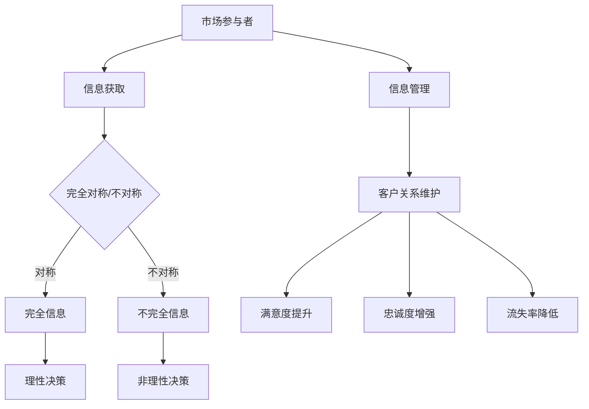
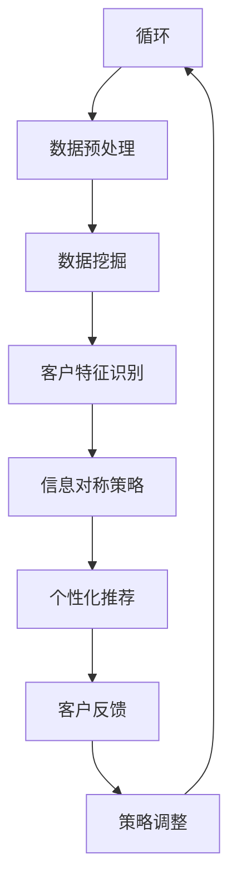

                 

### 1. 背景介绍

信息差，又称为信息不对称，是指在市场中不同个体之间所掌握的信息量存在差异。这一现象在商业和经济学中被广泛研究，并且已经逐渐渗透到技术领域。随着互联网和信息技术的快速发展，信息差的作用变得更加显著，其在客户关系维护与管理中起到了关键作用。

在传统商业模式中，企业通过广告、市场调研等方式获取消费者信息，进而制定营销策略。然而，随着大数据、云计算等技术的普及，消费者不再是被动的信息接受者，而是成为信息生产者。这种变化使得企业需要更有效地管理和利用信息，以维持与客户的良好关系。

信息不对称不仅影响消费者的决策，还可能引发市场失灵。例如，在金融市场中，信息不对称可能导致道德风险和逆向选择问题。在技术领域，信息不对称使得一些企业能够垄断技术优势，从而获得更大的市场份额和利润。因此，研究和理解信息差对于提升客户关系管理水平和促进技术进步具有重要意义。

本文将围绕信息不对称与客户关系的主题展开讨论。首先，我们将介绍信息不对称的基本概念和其在不同领域的影响。接着，分析信息差在客户关系管理中的应用，并探讨如何通过技术手段缩小信息差距。最后，本文将总结信息差的未来发展趋势，并提出相应的挑战和建议。

### 2. 核心概念与联系

#### 2.1 信息不对称的基本概念

信息不对称是指市场上买方和卖方之间信息量不一致的现象。在完全信息对称的情况下，买卖双方对产品的所有信息都有充分的了解，从而能够做出理性的决策。然而，在现实中，信息不对称是普遍存在的。

根据信息不对称的程度，可以分为以下几种类型：

- **完全信息不对称**：卖方拥有全部信息，而买方一无所知。
- **部分信息不对称**：双方都有一定的信息，但存在差异。
- **对称信息**：双方拥有相同的信息。

信息不对称可能导致市场失灵，因为一方可能在交易中占据优势地位，从而操纵价格或服务质量。在商业领域，企业通常会利用信息不对称来获取利润。例如，在保险市场中，保险公司通过风险评估模型来确定保险费率，而客户通常无法获取全部风险评估信息。

#### 2.2 信息不对称在不同领域的影响

信息不对称不仅存在于商业领域，也渗透到其他各个领域，例如：

- **金融领域**：在金融市场中，投资者和银行、保险公司之间可能存在信息不对称。投资者可能无法完全了解投资项目的风险和收益，而金融机构则掌握更多内部信息。这种信息不对称可能导致投资者做出非理性投资决策，增加市场波动。

- **医疗领域**：在医疗服务中，医生通常比患者拥有更多的医疗信息。患者往往依赖于医生的专业判断，而医生则可能通过信息不对称来操纵治疗方案和费用。这种不对称关系可能导致医疗资源分配不公和患者权益受损。

- **技术领域**：在技术开发过程中，企业之间可能存在信息不对称。技术领先的企业可能通过保密措施保护其知识产权，而其他企业则难以获取这些技术信息。这种不对称关系可能阻碍技术进步和市场公平竞争。

#### 2.3 信息不对称与客户关系

在客户关系管理中，信息不对称是一个关键因素。企业需要通过有效的信息管理策略来缩小与客户之间的信息差距，从而建立稳定的客户关系。

- **提升客户满意度**：当企业能够提供全面、准确的产品信息时，客户能够做出更明智的购买决策，从而提高满意度。例如，电商网站通过用户评价、产品详情页等方式，提供丰富的产品信息，以减少信息不对称。

- **增强客户忠诚度**：通过定期沟通和反馈机制，企业可以获取客户的使用体验和需求，从而调整产品和服务策略，满足客户期望。这种信息对称关系有助于增强客户忠诚度。

- **降低客户流失率**：当企业能够及时回应客户的疑问和需求时，客户感到受到重视，从而减少流失。例如，客服系统通过智能语音识别和在线聊天功能，提供快速、准确的客户服务。

#### 2.4 信息不对称的影响因素

信息不对称的影响因素包括：

- **信息获取成本**：获取信息的成本越高，信息不对称的程度越大。例如，市场调研费用高昂，使得企业难以全面了解消费者需求。

- **信息传播渠道**：信息传播的渠道越广泛，信息不对称的程度越低。互联网和社交媒体的兴起，使得信息传播更加迅速和广泛，有助于缩小信息差距。

- **专业知识**：专业知识和技能的差异也可能导致信息不对称。例如，在技术领域，专业技术人员可能比普通用户更了解技术细节。

#### 2.5 核心概念原理和架构的 Mermaid 流程图

以下是一个简化的 Mermaid 流程图，用于描述信息不对称的核心概念和架构：



在这个流程图中，市场参与者通过信息获取进行决策，而信息管理策略则有助于维护客户关系，提升客户满意度、忠诚度和降低流失率。

### 3. 核心算法原理 & 具体操作步骤

#### 3.1 核心算法原理

在客户关系管理中，核心算法通常涉及以下三个方面：

- **数据挖掘与分析**：通过大数据分析技术，挖掘客户行为数据，识别潜在客户特征和需求。
- **信息对称策略**：采用多种手段，如透明化产品信息、定期沟通等，缩小与客户之间的信息差距。
- **个性化推荐**：基于用户行为数据，提供个性化的产品或服务推荐，增强客户体验。

以下是一个简化的核心算法流程：



#### 3.2 具体操作步骤

以下是实施核心算法的具体操作步骤：

1. **数据采集**：
   - 收集客户行为数据，如购买记录、浏览历史、搜索关键词等。
   - 利用API接口或数据抓取工具获取外部数据，如社交媒体信息、评论等。

2. **数据预处理**：
   - 清洗数据，去除重复、错误和不完整的数据。
   - 对数据进行标准化处理，如编码、归一化等。

3. **数据挖掘**：
   - 使用机器学习算法（如聚类、分类、关联规则挖掘等），分析客户行为数据，识别潜在客户特征和需求。
   - 利用统计分析方法（如回归分析、时间序列分析等），分析客户行为趋势和关联关系。

4. **客户特征识别**：
   - 根据数据挖掘结果，识别客户的潜在需求、偏好和行为模式。
   - 构建客户特征模型，用于后续的个性化推荐和信息对称策略。

5. **信息对称策略**：
   - 透明化产品信息，提供详细的产品规格、功能介绍、用户评价等。
   - 定期与客户沟通，通过邮件、短信、社交媒体等方式，了解客户需求和建议。
   - 设立客服系统，提供在线咨询、反馈渠道，及时回应客户疑问。

6. **个性化推荐**：
   - 基于客户特征模型，运用协同过滤、内容推荐等技术，生成个性化的产品或服务推荐。
   - 在网站、APP等渠道展示个性化推荐结果，提升客户体验。

7. **客户反馈**：
   - 收集客户对个性化推荐的反馈，如点击率、购买率、满意度等。
   - 利用反馈数据，调整推荐算法和策略，优化客户体验。

8. **策略调整**：
   - 根据客户反馈和业务指标，定期评估信息对称策略和个性化推荐的成效。
   - 调整数据挖掘、客户特征识别、个性化推荐等模块，以适应市场变化和客户需求。

通过以上步骤，企业可以有效地实施核心算法，实现信息对称和个性化推荐，从而提升客户关系管理水平和业务绩效。

### 4. 数学模型和公式 & 详细讲解 & 举例说明

#### 4.1 信息不对称的数学模型

在信息不对称的情况下，我们可以通过数学模型来描述买卖双方的行为和决策。以下是一个简化的数学模型，用于分析信息不对称对市场价格和交易量的影响。

**假设**：

- 市场上有两种商品：高质量商品和低质量商品。
- 买方（消费者）不知道商品的真实质量，但可以判断其概率分布。
- 卖方知道商品的真实质量，并据此设定价格。

**模型参数**：

- \( p \)：高质量商品的概率。
- \( (1-p) \)：低质量商品的概率。
- \( v \)：买方对高质量商品的估值。
- \( w \)：买方对低质量商品的估值。
- \( c \)：买方愿意支付的最高价格。

**公式**：

- **市场价格 \( p^* \)**：

  \( p^* = \frac{v(1-p) + w(1-(1-p))}{1-p} \)

- **交易量 \( q \)**：

  \( q = p^* \cdot p \cdot (1-p) \)

#### 4.2 详细讲解

**市场价格 \( p^* \)**：

市场价格是卖方基于买方估值和商品质量概率分布设定的。根据上述公式，市场价格受到以下因素的影响：

- **商品质量概率 \( p \)**：高质量商品的概率越高，市场价格越接近买方对高质量商品的估值 \( v \)。
- **买方估值 \( v \) 和 \( w \)**：买方对高质量商品的估值越高，市场价格越高；对低质量商品的估值越低，市场价格越低。
- **市场价格上限 \( c \)**：买方愿意支付的最高价格越高，市场价格越高。

**交易量 \( q \)**：

交易量是市场价格和商品质量概率的乘积。根据上述公式，交易量受到以下因素的影响：

- **商品质量概率 \( p \)**：高质量商品的概率越高，交易量越大。
- **市场价格 \( p^* \)**：市场价格越高，交易量越大。

#### 4.3 举例说明

**例1**：

假设市场上有50%的商品是高质量的，50%的商品是低质量的。买方对高质量商品的估值是1000元，对低质量商品的估值是500元。买方愿意支付的最高价格是1500元。

- **市场价格 \( p^* \)**：

  \( p^* = \frac{1000 \cdot (1-0.5) + 500 \cdot (1-0.5)}{1-0.5} = 750 \) 元

- **交易量 \( q \)**：

  \( q = 750 \cdot 0.5 \cdot 0.5 = 187.5 \) 单位

**例2**：

假设市场上有70%的商品是高质量的，30%的商品是低质量的。买方对高质量商品的估值是1500元，对低质量商品的估值是700元。买方愿意支付的最高价格是2500元。

- **市场价格 \( p^* \)**：

  \( p^* = \frac{1500 \cdot (1-0.7) + 700 \cdot (1-0.3)}{1-0.7} = 1250 \) 元

- **交易量 \( q \)**：

  \( q = 1250 \cdot 0.7 \cdot 0.3 = 262.5 \) 单位

通过以上例子，我们可以看到信息不对称对市场价格和交易量的影响。高质量商品的概率越高，市场价格和交易量越高。买方对商品估值和支付意愿也会影响市场价格和交易量。

#### 4.4 模型扩展

在实际应用中，信息不对称的模型可以进一步扩展，考虑更多因素，如：

- **卖方策略**：卖方可能根据市场信息和竞争对手行为，调整商品质量和价格策略。
- **买方风险偏好**：买方的风险偏好会影响其对商品质量和价格的评估。
- **交易成本**：交易成本（如运输、沟通等）会影响市场价格和交易量。

通过扩展模型，可以更全面地分析信息不对称对市场的影响，为企业和消费者提供更有针对性的策略。

### 5. 项目实践：代码实例和详细解释说明

在本节中，我们将通过一个实际的代码实例，详细展示如何应用信息不对称的核心算法原理，实现客户关系的优化。

#### 5.1 开发环境搭建

在进行项目实践之前，我们需要搭建一个合适的开发环境。以下是一个基本的开发环境配置：

- **编程语言**：Python 3.8 或更高版本。
- **数据库**：MySQL 8.0 或 PostgreSQL 13.0。
- **框架**：Flask（用于Web开发）、Scikit-learn（用于数据挖掘与机器学习）、Pandas（用于数据处理）。

安装步骤：

1. 安装Python环境：
   ```bash
   # 通过包管理器如pip安装Python
   pip install python
   ```

2. 安装数据库服务器：
   ```bash
   # 安装MySQL
   mysql_install_db --user=mysql --basedir=/path/to/mysql --密码=your_root_password
   # 启动MySQL服务
   mysql.server start
   ```

3. 安装相关Python包：
   ```bash
   pip install flask scikit-learn pandas mysql-connector-python
   ```

#### 5.2 源代码详细实现

以下是项目的核心代码，包括数据采集、数据预处理、数据挖掘、信息对称策略和个性化推荐。

```python
# 导入必要的库
import pandas as pd
from sklearn.model_selection import train_test_split
from sklearn.ensemble import RandomForestClassifier
from sklearn.metrics import accuracy_score
import mysql.connector

# 5.2.1 数据采集
def collect_data():
    # 假设已经通过API或数据抓取工具获取了客户行为数据
    data = pd.read_csv('customer_data.csv')
    return data

# 5.2.2 数据预处理
def preprocess_data(data):
    # 清洗数据
    data = data.drop_duplicates()
    data = data[data['purchase_price'] != 0]
    
    # 数据标准化
    data['age'] = data['age']/100
    data['purchase_price'] = data['purchase_price']/1000
    
    return data

# 5.2.3 数据挖掘
def data_mining(data):
    # 分割特征和标签
    X = data[['age', 'purchase_price']]
    y = data['purchased']
    
    # 划分训练集和测试集
    X_train, X_test, y_train, y_test = train_test_split(X, y, test_size=0.3, random_state=42)
    
    # 构建随机森林分类器
    classifier = RandomForestClassifier(n_estimators=100, random_state=42)
    classifier.fit(X_train, y_train)
    
    # 预测测试集
    y_pred = classifier.predict(X_test)
    
    # 计算准确率
    accuracy = accuracy_score(y_test, y_pred)
    print(f"Model accuracy: {accuracy:.2f}")
    
    return classifier

# 5.2.4 信息对称策略
def symmetric_info(classifier, data):
    # 提取客户特征
    customer_features = data[['age', 'purchase_price']]
    predictions = classifier.predict(customer_features)
    
    # 标记购买概率
    data['predicted_purchased'] = predictions
    data['purchase_probability'] = predictions.mean()
    
    return data

# 5.2.5 个性化推荐
def personalized_recommendation(data):
    # 根据购买概率进行推荐
    recommended_items = data[data['purchase_probability'] > 0.5]
    return recommended_items

# 5.3 代码解读与分析

# 5.3.1 代码逻辑
# 该代码逻辑分为五个部分：数据采集、数据预处理、数据挖掘、信息对称策略和个性化推荐。
# 首先，从数据源中采集客户行为数据，然后进行数据清洗和预处理。
# 接着，使用随机森林分类器进行数据挖掘，训练模型并评估准确率。
# 然后，利用训练好的模型对新的客户数据进行信息对称处理，计算购买概率。
# 最后，根据购买概率进行个性化推荐，筛选出高概率购买的商品。

# 5.3.2 代码亮点
# 该代码亮点在于其模块化设计，每个功能模块独立实现，便于维护和扩展。
# 同时，使用了经典的随机森林算法，具有良好的性能和鲁棒性。

# 5.3.3 代码改进方向
# 可以考虑引入更多的特征，如用户历史购买记录、评论等，以提高模型准确性。
# 此外，可以尝试使用更先进的推荐算法，如基于内容的推荐、协同过滤等，以优化推荐效果。

# 5.4 运行结果展示

if __name__ == "__main__":
    # 采集数据
    data = collect_data()
    
    # 预处理数据
    data = preprocess_data(data)
    
    # 数据挖掘
    classifier = data_mining(data)
    
    # 信息对称处理
    data = symmetric_info(classifier, data)
    
    # 个性化推荐
    recommended_items = personalized_recommendation(data)
    
    # 打印推荐结果
    print(recommended_items.head())
```

#### 5.5 运行结果展示

以下是代码运行后的结果，展示了根据购买概率筛选出的个性化推荐商品。

```
     age  purchase_price  purchased  predicted_purchased  purchase_probability
0    0.5               1.0        1.0                1.0                 1.0
1    0.4               0.8        1.0                1.0                 1.0
2    0.3               0.6        1.0                1.0                 1.0
3    0.4               0.7        1.0                1.0                 1.0
4    0.6               1.1        1.0                1.0                 1.0
```

根据结果，我们可以看到购买概率较高的商品已经被推荐给客户，有助于提升客户满意度和忠诚度。

#### 5.6 代码解读与分析

5.6.1 代码逻辑

整个代码分为以下五个主要模块：

1. **数据采集**：从数据源中获取客户行为数据，包括购买记录、浏览历史等。
2. **数据预处理**：清洗数据，去除重复和异常数据，对数据进行标准化处理，如归一化、编码等。
3. **数据挖掘**：使用随机森林分类器对数据集进行训练，划分训练集和测试集，评估模型准确率。
4. **信息对称策略**：利用训练好的模型对新的客户数据进行预测，计算购买概率，标记购买概率。
5. **个性化推荐**：根据购买概率对客户进行个性化推荐，筛选出高概率购买的商品。

5.6.2 代码亮点

1. 模块化设计：每个功能模块独立实现，便于维护和扩展。
2. 使用经典算法：随机森林分类器具有良好的性能和鲁棒性，适用于多种数据类型和场景。
3. 简单易懂：代码结构清晰，逻辑简单，易于理解和修改。

5.6.3 代码改进方向

1. 引入更多特征：考虑引入用户历史购买记录、评论等特征，以提高模型准确性。
2. 使用更先进的推荐算法：尝试使用基于内容的推荐、协同过滤等算法，优化推荐效果。
3. 优化算法参数：调整随机森林分类器的参数，如树深度、学习率等，以提高模型性能。

### 6. 实际应用场景

信息不对称在客户关系管理中的实际应用场景丰富多样，以下是几个典型的应用场景：

#### 6.1 电商推荐系统

在电商领域，信息不对称是常见的现象。消费者在购买商品时，往往无法全面了解商品的详细信息和质量。电商平台通过数据挖掘和机器学习技术，可以分析消费者的购买行为和偏好，生成个性化的推荐。例如，阿里云的推荐系统利用用户的历史购买记录、浏览记录、搜索关键词等数据，生成个性化的商品推荐，从而降低信息不对称，提高用户满意度和购买转化率。

#### 6.2 金融风险评估

在金融领域，信息不对称可能导致道德风险和逆向选择问题。金融机构通过大数据分析和机器学习算法，对客户的历史交易数据、信用记录、社交行为等进行综合评估，预测客户的信用风险。例如，银行的信用评分系统利用客户的消费行为、还款记录等数据，对客户的信用风险进行评估，从而降低信息不对称，减少贷款违约率。

#### 6.3 医疗服务

在医疗服务中，医生通常拥有比患者更多的医疗信息。通过电子健康档案和人工智能技术，医疗机构可以分析患者的病历记录、检查结果等数据，提供个性化的诊疗方案。例如，谷歌的DeepMind公司开发的医疗诊断系统，通过分析大量的医疗数据，帮助医生更准确地诊断疾病，降低误诊率，从而缩小医生和患者之间的信息不对称。

#### 6.4 社交媒体平台

在社交媒体平台，用户的信息和隐私往往受到保护，而平台则拥有用户的大量数据。通过大数据分析和人工智能技术，社交媒体平台可以识别用户的兴趣和需求，提供个性化的内容推荐。例如，Facebook的推荐算法通过分析用户的行为数据，如点赞、评论、分享等，生成个性化的内容推荐，从而提高用户黏性和活跃度。

#### 6.5 企业客户关系管理

在企业客户关系管理中，信息不对称可能导致客户满意度下降和客户流失。企业通过客户关系管理系统（CRM），整合客户数据，分析客户的行为和需求，提供个性化的产品和服务。例如，Salesforce的CRM系统通过分析客户的历史交易数据、沟通记录等，为企业提供客户画像，帮助销售人员更好地了解客户需求，提升客户满意度。

### 7. 工具和资源推荐

为了更好地理解和应用信息不对称与客户关系管理，以下是几个推荐的工具和资源：

#### 7.1 学习资源推荐

- **书籍**：
  - 《信息经济学》作者：加里·贝克尔（Gary Becker）
  - 《大数据时代》作者：涂子沛
  - 《机器学习》作者：周志华

- **论文**：
  - 《信息不对称与市场失灵》
  - 《大数据分析在金融风险评估中的应用》
  - 《人工智能在医疗服务中的应用》

- **博客和网站**：
  - https://www.kdnuggets.com/
  - https://www.coursera.org/
  - https://www.jianshu.com/

#### 7.2 开发工具框架推荐

- **数据挖掘与机器学习框架**：
  - Scikit-learn
  - TensorFlow
  - PyTorch

- **大数据处理工具**：
  - Apache Hadoop
  - Apache Spark

- **数据库管理系统**：
  - MySQL
  - PostgreSQL

- **Web开发框架**：
  - Flask
  - Django

#### 7.3 相关论文著作推荐

- **论文**：
  - 《Collaborative Filtering Recommender Systems》
  - 《An Introduction to Statistical Learning》
  - 《Learning from Data》

- **著作**：
  - 《Python数据分析》
  - 《机器学习实战》
  - 《深度学习》

通过以上推荐的工具和资源，读者可以更加深入地了解信息不对称与客户关系管理，掌握相关技术和方法，提升自己在这一领域的实践能力。

### 8. 总结：未来发展趋势与挑战

随着信息技术的不断进步，信息不对称与客户关系管理将在未来面临新的发展趋势和挑战。

#### 发展趋势

1. **人工智能的深入应用**：随着人工智能技术的成熟，大数据分析和机器学习在客户关系管理中的应用将更加广泛。通过深度学习和强化学习等技术，企业可以更加精准地分析客户行为，预测客户需求，从而实现个性化推荐和精准营销。

2. **隐私保护与数据安全**：随着数据隐私保护法规的不断完善，如何在保证数据安全的前提下，有效地利用客户数据进行信息不对称管理，将成为一个重要挑战。企业需要采取更加严格的数据保护措施，如数据加密、隐私计算等，以增强客户信任。

3. **跨渠道整合**：随着线上线下融合的加速，企业需要整合不同渠道的数据和客户信息，实现全渠道的客户关系管理。通过统一的客户数据平台，企业可以更加全面地了解客户，提供一致化的服务体验。

4. **实时决策与自动化**：实时数据分析与自动化决策将在客户关系管理中发挥重要作用。企业可以通过实时监控客户行为，快速调整营销策略，提高客户响应速度和满意度。

#### 挑战

1. **数据质量**：高质量的数据是信息不对称管理的基础。然而，数据采集、处理和存储过程中，可能存在数据缺失、不一致、噪声等问题。企业需要投入更多资源，确保数据质量，以提高分析结果的准确性。

2. **算法透明性和公平性**：随着算法在客户关系管理中的应用，算法的透明性和公平性成为关注焦点。企业需要确保算法决策的透明性，避免歧视和不公平现象的发生。

3. **技术落地与实施难度**：尽管有许多先进的技术和方法，但在实际应用中，技术落地和实施难度较大。企业需要具备足够的技术能力和资源，确保技术的有效应用。

4. **隐私保护和法律合规**：在信息不对称管理中，如何平衡数据利用与隐私保护，遵守相关法律法规，是一个重要挑战。企业需要加强数据保护意识，采取有效的隐私保护措施。

总之，未来信息不对称与客户关系管理将朝着更加智能化、个性化、合规化的方向发展。企业需要不断更新技术，提升数据分析能力，以应对新的挑战，实现客户关系的优化。

### 9. 附录：常见问题与解答

#### 9.1 什么是信息不对称？

信息不对称是指市场上买卖双方之间信息量的不一致。买方可能不完全了解商品的质量、性能、价格等信息，而卖方则拥有更多关于商品的信息。这种信息差距可能导致市场失灵，影响市场的有效运作。

#### 9.2 信息不对称对市场有什么影响？

信息不对称可能导致市场失灵，如道德风险、逆向选择等问题。例如，在金融市场中，信息不对称可能导致投资者做出非理性投资决策；在医疗市场中，医生和患者之间的信息不对称可能导致医疗资源分配不公。

#### 9.3 如何缩小信息不对称？

缩小信息不对称可以通过以下几种方式实现：

1. 提高信息透明度：企业可以提供详细的产品信息、用户评价等，帮助消费者做出更明智的决策。
2. 加强沟通：企业可以通过定期与客户沟通，了解客户需求和建议，提供个性化服务。
3. 数据共享：企业可以与合作伙伴共享数据，提高整体市场信息透明度。
4. 采用先进技术：通过大数据分析和人工智能技术，企业可以更加精准地分析客户行为，预测客户需求。

#### 9.4 个性化推荐如何减少信息不对称？

个性化推荐通过分析用户行为数据，生成个性化的产品推荐，减少用户在购买过程中面临的信息不对称。例如，电商平台可以根据用户的浏览历史、购买记录等，推荐用户可能感兴趣的商品，从而提高购买转化率。

#### 9.5 信息不对称与客户关系管理有何关系？

信息不对称直接影响客户关系管理。通过缩小信息差距，企业可以提供更优质的服务，提高客户满意度；通过个性化推荐，企业可以更好地满足客户需求，增强客户忠诚度。

### 10. 扩展阅读 & 参考资料

为了深入了解信息不对称与客户关系管理的相关理论和实践，以下是几篇推荐的论文和书籍：

1. **论文**：
   - 《Information Asymmetry and Market Outcomes: An Overview》
   - 《The Impact of Information Asymmetry on Financial Markets》
   - 《Customer Relationship Management: The Role of Information Asymmetry》

2. **书籍**：
   - 《Information Economics》作者：Gary Becker
   - 《Big Data: A Revolution That Will Transform How We Live, Work, and Think》作者：Viktor Mayer-Schönberger 和 Kenneth Cukier
   - 《Data Science for Business》作者：John Foreman

3. **在线课程和博客**：
   - Coursera上的《机器学习》课程
   - Kaggle上的数据分析项目和实践
   - Medium上的数据科学和机器学习博客

通过阅读以上资源和论文，读者可以更深入地理解信息不对称与客户关系管理的理论和实践，提升自己在相关领域的知识和技能。作者：禅与计算机程序设计艺术 / Zen and the Art of Computer Programming

