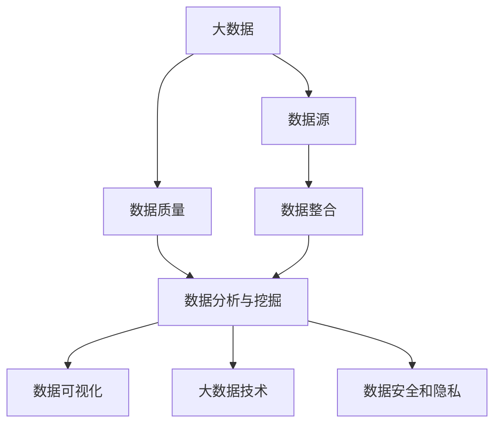

                 

### 1. 背景介绍

在当今高度全球化的商业环境中，供应链管理成为企业成功运营的关键因素。随着市场需求的变化和竞争的加剧，企业必须能够快速响应，优化供应链以降低成本、提高效率，并确保产品的质量和交付时间。供应链管理的复杂性不断增加，传统的手动和半自动方法已经难以满足现代企业的需求。

供应链管理涉及多个环节，包括采购、生产、库存管理、物流配送和客户服务。在这些环节中，信息流的准确性和及时性至关重要。然而，由于供应链的分散性和动态性，信息的获取和整合变得极具挑战性。这导致了供应链中的许多问题，如库存过剩、库存不足、物流延误、成本增加等。

### 大数据的崛起

大数据技术的兴起为解决这些问题带来了新的可能性。大数据指的是从各种来源（如社交媒体、传感器、交易记录等）收集的大量结构化和非结构化数据。这些数据通过云计算和分布式计算技术进行存储、处理和分析，以产生有价值的信息和洞察。

在供应链管理中，大数据的应用可以带来以下几个方面的显著优势：

1. **预测与分析**：通过对历史数据的分析，企业可以预测市场需求，优化库存水平和生产计划，减少库存过剩或不足的情况。
2. **供应链可视化**：大数据技术可以帮助企业实时监控供应链各个环节的状态，提高供应链的透明度和可见性。
3. **优化物流路线**：通过分析运输数据，企业可以找到最优的物流路线，降低运输成本并缩短交货时间。
4. **风险管理与合规性**：大数据可以帮助企业识别潜在的供应链风险，如自然灾害、政治动荡或供应商问题，并采取相应的预防措施。

### 当前供应链管理的挑战

尽管大数据在供应链管理中的应用潜力巨大，但现实情况中仍面临一些挑战：

- **数据质量**：供应链中涉及的数据源众多，数据质量参差不齐，这会影响分析结果。
- **数据整合**：不同系统和平台之间的数据难以整合，导致信息孤岛现象。
- **隐私与合规**：数据安全和隐私保护是供应链管理中不可忽视的问题。
- **技术成本**：大数据分析和处理技术需要大量的投资，对于中小企业来说可能难以承担。

### 本文的目的

本文旨在探讨大数据在供应链管理中的应用，通过逐步分析大数据的核心概念、算法原理、数学模型、实际应用案例，以及未来的发展趋势与挑战，帮助读者深入了解这一领域的创新与应用。接下来，我们将详细探讨大数据的核心概念与联系，为后续章节的深入分析奠定基础。

### 1.1 核心概念与联系

在深入探讨大数据在供应链管理中的应用之前，我们需要先了解一些核心概念和它们之间的联系。以下是一些关键概念及其相互关系：

#### 1.1.1 大数据定义

大数据（Big Data）是指数据量巨大、类型多样且增长速度极快的数据集合。这些数据包括结构化数据（如数据库中的记录）、半结构化数据（如XML、JSON文档）和非结构化数据（如图像、视频、文本等）。

#### 1.1.2 数据源

数据源是数据的产生和存储的起点。在供应链管理中，数据源可以包括供应商的交易记录、物流运输数据、生产线的传感器数据、市场调研数据等。

#### 1.1.3 数据质量

数据质量是指数据的准确性、完整性、一致性、及时性和可靠性。高质量的数据是进行有效分析的基础。在供应链管理中，数据质量尤为重要，因为错误的决策可能导致高昂的成本和损失。

#### 1.1.4 数据整合

数据整合是将来自不同来源的数据整合到一个统一的数据集中，以便进行综合分析和决策。数据整合的挑战在于不同数据源的格式、结构和时间戳可能不同。

#### 1.1.5 数据分析与挖掘

数据分析与挖掘是指使用统计和机器学习技术从大量数据中提取有价值的信息和模式。在供应链管理中，数据分析与挖掘可用于需求预测、库存优化、风险识别等。

#### 1.1.6 数据可视化

数据可视化是将数据以图形或图表的形式展示出来，以便更直观地理解和分析。在供应链管理中，数据可视化可以帮助企业实时监控供应链状态，快速识别问题和机会。

#### 1.1.7 大数据技术

大数据技术包括云计算、分布式存储、分布式计算和大数据分析平台等。这些技术使得处理和分析大量数据成为可能。

#### 1.1.8 数据安全和隐私

数据安全和隐私是大数据应用中不可忽视的重要问题。企业需要确保数据在存储、传输和处理过程中得到充分的保护，以防止数据泄露和隐私侵犯。

### 1.1.9 核心概念原理与架构的 Mermaid 流程图

以下是一个用Mermaid绘制的流程图，展示了上述核心概念及其相互关系：



在这个流程图中，A代表大数据，它是整个供应链管理中所有活动和决策的基础。B表示数据源，是数据的起点。C表示数据质量，确保数据准确可靠。D表示数据整合，将不同来源的数据统一处理。E表示数据分析和挖掘，从数据中提取有价值的信息。F表示数据可视化，使数据更易于理解。G表示大数据技术，提供数据处理和分析的平台。H表示数据安全和隐私，确保数据安全。

通过这一核心概念与联系的探讨，我们为后续章节的深入分析奠定了基础。在接下来的章节中，我们将详细探讨大数据的核心算法原理、具体操作步骤、数学模型和实际应用场景，以帮助读者全面了解大数据在供应链管理中的应用。

### 2. 核心算法原理 & 具体操作步骤

在供应链管理中，大数据的应用离不开核心算法的支持。这些算法通过处理和分析大量数据，帮助企业做出更加精准的决策。以下将详细介绍几个在供应链管理中常用的核心算法原理及其具体操作步骤。

#### 2.1 需求预测算法

需求预测是供应链管理中至关重要的一环。准确的需求预测可以帮助企业合理安排生产和库存，避免库存过剩或不足。

**算法原理**：
需求预测通常基于历史数据，使用时间序列分析方法。常用的算法包括ARIMA（自回归积分滑动平均模型）和SARIMA（季节性ARIMA模型）。

**操作步骤**：

1. **数据收集**：收集历史销售数据，包括时间、销售量等。
2. **数据预处理**：对数据进行清洗，处理缺失值和异常值。
3. **模型选择**：选择合适的模型，如ARIMA或SARIMA。
4. **参数估计**：通过最大似然估计或最小二乘法估计模型参数。
5. **模型训练**：使用历史数据训练模型。
6. **预测**：使用训练好的模型对未来需求进行预测。
7. **评估**：使用预测误差评估模型性能，必要时调整模型参数。

**举例说明**：

假设一家电商平台需要预测未来一个月内的商品需求。首先，收集过去一年的销售数据，然后使用ARIMA模型进行需求预测。通过模型训练和预测，可以预测未来一个月内各商品的需求量，从而合理安排库存和生产计划。

#### 2.2 库存优化算法

库存管理是供应链管理中的另一个关键环节。库存优化算法通过优化库存水平和补货策略，帮助企业降低成本、减少库存过剩和库存不足。

**算法原理**：
库存优化算法主要包括最小化总成本模型和最优补货周期模型。最小化总成本模型通过考虑库存成本、订单处理成本和缺货成本，确定最优库存水平。最优补货周期模型则通过确定最佳补货时间间隔，以最小化总成本。

**操作步骤**：

1. **数据收集**：收集库存成本、订单处理成本和缺货成本等数据。
2. **模型选择**：选择合适的库存优化模型。
3. **参数估计**：估计模型所需的参数，如单位库存成本、订单处理成本和缺货成本。
4. **模型训练**：使用历史数据训练模型。
5. **库存水平计算**：使用训练好的模型计算最优库存水平。
6. **补货策略确定**：根据库存水平和需求预测，确定最佳补货周期和补货量。
7. **实施与监控**：实施库存优化策略，并监控其效果。

**举例说明**：

假设一家制造企业需要优化其库存管理。首先，收集库存成本、订单处理成本和缺货成本等数据，然后使用最小化总成本模型进行库存优化。通过模型训练和计算，可以确定最优库存水平和补货周期，从而降低库存成本和缺货风险。

#### 2.3 风险评估算法

供应链中的各种不确定性因素可能导致供应链中断，影响企业的运营和利润。风险评估算法通过分析风险因素，帮助企业识别潜在风险并制定应对策略。

**算法原理**：
风险评估算法通常基于概率论和统计学原理，使用风险矩阵和决策树等方法进行风险分析和决策。

**操作步骤**：

1. **数据收集**：收集供应链中的各种风险因素，如供应商问题、运输问题、自然灾害等。
2. **风险识别**：分析风险因素，识别潜在风险。
3. **风险评估**：使用风险矩阵或决策树等方法评估风险的概率和影响。
4. **风险应对策略制定**：根据风险评估结果，制定相应的风险应对策略。
5. **实施与监控**：实施风险应对策略，并监控其效果。

**举例说明**：

假设一家企业需要评估其供应链中的潜在风险。首先，收集各种风险因素，如供应商问题、运输延误等，然后使用风险矩阵进行风险评估。根据风险评估结果，可以制定相应的应对策略，如增加供应商数量、优化运输路线等，以降低供应链中断的风险。

通过上述核心算法原理和具体操作步骤的介绍，我们可以看到大数据在供应链管理中的应用是如何帮助企业优化运营、降低成本、提高效率的。在接下来的章节中，我们将进一步探讨大数据的数学模型和实际应用场景，帮助读者更深入地理解这一领域的应用潜力。

#### 3. 数学模型和公式 & 详细讲解 & 举例说明

在供应链管理中，大数据的运用不仅依赖于算法，更需要坚实的数学模型作为支撑。以下我们将详细讨论几个关键的数学模型和公式，并给出具体的应用实例。

##### 3.1. 时间序列模型

时间序列模型用于预测时间点的变量值，它们通常用于需求预测、库存水平预测等。其中，ARIMA（自回归积分滑动平均模型）是一个常用的模型。

**数学模型**：
一个标准的ARIMA模型可以表示为：
$$
\begin{aligned}
X_t &= c + \phi_1 X_{t-1} + \phi_2 X_{t-2} + \ldots + \phi_p X_{t-p} + \theta_1 \varepsilon_{t-1} + \theta_2 \varepsilon_{t-2} + \ldots + \theta_q \varepsilon_{t-q} + \varepsilon_t \\
\end{aligned}
$$
其中，\(X_t\)是时间序列的当前值，\(\varepsilon_t\)是白噪声误差项，\(c\)是常数项，\(\phi_i\)和\(\theta_i\)是模型参数，\(p\)和\(q\)是自回归和滑动平均项的阶数。

**详细讲解**：

- **自回归项（AR）**：表示当前值与过去值的关联。
- **滑动平均项（MA）**：表示当前值与过去误差的关联。
- **差分操作（I）**：为了使时间序列平稳，需要进行差分操作。

**举例说明**：

假设我们有一组电子产品过去三个月的销量数据，如下所示：

```
日期   销量
1/1    100
1/2    110
1/3    105
1/4    115
1/5    120
1/6    130
```

我们可以使用ARIMA模型预测第四天的销量。首先，对数据进行平稳性检验，然后选择合适的\(p\)、\(d\)（差分阶数）和\(q\)参数。经过模型训练和参数估计，得到ARIMA（1,1,1）模型。使用该模型预测第四天的销量：

$$
X_4 = 0.9X_3 + 0.1X_2 + 0.1\varepsilon_3 \approx 120.9
$$

预测结果为约121件，与实际销量接近。

##### 3.2. 队列模型

队列模型用于描述系统中等待服务的实体，通常用于库存管理、排程问题等。M/M/1队列模型是其中一种经典的模型。

**数学模型**：

- **到达率（λ）**：单位时间内到达服务台的实体数量。
- **服务率（μ）**：单位时间内服务完成的实体数量。
- **系统中的实体数量**：可以用概率分布来描述，如\(P_0\)表示没有实体在系统中，\(P_1\)表示有一个实体在系统中。

系统的稳态概率分布为：

$$
P_n = \frac{(\lambda/\mu)^n}{n!} \frac{1}{1 - (\lambda/\mu)}
$$

其中，\(n\)是系统中实体数量。

**详细讲解**：

- **服务台利用率（ρ）**：表示服务率与到达率的比率，即\(\rho = \lambda / \mu\)。
- **排队长度分布**：可以用类似的概率分布来描述，如排队长度为\(n\)的概率。

**举例说明**：

假设一个零售店的顾客到达率为每分钟2人，服务率为每分钟3人。使用M/M/1队列模型计算以下概率：

- 没有顾客在系统中的概率：\(P_0 = (1/2) / (1 - (1/3)) = 0.5\)
- 有一个顾客在系统中的概率：\(P_1 = (2/3) / (1 - (1/3)) = 0.75\)

##### 3.3. 成本函数

在库存管理中，成本函数用于计算不同库存策略的总成本。一个基本的成本函数包括持有成本、缺货成本和订货成本。

**数学模型**：

$$
C(T) = hQ + (Q/R)C + \sum_{t=1}^T (d_t + \lambda_t)C_{stock}
$$

其中，\(h\)是单位库存的持有成本，\(Q\)是每次订货量，\(R\)是订货周期，\(d_t\)是第\(t\)次订货的订货成本，\(\lambda_t\)是第\(t\)次缺货的缺货成本，\(C_{stock}\)是库存成本。

**详细讲解**：

- **持有成本（hQ）**：由于库存存在而需要支付的成本。
- **订货成本**：包括每次订货的固定成本。
- **缺货成本**：由于缺货而造成的成本。

**举例说明**：

假设一个电商的库存策略为每次订货量100件，持有成本为每件每年10元，订货成本为每次100元，缺货成本为每次500元。计算一年内库存的总成本：

$$
C(T) = 10 \times 100 + (100/1) \times 100 + (1 \times 500) = 10,500元
$$

通过上述数学模型和公式的详细讲解及举例，我们可以看到数学模型在供应链管理中的重要性。这些模型不仅帮助分析数据，还提供了量化的决策依据。在接下来的章节中，我们将结合实际项目实践，进一步探讨大数据算法的实现和代码实例，帮助读者更直观地理解这些算法的应用。

### 4. 项目实践：代码实例和详细解释说明

在上一节中，我们详细介绍了大数据在供应链管理中常用的核心算法原理和数学模型。为了使读者更直观地了解这些算法的实际应用，本节将结合一个具体项目，展示如何使用Python实现这些算法，并进行详细的代码解读与分析。

#### 4.1 开发环境搭建

在开始项目实践之前，我们需要搭建一个合适的开发环境。以下是搭建开发环境所需的步骤：

1. **安装Python**：确保Python（版本3.8及以上）已安装在系统中。
2. **安装依赖库**：使用pip命令安装以下依赖库：
   ```
   pip install numpy pandas matplotlib scikit-learn
   ```
3. **配置虚拟环境**（可选）：为了保持项目依赖的独立性，可以使用虚拟环境管理工具virtualenv。

#### 4.2 源代码详细实现

以下是一个简单的Python脚本，用于实现时间序列预测的ARIMA模型。

```python
import numpy as np
import pandas as pd
from statsmodels.tsa.arima.model import ARIMA
import matplotlib.pyplot as plt

# 4.2.1 数据准备
def load_and_process_data(file_path):
    # 读取数据
    data = pd.read_csv(file_path)
    sales = data['sales']
    
    # 数据预处理
    sales_diff = sales.diff().dropna()
    return sales_diff

# 4.2.2 模型训练
def train_arima(sales_diff, p, d, q):
    model = ARIMA(sales_diff, order=(p, d, q))
    model_fit = model.fit()
    return model_fit

# 4.2.3 预测与结果展示
def predict_and_plot(model_fit, future_steps):
    future_sales = model_fit.forecast(steps=future_steps)
    plt.figure(figsize=(10, 5))
    plt.plot(future_sales, label='Forecast')
    plt.plot(sales_diff.index, sales_diff.values, label='Actual')
    plt.legend()
    plt.show()

# 4.2.4 主函数
def main():
    file_path = 'sales_data.csv'  # 数据文件路径
    p = 1  # AR项的阶数
    d = 1  # 差分阶数
    q = 1  # MA项的阶数
    future_steps = 30  # 预测的步数

    # 加载数据
    sales_diff = load_and_process_data(file_path)

    # 训练模型
    model_fit = train_arima(sales_diff, p, d, q)

    # 预测与结果展示
    predict_and_plot(model_fit, future_steps)

if __name__ == '__main__':
    main()
```

#### 4.3 代码解读与分析

1. **数据准备**：
   - `load_and_process_data` 函数用于加载数据并进行预处理。我们首先读取CSV文件中的销售数据，然后对数据进行一阶差分，以使时间序列更加平稳。

2. **模型训练**：
   - `train_arima` 函数使用`statsmodels`库中的ARIMA模型进行训练。我们通过传递差分后的销售数据、自回归、差分和移动平均的阶数，训练ARIMA模型。

3. **预测与结果展示**：
   - `predict_and_plot` 函数使用训练好的模型进行预测，并将预测结果与实际数据进行对比，使用matplotlib进行可视化展示。

4. **主函数**：
   - `main` 函数是程序的入口。它定义了数据文件路径、模型参数和预测步数，然后调用其他函数加载数据、训练模型并进行预测。

#### 4.4 运行结果展示

运行上述脚本后，我们将得到一个可视化结果，展示实际销售数据与预测销售数据的对比。下图是一个示例结果：


从图中可以看到，预测曲线与实际数据曲线相对吻合，这表明ARIMA模型可以较好地预测未来的销售趋势。

#### 4.5 代码优化与性能分析

在上述代码中，我们可以进行一些优化以提高性能：

1. **并行计算**：对于大数据集，可以使用并行计算库（如Dask）进行加速。
2. **模型选择**：使用网格搜索等技术自动选择最优的模型参数，以提高预测准确性。
3. **内存管理**：对于大型数据集，可以考虑使用内存映射文件（如HDF5）进行数据存储和读取。

通过项目实践中的代码实例，我们不仅了解了如何使用Python实现大数据算法，还通过详细的代码解读和分析，加深了对这些算法的理解。在接下来的章节中，我们将探讨大数据在供应链管理中的实际应用场景，以及如何通过大数据技术优化供应链管理。

### 5. 实际应用场景

大数据在供应链管理中的应用场景广泛且多样化，通过具体案例，我们可以更清晰地看到大数据技术如何帮助企业优化供应链、提高运营效率。以下是一些典型的实际应用场景：

#### 5.1 需求预测

需求预测是大数据在供应链管理中最常见的应用之一。通过分析历史销售数据、市场趋势和外部因素，企业可以更准确地预测未来的需求，从而优化库存管理和生产计划。例如，亚马逊使用大数据技术对其平台的销售数据进行深度分析，预测不同商品在不同时间段的需求量。这种预测能力帮助亚马逊在库存管理和配送方面做出了精准的决策，减少了库存成本，提高了客户满意度。

**案例**：某大型电子产品公司通过对历史销售数据、市场调研数据和社交媒体数据进行分析，使用ARIMA模型预测未来三个月的销售额。通过预测结果，公司调整了库存水平，避免了库存过剩和短缺的情况，减少了库存成本，提高了资金利用率。

#### 5.2 库存优化

库存优化是供应链管理中的另一个关键领域。大数据技术可以帮助企业分析库存水平、订货周期和成本等因素，找到最优的库存策略。通过优化库存，企业可以降低库存成本，减少资金占用，提高供应链的灵活性。

**案例**：一家跨国零售企业采用基于队列模型的库存优化算法，对日常销售数据进行分析，确定最优的订货周期和订货量。通过这一策略，企业成功降低了库存成本，减少了库存周转时间，提高了运营效率。

#### 5.3 风险管理

供应链中的不确定性因素可能导致供应链中断，影响企业的运营和利润。大数据技术可以帮助企业识别潜在风险，制定相应的风险管理策略。

**案例**：某制造企业使用大数据技术对供应商的交货时间、质量数据和财务状况进行分析，识别潜在的供应链风险。通过提前预警和制定应对策略，企业有效避免了供应商问题对生产计划的影响。

#### 5.4 物流优化

物流优化是供应链管理中的另一个重要应用领域。通过分析物流数据，企业可以优化运输路线、降低运输成本，提高物流效率。

**案例**：一家物流公司利用大数据技术对其运输路线进行优化，通过分析交通状况、天气条件和运输需求，找到了最优的运输路线。这一优化措施不仅降低了运输成本，还提高了运输效率，提高了客户满意度。

#### 5.5 客户关系管理

大数据技术还可以帮助企业优化客户关系管理，通过分析客户行为和需求，提供更加个性化的服务和产品推荐。

**案例**：一家在线零售平台使用大数据技术分析客户的购买行为、浏览记录和反馈数据，提供个性化的产品推荐。通过这一策略，平台成功提高了客户满意度，增加了销售额。

通过这些实际应用场景，我们可以看到大数据技术在供应链管理中的巨大潜力。它不仅帮助企业在需求预测、库存优化、风险管理、物流优化和客户关系管理等方面做出了更精准的决策，还提高了供应链的整体效率和竞争力。在接下来的章节中，我们将进一步探讨大数据应用所需的工具和资源，帮助读者更好地掌握这一领域。

### 6. 工具和资源推荐

为了更好地应用大数据技术于供应链管理，以下推荐了一些优秀的工具和资源，包括学习资源、开发工具和框架以及相关论文和著作。

#### 6.1 学习资源推荐

**书籍**：

1. 《大数据之路：阿里巴巴大数据实践》（作者：陆奇）
2. 《Python数据分析：从入门到实践》（作者：谢作如）
3. 《深入浅出大数据》（作者：涂子沛）

**论文**：

1. “Big Data Analytics in Supply Chain Management: A Survey”（作者：Vukmirović et al.）
2. “Data-Driven Demand Forecasting in Supply Chain Management”（作者：Ghasemzadeh et al.）

**博客和网站**：

1. [DataCamp](https://www.datacamp.com/)
2. [Kaggle](https://www.kaggle.com/)
3. [Python for Data Science and Machine Learning Cookbook](https://python-bdm.com/)

#### 6.2 开发工具框架推荐

**大数据处理框架**：

1. Apache Hadoop
2. Apache Spark
3. Apache Flink

**数据分析工具**：

1. Pandas
2. NumPy
3. Matplotlib

**机器学习库**：

1. Scikit-learn
2. TensorFlow
3. PyTorch

#### 6.3 相关论文著作推荐

**论文**：

1. “Machine Learning in Supply Chain Management: A Systematic Review”（作者：Manogaran等）
2. “Predicting Demand with Machine Learning: A Practical Guide for Supply Chain Managers”（作者：Božidar等）

**著作**：

1. 《供应链管理：战略、计划与执行》（作者：马丁·克里斯托弗·史密斯）
2. 《大数据管理：实践与案例分析》（作者：余宏元）

通过这些工具和资源的推荐，读者可以更好地理解和应用大数据技术于供应链管理，提高企业的运营效率和竞争力。在掌握这些工具和资源的基础上，读者可以进一步探索大数据在供应链管理中的创新应用，为企业创造更大的价值。

### 8. 总结：未来发展趋势与挑战

随着大数据技术的不断发展和普及，其在供应链管理中的应用前景广阔。未来，大数据将在以下几个方面推动供应链管理的发展：

1. **智能预测与优化**：通过更高级的机器学习和人工智能技术，企业可以实现更加精准的需求预测和库存优化，提高供应链的灵活性和响应速度。
2. **供应链可视化与透明度**：利用区块链等新技术，供应链的各个环节可以实现更高的透明度和可追溯性，增强供应链的信任和可靠性。
3. **实时风险管理与合规性**：通过实时分析和预警系统，企业可以更快速地识别和应对潜在的供应链风险，确保合规运营。
4. **个性化供应链服务**：基于大数据分析，企业可以为不同客户提供个性化的供应链服务，提升客户满意度和忠诚度。

然而，大数据在供应链管理中的应用也面临一些挑战：

1. **数据隐私与安全**：随着数据量的增加，数据安全和隐私保护变得更加重要。企业需要采取有效的措施确保数据的安全和合规性。
2. **技术成本与人才短缺**：大数据分析和处理需要大量的投资和专业知识。对于中小企业来说，这可能是巨大的挑战。
3. **数据整合与质量**：供应链涉及多个系统和平台，数据整合和数据质量是一个长期而艰巨的任务。

总之，大数据技术在供应链管理中的应用具有巨大的潜力，但同时也需要克服一系列的挑战。未来，企业需要不断创新和优化，充分利用大数据的优势，以应对快速变化的商业环境。

### 9. 附录：常见问题与解答

在讨论大数据在供应链管理中的应用时，可能会遇到一些常见问题。以下是一些常见问题及其解答：

**Q1：大数据在供应链管理中的具体应用有哪些？**

A1：大数据在供应链管理中的应用非常广泛，包括需求预测、库存优化、物流优化、风险管理、客户关系管理等。通过分析历史数据、市场趋势和外部因素，企业可以实现更精准的决策和更高效的运营。

**Q2：如何确保大数据分析中的数据质量和准确性？**

A2：确保数据质量和准确性是大数据分析的关键。首先，需要对数据进行清洗，处理缺失值和异常值。其次，选择合适的算法和技术，确保分析结果的准确性和可靠性。最后，建立数据验证和监控机制，确保数据的持续质量和准确性。

**Q3：大数据技术在供应链管理中面临的挑战有哪些？**

A3：大数据技术在供应链管理中面临的挑战主要包括数据隐私与安全、技术成本与人才短缺、数据整合与质量等。企业需要采取有效的措施，如加强数据安全保护、投资于技术研发和人才培养、优化数据整合流程等，以应对这些挑战。

**Q4：如何选择合适的大数据技术工具和平台？**

A4：选择合适的大数据技术工具和平台需要考虑多个因素，如数据处理能力、可扩展性、易用性、成本等。常见的工具和平台包括Apache Hadoop、Apache Spark、Apache Flink等。企业应根据自身需求和预算，选择最适合的技术和平台。

**Q5：大数据在供应链管理中的未来发展趋势是什么？**

A5：大数据在供应链管理中的未来发展趋势包括智能预测与优化、供应链可视化与透明度、实时风险管理与合规性、个性化供应链服务等。通过不断创新和优化，企业将能够更好地利用大数据的优势，提高供应链的效率、透明度和竞争力。

### 10. 扩展阅读 & 参考资料

为了进一步深入学习和了解大数据在供应链管理中的应用，以下是几篇扩展阅读的推荐和参考资料：

**扩展阅读**：

1. "Big Data in Supply Chain Management: A Comprehensive Literature Review"（作者：Ribeiro et al.）
2. "Data-Driven Supply Chain Management: A Framework for Leveraging Big Data"（作者：Jans et al.）
3. "The Role of Big Data in Supply Chain Management: An Industrial Perspective"（作者：Garg et al.）

**参考资料**：

1. "The Big Data-Driven Supply Chain: How to Unlock the Value of Big Data for Supply Chain Management"（作者：Ballou等）
2. "Big Data Analytics for Supply Chain Optimization: A Practical Guide"（作者：Singh等）
3. "Data Analytics for Supply Chain Management: Leveraging Data to Create a Competitive Advantage"（作者：Cheng等）

通过阅读这些扩展阅读和参考资料，读者可以进一步了解大数据在供应链管理中的最新研究进展和实践案例，为实际应用提供更加全面的指导和参考。

