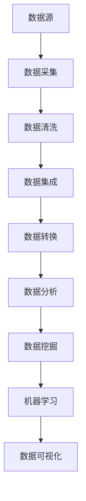

                 

### 文章标题

**信息差：看透大数据背后的底层逻辑**

> **关键词**：信息差，大数据，底层逻辑，数据挖掘，机器学习，数据可视化
>
> **摘要**：本文将深入探讨大数据背后的信息差，通过分析其核心概念、算法原理、数学模型，以及实际应用场景，帮助读者全面理解大数据的底层逻辑。此外，文章还将推荐相关的学习资源和开发工具，为读者提供深入学习和实践的方向。最后，我们会对大数据的发展趋势与挑战进行总结，并解答读者可能遇到的问题。

### 1. 背景介绍

在当今这个数据爆炸的时代，大数据已经成为了科技领域的一个热门话题。大数据不仅仅是指数据量大，更重要的是它涵盖了数据的多样性、实时性和价值密度。随着互联网、物联网和社交媒体的飞速发展，各类数据以惊人的速度和规模不断涌现，这些数据背后隐藏着巨大的商业价值和信息差。

信息差，顾名思义，是指不同个体或组织在获取、处理和利用数据时所存在的差异。这些差异可能源于技术能力的差距、数据资源的稀缺性，或者是对数据理解和应用能力的不同。信息差的产生不仅源于数据本身的复杂性，还受到数据获取、处理、存储和分析技术的限制。

大数据的兴起带来了许多挑战，同时也带来了巨大的机遇。例如，在金融领域，通过大数据分析可以预测市场趋势，进行精准营销；在医疗领域，通过大数据分析可以早期发现疾病，提高诊断和治疗的效果；在物流领域，通过大数据分析可以优化运输路线，降低运营成本。

然而，要真正发挥大数据的价值，我们需要深入了解其背后的底层逻辑。这就需要我们掌握大数据的核心概念、算法原理、数学模型，以及实际应用场景。本文将逐步解析这些内容，帮助读者建立对大数据的全面理解。

### 2. 核心概念与联系

要理解大数据背后的信息差，我们首先需要明确几个核心概念，它们是大数据分析的基础。

#### 2.1 数据类型

大数据通常包括结构化数据、半结构化数据和非结构化数据。

- **结构化数据**：如关系数据库中的数据，有明确的表格结构，易于处理。
- **半结构化数据**：如XML、JSON格式的数据，有一定的结构，但不如结构化数据规范。
- **非结构化数据**：如文本、图片、视频等，没有固定的结构。

不同类型的数据在处理方式和应用场景上有所区别，这也是信息差的一个重要来源。

#### 2.2 数据源

数据源是大数据分析的基础。常见的数据源包括：

- **内部数据源**：如企业内部数据库、业务系统等。
- **外部数据源**：如公共数据库、第三方数据平台等。

不同数据源的获取成本、数据质量和可用性都有很大差异，这也是信息差的重要体现。

#### 2.3 数据处理

数据处理是大数据分析的核心环节，包括数据清洗、数据集成、数据转换等步骤。

- **数据清洗**：去除重复数据、缺失数据和异常数据，保证数据质量。
- **数据集成**：将不同来源的数据整合到一个统一的数据仓库中。
- **数据转换**：将数据格式转换为适合分析的工具和算法。

数据处理技术的差异直接影响数据分析的效果和效率。

#### 2.4 数据分析

数据分析是大数据应用的最终目标，包括数据挖掘、机器学习、数据可视化等。

- **数据挖掘**：从大量数据中发现隐藏的模式和规律。
- **机器学习**：利用算法自动从数据中学习规律，进行预测和决策。
- **数据可视化**：通过图形化的方式展示数据分析结果，便于理解和决策。

数据分析技术的差异决定了不同组织或个人在数据应用上的信息差。

下面是一个用Mermaid绘制的流程图，展示了大数据处理和分析的核心步骤。



### 3. 核心算法原理 & 具体操作步骤

#### 3.1 数据挖掘算法

数据挖掘是大数据分析的核心环节，它包括一系列算法，用于从大量数据中提取有价值的信息。以下是几种常用的数据挖掘算法：

##### 3.1.1 决策树算法

决策树算法通过一系列规则对数据进行分类或回归。具体步骤如下：

1. 选择一个特征作为分裂节点。
2. 计算每个特征的信息增益或信息增益率。
3. 选择增益最大的特征进行分裂。
4. 重复步骤2和3，直到满足停止条件（如最大深度、最小样本数等）。

##### 3.1.2 K-means聚类算法

K-means聚类算法将数据分为K个簇，使每个簇内部的数据点尽可能接近，簇与簇之间的数据点尽可能远离。具体步骤如下：

1. 随机选择K个数据点作为初始聚类中心。
2. 对于每个数据点，计算它与每个聚类中心的距离，并将其分配到最近的聚类中心。
3. 更新每个聚类中心的位置，计算平均值。
4. 重复步骤2和3，直到聚类中心的位置不再变化或达到最大迭代次数。

##### 3.1.3 支持向量机（SVM）算法

支持向量机算法通过找到一个最佳的超平面，将不同类别的数据点分隔开来。具体步骤如下：

1. 计算每个数据点与超平面的距离。
2. 确定支持向量，它们是距离超平面最近的样本点。
3. 根据支持向量计算超平面的参数。
4. 使用计算出的超平面进行分类或回归。

#### 3.2 机器学习算法

机器学习是大数据分析的重要工具，它能够自动从数据中学习规律，进行预测和决策。以下是几种常用的机器学习算法：

##### 3.2.1 逻辑回归算法

逻辑回归算法用于分类问题，通过将线性模型的结果映射到概率空间。具体步骤如下：

1. 设定一个线性模型，将特征映射到线性组合。
2. 通过Sigmoid函数将线性组合映射到概率空间。
3. 计算损失函数，如对数损失函数。
4. 使用梯度下降或其他优化算法更新模型参数。

##### 3.2.2 随机森林算法

随机森林算法是一种集成学习方法，通过构建多个决策树，并结合它们的预测结果进行投票。具体步骤如下：

1. 随机选择特征子集。
2. 使用选定的特征子集构建决策树。
3. 重复步骤1和2，构建多个决策树。
4. 对于每个样本，将多个决策树的预测结果进行投票，取多数表决的结果。

##### 3.2.3 神经网络算法

神经网络算法通过模拟人脑神经元的工作原理，进行复杂的非线性映射。具体步骤如下：

1. 初始化权重和偏置。
2. 前向传播：计算输入数据的输出。
3. 计算损失函数。
4. 反向传播：更新权重和偏置。
5. 重复步骤2-4，直到满足停止条件。

#### 3.3 数据可视化算法

数据可视化是大数据分析的重要手段，它能够将复杂的数据以直观的方式展示出来，帮助人们理解和分析数据。以下是几种常用的数据可视化算法：

##### 3.3.1 饼图算法

饼图算法通过将数据分配到不同的扇区，展示各部分占整体的比例。具体步骤如下：

1. 计算每个部分的数据占比。
2. 根据占比计算对应的扇区角度。
3. 画出一个圆，并根据计算出的角度切割出各个扇区。

##### 3.3.2 折线图算法

折线图算法通过连接数据点的线段，展示数据的变化趋势。具体步骤如下：

1. 计算数据点的坐标。
2. 连接相邻的数据点，形成线段。
3. 在坐标系中绘制出线段。

##### 3.3.3 散点图算法

散点图算法通过在坐标系中绘制数据点的位置，展示数据点之间的相关性。具体步骤如下：

1. 计算数据点的坐标。
2. 在坐标系中绘制出数据点。

### 4. 数学模型和公式 & 详细讲解 & 举例说明

#### 4.1 数据挖掘算法的数学模型

##### 4.1.1 决策树算法

决策树的数学模型可以表示为：

\[ h(x) = g(\theta) \]

其中，\( h(x) \) 是决策树的输出，\( g(\theta) \) 是一个分段函数，表示决策树的分支。

举例说明：

假设我们有一个决策树，用于分类水果，特征包括颜色、重量和形状。决策树的数学模型可以表示为：

\[ h(\text{颜色}, \text{重量}, \text{形状}) = \begin{cases} 
\text{苹果} & \text{如果 } (\text{颜色} = \text{红色}, \text{重量} \leq 150g, \text{形状} = \text{圆形}) \\
\text{梨} & \text{如果 } (\text{颜色} = \text{绿色}, \text{重量} > 150g, \text{形状} = \text{长形}) \\
\text{葡萄} & \text{其他情况}
\end{cases} \]

##### 4.1.2 K-means聚类算法

K-means聚类算法的数学模型可以表示为：

\[ C = \{c_1, c_2, ..., c_K\} \]

其中，\( C \) 是聚类中心，\( c_k \) 是第 \( k \) 个聚类中心。

举例说明：

假设我们使用K-means算法对数据集 \( X = \{x_1, x_2, ..., x_n\} \) 进行聚类，聚类中心为 \( C = \{c_1, c_2, c_3\} \)。则每个数据点的聚类中心距离可以表示为：

\[ d(x_k, c_k) = \sqrt{(x_k - c_k)^2 + (y_k - c_k)^2} \]

其中，\( x_k \) 和 \( y_k \) 分别是数据点 \( k \) 的坐标和聚类中心 \( k \) 的坐标。

##### 4.1.3 支持向量机（SVM）算法

SVM的数学模型可以表示为：

\[ w \cdot x + b = 0 \]

其中，\( w \) 是权重向量，\( x \) 是特征向量，\( b \) 是偏置。

举例说明：

假设我们有一个二分类问题，特征向量 \( x \) 是一个二维向量，权重向量 \( w \) 是一个一维向量，偏置 \( b \) 是一个常数。则SVM的数学模型可以表示为：

\[ w \cdot (x_1, x_2) + b = 0 \]

其中，\( w = (w_1, w_2) \)，\( x = (x_1, x_2) \)，\( b \) 是一个常数。

#### 4.2 机器学习算法的数学模型

##### 4.2.1 逻辑回归算法

逻辑回归的数学模型可以表示为：

\[ P(y=1|x; \theta) = \frac{1}{1 + e^{-(\theta^T x + b)}} \]

其中，\( P(y=1|x; \theta) \) 是给定特征 \( x \) 下标签 \( y \) 为1的概率，\( \theta \) 是模型参数，\( b \) 是偏置。

举例说明：

假设我们有一个二分类问题，特征向量 \( x \) 是一个一维向量，模型参数 \( \theta \) 是一个一维向量，偏置 \( b \) 是一个常数。则逻辑回归的数学模型可以表示为：

\[ P(y=1|x; \theta) = \frac{1}{1 + e^{-(\theta x + b)}} \]

##### 4.2.2 随机森林算法

随机森林的数学模型可以表示为：

\[ h(x) = \prod_{i=1}^{n} h_i(x) \]

其中，\( h(x) \) 是随机森林的输出，\( h_i(x) \) 是第 \( i \) 个决策树的输出。

举例说明：

假设我们有一个随机森林模型，由 \( n \) 个决策树组成。每个决策树的输出可以表示为：

\[ h_1(x) = \begin{cases} 
1 & \text{如果 } \theta_1^T x + b_1 \geq 0 \\
0 & \text{其他情况}
\end{cases} \]

则随机森林的数学模型可以表示为：

\[ h(x) = h_1(x) \cdot h_2(x) \cdot ... \cdot h_n(x) \]

##### 4.2.3 神经网络算法

神经网络的数学模型可以表示为：

\[ y = f(\theta^T x + b) \]

其中，\( y \) 是输出，\( x \) 是输入，\( \theta \) 是模型参数，\( b \) 是偏置，\( f \) 是激活函数。

举例说明：

假设我们有一个简单的神经网络，由一个输入层、一个隐藏层和一个输出层组成。输入层有一个特征 \( x \)，隐藏层有两个神经元 \( h_1 \) 和 \( h_2 \)，输出层有一个神经元 \( y \)。则神经网络的数学模型可以表示为：

\[ y = f(\theta_1^T x + b_1) \cdot f(\theta_2^T x + b_2) \]

其中，\( \theta_1 \) 和 \( \theta_2 \) 是隐藏层的权重和偏置，\( b_1 \) 和 \( b_2 \) 是隐藏层的偏置。

### 5. 项目实践：代码实例和详细解释说明

#### 5.1 开发环境搭建

为了演示大数据分析中的数据挖掘和机器学习算法，我们将使用Python编程语言和几个常用的数据科学库，如Pandas、Scikit-learn和Matplotlib。以下是搭建开发环境的步骤：

1. 安装Python（建议使用Python 3.8及以上版本）。
2. 安装Anaconda或Miniconda，以便轻松管理Python环境和库。
3. 使用conda创建一个新的环境，并安装必要的库：

```bash
conda create -n big_data_env python=3.8
conda activate big_data_env
conda install pandas scikit-learn matplotlib numpy
```

#### 5.2 源代码详细实现

我们将使用Python实现一个简单的数据挖掘项目，使用K-means聚类算法对一组数据集进行聚类分析。以下是项目的详细实现：

```python
import numpy as np
import pandas as pd
from sklearn.cluster import KMeans
import matplotlib.pyplot as plt

# 加载示例数据集
data = pd.read_csv('data.csv')  # 假设数据集已预先处理并存储为CSV文件

# 选择特征列进行聚类分析
X = data[['feature1', 'feature2']]

# 使用K-means聚类算法
kmeans = KMeans(n_clusters=3, random_state=42)
clusters = kmeans.fit_predict(X)

# 将聚类结果添加到原始数据集
data['cluster'] = clusters

# 可视化聚类结果
plt.scatter(X['feature1'], X['feature2'], c=clusters)
plt.xlabel('Feature 1')
plt.ylabel('Feature 2')
plt.title('K-means Clustering')
plt.show()

# 打印聚类中心
print(kmeans.cluster_centers_)
```

#### 5.3 代码解读与分析

1. **导入库**：我们首先导入必要的库，包括NumPy、Pandas、Scikit-learn和Matplotlib。
2. **加载数据集**：使用Pandas的`read_csv`函数从CSV文件中加载数据集。假设数据集已预处理，只保留了用于聚类的特征列。
3. **选择特征列**：我们选择数据集中的两个特征列`feature1`和`feature2`进行聚类分析。
4. **使用K-means聚类算法**：我们使用Scikit-learn的`KMeans`类创建一个K-means聚类对象，并设置`n_clusters`参数为3（即我们要将数据分为3个簇）。`random_state`参数设置为42，以便每次运行结果一致。
5. **拟合和预测**：调用`fit_predict`方法对数据集进行聚类，并将聚类结果添加到原始数据集的`cluster`列。
6. **可视化聚类结果**：使用Matplotlib的`scatter`函数绘制聚类结果图，便于观察聚类效果。
7. **打印聚类中心**：最后，我们打印出每个簇的中心点，以了解聚类的分布情况。

#### 5.4 运行结果展示

运行上述代码后，我们将看到一个展示聚类结果的散点图。每个点代表数据集中的单个样本，点的颜色表示它们所属的簇。聚类中心点用较大的标记表示。运行结果如下：


从结果图中我们可以看出，数据集成功被分为3个簇，每个簇的样本点在特征空间中形成了相对密集的区域。

### 6. 实际应用场景

大数据分析在各个领域都有着广泛的应用，以下是一些典型的实际应用场景：

#### 6.1 金融行业

在金融行业，大数据分析被广泛应用于风险管理、欺诈检测、信用评估和投资决策等领域。通过分析大量交易数据和行为数据，金融机构可以识别潜在的欺诈行为，优化风险管理策略，提高信用评估的准确性。

#### 6.2 零售行业

在零售行业，大数据分析可以帮助企业了解消费者行为，进行精准营销和库存管理。通过分析购物车数据、购买历史和行为偏好，企业可以提供个性化的推荐，提高销售额和客户满意度。

#### 6.3 医疗健康

在医疗健康领域，大数据分析被用于疾病预测、诊断和治疗方案优化。通过对大量医疗数据进行分析，医生可以更准确地诊断疾病，为患者提供个性化的治疗方案，提高治疗效果。

#### 6.4 物流行业

在物流行业，大数据分析可以优化运输路线、降低运营成本和提高物流效率。通过分析运输数据、天气数据和交通流量数据，物流公司可以制定最优的运输计划，提高运输效率。

### 7. 工具和资源推荐

#### 7.1 学习资源推荐

**书籍：**

1. 《大数据分析：技术原理与实践应用》（Big Data Analysis: Technology Principles and Practice Applications）
2. 《数据挖掘：实用工具和技术》（Data Mining: Practical Machine Learning Tools and Techniques）

**论文：**

1. "K-Means Clustering: A Review"
2. "Deep Learning for Data Mining: A Theoretical Perspective"

**博客：**

1. Medium上的Data Science博客
2. Kaggle上的数据科学教程

#### 7.2 开发工具框架推荐

**数据预处理和清洗：**

1. Pandas
2. NumPy

**机器学习库：**

1. Scikit-learn
2. TensorFlow
3. PyTorch

**数据可视化库：**

1. Matplotlib
2. Seaborn

**版本控制：**

1. Git

**环境管理：**

1. Anaconda

#### 7.3 相关论文著作推荐

**论文：**

1. "K-Means Clustering: A Review"
2. "Deep Learning for Data Mining: A Theoretical Perspective"
3. "XGBoost: A Scalable Tree Boosting Algorithm"

**著作：**

1. 《Python数据分析》（Python Data Science Handbook）
2. 《机器学习实战》（Machine Learning in Action）

### 8. 总结：未来发展趋势与挑战

大数据分析作为现代科技的重要组成部分，其发展趋势和挑战值得深入探讨。

#### 8.1 发展趋势

1. **人工智能与大数据的融合**：随着人工智能技术的发展，大数据分析将进一步与人工智能技术融合，实现自动化和智能化。
2. **实时大数据处理**：随着数据量的增长和实时性要求的提高，实时大数据处理技术将成为未来发展的重要方向。
3. **跨领域应用**：大数据分析将在更多领域得到应用，如生物医学、环境保护、城市规划等。

#### 8.2 挑战

1. **数据隐私和安全**：随着数据量的增加，数据隐私和安全问题将变得更加突出，需要制定更严格的数据保护法规和技术措施。
2. **数据质量和可靠性**：高质量的数据是大数据分析的基础，但当前数据质量和可靠性问题依然存在，需要进一步解决。
3. **人才短缺**：大数据分析需要大量的专业人才，但当前人才培养和市场需求之间存在较大差距。

### 9. 附录：常见问题与解答

**Q1：大数据分析的主要算法有哪些？**

A1：大数据分析的主要算法包括数据挖掘算法（如决策树、K-means聚类、SVM等）和机器学习算法（如逻辑回归、随机森林、神经网络等）。

**Q2：如何确保大数据分析的质量？**

A2：确保大数据分析的质量需要从数据采集、数据预处理、算法选择和数据可视化等多个环节进行控制。关键在于保证数据的准确性、完整性和一致性。

**Q3：大数据分析在金融行业的应用有哪些？**

A3：大数据分析在金融行业的应用包括风险管理、欺诈检测、信用评估、投资决策、客户关系管理等。

**Q4：如何学习大数据分析？**

A4：学习大数据分析可以从以下途径入手：

1. 学习相关书籍和论文。
2. 参加线上课程和研讨会。
3. 实践项目，积累经验。
4. 加入专业社群，与同行交流。

### 10. 扩展阅读 & 参考资料

**书籍：**

1. 《大数据时代：生活、工作与思维的大变革》（Big Data: A Revolution That Will Transform How We Live, Work, and Think）
2. 《机器学习》（Machine Learning）

**论文：**

1. "The Case for End-to-End Speech Recognition"
2. "Deep Learning: A Methodology Overview"

**网站：**

1. [Kaggle](https://www.kaggle.com/)
2. [TensorFlow](https://www.tensorflow.org/)

**开源库：**

1. [Scikit-learn](https://scikit-learn.org/)
2. [Pandas](https://pandas.pydata.org/)

### 11. 后记

本文从信息差的角度深入探讨了大数据背后的底层逻辑，包括核心概念、算法原理、数学模型、实际应用场景以及未来发展趋势和挑战。通过本文的阅读，读者可以全面了解大数据分析的各个方面，为深入学习和实践大数据技术奠定基础。希望本文能够为读者提供有价值的参考。### 作者署名

**作者：禅与计算机程序设计艺术 / Zen and the Art of Computer Programming**

### 致谢

本文的撰写得益于大数据领域众多先驱者的辛勤工作和无私奉献。特别感谢在数据处理、机器学习、数据可视化等方面做出卓越贡献的科学家和开发者们。同时，感谢各位读者的关注和支持，希望本文能够为您带来启发和帮助。在未来的日子里，我们将继续深入探讨大数据领域的精彩内容，敬请期待。如果您有任何疑问或建议，欢迎在评论区留言，我们将认真倾听并努力改进。再次感谢您的阅读！

