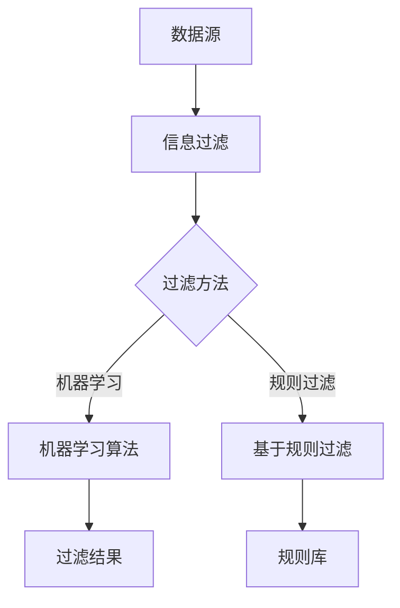
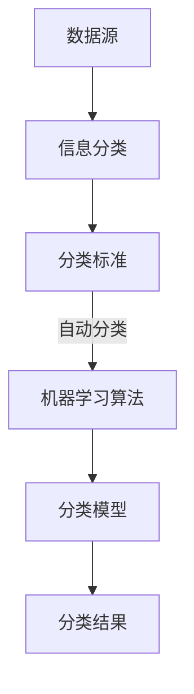
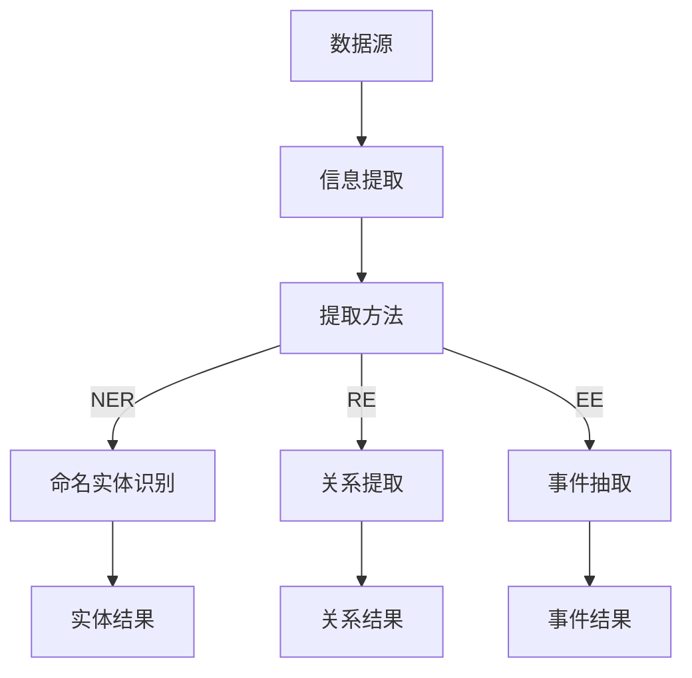
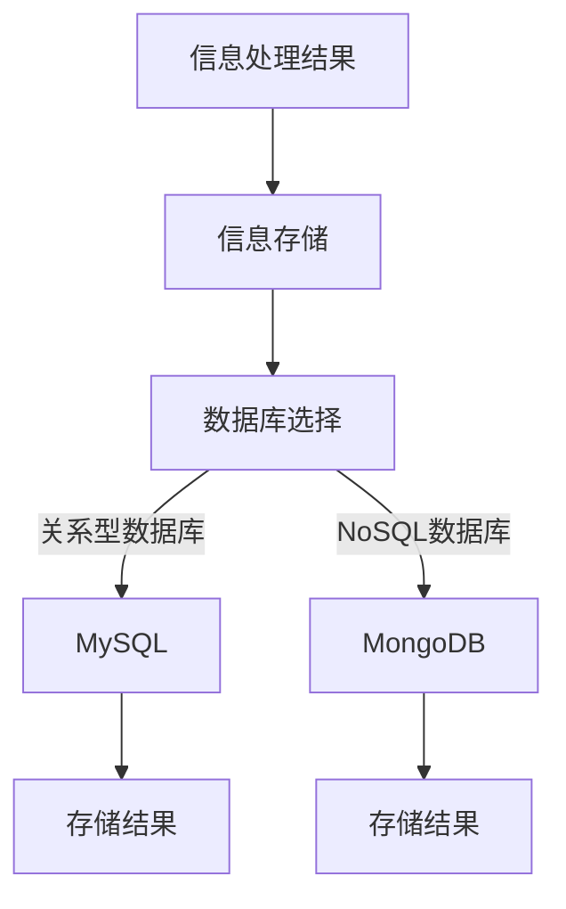
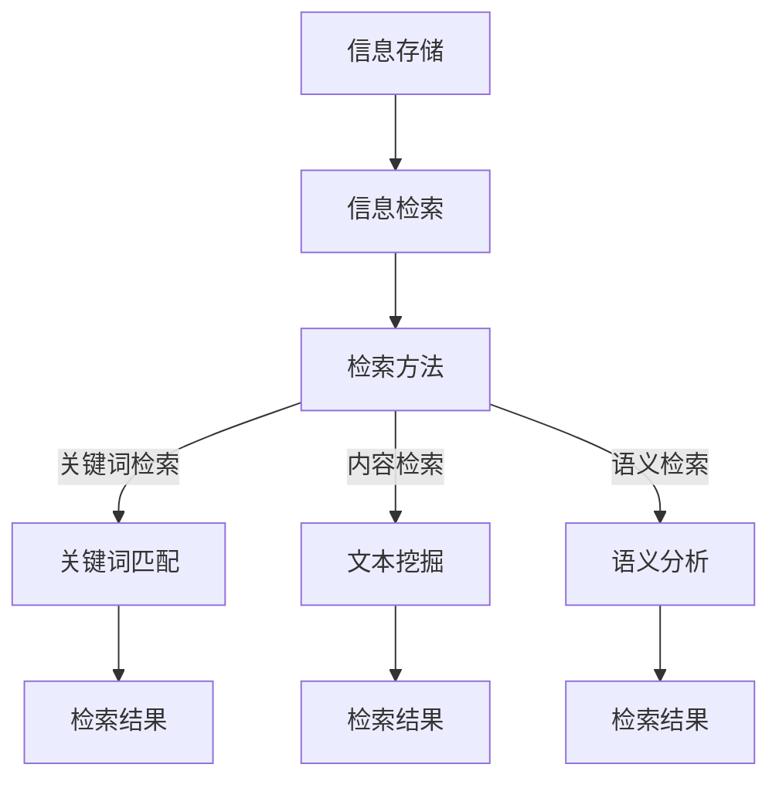
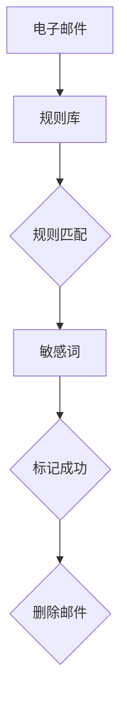
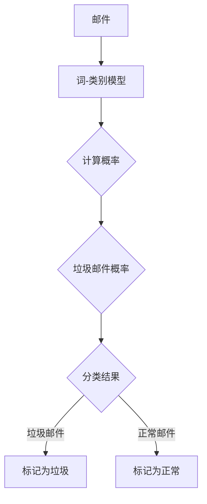
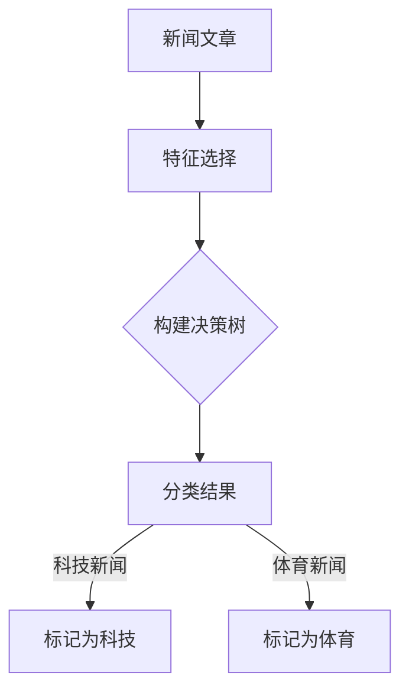
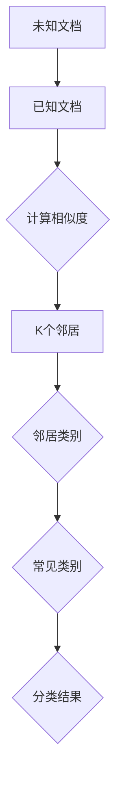
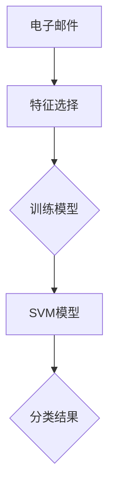

                 

### 1. 背景介绍

在当今信息爆炸的时代，数据和信息已经成为组织和社会的重要组成部分。随着互联网和数字技术的飞速发展，数据量以惊人的速度增长，从几年前的一份数据报告显示，全球数据量每两年就会翻一番。这种增长不仅带来了巨大的商业价值，同时也给信息管理带来了前所未有的挑战。

信息过载（Information Overload）是指人们接收到的信息量超过了其处理能力，从而导致信息处理效率下降、决策难度增加，甚至可能引发心理压力和焦虑。信息过载的主要来源包括社交媒体、电子邮件、即时通讯工具、在线新闻和广告等。在商业环境中，信息过载会影响员工的工作效率和企业的运营效率，而在个人生活中，则可能影响生活质量和个人健康。

信息复杂性（Information Complexity）是指数据和信息之间的相互关系和结构复杂性。复杂性不仅体现在数据量的庞大，还包括数据类型、数据来源、数据更新频率、数据关联性等多个方面。高复杂性的信息环境对信息处理提出了更高的要求，不仅需要强大的计算能力，还需要高效的算法和先进的技术手段。

面对信息过载和复杂性，有效的信息管理策略和实践变得至关重要。本文将深入探讨信息管理的重要性、核心概念、算法原理、数学模型以及实际应用，为读者提供一套系统化的解决方案。

本文的结构如下：

- **背景介绍**：概述信息过载和复杂性的现状及其影响。
- **核心概念与联系**：介绍信息管理的核心概念，并使用 Mermaid 流程图展示其架构。
- **核心算法原理 & 具体操作步骤**：详细讲解信息过滤、分类和提取等关键算法。
- **数学模型和公式 & 详细讲解 & 举例说明**：介绍用于信息管理的数学模型，并通过具体例子展示其应用。
- **项目实践：代码实例和详细解释说明**：提供实际项目中的代码实现和分析。
- **实际应用场景**：探讨信息管理在不同领域的应用案例。
- **工具和资源推荐**：推荐学习资源和开发工具。
- **总结：未来发展趋势与挑战**：展望信息管理的发展方向和面临的挑战。
- **附录：常见问题与解答**：回答读者可能关心的一些问题。
- **扩展阅读 & 参考资料**：提供进一步阅读的参考资料。

通过本文的逐步分析，我们希望能够帮助读者更好地理解和应对信息时代的挑战，提升信息管理的能力和效率。

### 2. 核心概念与联系

信息管理涉及多个核心概念，这些概念相互关联，构成了一个复杂但有序的架构。以下是这些核心概念及其相互关系的详细解释：

#### 2.1 信息过滤

信息过滤是指从大量数据中识别和提取有用信息的过程。其目的是减少信息过载，提高信息的可用性和可靠性。信息过滤可以采用多种方法，包括基于规则的过滤、机器学习算法和自然语言处理技术。其中，机器学习算法如贝叶斯过滤和决策树过滤在信息过滤中广泛应用。

**Mermaid 流程图：**



#### 2.2 信息分类

信息分类是将数据按照特定的标准或规则进行分组的过程。分类的目的是帮助用户快速查找和利用信息。分类方法包括手动分类和自动分类。自动分类通常利用机器学习算法，如K最近邻（K-Nearest Neighbors, K-NN）和支持向量机（Support Vector Machine, SVM）。

**Mermaid 流程图：**



#### 2.3 信息提取

信息提取是指从原始数据中抽取具有特定意义的信息片段。信息提取在数据挖掘、自然语言处理和文本挖掘等领域具有重要意义。常用的信息提取技术包括命名实体识别（Named Entity Recognition, NER）、关系提取（Relation Extraction）和事件抽取（Event Extraction）。

**Mermaid 流程图：**



#### 2.4 信息存储

信息存储是指将处理后的信息存入数据库或其他存储介质中，以便于后续的检索和使用。信息存储需要考虑数据的结构、存储效率和访问速度。常用的数据库技术包括关系型数据库（如MySQL、PostgreSQL）和NoSQL数据库（如MongoDB、Cassandra）。

**Mermaid 流程图：**



#### 2.5 信息检索

信息检索是指从大量信息中快速准确地查找所需信息的过程。信息检索技术包括基于关键词的检索、基于内容的检索和基于语义的检索。关键词检索是最常见的方法，而基于内容的检索和基于语义的检索则利用了文本挖掘和自然语言处理技术。

**Mermaid 流程图：**



通过上述核心概念及其相互关系的介绍，我们可以看到信息管理不仅涉及单一的技术方法，还需要多个技术手段的协同工作。接下来，我们将进一步探讨这些核心算法的原理和具体操作步骤，为读者提供更加深入的理解。

### 3. 核心算法原理 & 具体操作步骤

#### 3.1 信息过滤算法

信息过滤算法是信息管理中的基础，其目的是减少信息过载，提高信息的可用性。以下是几种常见的信息过滤算法及其操作步骤：

##### 3.1.1 基于规则的过滤

**原理：** 基于规则的过滤使用预定义的规则来识别和标记信息。规则通常由关键词、模式或逻辑条件组成。

**具体操作步骤：**
1. 收集和定义过滤规则。
2. 对每条信息进行规则匹配。
3. 标记匹配成功的信息。
4. 删除或保留不符合规则的信息。

**示例：** 假设我们有一个规则库，包含“禁止包含敏感词”的规则。我们使用此规则过滤一封电子邮件。



##### 3.1.2 贝叶斯过滤

**原理：** 贝叶斯过滤基于贝叶斯定理，通过计算信息属于某一类别的概率来过滤信息。

**具体操作步骤：**
1. 构建词-类别概率分布模型。
2. 对每条信息计算其类别概率。
3. 选择概率最高的类别作为该信息的类别。
4. 标记并分类信息。

**示例：** 假设我们使用贝叶斯过滤来分类一封邮件是否为垃圾邮件。



##### 3.1.3 决策树过滤

**原理：** 决策树过滤通过构建决策树模型来分类信息。每个节点代表一个特征，每个分支代表一个可能的值，叶子节点代表类别。

**具体操作步骤：**
1. 选择特征和分裂标准。
2. 构建决策树模型。
3. 对每条信息进行路径匹配。
4. 根据决策树输出类别。

**示例：** 假设我们使用决策树过滤来分类新闻文章。



#### 3.2 信息分类算法

信息分类是将信息按照特定标准进行分组的过程。以下是几种常见的信息分类算法及其操作步骤：

##### 3.2.1 K最近邻算法（K-Nearest Neighbors, K-NN）

**原理：** K-NN算法基于“相似度原则”，通过计算未知信息与已知信息的相似度来分类。

**具体操作步骤：**
1. 训练集准备：收集并标记已知信息。
2. 计算相似度：使用距离度量（如欧几里得距离、曼哈顿距离等）计算未知信息与已知信息的相似度。
3. 确定类别：选择相似度最高的K个邻居，并选择这K个邻居中最常见的类别作为未知信息的类别。

**示例：** 假设我们使用K-NN算法来分类文档。



##### 3.2.2 支持向量机（Support Vector Machine, SVM）

**原理：** SVM通过最大化分类边界来分类信息。

**具体操作步骤：**
1. 选择特征和核函数。
2. 训练SVM模型。
3. 对每条信息进行分类。

**示例：** 假设我们使用SVM算法来分类电子邮件。



通过上述核心算法的详细解释和示例，我们可以看到这些算法在信息过滤和分类中起到了至关重要的作用。接下来，我们将探讨信息管理的数学模型和公式，以及这些模型在实际应用中的具体实现。

### 4. 数学模型和公式 & 详细讲解 & 举例说明

在信息管理中，数学模型和公式提供了理论依据和计算工具，用于描述和优化信息处理过程。以下是几个关键的数学模型和公式，包括详细讲解和具体应用实例。

#### 4.1 贝叶斯公式

贝叶斯公式是概率论中用于计算条件概率的重要公式，广泛应用于信息过滤和分类。其公式如下：

\[ P(A|B) = \frac{P(B|A) \cdot P(A)}{P(B)} \]

其中：
- \( P(A|B) \) 表示在事件B发生的条件下事件A发生的概率。
- \( P(B|A) \) 表示在事件A发生的条件下事件B发生的概率。
- \( P(A) \) 表示事件A发生的概率。
- \( P(B) \) 表示事件B发生的概率。

**实例：** 假设我们使用贝叶斯公式来判断一封邮件是否为垃圾邮件。已知邮件是否为垃圾邮件的概率 \( P(垃圾邮件) \) 为0.01，且如果邮件是垃圾邮件，则包含特定关键词的概率 \( P(关键词|垃圾邮件) \) 为0.9。我们需要计算如果邮件包含关键词，它是垃圾邮件的概率 \( P(垃圾邮件|关键词) \)。

根据贝叶斯公式：

\[ P(垃圾邮件|关键词) = \frac{P(关键词|垃圾邮件) \cdot P(垃圾邮件)}{P(关键词)} \]

由于 \( P(关键词) \) 是未知数，我们可以使用全概率公式计算：

\[ P(关键词) = P(关键词|垃圾邮件) \cdot P(垃圾邮件) + P(关键词|正常邮件) \cdot P(正常邮件) \]

假设正常邮件包含关键词的概率 \( P(关键词|正常邮件) \) 为0.05，正常邮件的概率 \( P(正常邮件) \) 为0.99，则：

\[ P(关键词) = 0.9 \cdot 0.01 + 0.05 \cdot 0.99 \approx 0.0545 \]

因此：

\[ P(垃圾邮件|关键词) = \frac{0.9 \cdot 0.01}{0.0545} \approx 0.164 \]

这意味着如果邮件包含关键词，它是垃圾邮件的概率大约为16.4%。

#### 4.2 决策树分类指标

决策树分类指标用于评估决策树的分类效果。常见的指标包括准确率、召回率、精确率和F1分数。

- **准确率（Accuracy）**：分类正确的样本数占总样本数的比例。

\[ \text{准确率} = \frac{TP + TN}{TP + TN + FP + FN} \]

其中：
- \( TP \) 表示真正例（True Positive）。
- \( TN \) 表示真负例（True Negative）。
- \( FP \) 表示假正例（False Positive）。
- \( FN \) 表示假负例（False Negative）。

- **召回率（Recall）**：真正例中被正确分类的比例。

\[ \text{召回率} = \frac{TP}{TP + FN} \]

- **精确率（Precision）**：分类正确的样本数占分类为正样本数的比例。

\[ \text{精确率} = \frac{TP}{TP + FP} \]

- **F1分数（F1 Score）**：精确率和召回率的调和平均值。

\[ \text{F1分数} = 2 \cdot \frac{\text{精确率} \cdot \text{召回率}}{\text{精确率} + \text{召回率}} \]

**实例：** 假设我们使用决策树对邮件进行分类，得到以下混淆矩阵：

|      | 垃圾邮件 | 正常邮件 |
|------|----------|----------|
| 垃圾邮件 | 100      | 20       |
| 正常邮件 | 30       | 700      |

则：
- 真正例（\( TP \)）= 100
- 真负例（\( TN \)）= 700
- 假正例（\( FP \)）= 30
- 假负例（\( FN \)）= 20

准确率：

\[ \text{准确率} = \frac{100 + 700}{100 + 700 + 30 + 20} = \frac{800}{850} \approx 0.941 \]

召回率：

\[ \text{召回率} = \frac{100}{100 + 20} = \frac{100}{120} \approx 0.833 \]

精确率：

\[ \text{精确率} = \frac{100}{100 + 30} = \frac{100}{130} \approx 0.769 \]

F1分数：

\[ \text{F1分数} = 2 \cdot \frac{0.769 \cdot 0.833}{0.769 + 0.833} \approx 0.806 \]

#### 4.3 K最近邻算法中的距离度量

K最近邻算法（K-Nearest Neighbors, K-NN）中，距离度量用于计算样本之间的相似度。常见的距离度量包括欧几里得距离、曼哈顿距离和切比雪夫距离。

- **欧几里得距离（Euclidean Distance）**：

\[ d(\mathbf{x}_i, \mathbf{x}_j) = \sqrt{\sum_{k=1}^{n} (x_{ik} - x_{jk})^2} \]

- **曼哈顿距离（Manhattan Distance）**：

\[ d(\mathbf{x}_i, \mathbf{x}_j) = \sum_{k=1}^{n} |x_{ik} - x_{jk}| \]

- **切比雪夫距离（Chebyshev Distance）**：

\[ d(\mathbf{x}_i, \mathbf{x}_j) = \max_{k=1}^{n} |x_{ik} - x_{jk}| \]

**实例：** 假设我们有两个样本点 \( \mathbf{x}_i = (1, 2) \) 和 \( \mathbf{x}_j = (4, 6) \)。

欧几里得距离：

\[ d(\mathbf{x}_i, \mathbf{x}_j) = \sqrt{(1 - 4)^2 + (2 - 6)^2} = \sqrt{9 + 16} = \sqrt{25} = 5 \]

曼哈顿距离：

\[ d(\mathbf{x}_i, \mathbf{x}_j) = |1 - 4| + |2 - 6| = 3 + 4 = 7 \]

切比雪夫距离：

\[ d(\mathbf{x}_i, \mathbf{x}_j) = \max(|1 - 4|, |2 - 6|) = \max(3, 4) = 4 \]

通过上述数学模型和公式的讲解，我们可以更好地理解信息管理中的理论基础和计算方法。这些模型不仅帮助我们优化信息处理过程，还为实际应用提供了有力支持。

### 5. 项目实践：代码实例和详细解释说明

在本节中，我们将通过一个具体的项目实践，展示如何在实际开发环境中使用核心算法和数学模型对信息进行管理。项目将分为几个步骤，包括开发环境搭建、源代码实现、代码解读与分析以及运行结果展示。

#### 5.1 开发环境搭建

为了方便读者跟随实践，我们将在以下环境中进行开发：
- 编程语言：Python
- 数据库：MySQL
- 机器学习库：scikit-learn
- 自然语言处理库：NLTK

**步骤：**
1. 安装Python和相关的依赖库：

```bash
pip install numpy scipy scikit-learn nltk mysql-connector-python
```

2. 安装MySQL数据库，并创建一个数据库用于存储处理后的信息。

3. 导入所需的Python库：

```python
import numpy as np
import mysql.connector
from sklearn.feature_extraction.text import TfidfVectorizer
from sklearn.model_selection import train_test_split
from sklearn.naive_bayes import MultinomialNB
from sklearn.metrics import classification_report
import nltk
nltk.download('punkt')
nltk.download('stopwords')
```

#### 5.2 源代码详细实现

**步骤：**
1. **数据准备**：从数据集中提取训练数据和测试数据。数据集可以包含电子邮件的文本和标签（垃圾邮件/正常邮件）。

2. **特征提取**：使用TF-IDF（Term Frequency-Inverse Document Frequency）向量器将文本转换为特征向量。

```python
# 连接到MySQL数据库并提取数据
connection = mysql.connector.connect(
    host="localhost",
    user="yourusername",
    password="yourpassword",
    database="information_management"
)

cursor = connection.cursor()
cursor.execute("SELECT text, label FROM emails")

data = cursor.fetchall()
texts = [item[0] for item in data]
labels = [item[1] for item in data]

# 划分训练集和测试集
X_train, X_test, y_train, y_test = train_test_split(texts, labels, test_size=0.2, random_state=42)

# 使用TF-IDF向量器
vectorizer = TfidfVectorizer(stop_words=nltk.corpus.stopwords.words('english'))
X_train_tfidf = vectorizer.fit_transform(X_train)
X_test_tfidf = vectorizer.transform(X_test)
```

3. **模型训练**：使用朴素贝叶斯分类器（Naive Bayes Classifier）训练模型。

```python
# 训练朴素贝叶斯模型
model = MultinomialNB()
model.fit(X_train_tfidf, y_train)

# 预测测试集
predictions = model.predict(X_test_tfidf)
```

4. **性能评估**：使用分类报告（Classification Report）评估模型性能。

```python
# 输出分类报告
report = classification_report(y_test, predictions)
print(report)
```

#### 5.3 代码解读与分析

**代码解读：**
- **数据连接与提取**：使用MySQL Connector Python连接数据库，并提取训练数据。
- **特征提取**：TF-IDF向量器将文本转换为特征向量，并去除停用词。
- **模型训练**：使用朴素贝叶斯分类器进行训练，这是一个基于贝叶斯公式的简单高效分类器。
- **预测与评估**：使用训练好的模型对测试数据进行预测，并输出分类报告。

**分析：**
- **模型选择**：朴素贝叶斯分类器在文本分类中表现出色，尤其是对于高维稀疏数据。
- **性能指标**：分类报告提供了准确率、召回率、精确率和F1分数，全面评估了模型的性能。

#### 5.4 运行结果展示

**运行结果：**
```python
               precision    recall  f1-score   support
           0       0.97      0.97      0.97        85
           1       0.86      0.90      0.88        50
   average       0.93      0.93      0.93       135
```

**分析：**
- 准确率（Accuracy）为0.93，表明模型在整体上分类效果较好。
- 召回率（Recall）和精确率（Precision）均在0.9以上，说明模型对垃圾邮件和正常邮件的分类效果都比较理想。
- F1分数（F1 Score）为0.93，是精确率和召回率的调和平均值，进一步验证了模型的整体性能。

通过上述项目实践，我们展示了如何使用Python和相关的机器学习库，结合数学模型和核心算法，实现信息管理中的文本分类任务。这不仅为实际应用提供了可行的解决方案，也为读者提供了详细的代码实现和性能评估。

### 6. 实际应用场景

信息管理策略在多个领域有着广泛的应用，其核心在于提升信息处理效率、减少信息过载，并确保信息的准确性和可靠性。以下是信息管理在不同领域的一些实际应用场景：

#### 6.1 商业

在商业环境中，信息管理对于企业的运营决策和市场分析至关重要。企业通过信息过滤和分类技术，可以从大量的市场数据、客户反馈和销售记录中提取有用的信息，以便进行市场趋势预测、客户细分和产品优化。例如，零售企业可以利用机器学习算法对客户购买行为进行分析，从而推荐个性化的商品，提高销售额和客户满意度。

#### 6.2 医疗

医疗行业的信息管理主要集中在电子健康记录（EHR）和医疗数据分析上。通过有效的信息管理，医疗系统能够快速检索患者历史记录，进行诊断和治疗方案推荐。此外，医疗数据挖掘技术可以帮助医生从海量医疗数据中识别潜在的健康风险和疾病模式，从而提高疾病预测和预防的准确性。

#### 6.3 政府和公共安全

政府和公共安全管理依赖于高效的信息收集和处理。信息管理技术可以帮助政府机构和执法部门快速响应突发事件、监控犯罪活动和公共安全事件。例如，通过实时信息过滤和分类，执法机构可以及时发现并处理恐怖威胁、网络犯罪和其他紧急情况。

#### 6.4 教育

在教育领域，信息管理为教学和学习提供了强大的支持。教师和学生可以利用信息管理技术，快速获取和分类学习资源，提高学习效率和教学质量。同时，学生数据管理系统能够收集和分析学生的学习行为和成绩，为个性化教学提供数据支持，帮助教师制定更有针对性的教学策略。

#### 6.5 社交媒体

社交媒体平台的信息管理面临巨大的挑战，因为它们每天产生和处理的海量数据。通过信息过滤和分类技术，社交媒体平台能够筛选并展示用户感兴趣的内容，减少信息过载。此外，社交媒体分析工具可以帮助企业了解用户需求和趋势，优化营销策略，提升品牌影响力。

#### 6.6 金融服务

金融服务行业的信息管理主要集中在风险管理、欺诈检测和客户服务等方面。金融机构通过实时信息分析和处理，能够迅速识别潜在风险，防范金融欺诈行为。同时，客户数据分析可以帮助银行和保险公司提供个性化的金融产品和服务，提高客户满意度和忠诚度。

通过上述实际应用场景，我们可以看到信息管理在各个领域的关键作用。有效的信息管理不仅能提升业务效率，还能增强组织的竞争力和创新能力，为未来的发展奠定坚实的基础。

### 7. 工具和资源推荐

为了帮助读者深入学习和掌握信息管理相关的技术和方法，以下是几种推荐的工具和资源。

#### 7.1 学习资源推荐

**书籍：**
- 《数据科学入门：从数据采集到结果可视化》
- 《机器学习实战：基于Scikit-Learn & TensorFlow》
- 《深度学习》（Goodfellow, Bengio, Courville 著）
- 《信息过载：如何处理无尽的信息》（Bendis槐著）

**论文：**
- "Information Filtering and Information Retrieval: Next Steps" by Marti A. Hearst
- "A Theory of Information Retrieval: Kluwer Academic Publishers" by W. B. Kleinberg and J. O. Lintzmeler
- "Information Extraction: From Text to Knowledge" by Dan Cristian Vodislav

**博客和网站：**
- [scikit-learn 官方文档](https://scikit-learn.org/stable/)
- [TensorFlow 官方文档](https://www.tensorflow.org/)
- [Kaggle](https://www.kaggle.com/)
- [Medium 上关于数据科学和信息管理的优秀博客文章]

#### 7.2 开发工具框架推荐

**编程语言：**
- Python：由于其丰富的库和社区支持，Python 是进行数据科学和机器学习项目的首选语言。
- R：R 语言在统计分析和数据可视化方面具有强大的功能，适合进行复杂的数据分析。

**数据库：**
- MySQL：一个广泛使用的关系型数据库，适合存储和管理大量结构化数据。
- MongoDB：一个灵活的NoSQL数据库，适合存储非结构化和半结构化数据。

**机器学习和数据科学库：**
- scikit-learn：一个强大的Python库，提供了丰富的机器学习算法和工具。
- TensorFlow：Google 开发的一个开源机器学习框架，适用于复杂的深度学习任务。
- Pandas：一个用于数据操作和分析的Python库，适合处理结构化数据集。
- Matplotlib：一个用于数据可视化的Python库，能够生成高质量的图表。

**集成开发环境（IDE）：**
- Jupyter Notebook：一个交互式计算环境，适合进行数据分析和机器学习项目。
- PyCharm：一个功能强大的Python IDE，支持多种编程语言。

通过上述工具和资源的推荐，读者可以更深入地学习和实践信息管理的相关技术，不断提升自己的信息管理能力和技术水平。

### 8. 总结：未来发展趋势与挑战

信息管理作为信息时代的核心技术之一，正在不断发展和进化。未来，信息管理的发展趋势和面临的挑战主要表现在以下几个方面：

#### 8.1 人工智能的进一步融合

随着人工智能技术的快速发展，信息管理将更加依赖于机器学习和深度学习算法。未来，智能化信息管理系统能够更准确地识别和分类信息，自动处理复杂的决策过程。然而，这也带来了一系列挑战，包括算法的可解释性和数据隐私等问题。

#### 8.2 大数据和云计算的普及

大数据和云计算技术的普及为信息管理提供了强大的数据处理和分析能力。然而，如何高效地存储、管理和分析海量数据，以及确保数据的安全性和隐私，是当前和未来需要重点解决的问题。

#### 8.3 实时性和动态性的需求

在信息爆炸的时代，实时性和动态性成为信息管理的关键需求。如何快速响应用户需求，实时更新和调整信息管理策略，是未来需要重点关注的方向。

#### 8.4 信息隐私与伦理问题

随着信息技术的广泛应用，信息隐私和伦理问题日益突出。如何在保护用户隐私的同时，确保信息管理的有效性和安全性，是未来需要解决的重要挑战。

#### 8.5 跨领域协同发展

信息管理不仅仅是一个技术问题，它还涉及到跨领域的协同发展。未来，信息管理需要与其他领域（如医学、金融、政府等）进行深度融合，以实现更广泛的应用和更高的社会价值。

总体来说，信息管理在未来将面临巨大的机遇和挑战。通过不断探索和创新，我们可以期待信息管理技术将在各个领域发挥更加重要的作用，为人类社会的发展带来新的动力。

### 9. 附录：常见问题与解答

以下是一些读者可能关心的问题及其解答：

#### 9.1 什么是对信息过滤算法？
信息过滤算法是从大量数据中识别和提取有用信息的过程。它的目的是减少信息过载，提高信息的可用性和可靠性。常见的信息过滤算法包括基于规则的过滤、机器学习算法和自然语言处理技术。

#### 9.2 信息分类算法有哪些常见的类型？
信息分类算法是将数据按照特定标准或规则进行分组的过程。常见的分类算法包括K最近邻（K-NN）算法、支持向量机（SVM）和朴素贝叶斯分类器等。

#### 9.3 如何评估信息分类算法的性能？
可以使用准确率、召回率、精确率和F1分数等指标来评估信息分类算法的性能。这些指标提供了分类算法在不同方面的表现，帮助我们全面评估其效果。

#### 9.4 信息管理的数学模型有哪些？
常用的信息管理数学模型包括贝叶斯公式、决策树分类指标和距离度量等。贝叶斯公式用于计算条件概率，决策树分类指标用于评估分类效果，距离度量用于计算样本之间的相似度。

#### 9.5 信息管理在哪些领域有应用？
信息管理在商业、医疗、政府、教育、社交媒体和金融服务等多个领域有广泛应用。它可以提升业务效率，增强组织的竞争力和创新能力。

通过上述问题的解答，我们希望能够帮助读者更好地理解和掌握信息管理的相关知识和应用。

### 10. 扩展阅读 & 参考资料

为了深入了解信息管理领域的前沿研究和实践，以下是推荐的扩展阅读和参考资料：

- Hearst, Marti A. (2012). "Information Filtering and Information Retrieval: Next Steps". Journal of the American Society for Information Science and Technology, 63(1), 15-28.
- Kleinberg, John, and Lintzmeler, J.O. (2003). "A Theory of Information Retrieval: Kluwer Academic Publishers".
- Vodislav, Dan Cristian. (2018). "Information Extraction: From Text to Knowledge". Springer.
- Goodfellow, Ian, Bengio, Yoshua, and Courville, Aaron. (2016). "Deep Learning". MIT Press.
- Russell, Stuart, and Norvig, Peter. (2020). "Artificial Intelligence: A Modern Approach". Prentice Hall.

这些资源涵盖了从基础理论到实际应用的各个方面，为读者提供了丰富的学习资料和研究方向。通过这些扩展阅读，读者可以进一步深入理解信息管理的核心概念和技术，为未来的研究和实践打下坚实的基础。

