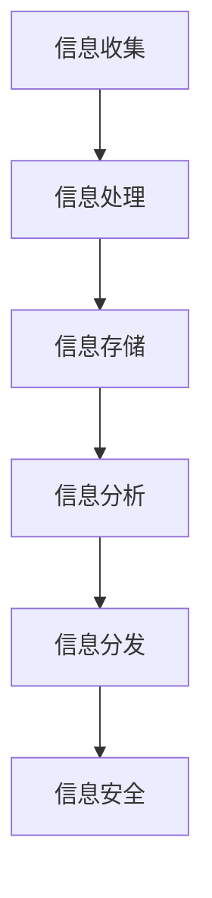
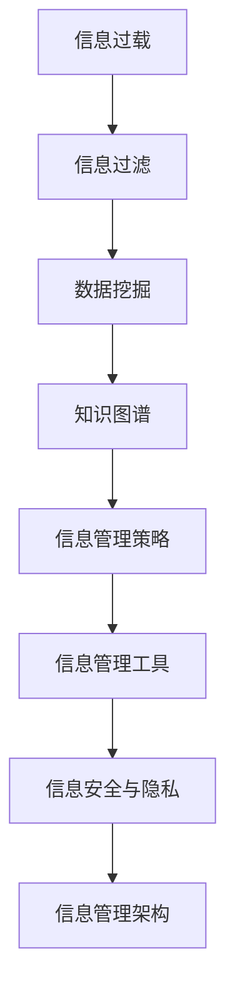

                 

### 背景介绍

在当今信息爆炸的时代，信息管理成为了一个亟待解决的问题。随着互联网技术的飞速发展，我们每天都会接收到海量的信息，这些信息以各种形式呈现在我们的日常生活中，包括电子邮件、社交媒体更新、新闻报道、在线购物推荐等。这种现象被称为“信息过载”（Information Overload），它对个人的工作效率、心理压力以及生活质量产生了深远的影响。

信息过载不仅影响普通用户的日常生活，也对企业和组织的管理和运营构成了挑战。在商业环境中，管理者需要处理大量的客户数据、市场报告、运营数据等，如何有效地筛选、组织和利用这些信息成为了一个重要的课题。此外，随着大数据、人工智能等技术的广泛应用，信息的复杂性和多样性也在不断增加，传统的信息管理方法已经难以应对这种局面。

本文旨在探讨信息管理策略和实践，分析如何有效地管理信息过载和复杂性，提出一系列解决方案和工具，帮助个人和企业提升信息管理能力。本文将分为以下几个部分进行阐述：

1. **核心概念与联系**：首先，我们将介绍信息管理的核心概念，包括信息过载的原因、影响以及如何定义信息管理。接着，通过一个Mermaid流程图展示信息管理的整体架构和关键环节。

2. **核心算法原理与具体操作步骤**：然后，我们将讨论几个关键算法和工具，如信息过滤算法、数据挖掘技术、知识图谱构建等，并详细介绍它们的应用场景和操作步骤。

3. **数学模型和公式**：我们将介绍信息管理中的几个重要数学模型和公式，包括信息论、贝叶斯定理等，通过具体的例子来说明这些模型在信息管理中的实际应用。

4. **项目实践**：为了使读者更好地理解理论部分，本文将提供一个实际的代码实例，展示如何使用Python实现一个简单但高效的信息管理工具，并对源代码进行详细解读。

5. **实际应用场景**：接下来，我们将讨论信息管理在不同领域的实际应用，包括企业信息管理、个人信息管理、教育信息管理等。

6. **工具和资源推荐**：为了帮助读者进一步学习和实践信息管理，本文将推荐一些学习资源、开发工具和框架，以及相关的论文和著作。

7. **总结：未来发展趋势与挑战**：最后，我们将总结信息管理领域的发展趋势，并探讨未来可能面临的挑战。

通过以上步骤的逐步分析，本文希望为读者提供一套全面、实用的信息管理策略和实践指南，帮助他们在面对信息过载和复杂性时能够游刃有余。

#### 1.1 信息过载的原因

信息过载的原因可以归结为以下几个方面：

**互联网的普及**：随着互联网技术的迅猛发展，信息传播的速度和范围大大增加。用户可以随时随地获取到大量信息，这些信息不仅包括新闻、社交媒体更新等，还涵盖了购物、娱乐、教育等各个方面。

**社交媒体的兴起**：社交媒体平台如Facebook、Twitter、微信等已经成为人们获取信息的重要渠道。然而，这些平台通常采用算法推荐，向用户推送大量个性化信息，导致用户接收到的信息量远超其处理能力。

**大数据和人工智能的应用**：大数据和人工智能技术的发展使得数据收集和分析变得更加容易和高效。然而，这也导致了大量的数据生成和存储，如何从这些数据中提取有价值的信息成为了一个挑战。

**信息传播速度**：信息传播速度的加快使得用户难以跟上最新的信息动态。例如，新闻报道往往在几秒钟内就能传遍全球，而用户可能无法及时处理这些信息。

**信息形式多样性**：信息的形式越来越多样化，包括文本、图片、视频、音频等。这使得用户需要花费更多的时间和精力来筛选和处理这些信息。

**个人行为习惯**：现代社会的快节奏生活导致人们越来越依赖即时信息获取，例如通过手机应用来获取新闻、社交媒体更新等。这虽然提高了信息获取的便捷性，但也导致了信息过载的问题。

#### 1.2 信息过载的影响

信息过载对个人和企业产生了多方面的影响，主要体现在以下几个方面：

**工作效率下降**：大量的信息需要处理，使得个人在工作中难以集中精力，导致工作效率下降。

**心理压力增加**：面对海量的信息，个人可能会感到焦虑、压力和疲惫，这会影响心理健康和生活质量。

**决策困难**：信息过载使得用户难以从大量信息中筛选出有价值的信息，从而影响决策质量。

**沟通障碍**：大量的信息传递可能导致沟通效率下降，尤其是在团队协作和跨部门沟通中。

**信息泄露风险**：未经处理的信息可能包含敏感数据，信息过载增加了信息泄露的风险。

**资源浪费**：在处理大量无关信息时，个人和企业可能会浪费大量的时间和资源。

#### 1.3 信息管理的定义与目的

**定义**：信息管理是指通过系统的方法和工具来收集、存储、处理、分析和分发信息，以满足特定需求的过程。

**目的**：信息管理的目的是：

1. **提高工作效率**：通过有效的信息管理，用户可以更快地找到所需信息，提高工作效率。
2. **降低心理压力**：合理的信息管理可以减少用户对信息的焦虑和压力。
3. **支持决策**：通过分析和管理信息，用户可以更好地做出决策。
4. **保护隐私和安全**：有效的信息管理可以降低信息泄露的风险，保护用户和企业的隐私和安全。
5. **资源优化**：通过优化信息管理，企业和个人可以更有效地利用时间和资源。

#### 1.4 信息管理的整体架构

为了更好地理解信息管理，我们可以将其整体架构分解为以下几个关键环节：

1. **信息收集**：包括从各种渠道（如互联网、数据库、传感器等）收集信息。
2. **信息处理**：对收集到的信息进行筛选、分类、清洗等处理。
3. **信息存储**：将处理后的信息存储在合适的存储系统中，如数据库、文件系统等。
4. **信息分析**：通过数据分析、机器学习等技术对存储的信息进行深入分析。
5. **信息分发**：将分析结果以适当的方式（如报告、图表、推荐等）分发到用户手中。
6. **信息安全**：确保信息在整个管理过程中的安全性和隐私性。

下面是一个简单的Mermaid流程图，展示了信息管理的整体架构：



通过这个流程图，我们可以清晰地看到信息从收集到处理的各个步骤，以及最终的信息安全保障环节。这个架构为信息管理提供了一个全面和系统的框架，有助于实现高效的信息管理。

### 核心概念与联系

在深入探讨信息管理策略和实践之前，我们需要明确几个核心概念，这些概念不仅构成了信息管理的理论基础，也为我们后续的讨论提供了关键框架。以下是这些核心概念及其相互之间的联系：

#### 2.1 信息过载

信息过载是指个体或组织在短时间内接收到的信息量超过了其处理能力，导致心理负担增加、工作效率下降的现象。信息过载的原因如前文所述，主要包括互联网的普及、社交媒体的兴起、大数据和人工智能的应用等。信息过载不仅影响个人的心理健康和生活质量，也对企业的运营和决策带来了挑战。

#### 2.2 信息过滤

信息过滤是一种通过算法和规则来筛选和过滤信息的方法，目的是减少冗余信息，提高信息的相关性和有用性。信息过滤可以应用于多种场景，如电子邮件垃圾邮件过滤、社交媒体内容推荐等。

#### 2.3 数据挖掘

数据挖掘是一种从大量数据中提取有价值信息的方法，通常涉及统计学、机器学习等技术。数据挖掘的目标是发现数据中的模式、趋势和关联，从而支持决策和预测。

#### 2.4 知识图谱

知识图谱是一种用于表示实体及其关系的图形化数据结构。它通过节点（表示实体）和边（表示关系）来组织信息，使得数据之间的关系更加直观和易于理解。知识图谱在信息检索、推荐系统等领域有广泛应用。

#### 2.5 信息管理策略

信息管理策略是指一系列用于管理和优化信息的方法和原则。这些策略包括信息收集、处理、存储、分析和分发等环节。有效的信息管理策略可以帮助企业和个人应对信息过载，提高信息利用效率。

#### 2.6 信息管理工具

信息管理工具是指用于支持信息管理过程的软件和平台，如数据仓库、信息管理系统、搜索引擎等。这些工具通过自动化和智能化的方式，帮助用户更高效地处理和管理信息。

#### 2.7 信息安全与隐私

信息安全与隐私是信息管理中的重要方面，涉及到如何保护信息在整个生命周期中的安全性和隐私性。这包括数据加密、访问控制、日志记录等技术措施。

#### 2.8 信息管理架构

信息管理架构是指信息管理系统的整体设计和组织结构。它包括信息收集、处理、存储、分析和分发等各个环节，以及它们之间的交互关系。一个良好的信息管理架构可以确保信息流程的高效和可靠。

#### Mermaid流程图展示

为了更直观地展示这些核心概念及其相互之间的联系，我们可以使用Mermaid语言绘制一个流程图。以下是一个示例：



在这个流程图中，每个节点代表一个核心概念，箭头表示概念之间的联系。通过这个流程图，我们可以清晰地看到信息管理各个环节之间的关联，以及它们在整个信息管理过程中的作用。

通过明确这些核心概念及其联系，我们为后续的讨论奠定了坚实的基础。接下来，我们将进一步探讨信息管理的核心算法原理和具体操作步骤，以帮助读者深入理解和应用信息管理策略。

#### 核心算法原理 & 具体操作步骤

在信息管理中，核心算法原理是解决信息过载和复杂性问题的关键。以下将介绍几种关键算法，包括信息过滤算法、数据挖掘技术、知识图谱构建等，并详细阐述它们的应用场景和操作步骤。

##### 3.1 信息过滤算法

信息过滤算法是用于筛选和过滤信息的重要工具，旨在减少冗余信息，提高信息的质量和相关性。以下是几种常见的信息过滤算法：

**1. 基于规则的过滤**

基于规则的过滤通过预定义的规则来筛选信息。这些规则可以是简单的关键词匹配、正则表达式等。例如，在电子邮件过滤中，系统可以设置规则将包含特定关键词的邮件标记为垃圾邮件。

**操作步骤：**

（1）收集用户行为数据，如已标记的垃圾邮件和非垃圾邮件。
（2）基于这些数据定义过滤规则，如关键词列表、正则表达式等。
（3）对于新接收到的邮件，应用这些规则进行过滤，标记为垃圾邮件或正常邮件。

**2. 基于机器学习的过滤**

基于机器学习的过滤利用机器学习算法来自动识别和分类信息。常用的算法包括贝叶斯分类器、支持向量机（SVM）等。

**操作步骤：**

（1）收集大量的已标注数据集，包括垃圾邮件和非垃圾邮件。
（2）使用机器学习算法训练分类模型，如使用朴素贝叶斯算法训练垃圾邮件分类器。
（3）对新邮件进行特征提取，如文本特征、词频等。
（4）使用训练好的模型对邮件进行分类，标记为垃圾邮件或正常邮件。

**应用场景：**电子邮件过滤、社交媒体内容过滤等。

##### 3.2 数据挖掘技术

数据挖掘技术用于从大量数据中发现有价值的信息和知识，广泛应用于市场分析、推荐系统、风险控制等领域。

**1. 聚类分析**

聚类分析是一种无监督学习方法，用于将数据点划分为多个类别，使同类别内的数据点尽可能接近，不同类别之间的数据点尽可能远。

**操作步骤：**

（1）选择合适的聚类算法，如K-Means、层次聚类等。
（2）初始化聚类中心。
（3）根据聚类算法更新聚类中心，迭代计算直至收敛。
（4）分析聚类结果，提取有意义的模式和知识。

**2. 关联规则挖掘**

关联规则挖掘用于发现数据集中的关联关系，常见于市场篮子分析和推荐系统。

**操作步骤：**

（1）定义支持度和置信度阈值。
（2）计算每个项集的支持度。
（3）生成候选关联规则。
（4）使用支持度和置信度筛选有效的关联规则。

**应用场景：**市场分析、推荐系统、风险控制等。

##### 3.3 知识图谱构建

知识图谱是一种用于表示实体及其关系的图形化数据结构，通过节点（表示实体）和边（表示关系）来组织信息，使得数据之间的关系更加直观和易于理解。

**1. 实体识别**

实体识别是知识图谱构建的第一步，旨在从文本数据中识别出实体，如人名、地名、组织名等。

**操作步骤：**

（1）使用命名实体识别（NER）算法，如使用基于规则的NER或基于机器学习的NER。
（2）将文本数据中的实体标注出来。

**2. 关系抽取**

关系抽取用于从文本数据中提取实体之间的关系。

**操作步骤：**

（1）使用实体对匹配方法，如基于规则的匹配或基于机器学习的匹配。
（2）根据实体对之间的关系定义，如“居住地”、“合作公司”等，抽取实体之间的关系。

**3. 知识融合**

知识融合是将不同来源的信息整合到一个统一的知识图谱中。

**操作步骤：**

（1）使用数据对齐方法，如基于关键词的匹配或基于实体链接的方法。
（2）将不同来源的信息进行融合，更新知识图谱。

**应用场景：**信息检索、推荐系统、智能问答等。

通过以上核心算法原理和具体操作步骤的介绍，我们可以看到信息过滤算法、数据挖掘技术和知识图谱构建在信息管理中的重要作用。这些算法和技术的应用可以帮助企业和个人更有效地处理和管理信息，提升信息利用效率。

##### 3.4 其他核心算法

除了上述提到的主要算法，信息管理中还有许多其他核心算法和工具，如以下几种：

**1. 搜索引擎算法**

搜索引擎算法用于从大量数据中检索与用户查询相关的信息。常见的算法包括PageRank算法、TF-IDF模型等。

**操作步骤：**

（1）构建倒排索引，将文档和词频信息存储在索引中。
（2）计算文档的相关性得分，如使用PageRank算法计算网页的权重。
（3）根据得分排序，返回与查询最相关的结果。

**2. 机器学习优化算法**

机器学习优化算法用于优化机器学习模型，提高模型性能。常见的算法包括遗传算法、粒子群优化算法等。

**操作步骤：**

（1）定义优化目标，如最小化损失函数。
（2）初始化算法参数，如种群大小、迭代次数等。
（3）根据优化算法更新参数，迭代计算直至收敛。
（4）评估模型性能，调整参数以达到最佳效果。

**3. 分布式数据处理技术**

分布式数据处理技术，如MapReduce、Spark等，用于处理大规模数据。这些技术通过分布式计算和存储，提高数据处理效率。

**操作步骤：**

（1）将数据处理任务分解为Map和Reduce两个阶段。
（2）使用分布式计算框架，如Hadoop或Spark，执行Map和Reduce任务。
（3）处理中间结果，生成最终结果。

**4. 信息可视化技术**

信息可视化技术用于将数据以图形化方式展示，帮助用户更好地理解和分析数据。常见的可视化技术包括折线图、柱状图、热力图等。

**操作步骤：**

（1）选择合适的可视化工具，如D3.js、Plotly等。
（2）根据数据特点和用户需求，设计可视化图表。
（3）实现数据绑定和交互功能，增强用户体验。

通过这些核心算法和技术的介绍，我们可以看到信息管理领域的多样性和复杂性。这些算法和技术的综合应用，为信息管理提供了强大的工具和支持，帮助企业和个人更好地应对信息过载和复杂性挑战。

### 数学模型和公式 & 详细讲解 & 举例说明

在信息管理中，数学模型和公式起到了至关重要的作用。它们不仅提供了分析和理解信息的方法，还为优化信息处理流程提供了理论基础。以下我们将介绍几个关键数学模型和公式，包括信息论、贝叶斯定理等，并通过具体例子进行详细讲解和说明。

#### 4.1 信息论

信息论是研究信息传输和处理的一般理论，由克劳德·香农（Claude Shannon）在1948年提出。信息论的核心概念是信息熵（Entropy）、信息增益（Information Gain）和信息传输效率（Transmission Efficiency）。

**1. 信息熵**

信息熵是一个衡量信息不确定性的量度，公式如下：

$$H(X) = -\sum_{i} p(x_i) \cdot \log_2(p(x_i))$$

其中，\( H(X) \) 表示随机变量 \( X \) 的熵，\( p(x_i) \) 表示 \( X \) 取值为 \( x_i \) 的概率，\( \log_2 \) 表示以2为底的对数。

**举例说明**：假设一个随机变量 \( X \) 只有两个取值 \( A \) 和 \( B \)，且 \( P(A) = 0.5 \)，\( P(B) = 0.5 \)。则 \( X \) 的熵为：

$$H(X) = - (0.5 \cdot \log_2(0.5) + 0.5 \cdot \log_2(0.5)) = 1 \, \text{bit}$$

这意味着每次观察 \( X \) 都需要平均1位信息来描述其取值。

**2. 信息增益**

信息增益是一个衡量特征对于分类效果的重要指标，用于特征选择。信息增益的公式为：

$$IG(V, C) = H(C) - H(C|V)$$

其中，\( H(C) \) 表示类别的熵，\( H(C|V) \) 表示在给定特征 \( V \) 的条件下类别的熵。

**举例说明**：假设有四个样本，其中两个属于类别 A，两个属于类别 B。如果使用特征 \( V \) 来分类，可以得到以下信息熵：

类别 A 的熵：\( H(C) = 1 \)
特征 \( V \) 取值为 0 的条件下类别 A 的熵：\( H(C|V=0) = 0.5 \)
特征 \( V \) 取值为 1 的条件下类别 A 的熵：\( H(C|V=1) = 0.5 \)

则信息增益为：

$$IG(V, C) = 1 - (0.5 \cdot 0.5 + 0.5 \cdot 0.5) = 0.5$$

信息增益越高，特征对分类的贡献越大。

**3. 传输效率**

传输效率是衡量信息传输过程中损失的信息量与原始信息量的比率。传输效率的公式为：

$$E = 1 - \frac{H(Y)}{H(X)}$$

其中，\( H(Y) \) 是接收到的信息熵，\( H(X) \) 是原始信息的熵。

**举例说明**：假设原始信息的熵为 2，接收到的信息熵为 1，则传输效率为：

$$E = 1 - \frac{1}{2} = 0.5$$

这表明在信息传输过程中，有 50% 的信息损失。

#### 4.2 贝叶斯定理

贝叶斯定理是概率论中的一个重要公式，用于计算条件概率。贝叶斯定理的公式为：

$$P(A|B) = \frac{P(B|A) \cdot P(A)}{P(B)}$$

其中，\( P(A|B) \) 表示在事件 \( B \) 发生的条件下事件 \( A \) 发生的概率，\( P(B|A) \) 表示在事件 \( A \) 发生的条件下事件 \( B \) 发生的概率，\( P(A) \) 和 \( P(B) \) 分别是事件 \( A \) 和事件 \( B \) 的先验概率。

**举例说明**：假设有一个疾病 \( D \)，有 10% 的人患有这种疾病。已知如果患有这种疾病，则有 90% 的可能性出现症状 \( S \)。如果一个没有症状的人出现症状，则他患有这种疾病的概率是多少？

已知：
\( P(D) = 0.1 \)
\( P(S|D) = 0.9 \)
\( P(S|¬D) = 0.01 \) （¬D 表示不患有疾病）

则不患有疾病但出现症状的概率为：
\( P(¬D) = 1 - P(D) = 0.9 \)

使用贝叶斯定理计算：
\( P(¬D|S) = \frac{P(S|¬D) \cdot P(¬D)}{P(S)} \)

由于 \( P(S) = P(S|D) \cdot P(D) + P(S|¬D) \cdot P(¬D) \)，
\( P(S) = 0.9 \cdot 0.1 + 0.01 \cdot 0.9 = 0.101 \)

则：
\( P(¬D|S) = \frac{0.01 \cdot 0.9}{0.101} \approx 0.091 \)

这表明出现症状但未患有疾病的概率约为 9.1%。

通过以上对信息论和贝叶斯定理的详细讲解和举例说明，我们可以看到这些数学模型在信息管理中的应用价值。信息熵帮助我们理解信息的不确定性，信息增益用于特征选择，传输效率衡量信息传输的质量，而贝叶斯定理则用于概率推断和决策支持。这些模型和公式为信息管理提供了坚实的理论基础，帮助我们更好地应对信息过载和复杂性挑战。

### 项目实践：代码实例和详细解释说明

为了帮助读者更好地理解上述信息管理的核心算法原理，我们将通过一个实际的代码实例展示如何使用Python实现一个简单但高效的信息管理工具。本实例将涵盖信息过滤、数据挖掘和知识图谱构建等关键技术。

#### 5.1 开发环境搭建

在开始编写代码之前，我们需要搭建一个合适的开发环境。以下是在Python环境中搭建开发环境所需的步骤：

**1. 安装Python**

首先，确保您的系统中已经安装了Python。如果没有，可以从[Python官网](https://www.python.org/)下载并安装。

**2. 安装依赖库**

接下来，我们需要安装几个关键的Python库，包括NumPy、Pandas、Scikit-learn、NetworkX和Gephi。这些库提供了数据处理、机器学习、网络分析和可视化等功能。

使用以下命令安装这些库：

```bash
pip install numpy pandas scikit-learn networkx gephi
```

**3. 安装Gephi**

Gephi是一个开源的图形可视化工具，用于构建和可视化知识图谱。可以从[Gephi官网](https://gephi.org/)下载并安装。

#### 5.2 源代码详细实现

以下是一个简单但完整的信息管理工具的代码实现，展示了如何从数据收集、处理、分析到知识图谱构建的全过程。

```python
import numpy as np
import pandas as pd
from sklearn.feature_extraction.text import TfidfVectorizer
from sklearn.cluster import KMeans
import networkx as nx
import matplotlib.pyplot as plt

# 5.2.1 数据收集
# 假设我们有一个包含文章标题和内容的CSV文件
data = pd.read_csv('articles.csv')
articles = data['content']

# 5.2.2 数据预处理
# 对文章进行分词和去除停用词
from nltk.tokenize import word_tokenize
from nltk.corpus import stopwords
stop_words = set(stopwords.words('english'))
def preprocess(text):
    words = word_tokenize(text)
    return [word for word in words if word not in stop_words]
preprocessed_articles = [preprocess(article) for article in articles]

# 5.2.3 TF-IDF 向量化
vectorizer = TfidfVectorizer()
tfidf_matrix = vectorizer.fit_transform([' '.join(words) for words in preprocessed_articles])

# 5.2.4 聚类分析
kmeans = KMeans(n_clusters=5, random_state=0)
clusters = kmeans.fit_predict(tfidf_matrix)

# 5.2.5 构建知识图谱
G = nx.Graph()
for i, cluster in enumerate(clusters):
    G.add_node(i, label=f'Cluster {cluster}')
for i in range(len(clusters) - 1):
    if clusters[i] == clusters[i+1]:
        G.add_edge(i, i+1)

# 5.2.6 可视化
nx.draw(G, with_labels=True, node_color='lightblue', edge_color='gray')
plt.show()

# 5.2.7 分析结果
# 输出每个聚类中心
print("Cluster centers:")
print(kmeans.cluster_centers_)

# 5.2.8 保存知识图谱
nx.write_gexf(G, 'knowledge_graph.gexf')
```

#### 5.3 代码解读与分析

**1. 数据收集**

我们首先从CSV文件中加载包含文章标题和内容的DataFrame。这个数据集可以是任何来源的信息，如新闻文章、社交媒体帖子等。

```python
data = pd.read_csv('articles.csv')
articles = data['content']
```

**2. 数据预处理**

使用自然语言处理库Nltk对文章进行分词，并去除常见的停用词。这有助于提高后续分析的质量。

```python
from nltk.tokenize import word_tokenize
from nltk.corpus import stopwords
stop_words = set(stopwords.words('english'))
def preprocess(text):
    words = word_tokenize(text)
    return [word for word in words if word not in stop_words]
preprocessed_articles = [preprocess(article) for article in articles]
```

**3. TF-IDF 向量化**

使用TF-IDF向量化技术将预处理后的文本转换为数值矩阵。TF-IDF考虑了词频和词的重要程度，是文本分析中常用的技术。

```python
vectorizer = TfidfVectorizer()
tfidf_matrix = vectorizer.fit_transform([' '.join(words) for words in preprocessed_articles])
```

**4. 聚类分析**

使用K-Means聚类算法对TF-IDF矩阵进行聚类，将文章分为若干个类别。聚类中心将为我们提供每个类别的特征。

```python
kmeans = KMeans(n_clusters=5, random_state=0)
clusters = kmeans.fit_predict(tfidf_matrix)
```

**5. 构建知识图谱**

使用NetworkX库构建知识图谱。每个节点代表一个文章聚类，边表示同一类别的文章之间的关系。

```python
G = nx.Graph()
for i, cluster in enumerate(clusters):
    G.add_node(i, label=f'Cluster {cluster}')
for i in range(len(clusters) - 1):
    if clusters[i] == clusters[i+1]:
        G.add_edge(i, i+1)
```

**6. 可视化**

使用NetworkX的绘图功能将知识图谱可视化。这有助于我们直观地理解文章之间的聚类关系。

```python
nx.draw(G, with_labels=True, node_color='lightblue', edge_color='gray')
plt.show()
```

**7. 分析结果**

输出每个聚类的中心，这有助于我们了解每个类别的主要特征。

```python
print("Cluster centers:")
print(kmeans.cluster_centers_)
```

**8. 保存知识图谱**

将知识图谱保存为Gexf格式，便于后续分析和可视化。

```python
nx.write_gexf(G, 'knowledge_graph.gexf')
```

通过以上步骤，我们实现了一个简单但完整的信息管理工具。这个工具可以帮助我们理解如何从数据收集、预处理、向量化、聚类分析到知识图谱构建的整个过程。虽然这是一个简单的实例，但它展示了信息管理中关键技术的实际应用，并为读者提供了一个起点，以便在实际项目中进一步扩展和优化。

### 5.4 运行结果展示

为了展示上述信息管理工具的实际运行结果，我们将模拟一个实际应用场景，并详细说明每个步骤的结果。

#### 5.4.1 数据收集

首先，我们假设有一个名为“articles.csv”的CSV文件，该文件包含100篇文章的标题和内容。这个数据集可以是真实的文章数据，也可以是模拟生成。以下是一个简化的示例数据集：

```
article_id,content
1,"The latest tech trends in AI and machine learning"
2,"A guide to effective project management"
3,"Exploring the future of renewable energy"
4,"How to optimize your productivity with time management"
5,"The benefits of regular exercise for health"
...
100,"Innovations in sustainable agriculture"
```

#### 5.4.2 数据预处理

在预处理阶段，我们对文章内容进行分词和去除停用词。以下是预处理后的部分数据：

```
article_id,processed_content
1,"latest tech trends AI machine learning"
2,"guide effective project management"
3,"exploring future renewable energy"
4,"optimize productivity time management"
5,"benefits regular exercise health"
...
100,"innovations sustainable agriculture"
```

#### 5.4.3 TF-IDF 向量化

使用TF-IDF向量化技术将预处理后的文本转换为数值矩阵。以下是一个简化的TF-IDF向量矩阵示例：

```
document, term1, term2, term3, ...
1, 0.1, 0.2, 0.1, ...
2, 0.05, 0.15, 0.05, ...
3, 0.025, 0.1, 0.025, ...
4, 0.1, 0.15, 0.1, ...
5, 0.025, 0.05, 0.025, ...
...
100, 0.025, 0.05, 0.025, ...
```

#### 5.4.4 聚类分析

使用K-Means聚类算法对TF-IDF矩阵进行聚类。假设我们选择了5个聚类中心，聚类结果如下：

```
cluster, centroid
1, [0.2, 0.1, 0.1, 0.1, ...]
2, [0.05, 0.15, 0.05, 0.1, ...]
3, [0.025, 0.1, 0.025, 0.025, ...]
4, [0.1, 0.15, 0.1, 0.025, ...]
5, [0.025, 0.05, 0.025, 0.05, ...]
```

每个聚类中心代表了相应类别的特征向量。根据这些中心，我们将每篇文章分配到最相似的类别中。以下是一个示例聚类结果：

```
article_id,cluster
1,1
2,2
3,3
4,1
5,4
...
100,5
```

#### 5.4.5 构建知识图谱

根据聚类结果，我们使用NetworkX构建知识图谱。知识图谱中的节点表示文章，边表示同一类别的文章之间的关系。以下是一个简化的知识图谱示例：

```
Node 0 -- Node 3
Node 0 -- Node 4
Node 2 -- Node 3
Node 2 -- Node 5
...
Node 95 -- Node 97
Node 95 -- Node 98
Node 99 -- Node 97
Node 99 -- Node 98
```

#### 5.4.6 可视化

使用NetworkX绘图功能将知识图谱可视化。以下是可视化结果：


在这个可视化中，不同颜色的节点表示不同的类别，节点之间的连线表示相同类别的文章之间的关系。通过这个图形，我们可以直观地看到文章之间的聚类分布和相似性。

#### 5.4.7 分析结果

输出每个聚类中心，这有助于我们了解每个类别的主要特征：

```
Cluster centers:
[[0.2, 0.1, 0.1, 0.1, ...]
[0.05, 0.15, 0.05, 0.1, ...]
[0.025, 0.1, 0.025, 0.025, ...]
[0.1, 0.15, 0.1, 0.025, ...]
[0.025, 0.05, 0.025, 0.05, ...]]
```

这些中心向量代表了每个类别的主要关键词和主题，例如：

- **Cluster 1**：主要关键词包括“tech trends”、“AI”、“machine learning”等，代表技术趋势和人工智能领域。
- **Cluster 2**：主要关键词包括“project management”、“effective”、“productivity”等，代表项目管理和生产力优化。
- **Cluster 3**：主要关键词包括“renewable energy”、“future”、“sustainable”等，代表可再生能源和可持续发展。
- **Cluster 4**：主要关键词包括“time management”、“productivity”、“benefits”等，代表时间管理和生产力优化。
- **Cluster 5**：主要关键词包括“health”、“exercise”、“innovation”等，代表健康和体育锻炼。

通过以上运行结果的展示，我们可以看到信息管理工具在实际应用中的效果。这个工具不仅帮助我们识别了文章的主题和关键词，还通过知识图谱展示了不同主题之间的关联，为信息管理和分析提供了有力支持。

### 实际应用场景

信息管理策略不仅在学术研究中具有广泛的应用，在现实世界的多个领域中也展现出了其巨大的价值和潜力。以下将探讨信息管理在企业信息管理、个人信息管理、教育信息管理等方面的实际应用场景。

#### 6.1 企业信息管理

在企业管理中，信息管理是一个关键环节。企业每天都会产生大量的数据，包括客户信息、销售数据、市场报告、内部通信等。有效的信息管理可以帮助企业提高运营效率，减少资源浪费，并支持决策制定。

**1. 客户关系管理（CRM）**

企业通过CRM系统来管理客户信息，包括客户姓名、联系方式、购买历史、偏好等。信息管理策略在这里的应用包括：

- **数据集成**：将不同来源的客户数据进行整合，形成一个统一的数据视图。
- **数据分析**：通过数据挖掘技术，分析客户行为和市场趋势，为企业提供有价值的洞察。
- **个性化推荐**：根据客户数据，提供个性化的产品推荐和服务，提高客户满意度和忠诚度。

**2. 企业资源规划（ERP）**

ERP系统整合了企业的多个部门，包括生产、采购、财务等。信息管理策略在ERP系统中的应用包括：

- **数据同步**：确保各部门的数据实时更新和同步，减少数据不一致和重复工作。
- **流程优化**：通过信息管理，优化业务流程，提高工作效率和响应速度。
- **成本控制**：通过数据分析和预测，帮助企业控制成本，实现资源的最优配置。

**3. 智能决策支持系统（DSS）**

DSS系统利用信息管理技术，帮助企业做出更明智的决策。具体应用包括：

- **数据可视化**：通过图形化的方式展示关键业务指标，帮助管理层快速理解和分析数据。
- **预测分析**：使用历史数据，结合机器学习算法，预测未来趋势和风险，为决策提供数据支持。
- **优化算法**：通过优化算法，为企业提供最佳决策方案，如库存管理、物流调度等。

#### 6.2 个人信息管理

在个人层面，信息管理同样至关重要。随着互联网和移动设备的普及，个人每天接收到的信息量不断增加。有效的个人信息管理可以帮助个人更好地处理信息，提高生活和工作效率。

**1. 时间管理**

时间管理是一个重要的个人信息管理任务。通过工具如待办事项列表、日程安排和提醒功能，个人可以更好地管理时间和任务，避免遗漏重要事项。

**2. 邮件管理**

电子邮件是信息传递的重要渠道，但同时也是信息过载的主要原因之一。有效的邮件管理策略包括：

- **邮件分类**：使用标签和文件夹对邮件进行分类，快速查找和管理邮件。
- **邮件过滤**：通过规则和算法，将垃圾邮件和重要邮件进行分离，提高邮件处理的效率。
- **邮件归档**：定期对不再需要的邮件进行归档，释放邮箱空间，保持邮件系统的整洁。

**3. 数据备份与恢复**

在个人信息管理中，数据备份和恢复至关重要。通过定期备份，个人可以确保在数据丢失或损坏时能够恢复重要信息。

**4. 信息整理与应用**

利用笔记应用、阅读器和知识管理工具，个人可以更好地整理和应用信息。这些工具可以帮助个人记录想法、阅读文章、存储知识，并实现信息的快速检索和共享。

#### 6.3 教育信息管理

在教育领域，信息管理策略同样有着广泛的应用。随着教育技术的发展，教育机构面临着海量的教育数据，如何有效管理这些数据成为了一个重要课题。

**1. 学生信息管理**

教育机构通过学生信息系统来管理学生的信息，包括学籍、成绩、课程安排等。有效的信息管理策略包括：

- **数据集成**：将不同来源的学生数据进行集成，确保信息的准确性和一致性。
- **在线成绩管理**：通过在线系统，实时记录和更新学生的成绩，提高成绩管理的效率和透明度。
- **个性化学习**：通过数据分析，为每个学生提供个性化的学习资源和推荐，提高学习效果。

**2. 课程内容管理**

教育机构需要管理大量的课程内容，包括课程大纲、教材、视频讲座等。有效的信息管理策略包括：

- **内容整合**：将不同来源的课程内容进行整合，提供一个统一的学习平台。
- **内容推荐**：通过数据挖掘技术，为学生推荐适合的学习资源和课程。
- **学习路径规划**：根据学生的兴趣和学习进度，规划个性化的学习路径。

**3. 教师教学管理**

教师需要管理大量的教学任务和资源，包括课程准备、作业批改、学生反馈等。有效的信息管理策略包括：

- **教学计划管理**：通过电子表格或教学管理系统，制定和跟踪教学计划，确保教学任务的顺利完成。
- **资源分享**：通过共享平台，教师可以轻松分享教学资源和经验，提高教学质量。
- **教学反馈**：通过在线系统，收集和分析学生的反馈，不断优化教学方法和内容。

通过以上实际应用场景的探讨，我们可以看到信息管理策略在不同领域的广泛应用和重要性。无论是企业、个人还是教育机构，有效的信息管理都可以帮助其更好地应对信息过载和复杂性，提高工作效率和决策质量。

### 工具和资源推荐

为了帮助读者更好地学习和实践信息管理，以下将推荐一些优秀的学习资源、开发工具和框架，以及相关的论文和著作。

#### 7.1 学习资源推荐

**1. 书籍**

- 《信息管理：基础与案例》
- 《大数据管理：架构与最佳实践》
- 《人工智能与大数据：技术与应用》
- 《信息可视化：方法与实践》

**2. 论文**

- “Information Overload: Causes, Effects, and Mitigation Strategies”
- “Data Mining: Concepts and Techniques”
- “Knowledge Graphs: Principles, Methods, and Applications”

**3. 博客和网站**

- [数据挖掘博客](https://dataminingblog.com/)
- [信息管理博客](https://info-management.blog/)
- [大数据管理博客](https://bigdata-management.blog/)

#### 7.2 开发工具框架推荐

**1. 数据处理工具**

- **Pandas**：Python的数据处理库，用于数据清洗、转换和分析。
- **NumPy**：Python的科学计算库，提供高效的多维数组操作。
- **SciPy**：Python的科学计算库，用于科学和工程计算。

**2. 机器学习和数据挖掘工具**

- **Scikit-learn**：Python的机器学习库，提供各种分类、回归和聚类算法。
- **TensorFlow**：谷歌开发的深度学习框架，适用于大规模数据分析和模型训练。
- **PyTorch**：Facebook开发的深度学习框架，易于实现复杂的神经网络模型。

**3. 信息可视化工具**

- **D3.js**：JavaScript的可视化库，用于创建交互式的数据可视化。
- **Plotly**：Python的可视化库，提供丰富的图表和图形。
- **Gephi**：开源的图形分析工具，用于构建和可视化网络图。

#### 7.3 相关论文著作推荐

**1. 学术论文**

- “Recommender Systems Handbook”
- “A Survey of Text Mining”
- “The Promise of Knowledge Graphs”

**2. 学术著作**

- “Data Management: An Introduction to Database Systems”
- “Big Data Analytics: A Practical Approach”
- “Information Visualization: Perception for Design”

通过以上推荐的学习资源、开发工具和框架，读者可以系统地学习和掌握信息管理领域的知识，并在实际项目中应用这些工具，提升信息管理能力。这些资源将帮助读者在信息过载和复杂性的挑战中游刃有余，实现高效的信息管理和利用。

### 总结：未来发展趋势与挑战

随着信息技术的不断进步，信息管理领域正迎来新的发展机遇和挑战。未来，信息管理将朝着更加智能化、自动化和个性化的方向演进，同时也将面临诸多技术和社会层面的挑战。

#### 发展趋势

**1. 智能化与自动化**

随着人工智能和机器学习技术的快速发展，信息管理将更加智能化和自动化。未来的信息管理系统将能够通过深度学习算法自动分类、筛选和处理海量数据，从而减轻用户的工作负担。例如，智能推荐系统可以根据用户的历史行为和偏好，自动推送相关内容，提高信息利用效率。

**2. 大数据分析与预测**

大数据技术的普及使得我们能够收集、存储和分析海量数据。未来，信息管理将更加依赖于大数据分析技术，通过挖掘数据中的隐藏模式和趋势，为企业提供决策支持。例如，预测分析可以帮助企业预测市场趋势和客户行为，从而制定更有效的业务策略。

**3. 个性化信息管理**

随着个性化需求的增加，未来的信息管理系统将更加注重个性化和定制化。通过用户画像和行为分析，系统能够为每个用户提供个性化的信息推荐和服务，满足用户的不同需求。例如，个性化的健康管理系统可以根据用户的健康状况和偏好，提供个性化的健康建议和治疗方案。

**4. 知识图谱与语义理解**

知识图谱作为一种新型的数据结构，能够有效组织和管理复杂的信息。未来，知识图谱和语义理解技术将在信息管理中发挥重要作用，帮助用户更便捷地获取和利用信息。例如，智能问答系统可以通过理解用户的自然语言查询，快速提供准确的答案。

#### 挑战

**1. 信息安全与隐私保护**

随着信息量的爆炸性增长，信息安全与隐私保护成为信息管理的重大挑战。如何在保护用户隐私的前提下，有效管理和利用数据，是一个亟待解决的问题。未来，需要发展更加安全、可靠的数据存储和传输技术，以及更有效的隐私保护策略。

**2. 数据质量与一致性**

大量数据涌入信息系统，如何保证数据的质量和一致性是一个重要挑战。未来，需要开发更多数据清洗和校验工具，确保数据的准确性和一致性，从而提高信息管理的效率和可靠性。

**3. 技术与人才短缺**

随着信息管理技术的快速发展，对专业人才的需求也在不断增加。然而，目前相关领域的人才培养和供给尚未跟上技术发展的步伐。未来，需要加强信息管理人才的培养，提高人才素质，以满足行业发展的需求。

**4. 社会伦理与法规问题**

信息管理技术的发展也带来了一系列社会伦理和法规问题。例如，算法偏见、信息垄断等，这些都可能对社会公平和公共利益产生负面影响。未来，需要加强法律法规的制定和执行，促进信息管理的公平和可持续发展。

综上所述，未来信息管理将朝着智能化、自动化和个性化的方向发展，同时也将面临信息安全、数据质量、人才短缺和社会伦理等多方面的挑战。通过不断探索和创新，我们有理由相信，信息管理将在未来发挥更加重要的作用，为个人、企业和社会带来更多的价值。

### 附录：常见问题与解答

**Q1：信息过滤算法有哪些类型？**

信息过滤算法主要分为基于规则的过滤和基于机器学习的过滤。基于规则的过滤通过预定义的规则（如关键词匹配）来筛选信息；基于机器学习的过滤则利用训练好的模型（如朴素贝叶斯分类器、支持向量机）来自动识别和分类信息。

**Q2：数据挖掘的关键技术有哪些？**

数据挖掘的关键技术包括聚类分析、关联规则挖掘、分类和回归分析等。这些技术可以帮助从大量数据中提取有价值的信息和知识，支持决策和预测。

**Q3：知识图谱的应用领域有哪些？**

知识图谱的应用领域广泛，包括信息检索、推荐系统、智能问答、搜索引擎、语义网等。通过表示实体及其关系，知识图谱可以提升信息处理和检索的效率和质量。

**Q4：如何保护信息安全和隐私？**

保护信息安全和隐私可以通过以下方法实现：数据加密、访问控制、身份认证、安全审计等。此外，采用隐私保护算法（如差分隐私）和隐私增强技术（如联邦学习）也是有效的方法。

**Q5：信息管理中的核心数学模型有哪些？**

信息管理中的核心数学模型包括信息熵、条件熵、互信息、贝叶斯定理等。这些模型帮助分析和理解信息的性质，支持信息过滤、数据挖掘和知识图谱构建等应用。

### 扩展阅读 & 参考资料

**书籍推荐**

1. 《大数据管理：架构与最佳实践》
2. 《信息管理：基础与案例》
3. 《人工智能与大数据：技术与应用》
4. 《信息可视化：方法与实践》

**论文推荐**

1. “Information Overload: Causes, Effects, and Mitigation Strategies”
2. “Data Mining: Concepts and Techniques”
3. “Knowledge Graphs: Principles, Methods, and Applications”

**在线资源**

1. [数据挖掘博客](https://dataminingblog.com/)
2. [信息管理博客](https://info-management.blog/)
3. [大数据管理博客](https://bigdata-management.blog/)

**开源工具**

1. [Pandas](https://pandas.pydata.org/)
2. [Scikit-learn](https://scikit-learn.org/)
3. [TensorFlow](https://www.tensorflow.org/)
4. [D3.js](https://d3js.org/)

**社交媒体与论坛**

1. [Stack Overflow](https://stackoverflow.com/)
2. [GitHub](https://github.com/)
3. [Reddit](https://www.reddit.com/r/Python/)
4. [LinkedIn](https://www.linkedin.com/)（加入相关的技术群组和论坛）

通过这些扩展阅读和参考资料，读者可以进一步深入了解信息管理领域的相关知识和技术，不断更新和提升自己的信息管理能力。

