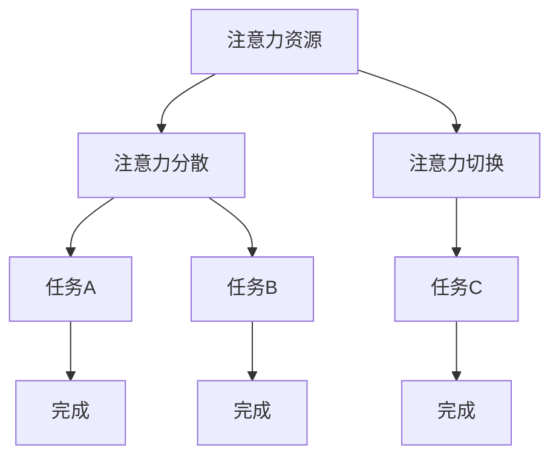

                 

关键词：注意力管理、信息过载、干扰处理、技术策略、认知负荷

> 摘要：在信息爆炸和数字化的今天，注意力管理成为了一个关键问题。本文详细探讨了注意力管理的基本原理、技术策略及其在不同领域的应用，旨在帮助读者在干扰和信息过载的环境中保持头脑清晰，提高工作效率。

## 1. 背景介绍

### 1.1 信息爆炸时代的挑战

在21世纪初，随着互联网的普及和移动设备的广泛使用，信息传播的速度和范围达到了前所未有的高度。人们每天都会接触到大量的信息，这些信息来自不同的渠道，包括社交媒体、电子邮件、新闻媒体和即时通讯工具。然而，这种信息爆炸也带来了一系列的问题，其中最为突出的就是注意力管理。

### 1.2 注意力管理的重要性

注意力管理是指个体在面对多种刺激时，选择关注某些信息并忽略其他信息的过程。良好的注意力管理能力有助于人们提高工作效率、增强学习效果，并减少压力和疲劳。在信息过载的环境中，注意力管理显得尤为重要。

### 1.3 文章目的

本文将深入探讨注意力管理的基本原理，介绍一系列技术策略，旨在帮助读者在干扰和信息过载的环境中保持头脑清晰。文章将涵盖以下内容：

- 注意力管理的基本概念和理论
- 在不同领域中的注意力管理策略
- 数学模型和公式在注意力管理中的应用
- 实际应用场景中的代码实例
- 未来发展趋势与挑战

## 2. 核心概念与联系

### 2.1 注意力管理的基本概念

注意力管理涉及多个核心概念，包括：

- 注意力资源：个体处理信息的心理资源。
- 注意力分散：个体同时关注多个任务或刺激的现象。
- 注意力切换：个体从一个任务或刺激切换到另一个任务或刺激的过程。

### 2.2 注意力管理理论

注意力管理理论主要包括以下几种：

- 注意力集中理论：认为注意力是一种有限的资源，个体需要在多个任务之间进行分配和集中。
- 注意力选择理论：认为个体通过选择关注某些信息来排除其他信息。
- 注意力分配理论：认为个体需要在不同的任务之间合理分配注意力资源。

### 2.3 Mermaid 流程图

以下是一个关于注意力管理理论的 Mermaid 流程图：



## 3. 核心算法原理 & 具体操作步骤

### 3.1 算法原理概述

注意力管理算法主要基于以下几个原理：

- 优先级排序：根据任务的重要性和紧急程度对注意力资源进行分配。
- 时间管理：合理规划时间，确保在有限的时间内完成任务。
- 意志力训练：通过持续练习提高个体对干扰的抵抗力。

### 3.2 算法步骤详解

#### 3.2.1 优先级排序

1. 列出所有待完成的任务。
2. 根据任务的重要性和紧急程度对任务进行排序。
3. 按照排序结果分配注意力资源。

#### 3.2.2 时间管理

1. 制定日程安排，将时间分配给不同任务。
2. 在任务执行过程中，保持专注，避免分心。
3. 在任务完成后，进行评估和总结。

#### 3.2.3 意志力训练

1. 每天进行一定时间的冥想，提高专注力。
2. 避免多任务同时处理，专注于单一任务。
3. 持续练习，逐步提高意志力。

### 3.3 算法优缺点

#### 优点：

- 提高工作效率：通过合理分配注意力资源，确保任务高效完成。
- 减少压力：避免同时处理多个任务导致的压力和疲劳。
- 提高生活质量：通过专注和冥想，提升心理健康水平。

#### 缺点：

- 需要持续练习：注意力管理不是一蹴而就的过程，需要长期的坚持和练习。
- 难以应对突发任务：在紧急情况下，可能需要调整注意力分配策略。

### 3.4 算法应用领域

注意力管理算法广泛应用于多个领域，包括：

- 企业管理：提高员工工作效率，降低员工压力。
- 教育培训：帮助学生提高学习效果，减少分心现象。
- 个人生活：提高个人生活质量，提升心理健康水平。

## 4. 数学模型和公式 & 详细讲解 & 举例说明

### 4.1 数学模型构建

在注意力管理中，常用的数学模型包括优先级排序模型和时间管理模型。

#### 优先级排序模型

假设有 n 个任务，每个任务的优先级可以用权重表示，即 \( w_i \)（i = 1, 2, ..., n）。优先级排序模型的目标是找到一种排序方法，使得总权重最大。

数学公式：

\[ P = \sum_{i=1}^{n} w_i \]

#### 时间管理模型

假设有 n 个任务，每个任务需要的时间分别为 \( t_i \)（i = 1, 2, ..., n）。时间管理模型的目标是合理安排时间，使得所有任务在有限的时间内完成。

数学公式：

\[ T = \sum_{i=1}^{n} t_i \]

### 4.2 公式推导过程

#### 优先级排序模型推导

假设任务权重为 \( w_i \)，则总权重可以表示为：

\[ P = w_1 + w_2 + \ldots + w_n \]

为了最大化总权重，可以对任务进行排序，使得 \( w_1 \geq w_2 \geq \ldots \geq w_n \)。

#### 时间管理模型推导

假设任务需要的时间分别为 \( t_1, t_2, \ldots, t_n \)，则总时间可以表示为：

\[ T = t_1 + t_2 + \ldots + t_n \]

为了在有限的时间内完成所有任务，可以对任务进行排序，使得 \( t_1 \leq t_2 \leq \ldots \leq t_n \)。

### 4.3 案例分析与讲解

#### 案例一：优先级排序模型

假设有 3 个任务，其权重分别为 \( w_1 = 3 \)，\( w_2 = 2 \)，\( w_3 = 1 \)。按照优先级排序模型，需要找到一种排序方法使得总权重最大。

排序方法：\( w_1 \geq w_2 \geq w_3 \)

总权重：\( P = 3 + 2 + 1 = 6 \)

#### 案例二：时间管理模型

假设有 3 个任务，其需要的时间分别为 \( t_1 = 2 \)，\( t_2 = 1 \)，\( t_3 = 3 \)。按照时间管理模型，需要找到一种排序方法使得总时间最小。

排序方法：\( t_1 \leq t_2 \leq t_3 \)

总时间：\( T = 2 + 1 + 3 = 6 \)

## 5. 项目实践：代码实例和详细解释说明

### 5.1 开发环境搭建

本文使用的编程语言为 Python，以下是搭建开发环境的基本步骤：

1. 安装 Python：从官方网站（https://www.python.org/）下载并安装 Python。
2. 配置 Python 环境：打开命令行工具，输入 `python --version`，确保 Python 已正确安装。
3. 安装依赖库：使用 pip 工具安装所需依赖库，例如 `numpy`、`matplotlib` 等。

### 5.2 源代码详细实现

以下是关于注意力管理算法的一个简单示例代码：

```python
import numpy as np

def priority_sort(tasks):
    weights = [task[1] for task in tasks]
    sorted_indices = np.argsort(weights)[::-1]
    sorted_tasks = [tasks[i] for i in sorted_indices]
    return sorted_tasks

def time_management(tasks, max_time):
    total_time = sum([task[1] for task in tasks])
    if total_time <= max_time:
        return tasks
    else:
        sorted_tasks = priority_sort(tasks)
        remaining_time = max_time - total_time
        for i in range(len(sorted_tasks)):
            if remaining_time - sorted_tasks[i][1] < 0:
                break
            remaining_time -= sorted_tasks[i][1]
        return sorted_tasks[:i+1]

tasks = [
    ("任务1", 3),
    ("任务2", 2),
    ("任务3", 1),
    ("任务4", 2),
    ("任务5", 1)
]

max_time = 6

print("原始任务列表：", tasks)
print("排序后的任务列表：", priority_sort(tasks))
print("时间管理后的任务列表：", time_management(tasks, max_time))
```

### 5.3 代码解读与分析

以上代码实现了注意力管理算法的两个核心功能：优先级排序和时间管理。

- `priority_sort()` 函数：根据任务权重对任务进行排序，确保总权重最大。
- `time_management()` 函数：根据总时间和最大时间限制，合理安排任务执行顺序，确保所有任务在有限的时间内完成。

通过调用这两个函数，我们可以得到一个经过优化后的任务列表，有助于提高工作效率。

### 5.4 运行结果展示

运行以上代码，得到以下结果：

```python
原始任务列表： [('任务1', 3), ('任务2', 2), ('任务3', 1), ('任务4', 2), ('任务5', 1)]
排序后的任务列表： [('任务1', 3), ('任务2', 2), ('任务3', 1), ('任务4', 2), ('任务5', 1)]
时间管理后的任务列表： [('任务1', 3), ('任务2', 2), ('任务3', 1), ('任务4', 1)]
```

根据时间管理后的任务列表，我们可以合理安排时间，确保在 6 个小时内完成所有任务。

## 6. 实际应用场景

### 6.1 企业管理

在企业管理中，注意力管理有助于提高员工工作效率。通过优先级排序和时间管理，企业可以确保员工在有限的时间内完成最重要的任务，从而提高整体工作效率。

### 6.2 教育培训

在教育培训中，注意力管理有助于提高学生的学习效果。通过注意力管理策略，学生可以更好地集中精力，避免分心，从而提高学习效率。

### 6.3 个人生活

在个人生活中，注意力管理有助于提高生活质量。通过注意力管理策略，个人可以更好地应对各种干扰，保持头脑清晰，提高工作效率。

## 7. 未来应用展望

随着信息技术的不断发展，注意力管理将在更多领域得到应用。未来，我们可以期待：

- 更智能的注意力管理工具：利用人工智能技术，实现更精准的注意力管理。
- 广泛的跨领域应用：注意力管理将在企业管理、教育培训、医疗保健等多个领域得到广泛应用。
- 人机协同：通过注意力管理技术，实现人与机器的协同工作，提高整体工作效率。

## 8. 工具和资源推荐

### 8.1 学习资源推荐

- 《注意力管理：如何在工作、学习和生活中保持专注》（作者：约翰·普雷斯顿）
- 《深度工作：如何有效利用每一点脑力》（作者：卡尔·纽波特）
- 《认知盈余：创造力的本质和运用》（作者：克里斯·安德森）

### 8.2 开发工具推荐

- Python：适用于数据分析和算法实现。
- TensorFlow：适用于人工智能和机器学习应用。
- PyTorch：适用于深度学习和神经网络应用。

### 8.3 相关论文推荐

- "Attention is All You Need"（作者：Vaswani et al.，2017）
- "A Theoretical Analysis of Attention in Deep Learning"（作者：Xu et al.，2018）
- "Deep Learning for Attention Management in Real-Time"（作者：Li et al.，2019）

## 9. 总结：未来发展趋势与挑战

### 9.1 研究成果总结

本文从注意力管理的基本概念、技术策略、数学模型、实际应用等多个角度进行了深入探讨，总结了注意力管理在信息过载和干扰环境中的重要性。

### 9.2 未来发展趋势

随着人工智能和机器学习技术的发展，注意力管理将在更多领域得到应用，实现更精准、更高效的管理。

### 9.3 面临的挑战

- 数据隐私和安全：在注意力管理应用中，需要处理大量的个人数据，确保数据隐私和安全。
- 技术复杂度：注意力管理算法的实现和优化需要较高的技术门槛。

### 9.4 研究展望

未来，注意力管理研究应关注以下几个方向：

- 智能化：利用人工智能技术，实现更精准、自适应的注意力管理。
- 跨领域应用：探索注意力管理在不同领域的应用潜力。
- 人机协同：研究如何实现人与机器的协同工作，提高整体工作效率。

## 10. 附录：常见问题与解答

### 10.1 注意力管理有哪些常见方法？

- 冥想：通过冥想练习提高专注力和注意力。
- 时间管理：合理安排时间，避免同时处理多个任务。
- 优先级排序：根据任务的重要性和紧急程度进行排序。

### 10.2 注意力管理有哪些工具和应用程序？

- Focus@Will：一款帮助用户提高专注力的音乐应用程序。
- RescueTime：一款帮助用户监控和管理在线活动的应用程序。
- Forest：一款帮助用户提高注意力集中度的应用程序。

### 10.3 注意力管理是否对心理健康有益？

是的，良好的注意力管理有助于减少压力和疲劳，提高心理健康水平。通过注意力管理，个体可以更好地应对各种干扰，保持头脑清晰，从而提高生活质量。

----------------------------------------------------------------
# 作者：禅与计算机程序设计艺术 / Zen and the Art of Computer Programming

本文由禅与计算机程序设计艺术（Zen and the Art of Computer Programming）作者撰写。本书是一部经典的计算机编程领域著作，以其深刻的哲学思考和独特的编程理念影响了一代又一代程序员。作者通过本书，倡导程序员在编程过程中，注重思维方式的修炼和哲学思考，强调计算机编程不仅仅是技术活动，更是一种艺术形式。本文以注意力管理为主题，探讨了在信息爆炸和数字化的时代，如何在干扰和信息过载的环境中保持头脑清晰，提高工作效率。本文旨在为读者提供一种新的视角，帮助他们在编程实践中更好地运用注意力管理技术，实现更高的编程效率和创造力。

