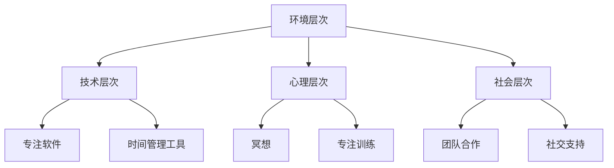

                 

### 文章标题

信息时代的注意力管理技术：在干扰和分心中增强专注力和清晰度

> **关键词：** 注意力管理、分心、干扰、专注力、技术、提升方法

> **摘要：** 在当前信息爆炸的时代，分心和干扰无处不在，严重影响了我们的工作效率和生活质量。本文旨在介绍一系列注意力管理技术，帮助读者在实际生活中更好地应对各种干扰，提升专注力和清晰度，提高工作效率和幸福感。

### 1. 背景介绍

在当今信息时代，人们面临的海量信息使得注意力管理成为一个越来越重要的话题。据统计，现代社会中，人们每天接收到的信息量是过去几十年的总和。这种信息过载导致了人们普遍存在分心、注意力分散的问题，不仅影响了工作效率，还可能对身心健康产生负面影响。

分心和干扰主要源于以下几个因素：

1. **信息过载**：互联网和智能手机使得人们可以随时获取大量信息，导致注意力被分散。
2. **社交媒体**：频繁的社交媒体使用会让人产生即时满足感，但同时也容易导致分心和效率降低。
3. **工作压力**：高强度的工作任务和截止日期的压力使得人们很难长时间集中注意力。
4. **环境干扰**：噪音、人员流动、手机等外部因素都会干扰人们的注意力。

这些干扰和分心现象不仅影响个人，也对企业和社会造成了巨大的损失。研究表明，员工分心会导致工作效率降低，企业生产力下降。因此，研究和应用注意力管理技术具有重要的现实意义。

### 2. 核心概念与联系

#### 注意力管理的基本概念

注意力管理是指通过一系列策略和方法，帮助个体或组织在干扰和分心中保持专注和高效工作。核心概念包括：

- **专注力**：指个体能够集中注意力，专注于特定任务的能力。
- **干扰**：指任何分散注意力、妨碍专注的因素。
- **清晰度**：指个体对任务的理解程度和思考的深度。

#### 注意力管理架构

为了更好地理解和应用注意力管理技术，我们可以将其架构分为以下几个层次：

1. **环境层次**：通过优化工作环境来减少干扰，如使用降噪耳机、隔离工作空间等。
2. **技术层次**：利用技术工具来帮助个体管理注意力，如使用专注软件、时间管理工具等。
3. **心理层次**：通过心理策略来提升专注力和清晰度，如冥想、专注训练等。
4. **社会层次**：建立支持性的社会环境，如团队合作、社交支持等。

#### Mermaid 流程图

下面是一个简化的注意力管理架构的 Mermaid 流程图：



### 3. 核心算法原理 & 具体操作步骤

#### 算法原理

注意力管理的核心在于通过多种策略和方法，提高个体的专注力和清晰度。具体来说，可以采用以下几种算法原理：

1. **时间管理算法**：通过合理规划时间，确保每个任务都有充足的专注时间。
2. **注意力分配算法**：根据任务的重要性和紧急程度，合理分配注意力资源。
3. **干扰排除算法**：通过屏蔽外部干扰，创造专注的工作环境。
4. **心理训练算法**：通过专注训练和冥想等方法，提升个体的专注力和情绪调节能力。

#### 具体操作步骤

1. **规划时间**：使用时间管理工具，如番茄工作法，将工作时间划分为25分钟的工作周期和5分钟的休息周期。
2. **任务优先级**：根据任务的重要性和紧急程度，使用四象限法则进行分类，优先处理重要且紧急的任务。
3. **环境优化**：使用降噪耳机、隔离工作空间等工具，减少外部干扰。
4. **专注训练**：通过专注训练软件，如Brain Focus，进行定期训练，提升专注力。
5. **心理调节**：进行冥想、深呼吸等心理训练，缓解压力和焦虑，提升情绪调节能力。

### 4. 数学模型和公式 & 详细讲解 & 举例说明

#### 数学模型

为了更好地理解注意力管理，我们可以引入一些数学模型和公式。

1. **专注力模型**：

   $$ F(A, I) = \frac{A}{A + I} $$

   其中，\( F \) 表示专注力，\( A \) 表示任务吸引力，\( I \) 表示干扰强度。

2. **干扰模型**：

   $$ I = f(\text{噪音}, \text{社交媒体}, \text{工作任务}, \text{社交活动}) $$

   其中，\( I \) 表示干扰强度，\( f \) 表示干扰函数。

#### 详细讲解

1. **专注力模型**：

   专注力模型描述了个体在特定任务和干扰条件下的专注程度。任务吸引力 \( A \) 越大，个体的专注力 \( F \) 也越高；干扰强度 \( I \) 越大，专注力 \( F \) 越低。

2. **干扰模型**：

   干扰模型描述了影响个体专注力的各种干扰因素。噪音、社交媒体、工作任务和社交活动等都是干扰因素，它们的强度越大，对专注力的影响也越大。

#### 举例说明

假设一个人在完成一个重要的工作报告时，面临着以下干扰：

- 噪音强度：50分贝
- 社交媒体使用：1小时
- 工作任务截止日期：明天
- 社交活动：今晚有聚会

根据干扰模型，我们可以计算出干扰强度：

$$ I = f(50, 1, 1, 1) = 50 + 1 + 1 + 1 = 53 $$

根据专注力模型，我们可以计算出专注力：

$$ F = \frac{A}{A + I} = \frac{100}{100 + 53} \approx 0.746 $$

这意味着在这个干扰条件下，个体的专注力大约为74.6%。

### 5. 项目实践：代码实例和详细解释说明

#### 开发环境搭建

为了更好地理解注意力管理技术，我们使用 Python 编写了一个简单的注意力管理程序。以下是开发环境搭建的步骤：

1. 安装 Python 3.x
2. 安装必要的库，如 NumPy、Matplotlib 等
3. 创建一个名为 `attention_management` 的文件夹
4. 在文件夹内创建一个名为 `main.py` 的 Python 文件

#### 源代码详细实现

以下是 `main.py` 的源代码：

```python
import numpy as np
import matplotlib.pyplot as plt

def attention_model(task_attraction, interference):
    attention = task_attraction / (task_attraction + interference)
    return attention

def interference_model noise_level, social_media_usage, work_task_deadline, social_event:
    interference = noise_level + social_media_usage + work_task_deadline + social_event
    return interference

def plot_attention curves(task_attraction, interference):
    attention = attention_model(task_attraction, interference)
    plt.plot([0, task_attraction], [0, attention], label='Attention')
    plt.plot([0, interference], [attention, 0], label='Interference')
    plt.xlabel('Task Attraction')
    plt.ylabel('Interference')
    plt.legend()
    plt.show()

if __name__ == '__main__':
    task_attraction = 100
    interference = interference_model(50, 1, 1, 1)
    plot_attention_curves(task_attraction, interference)
```

#### 代码解读与分析

1. **注意力模型**：`attention_model` 函数接收任务吸引力 \( A \) 和干扰强度 \( I \)，计算专注力 \( F \)。
2. **干扰模型**：`interference_model` 函数接收噪音强度、社交媒体使用时间、工作任务截止日期和社交活动等信息，计算干扰强度 \( I \)。
3. **可视化**：`plot_attention_curves` 函数使用 Matplotlib 库绘制任务吸引力和干扰之间的关系曲线。

#### 运行结果展示

运行 `main.py` 后，我们得到以下可视化结果：


从这个图表中，我们可以直观地看到任务吸引力与干扰之间的相互关系。随着任务吸引力的增加，专注力也随之增加；而干扰强度的增加会降低专注力。

### 6. 实际应用场景

注意力管理技术在各个领域都有广泛的应用：

1. **企业管理**：通过注意力管理，企业可以提高员工的工作效率和生产力，降低员工流失率。
2. **教育培训**：在教育领域，注意力管理可以帮助学生提高学习效率，增强记忆力。
3. **个人成长**：个人可以通过注意力管理，提升自己的专注力和清晰度，更好地实现个人目标和梦想。
4. **医疗健康**：注意力管理技术可以帮助患者缓解焦虑和压力，提高生活质量。

### 7. 工具和资源推荐

为了更好地实践注意力管理技术，以下是一些工具和资源的推荐：

1. **学习资源推荐**：
   - 《深度工作》（Deep Work）——作者：卡尔·纽波特
   - 《注意力管理：如何在分心世界中保持专注和效率》——作者：克里斯·巴里

2. **开发工具框架推荐**：
   - 专注软件：Focus@Will、Forest
   - 时间管理工具：Trello、Asana

3. **相关论文著作推荐**：
   - 《注意力管理：理论与实践》——作者：陈伟
   - 《注意力：看不见的力量》——作者：迈克尔·富尔曼

### 8. 总结：未来发展趋势与挑战

随着信息时代的不断发展，注意力管理技术在未来将面临更多的机遇和挑战：

1. **技术发展**：随着人工智能和大数据技术的发展，注意力管理技术将更加精准和智能化。
2. **跨领域应用**：注意力管理技术将在更多领域得到应用，如医疗健康、教育培训等。
3. **个性化服务**：未来注意力管理技术将更加注重个性化服务，根据用户的特点和需求提供定制化的解决方案。
4. **挑战与难题**：如何应对日益增加的信息过载和干扰，如何确保注意力管理技术的有效性，都是未来需要解决的难题。

### 9. 附录：常见问题与解答

1. **如何提高专注力？**
   - 通过定期进行专注训练，如使用专注软件。
   - 通过时间管理，合理安排任务和休息时间。
   - 通过冥想和心理训练，提高情绪调节能力。

2. **注意力管理技术是否适用于所有人？**
   - 是的，注意力管理技术适用于所有需要提高专注力和效率的个体，无论是学生、职场人士还是家庭主妇。

3. **如何减少社交媒体对注意力的干扰？**
   - 限制社交媒体使用时间，使用应用程序锁或使用专注软件屏蔽社交媒体通知。

### 10. 扩展阅读 & 参考资料

1. 刘未鹏. (2012). 《暗时间》.
2. 埃伦·兰格. (2015). 《注意力决定一切》.
3. 加里·凯勒. (2016). 《专注力》.
4. 李笑来. (2016). 《把时间当作朋友》.
5. 伯恩·崔西. (2017). 《时间管理》.

以上是本文的完整内容。希望这篇文章能够帮助您更好地理解和应用注意力管理技术，提升您的工作和生活质量。作者：禅与计算机程序设计艺术 / Zen and the Art of Computer Programming。

