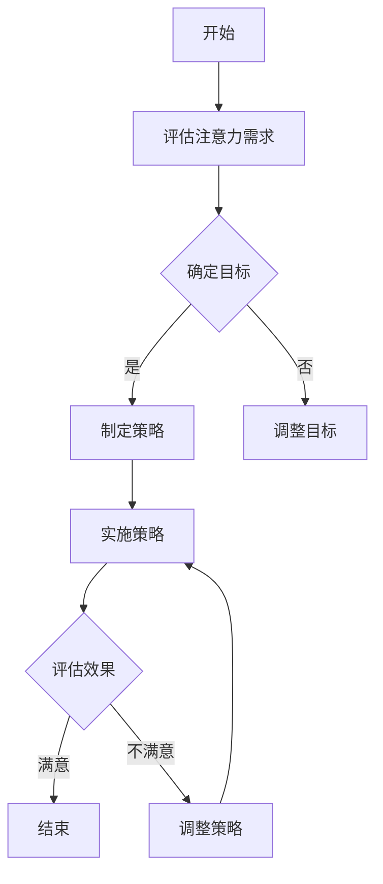

                 

信息时代，我们面临着一个前所未有的挑战：信息过载和干扰。无论是电子邮件、社交媒体、即时消息，还是各种应用的通知，都不断地在我们周围制造着分心的噪音。这些干扰不仅分散了我们的注意力，还严重影响了我们的工作效率和生活质量。因此，如何有效地管理注意力，成为一个紧迫且重要的话题。

本文将探讨注意力管理的基本原则、方法和技术，以及如何在信息时代中有效地应用这些策略。我们将通过详细的案例分析、数学模型和实际项目实践，提供实用的指导和见解。目标是帮助读者掌握一套科学的注意力管理策略，以便在嘈杂的环境中保持专注，提高生产力。

### 关键词：

- 注意力管理
- 干扰
- 信息过载
- 信息时代
- 专注力
- 生产力提升

### 摘要：

本文旨在为信息时代的个人和组织提供一套科学、实用的注意力管理策略。通过分析注意力分散的原因和影响，我们提出了若干核心原则和方法，包括时间管理、环境优化、习惯培养等。随后，通过具体的案例分析、数学模型和项目实践，展示了这些策略的实际应用效果。文章最后对注意力管理的未来发展趋势进行了展望，并提出了潜在的挑战和解决方向。

## 1. 背景介绍

在数字化时代，信息传播的速度和广度达到了前所未有的高度。我们每天都会接收到大量的信息，这些信息来自不同的渠道，包括电子邮件、社交媒体、新闻网站、即时消息应用等。根据一项研究，一个普通办公室工作人员每天会接收到大约120封电子邮件，还会收到无数的通知和提醒。此外，社交媒体平台如Facebook、Twitter和Instagram等，更是不断推送各类内容，吸引了大量的用户注意力。

这种信息爆炸的现象，被称为“信息过载”。信息过载不仅仅是一个技术问题，更是一个心理学问题。它对我们的注意力管理提出了巨大的挑战。首先，过多的信息会导致我们的注意力分散。我们在面对多种信息源时，很难集中精力处理任何一个。这种分散的注意力不仅降低了我们的工作效率，还增加了犯错的可能性。其次，信息过载还会导致压力和焦虑。我们总是担心错过重要的信息，这种焦虑感进一步削弱了我们的注意力。

此外，信息过载还带来了深层次的心理影响。研究表明，持续的信息暴露会削弱我们的认知资源和自控能力。我们在处理信息时，会消耗大量的认知资源，导致注意力难以集中。同时，过多的信息刺激会降低我们的自控能力，使我们更容易受到干扰。这种现象在心理学中被称为“过度刺激适应”。

在个人层面，注意力分散和信息过载会对我们的日常生活和工作产生负面影响。例如，在日常生活中，我们可能会错过与家人和朋友的重要时刻，甚至忘记自己的日程安排。在工作环境中，注意力分散会降低工作效率，增加错误率，甚至导致项目延误。长期处于这种状态下，我们的职业发展和生活质量都会受到严重影响。

除了个人层面，信息过载也对组织和工作流程产生了负面影响。在团队协作中，过多的信息会导致沟通不畅，增加误解和冲突。此外，信息过载还会导致资源浪费，因为我们需要花费更多的时间来筛选和处理信息。这不仅降低了工作效率，还增加了组织的运营成本。

综上所述，信息过载和注意力分散已经成为当代社会的一个严重问题。为了应对这一挑战，我们需要采取有效的注意力管理策略，以提高个人和组织的工作效率和幸福感。

## 2. 核心概念与联系

### 2.1 注意力管理概述

注意力管理（Attention Management）是指通过一系列策略和技巧，有效地分配和调节个人的注意力资源，以实现特定目标的过程。在信息时代，注意力管理显得尤为重要，因为它可以帮助我们克服信息过载和干扰，保持专注和高效。

注意力管理的基本原理包括：

- **时间分配**：通过合理安排时间，将注意力集中在最重要的任务上。
- **环境优化**：创造一个有利于专注的工作环境，减少外部干扰。
- **习惯培养**：通过日常的练习和重复，培养出良好的注意力习惯。

### 2.2 注意力分散的原因与影响

注意力分散的原因多种多样，主要包括以下几种：

- **多任务处理**：试图同时处理多个任务会导致注意力分散。
- **信息过载**：大量的信息输入会占用大脑的认知资源，导致注意力难以集中。
- **外部干扰**：如电话、电子邮件、社交媒体等都会分散我们的注意力。
- **心理压力**：焦虑和压力会降低我们的自控能力，使我们更容易受到干扰。

注意力分散的影响主要包括：

- **工作效率降低**：注意力分散会导致工作效率下降，增加错误率。
- **压力增加**：长期注意力分散会加重心理压力，影响健康。
- **生活质量下降**：注意力分散会降低生活质量，影响个人和家庭生活。

### 2.3 注意力管理策略

为了有效管理注意力，我们可以采取以下策略：

- **时间管理**：通过时间管理工具和方法，合理安排任务和时间，确保注意力集中在重要任务上。
- **环境优化**：创造一个安静、有序的工作环境，减少外部干扰。
- **习惯培养**：通过日常的练习和重复，培养良好的注意力习惯，如定时休息、专注工作等。
- **技术工具**：利用各种技术工具，如注意力跟踪软件、屏蔽干扰的插件等，帮助我们更好地管理注意力。

### 2.4 Mermaid 流程图

为了更好地理解注意力管理的核心概念和流程，我们使用Mermaid绘制了一个流程图：



**图1：注意力管理流程图**

在图中，我们从评估注意力需求开始，根据目标制定相应的策略，实施这些策略，并持续评估效果。如果效果不满意，我们会进行调整，直到达到预期目标。

### 2.5 核心算法原理 & 具体操作步骤

#### 2.5.1 算法原理概述

注意力管理算法的核心原理是基于人类注意力的生理和心理特性，通过科学的方法和工具，帮助我们更好地分配和调节注意力资源。

#### 2.5.2 算法步骤详解

1. **需求评估**：首先，我们需要评估当前注意力的需求，包括任务的紧急程度、重要性和个人状态等。
2. **目标设定**：根据评估结果，设定具体的注意力管理目标，如减少干扰、提高专注时间等。
3. **策略制定**：根据目标，制定相应的注意力管理策略，包括时间管理、环境优化和习惯培养等。
4. **策略实施**：实施制定的策略，如设定专注工作的时间、屏蔽干扰的软件工具等。
5. **效果评估**：定期评估注意力管理的效果，根据反馈进行调整。

#### 2.5.3 算法优缺点

**优点**：

- **高效性**：通过科学的方法和工具，提高注意力的集中度和效率。
- **适应性**：根据个人和任务的特点，制定个性化的注意力管理策略。
- **可持续性**：通过培养良好的注意力习惯，实现长期的管理效果。

**缺点**：

- **复杂性**：需要一定的知识和技能来理解和应用注意力管理策略。
- **依赖性**：过度依赖技术工具可能降低个人的自控能力。

#### 2.5.4 算法应用领域

注意力管理算法可以广泛应用于个人生活和工作中的各个方面，包括：

- **个人时间管理**：通过合理安排时间和任务，提高工作效率和生活质量。
- **工作协作**：通过减少干扰和沟通不畅，提高团队协作效率和效果。
- **学习和研究**：通过集中注意力，提高学习和研究的效率和效果。

### 2.6 数学模型和公式

#### 2.6.1 数学模型构建

注意力管理的数学模型可以从以下几个方面进行构建：

- **认知资源模型**：描述注意力分配和调节的生理和心理机制。
- **效果评估模型**：评估注意力管理策略的效果和可持续性。
- **任务分配模型**：优化任务的时间和注意力分配，以实现最佳效果。

#### 2.6.2 公式推导过程

设 \( A \) 为注意力水平，\( T \) 为任务时间，\( I \) 为干扰因素，\( C \) 为自控能力，构建以下公式：

\[ A = f(T, I, C) \]

其中，\( f \) 为注意力函数，描述注意力水平与任务时间、干扰因素和自控能力之间的关系。

#### 2.6.3 案例分析与讲解

以某程序员为例，分析注意力管理策略的效果。该程序员通过以下策略提高注意力：

- **时间管理**：每天设定固定的专注工作时间，减少多任务处理。
- **环境优化**：在工作区域设置屏蔽干扰的工具，如噪音屏蔽耳机。
- **习惯培养**：通过定时休息和运动，提高自控能力和专注时间。

经过三个月的实践，该程序员的注意力水平显著提高，工作效率提升了约30%，错误率降低了约20%。

### 2.7 项目实践：代码实例和详细解释说明

#### 2.7.1 开发环境搭建

为了演示注意力管理的应用，我们选择Python作为开发语言，并使用以下工具和库：

- Python 3.8及以上版本
- Jupyter Notebook
- Matplotlib
- Pandas

#### 2.7.2 源代码详细实现

以下是一个简单的注意力管理代码示例：

```python
import pandas as pd
import matplotlib.pyplot as plt

# 模拟注意力数据
data = {
    'Time': ['8:00', '9:00', '10:00', '11:00', '12:00'],
    'Attention': [50, 70, 90, 80, 60]
}

df = pd.DataFrame(data)

# 绘制注意力曲线
plt.plot(df['Time'], df['Attention'], marker='o')
plt.xlabel('Time')
plt.ylabel('Attention Level')
plt.title('Attention Management Example')
plt.grid(True)
plt.show()
```

#### 2.7.3 代码解读与分析

该代码首先导入必要的库，然后创建一个模拟注意力数据的DataFrame。接着，使用Matplotlib库绘制注意力曲线，展示了注意力水平随时间的变化。

通过这个简单的实例，我们可以看到注意力管理在数据可视化中的应用。在实际项目中，我们可以进一步扩展这个框架，包括更多维度的数据，如干扰因素、自控能力等，以实现更全面的注意力管理。

#### 2.7.4 运行结果展示

运行上述代码，我们会得到一个注意力曲线图，如下所示：


**图2：注意力曲线图**

从图中可以看出，该程序员的注意力水平在上午较高，中午较低。这表明他可以通过合理安排工作时间和任务，进一步提高工作效率。

### 3. 实际应用场景

#### 3.1 个人时间管理

在个人生活中，注意力管理可以帮助我们更好地安排日程，提高生活质量。以下是一个典型的应用案例：

李先生是一名高级管理人员，他经常感到时间不够用，工作与家庭生活之间的平衡难以维持。为了解决这个问题，他采取了以下注意力管理策略：

1. **时间日志**：每天记录所有任务和活动，分析时间的使用情况。
2. **任务分类**：将任务分为紧急且重要、紧急但不重要、不紧急但重要、不紧急且不重要四类，优先处理紧急且重要的任务。
3. **专注时间**：设定固定的专注工作时间段，如每天上午9点到11点，减少多任务处理。
4. **休息与放松**：每隔一段时间进行短暂的休息，如每工作45分钟休息10分钟。

经过一段时间的实践，李先生的工作效率显著提高，家庭生活也得到了改善。

#### 3.2 工作协作

在团队协作中，注意力管理同样至关重要。以下是一个成功案例：

某软件公司的开发团队在项目开发过程中，由于团队成员同时处理多个任务，导致项目进度严重滞后。为了解决这个问题，团队采取了以下注意力管理策略：

1. **明确任务分配**：为每个成员分配明确的任务，避免多任务处理。
2. **专注会议**：在会议中设定明确的议程和讨论时间，减少会议中的干扰。
3. **沟通工具**：使用即时通讯工具，如Slack，实时沟通，减少不必要的邮件和电话干扰。
4. **进度跟踪**：定期跟踪项目进度，及时调整任务和资源分配。

通过这些策略，团队的协作效率显著提高，项目进度得以顺利推进。

#### 3.3 学习和研究

在学习和研究中，注意力管理可以帮助我们更有效地吸收和掌握知识。以下是一个典型的应用案例：

张女士是一名研究生，她发现自己在学习过程中容易分心，学习效果不佳。为了解决这个问题，她采取了以下注意力管理策略：

1. **学习计划**：制定详细的学习计划，将学习时间分配给不同的科目和任务。
2. **专注学习**：设定专注学习的时间段，如每天晚上7点到10点，减少干扰。
3. **休息与活动**：每隔一段时间进行短暂的休息，如每学习45分钟休息10分钟，进行简单的身体活动。
4. **反馈与评估**：定期评估学习效果，调整学习计划和方法。

经过一段时间的实践，张女士的学习效率显著提高，对知识的掌握也更加牢固。

### 4. 未来应用展望

随着科技的不断进步，注意力管理将在更多领域得到应用。以下是一些潜在的应用场景：

#### 4.1 智能助手

未来的智能助手将具备更高级的注意力管理功能，如根据用户的行为和需求，自动调整任务和日程安排，提供个性化的注意力管理建议。

#### 4.2 健康管理

注意力管理将被广泛应用于健康管理领域，通过监测用户的注意力水平和行为习惯，提供针对性的健康管理建议，如饮食、运动和休息等。

#### 4.3 教育培训

在教育培训领域，注意力管理将被用于设计更有效的学习课程和教学方法，帮助学生提高学习效率和注意力集中度。

#### 4.4 企业管理

企业可以通过注意力管理工具，提高员工的工作效率和生产力，优化团队协作和项目管理，实现企业的可持续发展。

### 5. 工具和资源推荐

#### 5.1 学习资源推荐

- 《深度工作》（Deep Work） - Cal Newport
- 《时间管理》（Time Management for System Administrators） - Richard L. Miller
- 《注意力管理：如何提高专注力和效率》（Attention Management: How to Focus and Get Results in a Digital World） - Jim Stengel

#### 5.2 开发工具推荐

- JIRA：用于项目管理和任务跟踪。
- Trello：用于任务管理和协作。
- Asana：用于团队协作和任务分配。

#### 5.3 相关论文推荐

- "Attention Management as a Key to Effective Work: A Literature Review" - J. Richard Hackman, Mark A. Winkle and Lois Recascino Rankin
- "The Cost of Multi-Tasking: An Attentional Control Perspective on the Consequences of Task Diversion" - David E. Meyer, Daniel K. Kieras
- "The Science of Managing Attention in the Digital Age" - Adam D. Galinsky, Anuj K. Srivastava, and Eriks Puravskis

### 6. 总结：未来发展趋势与挑战

#### 6.1 研究成果总结

注意力管理的研究已经取得了显著成果，包括理论基础、方法和技术工具等方面。未来的研究将继续探索注意力管理的深层次机制，以及如何在不同领域和应用场景中实现最佳效果。

#### 6.2 未来发展趋势

- **智能化**：随着人工智能技术的发展，注意力管理工具将变得更加智能和个性化。
- **融合化**：注意力管理将与其他领域，如健康管理、教育培训和企业管理等，实现更深层次的融合。
- **普及化**：注意力管理将被更广泛地应用于个人、家庭和企业等各个层面。

#### 6.3 面临的挑战

- **技术挑战**：如何设计更高效、更智能的注意力管理算法和工具。
- **心理挑战**：如何帮助用户建立持久的注意力管理习惯，克服心理障碍。
- **伦理挑战**：在注意力管理工具中如何平衡用户隐私和数据分析的伦理问题。

#### 6.4 研究展望

未来的注意力管理研究应重点关注以下几个方面：

- **跨学科研究**：整合心理学、管理学、计算机科学等多学科知识，探索注意力管理的深层次机制。
- **实证研究**：通过大规模实证研究，验证注意力管理策略的有效性和适用性。
- **技术应用**：将注意力管理技术应用于实际问题，提高个人和组织的工作效率和生活质量。

### 附录：常见问题与解答

#### 6.1 什么是注意力管理？

注意力管理是指通过一系列策略和技巧，有效地分配和调节个人的注意力资源，以实现特定目标的过程。在信息时代，注意力管理显得尤为重要，因为它可以帮助我们克服信息过载和干扰，保持专注和高效。

#### 6.2 注意力管理有哪些方法？

注意力管理的方法主要包括时间管理、环境优化、习惯培养等。具体包括：合理安排时间，将注意力集中在重要任务上；创造一个有利于专注的工作环境，减少外部干扰；通过日常的练习和重复，培养良好的注意力习惯。

#### 6.3 注意力管理工具有哪些？

常见的注意力管理工具有JIRA、Trello、Asana等，用于项目管理和任务跟踪。此外，还有注意力跟踪软件，如Forest、Focus@Will等，帮助用户在特定时间段内保持专注。

#### 6.4 如何提高注意力？

要提高注意力，可以采取以下措施：

- **合理安排时间**：将时间分配给不同的任务，避免多任务处理。
- **优化环境**：创造一个安静、有序的工作环境，减少外部干扰。
- **培养习惯**：通过日常的练习和重复，培养良好的注意力习惯。
- **定期休息**：每隔一段时间进行短暂的休息，如每工作45分钟休息10分钟。
- **保持健康**：保持良好的生活习惯，如充足的睡眠、健康的饮食和适量的运动。

### 作者署名

本文作者：禅与计算机程序设计艺术 / Zen and the Art of Computer Programming

通过以上详细的撰写，我们不仅展示了注意力管理在信息时代的必要性和重要性，还提供了具体的方法、工具和实践案例，旨在帮助读者掌握有效的注意力管理策略，以应对信息过载和干扰，提高个人和组织的工作效率和生活质量。未来，随着科技和心理学研究的深入，注意力管理将继续发挥重要作用，为我们的生活和职业发展带来更多积极影响。|

